# 元素渲染器

<cite>
**本文引用的文件**
- [BaseTextElement.tsx](file://components/slide-renderer/components/element/TextElement/BaseTextElement.tsx)
- [BaseImageElement.tsx](file://components/slide-renderer/components/element/ImageElement/BaseImageElement.tsx)
- [BaseShapeElement.tsx](file://components/slide-renderer/components/element/ShapeElement/BaseShapeElement.tsx)
- [BaseTableElement.tsx](file://components/slide-renderer/components/element/TableElement/BaseTableElement.tsx)
- [BaseVideoElement.tsx](file://components/slide-renderer/components/element/VideoElement/BaseVideoElement.tsx)
- [BaseLatexElement.tsx](file://components/slide-renderer/components/element/LatexElement/BaseLatexElement.tsx)
- [BaseLineElement.tsx](file://components/slide-renderer/components/element/LineElement/BaseLineElement.tsx)
- [BaseChartElement.tsx](file://components/slide-renderer/components/element/ChartElement/BaseChartElement.tsx)
- [useElementFill.ts](file://components/slide-renderer/components/element/hooks/useElementFill.ts)
- [useElementShadow.ts](file://components/slide-renderer/components/element/hooks/useElementShadow.ts)
- [useElementOutline.ts](file://components/slide-renderer/components/element/hooks/useElementOutline.ts)
- [slides.ts](file://lib/types/slides.ts)
- [ElementOutline.tsx](file://components/slide-renderer/components/element/ElementOutline.tsx)
- [StaticTable.tsx](file://components/slide-renderer/components/element/TableElement/StaticTable.tsx)
- [Chart.tsx](file://components/slide-renderer/components/element/ChartElement/Chart.tsx)
- [GradientDefs.tsx](file://components/slide-renderer/components/element/ShapeElement/GradientDefs.tsx)
- [PatternDefs.tsx](file://components/slide-renderer/components/element/ShapeElement/PatternDefs.tsx)
- [useClipImage.ts](file://components/slide-renderer/components/element/ImageElement/useClipImage.ts)
- [useFilter.ts](file://components/slide-renderer/components/element/ImageElement/useFilter.ts)
- [image-rect-outline.tsx](file://components/slide-renderer/components/element/ImageElement/ImageOutline/image-rect-outline.tsx)
- [image-ellipse-outline.tsx](file://components/slide-renderer/components/element/ImageElement/ImageOutline/image-ellipse-outline.tsx)
- [image-polygon-outline.tsx](file://components/slide-renderer/components/element/ImageElement/ImageOutline/image-polygon-outline.tsx)
- [index.tsx](file://components/slide-renderer/components/element/index.tsx)
- [canvas.tsx](file://components/slide-renderer/Editor/Canvas/index.tsx)
</cite>

## 目录
1. [简介](#简介)
2. [项目结构](#项目结构)
3. [核心组件](#核心组件)
4. [架构总览](#架构总览)
5. [详细组件分析](#详细组件分析)
6. [依赖关系分析](#依赖关系分析)
7. [性能考量](#性能考量)
8. [故障排查指南](#故障排查指南)
9. [结论](#结论)
10. [附录](#附录)

## 简介
本文件系统性梳理 OpenMAIC 中“元素渲染器”体系，围绕文本、图片、形状、表格、视频、图表、LaTeX 公式与线条等元素的基类设计、继承与差异化实现进行深入解析。文档重点覆盖：
- 元素类型与数据模型（PPTElement 及其子类型）
- 统一样式钩子（填充、阴影、描边）与通用外观处理
- 各元素的渲染参数、样式属性与交互行为
- 生命周期管理（创建、更新、删除、序列化）
- 层级与 z-index 控制机制
- 样式统一处理（边框、阴影、渐变、滤镜）
- 扩展开发指南（新增元素类型与自定义渲染逻辑）

## 项目结构
元素渲染器位于“演示文稿编辑器”的“屏幕画布”子系统中，采用按元素类型分层组织的组件结构，并通过统一的样式钩子与通用外观组件实现一致的视觉与交互体验。

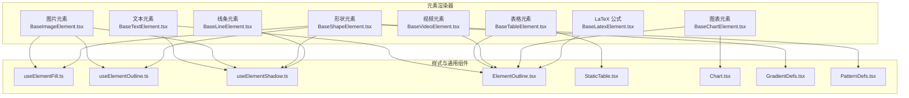

**图表来源**
- [BaseTextElement.tsx:16-63](file://components/slide-renderer/components/element/TextElement/BaseTextElement.tsx#L16-L63)
- [BaseImageElement.tsx:23-156](file://components/slide-renderer/components/element/ImageElement/BaseImageElement.tsx#L23-L156)
- [BaseShapeElement.tsx:18-118](file://components/slide-renderer/components/element/ShapeElement/BaseShapeElement.tsx#L18-L118)
- [BaseTableElement.tsx:14-35](file://components/slide-renderer/components/element/TableElement/BaseTableElement.tsx#L14-L35)
- [BaseVideoElement.tsx:26-192](file://components/slide-renderer/components/element/VideoElement/BaseVideoElement.tsx#L26-L192)
- [BaseLatexElement.tsx:14-62](file://components/slide-renderer/components/element/LatexElement/BaseLatexElement.tsx#L14-L62)
- [BaseLineElement.tsx:21-146](file://components/slide-renderer/components/element/LineElement/BaseLineElement.tsx#L21-L146)
- [useElementFill.ts:10-20](file://components/slide-renderer/components/element/hooks/useElementFill.ts#L10-L20)
- [useElementOutline.ts:9-31](file://components/slide-renderer/components/element/hooks/useElementOutline.ts#L9-L31)
- [useElementShadow.ts:9-21](file://components/slide-renderer/components/element/hooks/useElementShadow.ts#L9-L21)
- [ElementOutline.tsx](file://components/slide-renderer/components/element/ElementOutline.tsx)
- [StaticTable.tsx](file://components/slide-renderer/components/element/TableElement/StaticTable.tsx)
- [Chart.tsx](file://components/slide-renderer/components/element/ChartElement/Chart.tsx)
- [GradientDefs.tsx](file://components/slide-renderer/components/element/ShapeElement/GradientDefs.tsx)
- [PatternDefs.tsx](file://components/slide-renderer/components/element/ShapeElement/PatternDefs.tsx)

**章节来源**
- [BaseTextElement.tsx:16-63](file://components/slide-renderer/components/element/TextElement/BaseTextElement.tsx#L16-L63)
- [BaseImageElement.tsx:23-156](file://components/slide-renderer/components/element/ImageElement/BaseImageElement.tsx#L23-L156)
- [BaseShapeElement.tsx:18-118](file://components/slide-renderer/components/element/ShapeElement/BaseShapeElement.tsx#L18-L118)
- [BaseTableElement.tsx:14-35](file://components/slide-renderer/components/element/TableElement/BaseTableElement.tsx#L14-L35)
- [BaseVideoElement.tsx:26-192](file://components/slide-renderer/components/element/VideoElement/BaseVideoElement.tsx#L26-L192)
- [BaseLatexElement.tsx:14-62](file://components/slide-renderer/components/element/LatexElement/BaseLatexElement.tsx#L14-L62)
- [BaseLineElement.tsx:21-146](file://components/slide-renderer/components/element/LineElement/BaseLineElement.tsx#L21-L146)

## 核心组件
- 元素类型与数据模型：通过统一的 PPTElement 联合类型与各子接口（文本、图片、形状、表格、视频、图表、LaTeX、线条）定义元素的结构与渲染参数。
- 样式钩子：useElementFill、useElementOutline、useElementShadow 提供统一的样式计算与复用，确保不同元素在外观上的一致性。
- 通用外观组件：ElementOutline 用于统一渲染元素边框；GradientDefs/PatternDefs 用于形状元素的渐变与图案填充。
- 元素基类：各元素类型均提供 BaseXxxElement 组件，负责定位、旋转、阴影、边框、内容渲染等通用逻辑。

**章节来源**
- [slides.ts:25-35](file://lib/types/slides.ts#L25-L35)
- [slides.ts:183-197](file://lib/types/slides.ts#L183-L197)
- [slides.ts:295-308](file://lib/types/slides.ts#L295-L308)
- [slides.ts:379-396](file://lib/types/slides.ts#L379-L396)
- [slides.ts:576-583](file://lib/types/slides.ts#L576-L583)
- [slides.ts:606-616](file://lib/types/slides.ts#L606-L616)
- [slides.ts:631-637](file://lib/types/slides.ts#L631-L637)
- [slides.ts:425-437](file://lib/types/slides.ts#L425-L437)
- [slides.ts:473-483](file://lib/types/slides.ts#L473-L483)
- [useElementFill.ts:10-20](file://components/slide-renderer/components/element/hooks/useElementFill.ts#L10-L20)
- [useElementOutline.ts:9-31](file://components/slide-renderer/components/element/hooks/useElementOutline.ts#L9-L31)
- [useElementShadow.ts:9-21](file://components/slide-renderer/components/element/hooks/useElementShadow.ts#L9-L21)
- [ElementOutline.tsx](file://components/slide-renderer/components/element/ElementOutline.tsx)

## 架构总览
元素渲染器采用“数据驱动 + 组件化”的架构模式：
- 数据层：PPTElement 及其子类型定义元素的结构与渲染参数。
- 渲染层：各 BaseXxxElement 负责将数据映射为 DOM/SVG 结构，并应用样式钩子与通用外观组件。
- 交互层：部分元素（如视频）通过外部状态（store）驱动播放/暂停等行为。
- 生命周期：Canvas/Editor 负责元素的创建、更新、删除与序列化，元素自身只关注渲染。

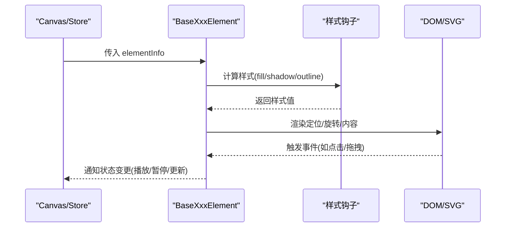

[此图为概念流程示意，不直接对应具体源码文件，故不附加图表来源]

## 详细组件分析

### 文本元素（BaseTextElement）
- 定位与旋转：通过绝对定位与 rotate 包装实现位置与旋转。
- 内容渲染：使用受控 HTML 片段插入，支持竖排文本与段落间距。
- 样式应用：填充色、不透明度、阴影、行高、字间距、颜色、字体、文字阴影等。
- 外观组件：ElementOutline 统一边框渲染。
- 交互：根据目标场景（如缩略图）禁用交互。

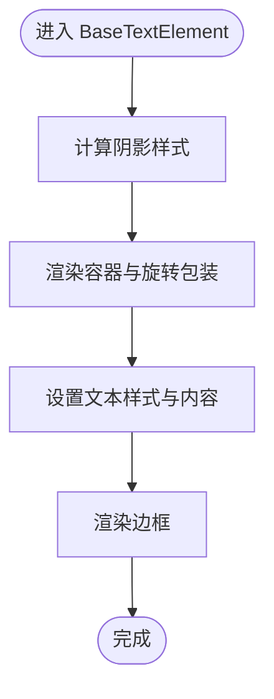

**图表来源**
- [BaseTextElement.tsx:16-63](file://components/slide-renderer/components/element/TextElement/BaseTextElement.tsx#L16-L63)
- [ElementOutline.tsx](file://components/slide-renderer/components/element/ElementOutline.tsx)

**章节来源**
- [BaseTextElement.tsx:16-63](file://components/slide-renderer/components/element/TextElement/BaseTextElement.tsx#L16-L63)
- [slides.ts:183-197](file://lib/types/slides.ts#L183-L197)

### 图片元素（BaseImageElement）
- 资源解析：优先使用媒体生成任务完成后的对象 URL，否则回退到原始 src。
- 状态管理：占位符（placeholder）在不同阶段显示骨架、错误或禁用提示。
- 样式与效果：阴影（drop-shadow）、翻转、裁剪（clipPath）、滤镜、颜色蒙版。
- 外观组件：多种图像轮廓（矩形/椭圆/多边形）。
- 交互：错误态支持重试；禁用态显示提示。

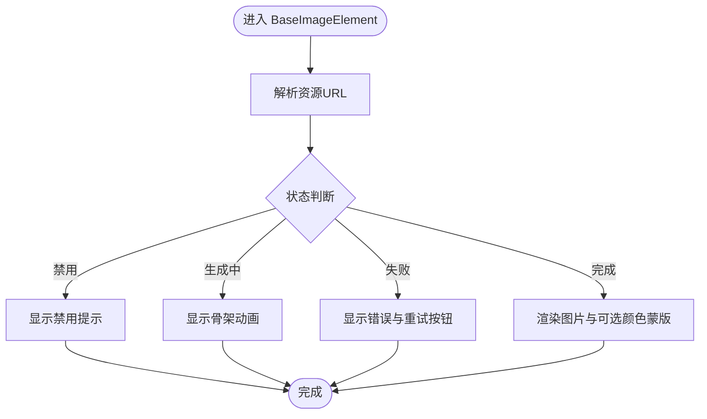

**图表来源**
- [BaseImageElement.tsx:23-156](file://components/slide-renderer/components/element/ImageElement/BaseImageElement.tsx#L23-L156)
- [useClipImage.ts](file://components/slide-renderer/components/element/ImageElement/useClipImage.ts)
- [useFilter.ts](file://components/slide-renderer/components/element/ImageElement/useFilter.ts)
- [image-rect-outline.tsx](file://components/slide-renderer/components/element/ImageElement/ImageOutline/image-rect-outline.tsx)
- [image-ellipse-outline.tsx](file://components/slide-renderer/components/element/ImageElement/ImageOutline/image-ellipse-outline.tsx)
- [image-polygon-outline.tsx](file://components/slide-renderer/components/element/ImageElement/ImageOutline/image-polygon-outline.tsx)

**章节来源**
- [BaseImageElement.tsx:23-156](file://components/slide-renderer/components/element/ImageElement/BaseImageElement.tsx#L23-L156)
- [slides.ts:295-308](file://lib/types/slides.ts#L295-L308)

### 形状元素（BaseShapeElement）
- 几何与路径：基于 viewBox 与 path 进行缩放与绘制。
- 填充策略：优先图案/渐变，其次纯色；渐变与图案通过 defs 注入。
- 文本内嵌：支持形状内的文本内容与对齐方式。
- 样式：描边宽度/颜色/虚线样式、阴影、翻转、不透明度。

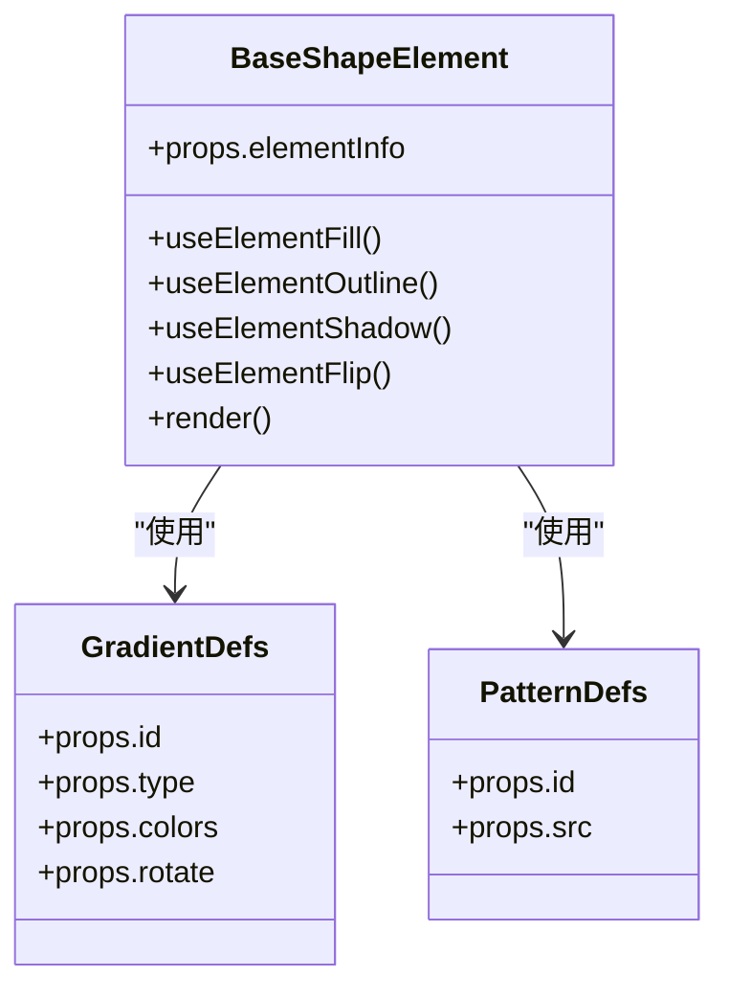

**图表来源**
- [BaseShapeElement.tsx:18-118](file://components/slide-renderer/components/element/ShapeElement/BaseShapeElement.tsx#L18-L118)
- [GradientDefs.tsx](file://components/slide-renderer/components/element/ShapeElement/GradientDefs.tsx)
- [PatternDefs.tsx](file://components/slide-renderer/components/element/ShapeElement/PatternDefs.tsx)
- [useElementFill.ts:10-20](file://components/slide-renderer/components/element/hooks/useElementFill.ts#L10-L20)
- [useElementOutline.ts:9-31](file://components/slide-renderer/components/element/hooks/useElementOutline.ts#L9-L31)
- [useElementShadow.ts:9-21](file://components/slide-renderer/components/element/hooks/useElementShadow.ts#L9-L21)

**章节来源**
- [BaseShapeElement.tsx:18-118](file://components/slide-renderer/components/element/ShapeElement/BaseShapeElement.tsx#L18-L118)
- [slides.ts:379-396](file://lib/types/slides.ts#L379-L396)

### 表格元素（BaseTableElement）
- 内容渲染：委托 StaticTable 进行表格结构与样式的渲染。
- 外观：ElementOutline 统一边框。
- 交互：根据目标场景（如缩略图）禁用交互。

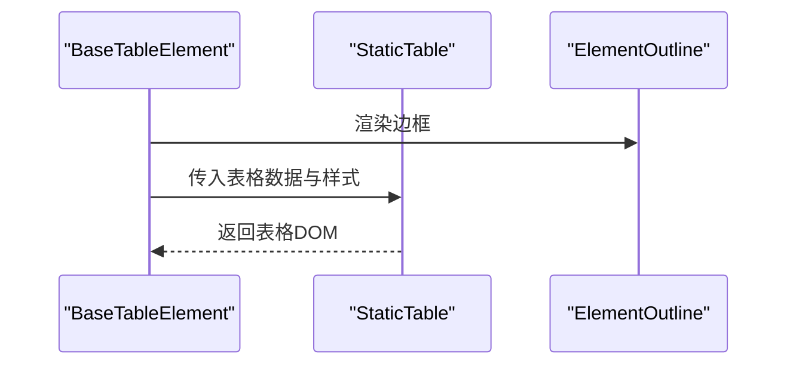

**图表来源**
- [BaseTableElement.tsx:14-35](file://components/slide-renderer/components/element/TableElement/BaseTableElement.tsx#L14-L35)
- [StaticTable.tsx](file://components/slide-renderer/components/element/TableElement/StaticTable.tsx)
- [ElementOutline.tsx](file://components/slide-renderer/components/element/ElementOutline.tsx)

**章节来源**
- [BaseTableElement.tsx:14-35](file://components/slide-renderer/components/element/TableElement/BaseTableElement.tsx#L14-L35)
- [slides.ts:576-583](file://lib/types/slides.ts#L576-L583)

### 视频元素（BaseVideoElement）
- 播放控制：通过 Canvas Store 的 playingVideoElementId 精确控制播放/暂停。
- 状态反馈：占位符在不同阶段显示骨架、错误或禁用提示；错误时提供重试按钮。
- 动画反馈：播放时触发轻微缩放动画，增强交互反馈。
- 事件处理：自动结束时停止播放。

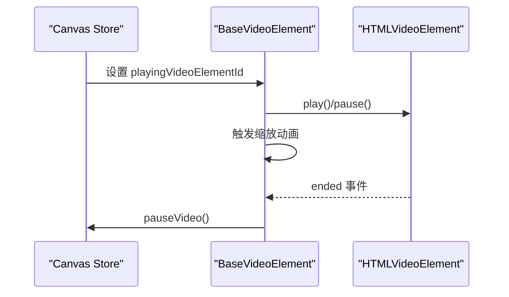

**图表来源**
- [BaseVideoElement.tsx:26-192](file://components/slide-renderer/components/element/VideoElement/BaseVideoElement.tsx#L26-L192)

**章节来源**
- [BaseVideoElement.tsx:26-192](file://components/slide-renderer/components/element/VideoElement/BaseVideoElement.tsx#L26-L192)
- [slides.ts:631-637](file://lib/types/slides.ts#L631-L637)

### 图表元素（BaseChartElement）
- 内容渲染：委托 Chart 组件进行具体图表绘制。
- 外观：ElementOutline 统一边框；支持背景填充。
- 主题与样式：主题色、文本颜色、网格颜色、选项等。

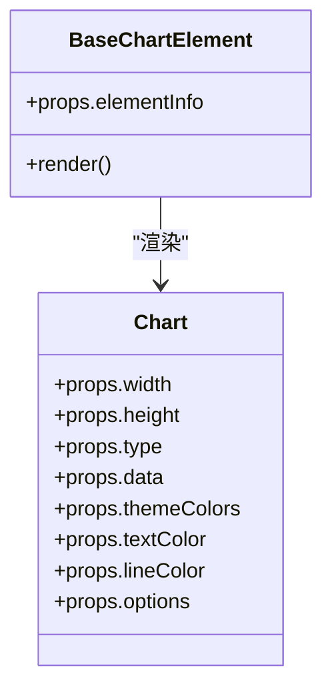

**图表来源**
- [BaseChartElement.tsx:15-55](file://components/slide-renderer/components/element/ChartElement/BaseChartElement.tsx#L15-L55)
- [Chart.tsx](file://components/slide-renderer/components/element/ChartElement/Chart.tsx)

**章节来源**
- [BaseChartElement.tsx:15-55](file://components/slide-renderer/components/element/ChartElement/BaseChartElement.tsx#L15-L55)
- [slides.ts:473-483](file://lib/types/slides.ts#L473-L483)

### LaTeX 公式（BaseLatexElement）
- 渲染策略：优先使用 KaTeX HTML；若无则回退到旧版 SVG 路径。
- 缩放适配：根据容器尺寸动态计算缩放比例，保证内容完整显示。
- 对齐方式：支持左/中/右对齐。

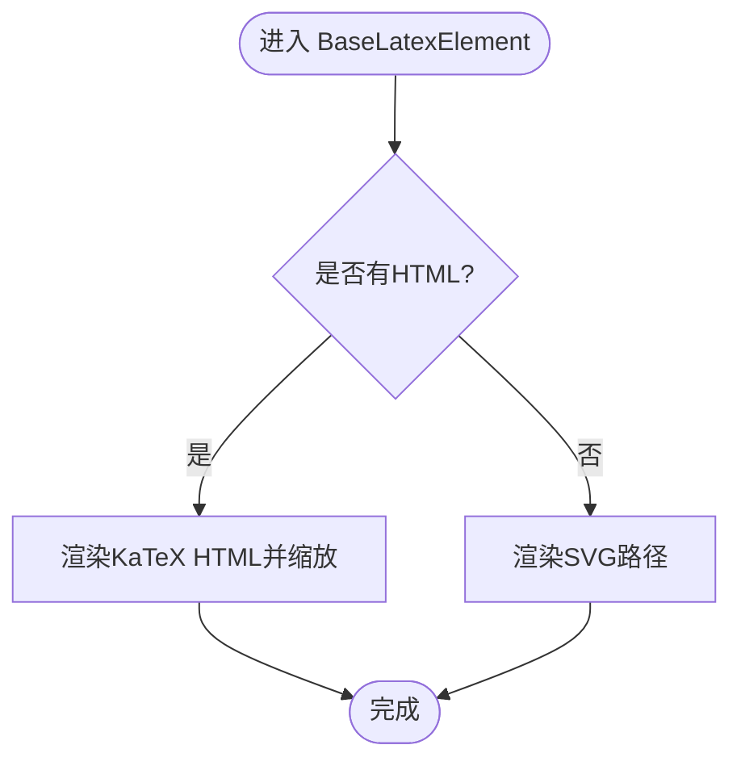

**图表来源**
- [BaseLatexElement.tsx:14-62](file://components/slide-renderer/components/element/LatexElement/BaseLatexElement.tsx#L14-L62)

**章节来源**
- [BaseLatexElement.tsx:14-62](file://components/slide-renderer/components/element/LatexElement/BaseLatexElement.tsx#L14-L62)
- [slides.ts:606-616](file://lib/types/slides.ts#L606-L616)

### 线条元素（BaseLineElement）
- 路径生成：通过工具函数根据起点、终点与可选控制点生成 SVG 路径。
- 样式：颜色、宽度、虚线/点线样式；端点标记（箭头/圆点）。
- 动画：可选的描边绘制动画，首帧隐藏路径并通过过渡实现绘制效果。

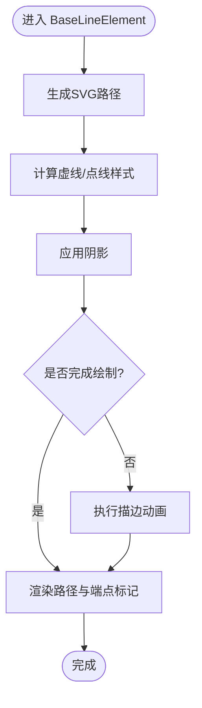

**图表来源**
- [BaseLineElement.tsx:21-146](file://components/slide-renderer/components/element/LineElement/BaseLineElement.tsx#L21-L146)

**章节来源**
- [BaseLineElement.tsx:21-146](file://components/slide-renderer/components/element/LineElement/BaseLineElement.tsx#L21-L146)
- [slides.ts:425-437](file://lib/types/slides.ts#L425-L437)

## 依赖关系分析
- 元素基类依赖统一的样式钩子与通用外观组件，降低重复代码并提升一致性。
- 图片与形状元素引入更多复杂度（滤镜、裁剪、渐变/图案），但通过独立模块化实现解耦。
- 视频元素与 Canvas Store 强耦合，体现“渲染器只负责展示，状态由外部管理”的设计原则。

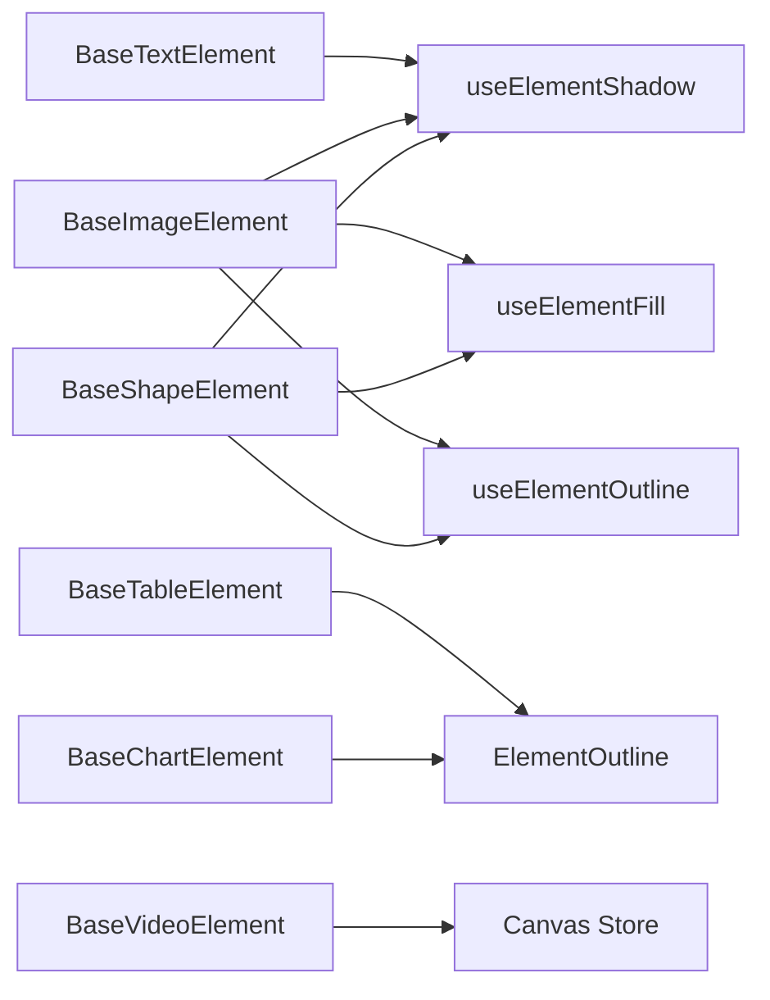

**图表来源**
- [BaseTextElement.tsx:16-63](file://components/slide-renderer/components/element/TextElement/BaseTextElement.tsx#L16-L63)
- [BaseImageElement.tsx:23-156](file://components/slide-renderer/components/element/ImageElement/BaseImageElement.tsx#L23-L156)
- [BaseShapeElement.tsx:18-118](file://components/slide-renderer/components/element/ShapeElement/BaseShapeElement.tsx#L18-L118)
- [BaseTableElement.tsx:14-35](file://components/slide-renderer/components/element/TableElement/BaseTableElement.tsx#L14-L35)
- [BaseChartElement.tsx:15-55](file://components/slide-renderer/components/element/ChartElement/BaseChartElement.tsx#L15-L55)
- [BaseVideoElement.tsx:26-192](file://components/slide-renderer/components/element/VideoElement/BaseVideoElement.tsx#L26-L192)
- [useElementFill.ts:10-20](file://components/slide-renderer/components/element/hooks/useElementFill.ts#L10-L20)
- [useElementOutline.ts:9-31](file://components/slide-renderer/components/element/hooks/useElementOutline.ts#L9-L31)
- [useElementShadow.ts:9-21](file://components/slide-renderer/components/element/hooks/useElementShadow.ts#L9-L21)
- [ElementOutline.tsx](file://components/slide-renderer/components/element/ElementOutline.tsx)

**章节来源**
- [useElementFill.ts:10-20](file://components/slide-renderer/components/element/hooks/useElementFill.ts#L10-L20)
- [useElementOutline.ts:9-31](file://components/slide-renderer/components/element/hooks/useElementOutline.ts#L9-L31)
- [useElementShadow.ts:9-21](file://components/slide-renderer/components/element/hooks/useElementShadow.ts#L9-L21)

## 性能考量
- 按需渲染：图片与视频在占位符状态下延迟加载真实资源，减少初始渲染压力。
- 样式钩子缓存：useMemo 将样式计算结果缓存，避免重复计算。
- SVG 渲染优化：形状元素通过 viewBox 与缩放矩阵控制路径绘制，减少重绘。
- 动画控制：线条描边动画仅在必要时启用，且动画完成后恢复样式，避免持续开销。

[本节为通用指导，不直接分析具体文件，故不附加章节来源]

## 故障排查指南
- 图片/视频占位符问题
  - 现象：显示骨架或禁用提示。
  - 排查：检查媒体生成任务状态与当前课堂上下文；确认是否开启相应生成功能。
  - 参考
    - [BaseImageElement.tsx:30-50](file://components/slide-renderer/components/element/ImageElement/BaseImageElement.tsx#L30-L50)
    - [BaseVideoElement.tsx:33-50](file://components/slide-renderer/components/element/VideoElement/BaseVideoElement.tsx#L33-L50)
- 图片滤镜/裁剪异常
  - 现象：滤镜或裁剪未生效。
  - 排查：确认 filters 与 clip 参数是否正确传入；检查 useFilter 与 useClipImage 的返回值。
  - 参考
    - [BaseImageElement.tsx:27-28](file://components/slide-renderer/components/element/ImageElement/BaseImageElement.tsx#L27-L28)
    - [useFilter.ts](file://components/slide-renderer/components/element/ImageElement/useFilter.ts)
    - [useClipImage.ts](file://components/slide-renderer/components/element/ImageElement/useClipImage.ts)
- 形状渐变/图案不显示
  - 现象：填充为纯色而非预期渐变/图案。
  - 排查：确认 GradientDefs/PatternDefs 的 id 与 useElementFill 的 source 是否匹配。
  - 参考
    - [BaseShapeElement.tsx:61-73](file://components/slide-renderer/components/element/ShapeElement/BaseShapeElement.tsx#L61-L73)
    - [useElementFill.ts:10-20](file://components/slide-renderer/components/element/hooks/useElementFill.ts#L10-L20)
- 视频无法播放
  - 现象：点击无响应或报错。
  - 排查：确认 Canvas Store 的 playingVideoElementId 是否正确；检查浏览器自动播放限制与用户手势要求。
  - 参考
    - [BaseVideoElement.tsx:28-85](file://components/slide-renderer/components/element/VideoElement/BaseVideoElement.tsx#L28-L85)

**章节来源**
- [BaseImageElement.tsx:30-50](file://components/slide-renderer/components/element/ImageElement/BaseImageElement.tsx#L30-L50)
- [BaseVideoElement.tsx:28-85](file://components/slide-renderer/components/element/VideoElement/BaseVideoElement.tsx#L28-L85)
- [BaseShapeElement.tsx:61-73](file://components/slide-renderer/components/element/ShapeElement/BaseShapeElement.tsx#L61-L73)
- [useElementFill.ts:10-20](file://components/slide-renderer/components/element/hooks/useElementFill.ts#L10-L20)

## 结论
元素渲染器通过统一的数据模型与样式钩子，实现了跨元素的一致外观与高效渲染。各元素在保持通用逻辑的同时，针对自身特性提供差异化实现，既保证了扩展性，也维持了良好的性能与可维护性。建议在新增元素类型时遵循现有模式：定义数据结构、提供 BaseXxxElement、复用样式钩子与通用外观组件，并在 Canvas/Store 中完善生命周期与状态管理。

[本节为总结性内容，不直接分析具体文件，故不附加章节来源]

## 附录

### 元素生命周期管理（创建/更新/删除/序列化）
- 创建：Canvas/Editor 在初始化或新增操作时构造 elementInfo，传入对应 BaseXxxElement。
- 更新：elementInfo 改变时，React 依据 key/id 触发重新渲染；复杂元素（如视频）通过 Store 状态联动。
- 删除：从元素列表移除对应项，组件卸载。
- 序列化：Canvas/Editor 将元素数组转换为持久化格式，包含所有渲染所需字段。

**章节来源**
- [canvas.tsx](file://components/slide-renderer/Editor/Canvas/index.tsx)
- [slides.ts:666-675](file://lib/types/slides.ts#L666-L675)

### 层级管理与 z-index 控制
- 当前实现：元素通过绝对定位与层级顺序（数组索引）决定前后关系。
- 建议：若需更精细控制，可在元素数据中引入 zIndex 字段，并在渲染容器中应用。

**章节来源**
- [BaseTextElement.tsx:20-27](file://components/slide-renderer/components/element/TextElement/BaseTextElement.tsx#L20-L27)
- [BaseImageElement.tsx:53-60](file://components/slide-renderer/components/element/ImageElement/BaseImageElement.tsx#L53-L60)
- [BaseShapeElement.tsx:32-39](file://components/slide-renderer/components/element/ShapeElement/BaseShapeElement.tsx#L32-L39)

### 样式统一处理清单
- 边框：useElementOutline 计算宽度/样式/颜色与虚线/点线 dash 数组。
- 阴影：useElementShadow 将阴影对象转换为 CSS drop-shadow 字符串。
- 渐变/图案：BaseShapeElement 注入 GradientDefs/PatternDefs，useElementFill 返回对应 URL。
- 滤镜：BaseImageElement 使用 useFilter 计算滤镜字符串。

**章节来源**
- [useElementOutline.ts:9-31](file://components/slide-renderer/components/element/hooks/useElementOutline.ts#L9-L31)
- [useElementShadow.ts:9-21](file://components/slide-renderer/components/element/hooks/useElementShadow.ts#L9-L21)
- [useElementFill.ts:10-20](file://components/slide-renderer/components/element/hooks/useElementFill.ts#L10-L20)
- [BaseImageElement.tsx:27-28](file://components/slide-renderer/components/element/ImageElement/BaseImageElement.tsx#L27-L28)
- [BaseShapeElement.tsx:61-73](file://components/slide-renderer/components/element/ShapeElement/BaseShapeElement.tsx#L61-L73)

### 扩展开发指南（新增元素类型）
- 步骤
  1) 定义数据结构：在 PPTElement 联合类型中新增子接口，明确渲染参数与默认值。
     - 参考：[slides.ts:666-675](file://lib/types/slides.ts#L666-L675)
  2) 实现 BaseXxxElement：负责定位、旋转、内容渲染与通用外观。
     - 参考：[BaseTextElement.tsx:16-63](file://components/slide-renderer/components/element/TextElement/BaseTextElement.tsx#L16-L63)
  3) 复用样式钩子：useElementFill/useElementOutline/useElementShadow。
     - 参考：[useElementFill.ts:10-20](file://components/slide-renderer/components/element/hooks/useElementFill.ts#L10-L20)
  4) 设计通用外观组件：如 ElementOutline 或自定义轮廓组件。
     - 参考：[ElementOutline.tsx](file://components/slide-renderer/components/element/ElementOutline.tsx)
  5) 集成 Canvas/Store：在编辑器中支持创建、更新、删除与序列化。
     - 参考：[canvas.tsx](file://components/slide-renderer/Editor/Canvas/index.tsx)
  6) 测试与验证：覆盖正常、占位符、错误等状态，确保与现有样式体系一致。

**章节来源**
- [slides.ts:666-675](file://lib/types/slides.ts#L666-L675)
- [BaseTextElement.tsx:16-63](file://components/slide-renderer/components/element/TextElement/BaseTextElement.tsx#L16-L63)
- [useElementFill.ts:10-20](file://components/slide-renderer/components/element/hooks/useElementFill.ts#L10-L20)
- [ElementOutline.tsx](file://components/slide-renderer/components/element/ElementOutline.tsx)
- [canvas.tsx](file://components/slide-renderer/Editor/Canvas/index.tsx)