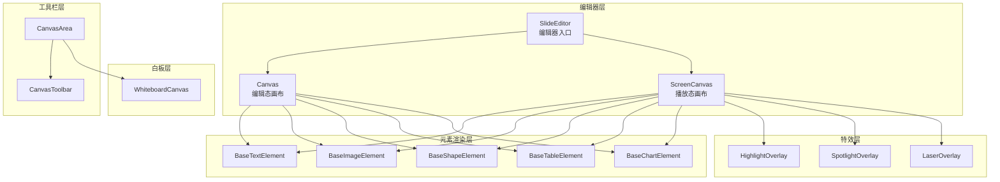
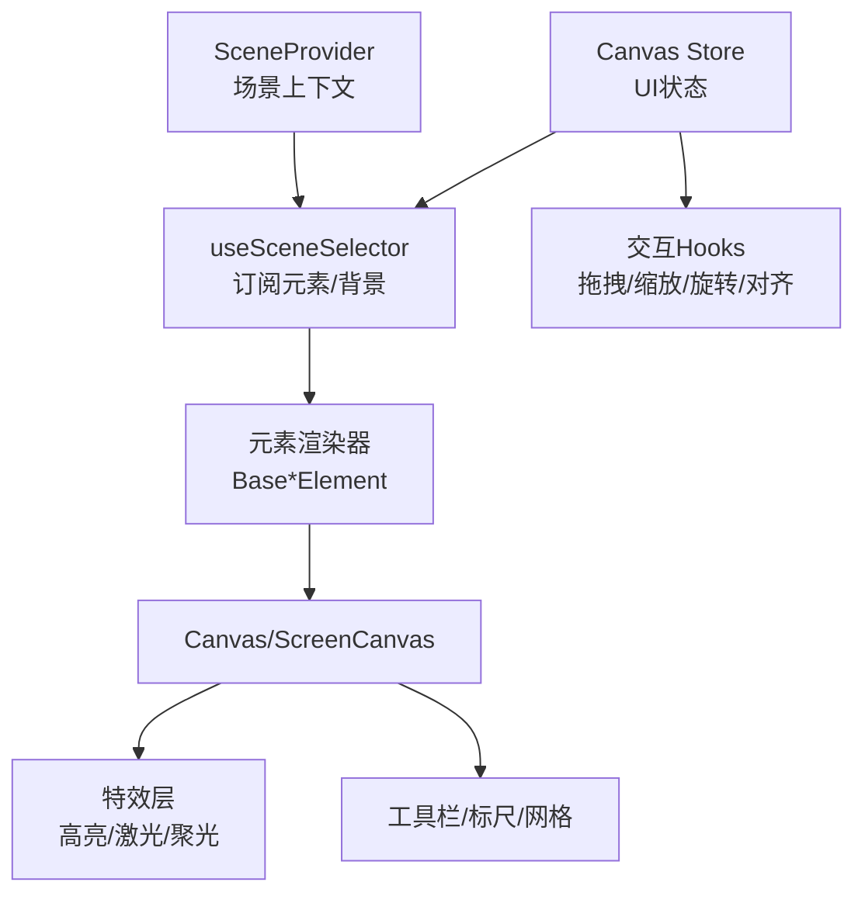
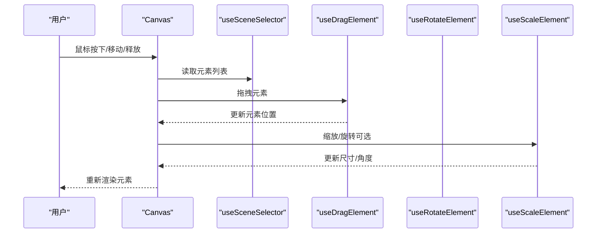
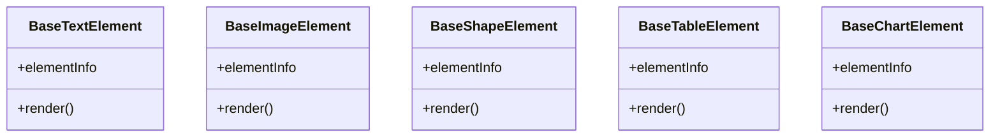
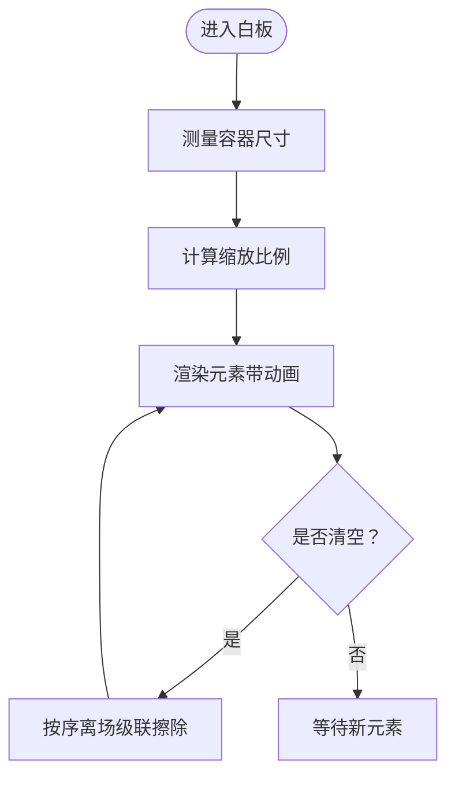
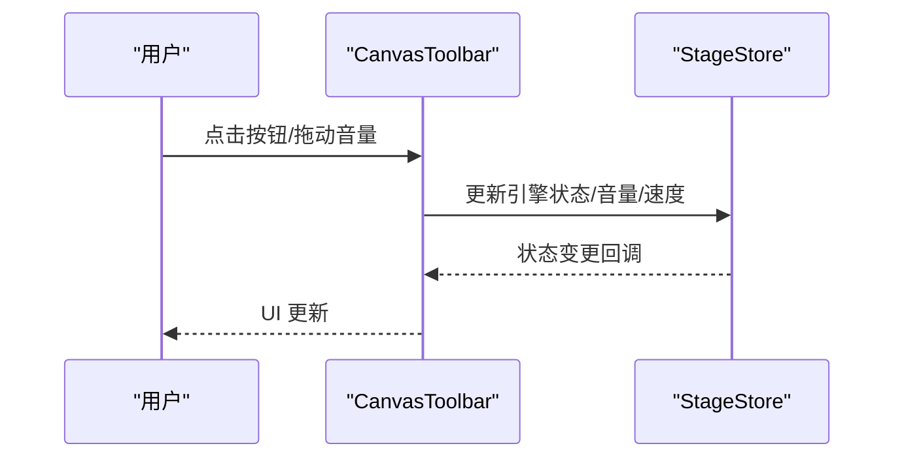
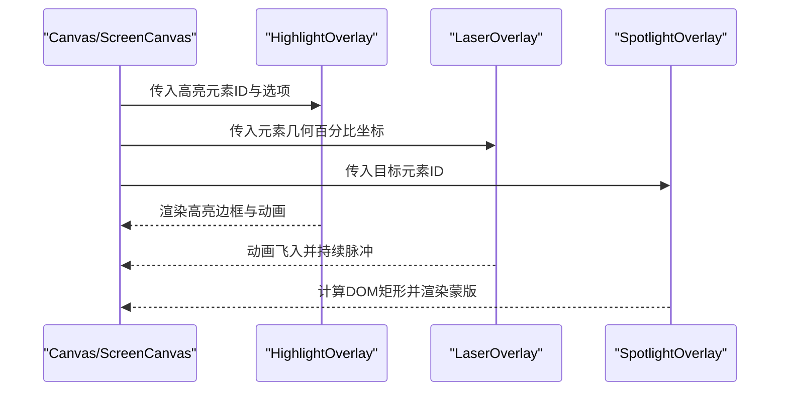
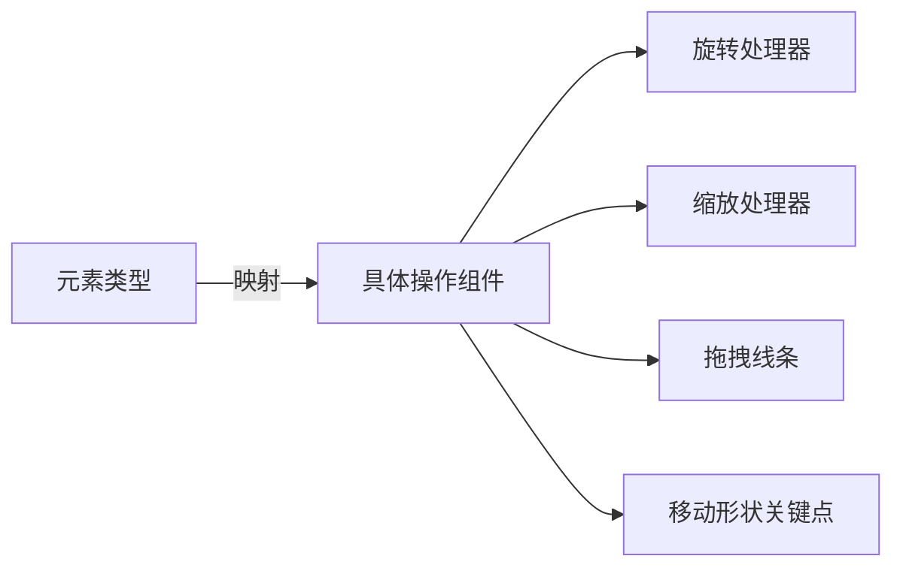
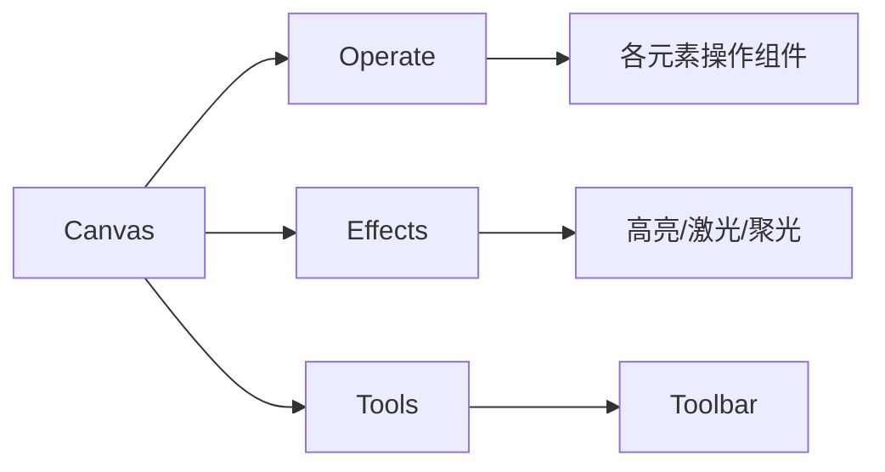

# 幻灯片编辑系统

<cite>
**本文引用的文件**
- [components/slide-renderer/Editor/index.tsx](file://components/slide-renderer/Editor/index.tsx)
- [components/slide-renderer/Editor/Canvas/index.tsx](file://components/slide-renderer/Editor/Canvas/index.tsx)
- [components/slide-renderer/Editor/Canvas/Operate/index.tsx](file://components/slide-renderer/Editor/Canvas/Operate/index.tsx)
- [components/slide-renderer/Editor/ScreenCanvas.tsx](file://components/slide-renderer/Editor/ScreenCanvas.tsx)
- [components/slide-renderer/Editor/HighlightOverlay.tsx](file://components/slide-renderer/Editor/HighlightOverlay.tsx)
- [components/slide-renderer/Editor/LaserOverlay.tsx](file://components/slide-renderer/Editor/LaserOverlay.tsx)
- [components/slide-renderer/Editor/SpotlightOverlay.tsx](file://components/slide-renderer/Editor/SpotlightOverlay.tsx)
- [components/slide-renderer/components/element/TextElement/BaseTextElement.tsx](file://components/slide-renderer/components/element/TextElement/BaseTextElement.tsx)
- [components/slide-renderer/components/element/ImageElement/BaseImageElement.tsx](file://components/slide-renderer/components/element/ImageElement/BaseImageElement.tsx)
- [components/slide-renderer/components/element/ShapeElement/BaseShapeElement.tsx](file://components/slide-renderer/components/element/ShapeElement/BaseShapeElement.tsx)
- [components/slide-renderer/components/element/TableElement/BaseTableElement.tsx](file://components/slide-renderer/components/element/TableElement/BaseTableElement.tsx)
- [components/slide-renderer/components/element/ChartElement/BaseChartElement.tsx](file://components/slide-renderer/components/element/ChartElement/BaseChartElement.tsx)
- [components/canvas/canvas-area.tsx](file://components/canvas/canvas-area.tsx)
- [components/canvas/canvas-toolbar.tsx](file://components/canvas/canvas-toolbar.tsx)
- [components/whiteboard/whiteboard-canvas.tsx](file://components/whiteboard/whiteboard-canvas.tsx)
</cite>

## 目录
1. [简介](#简介)
2. [项目结构](#项目结构)
3. [核心组件](#核心组件)
4. [架构总览](#架构总览)
5. [详细组件分析](#详细组件分析)
6. [依赖关系分析](#依赖关系分析)
7. [性能考量](#性能考量)
8. [故障排查指南](#故障排查指南)
9. [结论](#结论)
10. [附录](#附录)

## 简介
本文件为“幻灯片编辑系统”的技术文档，聚焦于基于 Canvas 的编辑器架构与实现细节，覆盖画布管理、元素渲染与交互处理；详述文本、图片、形状、表格、图表等元素类型的渲染器；说明白板系统的 SVG 基础实时绘图能力；解释编辑工具栏设计与实现；阐述高亮、激光指示器、聚光灯等视觉特效与动画；并给出扩展机制与性能优化策略。

## 项目结构
系统采用分层模块化组织：
- 编辑器层：Canvas 编辑器与 ScreenCanvas 播放视图
- 元素渲染层：各类元素（文本、图片、形状、表格、图表）的基础渲染器
- 特效层：高亮、激光指示器、聚光灯等叠加层
- 白板层：独立的白板画布，支持动画过渡与缩放
- 工具栏层：播放控制、音量、自动播放、白板开关等

**图表来源**
- [components/slide-renderer/Editor/index.tsx:10-18](file://components/slide-renderer/Editor/index.tsx#L10-L18)
- [components/slide-renderer/Editor/Canvas/index.tsx:62-413](file://components/slide-renderer/Editor/Canvas/index.tsx#L62-L413)
- [components/slide-renderer/Editor/ScreenCanvas.tsx:18-123](file://components/slide-renderer/Editor/ScreenCanvas.tsx#L18-L123)
- [components/slide-renderer/components/element/TextElement/BaseTextElement.tsx:16-63](file://components/slide-renderer/components/element/TextElement/BaseTextElement.tsx#L16-L63)
- [components/slide-renderer/components/element/ImageElement/BaseImageElement.tsx:23-156](file://components/slide-renderer/components/element/ImageElement/BaseImageElement.tsx#L23-L156)
- [components/slide-renderer/components/element/ShapeElement/BaseShapeElement.tsx:18-118](file://components/slide-renderer/components/element/ShapeElement/BaseShapeElement.tsx#L18-L118)
- [components/slide-renderer/components/element/TableElement/BaseTableElement.tsx:14-35](file://components/slide-renderer/components/element/TableElement/BaseTableElement.tsx#L14-L35)
- [components/slide-renderer/components/element/ChartElement/BaseChartElement.tsx:15-55](file://components/slide-renderer/components/element/ChartElement/BaseChartElement.tsx#L15-L55)
- [components/slide-renderer/Editor/HighlightOverlay.tsx:23-117](file://components/slide-renderer/Editor/HighlightOverlay.tsx#L23-L117)
- [components/slide-renderer/Editor/LaserOverlay.tsx:20-83](file://components/slide-renderer/Editor/LaserOverlay.tsx#L20-L83)
- [components/slide-renderer/Editor/SpotlightOverlay.tsx:23-168](file://components/slide-renderer/Editor/SpotlightOverlay.tsx#L23-L168)
- [components/whiteboard/whiteboard-canvas.tsx:79-166](file://components/whiteboard/whiteboard-canvas.tsx#L79-L166)
- [components/canvas/canvas-area.tsx:24-255](file://components/canvas/canvas-area.tsx#L24-L255)
- [components/canvas/canvas-toolbar.tsx:79-403](file://components/canvas/canvas-toolbar.tsx#L79-L403)

**章节来源**
- [components/slide-renderer/Editor/index.tsx:10-18](file://components/slide-renderer/Editor/index.tsx#L10-L18)
- [components/canvas/canvas-area.tsx:24-255](file://components/canvas/canvas-area.tsx#L24-L255)

## 核心组件
- SlideEditor：根据模式切换编辑态 Canvas 或播放态 ScreenCanvas
- Canvas：编辑态主画布，负责元素渲染、拖拽、缩放、旋转、对齐辅助线、鼠标框选、网格与标尺、上下文菜单等
- ScreenCanvas：播放态画布，叠加高亮、聚光灯、激光指示器等视觉特效
- 各类元素渲染器：BaseTextElement、BaseImageElement、BaseShapeElement、BaseTableElement、BaseChartElement
- 特效层：HighlightOverlay、LaserOverlay、SpotlightOverlay
- 白板：WhiteboardCanvas，支持逐元素入场/离场动画与缩放适配
- 工具栏：CanvasToolbar，播放控制、音量、速度、自动播放、白板开关等

**章节来源**
- [components/slide-renderer/Editor/index.tsx:10-18](file://components/slide-renderer/Editor/index.tsx#L10-L18)
- [components/slide-renderer/Editor/Canvas/index.tsx:62-413](file://components/slide-renderer/Editor/Canvas/index.tsx#L62-L413)
- [components/slide-renderer/Editor/ScreenCanvas.tsx:18-123](file://components/slide-renderer/Editor/ScreenCanvas.tsx#L18-L123)
- [components/slide-renderer/Editor/HighlightOverlay.tsx:23-117](file://components/slide-renderer/Editor/HighlightOverlay.tsx#L23-L117)
- [components/slide-renderer/Editor/LaserOverlay.tsx:20-83](file://components/slide-renderer/Editor/LaserOverlay.tsx#L20-L83)
- [components/slide-renderer/Editor/SpotlightOverlay.tsx:23-168](file://components/slide-renderer/Editor/SpotlightOverlay.tsx#L23-L168)
- [components/whiteboard/whiteboard-canvas.tsx:79-166](file://components/whiteboard/whiteboard-canvas.tsx#L79-L166)
- [components/canvas/canvas-toolbar.tsx:79-403](file://components/canvas/canvas-toolbar.tsx#L79-L403)

## 架构总览
编辑器采用“场景上下文 + 画布状态 + 元素渲染”的分层架构：
- 场景上下文（SceneProvider）提供幻灯片数据（元素列表、背景）
- 画布状态（Canvas Store）管理缩放、选中、对齐线、网格、标尺、特效等 UI 状态
- 元素渲染器按类型分别实现，统一通过 EditableElement/ScreenElement 调用
- 特效层以绝对定位叠加在内容层之上，不参与元素布局计算

**图表来源**
- [components/slide-renderer/Editor/Canvas/index.tsx:67-101](file://components/slide-renderer/Editor/Canvas/index.tsx#L67-L101)
- [components/slide-renderer/Editor/Canvas/Operate/index.tsx:54-117](file://components/slide-renderer/Editor/Canvas/Operate/index.tsx#L54-L117)
- [components/slide-renderer/Editor/ScreenCanvas.tsx:18-123](file://components/slide-renderer/Editor/ScreenCanvas.tsx#L18-L123)

## 详细组件分析

### 画布与交互（Canvas）
- 数据流：从场景上下文读取元素列表，本地维护副本用于拖拽/缩放/旋转过程中的瞬时更新，避免频繁重渲染
- 交互链路：useSelectElement、useDragElement、useScaleElement、useRotateElement、useMouseSelection、useDrop 等 Hooks 组合
- 对齐辅助：AlignmentLine 与对齐算法在拖拽过程中计算对齐线，提升排版效率
- 视口与网格：ViewportBackground、GridLines、Ruler 提供视觉参考
- 上下文菜单：支持粘贴、全选、标尺、网格线、重置当前页等

**图表来源**
- [components/slide-renderer/Editor/Canvas/index.tsx:96-135](file://components/slide-renderer/Editor/Canvas/index.tsx#L96-L135)

**章节来源**
- [components/slide-renderer/Editor/Canvas/index.tsx:62-413](file://components/slide-renderer/Editor/Canvas/index.tsx#L62-L413)

### 元素渲染器实现
- 文本元素（BaseTextElement）：支持垂直排版、行距、字距、阴影描边、轮廓叠加
- 图片元素（BaseImageElement）：支持翻转、裁剪、滤镜、占位生成、错误重试、颜色蒙版
- 形状元素（BaseShapeElement）：SVG 路径绘制，支持渐变/图案填充、描边样式、形状内文本
- 表格元素（BaseTableElement）：静态表格渲染，支持旋转
- 图表元素（BaseChartElement）：容器式渲染，内部图表组件按类型配置

**图表来源**
- [components/slide-renderer/components/element/TextElement/BaseTextElement.tsx:16-63](file://components/slide-renderer/components/element/TextElement/BaseTextElement.tsx#L16-L63)
- [components/slide-renderer/components/element/ImageElement/BaseImageElement.tsx:23-156](file://components/slide-renderer/components/element/ImageElement/BaseImageElement.tsx#L23-L156)
- [components/slide-renderer/components/element/ShapeElement/BaseShapeElement.tsx:18-118](file://components/slide-renderer/components/element/ShapeElement/BaseShapeElement.tsx#L18-L118)
- [components/slide-renderer/components/element/TableElement/BaseTableElement.tsx:14-35](file://components/slide-renderer/components/element/TableElement/BaseTableElement.tsx#L14-L35)
- [components/slide-renderer/components/element/ChartElement/BaseChartElement.tsx:15-55](file://components/slide-renderer/components/element/ChartElement/BaseChartElement.tsx#L15-L55)

**章节来源**
- [components/slide-renderer/components/element/TextElement/BaseTextElement.tsx:16-63](file://components/slide-renderer/components/element/TextElement/BaseTextElement.tsx#L16-L63)
- [components/slide-renderer/components/element/ImageElement/BaseImageElement.tsx:23-156](file://components/slide-renderer/components/element/ImageElement/BaseImageElement.tsx#L23-L156)
- [components/slide-renderer/components/element/ShapeElement/BaseShapeElement.tsx:18-118](file://components/slide-renderer/components/element/ShapeElement/BaseShapeElement.tsx#L18-L118)
- [components/slide-renderer/components/element/TableElement/BaseTableElement.tsx:14-35](file://components/slide-renderer/components/element/TableElement/BaseTableElement.tsx#L14-L35)
- [components/slide-renderer/components/element/ChartElement/BaseChartElement.tsx:15-55](file://components/slide-renderer/components/element/ChartElement/BaseChartElement.tsx#L15-L55)

### 白板系统（SVG 实时绘图）
- 固定 16:9 画布（1000×562.5），通过容器 ResizeObserver 计算缩放比例，保证居中铺满
- 使用 AnimatePresence 实现元素入场/离场动画，支持“擦除”级联效果
- ScreenElement 在白板中复用播放态渲染逻辑，保持一致性

**图表来源**
- [components/whiteboard/whiteboard-canvas.tsx:95-111](file://components/whiteboard/whiteboard-canvas.tsx#L95-L111)
- [components/whiteboard/whiteboard-canvas.tsx:151-161](file://components/whiteboard/whiteboard-canvas.tsx#L151-L161)

**章节来源**
- [components/whiteboard/whiteboard-canvas.tsx:79-166](file://components/whiteboard/whiteboard-canvas.tsx#L79-L166)

### 编辑工具栏（CanvasToolbar）
- 播放控制：上一页/下一页、播放/暂停、停止讨论
- 音频控制：静音、音量滑条（悬停显示）、语速循环切换
- 自动播放：自动播放开关
- 白板：打开/最小化白板，未打开时显示未清空元素计数徽标

**图表来源**
- [components/canvas/canvas-toolbar.tsx:111-113](file://components/canvas/canvas-toolbar.tsx#L111-L113)
- [components/canvas/canvas-toolbar.tsx:262-330](file://components/canvas/canvas-toolbar.tsx#L262-L330)

**章节来源**
- [components/canvas/canvas-toolbar.tsx:79-403](file://components/canvas/canvas-toolbar.tsx#L79-L403)
- [components/canvas/canvas-area.tsx:24-255](file://components/canvas/canvas-area.tsx#L24-L255)

### 特效与动画系统
- 高亮（HighlightOverlay）：在元素外层叠加发光边框与呼吸动画，支持多元素同时高亮
- 激光指示器（LaserOverlay）：从最近角飞向元素中心，带脉冲环与光点
- 聚光灯（SpotlightOverlay）：使用 SVG 蒙版实现精确裁切，DOM 测量确保定位准确

**图表来源**
- [components/slide-renderer/Editor/HighlightOverlay.tsx:23-117](file://components/slide-renderer/Editor/HighlightOverlay.tsx#L23-L117)
- [components/slide-renderer/Editor/LaserOverlay.tsx:20-83](file://components/slide-renderer/Editor/LaserOverlay.tsx#L20-L83)
- [components/slide-renderer/Editor/SpotlightOverlay.tsx:23-168](file://components/slide-renderer/Editor/SpotlightOverlay.tsx#L23-L168)

**章节来源**
- [components/slide-renderer/Editor/HighlightOverlay.tsx:23-117](file://components/slide-renderer/Editor/HighlightOverlay.tsx#L23-L117)
- [components/slide-renderer/Editor/LaserOverlay.tsx:20-83](file://components/slide-renderer/Editor/LaserOverlay.tsx#L20-L83)
- [components/slide-renderer/Editor/SpotlightOverlay.tsx:23-168](file://components/slide-renderer/Editor/SpotlightOverlay.tsx#L23-L168)

### 编辑工具栏与元素操作（Operate）
- Operate 根据元素类型动态分派到具体操作组件（文本、图片、形状、线条、表格等）
- 支持旋转、缩放、拖拽线条关键点、移动形状关键点
- 动画索引展示：当处于动画模式时，显示该元素参与的动画序列索引

**图表来源**
- [components/slide-renderer/Editor/Canvas/Operate/index.tsx:103-117](file://components/slide-renderer/Editor/Canvas/Operate/index.tsx#L103-L117)

**章节来源**
- [components/slide-renderer/Editor/Canvas/Operate/index.tsx:54-173](file://components/slide-renderer/Editor/Canvas/Operate/index.tsx#L54-L173)

## 依赖关系分析
- 组件耦合
  - Canvas 依赖场景上下文与画布状态，内部通过 Hooks 解耦交互逻辑
  - 元素渲染器彼此独立，仅依赖通用的样式与属性
  - 特效层通过绝对定位叠加，不改变元素布局
- 外部依赖
  - 动画：motion/react 提供 AnimatePresence/motion
  - UI：Tailwind 类名与自定义组件（如 ContextMenu）

**图表来源**
- [components/slide-renderer/Editor/Canvas/index.tsx:226-412](file://components/slide-renderer/Editor/Canvas/index.tsx#L226-L412)
- [components/slide-renderer/Editor/Canvas/Operate/index.tsx:54-173](file://components/slide-renderer/Editor/Canvas/Operate/index.tsx#L54-L173)

**章节来源**
- [components/slide-renderer/Editor/Canvas/index.tsx:62-413](file://components/slide-renderer/Editor/Canvas/index.tsx#L62-L413)
- [components/slide-renderer/Editor/Canvas/Operate/index.tsx:54-173](file://components/slide-renderer/Editor/Canvas/Operate/index.tsx#L54-L173)

## 性能考量
- 本地元素副本：在拖拽/缩放/旋转过程中使用本地数组副本，减少全局状态更新频率
- 选择性订阅：useSceneSelector 仅订阅所需字段，降低渲染范围
- 动画与布局：特效层使用绝对定位与 CSS 动画，避免强制同步布局
- 白板缩放：通过 ResizeObserver 计算缩放，避免重复测量
- 批量更新：上下文菜单与网格/标尺等状态通过画布 Store 控制，避免逐元素重渲染

[本节为通用性能建议，无需特定文件引用]

## 故障排查指南
- 元素无法拖拽/缩放
  - 检查是否处于多选且非激活组元素状态
  - 确认元素未锁定
- 高亮/激光/聚光不生效
  - 确认对应元素 ID 是否存在且已设置
  - 聚光需 DOM 可见后测量，检查容器尺寸是否为 0
- 白板元素不显示或闪烁
  - 检查容器 ResizeObserver 是否正常工作
  - 确认元素顺序与动画参数（入场/离场延迟）

**章节来源**
- [components/slide-renderer/Editor/Canvas/index.tsx:132-138](file://components/slide-renderer/Editor/Canvas/index.tsx#L132-L138)
- [components/slide-renderer/Editor/SpotlightOverlay.tsx:34-70](file://components/slide-renderer/Editor/SpotlightOverlay.tsx#L34-L70)
- [components/whiteboard/whiteboard-canvas.tsx:104-111](file://components/whiteboard/whiteboard-canvas.tsx#L104-L111)

## 结论
本系统以清晰的分层架构实现了强大的幻灯片编辑与播放体验：Canvas 提供高效的编辑交互，元素渲染器覆盖常见媒体与图形类型，特效层增强演示表现力，白板支持实时绘制与动画过渡，工具栏提供完整的播放控制。通过 Hooks 与 Store 的解耦设计，系统具备良好的可扩展性与可维护性。

## 附录
- 扩展机制
  - 新增元素类型：新增 BaseXxxElement 渲染器，并在 Operate 中注册对应操作组件
  - 新增编辑功能：新增 Hooks 并接入 Canvas 的交互链路，或在 ScreenCanvas 中增加叠加层
- 用户体验设计
  - 对齐辅助线与网格提升排版效率
  - 动画与过渡增强演示流畅度
  - 工具栏与上下文菜单提供一致的操作反馈