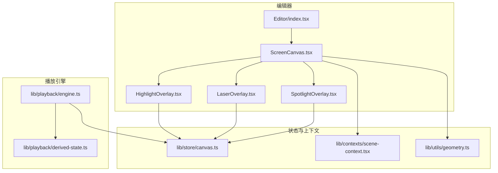
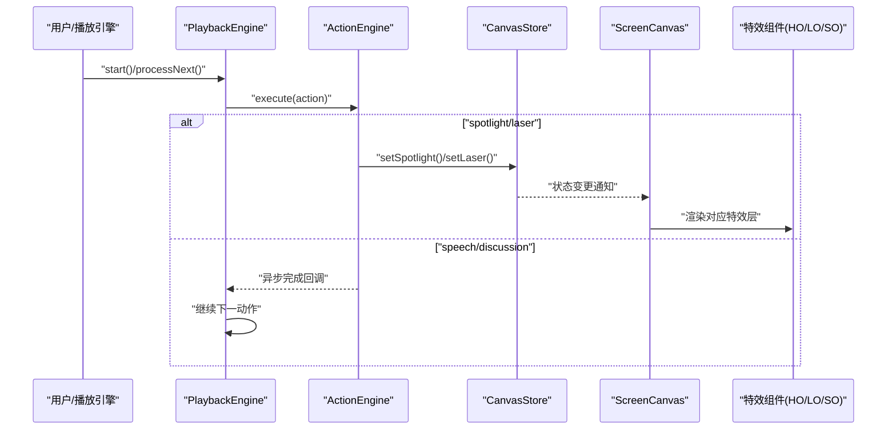
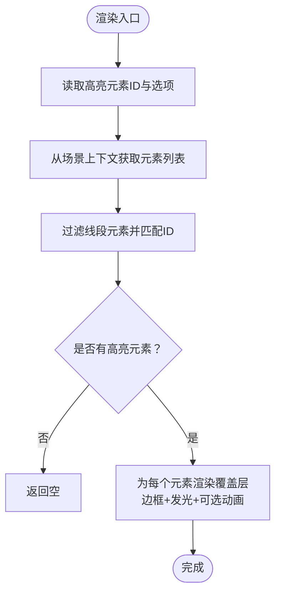
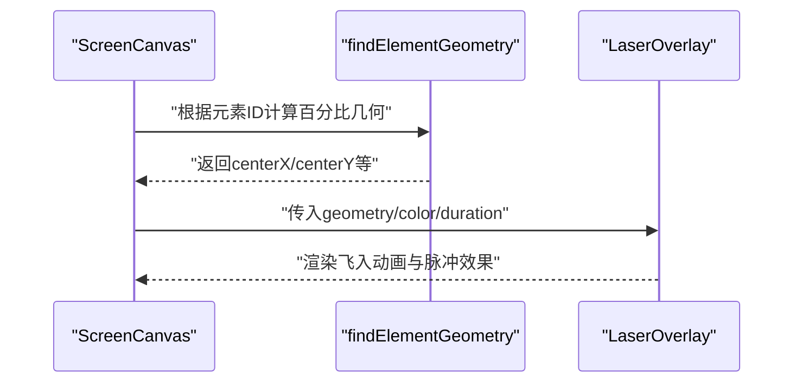
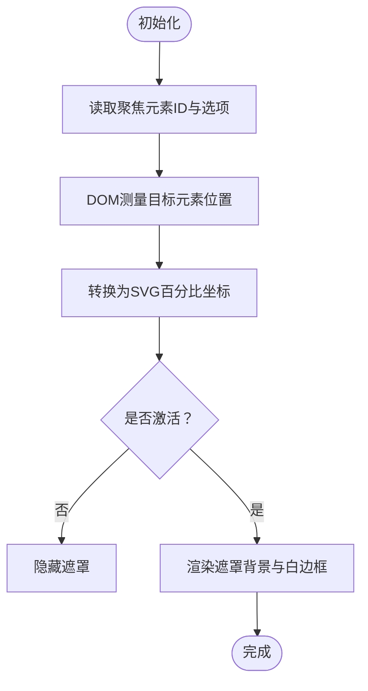
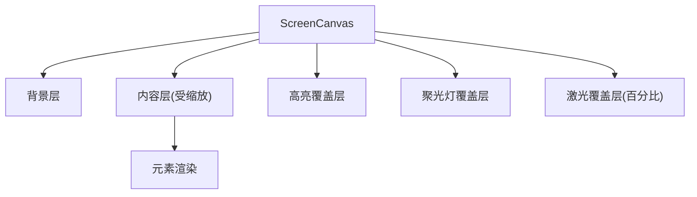
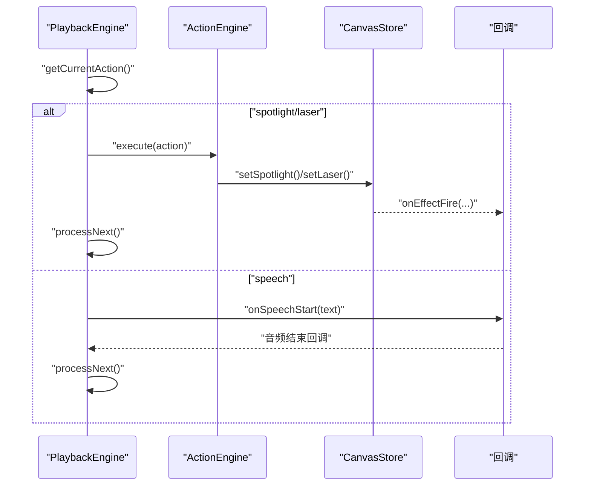
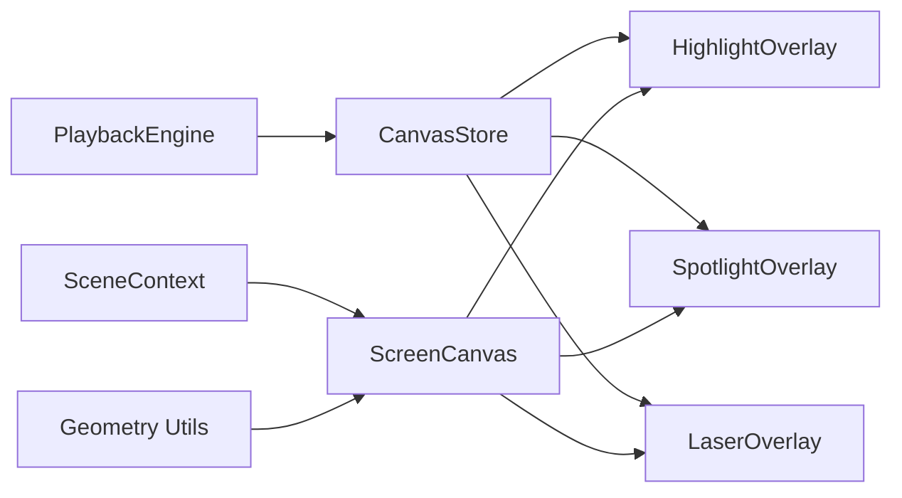

# 特效和动画

<cite>
**本文引用的文件**
- [HighlightOverlay.tsx](file://components/slide-renderer/Editor/HighlightOverlay.tsx)
- [LaserOverlay.tsx](file://components/slide-renderer/Editor/LaserOverlay.tsx)
- [SpotlightOverlay.tsx](file://components/slide-renderer/Editor/SpotlightOverlay.tsx)
- [ScreenCanvas.tsx](file://components/slide-renderer/Editor/ScreenCanvas.tsx)
- [index.tsx](file://components/slide-renderer/Editor/index.tsx)
- [canvas.ts](file://lib/store/canvas.ts)
- [scene-context.tsx](file://lib/contexts/scene-context.tsx)
- [slides.ts](file://lib/types/slides.ts)
- [geometry.ts](file://lib/utils/geometry.ts)
- [action.ts](file://lib/types/action.ts)
- [stage.ts](file://lib/types/stage.ts)
- [engine.ts](file://lib/playback/engine.ts)
- [derived-state.ts](file://lib/playback/derived-state.ts)
- [animation.ts](file://configs/animation.ts)
</cite>

## 目录
1. [引言](#引言)
2. [项目结构](#项目结构)
3. [核心组件](#核心组件)
4. [架构总览](#架构总览)
5. [详细组件分析](#详细组件分析)
6. [依赖关系分析](#依赖关系分析)
7. [性能考量](#性能考量)
8. [故障排查指南](#故障排查指南)
9. [结论](#结论)
10. [附录](#附录)

## 引言
本文件面向课堂演示场景，系统化阐述 OpenMAIC 中“特效与动画”子系统的实现与使用方法。重点覆盖以下方面：
- 视觉特效：高亮覆盖层、激光指示器、聚光灯效果的实现原理与触发机制
- 状态管理：特效状态的集中存储、订阅与渲染联动
- 屏幕画布：投影显示与多显示器支持下的坐标体系与渲染策略
- 性能优化：GPU 加速与渲染队列管理策略
- 播放引擎集成：自动播放模式下特效的同步应用
- 定制开发：新增视觉效果与动画类型的扩展指南
- 用户体验：可访问性与视觉舒适度的设计建议

## 项目结构
特效与动画系统主要分布在“幻灯片编辑器”与“播放引擎”两大模块：
- 编辑器侧：负责实时演示中的特效叠加与渲染
- 播放引擎侧：负责自动播放流程中按动作序列同步触发特效

**图表来源**
- [index.tsx:1-19](file://components/slide-renderer/Editor/index.tsx#L1-L19)
- [ScreenCanvas.tsx:1-124](file://components/slide-renderer/Editor/ScreenCanvas.tsx#L1-L124)
- [HighlightOverlay.tsx:1-118](file://components/slide-renderer/Editor/HighlightOverlay.tsx#L1-L118)
- [LaserOverlay.tsx:1-84](file://components/slide-renderer/Editor/LaserOverlay.tsx#L1-L84)
- [SpotlightOverlay.tsx:1-169](file://components/slide-renderer/Editor/SpotlightOverlay.tsx#L1-L169)
- [canvas.ts:1-473](file://lib/store/canvas.ts#L1-L473)
- [scene-context.tsx:1-212](file://lib/contexts/scene-context.tsx#L1-L212)
- [geometry.ts:1-122](file://lib/utils/geometry.ts#L1-L122)
- [engine.ts:1-525](file://lib/playback/engine.ts#L1-L525)
- [derived-state.ts:1-214](file://lib/playback/derived-state.ts#L1-L214)

**章节来源**
- [index.tsx:1-19](file://components/slide-renderer/Editor/index.tsx#L1-L19)
- [ScreenCanvas.tsx:1-124](file://components/slide-renderer/Editor/ScreenCanvas.tsx#L1-L124)

## 核心组件
- 高亮覆盖层（HighlightOverlay）：在元素周围叠加发光边框与呼吸动画，不修改元素属性，支持多元素同时高亮与动画开关
- 激光指示器（LaserOverlay）：从最近角落“飞入”至目标元素中心，带柔和呼吸光晕与环形脉冲
- 聚光灯（SpotlightOverlay）：通过 DOM 测量定位目标元素，生成遮罩与白边框，营造聚焦效果
- 屏幕画布（ScreenCanvas）：承载背景、元素内容与特效层，统一处理缩放、几何计算与动画挂载
- 教学特效状态（Canvas Store）：集中管理高亮、激光、聚光、缩放等教学特性状态与配置
- 场景上下文（Scene Context）：为组件提供精准订阅与浅比较优化，避免无关重渲染
- 几何工具（Geometry Utils）：将像素坐标转换为百分比坐标，支持百分比定位的特效
- 播放引擎（Playback Engine）：消费 Scene.actions，按序执行语音、讨论与特效等动作

**章节来源**
- [HighlightOverlay.tsx:1-118](file://components/slide-renderer/Editor/HighlightOverlay.tsx#L1-L118)
- [LaserOverlay.tsx:1-84](file://components/slide-renderer/Editor/LaserOverlay.tsx#L1-L84)
- [SpotlightOverlay.tsx:1-169](file://components/slide-renderer/Editor/SpotlightOverlay.tsx#L1-L169)
- [ScreenCanvas.tsx:1-124](file://components/slide-renderer/Editor/ScreenCanvas.tsx#L1-L124)
- [canvas.ts:1-473](file://lib/store/canvas.ts#L1-L473)
- [scene-context.tsx:1-212](file://lib/contexts/scene-context.tsx#L1-L212)
- [geometry.ts:1-122](file://lib/utils/geometry.ts#L1-L122)
- [engine.ts:1-525](file://lib/playback/engine.ts#L1-L525)

## 架构总览
特效系统采用“状态驱动 + 精准订阅”的架构：
- 状态层：Canvas Store 提供高亮、激光、聚光、缩放等状态与操作
- 订阅层：Scene Context 以 useSceneSelector 实现按需订阅，减少渲染抖动
- 渲染层：ScreenCanvas 将元素与特效分层渲染，确保特效在内容之上且不受缩放影响
- 动作层：Playback Engine 读取 Scene.actions，将 spotlight/laser 等特效映射到 Canvas Store，实现自动播放同步

**图表来源**
- [engine.ts:369-523](file://lib/playback/engine.ts#L369-L523)
- [canvas.ts:354-473](file://lib/store/canvas.ts#L354-L473)
- [ScreenCanvas.tsx:34-120](file://components/slide-renderer/Editor/ScreenCanvas.tsx#L34-L120)

## 详细组件分析

### 高亮覆盖层（HighlightOverlay）
- 功能要点
  - 支持多元素高亮，排除线段元素（无高度）
  - 使用盒阴影与 CSS 动画实现发光与呼吸效果
  - 通过 store 中的高亮选项动态控制颜色、透明度、边框宽度与动画开关
- 数据流
  - 从 Canvas Store 读取高亮元素 ID 列表与高亮选项
  - 从 Scene Context 获取当前场景元素列表
  - 为每个高亮元素生成绝对定位的覆盖层，设置过渡与动画属性

**图表来源**
- [HighlightOverlay.tsx:23-118](file://components/slide-renderer/Editor/HighlightOverlay.tsx#L23-L118)
- [canvas.ts:392-410](file://lib/store/canvas.ts#L392-L410)
- [scene-context.tsx:142-179](file://lib/contexts/scene-context.tsx#L142-L179)

**章节来源**
- [HighlightOverlay.tsx:1-118](file://components/slide-renderer/Editor/HighlightOverlay.tsx#L1-L118)
- [canvas.ts:18-47](file://lib/store/canvas.ts#L18-L47)

### 激光指示器（LaserOverlay）
- 功能要点
  - 基于百分比几何（centerX/centerY）计算最近角落，从角落“飞入”至目标中心
  - 内置环形脉冲与核心光点，营造激光感
  - 支持颜色与持续时间配置
- 数据流
  - 由 ScreenCanvas 计算目标元素的百分比几何
  - 将几何与选项传入 LaserOverlay，Motion 库负责动画插值

**图表来源**
- [ScreenCanvas.tsx:40-59](file://components/slide-renderer/Editor/ScreenCanvas.tsx#L40-L59)
- [geometry.ts:55-86](file://lib/utils/geometry.ts#L55-L86)
- [LaserOverlay.tsx:20-84](file://components/slide-renderer/Editor/LaserOverlay.tsx#L20-L84)

**章节来源**
- [LaserOverlay.tsx:1-84](file://components/slide-renderer/Editor/LaserOverlay.tsx#L1-L84)
- [ScreenCanvas.tsx:34-60](file://components/slide-renderer/Editor/ScreenCanvas.tsx#L34-L60)
- [geometry.ts:1-122](file://lib/utils/geometry.ts#L1-L122)

### 聚光灯（SpotlightOverlay）
- 功能要点
  - 通过 DOM 测量（getBoundingClientRect）获取元素真实位置，避免百分比换算误差
  - 使用 SVG 遮罩与白边框实现“聚焦”效果，支持亮度调节
- 数据流
  - 从 Canvas Store 读取聚焦元素 ID 与选项
  - 在容器内测量目标元素，转换为 SVG viewBox 百分比坐标
  - 渲染遮罩背景与白边框，配合动画过渡

**图表来源**
- [SpotlightOverlay.tsx:23-169](file://components/slide-renderer/Editor/SpotlightOverlay.tsx#L23-L169)
- [canvas.ts:356-390](file://lib/store/canvas.ts#L356-L390)

**章节来源**
- [SpotlightOverlay.tsx:1-169](file://components/slide-renderer/Editor/SpotlightOverlay.tsx#L1-L169)
- [canvas.ts:11-47](file://lib/store/canvas.ts#L11-L47)

### 屏幕画布（ScreenCanvas）
- 功能要点
  - 统一承载背景、元素内容与特效层
  - 分层渲染：内容层受缩放影响，特效层使用百分比坐标，保证在缩放时仍正确对齐
  - 订阅 Canvas Store 与 Scene Context，按需渲染高亮、聚光与激光
- 关键逻辑
  - 计算激光与缩放的目标几何（百分比坐标）
  - 将特效组件挂载在独立的百分比层，避免被内容缩放影响

**图表来源**
- [ScreenCanvas.tsx:18-124](file://components/slide-renderer/Editor/ScreenCanvas.tsx#L18-L124)
- [canvas.ts:354-473](file://lib/store/canvas.ts#L354-L473)

**章节来源**
- [ScreenCanvas.tsx:1-124](file://components/slide-renderer/Editor/ScreenCanvas.tsx#L1-L124)

### 播放引擎集成（自动播放）
- 动作类型
  - spotlight/laser：即时生效的“fire-and-forget”动作，不阻塞后续动作
  - speech/discussion/白板等：同步动作，需等待完成后再继续
- 执行流程
  - PlaybackEngine 逐个取出 Scene.actions，调用 ActionEngine 执行
  - 对 spotlight/laser，直接映射到 Canvas Store 的 setSpotlight/setLaser，立即触发渲染
  - 对 speech，播放音频或估算阅读时间，结束后继续下一个动作

**图表来源**
- [engine.ts:398-462](file://lib/playback/engine.ts#L398-L462)
- [action.ts:22-34](file://lib/types/action.ts#L22-L34)
- [canvas.ts:356-428](file://lib/store/canvas.ts#L356-L428)

**章节来源**
- [engine.ts:1-525](file://lib/playback/engine.ts#L1-L525)
- [action.ts:1-221](file://lib/types/action.ts#L1-L221)
- [stage.ts:1-124](file://lib/types/stage.ts#L1-L124)

## 依赖关系分析
- 组件耦合
  - ScreenCanvas 依赖 Canvas Store 与 Scene Context，解耦于具体特效实现
  - 特效组件（HO/LO/SO）仅依赖 Canvas Store 与 Scene Context 的选择器钩子
- 外部依赖
  - Motion 库用于流畅动画插值（LaserOverlay、SpotlightOverlay）
  - CSS 动画与盒阴影用于高亮覆盖层
- 状态依赖
  - Canvas Store 提供高亮、激光、聚光、缩放等状态与清理函数
  - Scene Context 提供精确订阅，避免无关重渲染

**图表来源**
- [canvas.ts:1-473](file://lib/store/canvas.ts#L1-L473)
- [scene-context.tsx:1-212](file://lib/contexts/scene-context.tsx#L1-L212)
- [geometry.ts:1-122](file://lib/utils/geometry.ts#L1-L122)
- [ScreenCanvas.tsx:1-124](file://components/slide-renderer/Editor/ScreenCanvas.tsx#L1-L124)
- [engine.ts:1-525](file://lib/playback/engine.ts#L1-L525)

**章节来源**
- [canvas.ts:1-473](file://lib/store/canvas.ts#L1-L473)
- [scene-context.tsx:1-212](file://lib/contexts/scene-context.tsx#L1-L212)

## 性能考量
- 渲染分层
  - 内容层受缩放影响，特效层使用百分比坐标，避免缩放带来的重复布局计算
- 精准订阅
  - Scene Context 的 useSceneSelector 采用浅比较与 useSyncExternalStore，仅在选择的数据切片变化时重渲染
- 动画库
  - Motion 使用浏览器合成层（transform/opacity），具备良好 GPU 加速表现
- 几何计算
  - 百分比几何统一由工具函数计算，减少重复计算与精度误差
- 清理策略
  - Canvas Store 提供 clearAllEffects，避免特效残留影响后续渲染

**章节来源**
- [scene-context.tsx:142-179](file://lib/contexts/scene-context.tsx#L142-L179)
- [ScreenCanvas.tsx:60-120](file://components/slide-renderer/Editor/ScreenCanvas.tsx#L60-L120)
- [canvas.ts:442-457](file://lib/store/canvas.ts#L442-L457)

## 故障排查指南
- 聚光灯不显示
  - 检查聚焦元素 ID 是否存在，容器是否已渲染
  - 确认 DOM 测量返回有效矩形，容器尺寸非零
- 激光未从角落飞入
  - 确认传入的百分比几何正确，centerX/centerY 计算无误
  - 检查动画初始位置与目标位置是否一致
- 高亮无效
  - 确认高亮元素 ID 列表非空，且元素类型非线段
  - 检查高亮选项（颜色、透明度、边框宽度、动画开关）
- 自动播放特效未触发
  - 确认 Scene.actions 包含 spotlight/laser 动作
  - 检查 PlaybackEngine 是否处于 playing 状态，且未被暂停/中断

**章节来源**
- [SpotlightOverlay.tsx:34-70](file://components/slide-renderer/Editor/SpotlightOverlay.tsx#L34-L70)
- [LaserOverlay.tsx:20-55](file://components/slide-renderer/Editor/LaserOverlay.tsx#L20-L55)
- [HighlightOverlay.tsx:32-41](file://components/slide-renderer/Editor/HighlightOverlay.tsx#L32-L41)
- [engine.ts:398-462](file://lib/playback/engine.ts#L398-L462)

## 结论
OpenMAIC 的特效与动画系统通过“状态驱动 + 精准订阅 + 分层渲染”的架构，在课堂演示中实现了高亮、激光与聚光等特效的实时应用与自动播放同步。系统具备良好的扩展性与性能表现，适合在多显示器与投影场景中稳定运行。

## 附录

### 特效与动画类型定义
- 教学特效状态接口
  - 高亮：颜色、透明度、边框宽度、是否动画
  - 聚光：半径、背景暗度、过渡时长
  - 激光：颜色、持续时间
- 元素动画类型
  - 入场、退场、强调
  - 触发方式：点击、同时、自动

**章节来源**
- [canvas.ts:11-47](file://lib/store/canvas.ts#L11-L47)
- [animation.ts:1-235](file://configs/animation.ts#L1-L235)

### 多显示器与投影支持
- 百分比坐标体系
  - 通过百分比几何（0-100）适配不同分辨率与投影仪
- DOM 测量
  - 聚光灯使用 getBoundingClientRect 精确对齐，避免换算误差
- 缩放与定位
  - 内容层受缩放影响，特效层保持百分比定位，确保跨屏一致性

**章节来源**
- [geometry.ts:11-86](file://lib/utils/geometry.ts#L11-L86)
- [SpotlightOverlay.tsx:34-70](file://components/slide-renderer/Editor/SpotlightOverlay.tsx#L34-L70)
- [ScreenCanvas.tsx:60-120](file://components/slide-renderer/Editor/ScreenCanvas.tsx#L60-L120)

### 新特效开发指南
- 设计原则
  - 保持与现有状态层（Canvas Store）解耦，通过动作映射到 store
  - 使用百分比几何或 DOM 测量，确保跨屏一致性
  - 优先使用 CSS 或 Motion 动画，保证 GPU 加速
- 开发步骤
  1. 在 Canvas Store 中新增状态字段与操作函数
  2. 创建特效组件，订阅对应状态
  3. 在 ScreenCanvas 中挂载特效层
  4. 在 PlaybackEngine 中映射新动作到 Canvas Store
  5. 在 Scene.actions 中添加新动作，验证自动播放

**章节来源**
- [canvas.ts:354-473](file://lib/store/canvas.ts#L354-L473)
- [ScreenCanvas.tsx:97-119](file://components/slide-renderer/Editor/ScreenCanvas.tsx#L97-L119)
- [engine.ts:448-462](file://lib/playback/engine.ts#L448-L462)

### 用户体验设计建议
- 可访问性
  - 控制动画频率与时长，避免眩晕与不适
  - 提供关闭/禁用特效的入口
- 视觉舒适度
  - 高亮与激光的颜色应与背景对比度充足但不过于刺眼
  - 聚光灯的暗度与过渡时长应随场景内容密度调整

[本节为通用指导，无需特定文件引用]