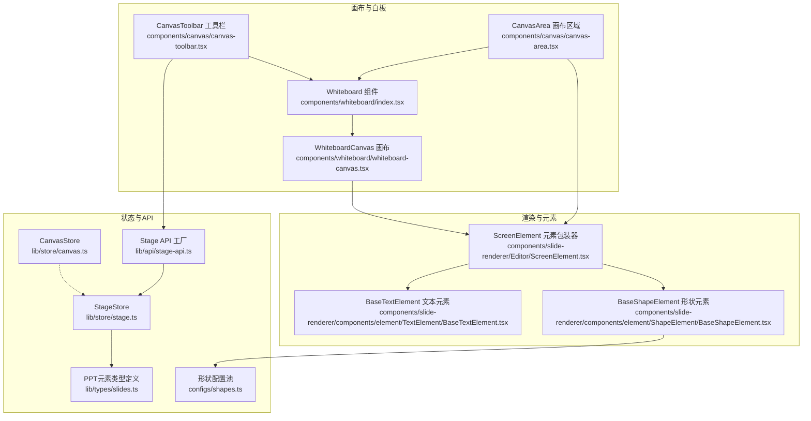
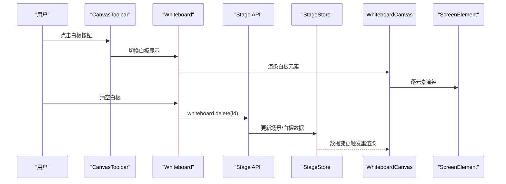
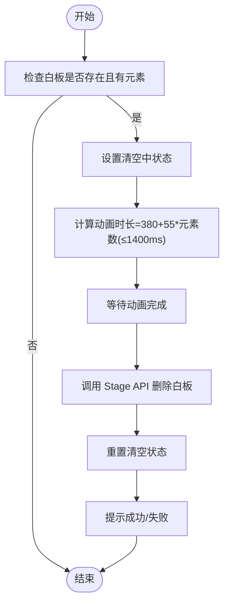
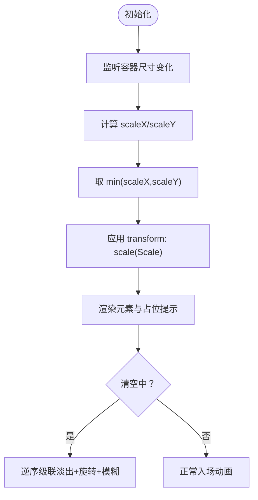
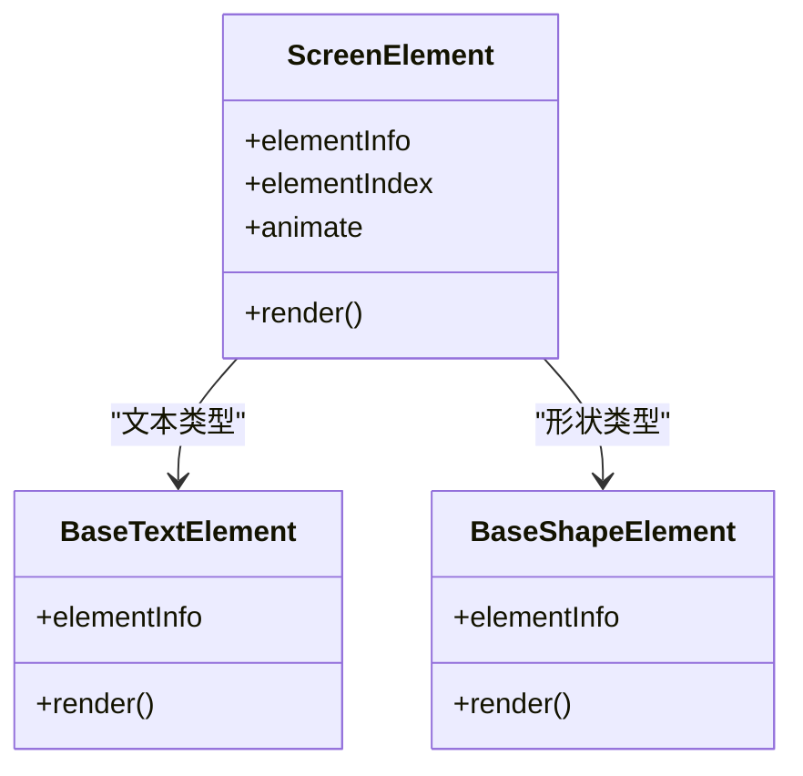
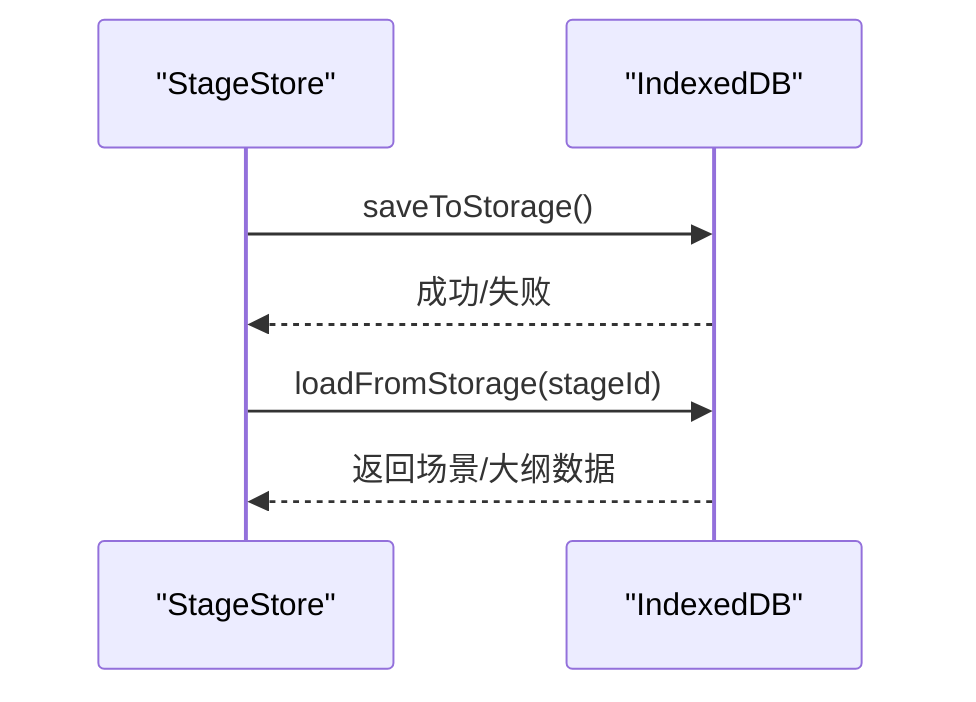
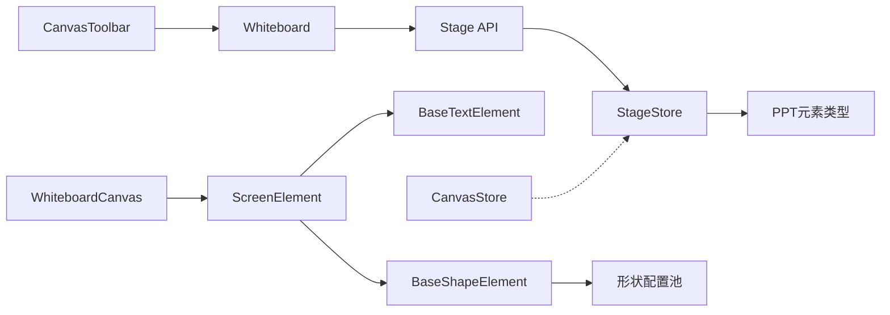

# 白板系统

<cite>
**本文引用的文件**
- [components/whiteboard/index.tsx](file://components/whiteboard/index.tsx)
- [components/whiteboard/whiteboard-canvas.tsx](file://components/whiteboard/whiteboard-canvas.tsx)
- [components/canvas/canvas-area.tsx](file://components/canvas/canvas-area.tsx)
- [components/canvas/canvas-toolbar.tsx](file://components/canvas/canvas-toolbar.tsx)
- [components/slide-renderer/Editor/ScreenElement.tsx](file://components/slide-renderer/Editor/ScreenElement.tsx)
- [components/slide-renderer/components/element/TextElement/BaseTextElement.tsx](file://components/slide-renderer/components/element/TextElement/BaseTextElement.tsx)
- [components/slide-renderer/components/element/ShapeElement/BaseShapeElement.tsx](file://components/slide-renderer/components/element/ShapeElement/BaseShapeElement.tsx)
- [lib/store/index.ts](file://lib/store/index.ts)
- [lib/store/canvas.ts](file://lib/store/canvas.ts)
- [lib/store/stage.ts](file://lib/store/stage.ts)
- [lib/api/stage-api.ts](file://lib/api/stage-api.ts)
- [lib/types/slides.ts](file://lib/types/slides.ts)
- [configs/shapes.ts](file://configs/shapes.ts)
</cite>

## 目录
1. [简介](#简介)
2. [项目结构](#项目结构)
3. [核心组件](#核心组件)
4. [架构总览](#架构总览)
5. [详细组件分析](#详细组件分析)
6. [依赖关系分析](#依赖关系分析)
7. [性能考虑](#性能考虑)
8. [故障排查指南](#故障排查指南)
9. [结论](#结论)
10. [附录](#附录)

## 简介
本文件面向“白板系统”的技术文档，聚焦于基于 SVG 的实时绘图系统架构，涵盖画布初始化、坐标变换与渲染管线；绘图工具（笔刷、形状绘制、文本输入、橡皮擦）的实现思路；绘图数据的存储与序列化机制；缩放与视口管理（平移、缩放、视口边界控制）；性能优化策略（增量渲染、内存管理）；以及与“幻灯片编辑器”的集成方案与多用户协作绘图的实现思路与权限控制。

## 项目结构
白板系统位于前端工程的组件与状态层，采用 React + Zustand 架构，结合“场景上下文”与“元素类型定义”，实现“幻灯片渲染器”与“白板画布”的统一渲染体系。

**图表来源**
- [components/whiteboard/index.tsx:1-136](file://components/whiteboard/index.tsx#L1-L136)
- [components/whiteboard/whiteboard-canvas.tsx:1-167](file://components/whiteboard/whiteboard-canvas.tsx#L1-L167)
- [components/canvas/canvas-area.tsx:1-256](file://components/canvas/canvas-area.tsx#L1-L256)
- [components/canvas/canvas-toolbar.tsx:1-404](file://components/canvas/canvas-toolbar.tsx#L1-L404)
- [components/slide-renderer/Editor/ScreenElement.tsx:1-71](file://components/slide-renderer/Editor/ScreenElement.tsx#L1-L71)
- [components/slide-renderer/components/element/TextElement/BaseTextElement.tsx:1-64](file://components/slide-renderer/components/element/TextElement/BaseTextElement.tsx#L1-L64)
- [components/slide-renderer/components/element/ShapeElement/BaseShapeElement.tsx:1-119](file://components/slide-renderer/components/element/ShapeElement/BaseShapeElement.tsx#L1-L119)
- [lib/store/stage.ts:1-336](file://lib/store/stage.ts#L1-L336)
- [lib/store/canvas.ts:1-473](file://lib/store/canvas.ts#L1-L473)
- [lib/api/stage-api.ts:1-91](file://lib/api/stage-api.ts#L1-L91)
- [lib/types/slides.ts:1-830](file://lib/types/slides.ts#L1-L830)
- [configs/shapes.ts:1-800](file://configs/shapes.ts#L1-L800)

**章节来源**
- [components/whiteboard/index.tsx:1-136](file://components/whiteboard/index.tsx#L1-L136)
- [components/whiteboard/whiteboard-canvas.tsx:1-167](file://components/whiteboard/whiteboard-canvas.tsx#L1-L167)
- [components/canvas/canvas-area.tsx:1-256](file://components/canvas/canvas-area.tsx#L1-L256)
- [components/canvas/canvas-toolbar.tsx:1-404](file://components/canvas/canvas-toolbar.tsx#L1-L404)

## 核心组件
- 白板容器与入口：Whiteboard 组件负责弹层展示、清空动画与触发清理流程，并通过 Stage API 与后端交互。
- 白板画布：WhiteboardCanvas 负责响应式缩放、元素渲染、占位提示与清空动画。
- 画布区域与叠加层：CanvasArea 将白板层与场景渲染层叠加在同一画布上，支持在播放模式下进行点击播放/暂停。
- 工具栏：CanvasToolbar 提供白板开关、元素计数提示、音视频控制等。
- 元素渲染：ScreenElement 根据元素类型动态选择 BaseTextElement、BaseShapeElement 等具体渲染组件；BaseShapeElement 使用 SVG 渲染路径与渐变/图案。

**章节来源**
- [components/whiteboard/index.tsx:21-54](file://components/whiteboard/index.tsx#L21-L54)
- [components/whiteboard/whiteboard-canvas.tsx:79-166](file://components/whiteboard/whiteboard-canvas.tsx#L79-L166)
- [components/canvas/canvas-area.tsx:101-115](file://components/canvas/canvas-area.tsx#L101-L115)
- [components/canvas/canvas-toolbar.tsx:360-379](file://components/canvas/canvas-toolbar.tsx#L360-L379)
- [components/slide-renderer/Editor/ScreenElement.tsx:23-70](file://components/slide-renderer/Editor/ScreenElement.tsx#L23-L70)
- [components/slide-renderer/components/element/ShapeElement/BaseShapeElement.tsx:18-118](file://components/slide-renderer/components/element/ShapeElement/BaseShapeElement.tsx#L18-L118)

## 架构总览
白板系统以“场景上下文 + 元素类型 + 渲染器 + 状态管理 + API 工厂”的方式组织，形成“统一画布、多种模式”的架构：

**图表来源**
- [components/canvas/canvas-toolbar.tsx:360-379](file://components/canvas/canvas-toolbar.tsx#L360-L379)
- [components/whiteboard/index.tsx:33-54](file://components/whiteboard/index.tsx#L33-L54)
- [lib/api/stage-api.ts:68-86](file://lib/api/stage-api.ts#L68-L86)
- [lib/store/stage.ts:98-123](file://lib/store/stage.ts#L98-L123)
- [components/whiteboard/whiteboard-canvas.tsx:150-161](file://components/whiteboard/whiteboard-canvas.tsx#L150-L161)
- [components/slide-renderer/Editor/ScreenElement.tsx:23-70](file://components/slide-renderer/Editor/ScreenElement.tsx#L23-L70)

## 详细组件分析

### 白板容器与清空流程
- 白板弹层通过 AnimatePresence 实现进入/退出动画，内部包含标题栏、清空按钮与最小化按钮。
- 清空流程：先设置“清空中”状态，等待级联动画完成后，调用 Stage API 的 whiteboard.delete 接口删除白板数据，最后恢复状态并提示结果。

**图表来源**
- [components/whiteboard/index.tsx:33-54](file://components/whiteboard/index.tsx#L33-L54)
- [lib/api/stage-api.ts:68-86](file://lib/api/stage-api.ts#L68-L86)
- [lib/store/stage.ts:98-123](file://lib/store/stage.ts#L98-L123)

**章节来源**
- [components/whiteboard/index.tsx:21-54](file://components/whiteboard/index.tsx#L21-L54)

### 白板画布与响应式缩放
- 画布固定尺寸 1000×562.5（16:9），通过 ResizeObserver 计算容器比例，按较小的 scaleX/scaleY 缩放，保证内容完整填充。
- 使用 transform: scale(...) 与 transform-origin: 'top left' 实现整体缩放与定位一致。
- AnimatePresence 控制元素进入/退出动画，清空时采用逆序级联与随机倾斜增强视觉层次。

**图表来源**
- [components/whiteboard/whiteboard-canvas.tsx:95-111](file://components/whiteboard/whiteboard-canvas.tsx#L95-L111)
- [components/whiteboard/whiteboard-canvas.tsx:119-127](file://components/whiteboard/whiteboard-canvas.tsx#L119-L127)
- [components/whiteboard/whiteboard-canvas.tsx:150-161](file://components/whiteboard/whiteboard-canvas.tsx#L150-L161)

**章节来源**
- [components/whiteboard/whiteboard-canvas.tsx:79-166](file://components/whiteboard/whiteboard-canvas.tsx#L79-L166)

### 元素渲染与 SVG 渲染管线
- ScreenElement 根据元素类型映射到具体渲染组件，文本与形状分别使用 BaseTextElement 与 BaseShapeElement。
- BaseShapeElement 使用 SVG path 渲染，支持渐变、图案、描边、阴影与翻转；通过 viewBox 与元素宽高比例计算缩放矩阵，确保矢量清晰。
- BaseTextElement 支持竖排、段落间距、阴影等样式，内部嵌入 ProseMirror 静态内容。

**图表来源**
- [components/slide-renderer/Editor/ScreenElement.tsx:23-70](file://components/slide-renderer/Editor/ScreenElement.tsx#L23-L70)
- [components/slide-renderer/components/element/TextElement/BaseTextElement.tsx:16-63](file://components/slide-renderer/components/element/TextElement/BaseTextElement.tsx#L16-L63)
- [components/slide-renderer/components/element/ShapeElement/BaseShapeElement.tsx:18-118](file://components/slide-renderer/components/element/ShapeElement/BaseShapeElement.tsx#L18-L118)

**章节来源**
- [components/slide-renderer/Editor/ScreenElement.tsx:23-70](file://components/slide-renderer/Editor/ScreenElement.tsx#L23-L70)
- [components/slide-renderer/components/element/TextElement/BaseTextElement.tsx:16-63](file://components/slide-renderer/components/element/TextElement/BaseTextElement.tsx#L16-L63)
- [components/slide-renderer/components/element/ShapeElement/BaseShapeElement.tsx:18-118](file://components/slide-renderer/components/element/ShapeElement/BaseShapeElement.tsx#L18-L118)

### 绘图工具实现思路
- 笔刷：建议在白板层引入 SVG 路径绘制，使用 mousedown/mousemove/mouseup 维护路径点集，结合 CanvasStore 的 creatingElement 状态记录当前绘制对象，最终通过 Stage API 写入场景元素。
- 形状绘制：利用 configs/shapes.ts 中的形状公式与路径生成，结合 BaseShapeElement 的渲染逻辑，将生成的 path 与 viewBox 写入 PPTShapeElement。
- 文本输入：在白板层添加可编辑文本框，输入完成后转换为 PPTTextElement，继承现有 BaseTextElement 的渲染样式。
- 橡皮擦：在白板层维护“擦除区域”，对命中元素执行删除或裁剪操作，通过 Stage API 更新场景数据。

注：以上为实现思路与接口映射，具体交互事件绑定与状态写入需在白板层扩展。

**章节来源**
- [configs/shapes.ts:30-276](file://configs/shapes.ts#L30-L276)
- [lib/types/slides.ts:379-396](file://lib/types/slides.ts#L379-L396)
- [lib/types/slides.ts:183-197](file://lib/types/slides.ts#L183-L197)

### 数据存储与序列化
- StageStore 负责场景与白板数据的持久化与加载，提供 saveToStorage/loadFromStorage，并通过 IndexedDB 存储场景与大纲。
- CanvasStore 管理 UI 状态（缩放、网格、高亮、激光等），不直接管理元素数据，元素数据由场景上下文与 StageStore 维护。
- 白板清空流程通过 Stage API 的 whiteboard.delete 完成，随后触发存储写入。

**图表来源**
- [lib/store/stage.ts:250-306](file://lib/store/stage.ts#L250-L306)
- [lib/store/stage.ts:329-335](file://lib/store/stage.ts#L329-L335)

**章节来源**
- [lib/store/stage.ts:98-335](file://lib/store/stage.ts#L98-L335)
- [lib/store/canvas.ts:51-183](file://lib/store/canvas.ts#L51-L183)

### 缩放与视口管理
- 白板画布采用固定 16:9 尺寸与比例缩放，保证在不同容器尺寸下的最佳显示。
- CanvasStore 提供 canvasScale、canvasPercentage、viewportSize、viewportRatio 等视口参数，支持教学场景的聚焦与高亮等效果。
- 视口边界控制：通过 scale 与 transform-origin 保持左上角对齐，避免滚动条与布局抖动。

**章节来源**
- [components/whiteboard/whiteboard-canvas.tsx:90-127](file://components/whiteboard/whiteboard-canvas.tsx#L90-L127)
- [lib/store/canvas.ts:70-76](file://lib/store/canvas.ts#L70-L76)
- [lib/store/canvas.ts:122-127](file://lib/store/canvas.ts#L122-L127)

### 与幻灯片编辑器的集成
- CanvasArea 将白板层与场景渲染层叠加在同一画布上，白板层 z-index 更高，实现“白板覆盖幻灯片”的无缝切换。
- 在播放模式下，点击幻灯片区域可触发播放/暂停；白板开启时屏蔽底层点击行为，避免误触。
- 白板元素与场景元素共享同一渲染管线（ScreenElement → 具体元素组件），保证一致性与性能。

**章节来源**
- [components/canvas/canvas-area.tsx:101-115](file://components/canvas/canvas-area.tsx#L101-L115)
- [components/canvas/canvas-area.tsx:186-224](file://components/canvas/canvas-area.tsx#L186-L224)

### 多用户协作与权限控制（设计思路）
- 用户权限：通过后端鉴权与角色（教师/助教/学生）控制白板写入与删除权限；仅授权用户可调用 whiteboard.delete。
- 协作同步：白板数据通过 Stage API 写入场景，结合 WebSocket 或轮询推送最新元素；客户端使用 AnimatePresence 实现平滑增量渲染。
- 冲突处理：对同一元素的并发修改采用乐观更新 + 后端校验，冲突时回滚并提示用户。

[本节为概念性设计，未直接分析具体源码文件]

## 依赖关系分析

**图表来源**
- [components/canvas/canvas-toolbar.tsx:360-379](file://components/canvas/canvas-toolbar.tsx#L360-L379)
- [components/whiteboard/index.tsx:31-31](file://components/whiteboard/index.tsx#L31-L31)
- [lib/api/stage-api.ts:68-86](file://lib/api/stage-api.ts#L68-L86)
- [lib/store/stage.ts:98-123](file://lib/store/stage.ts#L98-L123)
- [components/whiteboard/whiteboard-canvas.tsx:150-161](file://components/whiteboard/whiteboard-canvas.tsx#L150-L161)
- [components/slide-renderer/Editor/ScreenElement.tsx:23-70](file://components/slide-renderer/Editor/ScreenElement.tsx#L23-L70)
- [components/slide-renderer/components/element/TextElement/BaseTextElement.tsx:16-63](file://components/slide-renderer/components/element/TextElement/BaseTextElement.tsx#L16-L63)
- [components/slide-renderer/components/element/ShapeElement/BaseShapeElement.tsx:18-118](file://components/slide-renderer/components/element/ShapeElement/BaseShapeElement.tsx#L18-L118)
- [configs/shapes.ts:30-276](file://configs/shapes.ts#L30-L276)
- [lib/store/canvas.ts:51-183](file://lib/store/canvas.ts#L51-L183)

**章节来源**
- [lib/store/index.ts:1-19](file://lib/store/index.ts#L1-L19)
- [lib/types/slides.ts:666-675](file://lib/types/slides.ts#L666-L675)

## 性能考虑
- 增量渲染：使用 AnimatePresence 管理元素进入/退出，避免全量重绘；清空时逆序级联，减少视觉闪烁。
- 响应式缩放：通过 transform: scale 与 transform-origin 保持布局稳定，避免频繁测量与重排。
- 元素复用：ScreenElement 基于类型映射渲染，减少分支判断开销；BaseShapeElement 通过 SVG 路径渲染，适合大量矢量元素。
- 状态解耦：CanvasStore 仅管理 UI 状态，元素数据由 StageStore 管理，降低耦合与不必要的订阅。

[本节提供通用指导，未直接分析具体源码文件]

## 故障排查指南
- 白板清空无效：检查是否已设置 whiteboardClearing，确认动画时长与元素数量计算；核对 Stage API 的 whiteboard.delete 返回值。
- 元素不显示：确认元素类型映射是否正确，检查 ScreenElement 的 elementInfo.type 与 BaseTextElement/BaseShapeElement 的 props。
- 缩放异常：检查容器尺寸监听与 scale 计算逻辑，确认 transform 与 transform-origin 设置。

**章节来源**
- [components/whiteboard/index.tsx:33-54](file://components/whiteboard/index.tsx#L33-L54)
- [components/slide-renderer/Editor/ScreenElement.tsx:23-70](file://components/slide-renderer/Editor/ScreenElement.tsx#L23-L70)
- [components/whiteboard/whiteboard-canvas.tsx:95-111](file://components/whiteboard/whiteboard-canvas.tsx#L95-L111)

## 结论
白板系统以“统一画布 + 元素类型 + 渲染器 + 状态管理 + API 工厂”为核心，实现了与幻灯片编辑器的无缝集成与良好的用户体验。通过响应式缩放、增量渲染与清空动画，系统在性能与交互上取得平衡。未来可在白板层扩展笔刷、形状、文本与橡皮擦工具，并完善多用户协作与权限控制机制。

## 附录
- 元素类型与属性参考：PPTTextElement、PPTShapeElement、PPTLineElement 等。
- 形状公式与路径：SHAPE_PATH_FORMULAS 与 SHAPE_LIST 提供丰富的形状生成能力。

**章节来源**
- [lib/types/slides.ts:183-396](file://lib/types/slides.ts#L183-L396)
- [configs/shapes.ts:30-276](file://configs/shapes.ts#L30-L276)