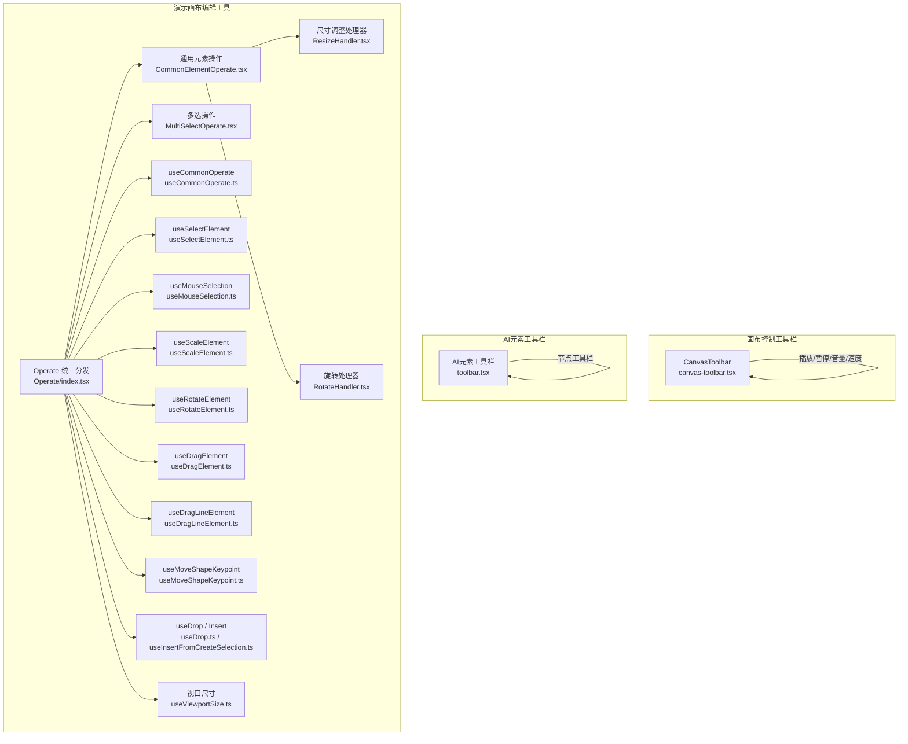
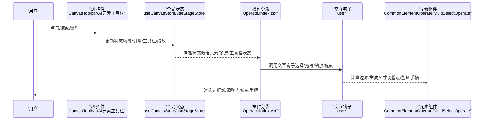
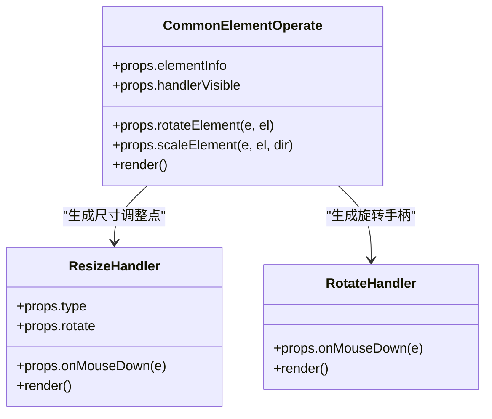
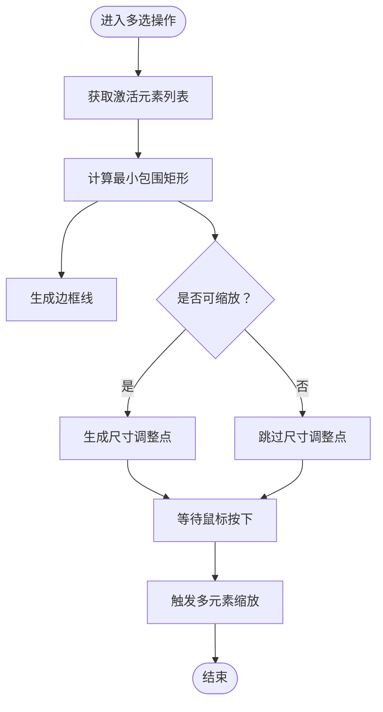
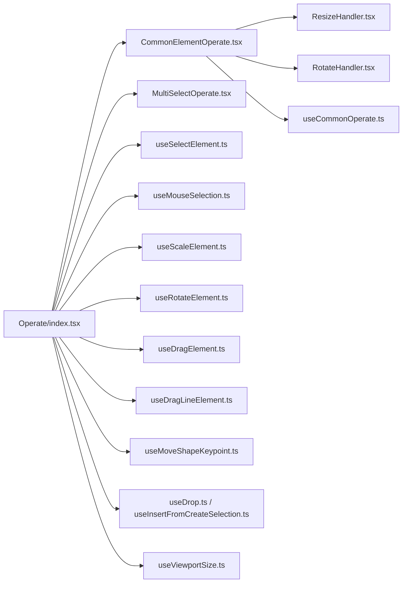

# 编辑工具栏

<cite>
**本文引用的文件**
- [canvas-toolbar.tsx](file://components/canvas/canvas-toolbar.tsx)
- [toolbar.tsx](file://components/ai-elements/toolbar.tsx)
- [generation-toolbar.tsx](file://components/generation/generation-toolbar.tsx)
- [Operate/index.tsx](file://components/slide-renderer/Editor/Canvas/Operate/index.tsx)
- [CommonElementOperate.tsx](file://components/slide-renderer/Editor/Canvas/Operate/CommonElementOperate.tsx)
- [ResizeHandler.tsx](file://components/slide-renderer/Editor/Canvas/Operate/ResizeHandler.tsx)
- [RotateHandler.tsx](file://components/slide-renderer/Editor/Canvas/Operate/RotateHandler.tsx)
- [MultiSelectOperate.tsx](file://components/slide-renderer/Editor/Canvas/Operate/MultiSelectOperate.tsx)
- [useCommonOperate.ts](file://components/slide-renderer/Editor/Canvas/hooks/useCommonOperate.ts)
- [useSelectElement.ts](file://components/slide-renderer/Editor/Canvas/hooks/useSelectElement.ts)
- [useMouseSelection.ts](file://components/slide-renderer/Editor/Canvas/hooks/useMouseSelection.ts)
- [useScaleElement.ts](file://components/slide-renderer/Editor/Canvas/hooks/useScaleElement.ts)
- [useRotateElement.ts](file://components/slide-renderer/Editor/Canvas/hooks/useRotateElement.ts)
- [useDragElement.ts](file://components/slide-renderer/Editor/Canvas/hooks/useDragElement.ts)
- [useDragLineElement.ts](file://components/slide-renderer/Editor/Canvas/hooks/useDragLineElement.ts)
- [useMoveShapeKeypoint.ts](file://components/slide-renderer/Editor/Canvas/hooks/useMoveShapeKeypoint.ts)
- [useDrop.ts](file://components/slide-renderer/Editor/Canvas/hooks/useDrop.ts)
- [useInsertFromCreateSelection.ts](file://components/slide-renderer/Editor/Canvas/hooks/useInsertFromCreateSelection.ts)
- [useViewportSize.ts](file://components/slide-renderer/Editor/Canvas/hooks/useViewportSize.ts)
</cite>

## 目录
1. [引言](#引言)
2. [项目结构](#项目结构)
3. [核心组件](#核心组件)
4. [架构总览](#架构总览)
5. [详细组件分析](#详细组件分析)
6. [依赖关系分析](#依赖关系分析)
7. [性能考量](#性能考量)
8. [故障排查指南](#故障排查指南)
9. [结论](#结论)
10. [附录：扩展开发指南与最佳实践](#附录扩展开发指南与最佳实践)

## 引言
本文件聚焦“编辑工具栏”在演示文稿编辑场景下的实现与使用，系统性梳理以下能力：
- 工具栏状态管理与快捷键绑定（通过全局状态与事件回调）
- 选择工具、移动工具、缩放工具、旋转工具、多选工具的实现原理
- 元素操作处理器设计（通用元素操作与特定元素类型的专用操作）
- 尺寸调整处理器（缩放、旋转、变形）的实现细节
- 多选操作机制（批量选择、统一编辑、组合操作）
- 工具扩展开发指南与用户体验优化策略（视觉反馈与操作提示）

## 项目结构
编辑工具栏相关代码主要分布在三类模块：
- 画布控制工具栏：用于播放/暂停、场景切换、音量与速度等
- AI元素工具栏：基于图编辑库的节点工具栏
- 演示画布编辑工具：元素选择、拖拽、缩放、旋转、多选等

图表来源
- [canvas-toolbar.tsx:1-404](file://components/canvas/canvas-toolbar.tsx#L1-L404)
- [toolbar.tsx:1-14](file://components/ai-elements/toolbar.tsx#L1-L14)
- [Operate/index.tsx:1-174](file://components/slide-renderer/Editor/Canvas/Operate/index.tsx#L1-L174)
- [CommonElementOperate.tsx:1-91](file://components/slide-renderer/Editor/Canvas/Operate/CommonElementOperate.tsx#L1-L91)
- [ResizeHandler.tsx:1-87](file://components/slide-renderer/Editor/Canvas/Operate/ResizeHandler.tsx#L1-L87)
- [RotateHandler.tsx:1-16](file://components/slide-renderer/Editor/Canvas/Operate/RotateHandler.tsx#L1-L16)
- [MultiSelectOperate.tsx:1-83](file://components/slide-renderer/Editor/Canvas/Operate/MultiSelectOperate.tsx#L1-L83)
- [useCommonOperate.ts](file://components/slide-renderer/Editor/Canvas/hooks/useCommonOperate.ts)
- [useSelectElement.ts](file://components/slide-renderer/Editor/Canvas/hooks/useSelectElement.ts)
- [useMouseSelection.ts](file://components/slide-renderer/Editor/Canvas/hooks/useMouseSelection.ts)
- [useScaleElement.ts](file://components/slide-renderer/Editor/Canvas/hooks/useScaleElement.ts)
- [useRotateElement.ts](file://components/slide-renderer/Editor/Canvas/hooks/useRotateElement.ts)
- [useDragElement.ts](file://components/slide-renderer/Editor/Canvas/hooks/useDragElement.ts)
- [useDragLineElement.ts](file://components/slide-renderer/Editor/Canvas/hooks/useDragLineElement.ts)
- [useMoveShapeKeypoint.ts](file://components/slide-renderer/Editor/Canvas/hooks/useMoveShapeKeypoint.ts)
- [useDrop.ts](file://components/slide-renderer/Editor/Canvas/hooks/useDrop.ts)
- [useInsertFromCreateSelection.ts](file://components/slide-renderer/Editor/Canvas/hooks/useInsertFromCreateSelection.ts)
- [useViewportSize.ts](file://components/slide-renderer/Editor/Canvas/hooks/useViewportSize.ts)

章节来源
- [canvas-toolbar.tsx:1-404](file://components/canvas/canvas-toolbar.tsx#L1-L404)
- [toolbar.tsx:1-14](file://components/ai-elements/toolbar.tsx#L1-L14)
- [Operate/index.tsx:1-174](file://components/slide-renderer/Editor/Canvas/Operate/index.tsx#L1-L174)

## 核心组件
- 画布控制工具栏（CanvasToolbar）
  - 提供场景导航、播放/暂停、音量滑条、播放速度循环、自动播放开关、白板开关等控制入口
  - 通过属性回调与全局状态联动，实现工具栏状态与引擎状态同步
- AI元素工具栏（AI Elements Toolbar）
  - 基于图编辑库的节点工具栏容器，定位在节点底部，承载节点级操作按钮
- 演示画布编辑工具
  - Operate 统一分发：根据元素类型动态渲染对应操作组件
  - 通用元素操作：统一处理边框线、尺寸调整点、旋转手柄
  - 多选操作：对选中元素集合计算外接矩形，提供统一的尺寸调整与边框显示
  - 交互钩子：选择、拖拽、缩放、旋转、形状关键点移动、插入/放置等

章节来源
- [canvas-toolbar.tsx:79-404](file://components/canvas/canvas-toolbar.tsx#L79-L404)
- [toolbar.tsx:7-13](file://components/ai-elements/toolbar.tsx#L7-L13)
- [Operate/index.tsx:54-174](file://components/slide-renderer/Editor/Canvas/Operate/index.tsx#L54-L174)

## 架构总览
编辑工具链路自上而下分为三层：
- 视图层（UI 控件）：按钮、滑条、弹出面板
- 状态层（全局状态）：当前场景索引、引擎状态、激活元素列表、工具栏状态、画布缩放比例
- 逻辑层（交互钩子与操作组件）：元素选择、拖拽、缩放、旋转、多选范围计算、尺寸调整点生成

图表来源
- [canvas-toolbar.tsx:79-404](file://components/canvas/canvas-toolbar.tsx#L79-L404)
- [Operate/index.tsx:54-174](file://components/slide-renderer/Editor/Canvas/Operate/index.tsx#L54-L174)
- [useCommonOperate.ts](file://components/slide-renderer/Editor/Canvas/hooks/useCommonOperate.ts)
- [useSelectElement.ts](file://components/slide-renderer/Editor/Canvas/hooks/useSelectElement.ts)
- [useScaleElement.ts](file://components/slide-renderer/Editor/Canvas/hooks/useScaleElement.ts)
- [useRotateElement.ts](file://components/slide-renderer/Editor/Canvas/hooks/useRotateElement.ts)

## 详细组件分析

### 1) 画布控制工具栏（CanvasToolbar）
- 功能要点
  - 场景导航：上一场景/下一场景按钮，受当前索引与总数限制
  - 播放控制：播放/暂停，支持停止讨论按钮
  - 音频控制：静音切换、音量滑条（悬停显示），支持音量变更回调
  - 播放速度：循环切换不同倍速，高亮显示当前速度
  - 自动播放：循环切换开关
  - 白板：打开/最小化，未展开时显示元素计数红点提示
  - 聊天侧栏：展开/收起
- 状态管理
  - 通过 props 接收引擎状态与场景信息，内部维护音量滑条的悬停状态
  - 与全局状态解耦，仅通过回调驱动外部行为
- 快捷键绑定
  - 该组件未直接绑定快捷键；快捷键通常由上层路由或编辑器主控件处理后调用相应回调

章节来源
- [canvas-toolbar.tsx:79-404](file://components/canvas/canvas-toolbar.tsx#L79-L404)

### 2) AI元素工具栏（AI Elements Toolbar）
- 功能要点
  - 容器组件，基于图编辑库的节点工具栏，固定在节点底部
  - 通过 className 与位置参数进行样式与定位控制
- 使用场景
  - 在节点编辑流程中，为节点提供上下文相关的操作按钮

章节来源
- [toolbar.tsx:7-13](file://components/ai-elements/toolbar.tsx#L7-L13)

### 3) 演示画布编辑工具

#### 3.1 通用元素操作（CommonElementOperate）
- 设计目标
  - 对文本、图像、形状、表格、公式、视频、音频、图表等元素提供一致的尺寸调整与旋转能力
- 关键实现
  - 边框线：根据元素宽高与画布缩放比例生成九宫格边框线
  - 尺寸调整点：根据旋转角度映射到合适的四向/八向方向，鼠标按下触发缩放
  - 旋转手柄：在元素顶部中央提供旋转手柄，鼠标按下触发旋转
  - 旋转禁用：对视频/音频/图表/公式等类型禁用旋转
- 性能与复杂度
  - 边框线与调整点数量固定（九宫格/八方向），时间复杂度 O(1)，空间复杂度 O(1)

图表来源
- [CommonElementOperate.tsx:28-91](file://components/slide-renderer/Editor/Canvas/Operate/CommonElementOperate.tsx#L28-L91)
- [ResizeHandler.tsx:12-87](file://components/slide-renderer/Editor/Canvas/Operate/ResizeHandler.tsx#L12-L87)
- [RotateHandler.tsx:7-16](file://components/slide-renderer/Editor/Canvas/Operate/RotateHandler.tsx#L7-L16)

章节来源
- [CommonElementOperate.tsx:28-91](file://components/slide-renderer/Editor/Canvas/Operate/CommonElementOperate.tsx#L28-L91)

#### 3.2 尺寸调整处理器（ResizeHandler）
- 实现原理
  - 根据元素旋转角度与调整点方向，映射到对应的 CSS 鼠标光标样式，提升操作直观性
  - 鼠标按下事件透传给父组件的缩放逻辑，实现统一的缩放处理
- 适配范围
  - 支持四向（上下左右）与八向（含斜向）调整，结合旋转角度动态适配

章节来源
- [ResizeHandler.tsx:12-87](file://components/slide-renderer/Editor/Canvas/Operate/ResizeHandler.tsx#L12-L87)

#### 3.3 旋转处理器（RotateHandler）
- 实现原理
  - 在元素顶部中央提供旋转手柄，按下时进入旋转态
  - 与父组件的旋转逻辑协作，实现元素整体旋转

章节来源
- [RotateHandler.tsx:7-16](file://components/slide-renderer/Editor/Canvas/Operate/RotateHandler.tsx#L7-L16)

#### 3.4 多选操作（MultiSelectOperate）
- 设计目标
  - 对多个选中元素提供统一的外接矩形边框与尺寸调整能力
- 关键实现
  - 范围计算：基于激活元素列表计算最小包围矩形（min/max X/Y）
  - 边框线：按矩形生成九宫格边框线
  - 尺寸调整：仅当所有被选元素均可缩放时启用（例如非旋转的图片/形状）
  - 事件透传：鼠标按下触发统一的多元素缩放逻辑
- 性能与复杂度
  - 范围计算与边框线生成均为 O(n)（n 为选中元素数），空间复杂度 O(1)

图表来源
- [MultiSelectOperate.tsx:19-83](file://components/slide-renderer/Editor/Canvas/Operate/MultiSelectOperate.tsx#L19-L83)

章节来源
- [MultiSelectOperate.tsx:19-83](file://components/slide-renderer/Editor/Canvas/Operate/MultiSelectOperate.tsx#L19-L83)

#### 3.5 操作分发与状态集成（Operate/index.tsx）
- 设计目标
  - 根据元素类型动态选择对应的操作组件，统一注入旋转、缩放、拖拽等回调
- 关键实现
  - 类型映射：将元素类型映射到具体操作组件（图像、文本、形状、线条、表格、通用）
  - 动画索引展示：在动画模式下显示元素关联的动画序号
  - 可见性控制：锁定状态、组内元素、多选状态影响操作控件可见性
- 依赖状态
  - 画布缩放比例、工具栏状态、当前幻灯片内容（动画过滤与格式化）

章节来源
- [Operate/index.tsx:54-174](file://components/slide-renderer/Editor/Canvas/Operate/index.tsx#L54-L174)

#### 3.6 交互钩子与工具栏状态
- 选择与多选
  - useSelectElement：单个元素选择逻辑
  - useMouseSelection：框选/多选逻辑
- 移动与拖拽
  - useDragElement：通用元素拖拽
  - useDragLineElement：线条元素拖拽
- 缩放与旋转
  - useScaleElement：元素缩放（含约束与方向）
  - useRotateElement：元素旋转
- 形状关键点与插入
  - useMoveShapeKeypoint：形状关键点移动
  - useDrop / useInsertFromCreateSelection：元素放置与从创建选择插入
- 视口尺寸
  - useViewportSize：视口尺寸与滚动区域管理

章节来源
- [useSelectElement.ts](file://components/slide-renderer/Editor/Canvas/hooks/useSelectElement.ts)
- [useMouseSelection.ts](file://components/slide-renderer/Editor/Canvas/hooks/useMouseSelection.ts)
- [useDragElement.ts](file://components/slide-renderer/Editor/Canvas/hooks/useDragElement.ts)
- [useDragLineElement.ts](file://components/slide-renderer/Editor/Canvas/hooks/useDragLineElement.ts)
- [useScaleElement.ts](file://components/slide-renderer/Editor/Canvas/hooks/useScaleElement.ts)
- [useRotateElement.ts](file://components/slide-renderer/Editor/Canvas/hooks/useRotateElement.ts)
- [useMoveShapeKeypoint.ts](file://components/slide-renderer/Editor/Canvas/hooks/useMoveShapeKeypoint.ts)
- [useDrop.ts](file://components/slide-renderer/Editor/Canvas/hooks/useDrop.ts)
- [useInsertFromCreateSelection.ts](file://components/slide-renderer/Editor/Canvas/hooks/useInsertFromCreateSelection.ts)
- [useViewportSize.ts](file://components/slide-renderer/Editor/Canvas/hooks/useViewportSize.ts)

## 依赖关系分析
- 组件耦合
  - Operate/index.tsx 作为统一分发器，耦合度低，通过 props 注入回调，便于扩展新元素类型
  - CommonElementOperate 与 MultiSelectOperate 依赖通用的尺寸调整与边框线生成逻辑（useCommonOperate）
- 外部依赖
  - 图编辑库（@xyflow/react）用于 AI 元素工具栏定位
  - 全局状态（useCanvasStore/useStageStore）贯穿工具栏与操作组件
- 循环依赖
  - 当前结构未发现循环依赖；各模块职责清晰，通过 props 与状态解耦

图表来源
- [Operate/index.tsx:54-174](file://components/slide-renderer/Editor/Canvas/Operate/index.tsx#L54-L174)
- [CommonElementOperate.tsx:28-91](file://components/slide-renderer/Editor/Canvas/Operate/CommonElementOperate.tsx#L28-L91)
- [MultiSelectOperate.tsx:19-83](file://components/slide-renderer/Editor/Canvas/Operate/MultiSelectOperate.tsx#L19-L83)
- [ResizeHandler.tsx:12-87](file://components/slide-renderer/Editor/Canvas/Operate/ResizeHandler.tsx#L12-L87)
- [RotateHandler.tsx:7-16](file://components/slide-renderer/Editor/Canvas/Operate/RotateHandler.tsx#L7-L16)
- [useCommonOperate.ts](file://components/slide-renderer/Editor/Canvas/hooks/useCommonOperate.ts)
- [useSelectElement.ts](file://components/slide-renderer/Editor/Canvas/hooks/useSelectElement.ts)
- [useMouseSelection.ts](file://components/slide-renderer/Editor/Canvas/hooks/useMouseSelection.ts)
- [useScaleElement.ts](file://components/slide-renderer/Editor/Canvas/hooks/useScaleElement.ts)
- [useRotateElement.ts](file://components/slide-renderer/Editor/Canvas/hooks/useRotateElement.ts)
- [useDragElement.ts](file://components/slide-renderer/Editor/Canvas/hooks/useDragElement.ts)
- [useDragLineElement.ts](file://components/slide-renderer/Editor/Canvas/hooks/useDragLineElement.ts)
- [useMoveShapeKeypoint.ts](file://components/slide-renderer/Editor/Canvas/hooks/useMoveShapeKeypoint.ts)
- [useDrop.ts](file://components/slide-renderer/Editor/Canvas/hooks/useDrop.ts)
- [useInsertFromCreateSelection.ts](file://components/slide-renderer/Editor/Canvas/hooks/useInsertFromCreateSelection.ts)
- [useViewportSize.ts](file://components/slide-renderer/Editor/Canvas/hooks/useViewportSize.ts)

## 性能考量
- 渲染开销
  - 通用元素操作与多选操作均采用固定数量的边框线与调整点，渲染成本低
  - 使用 useMemo 缓存宽高与旋转映射，避免重复计算
- 事件处理
  - 尺寸调整与旋转通过鼠标按下事件触发，减少持续重绘
  - 多选范围计算在选中元素变化时触发，复杂度与选中元素数线性相关
- 状态更新
  - 工具栏状态与画布缩放通过全局状态集中管理，避免局部重复订阅

## 故障排查指南
- 无法缩放/旋转
  - 检查元素类型是否被禁用（视频/音频/图表/公式默认不可旋转）
  - 检查元素是否被锁定或处于多选但不可缩放状态
- 多选不生效
  - 确认激活元素列表是否正确更新
  - 检查是否存在非旋转图片/形状以外的元素导致禁用缩放
- 旋转手柄不显示
  - 确认元素未被锁定且工具栏状态允许显示
- 音量滑条不显示
  - 检查音量悬停状态与 TTS 启用状态
- 画布控制工具栏按钮无效
  - 确认回调函数已正确传入，且当前场景索引与引擎状态符合预期

章节来源
- [CommonElementOperate.tsx:46-49](file://components/slide-renderer/Editor/Canvas/Operate/CommonElementOperate.tsx#L46-L49)
- [MultiSelectOperate.tsx:48-53](file://components/slide-renderer/Editor/Canvas/Operate/MultiSelectOperate.tsx#L48-L53)
- [canvas-toolbar.tsx:120-131](file://components/canvas/canvas-toolbar.tsx#L120-L131)

## 结论
本编辑工具栏体系以 Operate 统一分发为核心，结合通用元素操作与多选操作，实现了对多种元素类型的统一编辑体验。通过全局状态与交互钩子的解耦设计，既保证了功能扩展的灵活性，也确保了良好的性能与可维护性。

## 附录：扩展开发指南与最佳实践

### A. 添加新的编辑工具
- 新增元素类型支持
  - 在 Operate 分发器中注册新元素类型的处理器组件
  - 若需通用能力，复用 CommonElementOperate 或新增专用组件
- 新增操作模式（如“变形”）
  - 在 useCommonOperate 中扩展边框线与调整点生成逻辑
  - 在对应元素组件中渲染新的处理器，并透传到缩放/变形逻辑

章节来源
- [Operate/index.tsx:103-117](file://components/slide-renderer/Editor/Canvas/Operate/index.tsx#L103-L117)
- [useCommonOperate.ts](file://components/slide-renderer/Editor/Canvas/hooks/useCommonOperate.ts)

### B. 工具栏状态管理与快捷键绑定
- 状态管理
  - 使用全局状态集中管理工具栏状态（如动画模式）、激活元素列表、画布缩放比例
- 快捷键绑定
  - 在上层编辑器主控件中监听快捷键，调用相应回调（如播放/暂停、场景切换、工具切换）
  - 保持 UI 与快捷键的双向一致性，避免状态漂移

章节来源
- [canvas-toolbar.tsx:79-404](file://components/canvas/canvas-toolbar.tsx#L79-L404)

### C. 用户体验优化策略
- 视觉反馈
  - 高亮当前速度、静音状态、自动播放状态
  - 多选状态下降低非激活元素透明度，突出选中范围
- 操作提示
  - 使用 Tooltip 展示操作说明与当前配置
  - 在白板有内容时以红点提示，避免误关闭
- 无障碍
  - 为按钮提供 aria-label，确保屏幕阅读器可用

章节来源
- [canvas-toolbar.tsx:232-257](file://components/canvas/canvas-toolbar.tsx#L232-L257)
- [canvas-toolbar.tsx:376-379](file://components/canvas/canvas-toolbar.tsx#L376-L379)