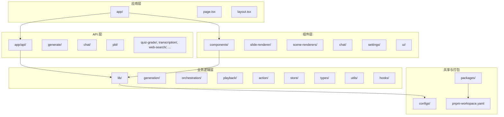
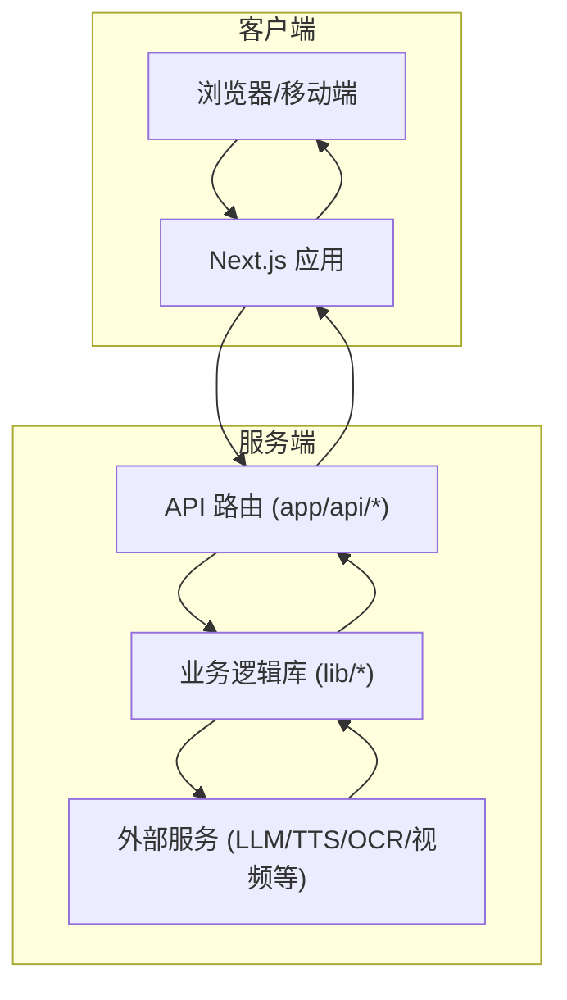
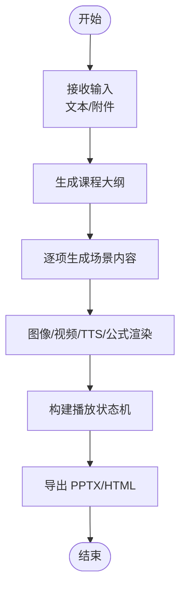
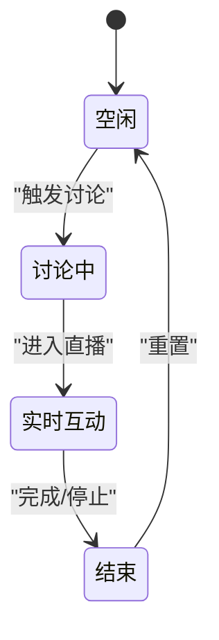
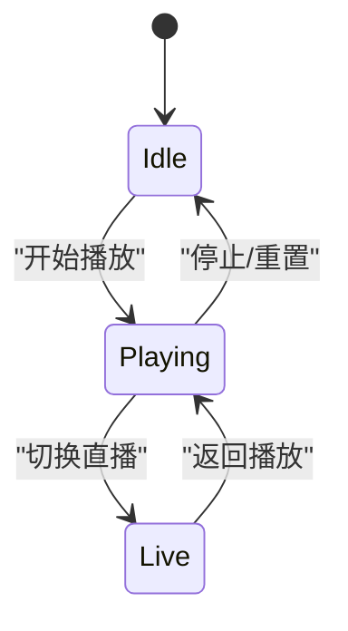
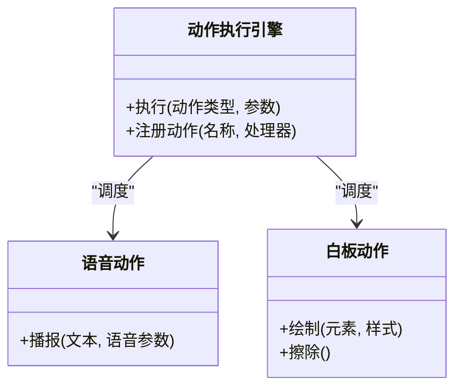
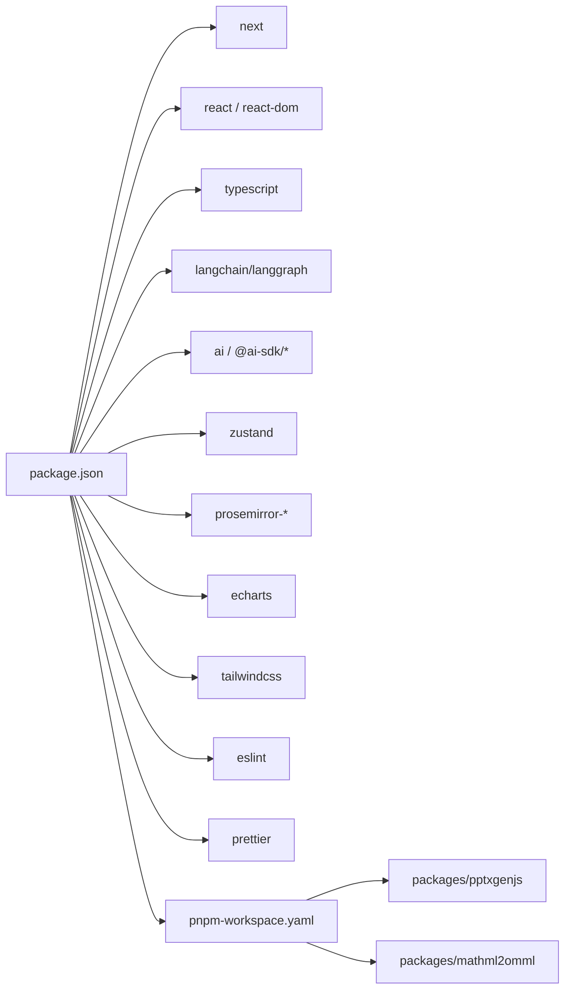

# 开发者指南

<cite>
**本文引用的文件**
- [README.md](file://README.md)
- [package.json](file://package.json)
- [eslint.config.mjs](file://eslint.config.mjs)
- [tsconfig.json](file://tsconfig.json)
- [next.config.ts](file://next.config.ts)
- [Dockerfile](file://Dockerfile)
- [docker-compose.yml](file://docker-compose.yml)
- [.dockerignore](file://.dockerignore)
- [.gitignore](file://.gitignore)
- [.prettierrc](file://.prettierrc)
- [vercel.json](file://vercel.json)
- [pnpm-workspace.yaml](file://pnpm-workspace.yaml)
- [components.json](file://components.json)
- [app/api/generate/route.ts](file://app/api/generate/route.ts)
- [lib/generation/index.ts](file://lib/generation/index.ts)
- [lib/orchestration/index.ts](file://lib/orchestration/index.ts)
- [lib/playback/index.ts](file://lib/playback/index.ts)
- [lib/action/index.ts](file://lib/action/index.ts)
- [components/settings/index.tsx](file://components/settings/index.tsx)
- [components/chat/chat-area.tsx](file://components/chat/chat-area.tsx)
- [components/scene-renderers/pbl-renderer.tsx](file://components/scene-renderers/pbl-renderer.tsx)
- [components/slide-renderer/index.tsx](file://components/slide-renderer/index.tsx)
- [lib/store/index.ts](file://lib/store/index.ts)
- [lib/types/index.ts](file://lib/types/index.ts)
- [lib/utils/index.ts](file://lib/utils/index.ts)
- [lib/hooks/index.ts](file://lib/hooks/index.ts)
- [configs/index.ts](file://configs/index.ts)
- [public/logos/logo.svg](file://public/logos/logo.svg)
</cite>

## 目录
1. [简介](#简介)
2. [项目结构](#项目结构)
3. [核心组件](#核心组件)
4. [架构总览](#架构总览)
5. [详细组件分析](#详细组件分析)
6. [依赖分析](#依赖分析)
7. [性能考虑](#性能考虑)
8. [故障排查指南](#故障排查指南)
9. [结论](#结论)
10. [附录](#附录)

## 简介
本指南面向希望参与 OpenMAIC 项目开发的贡献者，覆盖从环境搭建、代码规范、调试与性能分析、测试策略、部署与 CI/CD 到贡献流程的全流程说明。OpenMAIC 是一个基于多智能体编排的开源 AI 教学平台，支持一键生成课程、多智能体课堂互动、白板绘制、语音合成与视频导出等能力。

## 项目结构
OpenMAIC 采用 Next.js App Router 的单体仓库（monorepo）结构，结合 pnpm 工作区组织核心业务逻辑、UI 组件与打包导出包。关键目录职责如下：
- app/: Next.js 应用入口与 API 路由（约 18 个后端路由）
- lib/: 核心业务逻辑（生成管线、多智能体编排、播放器状态机、动作执行引擎、类型定义、工具函数等）
- components/: React UI 组件（画板、场景渲染器、聊天、设置面板、基础 UI 原语等）
- packages/: 工作区内的二次构建包（如 PowerPoint 导出、MathML 转换）
- configs/: 共享常量与主题配置
- public/: 静态资源（Logo、头像等）

图表来源
- [README.md: 372-426:372-426](file://README.md#L372-L426)
- [pnpm-workspace.yaml: 1-3:1-3](file://pnpm-workspace.yaml#L1-L3)

章节来源
- [README.md: 372-426:372-426](file://README.md#L372-L426)
- [pnpm-workspace.yaml: 1-3:1-3](file://pnpm-workspace.yaml#L1-L3)

## 核心组件
- 生成管线：两阶段（大纲 → 场景内容），贯穿图像生成、TTS、视频与 PPTX 导出
- 多智能体编排：LangGraph 状态机驱动的课堂讨论与角色轮次
- 播放器引擎：状态机驱动的课堂回放与实时互动
- 动作执行引擎：28+ 类型的动作（语音、白板绘制、高亮、激光等）
- 设置与配置：模型提供商、TTS/ASR、媒体与 Web 搜索等配置面板
- UI 组件：画板编辑器、场景渲染器（测验、交互、PBL）、聊天区、基础 UI 原语

章节来源
- [README.md: 428-434:428-434](file://README.md#L428-L434)
- [lib/generation/index.ts](file://lib/generation/index.ts)
- [lib/orchestration/index.ts](file://lib/orchestration/index.ts)
- [lib/playback/index.ts](file://lib/playback/index.ts)
- [lib/action/index.ts](file://lib/action/index.ts)
- [components/settings/index.tsx](file://components/settings/index.tsx)

## 架构总览
OpenMAIC 的运行时架构围绕“前端 Next.js 应用 + 后端 API 路由 + 业务逻辑库 + 外部服务”的组合展开。前端通过 API 路由发起生成请求，后端在 Node.js 环境中调用业务逻辑库完成多智能体编排与动作执行，并通过外部服务（LLM、TTS、OCR、视频等）产出结果。

图表来源
- [next.config.ts: 1-13:1-13](file://next.config.ts#L1-L13)
- [app/api/generate/route.ts](file://app/api/generate/route.ts)
- [lib/generation/index.ts](file://lib/generation/index.ts)
- [lib/orchestration/index.ts](file://lib/orchestration/index.ts)
- [lib/action/index.ts](file://lib/action/index.ts)

## 详细组件分析

### 生成管线（Outline → Scenes）
- 输入：用户描述或参考材料
- 处理：先生成结构化大纲，再为每个大纲项生成富场景内容（幻灯片、测验、交互模拟、PBL 活动）
- 输出：可播放的课堂数据与导出产物（PPTX/HTML）

图表来源
- [lib/generation/index.ts](file://lib/generation/index.ts)
- [app/api/generate/route.ts](file://app/api/generate/route.ts)

章节来源
- [lib/generation/index.ts](file://lib/generation/index.ts)
- [app/api/generate/route.ts](file://app/api/generate/route.ts)

### 多智能体编排（LangGraph）
- 使用 LangGraph 管理课堂状态与角色轮次
- 支持教师、同学、助教等角色的对话与协作
- 可扩展至辩论、问答、项目式学习等场景

图表来源
- [lib/orchestration/index.ts](file://lib/orchestration/index.ts)

章节来源
- [lib/orchestration/index.ts](file://lib/orchestration/index.ts)

### 播放器引擎（Playback）
- 状态机驱动：空闲 → 播放中 → 实时互动
- 支持暂停、继续、跳转、实时干预
- 与动作执行引擎协同，保证课堂节奏与体验

图表来源
- [lib/playback/index.ts](file://lib/playback/index.ts)

章节来源
- [lib/playback/index.ts](file://lib/playback/index.ts)

### 动作执行引擎（Action）
- 覆盖 28+ 动作类型：语音播报、白板绘制（文字/形状/图表）、高亮、激光、讲义展示等
- 与播放器引擎解耦，便于扩展与复用

图表来源
- [lib/action/index.ts](file://lib/action/index.ts)

章节来源
- [lib/action/index.ts](file://lib/action/index.ts)

### 设置与配置（Settings）
- 提供模型提供商（OpenAI、Anthropic、Gemini、DeepSeek 等）配置
- 支持 TTS/ASR、PDF 解析、Web 搜索、媒体生成等开关与参数
- 通过工作区配置文件与环境变量生效

章节来源
- [components/settings/index.tsx](file://components/settings/index.tsx)
- [README.md: 88-116:88-116](file://README.md#L88-L116)

### UI 组件与场景渲染
- 画板编辑器：支持元素拖拽、缩放、旋转、对齐、网格线等
- 场景渲染器：测验、交互实验、PBL 工作室等
- 聊天区：会话列表、消息流、SSE 推送
- 基础 UI 原语：按钮、输入框、对话框、标签页等

章节来源
- [components/slide-renderer/index.tsx](file://components/slide-renderer/index.tsx)
- [components/scene-renderers/pbl-renderer.tsx](file://components/scene-renderers/pbl-renderer.tsx)
- [components/chat/chat-area.tsx](file://components/chat/chat-area.tsx)
- [components.json: 1-27:1-27](file://components.json#L1-L27)

## 依赖分析
- 运行时依赖：Next.js、React 19、TypeScript、LangGraph、AI SDK（OpenAI、Anthropic、Google）、Zustand 状态管理、ProseMirror 编辑器、ECharts 图表、Tailwind CSS 等
- 开发依赖：ESLint 9、Prettier、TailwindCSS v4、Rollup、Vue-to-React 等
- 工作区包：pptxgenjs、mathml2omml

图表来源
- [package.json: 15-94:15-94](file://package.json#L15-L94)
- [pnpm-workspace.yaml: 1-3:1-3](file://pnpm-workspace.yaml#L1-3)

章节来源
- [package.json: 15-94:15-94](file://package.json#L15-L94)
- [pnpm-workspace.yaml: 1-3:1-3](file://pnpm-workspace.yaml#L1-3)

## 性能考虑
- 体积与加载：启用独立输出模式以减少冷启动；限制第三方包体积，按需引入
- 构建与缓存：使用 pnpm 工作区与锁文件确保一致的依赖树；利用 Next.js 缓存与增量编译
- 大文件处理：API 层支持较大请求体（最大 50MB），注意内存与超时控制
- 图像与视频：使用 Cairo/Pango/JPEG/GIF/SVG 依赖进行高质量渲染与压缩
- 并发与流式：SSE 推送与流式响应提升交互体验

章节来源
- [next.config.ts: 1-13:1-13](file://next.config.ts#L1-L13)
- [vercel.json: 6-13:6-13](file://vercel.json#L6-L13)
- [Dockerfile: 38-44:38-44](file://Dockerfile#L38-L44)

## 故障排查指南
- 环境变量缺失：确认至少配置一个 LLM 提供商密钥；可选配置 PDF MinRU 服务地址
- 依赖安装失败：确保 Node.js 版本满足要求；使用 pnpm 安装；必要时清理缓存
- 构建错误：检查 TypeScript 配置与路径映射；确认工作区包已正确构建
- Docker 启动异常：检查 .dockerignore 与 docker-compose 映射；确认数据卷权限
- Vercel 部署超时：适当提高函数最大执行时间；增大请求体大小限制
- 本地代理与网络：若使用代理，确保环境变量与网络连通性

章节来源
- [README.md: 75-116:75-116](file://README.md#L75-L116)
- [Dockerfile: 13-13:13-13](file://Dockerfile#L13-L13)
- [vercel.json: 7-12:7-12](file://vercel.json#L7-L12)
- [.dockerignore: 19-22:19-22](file://.dockerignore#L19-L22)
- [.gitignore: 36-42:36-42](file://.gitignore#L36-L42)

## 代码规范与最佳实践
- ESLint 配置
  - 基于 eslint-config-next 的 Core Web Vitals 与 TypeScript 规则
  - 自定义忽略规则：允许动态生成图片 URL，放宽 @next/next/no-img-element
  - 允许下划线前缀的未使用变量（常用于解构与回调占位）
- 代码风格
  - 使用 Prettier，统一缩进、引号、尾随逗号等格式
  - TypeScript 严格模式，模块解析使用 bundler，路径别名 @/*
- 命名约定
  - 组件与文件：帕斯卡命名（如 SlideRenderer）
  - 变量与函数：驼峰命名（如 generateClassroom）
  - 类型与接口：大写开头（如 IClassroomState）
  - 常量：全大写下划线（如 MAX_DURATION）

章节来源
- [eslint.config.mjs: 1-39:1-39](file://eslint.config.mjs#L1-L39)
- [.prettierrc: 1-17:1-17](file://.prettierrc#L1-L17)
- [tsconfig.json: 21-23:21-23](file://tsconfig.json#L21-L23)

## 调试技巧与工具
- 浏览器调试
  - 打开 DevTools，检查网络面板中的 API 请求与 SSE 流
  - 在 Console 中观察状态变更与错误日志
- Node.js 调试
  - 使用 VS Code 或 Chrome DevTools 对 Next.js 服务端进行断点调试
  - 关注 API 路由与业务逻辑库的调用链
- 性能分析
  - 使用浏览器性能面板分析首屏与交互延迟
  - 使用 Node.js profiler 分析服务端热点函数
  - 关注图像与视频渲染的内存占用与 CPU 占用

章节来源
- [next.config.ts: 1-13:1-13](file://next.config.ts#L1-L13)
- [lib/store/index.ts](file://lib/store/index.ts)
- [lib/utils/index.ts](file://lib/utils/index.ts)

## 测试策略与环境搭建
- 单元测试
  - 建议针对 lib/utils、lib/types、lib/hooks 中的纯函数与工具方法编写测试
  - 使用 Jest 或 Vitest（根据团队偏好），覆盖边界条件与错误分支
- 集成测试
  - 针对 app/api/* 路由编写端到端测试，验证请求、响应与 SSE 流
  - 使用 Mock 服务或测试数据库，隔离外部依赖
- 端到端测试
  - 使用 Playwright/Cypress 等工具，模拟真实用户操作（生成课程、查看课堂、播放回放）
  - 覆盖多智能体交互、白板绘制、语音播报等关键流程
- 测试环境
  - 使用 .env.test 或单独的测试配置文件，避免污染本地开发环境
  - 在 CI 中分别执行 lint、类型检查、单元测试与集成测试

章节来源
- [package.json: 6-14:6-14](file://package.json#L6-L14)
- [lib/utils/index.ts](file://lib/utils/index.ts)
- [lib/hooks/index.ts](file://lib/hooks/index.ts)

## 部署指南与 CI/CD
- 本地开发
  - 安装 Node.js（≥18）与 pnpm（≥10），克隆仓库后执行安装与启动
  - 复制示例环境文件并填写至少一个 LLM 提供商密钥
- Docker 部署
  - 使用 docker-compose 一键构建与运行，映射 3000 端口，挂载数据卷
  - 容器内预装 Cairo/Pango/JPEG/GIF/SVG 依赖，适配图像与视频渲染
- Vercel 部署
  - 在 Vercel 控制台导入仓库，设置环境变量（至少一个 LLM 密钥）
  - 函数路由支持最大执行时间与请求体大小配置
- CI/CD 建议
  - 在 GitHub Actions 中配置安装、构建、测试与部署流水线
  - 分别执行 lint、类型检查、单元测试与集成测试，通过后再部署

章节来源
- [README.md: 75-149:75-149](file://README.md#L75-L149)
- [Dockerfile: 1-52:1-52](file://Dockerfile#L1-L52)
- [docker-compose.yml: 1-16:1-16](file://docker-compose.yml#L1-L16)
- [vercel.json: 1-15:1-15](file://vercel.json#L1-L15)

## 贡献流程
- 分支管理
  - 基于 main 创建功能分支（如 feature/amazing-feature）
  - 保持分支简洁，提交信息清晰
- 提交规范
  - 使用清晰的提交信息描述变更内容与动机
  - 遵循代码风格与 ESLint 规则
- Pull Request
  - 在 PR 描述中说明背景、改动范围与测试情况
  - 通过 CI 检查后再合并

章节来源
- [README.md: 435-442:435-442](file://README.md#L435-L442)

## 常见问题与性能优化建议
- 常见问题
  - 生成缓慢：检查 LLM 提供商速率限制与模型选择；优化图像与视频生成参数
  - 语音质量差：调整 TTS 提供商与参数；确保音频缓冲与播放时机
  - 白板绘制卡顿：减少一次性绘制元素数量；使用虚拟滚动与分块渲染
- 性能优化
  - 启用独立输出模式与静态资源缓存
  - 使用流式传输与 SSE 推送，降低首帧延迟
  - 对大型 PDF/视频进行分块处理与 CDN 加速
  - 在 Docker 中预装渲染依赖，避免运行时安装

章节来源
- [next.config.ts: 4-10:4-10](file://next.config.ts#L4-L10)
- [vercel.json: 7-12:7-12](file://vercel.json#L7-L12)
- [Dockerfile: 38-44:38-44](file://Dockerfile#L38-L44)

## 附录
- 快速开始命令
  - 安装：pnpm install
  - 开发：pnpm dev
  - 构建：pnpm build && pnpm start
- 配置文件
  - ESLint：eslint.config.mjs
  - TypeScript：tsconfig.json
  - Next.js：next.config.ts
  - Prettier：.prettierrc
  - Docker：Dockerfile、docker-compose.yml
  - Vercel：vercel.json
  - 工作区：pnpm-workspace.yaml
  - 组件库：components.json

章节来源
- [package.json: 6-14:6-14](file://package.json#L6-L14)
- [eslint.config.mjs: 1-39:1-39](file://eslint.config.mjs#L1-L39)
- [tsconfig.json: 1-35:1-35](file://tsconfig.json#L1-L35)
- [next.config.ts: 1-13:1-13](file://next.config.ts#L1-L13)
- [.prettierrc: 1-17:1-17](file://.prettierrc#L1-L17)
- [Dockerfile: 1-52:1-52](file://Dockerfile#L1-L52)
- [docker-compose.yml: 1-16:1-16](file://docker-compose.yml#L1-L16)
- [vercel.json: 1-15:1-15](file://vercel.json#L1-L15)
- [pnpm-workspace.yaml: 1-3:1-3](file://pnpm-workspace.yaml#L1-L3)
- [components.json: 1-27:1-27](file://components.json#L1-L27)