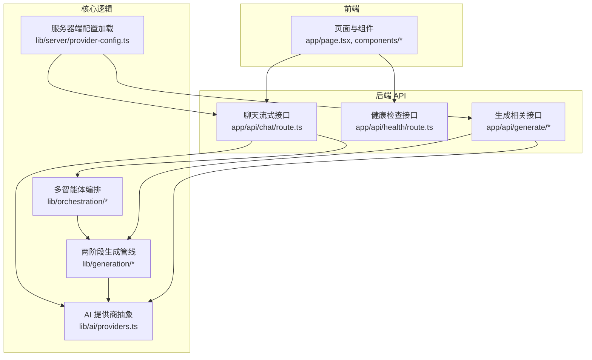
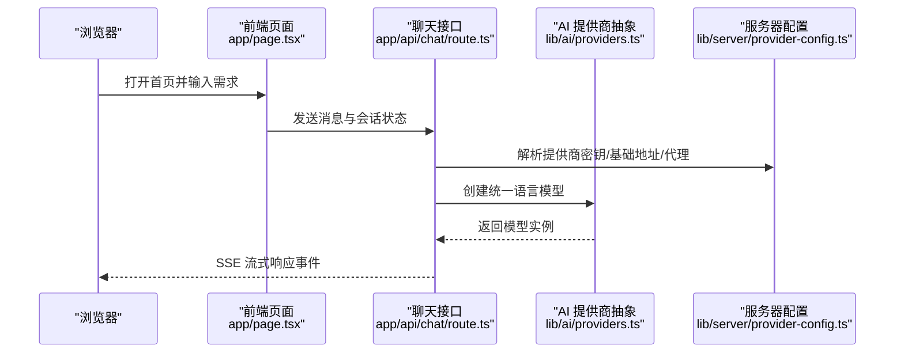
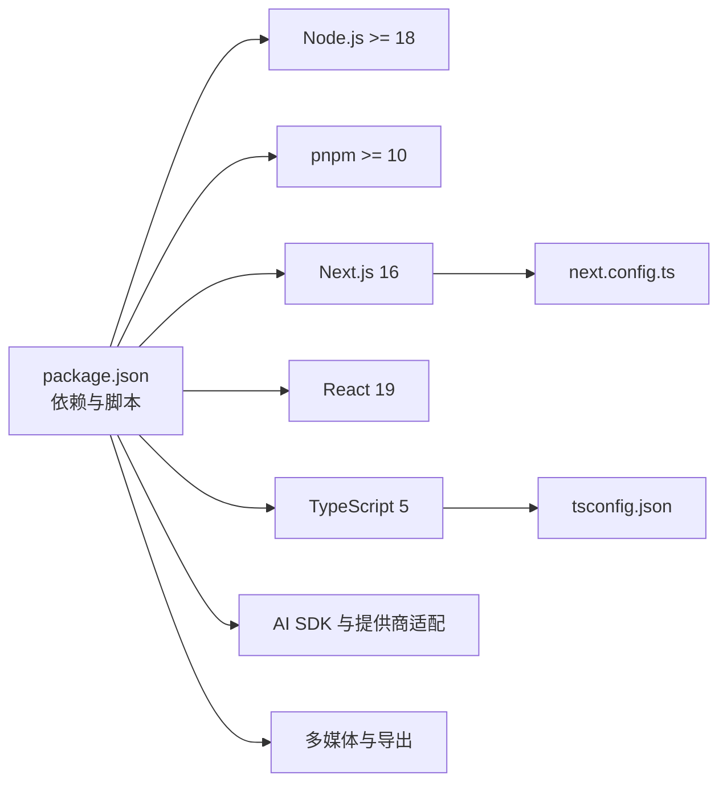

# 快速开始

<cite>
**本文引用的文件**
- [README.md](file://README.md)
- [package.json](file://package.json)
- [Dockerfile](file://Dockerfile)
- [docker-compose.yml](file://docker-compose.yml)
- [vercel.json](file://vercel.json)
- [next.config.ts](file://next.config.ts)
- [tsconfig.json](file://tsconfig.json)
- [lib/server/provider-config.ts](file://lib/server/provider-config.ts)
- [lib/ai/providers.ts](file://lib/ai/providers.ts)
- [app/api/chat/route.ts](file://app/api/chat/route.ts)
- [app/api/health/route.ts](file://app/api/health/route.ts)
- [app/page.tsx](file://app/page.tsx)
</cite>

## 目录
1. [简介](#简介)
2. [项目结构](#项目结构)
3. [核心组件](#核心组件)
4. [架构总览](#架构总览)
5. [详细组件分析](#详细组件分析)
6. [依赖关系分析](#依赖关系分析)
7. [性能注意事项](#性能注意事项)
8. [故障排除指南](#故障排除指南)
9. [结论](#结论)
10. [附录](#附录)

## 简介
本指南面向首次接触 OpenMAIC 的用户，帮助你在最短时间内完成环境准备、依赖安装、配置与启动，并通过多种部署方式（本地开发、Docker、Vercel）运行项目。你将学会：
- 安装 Node.js 与 pnpm 的版本要求
- 配置至少一个 AI 服务提供商密钥
- 选择合适的部署方式并完成启动
- 验证安装成功与进行基础功能测试
- 排查常见问题

## 项目结构
OpenMAIC 是基于 Next.js App Router 的全栈应用，前端使用 React 19，后端提供多组 API 路由用于生成课堂、对话、语音、视频、图像等能力。核心目录与职责概览如下：
- app/api/*：后端 API 路由，包含聊天、生成、教室、解析 PDF、语音识别、视频、搜索等接口
- app/page.tsx：首页入口，负责收集用户输入并跳转到生成预览
- lib/*：核心业务逻辑，如两阶段生成管线、多智能体编排、动作执行、AI 提供商抽象等
- components/*：UI 组件库，涵盖幻灯片渲染器、场景渲染器、聊天区、设置面板等
- configs/*：共享常量（形状、字体、热键、主题等）
- packages/*：工作区包（如 PowerPoint 导出、MathML 转换）
- skills/openmaic/*：OpenClaw 技能（可选）

图表来源
- [app/page.tsx](file://app/page.tsx)
- [app/api/chat/route.ts](file://app/api/chat/route.ts)
- [app/api/health/route.ts](file://app/api/health/route.ts)
- [lib/ai/providers.ts](file://lib/ai/providers.ts)
- [lib/server/provider-config.ts](file://lib/server/provider-config.ts)

章节来源
- [README.md](file://README.md)
- [next.config.ts](file://next.config.ts)

## 核心组件
- 服务器端提供商配置：支持从 YAML 文件与环境变量加载 LLM、TTS、ASR、PDF、图像、视频、网络搜索等提供商配置；优先级为环境变量覆盖 YAML。
- AI 提供商抽象：统一 OpenAI、Anthropic、Google Gemini、DeepSeek、Qwen、Kimi、GLM、SiliconFlow、MiniMax 等多家供应商，支持模型列表与能力标注。
- 聊天流式接口：接收客户端消息与状态，调用统一模型创建语言模型，以 SSE 流式返回事件（文本增量、工具调用等），支持心跳保活与中断处理。
- 健康检查接口：返回服务状态与版本信息，便于验证部署成功。

章节来源
- [lib/server/provider-config.ts](file://lib/server/provider-config.ts)
- [lib/ai/providers.ts](file://lib/ai/providers.ts)
- [app/api/chat/route.ts](file://app/api/chat/route.ts)
- [app/api/health/route.ts](file://app/api/health/route.ts)

## 架构总览
下图展示从浏览器到后端 API、再到 AI 提供商的整体交互路径，以及服务器端配置如何在请求时生效。

图表来源
- [app/page.tsx](file://app/page.tsx)
- [app/api/chat/route.ts](file://app/api/chat/route.ts)
- [lib/ai/providers.ts](file://lib/ai/providers.ts)
- [lib/server/provider-config.ts](file://lib/server/provider-config.ts)

## 详细组件分析

### 本地开发部署
- 环境要求
  - Node.js 版本：>= 18
  - pnpm 版本：>= 10
- 步骤
  1) 克隆仓库并安装依赖
  2) 复制示例环境变量文件并填写至少一个 LLM 提供商密钥
  3) 启动开发服务器
  4) 访问 http://localhost:3000 进行体验
- 参考
  - 依赖与脚本定义见 package.json
  - 开发服务器命令为 dev
  - 本地端口默认 3000（next.config.ts 中未强制 standalone 输出）

章节来源
- [README.md](file://README.md)
- [package.json](file://package.json)
- [next.config.ts](file://next.config.ts)

### Docker 部署
- 使用 docker-compose 一键构建与运行
- 默认暴露端口 3000，支持挂载 .env.local 与可选的 server-providers.yml
- Dockerfile 已内置 pnpm 10.28.0 并安装构建所需原生依赖（cairo、pango、jpeg、giflib、librsvg 等）
- 运行命令
  - cp .env.example .env.local
  - 编辑 .env.local 填写密钥后执行 docker compose up --build

章节来源
- [docker-compose.yml](file://docker-compose.yml)
- [Dockerfile](file://Dockerfile)
- [README.md](file://README.md)

### Vercel 部署
- 支持一键克隆部署，或手动导入仓库
- 需要在平台设置中配置至少一个 LLM 提供商密钥
- vercel.json 指定框架为 Next.js，构建命令为 pnpm build，函数层对最大请求体与超时时间做了优化

章节来源
- [README.md](file://README.md)
- [vercel.json](file://vercel.json)

### 环境变量与提供商配置
- 至少需要配置一个 LLM 提供商密钥（例如 OPENAI_API_KEY、ANTHROPIC_API_KEY、GOOGLE_API_KEY）
- 也可通过 server-providers.yml 配置多个提供商的基础地址、模型列表与代理
- 服务器端配置加载顺序：YAML 文件（主配置）优先，环境变量覆盖具体字段
- 支持的提供商类型：OpenAI、Anthropic、Google Gemini、DeepSeek、Qwen、Kimi、GLM、SiliconFlow、MiniMax 等

章节来源
- [README.md](file://README.md)
- [lib/server/provider-config.ts](file://lib/server/provider-config.ts)
- [lib/ai/providers.ts](file://lib/ai/providers.ts)

### 聊天流式接口（SSE）
- 请求体需包含消息数组、存储状态、配置（含 agentIds）、可选的 apiKey/baseUrl/model
- 服务器解析提供商密钥与基础地址（优先客户端传入，其次服务器配置）
- 以 SSE 流式返回事件，包含文本增量与工具调用等
- 内置心跳机制防止代理/浏览器关闭空闲连接

章节来源
- [app/api/chat/route.ts](file://app/api/chat/route.ts)

### 健康检查接口
- 返回服务状态与版本号，可用于容器健康探针或手动验证

章节来源
- [app/api/health/route.ts](file://app/api/health/route.ts)

## 依赖关系分析
- 包管理器与版本
  - 使用 pnpm 作为包管理器，版本要求 >= 10
  - Node.js 要求 >= 18
- 关键依赖
  - Next.js 16、React 19、TypeScript 5
  - AI SDK（OpenAI、Anthropic、Google Gemini）与 Vercel AI SDK
  - 多媒体与导出：sharp、pptxgenjs、mathml2omml
  - UI 与工具：Radix UI、Tailwind CSS、Zustand、ProseMirror 等
- 构建与运行
  - next.config.ts 设置了输出模式、客户端包转译与大体积请求体限制
  - tsconfig.json 指定了严格模式与模块解析策略

图表来源
- [package.json](file://package.json)
- [next.config.ts](file://next.config.ts)
- [tsconfig.json](file://tsconfig.json)

章节来源
- [package.json](file://package.json)
- [next.config.ts](file://next.config.ts)
- [tsconfig.json](file://tsconfig.json)

## 性能注意事项
- 流式响应与心跳
  - 聊天接口采用 SSE 流式输出，并周期性发送心跳以避免代理/浏览器断开空闲连接
- 构建与运行参数
  - Dockerfile 在构建阶段安装原生依赖，减少运行时编译成本
  - vercel.json 对函数层设置了较大的请求体大小与较长超时，适合生成类任务
- 本地开发
  - 使用 dev 启动，next.config.ts 未强制 standalone 输出，便于调试

章节来源
- [app/api/chat/route.ts](file://app/api/chat/route.ts)
- [Dockerfile](file://Dockerfile)
- [vercel.json](file://vercel.json)
- [next.config.ts](file://next.config.ts)

## 故障排除指南
- Node.js 或 pnpm 版本过低
  - 症状：安装失败或构建报错
  - 处理：升级 Node.js 到 >= 18，pnpm 到 >= 10
- 缺少提供商密钥
  - 症状：聊天接口返回“缺少 API Key”
  - 处理：在 .env.local 中填写至少一个 LLM 提供商密钥，或通过 server-providers.yml 配置
- Docker 构建失败（原生依赖）
  - 症状：安装 sharp、@napi-rs/canvas 等时报错
  - 处理：确认已按 Dockerfile 安装 cairo、pango、jpeg、giflib、librsvg 等系统依赖
- Vercel 部署超时或请求体过大
  - 症状：生成接口超时或上传文件被拒绝
  - 处理：vercel.json 已设置较大请求体与较长超时，确保在平台正确配置环境变量
- 本地无法访问 3000 端口
  - 症状：浏览器无法打开 localhost:3000
  - 处理：确认 next.config.ts 中未强制 standalone 输出导致端口绑定异常；检查防火墙与占用

章节来源
- [README.md](file://README.md)
- [lib/server/provider-config.ts](file://lib/server/provider-config.ts)
- [Dockerfile](file://Dockerfile)
- [vercel.json](file://vercel.json)
- [next.config.ts](file://next.config.ts)
- [app/api/chat/route.ts](file://app/api/chat/route.ts)

## 结论
通过本快速开始指南，你已经完成了环境准备、依赖安装、配置与启动，并掌握了三种部署方式。建议先在本地开发验证核心聊天与生成功能，再根据需要选择 Docker 或 Vercel 进行生产部署。若遇到问题，请参考故障排除章节逐步定位。

## 附录

### 验证安装成功
- 访问 http://localhost:3000（或对应域名/端口）
- 在首页输入学习需求，点击“进入课堂”按钮
- 若出现流式聊天响应（SSE），且健康检查接口返回状态正常，则表示安装成功

章节来源
- [app/page.tsx](file://app/page.tsx)
- [app/api/health/route.ts](file://app/api/health/route.ts)