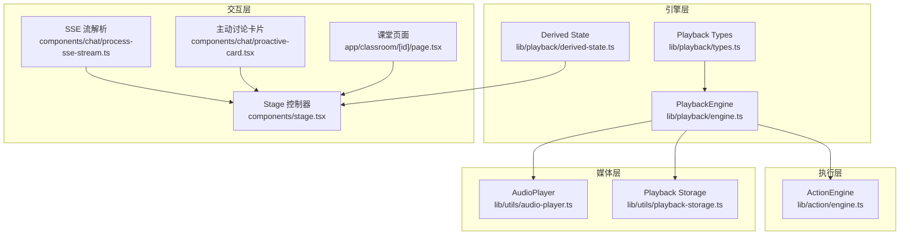
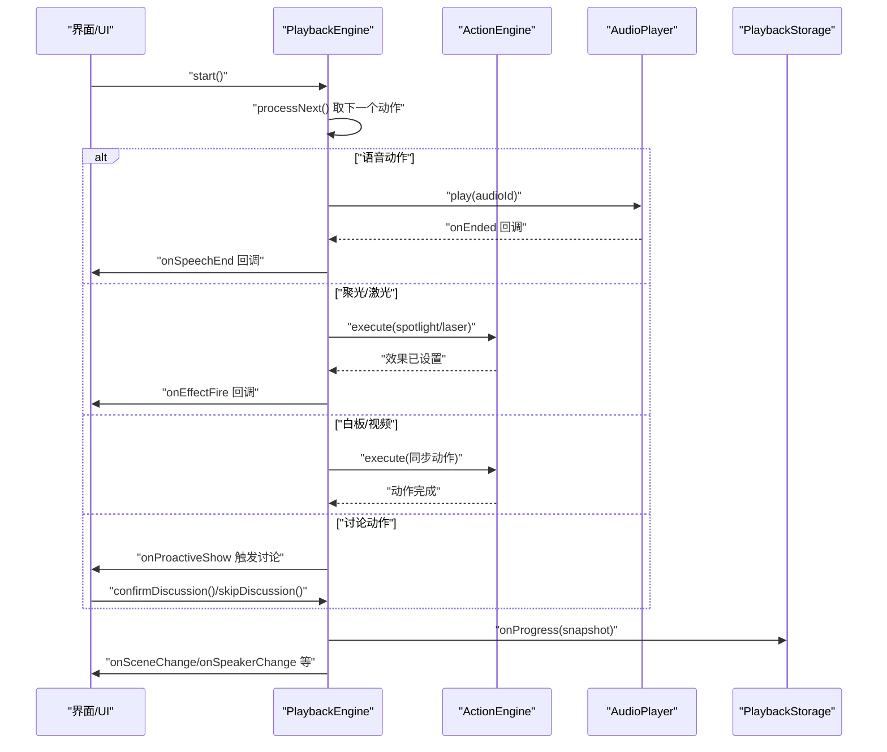
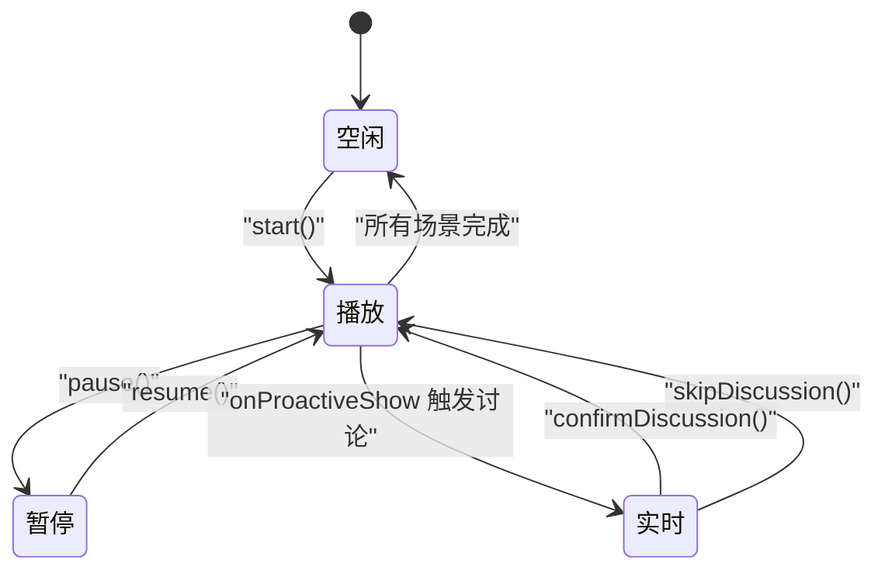
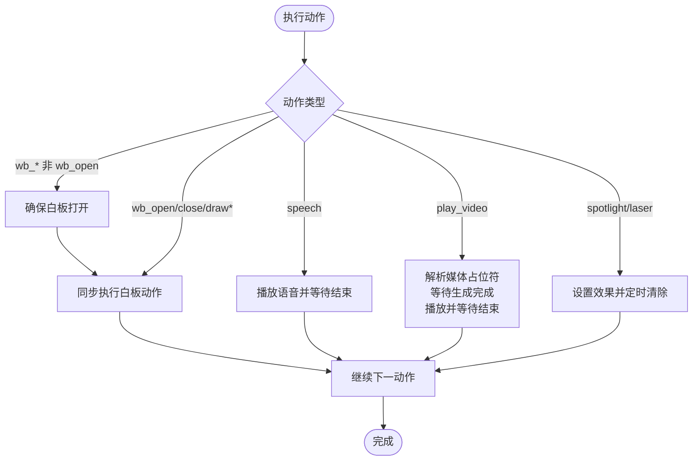
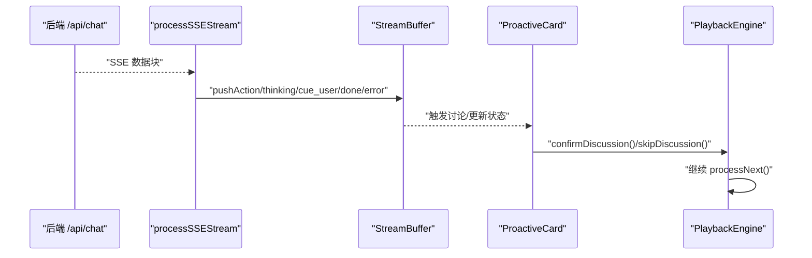
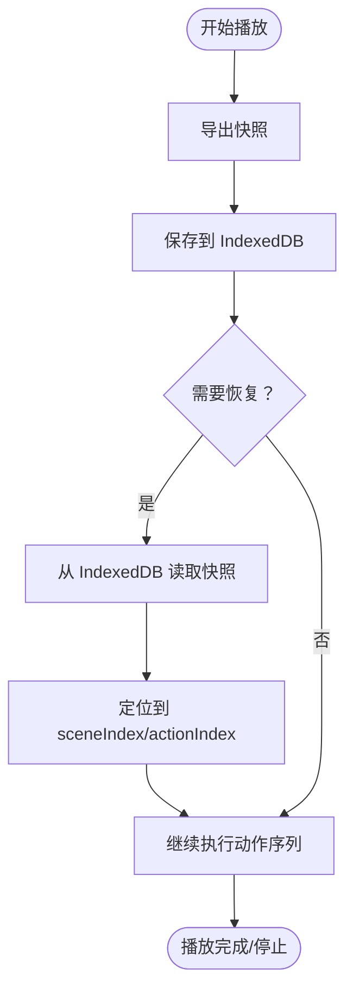
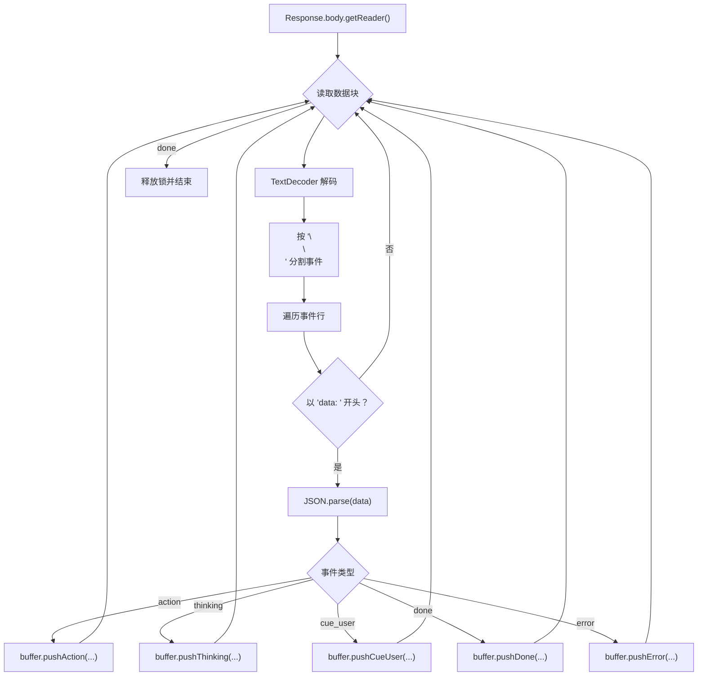
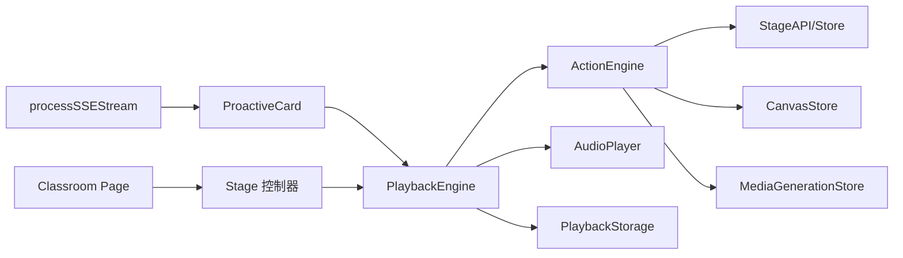

# 播放引擎

<cite>
**本文引用的文件**
- [lib/playback/engine.ts](file://lib/playback/engine.ts)
- [lib/playback/types.ts](file://lib/playback/types.ts)
- [lib/playback/derived-state.ts](file://lib/playback/derived-state.ts)
- [lib/action/engine.ts](file://lib/action/engine.ts)
- [lib/utils/audio-player.ts](file://lib/utils/audio-player.ts)
- [lib/utils/playback-storage.ts](file://lib/utils/playback-storage.ts)
- [components/stage.tsx](file://components/stage.tsx)
- [components/chat/process-sse-stream.ts](file://components/chat/process-sse-stream.ts)
- [app/classroom/[id]/page.tsx](file://app/classroom/[id]/page.tsx)
- [components/chat/proactive-card.tsx](file://components/chat/proactive-card.tsx)
- [lib/api/stage-api-types.ts](file://lib/api/stage-api-types.ts)
</cite>

## 目录
1. [简介](#简介)
2. [项目结构](#项目结构)
3. [核心组件](#核心组件)
4. [架构总览](#架构总览)
5. [详细组件分析](#详细组件分析)
6. [依赖关系分析](#依赖关系分析)
7. [性能考量](#性能考量)
8. [故障排查指南](#故障排查指南)
9. [结论](#结论)
10. [附录：使用示例与扩展开发指南](#附录使用示例与扩展开发指南)

## 简介
本技术文档围绕“播放引擎”系统，系统性阐述其状态机设计、动作执行引擎、用户交互处理、进度控制与恢复、实时流式传输（SSE）以及性能优化与内存管理策略。文档以代码为依据，结合可视化图示，帮助开发者快速理解并扩展播放引擎能力。

## 项目结构
播放引擎相关代码主要分布在以下模块：
- 引擎层：播放引擎与类型定义
- 执行层：统一的动作执行引擎
- 媒体层：音频播放器与媒体生成存储
- 交互层：SSE 流解析、主动讨论卡片、课堂页面加载
- 状态派生：将原始状态汇总为可消费的播放视图

图表来源
- [lib/playback/engine.ts:1-524](file://lib/playback/engine.ts#L1-L524)
- [lib/playback/types.ts:1-63](file://lib/playback/types.ts#L1-L63)
- [lib/playback/derived-state.ts:1-102](file://lib/playback/derived-state.ts#L1-L102)
- [lib/action/engine.ts:1-519](file://lib/action/engine.ts#L1-L519)
- [lib/utils/audio-player.ts:1-188](file://lib/utils/audio-player.ts#L1-L188)
- [lib/utils/playback-storage.ts:1-59](file://lib/utils/playback-storage.ts#L1-L59)
- [components/chat/process-sse-stream.ts:1-122](file://components/chat/process-sse-stream.ts#L1-L122)
- [components/chat/proactive-card.tsx:91-116](file://components/chat/proactive-card.tsx#L91-L116)
- [components/stage.tsx:239-261](file://components/stage.tsx#L239-L261)
- [app/classroom/[id]/page.tsx:34-58](file://app/classroom/[id]/page.tsx#L34-L58)

章节来源
- [lib/playback/engine.ts:1-524](file://lib/playback/engine.ts#L1-L524)
- [lib/action/engine.ts:1-519](file://lib/action/engine.ts#L1-L519)
- [lib/utils/audio-player.ts:1-188](file://lib/utils/audio-player.ts#L1-L188)
- [lib/utils/playback-storage.ts:1-59](file://lib/utils/playback-storage.ts#L1-L59)
- [components/chat/process-sse-stream.ts:1-122](file://components/chat/process-sse-stream.ts#L1-L122)
- [components/chat/proactive-card.tsx:91-116](file://components/chat/proactive-card.tsx#L91-L116)
- [components/stage.tsx:239-261](file://components/stage.tsx#L239-L261)
- [app/classroom/[id]/page.tsx:34-58](file://app/classroom/[id]/page.tsx#L34-L58)

## 核心组件
- 播放引擎 PlaybackEngine：统一的课堂播放与实时讨论状态机，负责动作消费、进度回调、讨论触发与暂停/恢复等。
- 动作执行引擎 ActionEngine：统一的动作执行层，支持“即发即忘”（如聚光灯、激光）与“同步阻塞”（如语音、视频、白板）两类模式。
- 音频播放器 AudioPlayer：封装 HTMLAudioElement，从 IndexedDB 加载预生成 TTS 音频，支持音量、倍速、静音、播放/暂停/停止。
- 播放进度存储 PlaybackStorage：以 IndexedDB 存储最小化快照（场景索引、动作索引、已消费讨论），用于断点续播。
- SSE 流解析 processSSEStream：解析 /api/chat 的服务器推送事件，将事件转化为动作、思考态、提示用户等消息并入缓冲。
- 主动讨论卡片 ProactiveCard：在触发讨论前提供倒计时与自动跳过机制，配合引擎完成交互闭环。
- Stage 控制器：协调引擎生命周期、重置场景状态、创建 ActionEngine 并驱动播放。
- 课堂页面 Classroom Page：加载本地或服务端课堂数据，驱动 Stage 初始化。

章节来源
- [lib/playback/engine.ts:1-524](file://lib/playback/engine.ts#L1-L524)
- [lib/action/engine.ts:1-519](file://lib/action/engine.ts#L1-L519)
- [lib/utils/audio-player.ts:1-188](file://lib/utils/audio-player.ts#L1-L188)
- [lib/utils/playback-storage.ts:1-59](file://lib/utils/playback-storage.ts#L1-L59)
- [components/chat/process-sse-stream.ts:1-122](file://components/chat/process-sse-stream.ts#L1-L122)
- [components/chat/proactive-card.tsx:91-116](file://components/chat/proactive-card.tsx#L91-L116)
- [components/stage.tsx:239-261](file://components/stage.tsx#L239-L261)
- [app/classroom/[id]/page.tsx:34-58](file://app/classroom/[id]/page.tsx#L34-L58)

## 架构总览
播放引擎采用“状态机 + 动作执行引擎”的分层设计：
- 上层：PlaybackEngine 维护引擎模式（空闲/播放/暂停/实时），按顺序消费 Scene.actions，触发 UI 回调与动作执行。
- 中层：ActionEngine 负责具体动作的执行与清理，区分即发即忘与同步阻塞两类。
- 下层：AudioPlayer 提供音频播放能力；PlaybackStorage 提供断点续播；SSE 解析器提供实时交互数据。

图表来源
- [lib/playback/engine.ts:369-524](file://lib/playback/engine.ts#L369-L524)
- [lib/action/engine.ts:80-125](file://lib/action/engine.ts#L80-L125)
- [lib/utils/audio-player.ts:29-70](file://lib/utils/audio-player.ts#L29-L70)
- [lib/utils/playback-storage.ts:21-34](file://lib/utils/playback-storage.ts#L21-L34)

## 详细组件分析

### 状态机设计与课堂状态转换
- 状态集合：空闲、播放、暂停、实时。
- 转换规则：
  - start() → 播放
  - pause() → 暂停；resume() → 播放
  - 讨论触发后进入暂停态等待确认，确认后继续播放，或跳过讨论
  - 全部场景完成后回到空闲态
- 实时流式传输：通过 SSE 推送讨论触发事件，引擎在 3 秒延迟后显示主动卡片，允许用户确认或跳过。

图表来源
- [lib/playback/engine.ts:7-24](file://lib/playback/engine.ts#L7-L24)
- [lib/playback/types.ts:14-15](file://lib/playback/types.ts#L14-L15)
- [components/chat/proactive-card.tsx:91-116](file://components/chat/proactive-card.tsx#L91-L116)

章节来源
- [lib/playback/engine.ts:7-24](file://lib/playback/engine.ts#L7-L24)
- [lib/playback/types.ts:14-15](file://lib/playback/types.ts#L14-L15)
- [components/chat/proactive-card.tsx:91-116](file://components/chat/proactive-card.tsx#L91-L116)

### 动作执行引擎工作机制
- 即发即忘动作（聚光灯/激光）：设置画布效果，定时自动清除，不阻塞后续动作。
- 同步动作（语音/视频/白板）：等待动作完成后再继续下一动作。
- 白板自动打开：当检测到非 wb_open 的白板动作时，先确保白板打开再执行。
- 媒体解析：视频播放前解析媒体占位符 ID，等待生成任务完成或失败处理。

图表来源
- [lib/action/engine.ts:80-125](file://lib/action/engine.ts#L80-L125)
- [lib/action/engine.ts:149-161](file://lib/action/engine.ts#L149-L161)
- [lib/action/engine.ts:165-176](file://lib/action/engine.ts#L165-L176)
- [lib/action/engine.ts:180-228](file://lib/action/engine.ts#L180-L228)
- [lib/action/engine.ts:266-278](file://lib/action/engine.ts#L266-L278)

章节来源
- [lib/action/engine.ts:80-125](file://lib/action/engine.ts#L80-L125)
- [lib/action/engine.ts:149-161](file://lib/action/engine.ts#L149-L161)
- [lib/action/engine.ts:165-176](file://lib/action/engine.ts#L165-L176)
- [lib/action/engine.ts:180-228](file://lib/action/engine.ts#L180-L228)
- [lib/action/engine.ts:266-278](file://lib/action/engine.ts#L266-L278)

### 用户交互处理系统
- SSE 流解析：将 /api/chat 的事件流解析为动作、思考态、提示用户、完成与错误事件，推送到缓冲区。
- 主动讨论卡片：展示倒计时进度，超时自动跳过；用户可手动确认或跳过。
- 讨论生命周期：引擎在 3 秒延迟后显示卡片，等待用户确认或跳过，然后继续播放。

图表来源
- [components/chat/process-sse-stream.ts:12-122](file://components/chat/process-sse-stream.ts#L12-L122)
- [components/chat/proactive-card.tsx:91-116](file://components/chat/proactive-card.tsx#L91-L116)
- [lib/playback/engine.ts:482-497](file://lib/playback/engine.ts#L482-L497)

章节来源
- [components/chat/process-sse-stream.ts:12-122](file://components/chat/process-sse-stream.ts#L12-L122)
- [components/chat/proactive-card.tsx:91-116](file://components/chat/proactive-card.tsx#L91-L116)
- [lib/playback/engine.ts:482-497](file://lib/playback/engine.ts#L482-L497)

### 进度控制与恢复机制
- 快照结构：包含场景索引、动作索引、已消费讨论列表与场景 ID。
- 恢复策略：加载快照后，从对应场景与动作继续执行；对已消费讨论进行去重处理。
- 断点续播：引擎在每次推进前回调进度，写入 IndexedDB；播放启动时读取并恢复。

图表来源
- [lib/playback/engine.ts:94-101](file://lib/playback/engine.ts#L94-L101)
- [lib/utils/playback-storage.ts:21-51](file://lib/utils/playback-storage.ts#L21-L51)

章节来源
- [lib/playback/engine.ts:94-101](file://lib/playback/engine.ts#L94-L101)
- [lib/utils/playback-storage.ts:21-51](file://lib/utils/playback-storage.ts#L21-L51)

### 实时流式传输（SSE）实现
- 客户端解析：基于 ReadableStream 的 Reader 循环读取，按双换行符拆分事件，解析 data 字段。
- 事件类型：action、thinking、cue_user、done、error，分别映射到缓冲区的不同 push 方法。
- 错误处理：解析异常与 error 事件均记录日志并可抛出，保证流的健壮性。

图表来源
- [components/chat/process-sse-stream.ts:12-122](file://components/chat/process-sse-stream.ts#L12-L122)

章节来源
- [components/chat/process-sse-stream.ts:12-122](file://components/chat/process-sse-stream.ts#L12-L122)

### 音频播放与 TTS 集成
- 预生成缓存：从 IndexedDB 读取预生成音频，若不存在则回退到“阅读计时器”（无音频时的文本朗读模拟）。
- 播放控制：支持暂停、恢复、停止、音量、倍速、静音；播放结束自动清理 Blob URL。
- 与引擎协作：语音动作优先尝试音频播放，失败则降级为阅读计时器，保证流程连续性。

章节来源
- [lib/utils/audio-player.ts:29-70](file://lib/utils/audio-player.ts#L29-L70)
- [lib/playback/engine.ts:436-444](file://lib/playback/engine.ts#L436-L444)

### 课堂数据加载与初始化
- 本地优先：优先从 IndexedDB 加载课堂数据；若为空则回退到服务端接口。
- 场景切换：Stage 控制器在场景变更时重置状态、停止旧引擎、创建新 ActionEngine 并启动播放。

章节来源
- [app/classroom/[id]/page.tsx:34-58](file://app/classroom/[id]/page.tsx#L34-L58)
- [components/stage.tsx:239-261](file://components/stage.tsx#L239-L261)

## 依赖关系分析
- PlaybackEngine 依赖 ActionEngine、AudioPlayer、PlaybackStorage 与回调接口。
- ActionEngine 依赖 StageStore/StageAPI、CanvasStore、媒体生成存储与 KaTeX 渲染。
- SSE 解析器与 UI 协同，驱动讨论触发与确认。
- Stage 控制器作为编排者，连接页面、引擎与存储。

图表来源
- [lib/playback/engine.ts:73-84](file://lib/playback/engine.ts#L73-L84)
- [lib/action/engine.ts:12-34](file://lib/action/engine.ts#L12-L34)
- [components/chat/process-sse-stream.ts:12-17](file://components/chat/process-sse-stream.ts#L12-L17)
- [components/chat/proactive-card.tsx:91-116](file://components/chat/proactive-card.tsx#L91-L116)
- [components/stage.tsx:239-261](file://components/stage.tsx#L239-L261)
- [app/classroom/[id]/page.tsx:34-58](file://app/classroom/[id]/page.tsx#L34-L58)

章节来源
- [lib/playback/engine.ts:73-84](file://lib/playback/engine.ts#L73-L84)
- [lib/action/engine.ts:12-34](file://lib/action/engine.ts#L12-L34)
- [components/chat/process-sse-stream.ts:12-17](file://components/chat/process-sse-stream.ts#L12-L17)
- [components/chat/proactive-card.tsx:91-116](file://components/chat/proactive-card.tsx#L91-L116)
- [components/stage.tsx:239-261](file://components/stage.tsx#L239-L261)
- [app/classroom/[id]/page.tsx:34-58](file://app/classroom/[id]/page.tsx#L34-L58)

## 性能考量
- 即发即忘效果的定时清理：避免长期持有视觉效果导致的内存与渲染压力。
- 同步动作的等待策略：视频与白板动作等待完成再继续，减少并发冲突与状态抖动。
- 媒体生成等待：订阅生成状态变化，避免轮询带来的 CPU 占用。
- SSE 流解析：按块解码与增量拼接，降低内存峰值；事件按需处理，避免堆积。
- 音频播放：播放结束后及时释放 Blob URL，避免内存泄漏；播放速率与音量即时生效，减少重复设置开销。
- 断点续播：仅保存必要字段，减少存储与 IO 压力；恢复时快速定位到断点。

[本节为通用性能建议，无需特定文件引用]

## 故障排查指南
- 播放卡住或未继续：检查 PlaybackEngine 的 processNext 是否被中断（如用户暂停/停止），确认 onProgress 回调是否持续触发。
- 语音无声：确认 IndexedDB 中是否存在对应音频；若不存在，引擎会回退到阅读计时器；检查 AudioPlayer 的 play 返回值与错误日志。
- 讨论未触发：确认 SSE 事件是否正确推送 action 与 cue_user；检查 ProactiveCard 的倒计时与用户交互。
- 白板动作无效：确认是否先执行了 wb_open；ActionEngine 在非 wb_open 的白板动作前会自动打开白板。
- 媒体播放失败：检查媒体生成任务状态；若失败则跳过该动作，避免阻塞后续流程。
- 断点续播异常：确认 sceneId 一致性；若场景变更，应丢弃旧快照并重新开始。

章节来源
- [lib/playback/engine.ts:369-524](file://lib/playback/engine.ts#L369-L524)
- [lib/utils/audio-player.ts:29-70](file://lib/utils/audio-player.ts#L29-L70)
- [lib/utils/playback-storage.ts:21-51](file://lib/utils/playback-storage.ts#L21-L51)
- [lib/action/engine.ts:180-228](file://lib/action/engine.ts#L180-L228)

## 结论
播放引擎通过清晰的状态机与统一的动作执行层，实现了从课堂空闲到播放再到实时交互的完整闭环。借助 SSE 实时流与断点续播机制，系统在复杂教学场景中保持流畅与可控。通过即发即忘与同步阻塞的混合执行模型，既能保证视觉反馈的即时性，又能确保关键动作的顺序一致性。

[本节为总结性内容，无需特定文件引用]

## 附录：使用示例与扩展开发指南

### 使用示例
- 启动播放：在页面加载后，从本地或服务端获取课堂数据，创建 ActionEngine 与 AudioPlayer，调用 PlaybackEngine.start() 开始播放。
- 处理讨论：监听 onProactiveShow，展示 ProactiveCard；根据用户选择调用 confirmDiscussion 或 skipDiscussion。
- 恢复播放：在启动时读取 PlaybackStorage，若存在快照则调用 setMode('playing') 并从断点继续。

章节来源
- [app/classroom/[id]/page.tsx:34-58](file://app/classroom/[id]/page.tsx#L34-L58)
- [lib/utils/playback-storage.ts:40-51](file://lib/utils/playback-storage.ts#L40-L51)
- [components/chat/proactive-card.tsx:91-116](file://components/chat/proactive-card.tsx#L91-L116)

### 扩展开发指南
- 新增动作类型：
  - 在 ActionEngine 中添加新的同步/异步分支，并实现对应的执行方法。
  - 在 PlaybackEngine 的 switch 中增加动作类型处理，必要时触发 UI 回调或暂停等待用户确认。
- 自定义媒体解析：
  - 在 ActionEngine 的媒体解析逻辑中扩展占位符映射与生成任务等待策略。
- 自定义播放速度：
  - 通过 PlaybackEngine 的回调 getPlaybackSpeed 获取当前倍速，AudioPlayer 的 setPlaybackRate 应用到当前播放。
- 自定义效果清理：
  - 调整 EFFECT_AUTO_CLEAR_MS 以平衡即时反馈与资源占用。

章节来源
- [lib/action/engine.ts:80-125](file://lib/action/engine.ts#L80-L125)
- [lib/playback/engine.ts:398-524](file://lib/playback/engine.ts#L398-L524)
- [lib/utils/audio-player.ts:166-171](file://lib/utils/audio-player.ts#L166-L171)