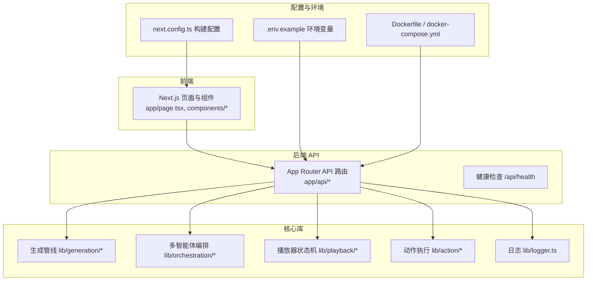
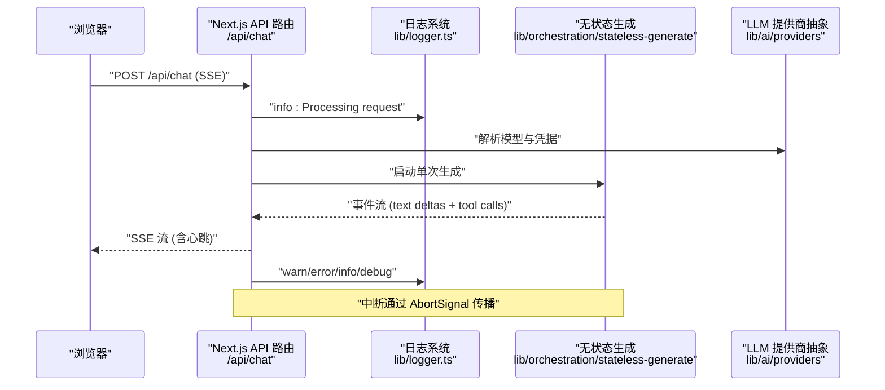
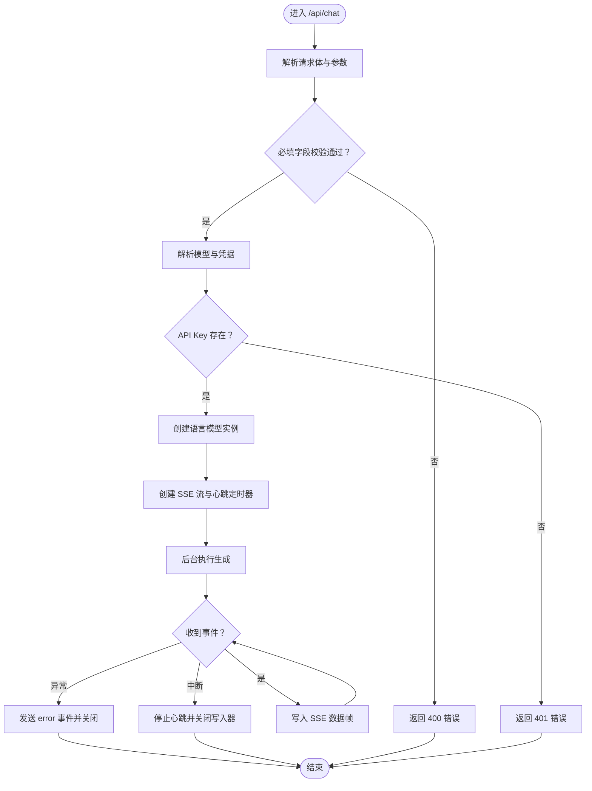
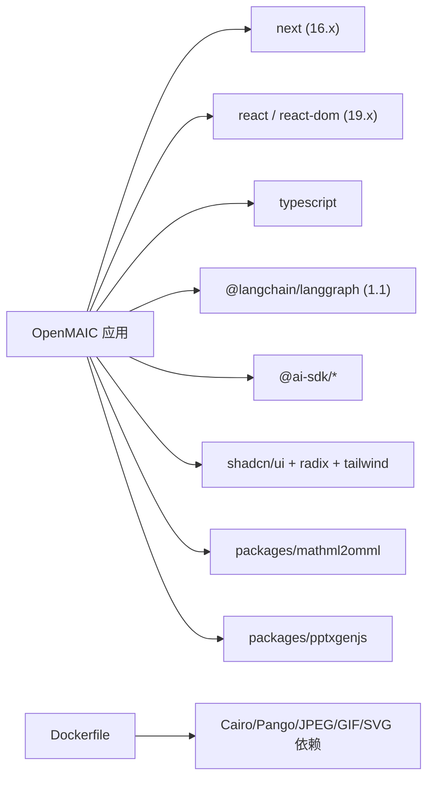

# 故障排除和维护

<cite>
**本文引用的文件**
- [README.md](file://README.md)
- [package.json](file://package.json)
- [Dockerfile](file://Dockerfile)
- [docker-compose.yml](file://docker-compose.yml)
- [.env.example](file://.env.example)
- [next.config.ts](file://next.config.ts)
- [lib/logger.ts](file://lib/logger.ts)
- [app/api/chat/route.ts](file://app/api/chat/route.ts)
- [app/api/health/route.ts](file://app/api/health/route.ts)
- [community/feishu.md](file://community/feishu.md)
</cite>

## 目录
1. [简介](#简介)
2. [项目结构](#项目结构)
3. [核心组件](#核心组件)
4. [架构总览](#架构总览)
5. [详细组件分析](#详细组件分析)
6. [依赖关系分析](#依赖关系分析)
7. [性能考虑](#性能考虑)
8. [故障排除指南](#故障排除指南)
9. [结论](#结论)
10. [附录](#附录)

## 简介
本指南面向运维与开发人员，聚焦 OpenMAIC 的安装、配置、运行时异常、性能优化、监控与日志、升级与版本兼容、社区支持、维护最佳实践以及紧急情况处理流程。文档基于仓库中的实际实现与配置文件进行梳理，确保可操作性强且与代码一致。

## 项目结构
OpenMAIC 是一个基于 Next.js 的全栈应用，采用 App Router 组织 API 路由与页面，核心业务逻辑集中在 lib 目录（生成管线、多智能体编排、播放器状态机、动作执行等），前端组件位于 components 目录，提供丰富的 UI 与交互能力。部署支持本地开发、Vercel 与 Docker Compose。

图表来源
- [README.md: 372-426:372-426](file://README.md#L372-L426)
- [next.config.ts: 1-13:1-13](file://next.config.ts#L1-L13)
- [Dockerfile: 1-52:1-52](file://Dockerfile#L1-L52)
- [docker-compose.yml: 1-16:1-16](file://docker-compose.yml#L1-L16)
- [.env.example: 1-124:1-124](file://.env.example#L1-L124)

章节来源
- [README.md: 372-426:372-426](file://README.md#L372-L426)
- [next.config.ts: 1-13:1-13](file://next.config.ts#L1-L13)
- [Dockerfile: 1-52:1-52](file://Dockerfile#L1-L52)
- [docker-compose.yml: 1-16:1-16](file://docker-compose.yml#L1-L16)
- [.env.example: 1-124:1-124](file://.env.example#L1-L124)

## 核心组件
- 日志系统：统一的日志工厂，支持级别过滤与 JSON 输出格式，便于在容器与生产环境中采集与分析。
- 健康检查：轻量级健康端点返回服务状态与版本信息，用于探活与版本核对。
- 聊天流式接口：基于 SSE 的无状态聊天端点，支持心跳保活、中断处理与错误事件推送。
- 构建与运行：Next.js standalone 输出、体积限制与代理客户端最大请求体大小配置；Docker 多阶段构建与运行时最小化镜像。

章节来源
- [lib/logger.ts: 1-53:1-53](file://lib/logger.ts#L1-L53)
- [app/api/health/route.ts: 1-8:1-8](file://app/api/health/route.ts#L1-L8)
- [app/api/chat/route.ts: 1-191:1-191](file://app/api/chat/route.ts#L1-L191)
- [next.config.ts: 1-13:1-13](file://next.config.ts#L1-L13)

## 架构总览
下图展示从浏览器到后端 API、再到多智能体编排与生成管线的整体调用链路，以及日志与健康检查在其中的位置。

图表来源
- [app/api/chat/route.ts: 44-191:44-191](file://app/api/chat/route.ts#L44-L191)
- [lib/logger.ts: 28-52:28-52](file://lib/logger.ts#L28-L52)

## 详细组件分析

### 日志系统
- 功能要点
  - 支持 debug/info/warn/error 四级日志。
  - 通过环境变量控制最小日志级别与输出格式（文本或 JSON）。
  - 按标签聚合日志，便于区分模块与来源。
- 使用建议
  - 生产环境建议设置 LOG_LEVEL=info 或 warn，并启用 LOG_FORMAT=json 以利于日志平台采集。
  - 对关键路径（如请求开始、错误、中断）打点，避免在高频路径中输出 debug。

章节来源
- [lib/logger.ts: 1-53:1-53](file://lib/logger.ts#L1-L53)
- [.env.example: 121-124:121-124](file://.env.example#L121-L124)

### 健康检查端点
- 功能要点
  - 返回服务状态与版本号，便于自动化探活与版本核对。
- 使用建议
  - 在负载均衡与容器编排中使用该端点进行存活/就绪探测。
  - 结合日志与指标系统，建立告警阈值。

章节来源
- [app/api/health/route.ts: 1-8:1-8](file://app/api/health/route.ts#L1-L8)

### 聊天 SSE 端点
- 功能要点
  - 接收完整客户端状态，执行一次性生成，流式返回事件。
  - 支持心跳保活，防止代理/浏览器关闭空闲连接。
  - 中断通过 AbortSignal 传播，优雅关闭写入器。
  - 错误时发送 error 事件并关闭连接。
- 关键参数
  - 最大持续时间：60 秒。
  - 心跳间隔：约 15 秒。
  - 请求体字段校验：messages、storeState、config.agentIds。
- 常见问题定位
  - 缺少必填字段：返回 400 并携带错误码。
  - 未配置 API Key：返回 401。
  - 生成过程中异常：记录错误并发送 SSE error 事件。

图表来源
- [app/api/chat/route.ts: 44-191:44-191](file://app/api/chat/route.ts#L44-L191)

章节来源
- [app/api/chat/route.ts: 1-191:1-191](file://app/api/chat/route.ts#L1-L191)

### 构建与运行配置
- Next.js 配置
  - standalone 输出（非 Vercel 环境）。
  - 包转译：mathml2omml、pptxgenjs。
  - 代理客户端最大请求体：200MB。
- Docker 配置
  - 多阶段构建：依赖安装、构建产物、运行时镜像。
  - 运行时最小化镜像，包含 Cairo/Pango/JPEG/GIF/SVG 依赖。
  - 默认监听 0.0.0.0:3000，用户为 non-root。
- 环境变量
  - 支持多种 LLM/TTS/ASR/图像/视频/搜索提供商的 API Key 与自定义 Base URL。
  - 可选代理、默认模型、日志级别与格式。

章节来源
- [next.config.ts: 1-13:1-13](file://next.config.ts#L1-L13)
- [Dockerfile: 1-52:1-52](file://Dockerfile#L1-L52)
- [docker-compose.yml: 1-16:1-16](file://docker-compose.yml#L1-L16)
- [.env.example: 1-124:1-124](file://.env.example#L1-L124)

## 依赖关系分析
- 应用依赖
  - 前端框架：Next.js 16、React 19、TypeScript。
  - 多智能体编排：@langchain/langgraph 1.1。
  - LLM 抽象与供应商：ai、@ai-sdk/*。
  - UI 与工具：shadcn/ui、Radix、Tailwind、echarts、prosemirror 等。
- 工作空间包
  - packages/mathml2omml 与 packages/pptxgenjs 作为工作区子包参与构建。
- 运行时与容器
  - Dockerfile 显式安装 Cairo/Pango/JPEG/GIF/SVG 依赖，满足图像/渲染相关功能。
  - docker-compose 将数据目录挂载至持久卷，便于重启后保留数据。

图表来源
- [package.json: 15-94:15-94](file://package.json#L15-L94)
- [Dockerfile: 13-38:13-38](file://Dockerfile#L13-L38)
- [pnpm-workspace.yaml: 1-3:1-3](file://pnpm-workspace.yaml#L1-L3)

章节来源
- [package.json: 15-94:15-94](file://package.json#L15-L94)
- [pnpm-workspace.yaml: 1-3:1-3](file://pnpm-workspace.yaml#L1-L3)
- [Dockerfile: 13-38:13-38](file://Dockerfile#L13-L38)

## 性能考虑
- 内存与进程
  - 使用 Next.js standalone 输出，减少冷启动与内存占用。
  - Docker 运行时使用非 root 用户，降低权限风险。
- 网络与代理
  - 代理客户端最大请求体：200MB，适合富媒体场景。
  - 可通过环境变量配置 HTTP/HTTPS 代理，以适配受限网络。
- 数据库与存储
  - 项目未直接内置数据库；若需持久化，建议结合外部数据库与对象存储。
- 图像与渲染
  - Dockerfile 安装 Cairo/Pango/JPEG/GIF/SVG 依赖，保障图像生成与渲染稳定性。
- 生成与流式
  - 聊天端点最大持续时间为 60 秒，建议前端合理设置超时与重试策略。
  - 心跳保活避免代理/浏览器断开长连接，提升用户体验。

章节来源
- [next.config.ts: 7-9:7-9](file://next.config.ts#L7-L9)
- [Dockerfile: 30-47:30-47](file://Dockerfile#L30-L47)
- [app/api/chat/route.ts: 25-26:25-26](file://app/api/chat/route.ts#L25-L26)

## 故障排除指南

### 安装与环境
- Node.js 与包管理器版本不匹配
  - 症状：安装失败或构建报错。
  - 处理：确保 Node.js 版本满足要求，使用 pnpm 10+。
- 依赖安装失败（sharp/@napi-rs/canvas）
  - 症状：安装阶段报缺失系统依赖。
  - 处理：Dockerfile 已安装 Python/build-base 与 Cairo/Pango/JPEG/GIF/SVG 开发包；本地请补齐对应系统依赖。
- 工作区包构建
  - 症状：工作区子包未正确构建。
  - 处理：执行根目录脚本完成子包构建后再运行。

章节来源
- [README.md: 75-78:75-78](file://README.md#L75-L78)
- [Dockerfile: 12-13:12-13](file://Dockerfile#L12-L13)
- [package.json: 7](file://package.json#L7)

### 配置错误
- 缺少 LLM API Key
  - 症状：/api/chat 返回 401。
  - 处理：在 .env.local 填写至少一个提供商的 API Key；或通过请求体传入。
- 模型字符串格式错误
  - 症状：解析模型失败。
  - 处理：确保 provider:model 格式正确，或使用 DEFAULT_MODEL。
- 环境变量未生效
  - 症状：日志级别/格式未按预期。
  - 处理：确认 LOG_LEVEL 与 LOG_FORMAT 设置；Docker Compose 已加载 .env.local。

章节来源
- [app/api/chat/route.ts: 63-72:63-72](file://app/api/chat/route.ts#L63-L72)
- [.env.example: 117-124:117-124](file://.env.example#L117-L124)
- [docker-compose.yml: 6-7:6-7](file://docker-compose.yml#L6-L7)

### 运行时异常
- SSE 连接被代理/浏览器关闭
  - 症状：长时间无输出后连接断开。
  - 处理：利用心跳保活机制；前端应处理心跳与重连。
- 生成过程抛出异常
  - 症状：SSE 返回 error 事件。
  - 处理：查看后端日志，定位具体环节；必要时缩短输入或调整模型。
- 请求体过大
  - 症状：上传富媒体内容导致 413/超时。
  - 处理：确认代理客户端最大请求体配置；优化媒体尺寸或分块传输。

章节来源
- [app/api/chat/route.ts: 96-116:96-116](file://app/api/chat/route.ts#L96-L116)
- [app/api/chat/route.ts: 143-172:143-172](file://app/api/chat/route.ts#L143-L172)
- [next.config.ts: 8](file://next.config.ts#L8)

### 性能问题
- 生成延迟高
  - 建议：切换更合适的模型（如 Gemini 3 Flash），或减少并发请求。
- 内存占用偏高
  - 建议：使用 standalone 输出与 Docker 运行时；限制同时在线会话数。
- 图像/渲染异常
  - 建议：确认 Docker 依赖已安装；必要时重建镜像。

章节来源
- [README.md: 114-116:114-116](file://README.md#L114-L116)
- [Dockerfile: 38-47:38-47](file://Dockerfile#L38-L47)

### 升级与版本兼容
- Next.js 与 React
  - 当前版本：Next.js 16、React 19；升级时注意实验特性与弃用 API。
- LangGraph
  - 当前版本：1.1；升级前先验证编排图与状态转换。
- ai 与 @ai-sdk/*
  - 建议小版本滚动升级，关注模型选择与响应格式变化。
- Docker 与 Node
  - 运行时使用 node:22-alpine；升级时同步测试镜像构建与依赖。

章节来源
- [package.json: 57-93:57-93](file://package.json#L57-L93)
- [Dockerfile: 2, 30](file://Dockerfile#L2,L30)

### 监控与日志分析
- 日志级别与格式
  - 建议：生产环境设为 info/json，便于集中采集与检索。
- 健康检查
  - 建议：在负载均衡与编排中配置探针，周期性访问 /api/health。
- 错误事件
  - 建议：前端订阅 SSE error 事件并上报；后端记录详细上下文。

章节来源
- [lib/logger.ts: 4-11:4-11](file://lib/logger.ts#L4-L11)
- [app/api/health/route.ts: 1-8:1-8](file://app/api/health/route.ts#L1-L8)
- [app/api/chat/route.ts: 161-167:161-167](file://app/api/chat/route.ts#L161-L167)

### 社区支持与资源
- Discord 社区
  - 通过 README 中的徽章链接加入讨论。
- 飞书交流群
  - 参考社区文档中的二维码与说明。
- GitHub 讨论区
  - 通过 Issues/ Discussions 提交问题与建议。

章节来源
- [README.md: 21-24:21-24](file://README.md#L21-L24)
- [community/feishu.md: 1-10:1-10](file://community/feishu.md#L1-L10)

### 维护最佳实践
- 定期更新
  - 滚动升级 Next.js、React、LangGraph 与相关 SDK。
- 安全补丁
  - 关注依赖安全通告，及时修复高危漏洞。
- 备份策略
  - docker-compose 已挂载数据卷，建议定期导出与归档。
- 灾难恢复
  - 基于 Docker 镜像与 .env.local 快速重建；验证 /api/health 与关键 API。

章节来源
- [docker-compose.yml: 8-12:8-12](file://docker-compose.yml#L8-L12)

### 紧急情况处理流程
- 立即措施
  - 查看 /api/health 与日志；回滚最近一次变更。
- 诊断步骤
  - 确认 API Key 与网络代理；检查 Docker 依赖是否齐全；观察 SSE 心跳与错误事件。
- 恢复上线
  - 修复后重新部署，逐步放量并监控指标。

章节来源
- [app/api/health/route.ts: 1-8:1-8](file://app/api/health/route.ts#L1-L8)
- [lib/logger.ts: 28-52:28-52](file://lib/logger.ts#L28-L52)
- [app/api/chat/route.ts: 96-116:96-116](file://app/api/chat/route.ts#L96-L116)

## 结论
本指南基于仓库中的实际实现，覆盖了从安装、配置、运行到性能优化与故障排除的全流程。建议在生产环境中启用结构化日志、健康检查与告警，并遵循滚动升级与备份策略，以获得稳定可靠的运行体验。

## 附录
- 快速核对清单
  - Node.js 与 pnpm 版本满足要求。
  - .env.local 配置了至少一个 LLM API Key。
  - Docker 依赖已安装或镜像构建成功。
  - LOG_LEVEL 与 LOG_FORMAT 已按环境设置。
  - /api/health 可正常访问。
  - SSE 心跳与错误事件处理正常。