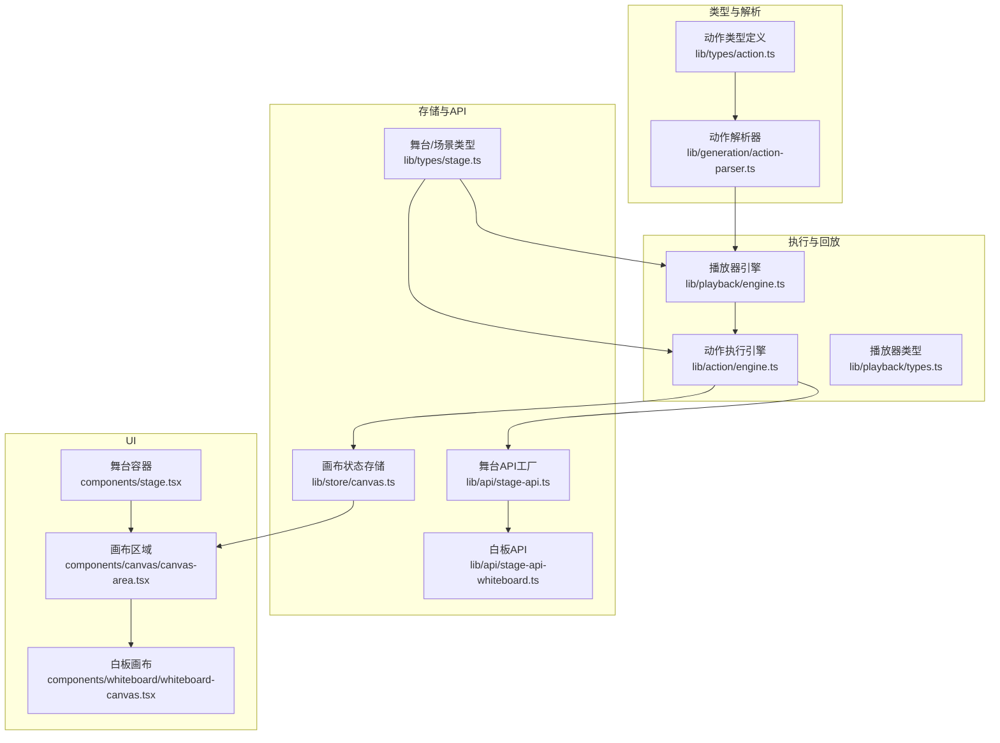
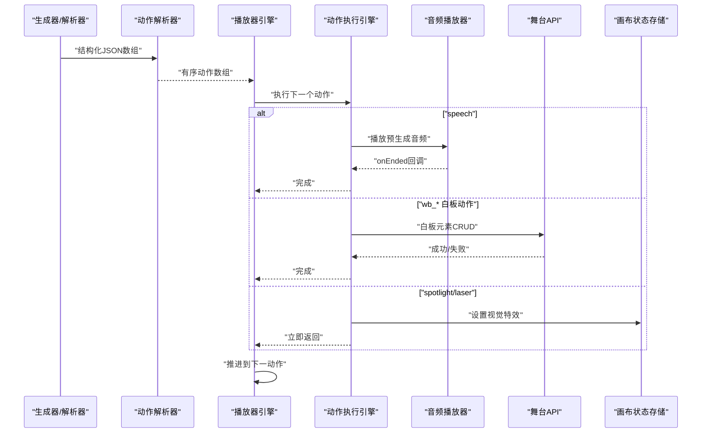
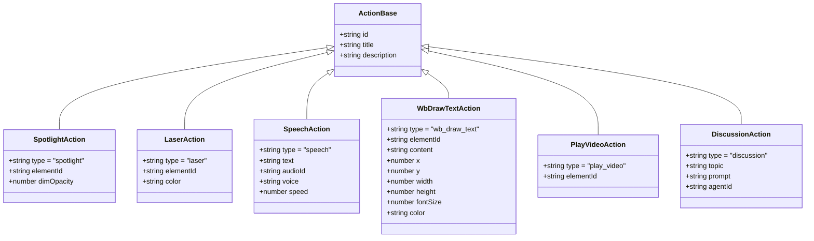
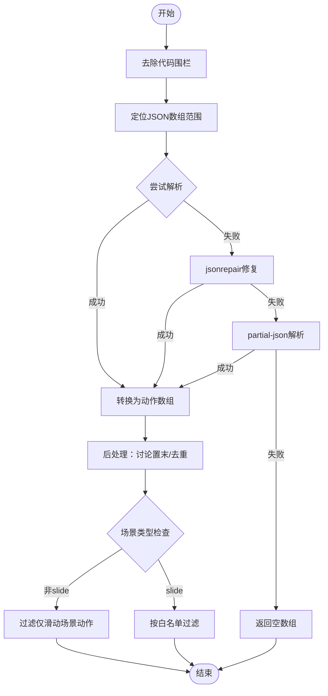
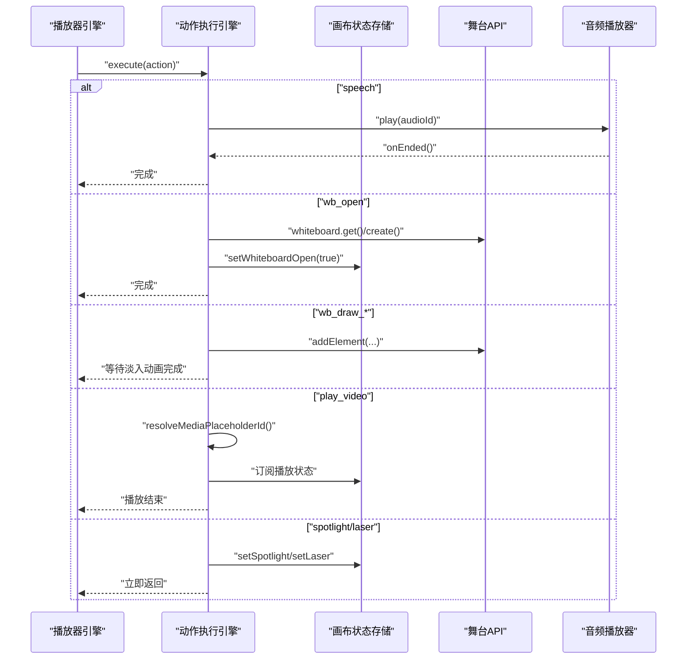
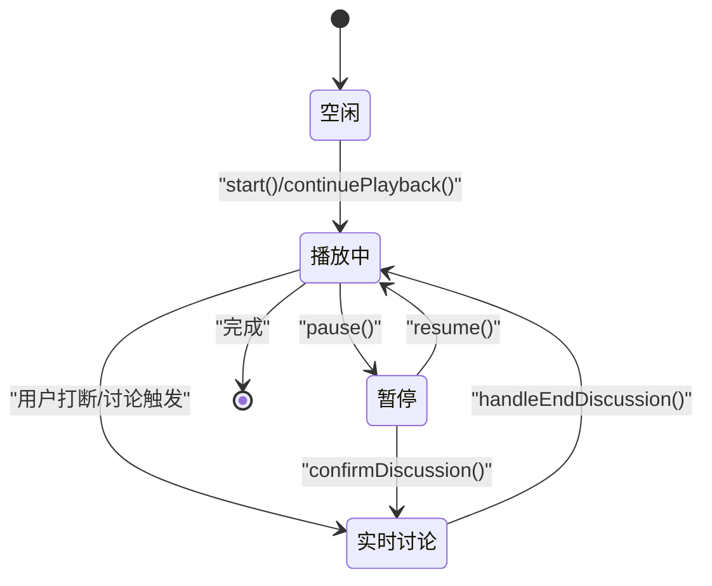
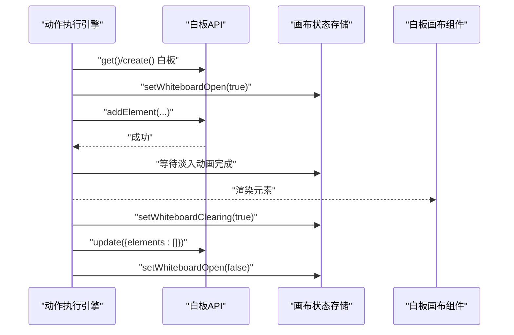
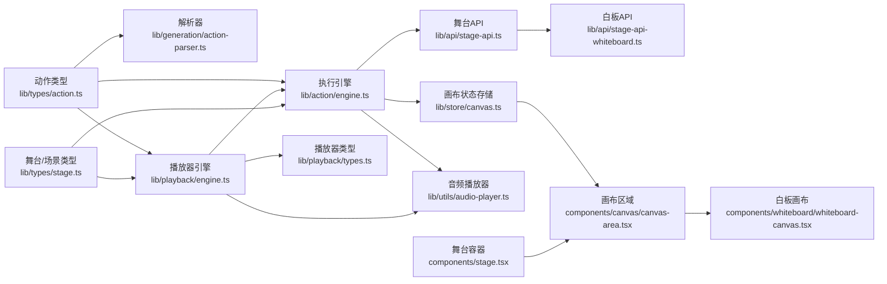

# 动作执行架构

<cite>
**本文引用的文件**
- [lib/action/engine.ts](file://lib/action/engine.ts)
- [lib/types/action.ts](file://lib/types/action.ts)
- [lib/generation/action-parser.ts](file://lib/generation/action-parser.ts)
- [lib/playback/engine.ts](file://lib/playback/engine.ts)
- [lib/playback/types.ts](file://lib/playback/types.ts)
- [lib/store/canvas.ts](file://lib/store/canvas.ts)
- [lib/api/stage-api.ts](file://lib/api/stage-api.ts)
- [lib/api/stage-api-whiteboard.ts](file://lib/api/stage-api-whiteboard.ts)
- [lib/types/stage.ts](file://lib/types/stage.ts)
- [lib/utils/audio-player.ts](file://lib/utils/audio-player.ts)
- [components/stage.tsx](file://components/stage.tsx)
- [components/canvas/canvas-area.tsx](file://components/canvas/canvas-area.tsx)
- [components/whiteboard/whiteboard-canvas.tsx](file://components/whiteboard/whiteboard-canvas.tsx)
</cite>

## 目录
1. [简介](#简介)
2. [项目结构](#项目结构)
3. [核心组件](#核心组件)
4. [架构总览](#架构总览)
5. [详细组件分析](#详细组件分析)
6. [依赖关系分析](#依赖关系分析)
7. [性能考量](#性能考量)
8. [故障排查指南](#故障排查指南)
9. [结论](#结论)
10. [附录](#附录)

## 简介
本技术文档围绕“动作执行架构”展开，系统性阐述动作解析、调度与执行的完整流程，动作类型系统设计，以及语音与白板动作的实现机制。文档还覆盖动作生命周期管理（创建、排队、执行、清理）、并发控制与资源管理（线程安全、内存优化、错误恢复），并给出扩展机制（新增动作类型、自定义执行逻辑、集成第三方服务）。

## 项目结构
动作执行架构由以下层次构成：
- 类型层：统一的动作类型定义与分类常量
- 解析层：将结构化输出转换为有序动作数组
- 执行层：统一的动作执行引擎，负责同步/异步动作的调度与执行
- 回放层：播放器状态机，负责按场景顺序消费动作，支持暂停/恢复/讨论中断
- 存储与API层：画布状态存储、舞台API（含白板CRUD）
- UI层：画布区域、白板画布、舞台容器等前端渲染与交互

图表来源
- [lib/types/action.ts:1-221](file://lib/types/action.ts#L1-L221)
- [lib/generation/action-parser.ts:1-155](file://lib/generation/action-parser.ts#L1-L155)
- [lib/playback/engine.ts:1-525](file://lib/playback/engine.ts#L1-L525)
- [lib/action/engine.ts:1-519](file://lib/action/engine.ts#L1-L519)
- [lib/playback/types.ts:1-63](file://lib/playback/types.ts#L1-L63)
- [lib/store/canvas.ts:1-473](file://lib/store/canvas.ts#L1-L473)
- [lib/api/stage-api.ts:1-91](file://lib/api/stage-api.ts#L1-L91)
- [lib/api/stage-api-whiteboard.ts:1-92](file://lib/api/stage-api-whiteboard.ts#L1-L92)
- [lib/types/stage.ts:1-124](file://lib/types/stage.ts#L1-L124)
- [components/stage.tsx:599-723](file://components/stage.tsx#L599-L723)
- [components/canvas/canvas-area.tsx:1-115](file://components/canvas/canvas-area.tsx#L1-L115)
- [components/whiteboard/whiteboard-canvas.tsx:30-84](file://components/whiteboard/whiteboard-canvas.tsx#L30-L84)

章节来源
- [lib/types/action.ts:1-221](file://lib/types/action.ts#L1-L221)
- [lib/generation/action-parser.ts:1-155](file://lib/generation/action-parser.ts#L1-L155)
- [lib/playback/engine.ts:1-525](file://lib/playback/engine.ts#L1-L525)
- [lib/action/engine.ts:1-519](file://lib/action/engine.ts#L1-L519)
- [lib/playback/types.ts:1-63](file://lib/playback/types.ts#L1-L63)
- [lib/store/canvas.ts:1-473](file://lib/store/canvas.ts#L1-L473)
- [lib/api/stage-api.ts:1-91](file://lib/api/stage-api.ts#L1-L91)
- [lib/api/stage-api-whiteboard.ts:1-92](file://lib/api/stage-api-whiteboard.ts#L1-L92)
- [lib/types/stage.ts:1-124](file://lib/types/stage.ts#L1-L124)
- [components/stage.tsx:599-723](file://components/stage.tsx#L599-L723)
- [components/canvas/canvas-area.tsx:1-115](file://components/canvas/canvas-area.tsx#L1-L115)
- [components/whiteboard/whiteboard-canvas.tsx:30-84](file://components/whiteboard/whiteboard-canvas.tsx#L30-L84)

## 核心组件
- 动作类型系统：定义了所有可执行动作的接口与联合类型，并标注“即时生效”与“同步等待”的动作集合，确保解析与执行的一致性。
- 动作解析器：从结构化JSON数组中提取动作与文本片段，生成有序动作序列；支持新旧格式兼容、容错修复与场景过滤。
- 动作执行引擎：统一调度器，区分“即时生效”（如spotlight、laser）与“同步等待”（如speech、白板绘制、视频播放）两类；内置效果自动清理与白板自动打开逻辑。
- 播放器引擎：状态机驱动的播放器，按场景顺序消费动作；支持TTS播放计时、讨论触发、用户打断、断点续播与快进/倒带。
- 画布状态存储：集中管理视觉特效（聚光灯、激光）、视频播放、白板开关与清空动画等UI状态。
- 舞台API：提供白板CRUD与元素操作能力，供动作执行引擎调用以完成白板绘制。
- UI层：画布区域与白板画布负责渲染与动画呈现，舞台容器协调播放器与UI交互。

章节来源
- [lib/types/action.ts:163-205](file://lib/types/action.ts#L163-L205)
- [lib/generation/action-parser.ts:42-154](file://lib/generation/action-parser.ts#L42-L154)
- [lib/action/engine.ts:80-125](file://lib/action/engine.ts#L80-L125)
- [lib/playback/engine.ts:369-523](file://lib/playback/engine.ts#L369-L523)
- [lib/store/canvas.ts:442-457](file://lib/store/canvas.ts#L442-L457)
- [lib/api/stage-api-whiteboard.ts:19-92](file://lib/api/stage-api-whiteboard.ts#L19-L92)
- [components/canvas/canvas-area.tsx:108-115](file://components/canvas/canvas-area.tsx#L108-L115)
- [components/whiteboard/whiteboard-canvas.tsx:79-84](file://components/whiteboard/whiteboard-canvas.tsx#L79-L84)

## 架构总览
动作执行架构采用“类型驱动 + 统一执行 + 状态机回放”的设计模式：
- 类型层确保解析与执行两端一致；
- 执行层屏蔽差异（TTS、白板、视频、特效）；
- 回放层保证播放顺序、用户交互与断点续播；
- 存储层解耦UI状态与业务逻辑；
- API层提供白板与元素操作能力。

图表来源
- [lib/generation/action-parser.ts:42-154](file://lib/generation/action-parser.ts#L42-L154)
- [lib/playback/engine.ts:369-523](file://lib/playback/engine.ts#L369-L523)
- [lib/action/engine.ts:80-125](file://lib/action/engine.ts#L80-L125)
- [lib/utils/audio-player.ts:29-49](file://lib/utils/audio-player.ts#L29-L49)
- [lib/api/stage-api-whiteboard.ts:19-92](file://lib/api/stage-api-whiteboard.ts#L19-L92)
- [lib/store/canvas.ts:442-457](file://lib/store/canvas.ts#L442-L457)

## 详细组件分析

### 动作类型系统
- 设计要点
  - 基础接口包含唯一ID与可选标题/描述；
  - 即时生效动作：spotlight、laser；
  - 同步动作：speech、play_video、wb_*系列、discussion；
  - 通过常量导出“即时生效”“仅滑动场景可用”“需等待完成”的集合，便于解析与回放阶段过滤与校验。
- 关键数据结构
  - Action联合类型与ActionType别名；
  - 各动作参数接口（如WbDrawTextAction、WbDrawChartAction等）；
  - 百分比几何类型用于响应式定位。

图表来源
- [lib/types/action.ts:14-182](file://lib/types/action.ts#L14-L182)

章节来源
- [lib/types/action.ts:14-205](file://lib/types/action.ts#L14-L205)

### 动作解析器
- 功能概述
  - 去除代码块围栏，定位JSON数组，尝试标准解析，再使用jsonrepair与partial-json增强鲁棒性；
  - 将“text”项转为speech动作，“action”项映射为具体动作类型；
  - 讨论动作强制置于末尾，且最多一个；
  - 非slide场景过滤掉仅滑动场景可用的动作；
  - 支持白名单过滤，防止越权动作（如学生代理模仿教师动作）。
- 容错策略
  - 多层解析回退，记录警告日志；
  - 过滤无效/不合法条目，保持输出动作序列的完整性与安全性。

图表来源
- [lib/generation/action-parser.ts:42-154](file://lib/generation/action-parser.ts#L42-L154)

章节来源
- [lib/generation/action-parser.ts:42-154](file://lib/generation/action-parser.ts#L42-L154)

### 动作执行引擎
- 设计模式
  - 统一入口execute(action)，根据动作类型分派至对应处理器；
  - 即时生效动作：设置画布特效，安排自动清理定时器；
  - 同步动作：speech等待音频结束；play_video等待播放结束；wb_*系列等待动画/渲染完成。
- 白板自动打开
  - 对于wb_*动作（除wb_open/wb_close），若白板未开启则先ensureWhiteboardOpen，确保后续绘制有效。
- 白板绘制细节
  - 文本、形状、图表、LaTeX、表格、直线等分别构造元素并调用舞台API添加；
  - 使用延迟等待元素淡入动画完成，保证回放节奏一致。
- 视频播放
  - 将元素ID映射到媒体占位符ID，等待生成任务完成；
  - 订阅画布store中的播放状态变化，直到视频停止播放。

图表来源
- [lib/action/engine.ts:80-519](file://lib/action/engine.ts#L80-L519)
- [lib/store/canvas.ts:335-342](file://lib/store/canvas.ts#L335-L342)
- [lib/api/stage-api-whiteboard.ts:57-92](file://lib/api/stage-api-whiteboard.ts#L57-L92)
- [lib/utils/audio-player.ts:29-49](file://lib/utils/audio-player.ts#L29-L49)

章节来源
- [lib/action/engine.ts:80-519](file://lib/action/engine.ts#L80-L519)

### 播放器引擎（状态机）
- 状态机
  - idle → playing → paused → live，支持在讨论中切换；
  - 提供开始、继续、暂停、恢复、停止、确认讨论、跳过讨论、结束讨论、用户打断等操作。
- 行为特征
  - speech：优先播放预生成音频；若无音频则估算阅读时间并使用计时器；
  - spotlight/laser：即时触发，回调通知UI层渲染；
  - discussion：3秒延迟显示主动卡片，支持用户加入/跳过；
  - wb_*：同步等待完成后再继续；
  - 用户打断：保存断点，进入live模式，停止音频。
- 断点与恢复
  - 导出/导入快照，支持断点续播；
  - 恢复时根据剩余时间重新调度阅读计时器。

图表来源
- [lib/playback/engine.ts:43-84](file://lib/playback/engine.ts#L43-L84)
- [lib/playback/engine.ts:111-222](file://lib/playback/engine.ts#L111-L222)
- [lib/playback/engine.ts:224-286](file://lib/playback/engine.ts#L224-L286)
- [lib/playback/engine.ts:288-315](file://lib/playback/engine.ts#L288-L315)
- [lib/playback/types.ts:14-18](file://lib/playback/types.ts#L14-L18)

章节来源
- [lib/playback/engine.ts:369-523](file://lib/playback/engine.ts#L369-L523)
- [lib/playback/types.ts:28-62](file://lib/playback/types.ts#L28-L62)

### 语音动作与TTS集成
- 音频播放
  - 通过IndexedDB缓存预生成音频，播放前停止当前音频；
  - 支持音量、静音、播放速率配置；
  - onEnded回调用于通知播放器引擎继续下一动作。
- 阅读计时
  - 当无预生成音频时，按CJK字符与英文单词估算时长，考虑播放速度；
  - 暂停时保存剩余时间，恢复时重新调度计时器。

章节来源
- [lib/utils/audio-player.ts:29-49](file://lib/utils/audio-player.ts#L29-L49)
- [lib/playback/engine.ts:415-444](file://lib/playback/engine.ts#L415-L444)

### 白板动作与Canvas渲染
- 白板生命周期
  - 自动打开：首次wb_*动作触发自动打开白板；
  - 元素绘制：调用舞台API添加元素，等待淡入动画；
  - 清空：触发展开式级联退出动画，随后批量删除元素；
  - 关闭：等待关闭动画完成。
- UI渲染
  - 白板画布组件负责元素的布局、缩放、旋转与动画；
  - 画布区域组件在非白板模式下渲染场景内容，在白板模式下叠加白板层。

图表来源
- [lib/action/engine.ts:266-517](file://lib/action/engine.ts#L266-L517)
- [lib/api/stage-api-whiteboard.ts:57-92](file://lib/api/stage-api-whiteboard.ts#L57-L92)
- [lib/store/canvas.ts:341-342](file://lib/store/canvas.ts#L341-L342)
- [components/whiteboard/whiteboard-canvas.tsx:79-84](file://components/whiteboard/whiteboard-canvas.tsx#L79-L84)

章节来源
- [lib/action/engine.ts:266-517](file://lib/action/engine.ts#L266-L517)
- [components/whiteboard/whiteboard-canvas.tsx:79-84](file://components/whiteboard/whiteboard-canvas.tsx#L79-L84)

### 动作生命周期管理
- 创建：解析器将结构化输出转换为有序动作数组；
- 排队：播放器引擎按场景顺序维护游标；
- 执行：执行引擎根据动作类型进行即时或等待；
- 清理：执行引擎与画布存储共同负责视觉特效与白板状态的清理与恢复。

章节来源
- [lib/generation/action-parser.ts:88-154](file://lib/generation/action-parser.ts#L88-L154)
- [lib/playback/engine.ts:369-523](file://lib/playback/engine.ts#L369-L523)
- [lib/action/engine.ts:127-145](file://lib/action/engine.ts#L127-L145)
- [lib/store/canvas.ts:442-457](file://lib/store/canvas.ts#L442-L457)

### 并发控制与资源管理
- 线程安全
  - 播放器引擎内部通过状态机与回调链路避免竞态；
  - 即时动作与同步动作分离，减少阻塞风险。
- 内存优化
  - 效果自动清理定时器避免长期持有DOM/状态；
  - 白板清空采用级联动画与批量删除，降低重排压力。
- 错误恢复
  - 解析失败时降级到partial-json与jsonrepair；
  - TTS播放失败时回退到阅读计时；
  - 用户打断后保存断点，支持断点续播。

章节来源
- [lib/generation/action-parser.ts:61-81](file://lib/generation/action-parser.ts#L61-L81)
- [lib/playback/engine.ts:441-444](file://lib/playback/engine.ts#L441-L444)
- [lib/action/engine.ts:137-145](file://lib/action/engine.ts#L137-L145)

### 扩展机制
- 新增动作类型
  - 在动作类型定义中增加新接口与联合类型成员；
  - 在解析器中支持新动作的映射与参数透传；
  - 在执行引擎中添加对应的switch分支与执行逻辑；
  - 在播放器引擎中决定是即时生效还是同步等待。
- 自定义执行逻辑
  - 可在执行引擎中扩展新的白板元素类型或视频处理流程；
  - 可通过舞台API扩展更多元素类型或动画效果。
- 集成第三方服务
  - TTS：通过音频播放器接口接入新的音频源；
  - 媒体生成：通过媒体生成store与解析器白名单控制权限。

章节来源
- [lib/types/action.ts:163-182](file://lib/types/action.ts#L163-L182)
- [lib/generation/action-parser.ts:104-121](file://lib/generation/action-parser.ts#L104-L121)
- [lib/action/engine.ts:86-125](file://lib/action/engine.ts#L86-L125)
- [lib/playback/engine.ts:398-516](file://lib/playback/engine.ts#L398-L516)

## 依赖关系分析
- 类型依赖：动作类型被解析器、执行引擎、播放器引擎广泛使用；
- 执行依赖：执行引擎依赖画布状态存储与舞台API，同时通过音频播放器处理语音；
- 回放依赖：播放器引擎依赖执行引擎与音频播放器，同时与UI层交互；
- UI依赖：画布区域与白板画布依赖画布状态存储与场景上下文。

图表来源
- [lib/types/action.ts:1-221](file://lib/types/action.ts#L1-L221)
- [lib/generation/action-parser.ts:1-155](file://lib/generation/action-parser.ts#L1-L155)
- [lib/action/engine.ts:1-519](file://lib/action/engine.ts#L1-L519)
- [lib/playback/engine.ts:1-525](file://lib/playback/engine.ts#L1-L525)
- [lib/playback/types.ts:1-63](file://lib/playback/types.ts#L1-L63)
- [lib/store/canvas.ts:1-473](file://lib/store/canvas.ts#L1-L473)
- [lib/api/stage-api.ts:1-91](file://lib/api/stage-api.ts#L1-L91)
- [lib/api/stage-api-whiteboard.ts:1-92](file://lib/api/stage-api-whiteboard.ts#L1-L92)
- [lib/types/stage.ts:1-124](file://lib/types/stage.ts#L1-L124)
- [components/canvas/canvas-area.tsx:1-115](file://components/canvas/canvas-area.tsx#L1-L115)
- [components/whiteboard/whiteboard-canvas.tsx:30-84](file://components/whiteboard/whiteboard-canvas.tsx#L30-L84)
- [components/stage.tsx:599-723](file://components/stage.tsx#L599-L723)

章节来源
- [lib/types/action.ts:1-221](file://lib/types/action.ts#L1-L221)
- [lib/playback/engine.ts:1-525](file://lib/playback/engine.ts#L1-L525)
- [lib/action/engine.ts:1-519](file://lib/action/engine.ts#L1-L519)
- [lib/store/canvas.ts:1-473](file://lib/store/canvas.ts#L1-L473)
- [lib/api/stage-api.ts:1-91](file://lib/api/stage-api.ts#L1-L91)
- [lib/api/stage-api-whiteboard.ts:1-92](file://lib/api/stage-api-whiteboard.ts#L1-L92)
- [lib/types/stage.ts:1-124](file://lib/types/stage.ts#L1-L124)
- [components/canvas/canvas-area.tsx:1-115](file://components/canvas/canvas-area.tsx#L1-L115)
- [components/whiteboard/whiteboard-canvas.tsx:30-84](file://components/whiteboard/whiteboard-canvas.tsx#L30-L84)
- [components/stage.tsx:599-723](file://components/stage.tsx#L599-L723)

## 性能考量
- 解析性能：解析器采用多层容错，建议在上游生成端尽量提供结构化且规范的JSON，减少fallback路径；
- 执行性能：即时动作不阻塞主线程；同步动作通过Promise与订阅机制避免轮询；
- 渲染性能：白板元素淡入动画与清空级联动画采用CSS过渡与合理延迟，避免频繁重排；
- 资源占用：效果自动清理定时器与白板清空批处理降低内存峰值；
- 播放体验：TTS回退到阅读计时，保证流畅性；断点续播减少重复工作。

## 故障排查指南
- 动作未执行
  - 检查动作是否被解析器过滤（场景类型不符或白名单限制）；
  - 确认动作类型是否在执行引擎switch分支中注册。
- 语音无声
  - 确认预生成音频是否存在（IndexedDB中是否有对应ID）；
  - 若无音频，播放器会回退到阅读计时，检查播放速度与语言统计。
- 白板不显示
  - 确认白板已自动打开或手动执行wb_open；
  - 检查元素是否成功添加到白板API并等待淡入动画完成。
- 播放卡住
  - 检查视频播放状态订阅是否正常；
  - 确认播放器状态机未处于等待讨论或用户打断状态。

章节来源
- [lib/generation/action-parser.ts:129-151](file://lib/generation/action-parser.ts#L129-L151)
- [lib/action/engine.ts:165-176](file://lib/action/engine.ts#L165-L176)
- [lib/action/engine.ts:272-278](file://lib/action/engine.ts#L272-L278)
- [lib/playback/engine.ts:510-515](file://lib/playback/engine.ts#L510-L515)

## 结论
该动作执行架构以类型系统为核心，结合统一执行引擎与状态机播放器，实现了从解析到回放的全链路自动化。通过即时/同步动作的清晰划分、白板与语音的深度集成、完善的断点续播与错误回退机制，系统在易用性、稳定性与可扩展性方面均具备良好表现。未来可在动作类型扩展、第三方服务集成与UI渲染优化方面持续演进。

## 附录
- 场景与舞台类型：用于约束动作执行环境（如仅slide场景允许spotlight/laser）。
- UI容器：舞台容器协调播放器与画布区域，支持白板开关与工具栏隐藏。

章节来源
- [lib/types/stage.ts:6-57](file://lib/types/stage.ts#L6-L57)
- [components/stage.tsx:690-723](file://components/stage.tsx#L690-L723)