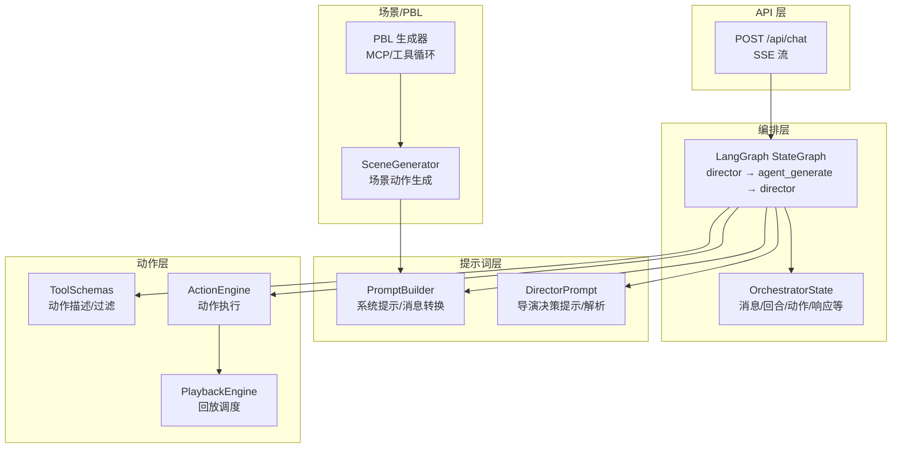
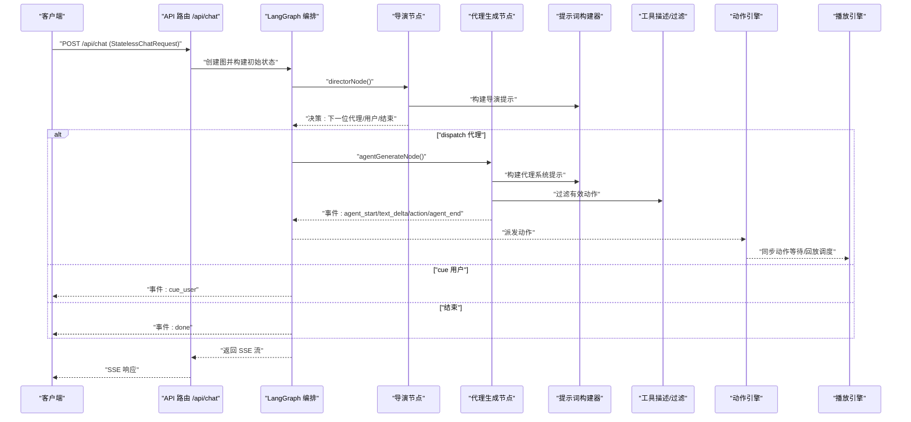
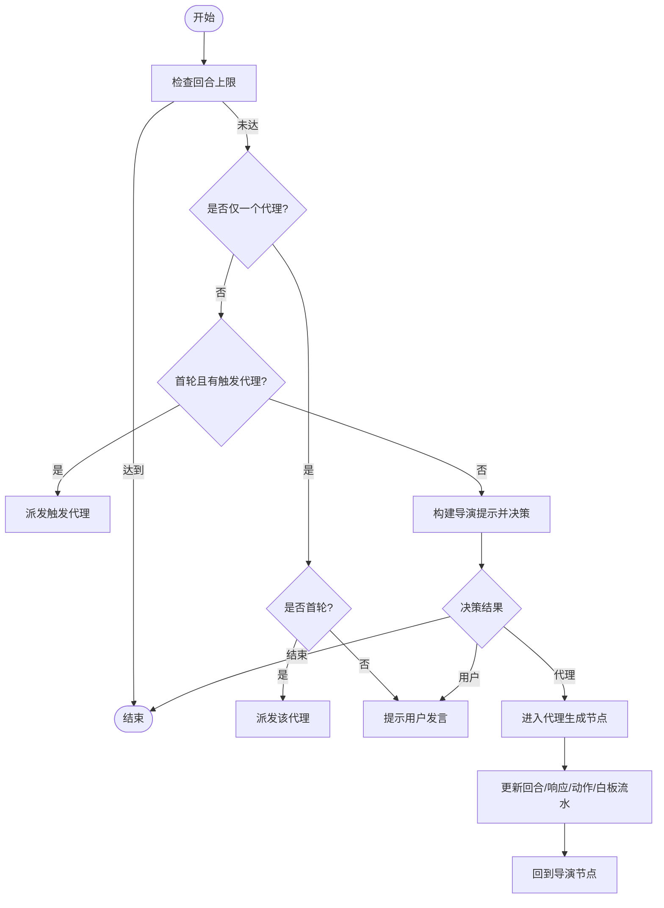
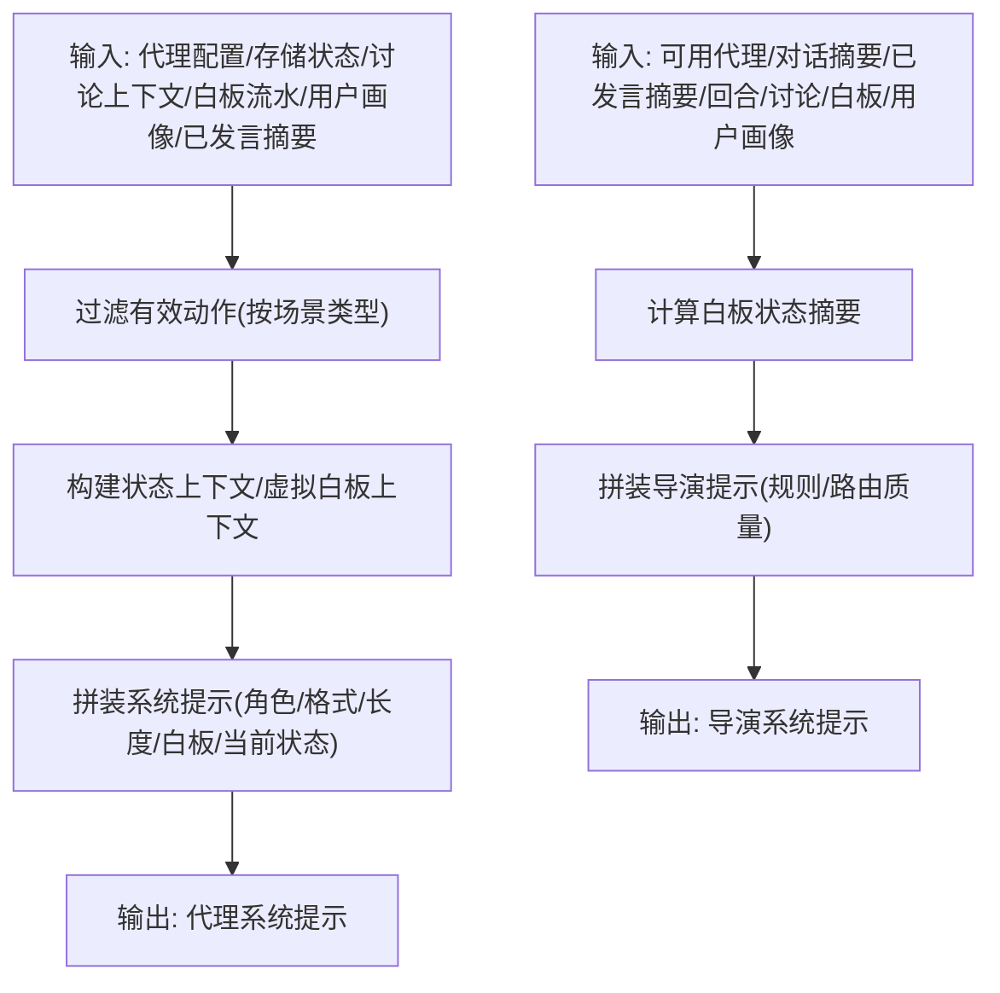
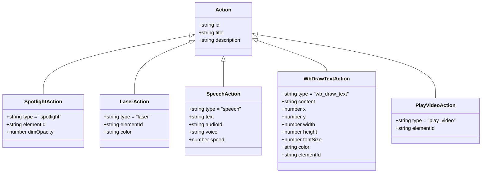
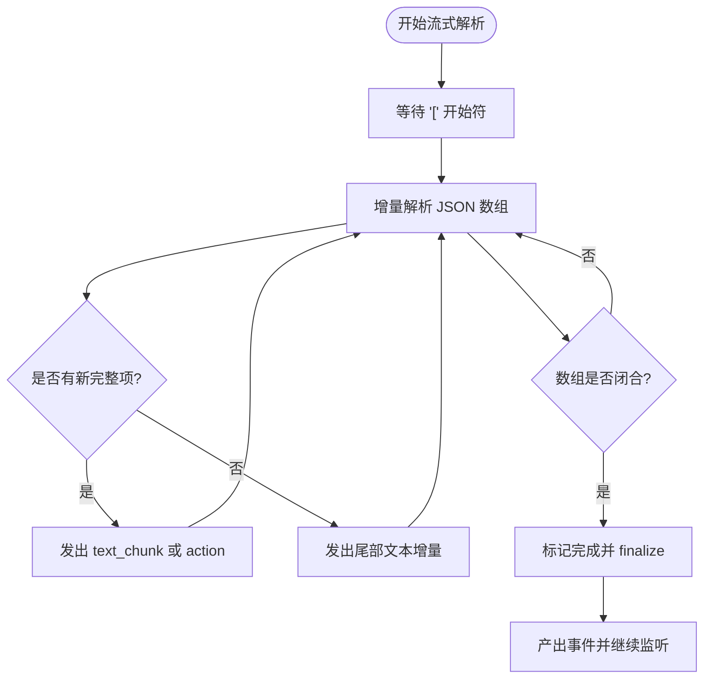
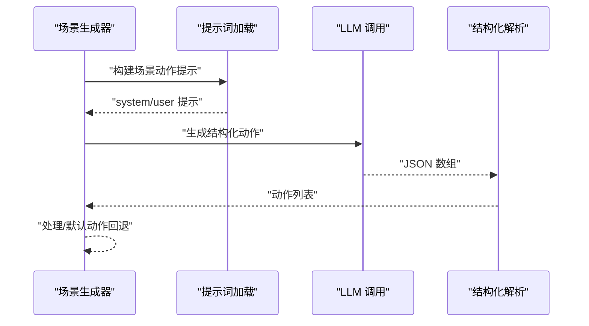
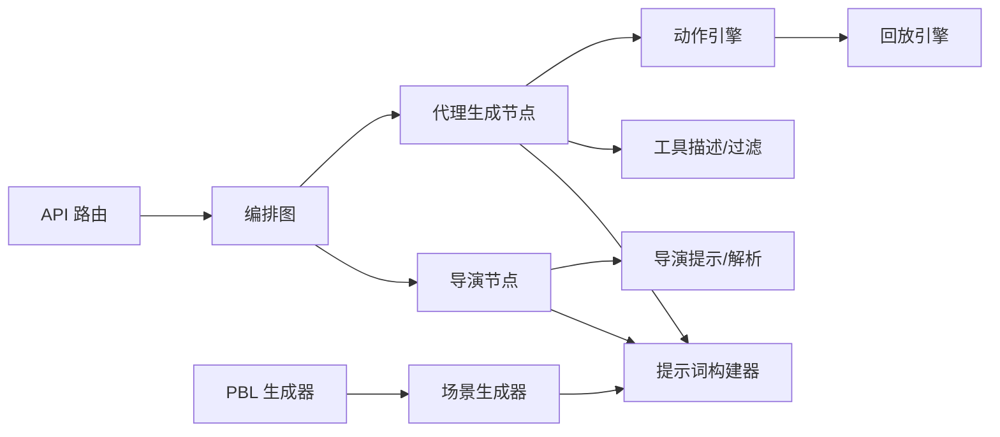

# 多智能体编排架构

<cite>
**本文引用的文件**
- [lib/orchestration/director-graph.ts](file://lib/orchestration/director-graph.ts)
- [lib/orchestration/stateless-generate.ts](file://lib/orchestration/stateless-generate.ts)
- [lib/orchestration/prompt-builder.ts](file://lib/orchestration/prompt-builder.ts)
- [lib/orchestration/director-prompt.ts](file://lib/orchestration/director-prompt.ts)
- [lib/orchestration/tool-schemas.ts](file://lib/orchestration/tool-schemas.ts)
- [lib/orchestration/registry/types.ts](file://lib/orchestration/registry/types.ts)
- [lib/types/action.ts](file://lib/types/action.ts)
- [app/api/chat/route.ts](file://app/api/chat/route.ts)
- [lib/generation/prompts/loader.ts](file://lib/generation/prompts/loader.ts)
- [lib/generation/prompts/index.ts](file://lib/generation/prompts/index.ts)
- [lib/generation/scene-generator.ts](file://lib/generation/scene-generator.ts)
- [lib/pbl/generate-pbl.ts](file://lib/pbl/generate-pbl.ts)
- [lib/pbl/mcp/mode-mcp.ts](file://lib/pbl/mcp/mode-mcp.ts)
- [lib/pbl/mcp/agent-mcp.ts](file://lib/pbl/mcp/agent-mcp.ts)
- [lib/action/engine.ts](file://lib/action/engine.ts)
- [lib/playback/engine.ts](file://lib/playback/engine.ts)
- [lib/ai/llm.ts](file://lib/ai/llm.ts)
</cite>

## 目录
1. [引言](#引言)
2. [项目结构](#项目结构)
3. [核心组件](#核心组件)
4. [架构总览](#架构总览)
5. [详细组件分析](#详细组件分析)
6. [依赖关系分析](#依赖关系分析)
7. [性能考量](#性能考量)
8. [故障排查指南](#故障排查指南)
9. [结论](#结论)
10. [附录](#附录)

## 引言
本技术文档系统性阐述基于 LangGraph 的多智能体编排架构，重点覆盖以下方面：
- LangGraph 状态机在智能体编排中的应用：状态定义、转换规则与事件处理机制
- 导演图（Director Graph）设计模式：如何通过状态机协调多个 AI 智能体的交互
- 提示词构建器（Prompt Builder）架构：如何动态生成面向不同智能体的角色化提示词模板
- 工具调用模式设计：工具定义、参数校验与执行结果处理
- 智能体角色分配、对话流程控制与上下文管理机制
- 扩展指南：新增智能体类型、修改对话规则、集成新工具的方法

## 项目结构
本项目围绕“无状态单次生成 + LangGraph 编排”的核心思想组织代码：
- 后端 API 层：接收请求并启动无状态生成流
- 编排层：LangGraph StateGraph 实现导演节点与代理生成节点的循环
- 提示词层：为导演与代理分别构建结构化提示词
- 动作层：统一的动作类型与执行引擎，支持即时生效与同步阻塞两类动作
- 场景与 PBL 支持：场景生成器与 PBL 生成器作为外部工具集成点

图表来源
- [app/api/chat/route.ts:44-191](file://app/api/chat/route.ts#L44-L191)
- [lib/orchestration/director-graph.ts:484-496](file://lib/orchestration/director-graph.ts#L484-L496)
- [lib/orchestration/prompt-builder.ts:93-253](file://lib/orchestration/prompt-builder.ts#L93-L253)
- [lib/orchestration/director-prompt.ts:52-138](file://lib/orchestration/director-prompt.ts#L52-L138)
- [lib/orchestration/tool-schemas.ts:16-68](file://lib/orchestration/tool-schemas.ts#L16-L68)
- [lib/action/engine.ts:86-125](file://lib/action/engine.ts#L86-L125)
- [lib/playback/engine.ts:482-524](file://lib/playback/engine.ts#L482-L524)
- [lib/generation/scene-generator.ts:1005-1030](file://lib/generation/scene-generator.ts#L1005-L1030)
- [lib/pbl/generate-pbl.ts:283-325](file://lib/pbl/generate-pbl.ts#L283-L325)

章节来源
- [app/api/chat/route.ts:28-43](file://app/api/chat/route.ts#L28-L43)
- [lib/orchestration/director-graph.ts:102-228](file://lib/orchestration/director-graph.ts#L102-L228)

## 核心组件
- LangGraph 状态机与编排图
  - 状态注解包含输入态（一次性设置）与可变态（节点更新）
  - 图拓扑：START → director →{end|next} → agent_generate → director（循环）
- 提示词构建器
  - 为代理构建结构化输出提示（角色、白板/幻灯片规则、格式示例、长度风格）
  - 为导演构建决策提示（可用代理、已发言者、白板状态、学生画像）
- 工具/动作系统
  - 统一动作类型与描述；按场景类型过滤动作；区分即时生效与同步阻塞动作
- 无状态生成与事件流
  - 单次生成、结构化数组输出、增量解析、事件分发（文本增量、动作、结束）

章节来源
- [lib/orchestration/director-graph.ts:49-76](file://lib/orchestration/director-graph.ts#L49-L76)
- [lib/orchestration/director-graph.ts:484-496](file://lib/orchestration/director-graph.ts#L484-L496)
- [lib/orchestration/prompt-builder.ts:93-253](file://lib/orchestration/prompt-builder.ts#L93-L253)
- [lib/orchestration/director-prompt.ts:52-138](file://lib/orchestration/director-prompt.ts#L52-L138)
- [lib/orchestration/tool-schemas.ts:16-68](file://lib/orchestration/tool-schemas.ts#L16-L68)
- [lib/orchestration/stateless-generate.ts:317-435](file://lib/orchestration/stateless-generate.ts#L317-L435)

## 架构总览
下图展示从 API 到编排、提示词、动作执行与回放的整体链路。

图表来源
- [app/api/chat/route.ts:121-130](file://app/api/chat/route.ts#L121-L130)
- [lib/orchestration/director-graph.ts:102-228](file://lib/orchestration/director-graph.ts#L102-L228)
- [lib/orchestration/director-graph.ts:240-434](file://lib/orchestration/director-graph.ts#L240-L434)
- [lib/orchestration/prompt-builder.ts:93-253](file://lib/orchestration/prompt-builder.ts#L93-L253)
- [lib/orchestration/tool-schemas.ts:16-68](file://lib/orchestration/tool-schemas.ts#L16-L68)
- [lib/action/engine.ts:86-125](file://lib/action/engine.ts#L86-L125)
- [lib/playback/engine.ts:482-524](file://lib/playback/engine.ts#L482-L524)

## 详细组件分析

### LangGraph 状态机与导演图
- 状态注解
  - 输入态：消息、可用代理、最大回合、语言模型、思考配置、讨论上下文、触发代理、用户画像、请求级代理配置覆盖
  - 可变态：当前代理、回合计数、代理响应汇总、白板流水、结束标志、动作总数
- 节点职责
  - 导演节点：根据回合限制、单/多代理策略、白板状态、已发言者、讨论上下文与用户画像，决定下一代理或用户
  - 代理生成节点：为当前代理构建系统提示，流式解析结构化输出，派发文本增量与动作事件
- 条件边
  - 导演 → 代理：当未结束
  - 导演 → 结束：当结束或无代理可选
  - 代理 → 导演：每次代理回合结束后回环

图表来源
- [lib/orchestration/director-graph.ts:116-228](file://lib/orchestration/director-graph.ts#L116-L228)
- [lib/orchestration/director-graph.ts:439-472](file://lib/orchestration/director-graph.ts#L439-L472)

章节来源
- [lib/orchestration/director-graph.ts:49-76](file://lib/orchestration/director-graph.ts#L49-L76)
- [lib/orchestration/director-graph.ts:102-228](file://lib/orchestration/director-graph.ts#L102-L228)
- [lib/orchestration/director-graph.ts:439-472](file://lib/orchestration/director-graph.ts#L439-L472)

### 提示词构建器（Prompt Builder）
- 代理系统提示
  - 角色指南：教师、助教、学生的行为边界与风格约束
  - 白板/幻灯片上下文：当前场景类型决定可用动作集合
  - 输出格式：严格 JSON 数组，元素类型为 text 或 action，支持顺序原则与互斥规则
  - 语言约束：依据课程语言强制输出
  - 学生画像：个性化教学提示
  - 同轮同伴上下文：避免重复与问候，鼓励多样性与推进性
- 导演决策提示
  - 可用代理列表与优先级
  - 已发言者摘要与白板贡献统计
  - 讨论模式与触发代理
  - 白板拥挤度与开放状态对动作效果的影响
  - 决策规则：角色多样性、内容去重、讨论推进、问候规则等
- 消息转换
  - 将 UI 消息转换为 OpenAI 格式，保留工具调用结果作为示例，跨代理时进行角色归因

图表来源
- [lib/orchestration/prompt-builder.ts:93-253](file://lib/orchestration/prompt-builder.ts#L93-L253)
- [lib/orchestration/director-prompt.ts:52-138](file://lib/orchestration/director-prompt.ts#L52-L138)
- [lib/orchestration/prompt-builder.ts:743-800](file://lib/orchestration/prompt-builder.ts#L743-L800)

章节来源
- [lib/orchestration/prompt-builder.ts:14-39](file://lib/orchestration/prompt-builder.ts#L14-L39)
- [lib/orchestration/prompt-builder.ts:93-253](file://lib/orchestration/prompt-builder.ts#L93-L253)
- [lib/orchestration/director-prompt.ts:52-138](file://lib/orchestration/director-prompt.ts#L52-L138)
- [lib/orchestration/prompt-builder.ts:743-800](file://lib/orchestration/prompt-builder.ts#L743-L800)

### 工具/动作系统与执行
- 动作类型与分类
  - 即时生效：spotlight、laser
  - 同步阻塞：speech、play_video、wb_open/wb_draw_*、wb_clear/delete/close、discussion
  - 幻灯片专属：spotlight、laser、play_video
- 动作描述与过滤
  - 通过工具描述模块生成动作清单；按场景类型过滤幻灯片专属动作
- 执行与回放
  - 动作引擎根据动作类型执行；同步动作等待完成后再继续
  - 回放引擎在播放模式下按动作序列驱动 UI 效果

图表来源
- [lib/types/action.ts:22-180](file://lib/types/action.ts#L22-L180)

章节来源
- [lib/orchestration/tool-schemas.ts:16-68](file://lib/orchestration/tool-schemas.ts#L16-L68)
- [lib/types/action.ts:184-205](file://lib/types/action.ts#L184-L205)
- [lib/action/engine.ts:86-125](file://lib/action/engine.ts#L86-L125)
- [lib/playback/engine.ts:482-524](file://lib/playback/engine.ts#L482-L524)

### 无状态生成与事件流
- 解析器状态
  - 增量缓冲、JSON 开始标记、已解析项计数、尾部文本长度、完成标记
- 结构化数组解析
  - 使用 jsonrepair + partial-json 容错解析；按原始交错顺序发出 text_chunks 与 actions
- 事件分发
  - agent_start、text_delta、action、agent_end、done、error
  - 客户端每轮仅消费一个代理回合，随后基于返回的 directorState 继续下一轮

图表来源
- [lib/orchestration/stateless-generate.ts:136-255](file://lib/orchestration/stateless-generate.ts#L136-L255)
- [lib/orchestration/stateless-generate.ts:265-306](file://lib/orchestration/stateless-generate.ts#L265-L306)

章节来源
- [lib/orchestration/stateless-generate.ts:317-435](file://lib/orchestration/stateless-generate.ts#L317-L435)

### 场景生成与 PBL 集成
- 场景动作生成
  - 基于场景类型与代理集合，构建提示词并调用 LLM，解析结构化动作
- PBL 生成器
  - 使用 MCP（ModeMCP、ProjectMCP、AgentMCP、IssueboardMCP）与工具循环，驱动多步骤生成
  - 通过 stopWhen 控制步数，逐步推进到空闲模式

图表来源
- [lib/generation/scene-generator.ts:1005-1030](file://lib/generation/scene-generator.ts#L1005-L1030)
- [lib/generation/prompts/loader.ts:101-124](file://lib/generation/prompts/loader.ts#L101-L124)
- [lib/generation/prompts/index.ts:23-33](file://lib/generation/prompts/index.ts#L23-L33)

章节来源
- [lib/pbl/generate-pbl.ts:283-325](file://lib/pbl/generate-pbl.ts#L283-L325)
- [lib/pbl/mcp/mode-mcp.ts:18-30](file://lib/pbl/mcp/mode-mcp.ts#L18-L30)
- [lib/pbl/mcp/agent-mcp.ts:17-50](file://lib/pbl/mcp/agent-mcp.ts#L17-L50)

## 依赖关系分析
- 组件耦合
  - 编排层依赖提示词层与工具描述层；动作层独立但被编排层调度
  - API 层仅负责创建语言模型与转发请求信号，不参与业务逻辑
- 关键依赖链
  - API → 编排图 → 导演/代理 → 提示词/工具描述 → 动作引擎 → 回放引擎
  - 场景生成器与 PBL 生成器作为外部工具集成点，复用统一的动作类型与提示词系统

图表来源
- [app/api/chat/route.ts:121-130](file://app/api/chat/route.ts#L121-L130)
- [lib/orchestration/director-graph.ts:102-228](file://lib/orchestration/director-graph.ts#L102-L228)
- [lib/orchestration/director-graph.ts:240-434](file://lib/orchestration/director-graph.ts#L240-L434)
- [lib/orchestration/prompt-builder.ts:93-253](file://lib/orchestration/prompt-builder.ts#L93-L253)
- [lib/orchestration/tool-schemas.ts:16-68](file://lib/orchestration/tool-schemas.ts#L16-L68)
- [lib/action/engine.ts:86-125](file://lib/action/engine.ts#L86-L125)
- [lib/playback/engine.ts:482-524](file://lib/playback/engine.ts#L482-L524)
- [lib/generation/scene-generator.ts:1005-1030](file://lib/generation/scene-generator.ts#L1005-L1030)
- [lib/pbl/generate-pbl.ts:283-325](file://lib/pbl/generate-pbl.ts#L283-L325)

章节来源
- [lib/orchestration/registry/types.ts:6-24](file://lib/orchestration/registry/types.ts#L6-L24)
- [lib/types/action.ts:184-205](file://lib/types/action.ts#L184-L205)

## 性能考量
- 流式增量解析：使用部分 JSON 解析与修复，降低首包延迟与容错
- 单次生成：避免多次往返，减少总体时延
- 动作阻塞：同步动作等待完成，确保 UI 一致性，但会增加单轮时长
- 回合限制：通过 maxTurns 控制对话长度，防止无限循环
- 重试与校验：LLM 调用支持重试与自定义校验，提升稳定性

## 故障排查指南
- 请求中断
  - 客户端中止会传播到服务端信号，编排图捕获并抛出中断错误，API 返回中断事件
- 解析失败
  - 结构化数组解析失败时，最终归并阶段会尝试提取纯文本作为兜底
- 导演决策异常
  - 导演提示解析失败时，默认结束本轮，避免卡死
- 动作无效
  - 代理生成时会对动作进行有效性过滤；若尝试非法动作会被忽略并记录警告

章节来源
- [lib/orchestration/stateless-generate.ts:421-433](file://lib/orchestration/stateless-generate.ts#L421-L433)
- [lib/orchestration/stateless-generate.ts:265-306](file://lib/orchestration/stateless-generate.ts#L265-L306)
- [lib/orchestration/director-prompt.ts:254-277](file://lib/orchestration/director-prompt.ts#L254-L277)
- [lib/orchestration/director-graph.ts:354-359](file://lib/orchestration/director-graph.ts#L354-L359)

## 结论
本架构以 LangGraph 为核心，结合结构化提示词与统一动作系统，实现了高内聚、低耦合的多智能体编排。其关键优势在于：
- 无状态单次生成与增量事件流，兼顾实时性与可中断性
- 导演节点的规则化决策与白板/场景感知，保障课堂节奏与视觉一致性
- 明确的动作过滤与执行模型，使代理行为可控且可回放

## 附录

### 扩展指南
- 新增智能体类型
  - 在注册表中定义 AgentConfig，设置角色、优先级与允许动作集合
  - 若为 LLM 生成的代理，需在请求中通过 agentConfigs 字段传入覆盖
- 修改对话规则
  - 调整导演提示构建逻辑与解析规则，或在提示词中加入新的路由质量约束
- 集成新工具/动作
  - 在动作类型定义中新增类型，并在工具描述模块补充描述
  - 在动作执行引擎中添加对应分支；如为同步动作，确保在回放引擎中正确等待
- 场景与 PBL 扩展
  - 场景生成器可复用统一提示词与动作系统；PBL 生成器可通过 MCP 与工具循环扩展工作流

章节来源
- [lib/orchestration/registry/types.ts:6-24](file://lib/orchestration/registry/types.ts#L6-L24)
- [lib/orchestration/director-graph.ts:502-549](file://lib/orchestration/director-graph.ts#L502-L549)
- [lib/types/action.ts:165-180](file://lib/types/action.ts#L165-L180)
- [lib/orchestration/tool-schemas.ts:29-68](file://lib/orchestration/tool-schemas.ts#L29-L68)
- [lib/action/engine.ts:86-125](file://lib/action/engine.ts#L86-L125)
- [lib/playback/engine.ts:482-524](file://lib/playback/engine.ts#L482-L524)
- [lib/generation/scene-generator.ts:1005-1030](file://lib/generation/scene-generator.ts#L1005-L1030)
- [lib/pbl/generate-pbl.ts:283-325](file://lib/pbl/generate-pbl.ts#L283-L325)