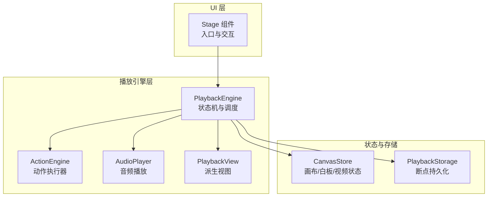
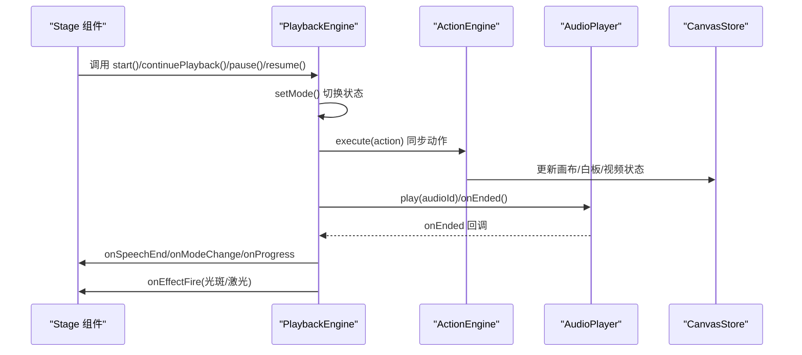
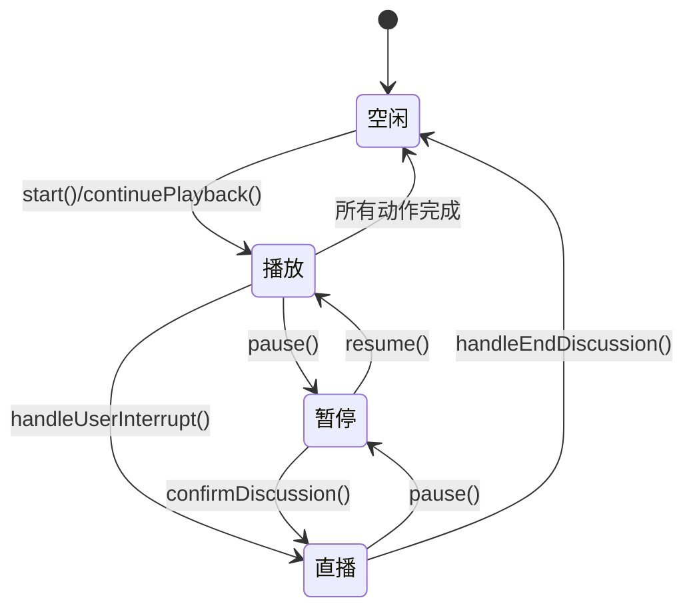
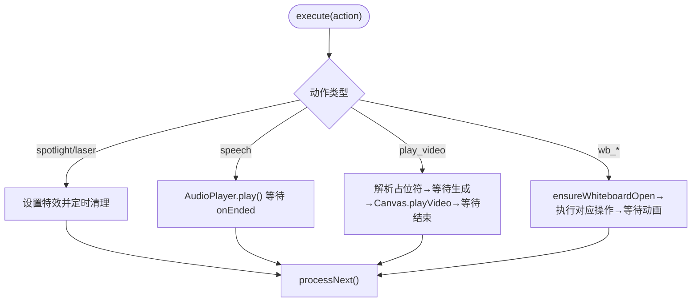
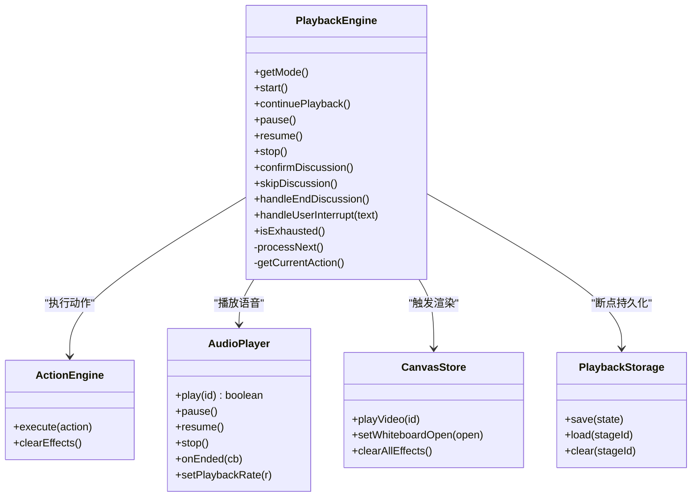

# 播放引擎架构

<cite>
**本文引用的文件**
- [lib/playback/engine.ts](file://lib/playback/engine.ts)
- [lib/playback/types.ts](file://lib/playback/types.ts)
- [lib/playback/derived-state.ts](file://lib/playback/derived-state.ts)
- [lib/action/engine.ts](file://lib/action/engine.ts)
- [lib/utils/audio-player.ts](file://lib/utils/audio-player.ts)
- [lib/store/canvas.ts](file://lib/store/canvas.ts)
- [lib/utils/playback-storage.ts](file://lib/utils/playback-storage.ts)
- [components/stage.tsx](file://components/stage.tsx)
- [lib/store/keyboard.ts](file://lib/store/keyboard.ts)
- [configs/hotkey.ts](file://configs/hotkey.ts)
- [lib/buffer/stream-buffer.ts](file://lib/buffer/stream-buffer.ts)
- [lib/playback/index.ts](file://lib/playback/index.ts)
</cite>

## 目录
1. [简介](#简介)
2. [项目结构](#项目结构)
3. [核心组件](#核心组件)
4. [架构总览](#架构总览)
5. [详细组件分析](#详细组件分析)
6. [依赖关系分析](#依赖关系分析)
7. [性能考虑](#性能考虑)
8. [故障排查指南](#故障排查指南)
9. [结论](#结论)
10. [附录](#附录)

## 简介
本技术文档系统性阐述基于状态机驱动的课堂播放引擎架构，覆盖以下关键主题：
- 状态机驱动的播放控制：从空闲到播放、暂停、直播（讨论）的完整状态流转。
- 事件驱动架构：事件监听、状态更新与渲染触发的闭环流程。
- 动作执行调度：时间轴管理、同步/异步动作的并发控制与优先级处理。
- 进度精确控制与恢复：断点续播、快进/快退、暂停恢复与场景切换保护。
- 用户交互响应：键盘、鼠标与触摸手势的处理路径。
- 性能优化策略：内存管理、渲染优化与资源缓存。

## 项目结构
播放引擎相关代码主要位于 lib/playback 与 lib/action 子目录，并通过 lib/store 与 lib/utils 提供状态与工具能力；UI 层在 components/stage.tsx 中协调引擎与渲染。

**图表来源**
- [lib/playback/engine.ts:1-525](file://lib/playback/engine.ts#L1-L525)
- [lib/action/engine.ts:1-519](file://lib/action/engine.ts#L1-L519)
- [lib/utils/audio-player.ts:1-188](file://lib/utils/audio-player.ts#L1-L188)
- [lib/store/canvas.ts:1-473](file://lib/store/canvas.ts#L1-L473)
- [lib/utils/playback-storage.ts:1-59](file://lib/utils/playback-storage.ts#L1-L59)
- [lib/playback/derived-state.ts:1-214](file://lib/playback/derived-state.ts#L1-L214)
- [components/stage.tsx:500-700](file://components/stage.tsx#L500-L700)

**章节来源**
- [lib/playback/index.ts:1-4](file://lib/playback/index.ts#L1-L4)
- [components/stage.tsx:500-700](file://components/stage.tsx#L500-L700)

## 核心组件
- 状态机引擎 PlaybackEngine：统一管理播放模式、动作游标、讨论状态与定时器，负责推进时间轴并触发回调。
- 动作执行器 ActionEngine：集中处理所有动作类型，区分“即时生效”与“需等待完成”的两类动作。
- 音频播放器 AudioPlayer：封装 IndexedDB 预生成音频的加载与播放，支持暂停/恢复/速率调整。
- 画布状态 CanvasStore：维护视频播放、白板开关与教学特效等 UI 状态，驱动渲染。
- 断点存储 PlaybackStorage：以 IndexedDB 存储最小化快照，实现断点续播。
- 派生视图 computePlaybackView：将原始状态聚合为 UI 可消费的高阶视图，用于气泡按钮、角色与阶段判定。

**章节来源**
- [lib/playback/engine.ts:43-84](file://lib/playback/engine.ts#L43-L84)
- [lib/action/engine.ts:55-65](file://lib/action/engine.ts#L55-L65)
- [lib/utils/audio-player.ts:17-70](file://lib/utils/audio-player.ts#L17-L70)
- [lib/store/canvas.ts:51-183](file://lib/store/canvas.ts#L51-L183)
- [lib/utils/playback-storage.ts:10-58](file://lib/utils/playback-storage.ts#L10-L58)
- [lib/playback/derived-state.ts:77-213](file://lib/playback/derived-state.ts#L77-L213)

## 架构总览
播放引擎采用“状态机 + 回调 + 动作执行器”的事件驱动架构：
- PlaybackEngine 作为主控制器，按顺序消费 Scene.actions[]，根据动作类型分派给 ActionEngine 或 AudioPlayer。
- 引擎通过回调通知 UI 更新（如 onSpeechStart/onSpeechEnd/onModeChange/onProgress），并由 CanvasStore 驱动渲染。
- 断点通过 PlaybackStorage 持久化，支持恢复播放位置。

**图表来源**
- [lib/playback/engine.ts:369-523](file://lib/playback/engine.ts#L369-L523)
- [lib/action/engine.ts:80-125](file://lib/action/engine.ts#L80-L125)
- [lib/utils/audio-player.ts:29-70](file://lib/utils/audio-player.ts#L29-L70)
- [lib/store/canvas.ts:335-337](file://lib/store/canvas.ts#L335-L337)

## 详细组件分析

### 状态机引擎 PlaybackEngine
- 状态模型：idle → playing → paused → live，支持讨论确认、跳过与中断。
- 关键职责：
  - 游标推进：getCurrentAction() 自动跨场景推进，processNext() 消费下一个动作。
  - 计时与阅读估算：无预生成音频时按语种估算阅读时长，暂停时保存剩余时间，恢复时重调度。
  - 讨论触发：延迟显示 ProactiveCard，用户确认后进入 live 并保存讲座游标。
  - 中断处理：用户消息打断播放，保存当前位置，设置模式为 live。
  - 完成检测：遍历剩余动作，排除已消费讨论，判断是否 Exhausted。
  - 回调通知：进度、场景切换、语音开始/结束、特效触发、讨论生命周期等。

**图表来源**
- [lib/playback/engine.ts:111-336](file://lib/playback/engine.ts#L111-L336)

**章节来源**
- [lib/playback/engine.ts:111-336](file://lib/playback/engine.ts#L111-L336)
- [lib/playback/engine.ts:369-523](file://lib/playback/engine.ts#L369-L523)

### 动作执行器 ActionEngine
- 动作分类：
  - 即时生效：spotlight/laser，设置画布特效并自动清理。
  - 需等待：speech、play_video、wb_* 白板系列，等待完成信号再继续。
- 关键流程：
  - play_video：解析媒体占位符、等待生成完成、触发 CanvasStore.playVideo 并等待结束。
  - 白板：确保白板打开，绘制/删除/清空等，等待动画完成。
  - speech：委托 AudioPlayer 播放，等待 onEnded。

**图表来源**
- [lib/action/engine.ts:80-125](file://lib/action/engine.ts#L80-L125)
- [lib/action/engine.ts:180-228](file://lib/action/engine.ts#L180-L228)
- [lib/action/engine.ts:266-278](file://lib/action/engine.ts#L266-L278)

**章节来源**
- [lib/action/engine.ts:80-125](file://lib/action/engine.ts#L80-L125)
- [lib/action/engine.ts:180-228](file://lib/action/engine.ts#L180-L228)
- [lib/action/engine.ts:266-278](file://lib/action/engine.ts#L266-L278)

### 音频播放器 AudioPlayer
- 能力范围：IndexedDB 预生成音频加载、播放/暂停/停止、速率/音量/静音控制、ended 回调。
- 与引擎协作：引擎在 speech 动作中调用 play()，若返回 false 则回退到阅读计时器；ended 回调触发 processNext()。

**章节来源**
- [lib/utils/audio-player.ts:29-70](file://lib/utils/audio-player.ts#L29-L70)
- [lib/playback/engine.ts:436-444](file://lib/playback/engine.ts#L436-L444)

### 画布状态 CanvasStore
- 维护视频播放元素 ID、白板开关与清空动画、教学特效（光斑/激光/高亮/缩放）等。
- 与 ActionEngine 的 play_video 协作：ActionEngine 调用 playVideo(elementId)，引擎在 onEnded 时继续。

**章节来源**
- [lib/store/canvas.ts:99-104](file://lib/store/canvas.ts#L99-L104)
- [lib/store/canvas.ts:335-337](file://lib/store/canvas.ts#L335-L337)
- [lib/action/engine.ts:216-227](file://lib/action/engine.ts#L216-L227)

### 断点与进度恢复
- 快照结构：包含场景索引、动作索引、已消费讨论集合与场景 ID。
- 持久化：save/load/clearPlaybackState 基于 IndexedDB。
- 恢复：restoreFromSnapshot 设置游标，继续播放。

**章节来源**
- [lib/utils/playback-storage.ts:10-58](file://lib/utils/playback-storage.ts#L10-L58)
- [lib/playback/engine.ts:94-108](file://lib/playback/engine.ts#L94-L108)

### 派生视图 computePlaybackView
- 将引擎模式、语音状态、讨论触发、QA 流程等原始状态聚合为高阶视图，用于 UI 决策（阶段、气泡角色、按钮状态、是否阻止切场景等）。

**章节来源**
- [lib/playback/derived-state.ts:77-213](file://lib/playback/derived-state.ts#L77-L213)

### UI 交互与场景切换保护
- Stage 组件：
  - 播放/暂停切换：根据引擎模式调用 pause()/resume()/start()/continuePlayback()，并联动聊天缓冲区。
  - 场景切换门控：当讨论或 QA 正在进行时弹出对话框确认，避免打断会话。
  - 将引擎模式映射为 CanvasArea 的期望状态，保证渲染一致性。

**章节来源**
- [components/stage.tsx:562-597](file://components/stage.tsx#L562-L597)
- [components/stage.tsx:535-555](file://components/stage.tsx#L535-L555)
- [components/stage.tsx:642-653](file://components/stage.tsx#L642-L653)

### 事件驱动与回调链路
- PlaybackEngine 在关键节点触发回调：onModeChange/onSceneChange/onSpeechStart/onSpeechEnd/onEffectFire/onProgress/onComplete 等。
- ActionEngine 在特效动作完成后清理，避免状态泄漏。
- StreamBuffer 提供播放过程中的文本增量推送与暂停/恢复。

**章节来源**
- [lib/playback/engine.ts:375-386](file://lib/playback/engine.ts#L375-L386)
- [lib/action/engine.ts:128-145](file://lib/action/engine.ts#L128-L145)
- [lib/buffer/stream-buffer.ts:246-283](file://lib/buffer/stream-buffer.ts#L246-L283)

## 依赖关系分析

**图表来源**
- [lib/playback/engine.ts:43-84](file://lib/playback/engine.ts#L43-L84)
- [lib/action/engine.ts:55-65](file://lib/action/engine.ts#L55-L65)
- [lib/utils/audio-player.ts:17-70](file://lib/utils/audio-player.ts#L17-L70)
- [lib/store/canvas.ts:51-183](file://lib/store/canvas.ts#L51-L183)
- [lib/utils/playback-storage.ts:17-58](file://lib/utils/playback-storage.ts#L17-L58)

**章节来源**
- [lib/playback/engine.ts:43-84](file://lib/playback/engine.ts#L43-L84)
- [lib/action/engine.ts:55-65](file://lib/action/engine.ts#L55-L65)
- [lib/utils/audio-player.ts:17-70](file://lib/utils/audio-player.ts#L17-L70)
- [lib/store/canvas.ts:51-183](file://lib/store/canvas.ts#L51-L183)
- [lib/utils/playback-storage.ts:17-58](file://lib/utils/playback-storage.ts#L17-L58)

## 性能考虑
- 时间轴与计时
  - 无预生成音频时使用阅读时长估算，暂停时保存剩余时间，恢复时重调度，避免重复播放。
  - 语音结束回调中仅在播放态推进，防止模式切换导致的竞态。
- 渲染与状态
  - CanvasStore 将教学特效与视频播放状态隔离，避免特效清理误杀视频生命周期。
  - ActionEngine 对白板操作等待动画完成，减少闪烁与无效重绘。
- 资源与缓存
  - 音频从 IndexedDB 加载，避免网络抖动影响播放连续性。
  - 断点使用 IndexedDB 存储，避免频繁写入本地存储。
- 并发与优先级
  - 即时特效（spotlight/laser）先设置后清理，不阻塞后续动作。
  - 同步动作（speech/video/wb_*）等待完成后再继续，确保时序正确。

[本节为通用性能建议，无需特定文件引用]

## 故障排查指南
- 播放未开始或提前结束
  - 检查引擎模式是否为 idle 再调用 start()/continuePlayback()。
  - 确认 onProgress 是否被正确订阅，以便断点恢复。
- 语音无法播放
  - 若 play 返回 false，检查预生成音频是否存在；确认 AudioPlayer.setPlaybackRate/音量设置。
- 视频不播放
  - 确认占位符解析成功且媒体任务已完成；检查 CanvasStore.playVideo 是否被调用。
- 特效未清除
  - ActionEngine 在执行 spot/light 后会定时清理，若未清除，检查是否被其他逻辑覆盖。
- 场景切换异常
  - 当讨论或 QA 正在进行时，Stage 会弹窗确认；确保 onDiscussionEnd/handleEndDiscussion 正确调用。

**章节来源**
- [lib/playback/engine.ts:111-131](file://lib/playback/engine.ts#L111-L131)
- [lib/utils/audio-player.ts:29-70](file://lib/utils/audio-player.ts#L29-L70)
- [lib/action/engine.ts:180-228](file://lib/action/engine.ts#L180-L228)
- [lib/action/engine.ts:128-145](file://lib/action/engine.ts#L128-L145)
- [components/stage.tsx:535-555](file://components/stage.tsx#L535-L555)

## 结论
该播放引擎以状态机为核心，结合事件驱动与动作执行器，实现了课堂播放与直播讨论的统一编排。通过断点存储、阅读时长估算与渲染状态隔离，系统在功能完整性与用户体验之间取得平衡。建议在后续迭代中进一步细化动作优先级队列与更细粒度的渲染批处理，以提升复杂场景下的稳定性与性能。

[本节为总结性内容，无需特定文件引用]

## 附录

### 类型与回调定义
- EngineMode/TopicState/TriggerEvent/Effect 与 PlaybackEngineCallbacks 定义了引擎的对外契约与事件接口。

**章节来源**
- [lib/playback/types.ts:14-62](file://lib/playback/types.ts#L14-L62)

### 键盘与热键配置
- 键盘状态存储与热键枚举为交互扩展提供基础。

**章节来源**
- [lib/store/keyboard.ts:1-33](file://lib/store/keyboard.ts#L1-L33)
- [configs/hotkey.ts:1-40](file://configs/hotkey.ts#L1-L40)