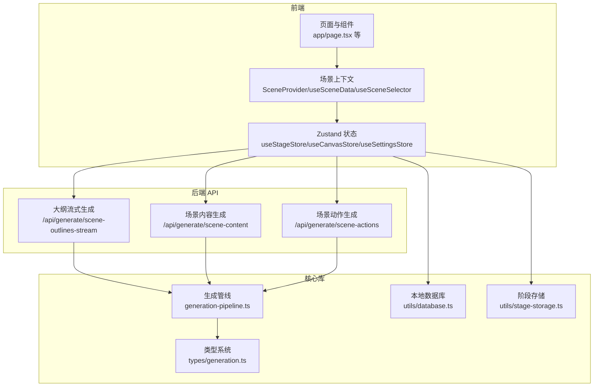
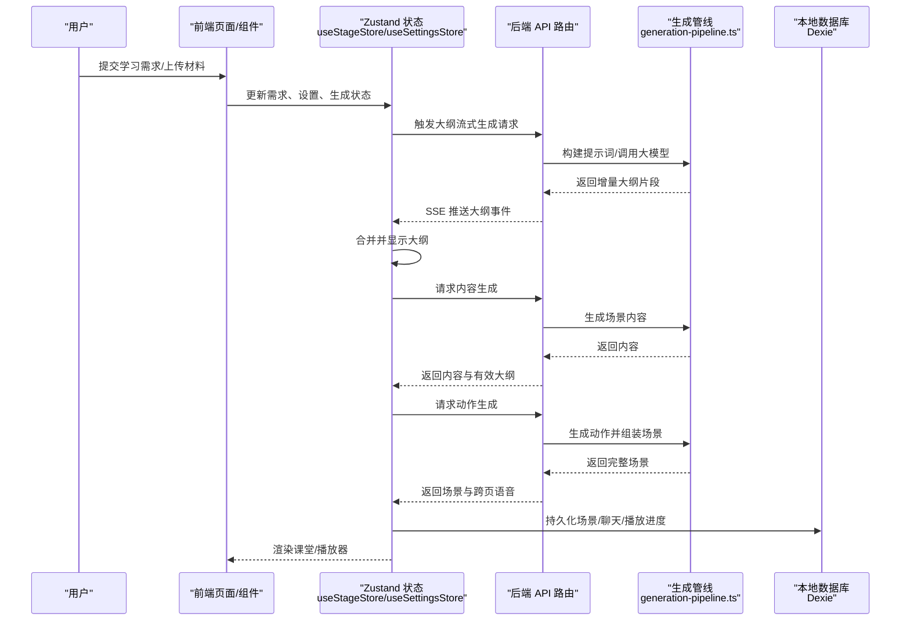
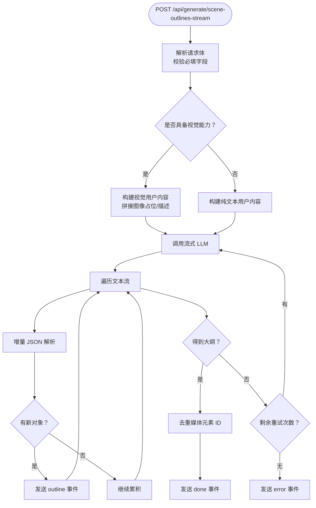
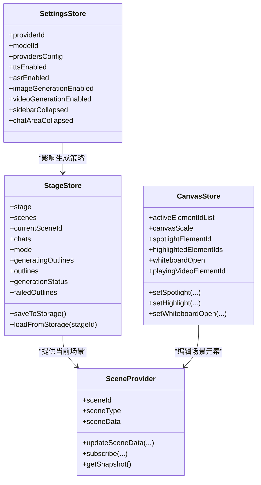
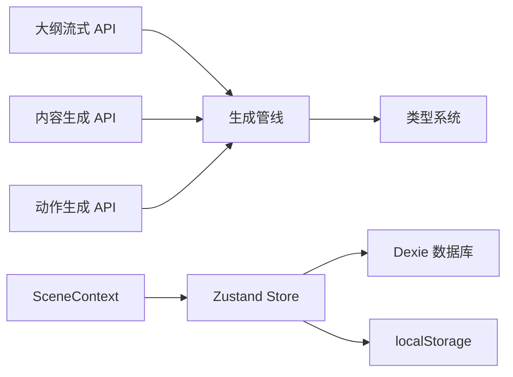

# 数据流架构

<cite>
**本文引用的文件**
- [README.md](file://README.md)
- [app/api/generate/scene-outlines-stream/route.ts](file://app/api/generate/scene-outlines-stream/route.ts)
- [app/api/generate/scene-content/route.ts](file://app/api/generate/scene-content/route.ts)
- [app/api/generate/scene-actions/route.ts](file://app/api/generate/scene-actions/route.ts)
- [lib/types/generation.ts](file://lib/types/generation.ts)
- [lib/generation/generation-pipeline.ts](file://lib/generation/generation-pipeline.ts)
- [lib/generation/pipeline-types.ts](file://lib/generation/pipeline-types.ts)
- [lib/store/index.ts](file://lib/store/index.ts)
- [lib/store/canvas.ts](file://lib/store/canvas.ts)
- [lib/store/stage.ts](file://lib/store/stage.ts)
- [lib/store/settings.ts](file://lib/store/settings.ts)
- [lib/contexts/scene-context.tsx](file://lib/contexts/scene-context.tsx)
- [lib/utils/database.ts](file://lib/utils/database.ts)
- [lib/utils/stage-storage.ts](file://lib/utils/stage-storage.ts)
- [lib/storage/index.ts](file://lib/storage/index.ts)
- [lib/logger.ts](file://lib/logger.ts)
</cite>

## 目录
1. [简介](#简介)
2. [项目结构](#项目结构)
3. [核心组件](#核心组件)
4. [架构总览](#架构总览)
5. [详细组件分析](#详细组件分析)
6. [依赖关系分析](#依赖关系分析)
7. [性能考量](#性能考量)
8. [故障排查指南](#故障排查指南)
9. [结论](#结论)
10. [附录](#附录)

## 简介
本文件系统性梳理 OpenMAIC 的数据流架构，覆盖从用户输入到最终课堂输出的完整数据路径；阐述类型系统与强类型约束、状态管理模式（全局、局部、临时）、数据转换与映射机制（需求→大纲→内容→动作）、持久化策略（IndexedDB、缓存与会话管理）、错误处理与恢复机制，并提供监控与调试建议。

## 项目结构
OpenMAIC 基于 Next.js App Router 构建，采用“前端组件 + 后端 API 路由 + 核心业务库”的分层组织方式：
- app/api：后端路由，实现两阶段生成管线（大纲流式生成、内容生成、动作生成）
- lib：核心业务逻辑与状态管理（generation、store、contexts、storage、utils）
- components：UI 组件与渲染器
- configs：共享常量与主题配置
- packages：自定义导出包（如 PPTX、MathML 转换）

图表来源
- [README.md:372-426](file://README.md#L372-L426)
- [app/api/generate/scene-outlines-stream/route.ts:1-362](file://app/api/generate/scene-outlines-stream/route.ts#L1-L362)
- [app/api/generate/scene-content/route.ts:1-168](file://app/api/generate/scene-content/route.ts#L1-L168)
- [app/api/generate/scene-actions/route.ts:1-159](file://app/api/generate/scene-actions/route.ts#L1-L159)
- [lib/generation/generation-pipeline.ts:1-51](file://lib/generation/generation-pipeline.ts#L1-L51)
- [lib/types/generation.ts:1-229](file://lib/types/generation.ts#L1-L229)
- [lib/utils/database.ts:1-446](file://lib/utils/database.ts#L1-L446)
- [lib/utils/stage-storage.ts:1-228](file://lib/utils/stage-storage.ts#L1-L228)

章节来源
- [README.md:372-426](file://README.md#L372-L426)

## 核心组件
- 类型系统与强类型约束
  - 用户需求、PDF 图像、场景大纲、生成内容等核心数据模型在 types/generation.ts 中集中定义，确保前后端一致的契约与可验证性。
  - 生成管线类型（AgentInfo、跨页上下文、AI 调用函数签名）在 pipeline-types.ts 中定义，保障生成流程参数与返回值的类型安全。
- 状态管理
  - 全局状态：useStageStore（课程、场景、聊天、生成状态）、useSettingsStore（模型、媒体、TTS/ASR、布局偏好）。
  - 局部状态：useCanvasStore（画布视图、元素选择、教学特效、白板等）。
  - 临时状态：生成过程中的 generatingOutlines、failedOutlines、generationEpoch 等，仅用于 UI 流程控制，不持久化。
- 场景上下文
  - SceneProvider 提供当前场景数据的读写与订阅，结合 Immer 实现不可变更新，避免不必要的重渲染。
- 本地存储与会话
  - IndexedDB（Dexie）作为持久化层，支持课程、场景、聊天、播放进度、生成代理、媒体文件等多表存储。
  - 阶段级数据通过 stage-storage 进行批量保存/加载，支持缩略图预览与跨刷新恢复。

章节来源
- [lib/types/generation.ts:1-229](file://lib/types/generation.ts#L1-L229)
- [lib/generation/pipeline-types.ts:1-73](file://lib/generation/pipeline-types.ts#L1-L73)
- [lib/store/stage.ts:1-336](file://lib/store/stage.ts#L1-L336)
- [lib/store/settings.ts:1-800](file://lib/store/settings.ts#L1-L800)
- [lib/store/canvas.ts:1-473](file://lib/store/canvas.ts#L1-L473)
- [lib/contexts/scene-context.tsx:1-212](file://lib/contexts/scene-context.tsx#L1-L212)
- [lib/utils/database.ts:1-446](file://lib/utils/database.ts#L1-L446)
- [lib/utils/stage-storage.ts:1-228](file://lib/utils/stage-storage.ts#L1-L228)

## 架构总览
OpenMAIC 的数据流遵循“两阶段生成 + 多源输入 + 强类型 + 可恢复”的设计原则：
- 输入层：用户需求（文本/语言）、PDF 文档（含图像）、教师/同伴角色信息、研究背景、会话上下文。
- 处理层：大纲生成（流式增量解析）、内容生成（幻灯片/测验/互动/PBL）、动作生成（语音/白板/高亮/激光等）。
- 输出层：完整的场景对象（含内容与动作），并持久化至 IndexedDB。
- 状态层：Zustand 全局状态驱动 UI 与生成流程，SceneContext 提供场景粒度的精确订阅。

图表来源
- [app/api/generate/scene-outlines-stream/route.ts:1-362](file://app/api/generate/scene-outlines-stream/route.ts#L1-L362)
- [app/api/generate/scene-content/route.ts:1-168](file://app/api/generate/scene-content/route.ts#L1-L168)
- [app/api/generate/scene-actions/route.ts:1-159](file://app/api/generate/scene-actions/route.ts#L1-L159)
- [lib/generation/generation-pipeline.ts:1-51](file://lib/generation/generation-pipeline.ts#L1-L51)
- [lib/utils/database.ts:1-446](file://lib/utils/database.ts#L1-L446)

## 详细组件分析

### 组件一：大纲流式生成（SSE）
- 功能要点
  - 将用户需求与 PDF 图像描述转化为结构化场景大纲数组，以 Server-Sent Events 增量推送。
  - 支持视觉能力检测（Vision），自动区分图像模式与纯文本模式。
  - 内置增量 JSON 解析器，从流中提取已完成的对象，避免等待整段完成。
  - 最多重试策略，失败时发送 retry 事件，最终返回 done 或 error。
- 关键类型
  - UserRequirements、PdfImage、ImageMapping、SceneOutline 等。
- 错误与恢复
  - 空响应或解析失败时重试；最终失败返回 error 事件；心跳维持连接活性。

图表来源
- [app/api/generate/scene-outlines-stream/route.ts:1-362](file://app/api/generate/scene-outlines-stream/route.ts#L1-L362)
- [lib/types/generation.ts:1-229](file://lib/types/generation.ts#L1-L229)

章节来源
- [app/api/generate/scene-outlines-stream/route.ts:1-362](file://app/api/generate/scene-outlines-stream/route.ts#L1-L362)
- [lib/types/generation.ts:1-229](file://lib/types/generation.ts#L1-L229)

### 组件二：场景内容生成
- 功能要点
  - 基于单个大纲项生成对应场景内容（幻灯片/测验/互动/PBL），不生成动作。
  - 自动应用大纲回退策略，确保语言与风格一致性。
  - 支持视觉模式（当模型具备视觉能力且提供图像时）。
- 关键类型
  - SceneOutline、GeneratedSlideContent、GeneratedQuizContent、GeneratedInteractiveContent、GeneratedPBLContent。

章节来源
- [app/api/generate/scene-content/route.ts:1-168](file://app/api/generate/scene-content/route.ts#L1-L168)
- [lib/types/generation.ts:131-182](file://lib/types/generation.ts#L131-L182)

### 组件三：场景动作生成
- 功能要点
  - 基于大纲与内容生成动作序列，并组装完整场景对象。
  - 维护跨场景上下文（页序、总页数、标题列表、上一页口语），保证连贯性。
  - 提取语音用于后续场景的上下文衔接。
- 关键类型
  - SceneGenerationContext、SpeechAction、SceneOutline、各生成内容类型。

章节来源
- [app/api/generate/scene-actions/route.ts:1-159](file://app/api/generate/scene-actions/route.ts#L1-L159)
- [lib/generation/pipeline-types.ts:19-25](file://lib/generation/pipeline-types.ts#L19-L25)

### 组件四：类型系统与数据验证
- 设计理念
  - 使用 TypeScript 接口与联合类型表达不同场景类型与配置，确保编译期约束。
  - 对必填字段进行运行时校验（API 层），缺失时返回明确错误码与消息。
  - 通过 ImageMapping、MediaGenerationRequest 等类型统一媒体生成与替换策略。
- 数据验证机制
  - API 路由对请求体进行字段存在性检查与最小语义校验。
  - 生成管线内部对模型能力（Vision）与输出格式进行二次校验与修复（JSON 修复工具）。

章节来源
- [lib/types/generation.ts:1-229](file://lib/types/generation.ts#L1-L229)
- [app/api/generate/scene-outlines-stream/route.ts:99-117](file://app/api/generate/scene-outlines-stream/route.ts#L99-L117)
- [app/api/generate/scene-content/route.ts:26-65](file://app/api/generate/scene-content/route.ts#L26-L65)
- [app/api/generate/scene-actions/route.ts:34-75](file://app/api/generate/scene-actions/route.ts#L34-L75)

### 组件五：状态管理模式
- 全局状态（Zustand）
  - useStageStore：课程、场景、聊天、生成状态（生成中/暂停/完成/错误）、失败项、生成轮次等。
  - useSettingsStore：模型、TTS/ASR、媒体生成开关、布局偏好等，持久化到 localStorage。
  - useCanvasStore：画布视图、元素选择、教学特效、白板等 UI 状态。
- 局部状态（SceneContext）
  - 通过 useSceneData/useSceneSelector 提供当前场景的精确订阅，使用 Immer 不可变更新，降低重渲染成本。
- 临时状态
  - generatingOutlines、failedOutlines、generationEpoch 等仅用于 UI 流程控制，不写入持久化。

图表来源
- [lib/store/stage.ts:1-336](file://lib/store/stage.ts#L1-L336)
- [lib/store/settings.ts:1-800](file://lib/store/settings.ts#L1-L800)
- [lib/store/canvas.ts:1-473](file://lib/store/canvas.ts#L1-L473)
- [lib/contexts/scene-context.tsx:1-212](file://lib/contexts/scene-context.tsx#L1-L212)

章节来源
- [lib/store/stage.ts:1-336](file://lib/store/stage.ts#L1-L336)
- [lib/store/settings.ts:1-800](file://lib/store/settings.ts#L1-L800)
- [lib/store/canvas.ts:1-473](file://lib/store/canvas.ts#L1-L473)
- [lib/contexts/scene-context.tsx:1-212](file://lib/contexts/scene-context.tsx#L1-L212)

### 组件六：数据转换与映射机制
- 用户需求到场景大纲
  - 构建提示词模板，注入语言、PDF 文本/图像、研究背景、教师角色、媒体生成策略等。
  - 流式解析 JSON 数组，逐条产出大纲项，自动补全顺序与唯一 ID。
- 场景大纲到内容
  - 应用大纲回退策略，确保语言与风格一致性；按需分配 PDF 图像；保留媒体占位符以便后续替换。
- 场景内容到动作
  - 基于跨页上下文（页序、标题、上一页口语）生成动作序列，抽取语音形成连贯语料。

章节来源
- [app/api/generate/scene-outlines-stream/route.ts:175-187](file://app/api/generate/scene-outlines-stream/route.ts#L175-L187)
- [app/api/generate/scene-content/route.ts:114-148](file://app/api/generate/scene-content/route.ts#L114-L148)
- [app/api/generate/scene-actions/route.ts:118-136](file://app/api/generate/scene-actions/route.ts#L118-L136)

### 组件七：数据持久化策略
- 本地存储（IndexedDB）
  - 多表结构：stages、scenes、chatSessions、playbackState、stageOutlines、mediaFiles、generatedAgents。
  - 阶段级数据聚合：saveStageData/loadStageData/deleteStageData，支持缩略图预览与跨刷新恢复。
  - 媒体文件：以复合主键（stageId:elementId）避免跨课程冲突，支持 OSS 字段扩展。
- 缓存与会话
  - 设置项持久化到 localStorage；生成进度与大纲持久化到 IndexedDB。
  - 会话管理独立存储，支持聊天与工具调用记录。
- 会话管理
  - ChatSessionRecord 包含消息、配置、工具调用与待处理工具调用，便于断点续聊。

章节来源
- [lib/utils/database.ts:1-446](file://lib/utils/database.ts#L1-L446)
- [lib/utils/stage-storage.ts:1-228](file://lib/utils/stage-storage.ts#L1-L228)
- [lib/storage/index.ts:1-14](file://lib/storage/index.ts#L1-L14)

### 组件八：错误处理与恢复机制
- 生成阶段错误
  - 大纲流式生成：空结果或解析失败时重试，最终失败返回 error 事件；心跳维持连接。
  - 内容/动作生成：必填字段缺失直接返回错误；生成失败记录到 failedOutlines，支持重试。
- 状态回滚
  - useStageStore 维护 generationStatus 与 failedOutlines，支持重试与清理。
  - 通过 outlines 与 generatingOutlines 的差集计算未完成项，实现“刷新即续”。
- 日志与可观测性
  - 统一日志工厂，支持 JSON/文本格式与级别过滤，便于生产环境定位问题。

章节来源
- [app/api/generate/scene-outlines-stream/route.ts:248-336](file://app/api/generate/scene-outlines-stream/route.ts#L248-L336)
- [app/api/generate/scene-content/route.ts:150-158](file://app/api/generate/scene-content/route.ts#L150-L158)
- [app/api/generate/scene-actions/route.ts:138-142](file://app/api/generate/scene-actions/route.ts#L138-L142)
- [lib/store/stage.ts:220-232](file://lib/store/stage.ts#L220-L232)
- [lib/logger.ts:1-53](file://lib/logger.ts#L1-L53)

## 依赖关系分析
- 组件耦合
  - API 路由依赖生成管线模块与类型定义，保持业务与接口分离。
  - 状态层通过 store/index.ts 导出统一入口，避免跨模块循环依赖。
  - 场景上下文依赖 stageStore 获取当前场景，通过 Immer 更新并回写。
- 外部依赖
  - IndexedDB（Dexie）提供可靠离线存储；localStorage 用于设置项。
  - SSE 与流式 LLM 调用构成实时生成链路。

图表来源
- [lib/store/index.ts:1-19](file://lib/store/index.ts#L1-L19)
- [lib/utils/database.ts:1-446](file://lib/utils/database.ts#L1-L446)
- [lib/contexts/scene-context.tsx:1-212](file://lib/contexts/scene-context.tsx#L1-L212)

章节来源
- [lib/store/index.ts:1-19](file://lib/store/index.ts#L1-L19)
- [lib/utils/database.ts:1-446](file://lib/utils/database.ts#L1-L446)
- [lib/contexts/scene-context.tsx:1-212](file://lib/contexts/scene-context.tsx#L1-L212)

## 性能考量
- 流式与增量
  - 大纲生成采用 SSE 与增量 JSON 解析，显著缩短首屏时间与感知延迟。
- 并行与异步
  - 媒体生成（图像/视频）在客户端并行执行，服务端仅负责占位符与上下文，减少往返。
- 存储与索引
  - IndexedDB 多表设计与复合主键避免跨课程冲突；聊天与播放状态独立表，降低锁竞争。
- UI 渲染
  - SceneContext 的精确订阅与浅比较，减少不必要的重渲染。

## 故障排查指南
- 常见问题
  - 大纲为空：检查模型能力（Vision）、提示词构建与流式解析；查看 retry/error 事件。
  - 内容生成失败：确认 outline 与 allOutlines 参数、模型输出窗口限制、图像分配。
  - 动作生成异常：核对跨页上下文（页序、标题、上一页口语）是否正确传递。
- 定位手段
  - 查看日志：设置 LOG_LEVEL/LOG_FORMAT 控制台输出；关注 API 路由中的 info/warn/error。
  - 数据核查：通过 stage-storage 列表与导出功能核对阶段数据完整性。
  - 数据库统计：使用 getDatabaseStats 快速评估存储占用与表规模。

章节来源
- [lib/logger.ts:1-53](file://lib/logger.ts#L1-L53)
- [lib/utils/stage-storage.ts:336-382](file://lib/utils/stage-storage.ts#L336-L382)
- [lib/utils/database.ts:432-445](file://lib/utils/database.ts#L432-L445)

## 结论
OpenMAIC 的数据流架构以强类型契约、清晰的两阶段生成管线、Zustand 状态与 SceneContext 上下文为核心，结合 IndexedDB 的多表持久化与 SSE 的增量推送，实现了从用户输入到课堂输出的高效、可恢复与可观测的数据通路。通过严格的类型系统与错误处理策略，系统在复杂多模态生成任务中保持了良好的稳定性与扩展性。

## 附录
- 术语
  - 大纲：描述单页教学目标与关键点的结构化条目。
  - 内容：具体场景元素（幻灯片/测验/互动/PBL）。
  - 动作：驱动课堂交互的具体行为（语音/白板/高亮/激光等）。
- 参考
  - 项目概览与特性说明参见 README。