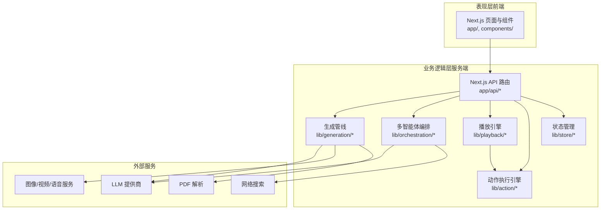
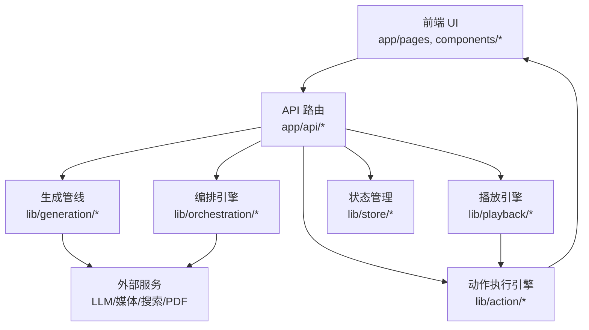
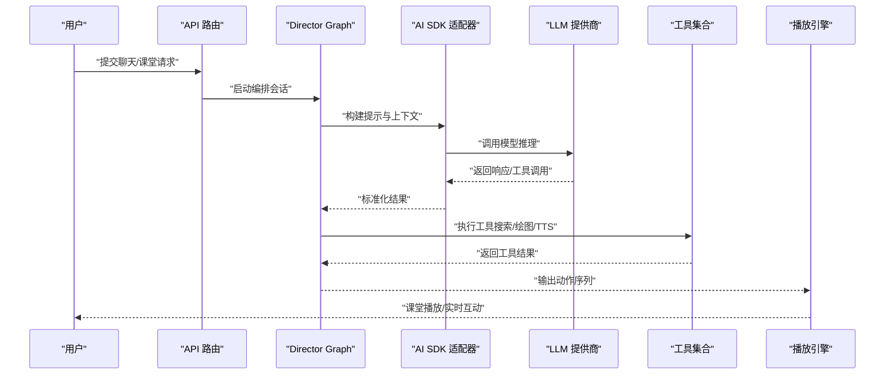
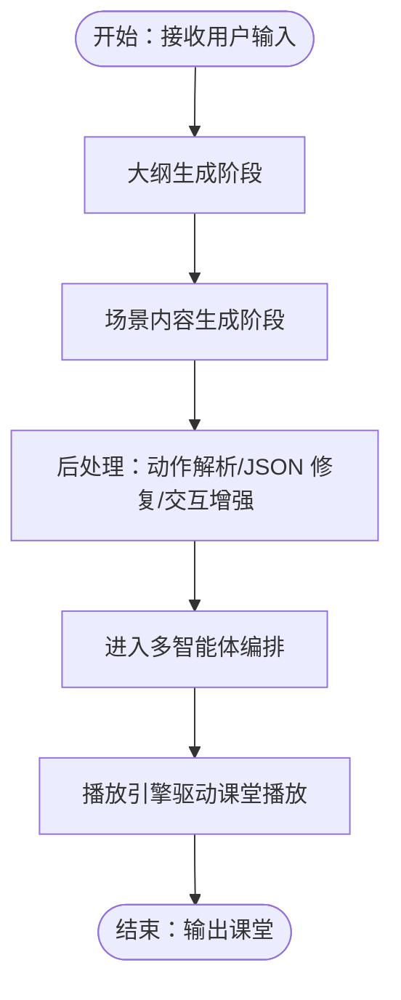
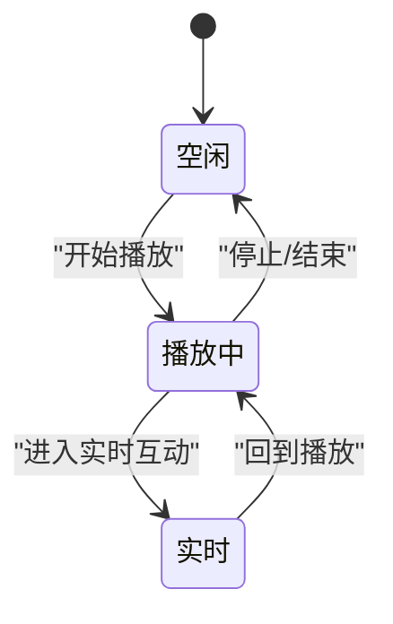
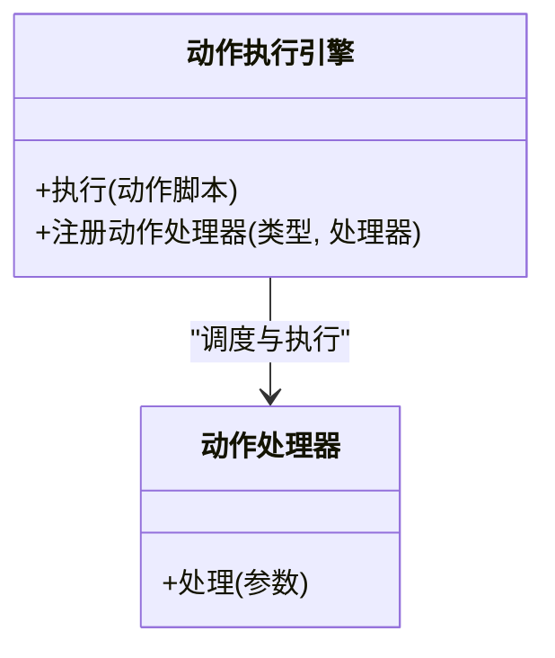
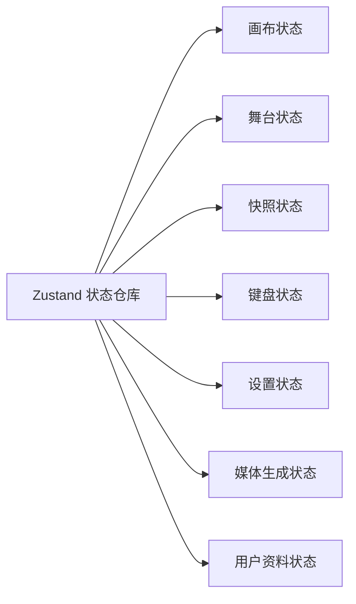
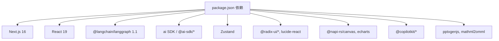

# 架构设计

<cite>
**本文引用的文件**
- [README.md](file://README.md)
- [package.json](file://package.json)
- [next.config.ts](file://next.config.ts)
- [lib/orchestration/director-graph.ts](file://lib/orchestration/director-graph.ts)
- [lib/orchestration/ai-sdk-adapter.ts](file://lib/orchestration/ai-sdk-adapter.ts)
- [lib/orchestration/director-prompt.ts](file://lib/orchestration/director-prompt.ts)
- [lib/orchestration/prompt-builder.ts](file://lib/orchestration/prompt-builder.ts)
- [lib/orchestration/tool-schemas.ts](file://lib/orchestration/tool-schemas.ts)
- [lib/orchestration/stateless-generate.ts](file://lib/orchestration/stateless-generate.ts)
- [lib/generation/generation-pipeline.ts](file://lib/generation/generation-pipeline.ts)
- [lib/generation/outline-generator.ts](file://lib/generation/outline-generator.ts)
- [lib/generation/scene-generator.ts](file://lib/generation/scene-generator.ts)
- [lib/generation/scene-builder.ts](file://lib/generation/scene-builder.ts)
- [lib/generation/pipeline-runner.ts](file://lib/generation/pipeline-runner.ts)
- [lib/generation/pipeline-types.ts](file://lib/generation/pipeline-types.ts)
- [lib/generation/action-parser.ts](file://lib/generation/action-parser.ts)
- [lib/generation/interactive-post-processor.ts](file://lib/generation/interactive-post-processor.ts)
- [lib/generation/json-repair.ts](file://lib/generation/json-repair.ts)
- [lib/generation/prompt-formatters.ts](file://lib/generation/prompt-formatters.ts)
- [lib/playback/engine.ts](file://lib/playback/engine.ts)
- [lib/playback/types.ts](file://lib/playback/types.ts)
- [lib/playback/derived-state.ts](file://lib/playback/derived-state.ts)
- [lib/action/engine.ts](file://lib/action/engine.ts)
- [lib/store/index.ts](file://lib/store/index.ts)
- [lib/store/canvas.ts](file://lib/store/canvas.ts)
- [lib/store/stage.ts](file://lib/store/stage.ts)
- [lib/store/snapshot.ts](file://lib/store/snapshot.ts)
- [lib/store/keyboard.ts](file://lib/store/keyboard.ts)
- [lib/store/settings.ts](file://lib/store/settings.ts)
- [lib/store/media-generation.ts](file://lib/store/media-generation.ts)
- [lib/store/user-profile.ts](file://lib/store/user-profile.ts)
- [app/api/generate-classroom/route.ts](file://app/api/generate-classroom/route.ts)
- [app/api/generate/scene-outlines-stream/route.ts](file://app/api/generate/scene-outlines-stream/route.ts)
- [app/api/chat/route.ts](file://app/api/chat/route.ts)
- [app/api/pbl/chat/route.ts](file://app/api/pbl/chat/route.ts)
- [app/api/web-search/route.ts](file://app/api/web-search/route.ts)
- [app/api/transcription/route.ts](file://app/api/transcription/route.ts)
- [app/api/parse-pdf/route.ts](file://app/api/parse-pdf/route.ts)
- [app/api/health/route.ts](file://app/api/health/route.ts)
- [app/classroom/[id]/page.tsx](file://app/classroom/[id]/page.tsx)
- [app/page.tsx](file://app/page.tsx)
- [components/scene-renderers/pbl-renderer.tsx](file://components/scene-renderers/pbl-renderer.tsx)
- [components/scene-renderers/quiz-renderer.tsx](file://components/scene-renderers/quiz-renderer.tsx)
- [components/scene-renderers/interactive-renderer.tsx](file://components/scene-renderers/interactive-renderer.tsx)
- [components/slide-renderer/index.tsx](file://components/slide-renderer/index.tsx)
- [components/whiteboard/whiteboard-canvas.tsx](file://components/whiteboard/whiteboard-canvas.tsx)
- [components/chat/chat-area.tsx](file://components/chat/chat-area.tsx)
- [components/generation/generating-progress.tsx](file://components/generation/generating-progress.tsx)
- [components/settings/index.tsx](file://components/settings/index.tsx)
- [components/ui/button.tsx](file://components/ui/button.tsx)
- [components/ui/input.tsx](file://components/ui/input.tsx)
- [components/ui/dialog.tsx](file://components/ui/dialog.tsx)
- [components/ui/card.tsx](file://components/ui/card.tsx)
- [configs/theme.ts](file://configs/theme.ts)
- [configs/hotkey.ts](file://configs/hotkey.ts)
- [configs/font.ts](file://configs/font.ts)
- [configs/mime.ts](file://configs/mime.ts)
- [configs/storage.ts](file://configs/storage.ts)
- [lib/ai/index.ts](file://lib/ai/index.ts)
- [lib/audio/index.ts](file://lib/audio/index.ts)
- [lib/media/index.ts](file://lib/media/index.ts)
- [lib/pdf/index.ts](file://lib/pdf/index.ts)
- [lib/web-search/index.ts](file://lib/web-search/index.ts)
- [lib/export/index.ts](file://lib/export/index.ts)
- [lib/hooks/index.ts](file://lib/hooks/index.ts)
- [lib/utils/index.ts](file://lib/utils/index.ts)
- [lib/logger.ts](file://lib/logger.ts)
</cite>

## 目录
1. [引言](#引言)
2. [项目结构](#项目结构)
3. [核心组件](#核心组件)
4. [架构总览](#架构总览)
5. [详细组件分析](#详细组件分析)
6. [依赖分析](#依赖分析)
7. [性能考量](#性能考量)
8. [故障排查指南](#故障排查指南)
9. [结论](#结论)
10. [附录](#附录)

## 引言
本文件为 OpenMAIC 的架构设计文档，面向技术与非技术读者，系统阐述平台的整体架构模式、核心设计原则与技术决策。OpenMAIC 是一个基于多智能体编排的互动课堂生成与播放平台，采用分层架构：表现层（前端 UI）、业务逻辑层（Next.js App Router 路由与服务端逻辑）、数据访问层（外部模型与媒体服务）。其核心能力包括两阶段课程生成（大纲 → 场景内容）、LangGraph 多智能体状态机编排、动作执行引擎、以及播放状态机驱动的课堂播放与实时互动。

## 项目结构
OpenMAIC 采用 Next.js App Router 组织前后端代码，核心目录与职责如下：
- app/：前端页面与 API 路由，包含生成、聊天、PBL、健康检查等路由
- lib/：核心业务逻辑，涵盖生成管线、多智能体编排、播放引擎、动作执行、状态管理、AI 抽象、音频/媒体/搜索等
- components/：React UI 组件库，覆盖滑动渲染器、场景渲染器、聊天、设置、白板等
- configs/：共享常量与配置（主题、字体、快捷键、MIME、存储）
- packages/：工作区包（数学公式转换、PPTX 生成）
- skills/：OpenClaw 技能与参考文档

图表来源
- [README.md: 372-426:372-426](file://README.md#L372-L426)
- [package.json: 15-94:15-94](file://package.json#L15-L94)

章节来源
- [README.md: 372-426:372-426](file://README.md#L372-L426)
- [package.json: 15-94:15-94](file://package.json#L15-L94)

## 核心组件
- 生成管线（lib/generation/*）：两阶段流水线（大纲生成 → 场景内容生成），支持 JSON 修复、提示格式化、动作解析与后处理
- 多智能体编排（lib/orchestration/*）：LangGraph Director Graph 状态机，负责角色轮次与讨论控制，适配不同 LLM SDK
- 播放引擎（lib/playback/*）：状态机驱动课堂播放与实时互动（空闲 → 播放中 → 实时）
- 动作执行引擎（lib/action/*）：统一执行 28+ 类型的动作（语音、白板绘制、高亮、激光等）
- 状态管理（lib/store/*）：Zustand 状态仓库，覆盖画布、舞台、快照、键盘、设置、媒体生成、用户资料
- 前端 UI（components/*）：滑动渲染器、场景渲染器（测验/互动/PBL）、聊天、设置、白板等
- 配置与工具（configs/*、lib/ai/*、lib/audio/*、lib/media/*、lib/web-search/*、lib/pdf/*）

章节来源
- [README.md: 428-434:428-434](file://README.md#L428-L434)
- [lib/generation/generation-pipeline.ts](file://lib/generation/generation-pipeline.ts)
- [lib/orchestration/director-graph.ts](file://lib/orchestration/director-graph.ts)
- [lib/playback/engine.ts](file://lib/playback/engine.ts)
- [lib/action/engine.ts](file://lib/action/engine.ts)
- [lib/store/index.ts](file://lib/store/index.ts)

## 架构总览
OpenMAIC 的整体架构遵循分层与模块化原则：
- 表现层：Next.js App Router 页面与组件，负责用户交互与课堂回放
- 业务逻辑层：API 路由作为入口，调用生成管线、编排引擎、播放引擎与动作执行引擎
- 数据访问层：通过 lib/ai、lib/audio、lib/media、lib/web-search、lib/pdf 等抽象对接外部服务
- 关键技术栈：Next.js 16、React 19、TypeScript、LangGraph 1.1、ai SDK、Radix UI、Tailwind CSS

图表来源
- [README.md: 372-426:372-426](file://README.md#L372-L426)
- [package.json: 15-94:15-94](file://package.json#L15-L94)

## 详细组件分析

### 多智能体编排架构（LangGraph 状态机）
- 设计思路：以 Director Graph 为核心的状态机，协调多个 AI 角色（教师、同学、助教）在课堂中的发言顺序与讨论流程，确保对话自然、连贯且目标导向
- 关键文件：
  - [lib/orchestration/director-graph.ts](file://lib/orchestration/director-graph.ts)
  - [lib/orchestration/ai-sdk-adapter.ts](file://lib/orchestration/ai-sdk-adapter.ts)
  - [lib/orchestration/director-prompt.ts](file://lib/orchestration/director-prompt.ts)
  - [lib/orchestration/prompt-builder.ts](file://lib/orchestration/prompt-builder.ts)
  - [lib/orchestration/tool-schemas.ts](file://lib/orchestration/tool-schemas.ts)
  - [lib/orchestration/stateless-generate.ts](file://lib/orchestration/stateless-generate.ts)
- 工作原理：
  - Prompt Builder 构建上下文与角色指令
  - AI SDK Adapter 将不同提供商的 SDK 统一为一致接口
  - Director Graph 根据当前状态（等待发言、思考、行动、结束）推进流程
  - Tool Schemas 定义可调用工具（如搜索、TTS、绘图），实现“边思考边行动”
  - Stateless Generate 支持无状态的快速生成与重试
- 组件交互：
  - API 层接收用户输入或课堂事件，触发编排引擎
  - 编排引擎调用 LLM 与工具，更新状态并返回下一步动作
  - 播放引擎根据动作序列驱动课堂播放与实时互动

图表来源
- [lib/orchestration/director-graph.ts](file://lib/orchestration/director-graph.ts)
- [lib/orchestration/ai-sdk-adapter.ts](file://lib/orchestration/ai-sdk-adapter.ts)
- [lib/orchestration/director-prompt.ts](file://lib/orchestration/director-prompt.ts)
- [lib/orchestration/prompt-builder.ts](file://lib/orchestration/prompt-builder.ts)
- [lib/orchestration/tool-schemas.ts](file://lib/orchestration/tool-schemas.ts)
- [lib/orchestration/stateless-generate.ts](file://lib/orchestration/stateless-generate.ts)
- [lib/playback/engine.ts](file://lib/playback/engine.ts)

章节来源
- [lib/orchestration/director-graph.ts](file://lib/orchestration/director-graph.ts)
- [lib/orchestration/ai-sdk-adapter.ts](file://lib/orchestration/ai-sdk-adapter.ts)
- [lib/orchestration/director-prompt.ts](file://lib/orchestration/director-prompt.ts)
- [lib/orchestration/prompt-builder.ts](file://lib/orchestration/prompt-builder.ts)
- [lib/orchestration/tool-schemas.ts](file://lib/orchestration/tool-schemas.ts)
- [lib/orchestration/stateless-generate.ts](file://lib/orchestration/stateless-generate.ts)
- [lib/playback/engine.ts](file://lib/playback/engine.ts)

### 生成管线（大纲 → 场景内容）
- 设计思路：两阶段流水线，先生成结构化大纲，再为每个大纲项生成富媒体场景内容；支持 JSON 修复、动作解析与后处理
- 关键文件：
  - [lib/generation/generation-pipeline.ts](file://lib/generation/generation-pipeline.ts)
  - [lib/generation/outline-generator.ts](file://lib/generation/outline-generator.ts)
  - [lib/generation/scene-generator.ts](file://lib/generation/scene-generator.ts)
  - [lib/generation/scene-builder.ts](file://lib/generation/scene-builder.ts)
  - [lib/generation/pipeline-runner.ts](file://lib/generation/pipeline-runner.ts)
  - [lib/generation/pipeline-types.ts](file://lib/generation/pipeline-types.ts)
  - [lib/generation/action-parser.ts](file://lib/generation/action-parser.ts)
  - [lib/generation/interactive-post-processor.ts](file://lib/generation/interactive-post-processor.ts)
  - [lib/generation/json-repair.ts](file://lib/generation/json-repair.ts)
  - [lib/generation/prompt-formatters.ts](file://lib/generation/prompt-formatters.ts)
- 数据流：
  - 输入：用户主题/材料
  - 大纲阶段：结构化输出（标题、要点、类型）
  - 场景阶段：为每个大纲项生成富内容（文本、图片、视频、动作脚本）
  - 后处理：动作解析、JSON 修复、交互式场景增强
- 与编排的关系：大纲完成后进入编排阶段，由多智能体对场景进行讲解与互动

图表来源
- [lib/generation/generation-pipeline.ts](file://lib/generation/generation-pipeline.ts)
- [lib/generation/outline-generator.ts](file://lib/generation/outline-generator.ts)
- [lib/generation/scene-generator.ts](file://lib/generation/scene-generator.ts)
- [lib/generation/scene-builder.ts](file://lib/generation/scene-builder.ts)
- [lib/generation/pipeline-runner.ts](file://lib/generation/pipeline-runner.ts)
- [lib/generation/pipeline-types.ts](file://lib/generation/pipeline-types.ts)
- [lib/generation/action-parser.ts](file://lib/generation/action-parser.ts)
- [lib/generation/interactive-post-processor.ts](file://lib/generation/interactive-post-processor.ts)
- [lib/generation/json-repair.ts](file://lib/generation/json-repair.ts)
- [lib/generation/prompt-formatters.ts](file://lib/generation/prompt-formatters.ts)
- [lib/playback/engine.ts](file://lib/playback/engine.ts)

章节来源
- [lib/generation/generation-pipeline.ts](file://lib/generation/generation-pipeline.ts)
- [lib/generation/outline-generator.ts](file://lib/generation/outline-generator.ts)
- [lib/generation/scene-generator.ts](file://lib/generation/scene-generator.ts)
- [lib/generation/scene-builder.ts](file://lib/generation/scene-builder.ts)
- [lib/generation/pipeline-runner.ts](file://lib/generation/pipeline-runner.ts)
- [lib/generation/pipeline-types.ts](file://lib/generation/pipeline-types.ts)
- [lib/generation/action-parser.ts](file://lib/generation/action-parser.ts)
- [lib/generation/interactive-post-processor.ts](file://lib/generation/interactive-post-processor.ts)
- [lib/generation/json-repair.ts](file://lib/generation/json-repair.ts)
- [lib/generation/prompt-formatters.ts](file://lib/generation/prompt-formatters.ts)

### 播放引擎（状态机）
- 设计思路：以状态机驱动课堂播放与实时互动，状态包括空闲、播放中、实时讨论
- 关键文件：
  - [lib/playback/engine.ts](file://lib/playback/engine.ts)
  - [lib/playback/types.ts](file://lib/playback/types.ts)
  - [lib/playback/derived-state.ts](file://lib/playback/derived-state.ts)
- 工作原理：
  - Engine 根据动作序列推进状态，派发事件给 UI
  - Derived State 计算派生视图（当前场景、播放进度、互动标记）
  - 与动作执行引擎协同，保证动作与播放节奏一致

图表来源
- [lib/playback/types.ts](file://lib/playback/types.ts)
- [lib/playback/engine.ts](file://lib/playback/engine.ts)
- [lib/playback/derived-state.ts](file://lib/playback/derived-state.ts)

章节来源
- [lib/playback/engine.ts](file://lib/playback/engine.ts)
- [lib/playback/types.ts](file://lib/playback/types.ts)
- [lib/playback/derived-state.ts](file://lib/playback/derived-state.ts)

### 动作执行引擎
- 设计思路：统一的动作执行抽象，支持语音、白板绘制、高亮、激光、特效等 28+ 类型动作
- 关键文件：
  - [lib/action/engine.ts](file://lib/action/engine.ts)
- 工作原理：
  - 接收来自生成管线与编排引擎的动作脚本
  - 调用具体动作处理器（TTS、SVG 白板、Canvas 效果等）
  - 与播放引擎同步，确保动作按时间轴执行

图表来源
- [lib/action/engine.ts](file://lib/action/engine.ts)

章节来源
- [lib/action/engine.ts](file://lib/action/engine.ts)

### 状态管理（Zustand）
- 设计思路：模块化状态仓库，覆盖画布、舞台、快照、键盘、设置、媒体生成、用户资料等
- 关键文件：
  - [lib/store/index.ts](file://lib/store/index.ts)
  - [lib/store/canvas.ts](file://lib/store/canvas.ts)
  - [lib/store/stage.ts](file://lib/store/stage.ts)
  - [lib/store/snapshot.ts](file://lib/store/snapshot.ts)
  - [lib/store/keyboard.ts](file://lib/store/keyboard.ts)
  - [lib/store/settings.ts](file://lib/store/settings.ts)
  - [lib/store/media-generation.ts](file://lib/store/media-generation.ts)
  - [lib/store/user-profile.ts](file://lib/store/user-profile.ts)
- 工作原理：
  - 每个模块独立导出 Hook，便于组件按需订阅
  - 通过 Provider 在应用根部注入，全局共享状态

图表来源
- [lib/store/index.ts](file://lib/store/index.ts)
- [lib/store/canvas.ts](file://lib/store/canvas.ts)
- [lib/store/stage.ts](file://lib/store/stage.ts)
- [lib/store/snapshot.ts](file://lib/store/snapshot.ts)
- [lib/store/keyboard.ts](file://lib/store/keyboard.ts)
- [lib/store/settings.ts](file://lib/store/settings.ts)
- [lib/store/media-generation.ts](file://lib/store/media-generation.ts)
- [lib/store/user-profile.ts](file://lib/store/user-profile.ts)

章节来源
- [lib/store/index.ts](file://lib/store/index.ts)
- [lib/store/canvas.ts](file://lib/store/canvas.ts)
- [lib/store/stage.ts](file://lib/store/stage.ts)
- [lib/store/snapshot.ts](file://lib/store/snapshot.ts)
- [lib/store/keyboard.ts](file://lib/store/keyboard.ts)
- [lib/store/settings.ts](file://lib/store/settings.ts)
- [lib/store/media-generation.ts](file://lib/store/media-generation.ts)
- [lib/store/user-profile.ts](file://lib/store/user-profile.ts)

### 前端 UI 与场景渲染
- 设计思路：组件化 UI，覆盖滑动渲染器、场景渲染器（测验/互动/PBL）、聊天、设置、白板等
- 关键文件：
  - [components/slide-renderer/index.tsx](file://components/slide-renderer/index.tsx)
  - [components/scene-renderers/pbl-renderer.tsx](file://components/scene-renderers/pbl-renderer.tsx)
  - [components/scene-renderers/quiz-renderer.tsx](file://components/scene-renderers/quiz-renderer.tsx)
  - [components/scene-renderers/interactive-renderer.tsx](file://components/scene-renderers/interactive-renderer.tsx)
  - [components/whiteboard/whiteboard-canvas.tsx](file://components/whiteboard/whiteboard-canvas.tsx)
  - [components/chat/chat-area.tsx](file://components/chat/chat-area.tsx)
  - [components/generation/generating-progress.tsx](file://components/generation/generating-progress.tsx)
  - [components/settings/index.tsx](file://components/settings/index.tsx)
  - [components/ui/button.tsx](file://components/ui/button.tsx)
  - [components/ui/input.tsx](file://components/ui/input.tsx)
  - [components/ui/dialog.tsx](file://components/ui/dialog.tsx)
  - [components/ui/card.tsx](file://components/ui/card.tsx)
- 工作原理：
  - 渲染器根据播放引擎与动作执行引擎提供的数据进行可视化
  - 设置面板与 UI 原语支撑用户交互与个性化

章节来源
- [components/slide-renderer/index.tsx](file://components/slide-renderer/index.tsx)
- [components/scene-renderers/pbl-renderer.tsx](file://components/scene-renderers/pbl-renderer.tsx)
- [components/scene-renderers/quiz-renderer.tsx](file://components/scene-renderers/quiz-renderer.tsx)
- [components/scene-renderers/interactive-renderer.tsx](file://components/scene-renderers/interactive-renderer.tsx)
- [components/whiteboard/whiteboard-canvas.tsx](file://components/whiteboard/whiteboard-canvas.tsx)
- [components/chat/chat-area.tsx](file://components/chat/chat-area.tsx)
- [components/generation/generating-progress.tsx](file://components/generation/generating-progress.tsx)
- [components/settings/index.tsx](file://components/settings/index.tsx)
- [components/ui/button.tsx](file://components/ui/button.tsx)
- [components/ui/input.tsx](file://components/ui/input.tsx)
- [components/ui/dialog.tsx](file://components/ui/dialog.tsx)
- [components/ui/card.tsx](file://components/ui/card.tsx)

### API 路由与集成点
- 设计思路：App Router 路由作为统一入口，提供生成、聊天、PBL、健康检查、媒体代理等接口
- 关键文件：
  - [app/api/generate-classroom/route.ts](file://app/api/generate-classroom/route.ts)
  - [app/api/generate/scene-outlines-stream/route.ts](file://app/api/generate/scene-outlines-stream/route.ts)
  - [app/api/chat/route.ts](file://app/api/chat/route.ts)
  - [app/api/pbl/chat/route.ts](file://app/api/pbl/chat/route.ts)
  - [app/api/web-search/route.ts](file://app/api/web-search/route.ts)
  - [app/api/transcription/route.ts](file://app/api/transcription/route.ts)
  - [app/api/parse-pdf/route.ts](file://app/api/parse-pdf/route.ts)
  - [app/api/health/route.ts](file://app/api/health/route.ts)
- 工作原理：
  - 路由接收请求，调用相应业务模块（生成/编排/播放/动作）
  - 返回 JSON、SSE 流或二进制媒体资源
  - 与外部服务（LLM、搜索、PDF、媒体）集成

章节来源
- [app/api/generate-classroom/route.ts](file://app/api/generate-classroom/route.ts)
- [app/api/generate/scene-outlines-stream/route.ts](file://app/api/generate/scene-outlines-stream/route.ts)
- [app/api/chat/route.ts](file://app/api/chat/route.ts)
- [app/api/pbl/chat/route.ts](file://app/api/pbl/chat/route.ts)
- [app/api/web-search/route.ts](file://app/api/web-search/route.ts)
- [app/api/transcription/route.ts](file://app/api/transcription/route.ts)
- [app/api/parse-pdf/route.ts](file://app/api/parse-pdf/route.ts)
- [app/api/health/route.ts](file://app/api/health/route.ts)

## 依赖分析
- 技术栈依赖：Next.js 16、React 19、TypeScript、LangGraph 1.1、ai SDK、Radix UI、Tailwind CSS、Zustand、ProseMirror、ECharts、CopilotKit 等
- 外部集成：LLM 提供商（OpenAI、Anthropic、Google Gemini、DeepSeek 及兼容 API）、图像/视频/语音服务、网络搜索、PDF 解析、OpenClaw 技能
- 构建与部署：Next.js standalone 输出、pnpm workspace、Docker Compose、Vercel 部署

图表来源
- [package.json: 15-94:15-94](file://package.json#L15-L94)

章节来源
- [package.json: 15-94:15-94](file://package.json#L15-L94)
- [next.config.ts: 3-10:3-10](file://next.config.ts#L3-L10)

## 性能考量
- 生成管线优化：两阶段流水线减少单次推理负载；JSON 修复与动作解析在后台进行，避免阻塞主线程
- 编排效率：LangGraph 状态机与工具调用并行化，降低等待时间；AI SDK 适配器统一接口，便于缓存与重试
- 播放与渲染：播放引擎与动作执行引擎解耦，渲染器按需更新；白板与画布使用硬件加速图形库
- I/O 与带宽：媒体生成与转码在服务端完成，前端通过流式传输与预览加载；PDF 解析与搜索使用外部服务，减少本地计算
- 部署与扩展：Next.js standalone 输出与 Docker 化部署，支持水平扩展与边缘分发

## 故障排查指南
- 生成失败：检查大纲与场景生成日志，确认 JSON 修复是否成功；验证提示格式化与动作解析是否正确
- 编排异常：查看状态机推进日志，确认工具调用是否成功；检查 AI SDK 适配器配置
- 播放错位：核对播放引擎状态与动作时间轴，检查动作执行引擎是否按序执行
- 外部服务错误：LLM、搜索、PDF、媒体服务的密钥与地址配置；网络超时与限流策略
- 前端渲染问题：UI 组件状态与 Zustand 状态同步；样式与主题配置

章节来源
- [lib/logger.ts](file://lib/logger.ts)
- [lib/generation/json-repair.ts](file://lib/generation/json-repair.ts)
- [lib/orchestration/ai-sdk-adapter.ts](file://lib/orchestration/ai-sdk-adapter.ts)
- [lib/playback/engine.ts](file://lib/playback/engine.ts)
- [lib/action/engine.ts](file://lib/action/engine.ts)

## 结论
OpenMAIC 通过清晰的分层架构与模块化设计，实现了从用户输入到课堂输出的高效闭环：生成管线负责内容结构化与富媒体生成，多智能体编排确保课堂互动自然流畅，播放引擎与动作执行引擎保障可视化与交互体验，前端 UI 与状态管理提供良好的用户体验。该架构在可扩展性、可维护性与性能之间取得平衡，并为未来功能演进预留了充足空间。

## 附录
- 系统边界：前端仅负责展示与交互；业务逻辑集中在服务端；数据访问通过抽象层对接外部服务
- 设计模式应用：
  - 工厂模式：AI SDK 适配器与工具注册机制
  - 观察者模式：Zustand 状态变更通知与 UI 更新
  - 状态机模式：播放引擎与编排状态机
- 集成点说明：LLM 提供商、图像/视频/语音服务、网络搜索、PDF 解析、OpenClaw 技能