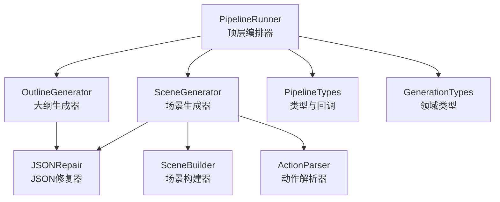
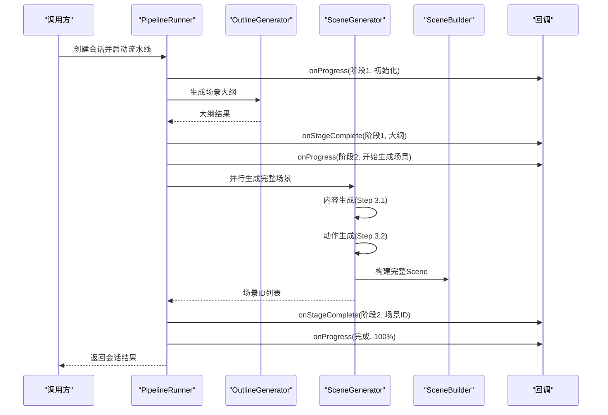
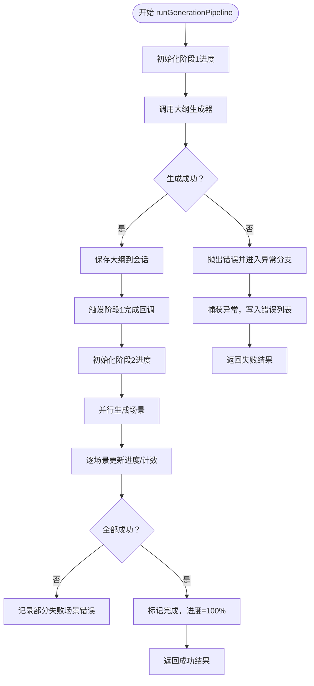
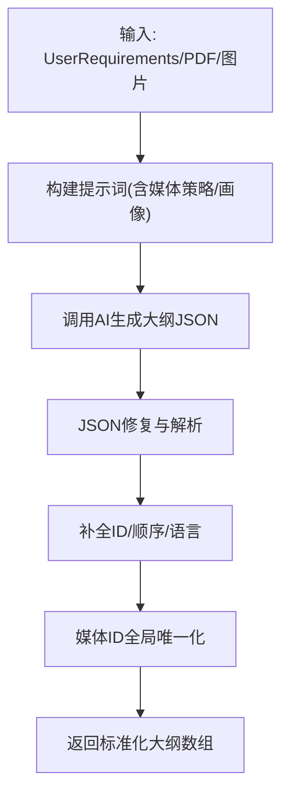
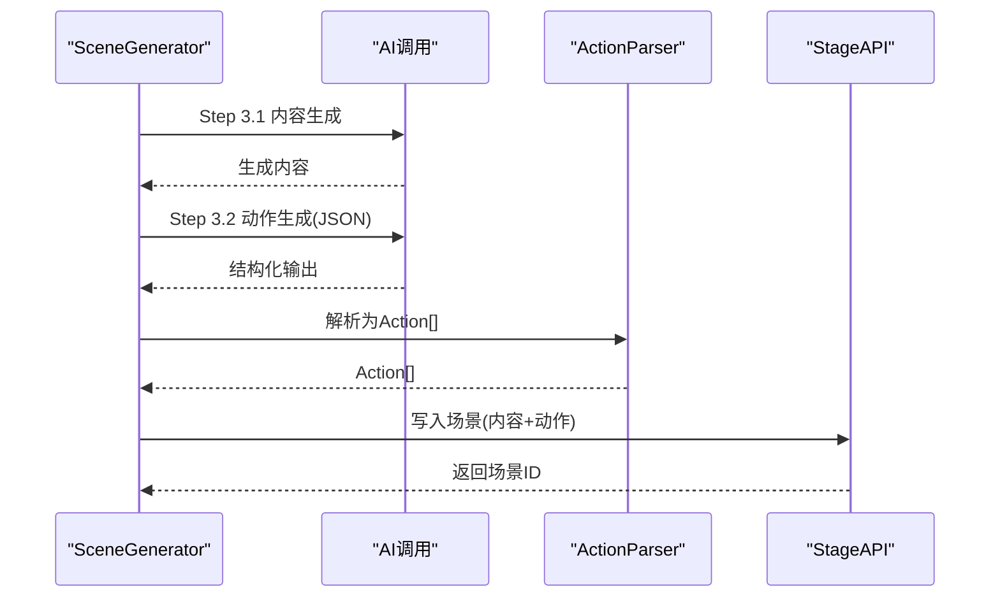
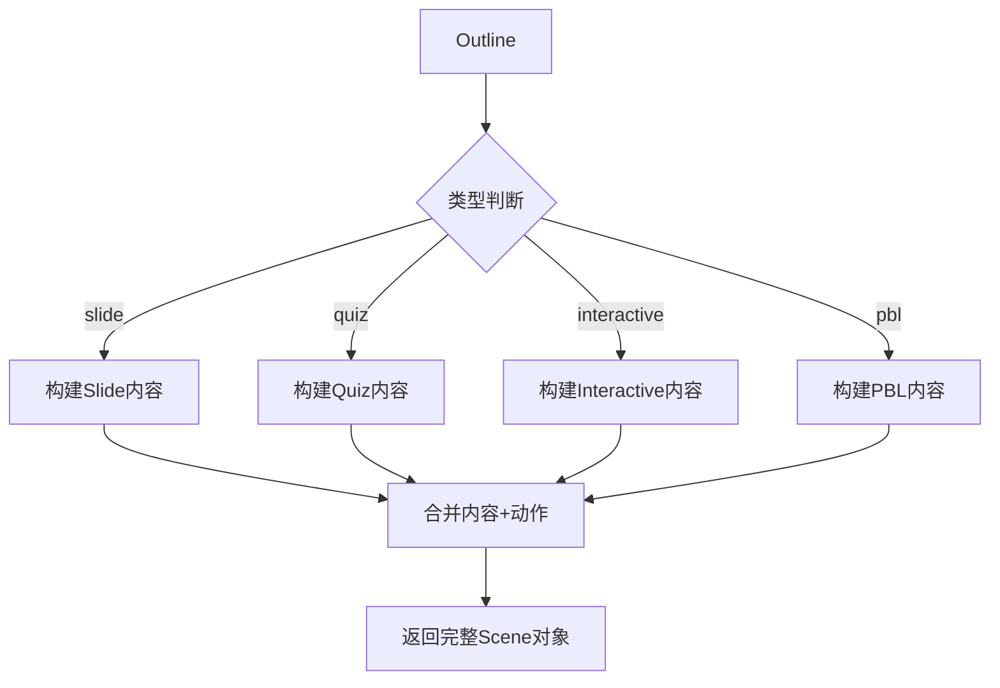
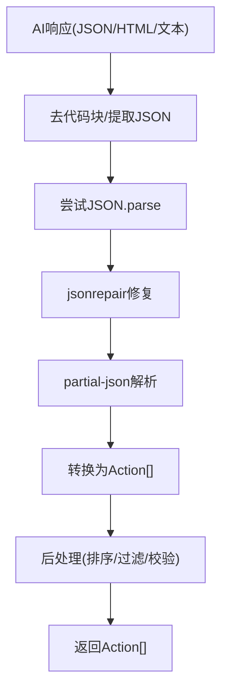
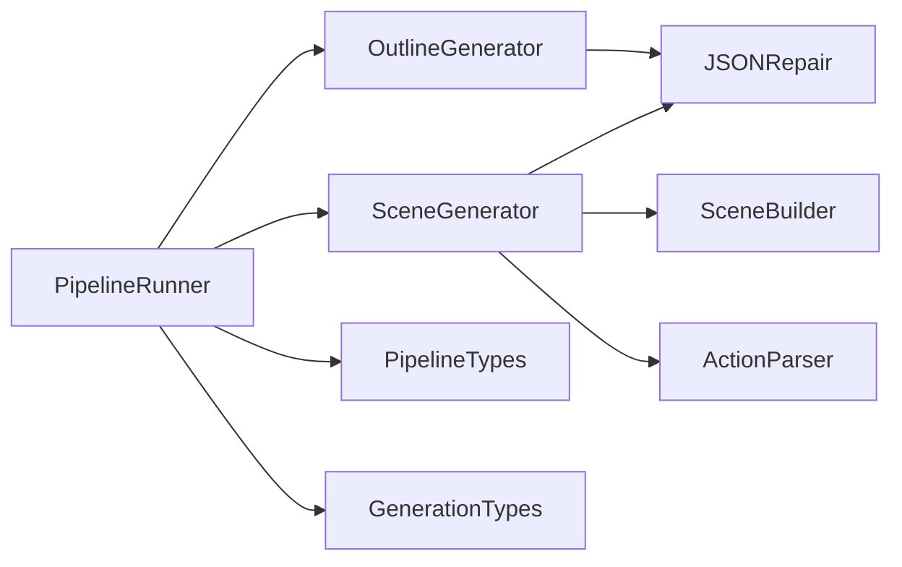

# 生成管道架构

<cite>
**本文引用的文件**
- [pipeline-runner.ts](file://lib/generation/pipeline-runner.ts)
- [outline-generator.ts](file://lib/generation/outline-generator.ts)
- [scene-generator.ts](file://lib/generation/scene-generator.ts)
- [scene-builder.ts](file://lib/generation/scene-builder.ts)
- [generation-pipeline.ts](file://lib/generation/generation-pipeline.ts)
- [pipeline-types.ts](file://lib/generation/pipeline-types.ts)
- [generation.ts](file://lib/types/generation.ts)
- [action-parser.ts](file://lib/generation/action-parser.ts)
- [json-repair.ts](file://lib/generation/json-repair.ts)
</cite>

## 目录
1. [引言](#引言)
2. [项目结构](#项目结构)
3. [核心组件](#核心组件)
4. [架构总览](#架构总览)
5. [详细组件分析](#详细组件分析)
6. [依赖关系分析](#依赖关系分析)
7. [性能考量](#性能考量)
8. [故障排查指南](#故障排查指南)
9. [结论](#结论)
10. [附录：扩展与定制](#附录扩展与定制)

## 引言
本文件系统性阐述两阶段生成流水线的架构设计与实现细节，覆盖从用户需求到最终场景动作序列的完整链路。文档重点解析 PipelineRunner 的编排逻辑、状态管理、错误处理，以及大纲生成器与场景生成器的职责分离与接口设计；并说明场景构建器如何将抽象场景描述转换为可执行的动作序列，最后给出扩展点与自定义机制，帮助开发者在不破坏整体架构的前提下灵活扩展新阶段或调整现有流程。

## 项目结构
生成管道相关代码集中在 lib/generation 目录下，采用“按功能域拆分”的模块化组织方式：
- pipeline-runner.ts：顶层编排器，负责会话创建与阶段调度
- outline-generator.ts：第一阶段：从用户需求生成场景大纲
- scene-generator.ts：第二阶段：基于大纲生成完整场景（内容+动作）
- scene-builder.ts：独立场景构建器，产出完整 Scene 对象（不依赖存储）
- generation-pipeline.ts：导出聚合入口，统一对外暴露符号
- pipeline-types.ts：类型与回调契约定义
- generation.ts：生成领域核心类型（需求、大纲、内容、进度等）
- action-parser.ts：将结构化输出解析为 Typed Action 列表
- json-repair.ts：鲁棒解析 AI 输出的 JSON 解析器

图表来源
- [pipeline-runner.ts:1-92](file://lib/generation/pipeline-runner.ts#L1-L92)
- [outline-generator.ts:1-182](file://lib/generation/outline-generator.ts#L1-L182)
- [scene-generator.ts:1-1293](file://lib/generation/scene-generator.ts#L1-L1293)
- [scene-builder.ts:1-224](file://lib/generation/scene-builder.ts#L1-L224)
- [pipeline-types.ts:1-73](file://lib/generation/pipeline-types.ts#L1-L73)
- [generation.ts:1-229](file://lib/types/generation.ts#L1-L229)
- [action-parser.ts:1-155](file://lib/generation/action-parser.ts#L1-L155)
- [json-repair.ts:1-185](file://lib/generation/json-repair.ts#L1-L185)

章节来源
- [generation-pipeline.ts:1-51](file://lib/generation/generation-pipeline.ts#L1-L51)

## 核心组件
- PipelineRunner：创建会话并驱动两阶段流水线，负责进度上报、阶段切换与错误收集
- OutlineGenerator：将用户需求转化为标准化的 SceneOutline 列表，并进行类型回退与媒体 ID 唯一化
- SceneGenerator：并行生成完整场景，包含内容生成与动作生成两个子步骤
- SceneBuilder：独立构建完整 Scene 对象，不依赖存储层，便于 SSE 流式渲染
- ActionParser：将结构化 JSON 输出解析为 Typed Action 数组，支持多种格式与容错策略
- JSONRepair：多策略解析 AI 输出，提升鲁棒性
- PipelineTypes 与 GenerationTypes：定义跨模块的类型契约与领域模型

章节来源
- [pipeline-runner.ts:13-92](file://lib/generation/pipeline-runner.ts#L13-L92)
- [outline-generator.ts:26-182](file://lib/generation/outline-generator.ts#L26-L182)
- [scene-generator.ts:61-144](file://lib/generation/scene-generator.ts#L61-L144)
- [scene-builder.ts:67-117](file://lib/generation/scene-builder.ts#L67-L117)
- [action-parser.ts:42-155](file://lib/generation/action-parser.ts#L42-L155)
- [json-repair.ts:9-185](file://lib/generation/json-repair.ts#L9-L185)
- [pipeline-types.ts:54-73](file://lib/generation/pipeline-types.ts#L54-L73)
- [generation.ts:65-129](file://lib/types/generation.ts#L65-L129)

## 架构总览
两阶段生成流水线以 PipelineRunner 为核心，串联大纲生成与场景生成两大阶段，并在每个阶段内嵌入进度上报与错误处理回调。大纲生成器负责产出标准化场景大纲，场景生成器则在并行模式下生成完整场景（内容+动作），并通过 SceneBuilder 将内容与动作整合为可持久化的 Scene 对象。

图表来源
- [pipeline-runner.ts:30-91](file://lib/generation/pipeline-runner.ts#L30-L91)
- [outline-generator.ts:26-157](file://lib/generation/outline-generator.ts#L26-L157)
- [scene-generator.ts:61-144](file://lib/generation/scene-generator.ts#L61-L144)
- [scene-builder.ts:67-117](file://lib/generation/scene-builder.ts#L67-L117)

## 详细组件分析

### PipelineRunner 编排逻辑与状态管理
- 会话创建：生成唯一会话ID，初始化进度字段（当前阶段、总体进度、阶段进度、状态消息、场景计数、错误列表）
- 阶段1：调用大纲生成器，更新 session.sceneOutlines，触发 onStageComplete 回调
- 阶段2：并行生成完整场景，实时更新进度与场景计数，捕获单场景异常并记录错误
- 完成态：设置 completedAt，将进度置为100%，返回成功结果；异常时统一上报错误并写入 session.progress.errors

图表来源
- [pipeline-runner.ts:30-91](file://lib/generation/pipeline-runner.ts#L30-L91)

章节来源
- [pipeline-runner.ts:13-92](file://lib/generation/pipeline-runner.ts#L13-L92)

### 大纲生成器：需求到大纲的转换
- 输入：UserRequirements（简化版）、PDF 文本与图片、AI 调用函数、回调、可选配置（视觉能力、媒体生成策略）
- 关键流程：
  - 组装可用图片描述（支持视觉模式与文本模式）
  - 注入学生画像上下文
  - 应用媒体生成策略提示
  - 构建提示词并调用 AI，解析 JSON 结果
  - 补全大纲字段（ID、顺序、语言），进行媒体元素 ID 唯一化
  - 触发进度回调，返回标准化大纲数组
- 类型回退：当 outline.type 为 interactive 或 pbl 且缺少必要配置时，回退为 slide

图表来源
- [outline-generator.ts:26-157](file://lib/generation/outline-generator.ts#L26-L157)

章节来源
- [outline-generator.ts:26-182](file://lib/generation/outline-generator.ts#L26-L182)

### 场景生成器：内容与动作的两步生成
- 并行生成：对每个大纲并行执行 generateSingleScene
- 单场景两步：
  - Step 3.1：generateSceneContent（根据大纲类型选择具体生成器）
  - Step 3.2：generateSceneActions（解析结构化输出为 Action 列表）
- createSceneWithActions：将 outline、content、actions 写入存储并返回场景ID
- 进度与错误：每完成一个场景更新进度，异常场景记录错误并继续

图表来源
- [scene-generator.ts:61-144](file://lib/generation/scene-generator.ts#L61-L144)
- [scene-generator.ts:908-1033](file://lib/generation/scene-generator.ts#L908-L1033)
- [action-parser.ts:42-155](file://lib/generation/action-parser.ts#L42-L155)

章节来源
- [scene-generator.ts:61-144](file://lib/generation/scene-generator.ts#L61-L144)
- [scene-generator.ts:149-202](file://lib/generation/scene-generator.ts#L149-L202)
- [scene-generator.ts:908-1033](file://lib/generation/scene-generator.ts#L908-L1033)

### 场景构建器：从大纲到完整场景对象
- 独立构建：不依赖存储，直接产出完整 Scene 对象，便于 SSE 流式渲染
- 类型分派：根据 outline.type 生成对应内容（slide/quiz/interactive/pbl），并填充默认主题、视口等
- 与 PipelineRunner 的关系：PipelineRunner 负责持久化写入，SceneBuilder 更偏向于内存态组装

图表来源
- [scene-builder.ts:67-117](file://lib/generation/scene-builder.ts#L67-L117)
- [scene-builder.ts:122-223](file://lib/generation/scene-builder.ts#L122-L223)

章节来源
- [scene-builder.ts:67-117](file://lib/generation/scene-builder.ts#L67-L117)
- [scene-builder.ts:122-223](file://lib/generation/scene-builder.ts#L122-L223)

### 动作解析器：结构化输出到可执行动作
- 支持格式：标准 JSON 数组、带代码块包裹、部分 JSON
- 容错策略：去除代码块、提取 JSON 结构、jsonrepair 修复、partial-json 解析
- 后处理：将 text 条目转为 speech 动作；校验并过滤非法动作；对非 slide 场景剔除 slide-only 动作；支持白名单过滤

图表来源
- [action-parser.ts:42-155](file://lib/generation/action-parser.ts#L42-L155)

章节来源
- [action-parser.ts:42-155](file://lib/generation/action-parser.ts#L42-L155)

### JSON 修复器：鲁棒解析 AI 输出
- 多策略解析：从代码块提取、正则定位 JSON、尾部闭合修复、jsonrepair、控制字符清理
- 记录日志：失败时输出原始响应片段，便于调试

章节来源
- [json-repair.ts:9-185](file://lib/generation/json-repair.ts#L9-L185)

## 依赖关系分析
- 模块内聚：各模块职责清晰，PipelineRunner 仅负责编排与进度，具体生成逻辑下沉至子模块
- 模块耦合：OutlineGenerator 与 SceneGenerator 通过统一的 SceneOutline 接口耦合；SceneGenerator 依赖 ActionParser 与 JSONRepair；PipelineRunner 依赖 PipelineTypes 与 GenerationTypes
- 可能的循环依赖：未发现直接循环导入；若新增模块需谨慎引入反向依赖
- 外部依赖：StageAPI 用于持久化写入；AI 调用函数由上层注入；日志工具统一创建

图表来源
- [pipeline-runner.ts:1-11](file://lib/generation/pipeline-runner.ts#L1-L11)
- [outline-generator.ts:14-18](file://lib/generation/outline-generator.ts#L14-L18)
- [scene-generator.ts:25-28](file://lib/generation/scene-generator.ts#L25-L28)
- [action-parser.ts:12-18](file://lib/generation/action-parser.ts#L12-L18)
- [json-repair.ts:5-7](file://lib/generation/json-repair.ts#L5-L7)
- [pipeline-types.ts:5-6](file://lib/generation/pipeline-types.ts#L5-L6)
- [generation.ts:8-10](file://lib/types/generation.ts#L8-L10)

章节来源
- [generation-pipeline.ts:8-51](file://lib/generation/generation-pipeline.ts#L8-L51)

## 性能考量
- 并行化：阶段2对所有场景并行生成，显著缩短总耗时；注意并发度与资源限制
- 进度更新：非原子更新，但足以满足 UI 展示；如需更精确统计可引入队列与计数器
- JSON 解析：多策略解析带来额外开销，建议在稳定模式下减少回退路径
- 图像映射：resolveImageIds 与 fixElementDefaults 存在多次遍历，可在批量处理时优化

## 故障排查指南
- 大纲生成失败：检查提示词构建、AI 输出是否包含 JSON、媒体策略是否正确
- 场景生成异常：关注单场景错误回调，确认内容生成与动作解析是否成功
- 动作解析失败：查看 ActionParser 日志，确认响应是否被正确提取与修复
- JSON 解析失败：查看 JSONRepair 日志，定位 AI 输出中的特殊字符或截断问题

章节来源
- [pipeline-runner.ts:85-91](file://lib/generation/pipeline-runner.ts#L85-L91)
- [scene-generator.ts:98-103](file://lib/generation/scene-generator.ts#L98-L103)
- [action-parser.ts:76-81](file://lib/generation/action-parser.ts#L76-L81)
- [json-repair.ts:91-95](file://lib/generation/json-repair.ts#L91-L95)

## 结论
该生成管道以 PipelineRunner 为中心，通过大纲生成与场景生成的职责分离，实现了高内聚、低耦合的两阶段流水线。通过完善的进度与错误回调、鲁棒的 JSON 解析与动作解析策略，以及独立的场景构建器，系统在保证稳定性的同时具备良好的扩展性。后续可在保持现有接口契约的前提下，增加新的生成阶段或替换现有生成器。

## 附录：扩展与定制
- 新增生成阶段
  - 在 PipelineRunner 中新增阶段常量与进度推进逻辑
  - 定义阶段回调 onStageComplete，确保前后阶段有序衔接
  - 通过 PipelineTypes 扩展回调签名，避免破坏既有接口
- 替换或扩展生成器
  - 保持输入/输出类型一致（如 SceneOutline → Scene 或对应内容类型）
  - 使用 JSONRepair 与 ActionParser 提升鲁棒性
  - 如需持久化，使用 StageAPI；如仅内存态，沿用 SceneBuilder 模式
- 自定义媒体策略
  - 在大纲生成阶段注入媒体生成策略提示，控制生成内容与图片占位符
  - 使用 uniquifyMediaElementIds 确保媒体 ID 全局唯一
- 个性化与上下文
  - 通过 UserRequirements 与 AgentInfo 注入个性化信息
  - 使用 SceneGenerationContext 维护跨场景语义连贯性（如语音一致性）

章节来源
- [pipeline-runner.ts:30-91](file://lib/generation/pipeline-runner.ts#L30-L91)
- [outline-generator.ts:80-93](file://lib/generation/outline-generator.ts#L80-L93)
- [scene-builder.ts:34-61](file://lib/generation/scene-builder.ts#L34-L61)
- [pipeline-types.ts:19-25](file://lib/generation/pipeline-types.ts#L19-L25)
- [generation.ts:65-129](file://lib/types/generation.ts#L65-L129)