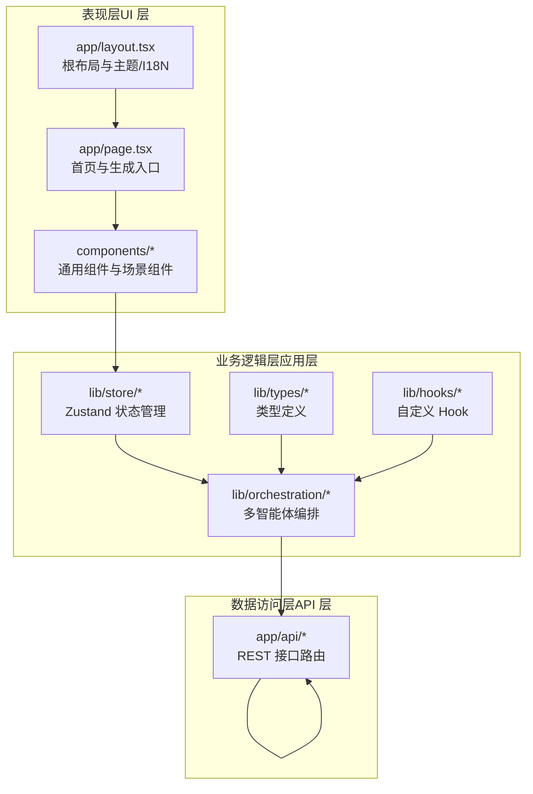
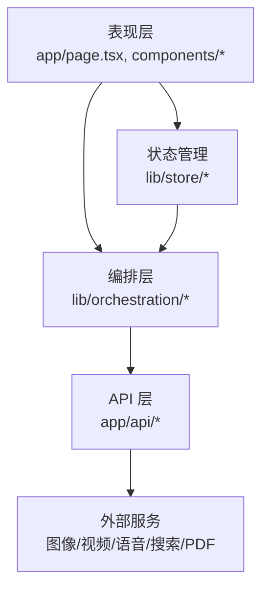
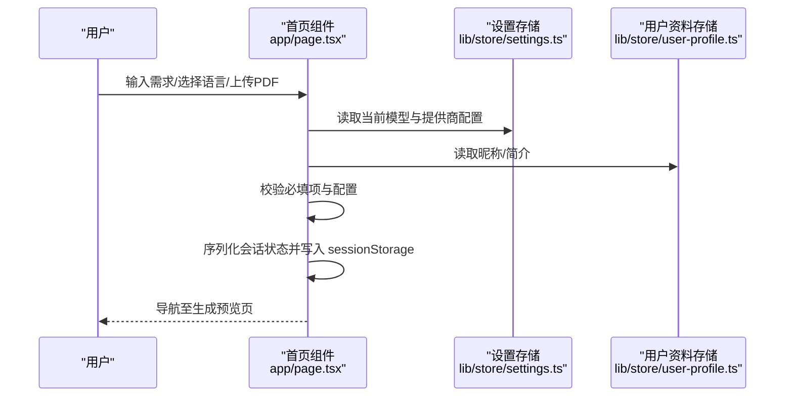
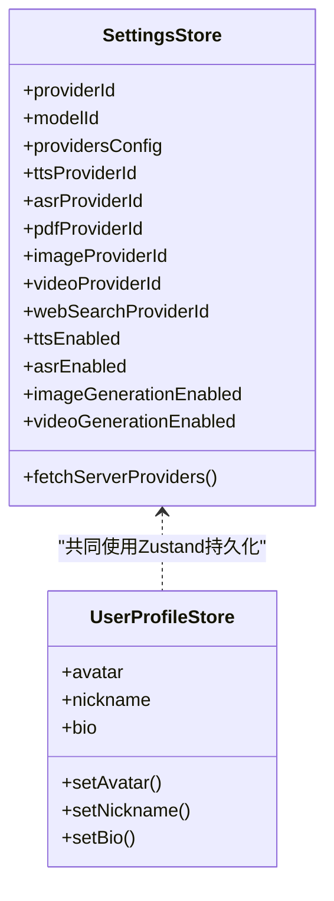
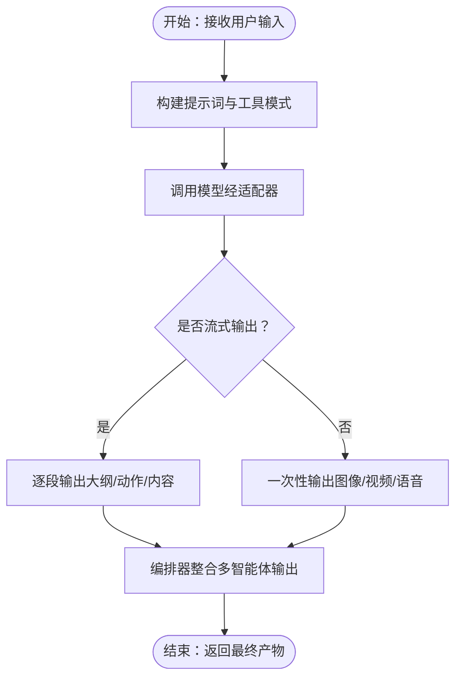
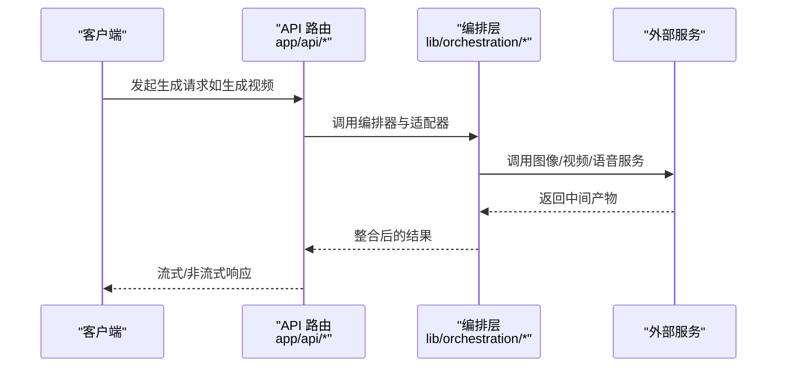
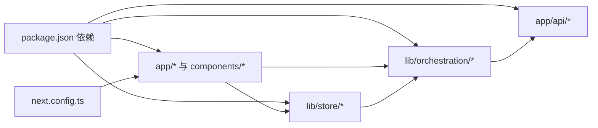

# 系统架构总览

<cite>
**本文引用的文件**
- [package.json](file://package.json)
- [next.config.ts](file://next.config.ts)
- [app/layout.tsx](file://app/layout.tsx)
- [app/page.tsx](file://app/page.tsx)
- [lib/store/index.ts](file://lib/store/index.ts)
- [lib/store/settings.ts](file://lib/store/settings.ts)
- [lib/store/user-profile.ts](file://lib/store/user-profile.ts)
- [components/server-providers-init.tsx](file://components/server-providers-init.tsx)
- [lib/orchestration/director-graph.ts](file://lib/orchestration/director-graph.ts)
- [lib/orchestration/ai-sdk-adapter.ts](file://lib/orchestration/ai-sdk-adapter.ts)
- [lib/orchestration/stateless-generate.ts](file://lib/orchestration/stateless-generate.ts)
- [lib/orchestration/tool-schemas.ts](file://lib/orchestration/tool-schemas.ts)
- [app/api/chat/route.ts](file://app/api/chat/route.ts)
- [app/api/generate/video/route.ts](file://app/api/generate/video/route.ts)
- [app/api/generate/image/route.ts](file://app/api/generate/image/route.ts)
- [app/api/generate/tts/route.ts](file://app/api/generate/tts/route.ts)
- [app/api/generate/scene-content/route.ts](file://app/api/generate/scene-content/route.ts)
- [app/api/generate/scene-actions/route.ts](file://app/api/generate/scene-actions/route.ts)
- [app/api/generate/scene-outlines-stream/route.ts](file://app/api/generate/scene-outlines-stream/route.ts)
- [app/api/generate/agent-profiles/route.ts](file://app/api/generate/agent-profiles/route.ts)
- [app/api/generate/classroom/route.ts](file://app/api/generate/classroom/route.ts)
- [app/api/generate-classroom/route.ts](file://app/api/generate-classroom/route.ts)
- [app/api/health/route.ts](file://app/api/health/route.ts)
- [app/api/parse-pdf/route.ts](file://app/api/parse-pdf/route.ts)
- [app/api/transcription/route.ts](file://app/api/transcription/route.ts)
- [app/api/web-search/route.ts](file://app/api/web-search/route.ts)
- [app/api/server-providers/route.ts](file://app/api/server-providers/route.ts)
- [app/api/verify-image-provider/route.ts](file://app/api/verify-image-provider/route.ts)
- [app/api/verify-model/route.ts](file://app/api/verify-model/route.ts)
- [app/api/verify-pdf-provider/route.ts](file://app/api/verify-pdf-provider/route.ts)
- [app/api/verify-video-provider/route.ts](file://app/api/verify-video-provider/route.ts)
</cite>

## 目录
1. [引言](#引言)
2. [项目结构](#项目结构)
3. [核心组件](#核心组件)
4. [架构总览](#架构总览)
5. [详细组件分析](#详细组件分析)
6. [依赖分析](#依赖分析)
7. [性能考量](#性能考量)
8. [故障排查指南](#故障排查指南)
9. [结论](#结论)
10. [附录](#附录)

## 引言
本文件为 OpenMAIC 系统的架构总览文档，聚焦于整体分层架构设计与多智能体编排模式。系统采用 Next.js 16 + React 的前端框架，结合 Zustand 状态管理与服务端 API 路由，构建出“表现层-业务逻辑层-数据访问层”的清晰职责划分，并通过多智能体编排实现复杂教学场景的生成与交互。

## 项目结构
OpenMAIC 以 Next.js 应用为核心，采用按功能域组织的目录结构：
- 表现层（UI 层）：位于 app/ 与 components/，包含页面路由、通用组件与场景渲染器。
- 业务逻辑层（应用层）：位于 lib/，包含状态管理、类型定义、工具函数、AI 编排与钩子等。
- 数据访问层（API 层）：位于 app/api/，提供 REST 风格的后端接口，统一处理外部服务调用与内部任务编排。

图表来源
- [app/layout.tsx:1-47](file://app/layout.tsx#L1-L47)
- [app/page.tsx:1-800](file://app/page.tsx#L1-L800)
- [lib/store/index.ts:1-19](file://lib/store/index.ts#L1-L19)
- [lib/orchestration/director-graph.ts](file://lib/orchestration/director-graph.ts)
- [package.json:15-94](file://package.json#L15-L94)

章节来源
- [package.json:15-94](file://package.json#L15-L94)
- [next.config.ts:1-13](file://next.config.ts#L1-13)
- [app/layout.tsx:1-47](file://app/layout.tsx#L1-L47)
- [app/page.tsx:1-800](file://app/page.tsx#L1-L800)
- [lib/store/index.ts:1-19](file://lib/store/index.ts#L1-L19)

## 核心组件
- 状态管理：使用 Zustand 提供全局状态（设置、用户资料、媒体生成等），持久化至 localStorage，确保跨会话一致性与快速初始化。
- 多智能体编排：通过 director-graph 与 ai-sdk-adapter 实现智能体间的协作、工具调用与流式输出，支持课堂大纲、动作与内容的生成。
- API 路由：app/api 下的各路由负责对接外部模型与服务（图像、视频、语音、PDF 解析、网络搜索等），并提供健康检查与配置验证接口。
- 主题与国际化：在根布局中注入主题切换与国际化能力，保证一致的用户体验。

章节来源
- [lib/store/settings.ts:1-800](file://lib/store/settings.ts#L1-L800)
- [lib/store/user-profile.ts:1-45](file://lib/store/user-profile.ts#L1-L45)
- [lib/orchestration/director-graph.ts](file://lib/orchestration/director-graph.ts)
- [lib/orchestration/ai-sdk-adapter.ts](file://lib/orchestration/ai-sdk-adapter.ts)
- [app/api/server-providers/route.ts](file://app/api/server-providers/route.ts)
- [app/layout.tsx:1-47](file://app/layout.tsx#L1-L47)

## 架构总览
OpenMAIC 采用三层架构与多智能体编排相结合的设计：
- 表现层：Next.js 页面与组件负责用户交互、输入收集与结果展示；通过 Zustand 管理本地状态与持久化。
- 业务逻辑层：封装编排逻辑（director-graph）、适配器（ai-sdk-adapter）、无状态生成（stateless-generate）与工具模式（tool-schemas），形成可复用的生成管线。
- 数据访问层：API 路由作为统一入口，协调外部服务（图像/视频/语音/搜索/PDF），并提供服务器端配置同步与健康检查。

图表来源
- [app/page.tsx:1-800](file://app/page.tsx#L1-L800)
- [lib/store/index.ts:1-19](file://lib/store/index.ts#L1-L19)
- [lib/orchestration/director-graph.ts](file://lib/orchestration/director-graph.ts)
- [app/api/generate/scene-outlines-stream/route.ts](file://app/api/generate/scene-outlines-stream/route.ts)
- [app/api/generate/scene-content/route.ts](file://app/api/generate/scene-content/route.ts)
- [app/api/generate/scene-actions/route.ts](file://app/api/generate/scene-actions/route.ts)
- [app/api/generate/agent-profiles/route.ts](file://app/api/generate/agent-profiles/route.ts)
- [app/api/generate/image/route.ts](file://app/api/generate/image/route.ts)
- [app/api/generate/video/route.ts](file://app/api/generate/video/route.ts)
- [app/api/generate/tts/route.ts](file://app/api/generate/tts/route.ts)
- [app/api/parse-pdf/route.ts](file://app/api/parse-pdf/route.ts)
- [app/api/web-search/route.ts](file://app/api/web-search/route.ts)

## 详细组件分析

### 组件 A 分析：首页与生成入口（app/page.tsx）
- 职责：收集用户需求、语言偏好、是否启用网络搜索、PDF 文件上传；准备生成会话状态并跳转预览页。
- 关键流程：校验模型配置、序列化用户要求、写入 sessionStorage、导航至生成预览。
- 状态依赖：依赖设置存储（模型、提供商配置）与用户资料存储（昵称、简介）。

图表来源
- [app/page.tsx:233-302](file://app/page.tsx#L233-L302)
- [lib/store/settings.ts:421-478](file://lib/store/settings.ts#L421-L478)
- [lib/store/user-profile.ts:30-45](file://lib/store/user-profile.ts#L30-L45)

章节来源
- [app/page.tsx:1-800](file://app/page.tsx#L1-L800)
- [lib/store/settings.ts:1-800](file://lib/store/settings.ts#L1-L800)
- [lib/store/user-profile.ts:1-45](file://lib/store/user-profile.ts#L1-L45)

### 组件 B 分析：状态管理（lib/store）
- 设置存储（SettingsStore）：集中管理模型、提供商、TTS/ASR、PDF、图像、视频、Web 搜索、播放控制与代理设置等，支持持久化与服务器配置合并。
- 用户资料存储（UserProfileStore）：管理头像、昵称、个人简介，持久化至 localStorage。
- 导出聚合：统一导出核心 store，便于组件消费。

图表来源
- [lib/store/settings.ts:26-233](file://lib/store/settings.ts#L26-L233)
- [lib/store/user-profile.ts:20-45](file://lib/store/user-profile.ts#L20-L45)

章节来源
- [lib/store/index.ts:1-19](file://lib/store/index.ts#L1-L19)
- [lib/store/settings.ts:1-800](file://lib/store/settings.ts#L1-L800)
- [lib/store/user-profile.ts:1-45](file://lib/store/user-profile.ts#L1-L45)

### 组件 C 分析：多智能体编排（lib/orchestration）
- director-graph：定义智能体协作图谱，协调不同角色（如教师、学生、旁白）的任务分配与输出整合。
- ai-sdk-adapter：适配不同模型 SDK，统一工具调用与流式响应格式。
- stateless-generate：无状态生成器，按需组装提示词与工具，减少副作用。
- tool-schemas：标准化工具参数与返回值，提升编排稳定性。

图表来源
- [lib/orchestration/director-graph.ts](file://lib/orchestration/director-graph.ts)
- [lib/orchestration/ai-sdk-adapter.ts](file://lib/orchestration/ai-sdk-adapter.ts)
- [lib/orchestration/stateless-generate.ts](file://lib/orchestration/stateless-generate.ts)
- [lib/orchestration/tool-schemas.ts](file://lib/orchestration/tool-schemas.ts)

章节来源
- [lib/orchestration/director-graph.ts](file://lib/orchestration/director-graph.ts)
- [lib/orchestration/ai-sdk-adapter.ts](file://lib/orchestration/ai-sdk-adapter.ts)
- [lib/orchestration/stateless-generate.ts](file://lib/orchestration/stateless-generate.ts)
- [lib/orchestration/tool-schemas.ts](file://lib/orchestration/tool-schemas.ts)

### 组件 D 分析：API 路由（app/api）
- 生成类路由：scene-outlines-stream、scene-content、scene-actions、agent-profiles、image、video、tts 等，负责调用外部服务或内部编排器，返回流式或非流式结果。
- 教学场景路由：generate-classroom、generate/generate-classroom，用于批量生成课堂资源。
- 基础设施路由：health、server-providers、verify-* 系列，提供健康检查与配置验证。
- 工具与解析：parse-pdf、transcription、web-search 等，支撑 PDF 文本提取、语音转写与网络检索。

图表来源
- [app/api/generate/scene-outlines-stream/route.ts](file://app/api/generate/scene-outlines-stream/route.ts)
- [app/api/generate/scene-content/route.ts](file://app/api/generate/scene-content/route.ts)
- [app/api/generate/scene-actions/route.ts](file://app/api/generate/scene-actions/route.ts)
- [app/api/generate/agent-profiles/route.ts](file://app/api/generate/agent-profiles/route.ts)
- [app/api/generate/image/route.ts](file://app/api/generate/image/route.ts)
- [app/api/generate/video/route.ts](file://app/api/generate/video/route.ts)
- [app/api/generate/tts/route.ts](file://app/api/generate/tts/route.ts)
- [lib/orchestration/ai-sdk-adapter.ts](file://lib/orchestration/ai-sdk-adapter.ts)

章节来源
- [app/api/generate/scene-outlines-stream/route.ts](file://app/api/generate/scene-outlines-stream/route.ts)
- [app/api/generate/scene-content/route.ts](file://app/api/generate/scene-content/route.ts)
- [app/api/generate/scene-actions/route.ts](file://app/api/generate/scene-actions/route.ts)
- [app/api/generate/agent-profiles/route.ts](file://app/api/generate/agent-profiles/route.ts)
- [app/api/generate/image/route.ts](file://app/api/generate/image/route.ts)
- [app/api/generate/video/route.ts](file://app/api/generate/video/route.ts)
- [app/api/generate/tts/route.ts](file://app/api/generate/tts/route.ts)
- [app/api/parse-pdf/route.ts](file://app/api/parse-pdf/route.ts)
- [app/api/transcription/route.ts](file://app/api/transcription/route.ts)
- [app/api/web-search/route.ts](file://app/api/web-search/route.ts)
- [app/api/health/route.ts](file://app/api/health/route.ts)
- [app/api/server-providers/route.ts](file://app/api/server-providers/route.ts)
- [app/api/verify-image-provider/route.ts](file://app/api/verify-image-provider/route.ts)
- [app/api/verify-model/route.ts](file://app/api/verify-model/route.ts)
- [app/api/verify-pdf-provider/route.ts](file://app/api/verify-pdf-provider/route.ts)
- [app/api/verify-video-provider/route.ts](file://app/api/verify-video-provider/route.ts)

## 依赖分析
- 技术栈与依赖：Next.js 16、React 19、Zustand、ai SDK、CopilotKit、LangChain LangGraph、Radix UI、ProseMirror、TailwindCSS 等。
- 配置与打包：next.config.ts 启用实验特性与包转译，package.json 定义脚本与依赖版本。
- 组件耦合：UI 组件依赖 store 与 hooks；编排层依赖 API 路由与外部服务；API 路由依赖编排层与工具集。

图表来源
- [package.json:15-94](file://package.json#L15-L94)
- [next.config.ts:1-13](file://next.config.ts#L1-13)
- [app/layout.tsx:1-47](file://app/layout.tsx#L1-L47)
- [lib/store/index.ts:1-19](file://lib/store/index.ts#L1-L19)
- [lib/orchestration/director-graph.ts](file://lib/orchestration/director-graph.ts)
- [app/api/server-providers/route.ts](file://app/api/server-providers/route.ts)

章节来源
- [package.json:15-94](file://package.json#L15-L94)
- [next.config.ts:1-13](file://next.config.ts#L1-13)
- [lib/store/index.ts:1-19](file://lib/store/index.ts#L1-L19)

## 性能考量
- 渲染与加载：Next.js 16 的服务端渲染与静态优化有助于首屏性能；组件按需加载与动画库的合理使用可降低阻塞。
- 状态管理：Zustand 无样板代码的状态更新与持久化策略，减少不必要的重渲染，提升交互流畅度。
- 编排与流式：通过流式输出（SSE/流式响应）与分段生成，降低单次请求延迟，改善用户体验。
- 外部服务：对图像/视频/语音等大体积资源采用流式传输与缓存策略，避免内存峰值过高。
- 可扩展性：API 路由与编排层解耦，便于新增提供商与工具；服务器配置合并机制支持动态能力下发。

## 故障排查指南
- 服务器提供商配置未生效：确认根布局挂载的初始化组件已执行，且 API /api/server-providers 返回预期配置。
- 生成失败或超时：检查对应 API 路由（如生成视频/图像/TTS）的上游服务可用性与凭据配置。
- 状态异常：核对设置存储与用户资料存储的持久化键名与迁移逻辑，避免旧格式冲突。
- 编排错误：查看编排器日志与工具调用参数，确保提示词与工具模式符合预期。

章节来源
- [components/server-providers-init.tsx:1-19](file://components/server-providers-init.tsx#L1-L19)
- [app/api/server-providers/route.ts](file://app/api/server-providers/route.ts)
- [lib/store/settings.ts:353-419](file://lib/store/settings.ts#L353-L419)

## 结论
OpenMAIC 通过 Next.js + React 的现代前端架构、Zustand 的轻量状态管理与多智能体编排体系，实现了从用户输入到课堂资源生成的高效闭环。该设计在性能、可扩展性与可维护性之间取得平衡：表现层简洁直观、业务逻辑可复用、数据访问统一收敛，适合持续演进与团队协作。

## 附录
- 根布局与主题/I18N 注入：确保全局样式、主题切换与国际化在应用启动时完成初始化。
- 服务器配置同步：在客户端挂载阶段拉取服务器侧能力清单，动态合并到本地设置存储，保障运行时一致性。

章节来源
- [app/layout.tsx:1-47](file://app/layout.tsx#L1-L47)
- [components/server-providers-init.tsx:1-19](file://components/server-providers-init.tsx#L1-L19)
- [lib/store/settings.ts:620-800](file://lib/store/settings.ts#L620-L800)