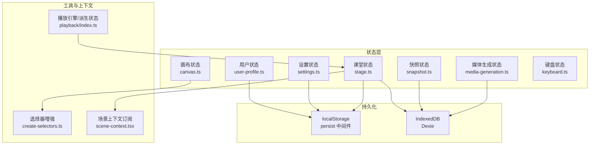
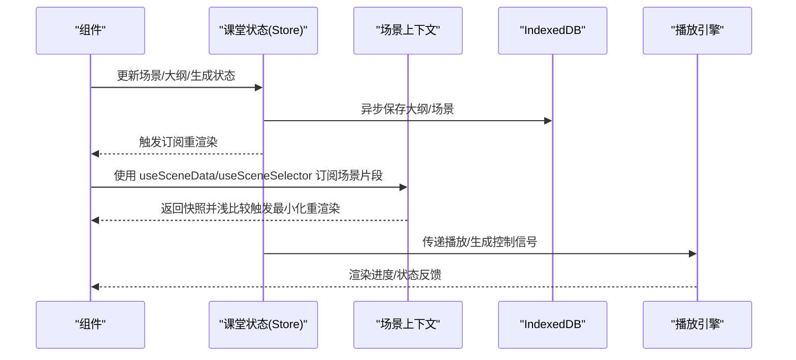
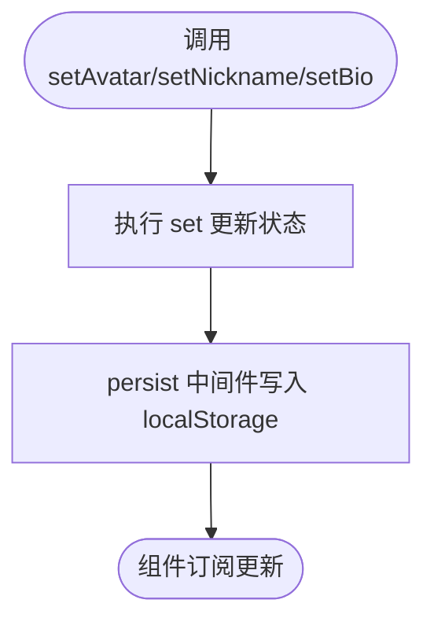
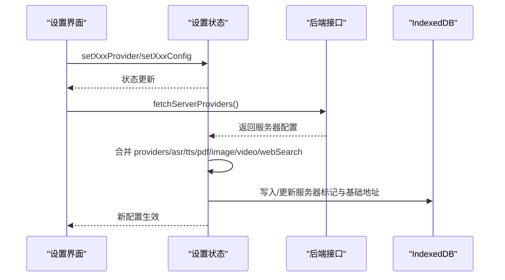
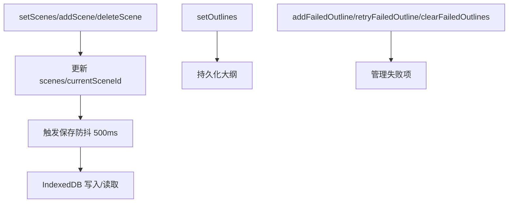
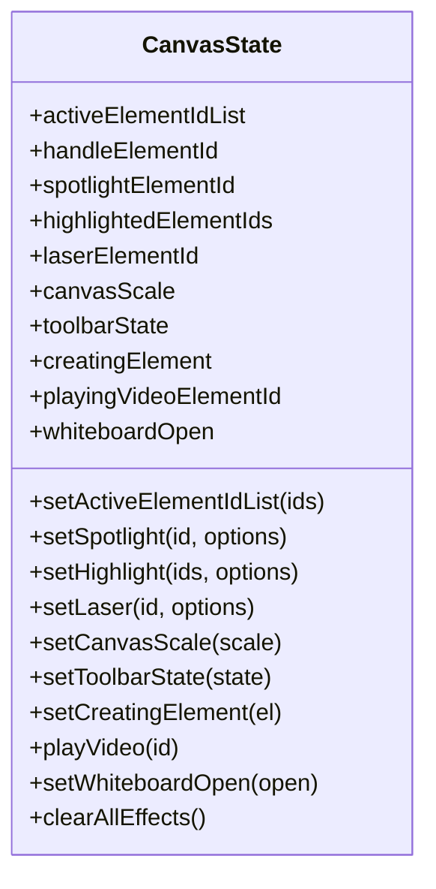
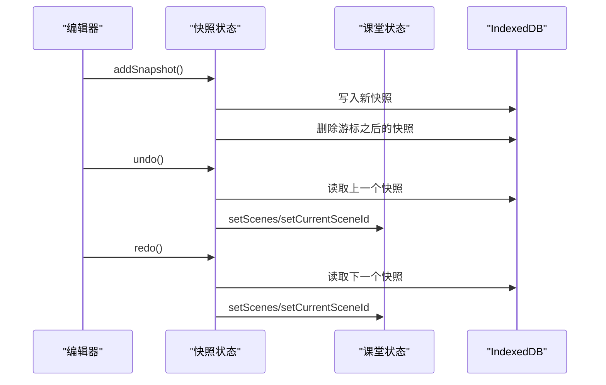
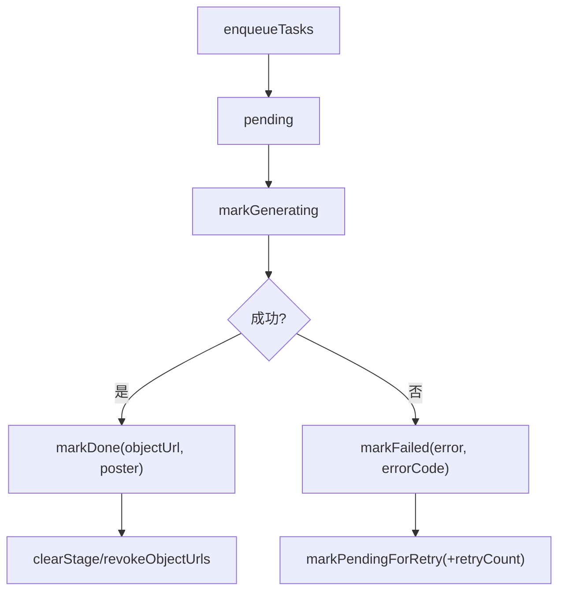
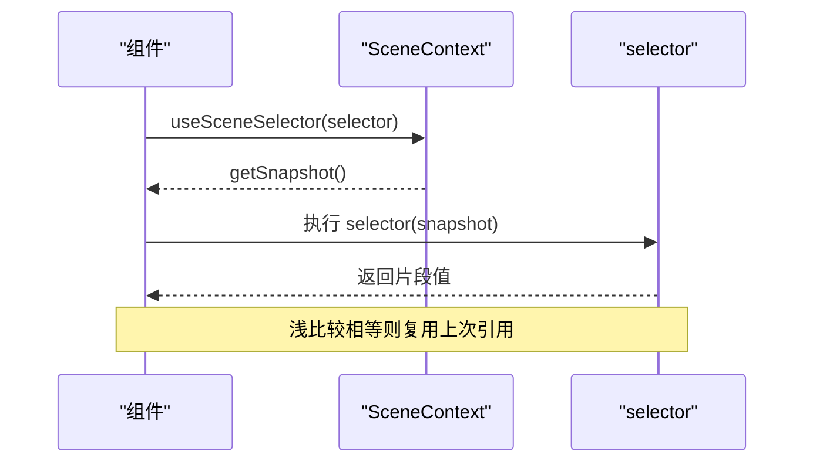
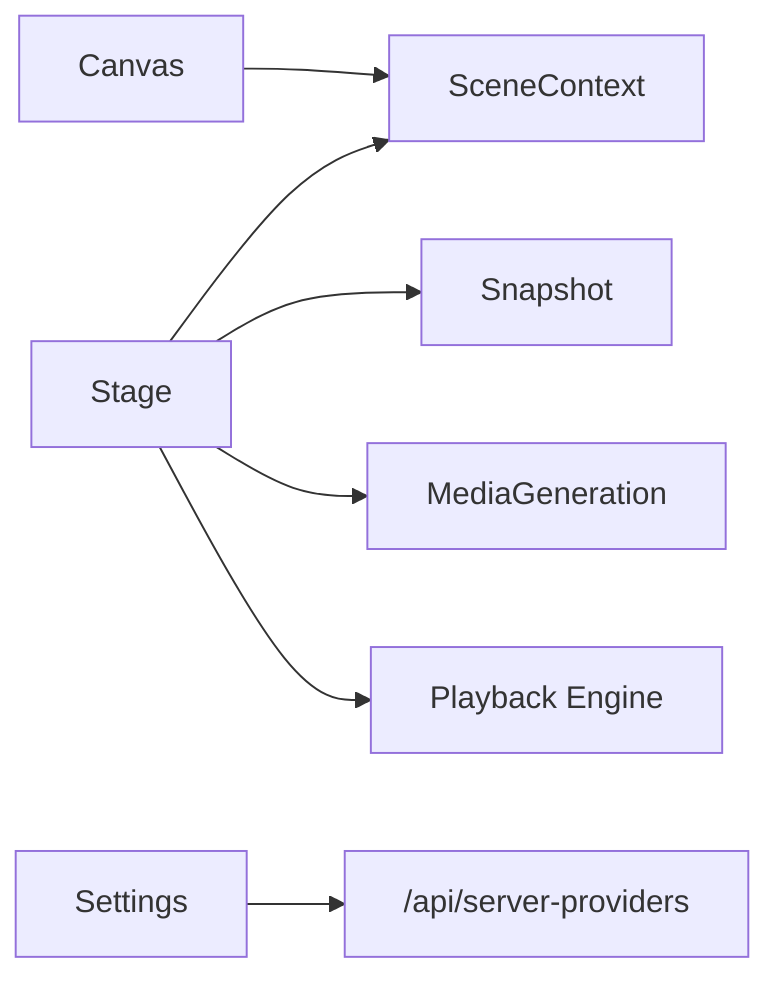

# 状态管理系统

<cite>
**本文引用的文件**
- [lib/store/index.ts](file://lib/store/index.ts)
- [lib/store/user-profile.ts](file://lib/store/user-profile.ts)
- [lib/store/settings.ts](file://lib/store/settings.ts)
- [lib/store/stage.ts](file://lib/store/stage.ts)
- [lib/store/canvas.ts](file://lib/store/canvas.ts)
- [lib/store/snapshot.ts](file://lib/store/snapshot.ts)
- [lib/store/media-generation.ts](file://lib/store/media-generation.ts)
- [lib/store/keyboard.ts](file://lib/store/keyboard.ts)
- [lib/utils/create-selectors.ts](file://lib/utils/create-selectors.ts)
- [lib/contexts/scene-context.tsx](file://lib/contexts/scene-context.tsx)
- [lib/playback/index.ts](file://lib/playback/index.ts)
- [lib/api/stage-api-types.ts](file://lib/api/stage-api-types.ts)
</cite>

## 目录
1. [简介](#简介)
2. [项目结构](#项目结构)
3. [核心组件](#核心组件)
4. [架构总览](#架构总览)
5. [详细组件分析](#详细组件分析)
6. [依赖关系分析](#依赖关系分析)
7. [性能考量](#性能考量)
8. [故障排查指南](#故障排查指南)
9. [结论](#结论)
10. [附录](#附录)

## 简介
本文件系统性阐述基于 Zustand 的状态管理系统，覆盖状态存储、订阅机制与更新策略；详解全局状态（用户、课堂、生成、设置）设计；说明组件间状态同步与一致性保障；解释持久化策略（localStorage、IndexedDB、服务器同步）；提供调试工具使用指南（时间旅行调试、状态快照、性能监控）；总结最佳实践（结构设计、副作用处理、内存优化）；并给出扩展开发指南与常见问题解决方案。

## 项目结构
状态管理采用“模块化 Zustand Store + 场景上下文”的分层组织方式：
- 核心 Store：用户、设置、课堂、画布、快照、媒体生成、键盘等
- 工具与增强：选择器增强、场景上下文订阅、播放引擎与派生状态
- 持久化：Zustand persist（localStorage）、IndexedDB（Dexie）
- 订阅：React useSyncExternalStore + 自定义选择器，确保细粒度重渲染

图表来源
- [lib/store/user-profile.ts:30-44](file://lib/store/user-profile.ts#L30-L44)
- [lib/store/settings.ts:421-440](file://lib/store/settings.ts#L421-L440)
- [lib/store/stage.ts:98-123](file://lib/store/stage.ts#L98-L123)
- [lib/store/canvas.ts:251-258](file://lib/store/canvas.ts#L251-L258)
- [lib/store/snapshot.ts:31-60](file://lib/store/snapshot.ts#L31-L60)
- [lib/store/media-generation.ts:73-97](file://lib/store/media-generation.ts#L73-L97)
- [lib/store/keyboard.ts:17-33](file://lib/store/keyboard.ts#L17-L33)
- [lib/utils/create-selectors.ts:7-15](file://lib/utils/create-selectors.ts#L7-L15)
- [lib/contexts/scene-context.tsx:119-125](file://lib/contexts/scene-context.tsx#L119-L125)
- [lib/playback/index.ts:1-3](file://lib/playback/index.ts#L1-L3)

章节来源
- [lib/store/index.ts:1-19](file://lib/store/index.ts#L1-L19)
- [lib/store/user-profile.ts:30-44](file://lib/store/user-profile.ts#L30-L44)
- [lib/store/settings.ts:421-440](file://lib/store/settings.ts#L421-L440)
- [lib/store/stage.ts:98-123](file://lib/store/stage.ts#L98-L123)
- [lib/store/canvas.ts:251-258](file://lib/store/canvas.ts#L251-L258)
- [lib/store/snapshot.ts:31-60](file://lib/store/snapshot.ts#L31-L60)
- [lib/store/media-generation.ts:73-97](file://lib/store/media-generation.ts#L73-L97)
- [lib/store/keyboard.ts:17-33](file://lib/store/keyboard.ts#L17-L33)
- [lib/utils/create-selectors.ts:7-15](file://lib/utils/create-selectors.ts#L7-L15)
- [lib/contexts/scene-context.tsx:119-125](file://lib/contexts/scene-context.tsx#L119-L125)
- [lib/playback/index.ts:1-3](file://lib/playback/index.ts#L1-L3)

## 核心组件
- 用户状态（UserProfile）：头像、昵称、个人简介，持久化到 localStorage
- 设置状态（Settings）：模型/提供商配置、音频/视频/PDF/图像/视频/网络搜索等配置、布局偏好、播放控制、代理服务拉取与合并
- 课堂状态（Stage）：舞台信息、场景列表、当前场景、聊天、模式、AI大纲生成状态、失败大纲、存储到 IndexedDB 的大纲与本地持久化
- 画布状态（Canvas）：元素选择、视口缩放、教学特效（聚光灯、高亮、激光、缩放）、工具栏面板、格式刷、白板等 UI 状态
- 快照状态（Snapshot）：基于 IndexedDB 的撤销/重做历史，维护游标与长度，支持页内焦点保持
- 媒体生成状态（MediaGeneration）：按元素跟踪生成任务（待处理/生成中/完成/失败），对象 URL 生命周期管理，IndexedDB 恢复
- 键盘状态（Keyboard）：Ctrl/Shift/空格键状态，组合键激活判断

章节来源
- [lib/store/user-profile.ts:20-44](file://lib/store/user-profile.ts#L20-L44)
- [lib/store/settings.ts:26-233](file://lib/store/settings.ts#L26-L233)
- [lib/store/stage.ts:39-96](file://lib/store/stage.ts#L39-L96)
- [lib/store/canvas.ts:51-183](file://lib/store/canvas.ts#L51-L183)
- [lib/store/snapshot.ts:7-23](file://lib/store/snapshot.ts#L7-L23)
- [lib/store/media-generation.ts:18-62](file://lib/store/media-generation.ts#L18-L62)
- [lib/store/keyboard.ts:3-15](file://lib/store/keyboard.ts#L3-L15)

## 架构总览
Zustand Store 通过 persist 中间件与 IndexedDB 双通道持久化；场景数据通过 SceneProvider 与 useSyncExternalStore 提供细粒度订阅；选择器增强（store.use.x）简化单字段订阅；课堂状态与播放引擎协同，支持大纲生成、失败重试与恢复。

图表来源
- [lib/store/stage.ts:250-306](file://lib/store/stage.ts#L250-L306)
- [lib/contexts/scene-context.tsx:119-180](file://lib/contexts/scene-context.tsx#L119-L180)
- [lib/playback/index.ts:1-3](file://lib/playback/index.ts#L1-L3)

## 详细组件分析

### 用户状态（UserProfile）
- 设计要点
  - 使用 persist 中间件，键名为 user-profile-storage
  - 默认头像集合与可自定义头像（DataURL）
  - 三字段：头像、昵称、个人简介
- 更新策略
  - 直接 set 覆盖字段，无需复杂合并
- 持久化
  - localStorage，自动序列化/反序列化

图表来源
- [lib/store/user-profile.ts:30-44](file://lib/store/user-profile.ts#L30-L44)

章节来源
- [lib/store/user-profile.ts:20-44](file://lib/store/user-profile.ts#L20-L44)

### 设置状态（Settings）
- 设计要点
  - 统一 ProvidersConfig 结构，内置多类提供商（LLM/TTS/ASR/PDF/图像/视频/网络搜索）
  - 音频/视频/PDF/图像/视频/网络搜索各自配置对象
  - 布局偏好、播放控制、代理服务开关
- 更新策略
  - 多数为局部字段 set；部分为深拷贝合并（如提供商配置）
  - fetchServerProviders 异步拉取服务器配置并合并
- 持久化
  - persist 中间件，localStorage
  - 兼容旧版 localStorage 键迁移
- 服务器同步
  - /api/server-providers 接口返回各模块服务器配置，合并入本地状态

图表来源
- [lib/store/settings.ts:621-800](file://lib/store/settings.ts#L621-L800)

章节来源
- [lib/store/settings.ts:26-233](file://lib/store/settings.ts#L26-L233)
- [lib/store/settings.ts:354-419](file://lib/store/settings.ts#L354-L419)
- [lib/store/settings.ts:621-800](file://lib/store/settings.ts#L621-L800)

### 课堂状态（Stage）
- 设计要点
  - 管理 Stage、Scene 列表、当前场景、聊天、模式、工具栏状态
  - 生成状态：大纲生成队列、失败项、当前生成序号、代际（epoch）用于强制刷新
  - 持久化：场景与聊天保存至 IndexedDB；大纲单独记录
- 更新策略
  - setScenes 自动选择首个场景；addScene 去除对应大纲；deleteScene 自动切换场景
  - 生成状态变更时，同步更新 generatingOutlines 与 failedOutlines
  - saveToStorage/ loadFromStorage 支持恢复与防重复加载
- 订阅与一致性
  - 通过 useStageStore（已增强选择器）与 useSceneSelector（useSyncExternalStore）保证组件仅在必要字段变化时重渲染

图表来源
- [lib/store/stage.ts:125-154](file://lib/store/stage.ts#L125-L154)
- [lib/store/stage.ts:198-212](file://lib/store/stage.ts#L198-L212)
- [lib/store/stage.ts:270-306](file://lib/store/stage.ts#L270-L306)
- [lib/store/stage.ts:333-335](file://lib/store/stage.ts#L333-L335)

章节来源
- [lib/store/stage.ts:39-96](file://lib/store/stage.ts#L39-L96)
- [lib/store/stage.ts:98-323](file://lib/store/stage.ts#L98-L323)

### 画布状态（Canvas）
- 设计要点
  - 元素选择、句柄操作、编辑态、隐藏元素
  - 教学特效：聚光灯、高亮、激光、缩放目标
  - 视口：缩放比例、百分比、网格、标尺
  - 工具栏与面板：设计/AI/动画、选择面板、查找替换
  - 格式刷、视频播放、白板
- 更新策略
  - 单字段 set；部分动作带自动切换（如选中元素自动切设计面板）
  - clearAllEffects 显式清理特效，保留视频播放状态
- 选择器增强
  - 通过 createSelectors 生成 store.use.xxx 便捷订阅

图表来源
- [lib/store/canvas.ts:51-183](file://lib/store/canvas.ts#L51-L183)
- [lib/utils/create-selectors.ts:7-15](file://lib/utils/create-selectors.ts#L7-L15)

章节来源
- [lib/store/canvas.ts:51-183](file://lib/store/canvas.ts#L51-L183)
- [lib/store/canvas.ts:251-472](file://lib/store/canvas.ts#L251-L472)

### 快照状态（Snapshot）
- 设计要点
  - 基于 IndexedDB 的撤销/重做历史，记录场景索引与幻灯片快照
  - 游标与长度管理，支持截断与页内焦点保持
- 更新策略
  - initSnapshotDatabase 初始化首快照
  - addSnapshot 在新动作前清理游标后的旧快照，限制最大长度
  - undo/redo 读取指定快照并恢复场景与当前场景

图表来源
- [lib/store/snapshot.ts:66-114](file://lib/store/snapshot.ts#L66-L114)
- [lib/store/snapshot.ts:119-164](file://lib/store/snapshot.ts#L119-L164)

章节来源
- [lib/store/snapshot.ts:31-165](file://lib/store/snapshot.ts#L31-L165)

### 媒体生成状态（MediaGeneration）
- 设计要点
  - 按元素跟踪生成任务状态（待处理/生成中/完成/失败）
  - 支持重试计数、错误码、对象 URL 生命周期管理
  - 恢复：从 IndexedDB 读取并重建对象 URL
- 更新策略
  - enqueueTasks 批量入队；markGenerating/markDone/markFailed 状态机推进
  - clearStage 回收对象 URL；revokeObjectUrls 批量回收
- 持久化
  - IndexedDB 存储生成结果与错误信息，避免每次刷新重新生成

图表来源
- [lib/store/media-generation.ts:73-229](file://lib/store/media-generation.ts#L73-L229)

章节来源
- [lib/store/media-generation.ts:18-62](file://lib/store/media-generation.ts#L18-L62)
- [lib/store/media-generation.ts:73-229](file://lib/store/media-generation.ts#L73-L229)

### 键盘状态（Keyboard）
- 设计要点
  - 记录 Ctrl/Shift/Space 激活状态
  - 提供组合键激活判断
- 更新策略
  - 事件驱动 setXxxKeyState；组合键判断在 getter 中计算

章节来源
- [lib/store/keyboard.ts:3-33](file://lib/store/keyboard.ts#L3-L33)

### 选择器增强（createSelectors）
- 设计要点
  - 为每个状态字段生成 store.use.xxx 订阅函数，避免闭包陷阱与过度重渲染
- 使用建议
  - 优先使用 store.use.field 替代 props 传参或 useMemo 包裹

章节来源
- [lib/utils/create-selectors.ts:7-15](file://lib/utils/create-selectors.ts#L7-L15)
- [lib/store/canvas.ts:472](file://lib/store/canvas.ts#L472)
- [lib/store/stage.ts:325](file://lib/store/stage.ts#L325)

### 场景上下文订阅（useSceneData/useSceneSelector）
- 设计要点
  - 使用 useSyncExternalStore 订阅外部场景快照
  - selector + 浅比较优化，仅当返回值变化时重渲染
- 适用场景
  - 仅订阅背景/元素片段而非整图，降低重渲染成本

图表来源
- [lib/contexts/scene-context.tsx:142-180](file://lib/contexts/scene-context.tsx#L142-L180)

章节来源
- [lib/contexts/scene-context.tsx:119-180](file://lib/contexts/scene-context.tsx#L119-L180)

### 播放引擎与派生状态
- 设计要点
  - playback/index.ts 导出 types/engine/derived-state，与课堂状态协同
  - 通过派生状态驱动播放/暂停/进度等 UI 行为
- 集成点
  - 课堂状态提供播放控制字段；播放引擎消费这些字段

章节来源
- [lib/playback/index.ts:1-3](file://lib/playback/index.ts#L1-L3)
- [lib/store/stage.ts:134-154](file://lib/store/stage.ts#L134-L154)

### 课堂 Store 接口（依赖注入）
- 设计要点
  - StageStore 接口定义 getState/setState/subscribe，便于依赖注入与测试替身
- 应用场景
  - 在需要解耦的模块中以接口形式消费课堂状态

章节来源
- [lib/api/stage-api-types.ts:69-79](file://lib/api/stage-api-types.ts#L69-L79)

## 依赖关系分析
- 组件耦合
  - Canvas 与 Scene 上下文：Canvas 管理 UI 状态，Scene 提供内容快照
  - Stage 与 Snapshot/MediaGeneration：前者驱动后者状态推进
  - Settings 与 Server Providers：异步合并服务器配置
- 外部依赖
  - localStorage（persist 中间件）
  - IndexedDB（Dexie）：场景大纲、媒体文件、快照
  - React useSyncExternalStore：场景订阅

图表来源
- [lib/store/stage.ts:250-306](file://lib/store/stage.ts#L250-L306)
- [lib/store/snapshot.ts:66-114](file://lib/store/snapshot.ts#L66-L114)
- [lib/store/media-generation.ts:160-206](file://lib/store/media-generation.ts#L160-L206)
- [lib/store/settings.ts:621-800](file://lib/store/settings.ts#L621-L800)
- [lib/playback/index.ts:1-3](file://lib/playback/index.ts#L1-L3)

章节来源
- [lib/store/stage.ts:98-323](file://lib/store/stage.ts#L98-L323)
- [lib/store/snapshot.ts:31-165](file://lib/store/snapshot.ts#L31-L165)
- [lib/store/media-generation.ts:73-229](file://lib/store/media-generation.ts#L73-L229)
- [lib/store/settings.ts:421-800](file://lib/store/settings.ts#L421-L800)

## 性能考量
- 细粒度订阅
  - 使用 store.use.xxx 与 useSceneSelector 减少重渲染范围
- 防抖写入
  - 课堂状态保存采用 500ms 防抖，避免频繁 IO
- 对象 URL 管理
  - 媒体生成完成后及时回收 URL，防止内存泄漏
- 浅比较优化
  - 场景选择器内部浅比较，避免不必要的重渲染
- 数据库分层
  - 将“可恢复的大数据”（场景/大纲/快照）放入 IndexedDB，减少内存占用

## 故障排查指南
- 无法恢复场景/大纲
  - 检查 IndexedDB 是否存在对应记录；确认 loadFromStorage 的 stageId 与当前一致
  - 关注 setOutlines 与 stageOutlines 的写入逻辑
- 媒体生成未显示
  - 检查对象 URL 是否被回收；确认 markDone 已调用并传入正确 MIME 类型
  - 查看 IndexedDB 中是否存在 blob 记录
- 设置未生效或被覆盖
  - 检查 fetchServerProviders 是否成功合并；确认 providersConfig 的 isServerConfigured 标记
  - 注意旧版 localStorage 迁移是否成功
- 快照越界
  - undo/redo 后场景索引可能越界，需回退到合法索引
- 键盘组合键无效
  - 确认键盘状态 store 是否正确 set；检查 ctrlOrShiftKeyActive 的计算

章节来源
- [lib/store/stage.ts:270-306](file://lib/store/stage.ts#L270-L306)
- [lib/store/media-generation.ts:160-206](file://lib/store/media-generation.ts#L160-L206)
- [lib/store/settings.ts:354-419](file://lib/store/settings.ts#L354-L419)
- [lib/store/snapshot.ts:119-164](file://lib/store/snapshot.ts#L119-L164)
- [lib/store/keyboard.ts:24-27](file://lib/store/keyboard.ts#L24-L27)

## 结论
该状态管理系统以 Zustand 为核心，结合 persist 与 IndexedDB 实现多维度持久化；通过选择器增强与 useSyncExternalStore 达成细粒度订阅与高性能渲染；课堂状态与播放引擎、场景上下文形成清晰的职责边界。配合完善的调试与恢复机制，满足复杂教学场景下的状态一致性与可维护性需求。

## 附录

### 状态调试工具使用指南
- 时间旅行调试
  - 使用快照状态进行撤销/重做，观察场景与当前场景切换
  - 通过 setSnapshotCursor 控制游标位置，结合 setScenes 恢复历史
- 状态快照
  - 在关键操作前后调用 addSnapshot，记录场景与当前索引
  - 通过 initSnapshotDatabase 初始化首快照
- 性能监控
  - 使用浏览器性能面板观察重渲染热点
  - 通过 useSceneSelector 的浅比较验证最小化重渲染效果
  - 监控 IndexedDB 写入频率，避免过于频繁的批量操作

章节来源
- [lib/store/snapshot.ts:66-114](file://lib/store/snapshot.ts#L66-L114)
- [lib/store/stage.ts:333-335](file://lib/store/stage.ts#L333-L335)
- [lib/contexts/scene-context.tsx:160-180](file://lib/contexts/scene-context.tsx#L160-L180)

### 最佳实践
- 状态结构设计
  - 将“可恢复的大数据”放入 IndexedDB，“瞬态 UI 状态”放入 Zustand
  - 使用统一配置对象（如 ProvidersConfig）集中管理多模块配置
- 副作用处理
  - fetchServerProviders 使用 try/catch 并在 set 中合并，避免阻塞 UI
  - 媒体生成使用对象 URL 生命周期管理，及时 revoke
- 内存优化
  - 使用选择器增强与浅比较，避免闭包与全量重渲染
  - 防抖写入与批量入队（enqueueTasks）

### 状态扩展开发指南
- 新增 Store
  - 使用 create 创建状态与动作；对持久化字段使用 persist
  - 如需细粒度订阅，使用 createSelectors 增强
- 场景数据扩展
  - 通过 SceneProvider 与 useSceneData/useSceneSelector 订阅片段
  - 严格区分“内容数据”与“UI 状态”，前者由上下文提供，后者由 Store 管理
- 服务器同步
  - 定义统一的 fetchXxxProviders 接口，返回服务器配置并合并到本地
  - 标记 isServerConfigured 与 serverBaseUrl，便于 UI 展示与禁用逻辑

章节来源
- [lib/store/user-profile.ts:30-44](file://lib/store/user-profile.ts#L30-L44)
- [lib/store/settings.ts:621-800](file://lib/store/settings.ts#L621-L800)
- [lib/utils/create-selectors.ts:7-15](file://lib/utils/create-selectors.ts#L7-L15)
- [lib/contexts/scene-context.tsx:119-180](file://lib/contexts/scene-context.tsx#L119-L180)