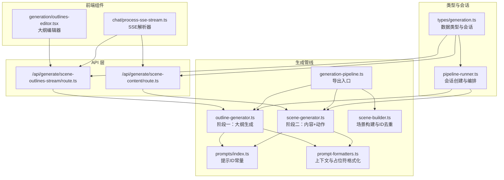
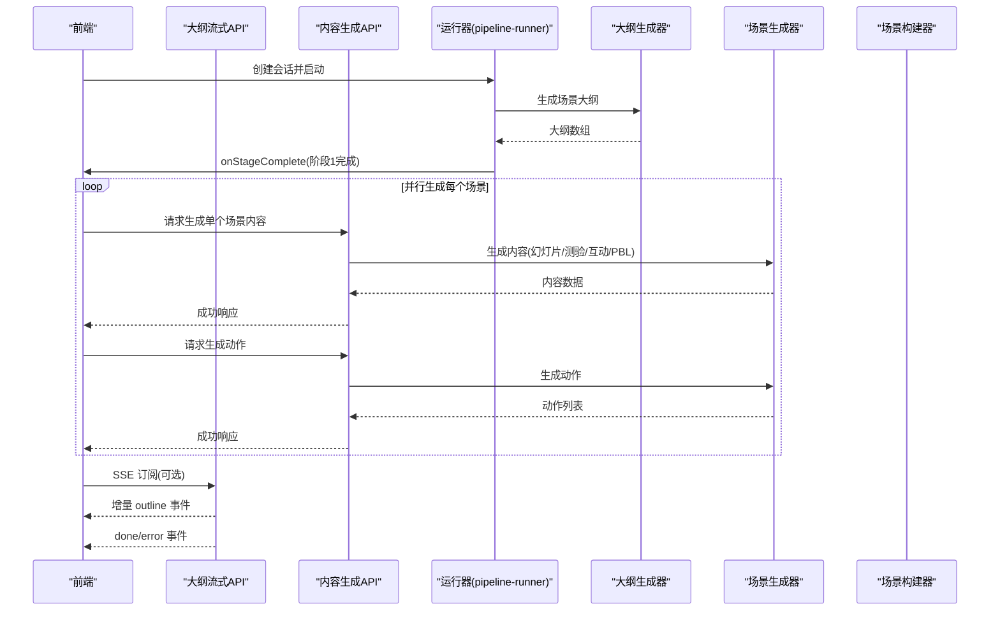
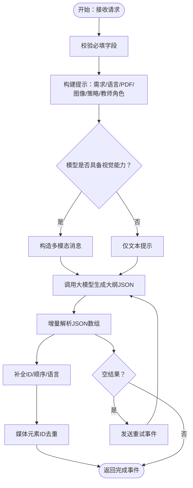
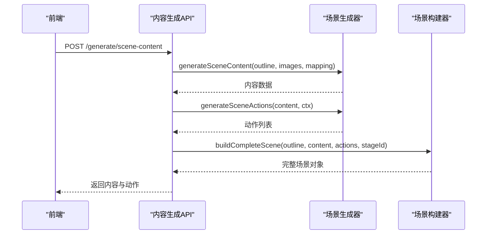
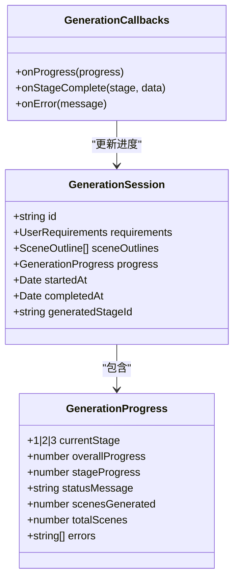
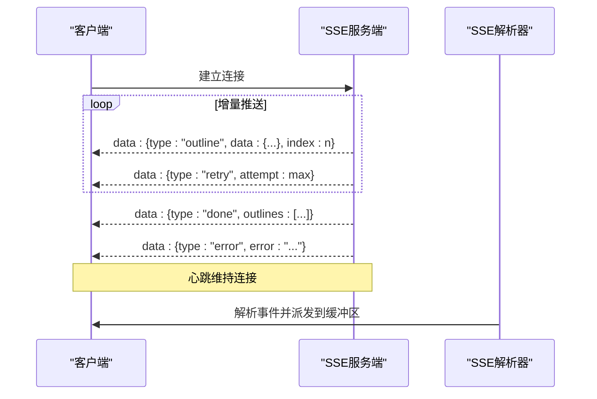
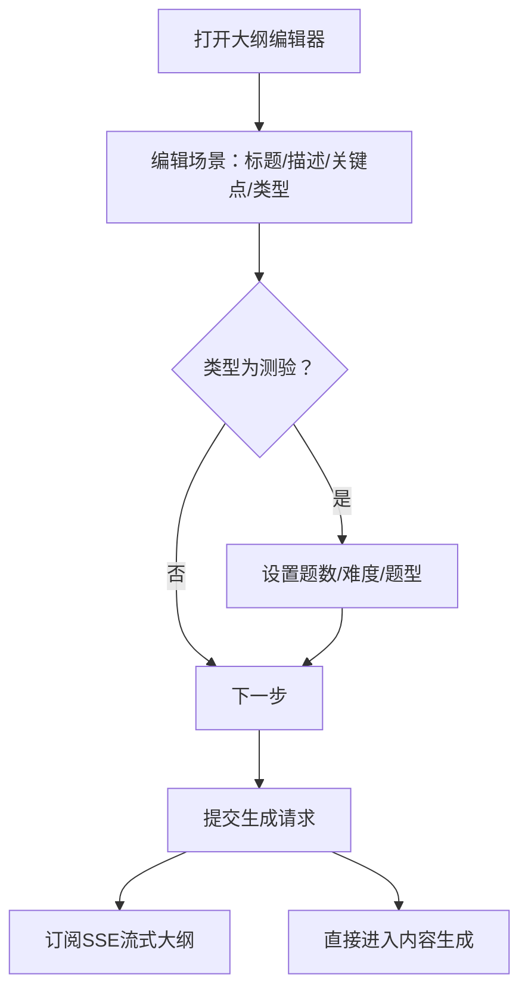
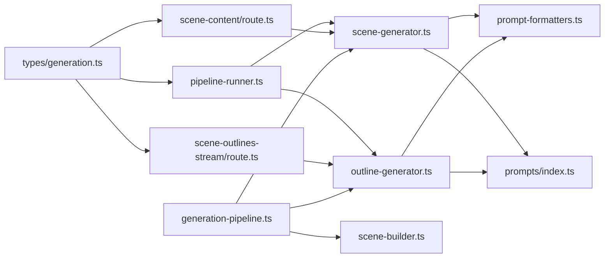

# 两阶段生成流程

<cite>
**本文引用的文件**
- [app/api/generate/scene-outlines-stream/route.ts](file://app/api/generate/scene-outlines-stream/route.ts)
- [app/api/generate/scene-content/route.ts](file://app/api/generate/scene-content/route.ts)
- [lib/generation/prompts/index.ts](file://lib/generation/prompts/index.ts)
- [lib/generation/generation-pipeline.ts](file://lib/generation/generation-pipeline.ts)
- [lib/types/generation.ts](file://lib/types/generation.ts)
- [lib/generation/outline-generator.ts](file://lib/generation/outline-generator.ts)
- [lib/generation/scene-generator.ts](file://lib/generation/scene-generator.ts)
- [lib/generation/scene-builder.ts](file://lib/generation/scene-builder.ts)
- [lib/generation/pipeline-runner.ts](file://lib/generation/pipeline-runner.ts)
- [lib/generation/prompt-formatters.ts](file://lib/generation/prompt-formatters.ts)
- [components/generation/outlines-editor.tsx](file://components/generation/outlines-editor.tsx)
- [components/chat/process-sse-stream.ts](file://components/chat/process-sse-stream.ts)
</cite>

## 目录
1. [简介](#简介)
2. [项目结构](#项目结构)
3. [核心组件](#核心组件)
4. [架构总览](#架构总览)
5. [详细组件分析](#详细组件分析)
6. [依赖关系分析](#依赖关系分析)
7. [性能考虑](#性能考虑)
8. [故障排查指南](#故障排查指南)
9. [结论](#结论)
10. [附录：API 接口说明](#附录api-接口说明)

## 简介
本技术文档系统性阐述 OpenMAIC 的“两阶段生成流程”，覆盖从用户需求到完整场景（含动作）的端到端生成管线。整体设计采用“大纲先行、内容填充、动作生成”的分层架构，结合流式输出与回调机制，确保前端可逐步渲染、可观测进度并具备良好的容错与恢复能力。

- 阶段一：场景大纲生成（Outlines），产出结构化的场景清单（类型、标题、描述、关键点、媒体请求等）
- 阶段二：完整场景生成（Content + Actions），按大纲生成页面内容与交互动作，最终构建可执行的课堂场景

该流程同时支持：
- 会话管理：创建、状态跟踪、进度上报
- 回调机制：进度通知、阶段完成、错误处理
- 流式传输：SSE 增量事件，支持心跳与重试
- 多模态输入：文本与图像（视觉模型）混合提示
- 质量保障：JSON 修复、占位符替换、默认值补全、LaTeX 渲染

## 项目结构
围绕两阶段生成的核心目录与文件如下：
- API 层：提供大纲流式接口与内容生成接口
- 生成管线：大纲生成器、场景生成器、场景构建器、提示模板与格式化工具
- 类型定义：统一的生成数据结构与会话状态
- 前端组件：大纲编辑器、SSE 解析器

**图表来源**
- [app/api/generate/scene-outlines-stream/route.ts:1-362](file://app/api/generate/scene-outlines-stream/route.ts#L1-L362)
- [app/api/generate/scene-content/route.ts:1-168](file://app/api/generate/scene-content/route.ts#L1-L168)
- [lib/generation/generation-pipeline.ts:1-51](file://lib/generation/generation-pipeline.ts#L1-L51)
- [lib/generation/outline-generator.ts:1-182](file://lib/generation/outline-generator.ts#L1-L182)
- [lib/generation/scene-generator.ts:1-800](file://lib/generation/scene-generator.ts#L1-L800)
- [lib/generation/scene-builder.ts:1-224](file://lib/generation/scene-builder.ts#L1-L224)
- [lib/generation/prompts/index.ts:1-34](file://lib/generation/prompts/index.ts#L1-L34)
- [lib/generation/prompt-formatters.ts:1-142](file://lib/generation/prompt-formatters.ts#L1-L142)
- [lib/types/generation.ts:1-229](file://lib/types/generation.ts#L1-L229)
- [lib/generation/pipeline-runner.ts:1-92](file://lib/generation/pipeline-runner.ts#L1-L92)
- [components/generation/outlines-editor.tsx:1-291](file://components/generation/outlines-editor.tsx#L1-L291)
- [components/chat/process-sse-stream.ts:1-123](file://components/chat/process-sse-stream.ts#L1-L123)

**章节来源**
- [lib/types/generation.ts:1-229](file://lib/types/generation.ts#L1-L229)
- [lib/generation/generation-pipeline.ts:1-51](file://lib/generation/generation-pipeline.ts#L1-L51)

## 核心组件
- 两阶段生成管线导出入口：集中暴露大纲生成、场景生成、场景构建、提示系统与运行器
- 大纲生成器：基于用户需求与可选 PDF 文本/图像，生成结构化场景大纲；支持媒体生成策略注入与占位符去重
- 场景生成器：按大纲生成页面内容（幻灯片/测验/互动/PBL），并生成对应动作列表
- 场景构建器：在不依赖存储的情况下构建完整场景对象，负责媒体元素ID全局唯一化
- 提示系统与格式化：统一管理提示ID、变量插值与上下文拼装（教师角色、图像占位、多模态内容）
- 会话与运行器：创建生成会话、驱动两阶段流程、回调进度与错误
- API 接口：大纲流式接口（SSE）、内容生成接口（一次性响应）

**章节来源**
- [lib/generation/generation-pipeline.ts:1-51](file://lib/generation/generation-pipeline.ts#L1-L51)
- [lib/generation/outline-generator.ts:1-182](file://lib/generation/outline-generator.ts#L1-L182)
- [lib/generation/scene-generator.ts:1-800](file://lib/generation/scene-generator.ts#L1-L800)
- [lib/generation/scene-builder.ts:1-224](file://lib/generation/scene-builder.ts#L1-L224)
- [lib/generation/prompts/index.ts:1-34](file://lib/generation/prompts/index.ts#L1-L34)
- [lib/generation/prompt-formatters.ts:1-142](file://lib/generation/prompt-formatters.ts#L1-L142)
- [lib/generation/pipeline-runner.ts:1-92](file://lib/generation/pipeline-runner.ts#L1-L92)

## 架构总览
两阶段生成以“会话”为单位贯穿始终，通过回调与 SSE 实现前后端协同与可观测性。

**图表来源**
- [lib/generation/pipeline-runner.ts:30-92](file://lib/generation/pipeline-runner.ts#L30-L92)
- [lib/generation/outline-generator.ts:26-157](file://lib/generation/outline-generator.ts#L26-L157)
- [lib/generation/scene-generator.ts:61-144](file://lib/generation/scene-generator.ts#L61-L144)
- [app/api/generate/scene-outlines-stream/route.ts:99-362](file://app/api/generate/scene-outlines-stream/route.ts#L99-L362)
- [app/api/generate/scene-content/route.ts:26-168](file://app/api/generate/scene-content/route.ts#L26-L168)

## 详细组件分析

### 阶段一：场景大纲生成（Outlines）
- 输入：用户需求（自由文本+语言）、PDF 文本、PDF 图像、图像映射、研究背景、教师代理信息
- 输出：结构化场景大纲数组（含类型、标题、描述、关键点、建议图像ID、媒体生成请求、测验/互动/PBL配置）
- 关键机制：
  - 提示构建：基于简化变量（需求、语言、PDF内容、可用图像、媒体策略、教师角色）
  - 视觉能力检测：根据模型能力决定是否使用多模态输入
  - 媒体生成策略：通过头部开关控制是否允许生成图片/视频，避免不必要请求
  - 占位符去重：将顺序生成的 gen_img_N/gen_vid_N 替换为全局唯一ID，避免跨课程冲突
  - 流式增量解析：SSE 模式下逐条推送 outline，客户端增量渲染

**图表来源**
- [app/api/generate/scene-outlines-stream/route.ts:175-325](file://app/api/generate/scene-outlines-stream/route.ts#L175-L325)
- [lib/generation/outline-generator.ts:96-157](file://lib/generation/outline-generator.ts#L96-L157)
- [lib/generation/scene-builder.ts:34-61](file://lib/generation/scene-builder.ts#L34-L61)

**章节来源**
- [app/api/generate/scene-outlines-stream/route.ts:99-362](file://app/api/generate/scene-outlines-stream/route.ts#L99-L362)
- [lib/generation/outline-generator.ts:26-157](file://lib/generation/outline-generator.ts#L26-L157)
- [lib/generation/scene-builder.ts:34-61](file://lib/generation/scene-builder.ts#L34-L61)

### 阶段二：完整场景生成（Content + Actions）
- 输入：单个大纲、所有大纲、PDF 图像、图像映射、阶段信息、阶段ID、教师代理
- 输出：页面内容（幻灯片/测验/互动/PBL）与动作列表，最终构建完整场景对象
- 关键机制：
  - 类型回退：若大纲声明为互动但缺少配置，或PBL缺少语言模型，则回退为幻灯片
  - 内容生成：按类型分别生成内容（幻灯片元素、测验题目、互动HTML、PBL项目）
  - 动作生成：基于内容与上下文生成教学动作（如讲解、提问、过渡等）
  - 元素修复与渲染：默认值补全、LaTeX 渲染、图像ID解析（PDF图像与AI生成媒体）
  - 并行生成：多个场景可并行生成，实时更新进度

**图表来源**
- [app/api/generate/scene-content/route.ts:114-148](file://app/api/generate/scene-content/route.ts#L114-L148)
- [lib/generation/scene-generator.ts:149-202](file://lib/generation/scene-generator.ts#L149-L202)
- [lib/generation/scene-builder.ts:122-224](file://lib/generation/scene-builder.ts#L122-L224)

**章节来源**
- [app/api/generate/scene-content/route.ts:26-168](file://app/api/generate/scene-content/route.ts#L26-L168)
- [lib/generation/scene-generator.ts:149-202](file://lib/generation/scene-generator.ts#L149-L202)
- [lib/generation/scene-builder.ts:122-224](file://lib/generation/scene-builder.ts#L122-L224)

### 会话管理与进度报告
- 会话创建：包含ID、需求、进度、时间戳
- 进度结构：当前阶段、总体进度、阶段进度、状态消息、已生成/总数场景、错误列表
- 回调接口：onProgress、onStageComplete、onError
- 运行器：驱动两阶段流程，按阶段推进进度并触发回调

**图表来源**
- [lib/types/generation.ts:210-229](file://lib/types/generation.ts#L210-L229)
- [lib/generation/pipeline-runner.ts:13-27](file://lib/generation/pipeline-runner.ts#L13-L27)
- [lib/generation/pipeline-runner.ts:30-92](file://lib/generation/pipeline-runner.ts#L30-L92)

**章节来源**
- [lib/types/generation.ts:210-229](file://lib/types/generation.ts#L210-L229)
- [lib/generation/pipeline-runner.ts:13-27](file://lib/generation/pipeline-runner.ts#L13-L27)
- [lib/generation/pipeline-runner.ts:30-92](file://lib/generation/pipeline-runner.ts#L30-L92)

### 回调机制与错误处理
- SSE 流式接口：
  - 增量事件：type='outline'，携带单个大纲对象与索引
  - 结束事件：type='done'，携带全部大纲
  - 错误事件：type='error'，携带错误信息
  - 心跳事件：保持连接活跃
  - 重试事件：type='retry'，通知客户端即将重试
- 内容生成接口：
  - 成功：返回内容与有效大纲
  - 失败：返回错误码与消息
- 运行器与生成器：
  - onProgress/onStageComplete/onError 回调
  - 失败时记录错误并终止流程

**图表来源**
- [app/api/generate/scene-outlines-stream/route.ts:197-356](file://app/api/generate/scene-outlines-stream/route.ts#L197-L356)
- [components/chat/process-sse-stream.ts:12-123](file://components/chat/process-sse-stream.ts#L12-L123)

**章节来源**
- [app/api/generate/scene-outlines-stream/route.ts:197-356](file://app/api/generate/scene-outlines-stream/route.ts#L197-L356)
- [components/chat/process-sse-stream.ts:12-123](file://components/chat/process-sse-stream.ts#L12-L123)

### 前端交互与编辑器
- 大纲编辑器：支持增删改、拖拽排序、测验配置（题数、难度、题型）
- 与后端协作：提交需求后订阅大纲流，或直接进入内容生成阶段

**图表来源**
- [components/generation/outlines-editor.tsx:19-291](file://components/generation/outlines-editor.tsx#L19-L291)

**章节来源**
- [components/generation/outlines-editor.tsx:19-291](file://components/generation/outlines-editor.tsx#L19-L291)

## 依赖关系分析
- 导出入口聚合：generation-pipeline.ts 将提示系统、大纲生成、场景生成、场景构建、运行器集中导出
- 提示系统：prompts/index.ts 提供提示ID常量，便于统一管理
- 上下文格式化：prompt-formatters.ts 提供教师角色、图像占位、多模态内容拼装
- 数据类型：types/generation.ts 统一定义用户需求、大纲、内容、会话等结构
- API 与运行器：route.ts 与 pipeline-runner.ts 分别承担接口与编排职责

**图表来源**
- [lib/generation/generation-pipeline.ts:1-51](file://lib/generation/generation-pipeline.ts#L1-L51)
- [lib/generation/outline-generator.ts:1-182](file://lib/generation/outline-generator.ts#L1-L182)
- [lib/generation/scene-generator.ts:1-800](file://lib/generation/scene-generator.ts#L1-L800)
- [lib/generation/scene-builder.ts:1-224](file://lib/generation/scene-builder.ts#L1-L224)
- [lib/generation/prompts/index.ts:1-34](file://lib/generation/prompts/index.ts#L1-L34)
- [lib/generation/prompt-formatters.ts:1-142](file://lib/generation/prompt-formatters.ts#L1-L142)
- [app/api/generate/scene-outlines-stream/route.ts:1-362](file://app/api/generate/scene-outlines-stream/route.ts#L1-L362)
- [app/api/generate/scene-content/route.ts:1-168](file://app/api/generate/scene-content/route.ts#L1-L168)
- [lib/types/generation.ts:1-229](file://lib/types/generation.ts#L1-L229)
- [lib/generation/pipeline-runner.ts:1-92](file://lib/generation/pipeline-runner.ts#L1-L92)

**章节来源**
- [lib/generation/generation-pipeline.ts:1-51](file://lib/generation/generation-pipeline.ts#L1-L51)
- [lib/types/generation.ts:1-229](file://lib/types/generation.ts#L1-L229)

## 性能考虑
- 并行生成：阶段二对多个场景并行处理，显著缩短总耗时
- 流式增量：SSE 增量推送减少首屏等待，提升感知性能
- 心跳与重试：防止连接中断，提高稳定性
- 图像处理优化：仅在需要时启用视觉模式，限制图像数量，避免超长提示
- 默认值与修复：在生成后进行元素默认值补全与LaTeX渲染，降低前端复杂度

[本节为通用指导，无需特定文件引用]

## 故障排查指南
- SSE 连接断开或无事件
  - 检查服务端心跳与重试逻辑
  - 确认客户端 SSE 解析器正确处理事件与错误
- 大纲为空或解析失败
  - 检查提示构建与媒体策略
  - 观察重试事件，必要时调整模型或输入
- 内容生成失败
  - 查看 onStageComplete 与 onError 回调中的错误信息
  - 确认图像映射与生成媒体映射是否正确传递
- 图像显示异常
  - 检查 resolveImageIds 是否正确将 img_id 映射为 base64 URL
  - 确认 assignedImages 与 imageMapping 的一致性

**章节来源**
- [app/api/generate/scene-outlines-stream/route.ts:286-336](file://app/api/generate/scene-outlines-stream/route.ts#L286-L336)
- [lib/generation/scene-generator.ts:245-301](file://lib/generation/scene-generator.ts#L245-L301)
- [components/chat/process-sse-stream.ts:12-123](file://components/chat/process-sse-stream.ts#L12-L123)

## 结论
两阶段生成流程通过“大纲先行、内容填充、动作生成”的分层设计，结合流式传输与回调机制，实现了高效、可观测且可扩展的课堂内容生成体系。其关键优势在于：
- 明确的阶段边界与可插拔的生成器
- 统一的提示系统与上下文格式化
- 可靠的错误恢复与进度反馈
- 前后端协同的增量渲染体验

[本节为总结，无需特定文件引用]

## 附录：API 接口说明

### 大纲流式接口（SSE）
- 方法与路径：POST /api/generate/scene-outlines-stream
- 请求头
  - x-image-generation-enabled: true/false
  - x-video-generation-enabled: true/false
- 请求体
  - requirements: 用户需求（自由文本+语言）
  - pdfText: PDF 文本摘要（可选）
  - pdfImages: PDF 图像数组（可选）
  - imageMapping: 图像ID到URL映射（可选）
  - researchContext: 研究背景（可选）
  - agents: 教师代理信息（可选）
- 响应
  - SSE 事件：
    - outline: { type: 'outline', data: 场景大纲, index: 序号 }
    - retry: { type: 'retry', attempt: 当前尝试次数, maxAttempts: 最大尝试次数 }
    - done: { type: 'done', outlines: 场景大纲数组 }
    - error: { type: 'error', error: 错误信息 }
  - 心跳：每15秒发送一次注释以保持连接
- 错误码
  - MISSING_REQUIRED_FIELD: 缺少必填字段
  - INTERNAL_ERROR: 内部错误

**章节来源**
- [app/api/generate/scene-outlines-stream/route.ts:99-362](file://app/api/generate/scene-outlines-stream/route.ts#L99-L362)

### 内容生成接口
- 方法与路径：POST /api/generate/scene-content
- 请求体
  - outline: 单个场景大纲
  - allOutlines: 所有场景大纲
  - pdfImages: PDF 图像数组（可选）
  - imageMapping: 图像ID到URL映射（可选）
  - stageInfo: 阶段信息（名称、描述、语言、风格）
  - stageId: 阶段ID
  - agents: 教师代理信息（可选）
- 响应
  - 成功：{ success: true, data: { content, effectiveOutline } }
  - 失败：{ success: false, error: 错误信息 }
- 错误码
  - MISSING_REQUIRED_FIELD: 缺少必填字段
  - GENERATION_FAILED: 生成失败
  - INTERNAL_ERROR: 内部错误

**章节来源**
- [app/api/generate/scene-content/route.ts:26-168](file://app/api/generate/scene-content/route.ts#L26-L168)

### 会话与进度
- 会话对象
  - id: 会话ID
  - requirements: 用户需求
  - sceneOutlines: 场景大纲（阶段1完成后存在）
  - progress: 进度对象（包含阶段、百分比、状态消息、场景计数、错误列表）
  - startedAt/completedAt: 时间戳
  - generatedStageId: 生成阶段ID（可选）
- 进度对象
  - currentStage: 1|2|3
  - overallProgress: 0-100
  - stageProgress: 0-100
  - statusMessage: 当前状态
  - scenesGenerated/totalScenes: 已生成/总数
  - errors: 错误列表

**章节来源**
- [lib/types/generation.ts:210-229](file://lib/types/generation.ts#L210-L229)
- [lib/generation/pipeline-runner.ts:13-27](file://lib/generation/pipeline-runner.ts#L13-L27)