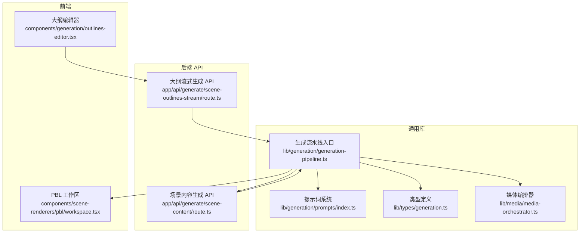
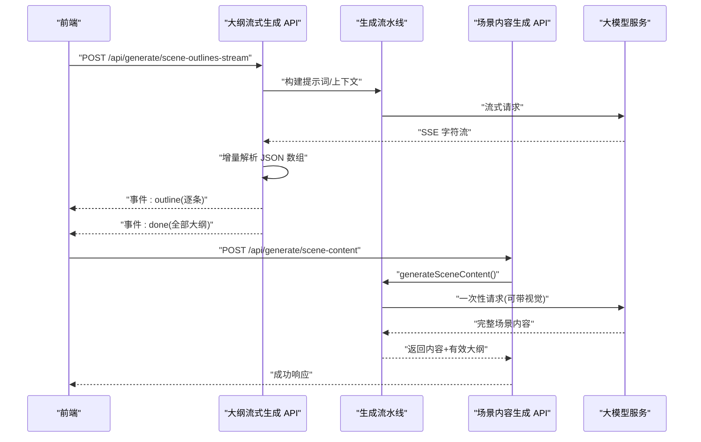
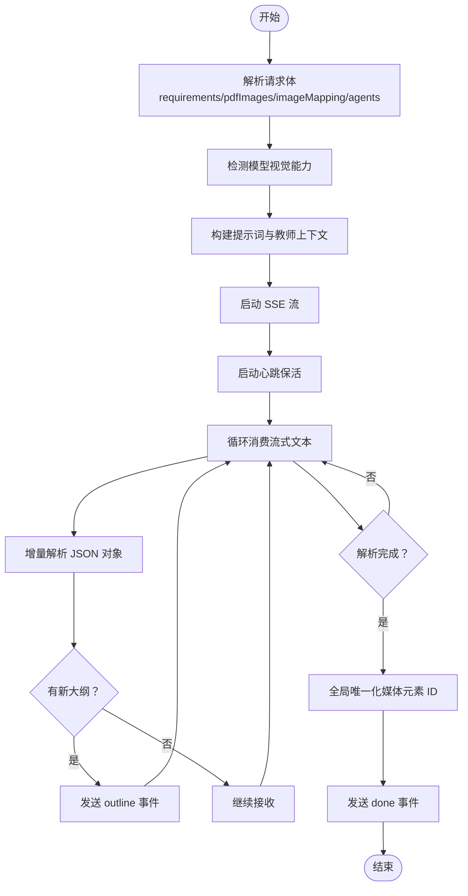
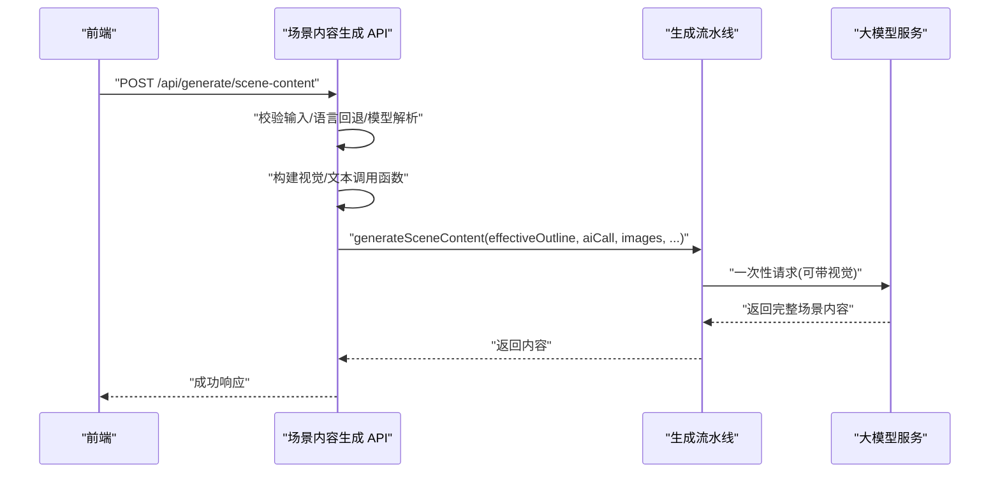
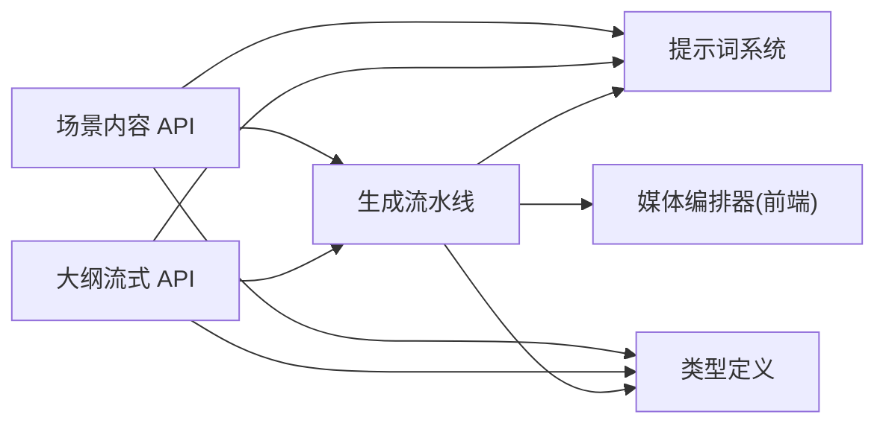

# 场景内容生成

<cite>
**本文引用的文件**
- [app/api/generate/scene-content/route.ts](file://app/api/generate/scene-content/route.ts)
- [app/api/generate/scene-outlines-stream/route.ts](file://app/api/generate/scene-outlines-stream/route.ts)
- [lib/generation/generation-pipeline.ts](file://lib/generation/generation-pipeline.ts)
- [lib/generation/prompts/index.ts](file://lib/generation/prompts/index.ts)
- [lib/types/generation.ts](file://lib/types/generation.ts)
- [lib/media/media-orchestrator.ts](file://lib/media/media-orchestrator.ts)
- [components/generation/outlines-editor.tsx](file://components/generation/outlines-editor.tsx)
- [components/scene-renderers/pbl/workspace.tsx](file://components/scene-renderers/pbl/workspace.tsx)
</cite>

## 目录
1. [引言](#引言)
2. [项目结构](#项目结构)
3. [核心组件](#核心组件)
4. [架构总览](#架构总览)
5. [详细组件分析](#详细组件分析)
6. [依赖关系分析](#依赖关系分析)
7. [性能考虑](#性能考虑)
8. [故障排查指南](#故障排查指南)
9. [结论](#结论)
10. [附录](#附录)

## 引言
本技术文档围绕“场景内容生成”主题，系统阐述从“用户需求与文档”到“场景大纲”，再到“完整场景”的两阶段生成流水线。重点覆盖以下方面：
- 大纲到场景的转换机制与数据流
- 场景内容填充算法：文本生成、多媒体元素插入与布局设计
- 场景元素组合策略：文字、图片、音频、视频与交互元素的协调
- 质量控制机制：内容一致性、格式标准化与用户体验优化
- 批量场景生成的并发处理策略与资源管理
- 场景模板系统的设计与可定制性
- 性能优化技巧、内存管理与错误处理策略

## 项目结构
场景生成相关的关键模块分布于后端 API、前端组件与通用库之间，形成清晰的分层：
- 后端 API：负责大纲生成（SSE 流式输出）与内容生成（一次性响应）
- 前端组件：大纲编辑器、PBL 工作区渲染器
- 通用库：生成流水线、提示词系统、类型定义、媒体编排器

图表来源
- [app/api/generate/scene-outlines-stream/route.ts:1-362](file://app/api/generate/scene-outlines-stream/route.ts#L1-L362)
- [app/api/generate/scene-content/route.ts:1-168](file://app/api/generate/scene-content/route.ts#L1-L168)
- [lib/generation/generation-pipeline.ts:1-51](file://lib/generation/generation-pipeline.ts#L1-L51)
- [lib/generation/prompts/index.ts:1-34](file://lib/generation/prompts/index.ts#L1-L34)
- [lib/types/generation.ts:1-229](file://lib/types/generation.ts#L1-L229)
- [lib/media/media-orchestrator.ts:1-287](file://lib/media/media-orchestrator.ts#L1-L287)
- [components/generation/outlines-editor.tsx:1-291](file://components/generation/outlines-editor.tsx#L1-L291)
- [components/scene-renderers/pbl/workspace.tsx:1-93](file://components/scene-renderers/pbl/workspace.tsx#L1-L93)

章节来源
- [app/api/generate/scene-outlines-stream/route.ts:1-362](file://app/api/generate/scene-outlines-stream/route.ts#L1-L362)
- [app/api/generate/scene-content/route.ts:1-168](file://app/api/generate/scene-content/route.ts#L1-L168)
- [lib/generation/generation-pipeline.ts:1-51](file://lib/generation/generation-pipeline.ts#L1-L51)
- [lib/generation/prompts/index.ts:1-34](file://lib/generation/prompts/index.ts#L1-L34)
- [lib/types/generation.ts:1-229](file://lib/types/generation.ts#L1-L229)
- [lib/media/media-orchestrator.ts:1-287](file://lib/media/media-orchestrator.ts#L1-L287)
- [components/generation/outlines-editor.tsx:1-291](file://components/generation/outlines-editor.tsx#L1-L291)
- [components/scene-renderers/pbl/workspace.tsx:1-93](file://components/scene-renderers/pbl/workspace.tsx#L1-L93)

## 核心组件
- 大纲流式生成 API：通过 SSE 将逐条解析出的大纲对象增量返回给前端，支持心跳保活与重试策略。
- 场景内容生成 API：接收单个大纲，结合视觉能力与图像映射，调用大模型生成完整场景内容。
- 生成流水线：统一导出大纲生成、场景生成、动作生成、场景构建与会话运行器等能力。
- 提示词系统：集中管理提示词模板与片段拼装，支持变量插值与缓存清理。
- 类型定义：涵盖 PDF 图像、用户需求、场景大纲、生成结果、PBL 与交互内容等类型。
- 媒体编排器：在前端并行调度图像/视频生成任务，持久化到 IndexedDB 并更新状态。

章节来源
- [app/api/generate/scene-outlines-stream/route.ts:99-361](file://app/api/generate/scene-outlines-stream/route.ts#L99-L361)
- [app/api/generate/scene-content/route.ts:26-167](file://app/api/generate/scene-content/route.ts#L26-L167)
- [lib/generation/generation-pipeline.ts:8-51](file://lib/generation/generation-pipeline.ts#L8-L51)
- [lib/generation/prompts/index.ts:10-34](file://lib/generation/prompts/index.ts#L10-L34)
- [lib/types/generation.ts:11-229](file://lib/types/generation.ts#L11-L229)
- [lib/media/media-orchestrator.ts:31-287](file://lib/media/media-orchestrator.ts#L31-L287)

## 架构总览
两阶段生成流程：
- 阶段一：需求与文档 → 场景大纲（SSE 流式输出，逐步解析 JSON 数组）
- 阶段二：场景大纲 → 完整场景（一次性内容生成，支持视觉模式与媒体占位符）

图表来源
- [app/api/generate/scene-outlines-stream/route.ts:197-356](file://app/api/generate/scene-outlines-stream/route.ts#L197-L356)
- [app/api/generate/scene-content/route.ts:134-148](file://app/api/generate/scene-content/route.ts#L134-L148)
- [lib/generation/generation-pipeline.ts:35-47](file://lib/generation/generation-pipeline.ts#L35-L47)

## 详细组件分析

### 组件A：大纲流式生成（SSE）
- 功能要点
  - 增量 JSON 解析：从部分流式文本中提取完整的顶层对象数组，避免等待整段完成。
  - 心跳保活：定期发送注释以维持长连接，防止超时。
  - 重试策略：最多尝试指定次数，失败时通知客户端重试。
  - 视觉模式：当具备视觉能力且存在图像映射时，将前 N 张图作为视觉输入，其余仅文本描述。
  - 媒体生成策略：根据请求头禁用图像或视频生成，确保大纲不包含被禁用类型的媒体生成请求。
- 关键流程

图表来源
- [app/api/generate/scene-outlines-stream/route.ts:45-97](file://app/api/generate/scene-outlines-stream/route.ts#L45-L97)
- [app/api/generate/scene-outlines-stream/route.ts:197-356](file://app/api/generate/scene-outlines-stream/route.ts#L197-L356)

章节来源
- [app/api/generate/scene-outlines-stream/route.ts:99-361](file://app/api/generate/scene-outlines-stream/route.ts#L99-L361)

### 组件B：场景内容生成（一次性）
- 功能要点
  - 输入校验：要求提供大纲、所有大纲、舞台信息与舞台 ID；语言优先级为大纲→舞台→默认。
  - 模型解析：从请求头解析语言模型及其能力（如视觉）。
  - 视觉适配：若具备视觉能力，则将 PDF 图像与用户提示合并为多模态消息；否则按纯文本处理。
  - 图像分配：仅使用当前大纲建议的图像 ID 对应的 PDF 图像。
  - 占位符保留：媒体生成由前端编排器处理，此处保留占位符 ID，后续统一替换。
  - 结果返回：成功时返回内容与有效大纲。
- 关键流程

图表来源
- [app/api/generate/scene-content/route.ts:26-167](file://app/api/generate/scene-content/route.ts#L26-L167)
- [lib/generation/generation-pipeline.ts:35-47](file://lib/generation/generation-pipeline.ts#L35-L47)

章节来源
- [app/api/generate/scene-content/route.ts:26-167](file://app/api/generate/scene-content/route.ts#L26-L167)

### 组件C：生成流水线与类型系统
- 生成流水线导出
  - 提示词格式化器：构建课程上下文、教师角色、图像描述/占位符、视觉消息内容。
  - 大纲生成器：从需求生成大纲并应用回退策略。
  - 场景生成器：生成完整场景、场景内容与场景动作。
  - 场景构建器：从大纲构建完整场景，统一媒体元素 ID。
  - 会话运行器：创建生成会话并驱动流水线。
- 类型系统
  - PDF 图像与映射、用户需求、场景大纲、生成结果（幻灯片/测验/PBL/交互）、PBL 与交互内容类型等。

章节来源
- [lib/generation/generation-pipeline.ts:8-51](file://lib/generation/generation-pipeline.ts#L8-L51)
- [lib/types/generation.ts:11-229](file://lib/types/generation.ts#L11-L229)

### 组件D：提示词系统
- 特点
  - 文件化存储模板，支持片段拼装与变量插值。
  - 统一的提示词 ID 常量集合，便于跨模块引用。
- 用途
  - 在大纲生成与场景内容生成阶段注入上下文、策略与约束。

章节来源
- [lib/generation/prompts/index.ts:1-34](file://lib/generation/prompts/index.ts#L1-L34)

### 组件E：媒体编排器（前端）
- 并发策略
  - 收集所有大纲中的媒体生成请求，按设置启用与否过滤。
  - 串行执行单个媒体生成，避免图像/视频接口的并发限制。
  - 并行推进与内容/动作生成，不阻塞主流程。
- 存储与恢复
  - 成功结果写入 IndexedDB，失败记录持久化以便刷新后重试。
  - 使用对象 URL 提供前端即时访问。
- 错误处理
  - 结构化错误码透传，区分可重试与不可重试失败。

章节来源
- [lib/media/media-orchestrator.ts:31-287](file://lib/media/media-orchestrator.ts#L31-L287)

### 组件F：大纲编辑器（前端）
- 能力
  - 添加、删除、上移/下移场景顺序，编辑标题、描述与关键要点。
  - 测验场景的配置面板（题数、难度、题型）。
  - 确认与返回操作，配合后端 API 进行两阶段生成。
- 用户体验
  - 实时校验与禁用状态，避免在生成过程中误操作。

章节来源
- [components/generation/outlines-editor.tsx:1-291](file://components/generation/outlines-editor.tsx#L1-L291)

### 组件G：PBL 工作区（前端）
- 能力
  - 左侧议题看板、右侧聊天面板，支持重启确认与引导面板。
  - 与 PBL 项目配置联动，驱动场景渲染与交互。
- 用户体验
  - 清晰的区域划分与操作反馈，降低协作学习的上手成本。

章节来源
- [components/scene-renderers/pbl/workspace.tsx:1-93](file://components/scene-renderers/pbl/workspace.tsx#L1-L93)

## 依赖关系分析
- 模块耦合
  - API 层仅负责参数解析、能力检测与调用流水线，职责单一。
  - 流水线模块聚合提示词、JSON 修复、大纲/场景/动作生成与构建器，内聚度高。
  - 前端组件通过 API 与流水线间接依赖类型与媒体编排器。
- 外部依赖
  - 大模型服务：通过统一的流式/一次性调用封装。
  - 媒体服务：图像/视频生成与代理接口。
  - 数据存储：IndexedDB 用于媒体持久化与失败记录。

图表来源
- [app/api/generate/scene-outlines-stream/route.ts:1-362](file://app/api/generate/scene-outlines-stream/route.ts#L1-L362)
- [app/api/generate/scene-content/route.ts:1-168](file://app/api/generate/scene-content/route.ts#L1-L168)
- [lib/generation/generation-pipeline.ts:1-51](file://lib/generation/generation-pipeline.ts#L1-L51)
- [lib/generation/prompts/index.ts:1-34](file://lib/generation/prompts/index.ts#L1-L34)
- [lib/types/generation.ts:1-229](file://lib/types/generation.ts#L1-L229)
- [lib/media/media-orchestrator.ts:1-287](file://lib/media/media-orchestrator.ts#L1-L287)

## 性能考虑
- 流式解析与增量输出
  - 大纲流式 API 采用增量 JSON 解析，减少等待时间，提升感知性能。
  - 心跳保活避免连接中断导致的重试开销。
- 视觉能力自适应
  - 仅在具备视觉能力时才上传图像，避免不必要的网络与计算开销。
- 媒体生成并行化
  - 内容/动作生成与媒体生成并行推进；媒体生成串行执行以遵守外部接口限制。
- 缓存与复用
  - 提示词加载器支持缓存清理，避免重复加载带来的额外开销。
- 内存管理
  - 媒体结果写入 IndexedDB，前端使用对象 URL，及时释放避免内存堆积。
- 资源配额与超时
  - API 设置最大持续时间，避免长时间占用资源；前端可取消生成任务。

## 故障排查指南
- 大纲流式解析失败
  - 现象：未收到任何 outline 事件或最终 error。
  - 排查：检查提示词构建是否正确、模型输出是否符合 JSON 数组格式；关注重试事件与日志。
- 媒体生成失败
  - 现象：任务标记失败，且持久化了错误码。
  - 排查：确认提供商配置、接口返回、网络代理；根据错误码判断是否可重试。
- 场景内容生成为空
  - 现象：返回空内容或内部错误。
  - 排查：检查输入参数完整性、模型能力与视觉模式匹配、图像映射有效性。
- 并发冲突
  - 现象：媒体生成卡顿或接口限流。
  - 排查：确认串行执行策略与设置开关；必要时调整外部接口并发限制。

章节来源
- [app/api/generate/scene-outlines-stream/route.ts:248-336](file://app/api/generate/scene-outlines-stream/route.ts#L248-L336)
- [lib/media/media-orchestrator.ts:155-183](file://lib/media/media-orchestrator.ts#L155-L183)
- [app/api/generate/scene-content/route.ts:150-158](file://app/api/generate/scene-content/route.ts#L150-L158)

## 结论
该场景生成系统通过“需求→大纲→完整场景”的两阶段设计，结合流式输出、视觉适配、媒体并行编排与统一类型体系，实现了高效、可控且可扩展的内容生成方案。前端组件与后端 API 的清晰边界，使得模板系统与质量控制机制易于演进与维护。

## 附录
- 场景模板系统设计
  - 基于提示词系统与类型定义，模板可按场景类型（幻灯片/测验/互动/PBL）拆分，支持片段拼装与变量插值。
  - 可扩展性：新增场景类型只需补充对应提示词 ID 与生成逻辑，保持对现有流程的兼容。
- 场景元素组合策略
  - 文字：由 LLM 生成，遵循大纲关键要点与风格偏好。
  - 图片/视频：由前端编排器并行生成，后端保留占位符 ID，最终统一替换。
  - 交互元素：基于科学模型与 HTML 模板生成，保证概念一致性与可操作性。
- 质量控制机制
  - 内容一致性：通过统一提示词与上下文构建，减少歧义。
  - 格式标准化：类型定义与 JSON 修复工具保障输出结构稳定。
  - 用户体验优化：增量大纲展示、测验配置可视化、PBL 工作区协作界面。