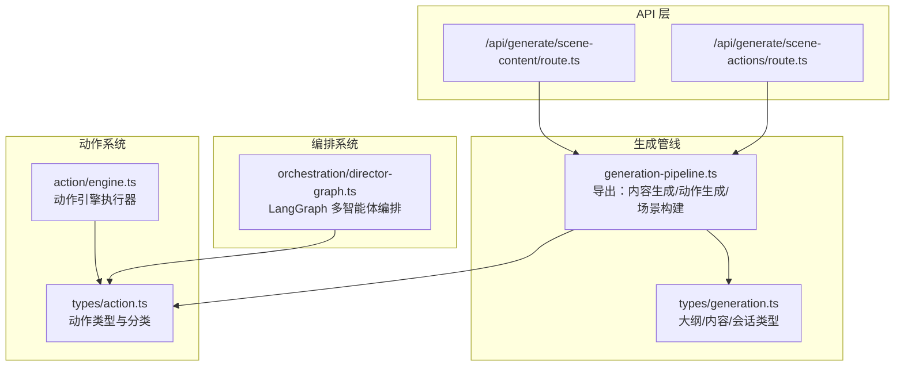
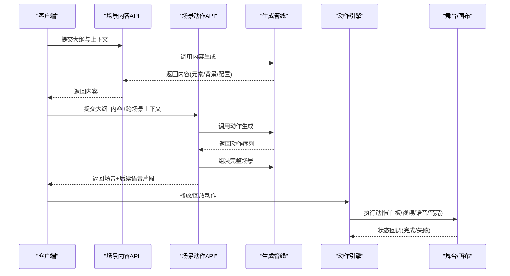
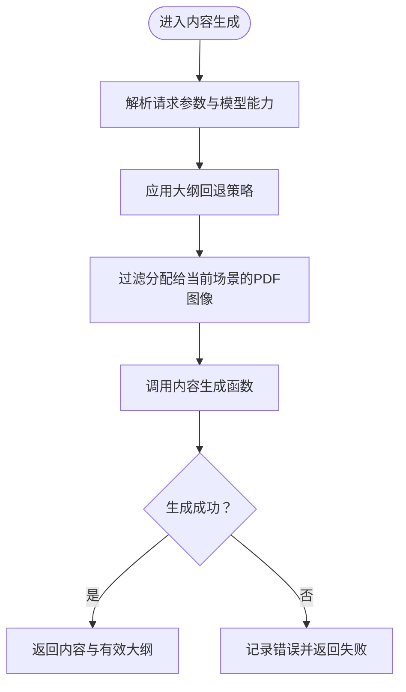
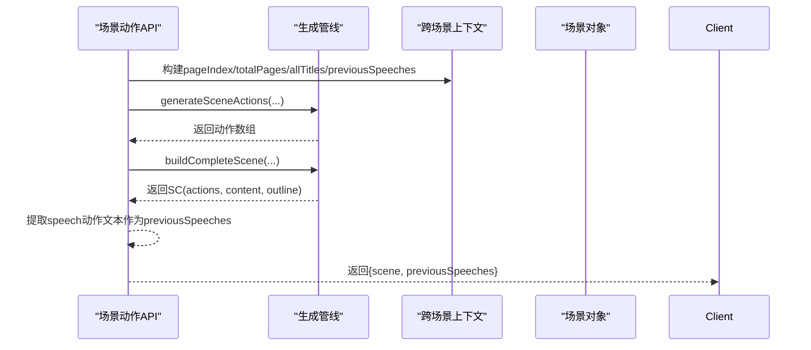
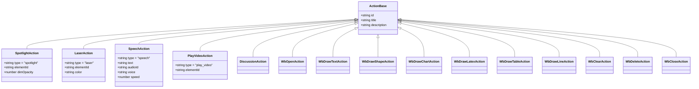
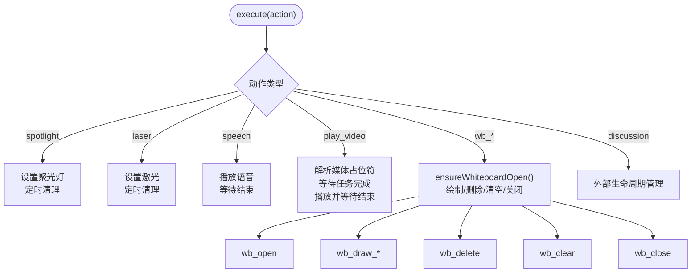
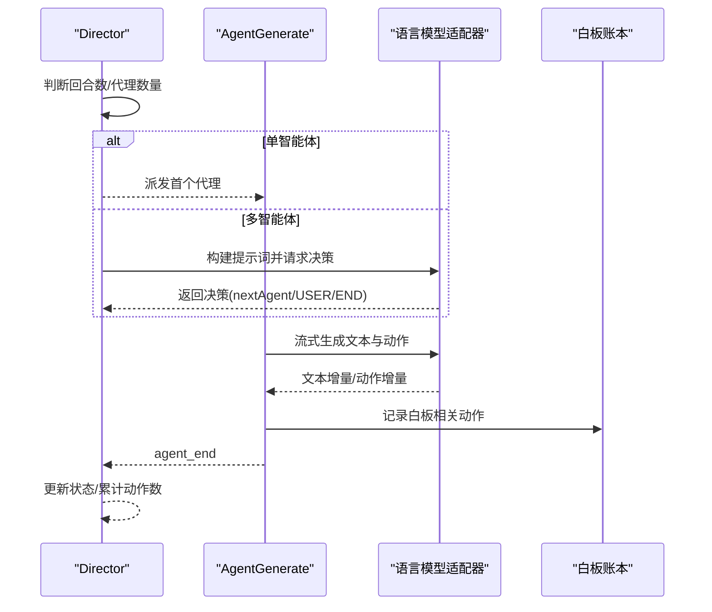
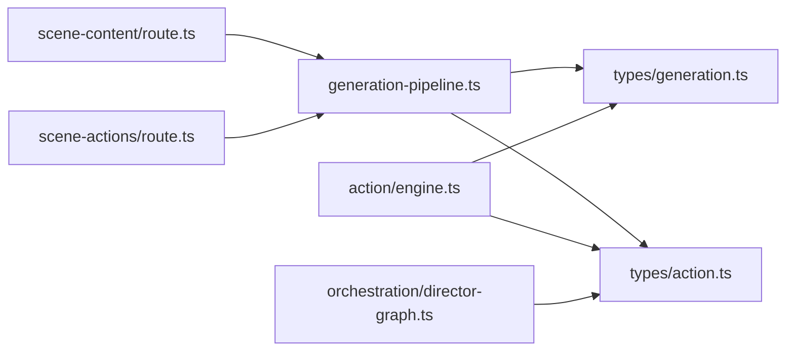
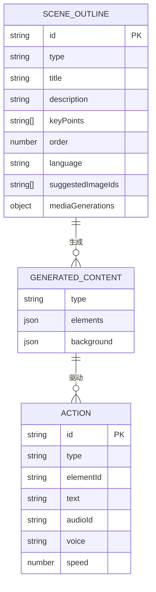

# 场景构建与动作生成

<cite>
**本文引用的文件**
- [app/api/generate/scene-content/route.ts](file://app/api/generate/scene-content/route.ts)
- [app/api/generate/scene-actions/route.ts](file://app/api/generate/scene-actions/route.ts)
- [lib/generation/generation-pipeline.ts](file://lib/generation/generation-pipeline.ts)
- [lib/types/action.ts](file://lib/types/action.ts)
- [lib/types/generation.ts](file://lib/types/generation.ts)
- [lib/action/engine.ts](file://lib/action/engine.ts)
- [lib/orchestration/director-graph.ts](file://lib/orchestration/director-graph.ts)
</cite>

## 目录
1. [引言](#引言)
2. [项目结构](#项目结构)
3. [核心组件](#核心组件)
4. [架构总览](#架构总览)
5. [详细组件分析](#详细组件分析)
6. [依赖分析](#依赖分析)
7. [性能考虑](#性能考虑)
8. [故障排查指南](#故障排查指南)
9. [结论](#结论)
10. [附录](#附录)

## 引言
本技术文档聚焦于“场景构建与动作生成”系统，涵盖两阶段生成流水线：先由大纲生成场景内容（幻灯片/测验/互动/PBL），再基于内容生成动作序列，并最终组装为完整的场景对象。文档深入解释场景构建的核心算法与数据结构设计，详述动作生成机制（含28种动作类型的定义、触发条件与执行逻辑），说明场景元素的动态构建过程（元素创建、属性设置与关系建立），并阐述动作序列的编排策略（时间轴管理、依赖关系处理与冲突解决）。此外，文档还覆盖场景验证与完整性检查机制、动作扩展接口设计、构建性能优化、内存使用控制以及调试工具的使用方法。

## 项目结构
该系统采用前后端分离的API层与前端渲染层协作模式：
- API层负责两阶段生成：内容生成与动作生成。
- 类型层统一定义动作与生成所需的数据结构。
- 执行层负责动作的实际执行与状态管理。
- 编排层通过图模型对多智能体进行编排，产出动作与文本流。

图表来源
- [app/api/generate/scene-content/route.ts:1-168](file://app/api/generate/scene-content/route.ts#L1-L168)
- [app/api/generate/scene-actions/route.ts:1-159](file://app/api/generate/scene-actions/route.ts#L1-L159)
- [lib/generation/generation-pipeline.ts:1-51](file://lib/generation/generation-pipeline.ts#L1-L51)
- [lib/types/generation.ts:1-229](file://lib/types/generation.ts#L1-L229)
- [lib/types/action.ts:1-221](file://lib/types/action.ts#L1-L221)
- [lib/action/engine.ts:1-519](file://lib/action/engine.ts#L1-L519)
- [lib/orchestration/director-graph.ts:1-550](file://lib/orchestration/director-graph.ts#L1-L550)

章节来源
- [app/api/generate/scene-content/route.ts:1-168](file://app/api/generate/scene-content/route.ts#L1-L168)
- [app/api/generate/scene-actions/route.ts:1-159](file://app/api/generate/scene-actions/route.ts#L1-L159)
- [lib/generation/generation-pipeline.ts:1-51](file://lib/generation/generation-pipeline.ts#L1-L51)
- [lib/types/generation.ts:1-229](file://lib/types/generation.ts#L1-L229)
- [lib/types/action.ts:1-221](file://lib/types/action.ts#L1-L221)
- [lib/action/engine.ts:1-519](file://lib/action/engine.ts#L1-L519)
- [lib/orchestration/director-graph.ts:1-550](file://lib/orchestration/director-graph.ts#L1-L550)

## 核心组件
- 两阶段生成管线
  - 内容生成：根据场景大纲生成具体元素与背景（幻灯片/测验/互动/PBL）。
  - 动作生成：在已有内容基础上生成动作序列，用于驱动播放与交互。
- 统一动作类型系统
  - 定义28种动作类型，分为“即时生效（fire-and-forget）”与“同步等待（synchronous）”两类。
- 动作执行引擎
  - 面向在线（流式）与离线（回放）路径的统一执行层，负责动作调度、媒体等待与白板绘制等。
- 多智能体编排
  - 基于LangGraph的状态图，实现单/多智能体的对话与动作决策，输出动作与文本事件流。

章节来源
- [lib/generation/generation-pipeline.ts:1-51](file://lib/generation/generation-pipeline.ts#L1-L51)
- [lib/types/action.ts:1-221](file://lib/types/action.ts#L1-L221)
- [lib/action/engine.ts:1-519](file://lib/action/engine.ts#L1-L519)
- [lib/orchestration/director-graph.ts:1-550](file://lib/orchestration/director-graph.ts#L1-L550)

## 架构总览
下图展示从API到动作执行的整体流程，包括两阶段生成与动作编排的关键节点。

图表来源
- [app/api/generate/scene-content/route.ts:26-162](file://app/api/generate/scene-content/route.ts#L26-L162)
- [app/api/generate/scene-actions/route.ts:34-153](file://app/api/generate/scene-actions/route.ts#L34-L153)
- [lib/generation/generation-pipeline.ts:34-47](file://lib/generation/generation-pipeline.ts#L34-L47)
- [lib/action/engine.ts:80-125](file://lib/action/engine.ts#L80-L125)

## 详细组件分析

### 场景内容生成（第一阶段）
- 输入：场景大纲、所有大纲列表、PDF图像映射、舞台信息、代理信息等。
- 关键流程：
  - 解析模型能力（是否具备视觉能力）。
  - 应用大纲回退策略以增强鲁棒性。
  - 过滤分配给当前场景的PDF图像。
  - 调用内容生成函数，返回元素与背景等结构化内容。
- 输出：内容对象与有效大纲（可能包含语言回退后的版本）。

图表来源
- [app/api/generate/scene-content/route.ts:26-162](file://app/api/generate/scene-content/route.ts#L26-L162)
- [lib/generation/generation-pipeline.ts:31-40](file://lib/generation/generation-pipeline.ts#L31-L40)

章节来源
- [app/api/generate/scene-content/route.ts:1-168](file://app/api/generate/scene-content/route.ts#L1-L168)
- [lib/generation/generation-pipeline.ts:1-51](file://lib/generation/generation-pipeline.ts#L1-L51)

### 场景动作生成（第二阶段）
- 输入：场景大纲、所有大纲、内容、舞台ID、代理信息、先前语音片段、用户画像等。
- 关键流程：
  - 构建跨场景上下文（页码、总页数、标题列表、先前语音）。
  - 调用动作生成函数，得到动作序列。
  - 组装完整场景（合并大纲、内容与动作）。
  - 提取语音动作作为后续场景的连贯输入。
- 输出：完整场景与新增语音片段列表。

图表来源
- [app/api/generate/scene-actions/route.ts:118-153](file://app/api/generate/scene-actions/route.ts#L118-L153)
- [lib/generation/generation-pipeline.ts:34-47](file://lib/generation/generation-pipeline.ts#L34-L47)

章节来源
- [app/api/generate/scene-actions/route.ts:1-159](file://app/api/generate/scene-actions/route.ts#L1-L159)
- [lib/generation/generation-pipeline.ts:1-51](file://lib/generation/generation-pipeline.ts#L1-L51)

### 动作类型系统与分类
- 动作基类：统一的标识与元信息字段。
- 即时生效动作（fire-and-forget）：spotlight、laser；执行后自动清理。
- 同步动作（synchronous）：speech、wb_open/wb_draw_*、wb_clear/delete/close、play_video、discussion；需等待完成后再继续。
- 白板专用动作：draw text/shape/chart/latex/table/line，delete/clear/close，open/close。
- 视频播放：play_video。
- 讨论：discussion。
- 辅助几何：百分比坐标系（0-100）用于响应式定位。

图表来源
- [lib/types/action.ts:12-221](file://lib/types/action.ts#L12-L221)

章节来源
- [lib/types/action.ts:1-221](file://lib/types/action.ts#L1-L221)

### 动作执行引擎（统一执行层）
- 执行模式：
  - 即时生效：spotlight、laser；执行后定时清理。
  - 同步等待：speech、play_video、wb_*系列、discussion。
- 关键机制：
  - 自动打开白板：当尝试绘制或清空而白板关闭时，自动打开。
  - 媒体占位符解析：将元素ID映射到媒体占位符ID，等待媒体任务完成后再播放视频。
  - 白板绘制：支持文本、形状、图表、公式、表格、线条等，带动画延迟。
  - 语音播放：通过音频播放器监听结束事件，保证顺序执行。
  - 效果清理：定时器自动清除spotlight/laser等效果。

图表来源
- [lib/action/engine.ts:80-125](file://lib/action/engine.ts#L80-L125)
- [lib/action/engine.ts:165-176](file://lib/action/engine.ts#L165-L176)
- [lib/action/engine.ts:180-228](file://lib/action/engine.ts#L180-L228)
- [lib/action/engine.ts:266-278](file://lib/action/engine.ts#L266-L278)
- [lib/action/engine.ts:280-309](file://lib/action/engine.ts#L280-L309)
- [lib/action/engine.ts:311-335](file://lib/action/engine.ts#L311-L335)
- [lib/action/engine.ts:337-359](file://lib/action/engine.ts#L337-L359)
- [lib/action/engine.ts:361-395](file://lib/action/engine.ts#L361-L395)
- [lib/action/engine.ts:397-451](file://lib/action/engine.ts#L397-L451)
- [lib/action/engine.ts:453-484](file://lib/action/engine.ts#L453-L484)
- [lib/action/engine.ts:486-492](file://lib/action/engine.ts#L486-L492)
- [lib/action/engine.ts:494-511](file://lib/action/engine.ts#L494-L511)
- [lib/action/engine.ts:513-517](file://lib/action/engine.ts#L513-L517)

章节来源
- [lib/action/engine.ts:1-519](file://lib/action/engine.ts#L1-L519)

### 多智能体编排（Director Graph）
- 图拓扑：START → director → agent_generate → director（循环），直至结束。
- 决策策略：
  - 单智能体：纯代码逻辑，首回合直接派发，随后提示用户继续。
  - 多智能体：首回合可触发指定代理；其余回合由LLM决策下一个说话者或结束。
- 事件流：通过writer推送thinking、cue_user、text_delta、action、agent_end等事件，支持SSE实时传输。
- 动作有效性：按当前场景类型过滤允许的动作集合，确保安全性与一致性。

图表来源
- [lib/orchestration/director-graph.ts:102-228](file://lib/orchestration/director-graph.ts#L102-L228)
- [lib/orchestration/director-graph.ts:239-472](file://lib/orchestration/director-graph.ts#L239-L472)

章节来源
- [lib/orchestration/director-graph.ts:1-550](file://lib/orchestration/director-graph.ts#L1-L550)

### 场景元素动态构建与关系建立
- 元素创建：内容生成阶段产出元素列表与背景，动作生成阶段在此基础上附加动作。
- 属性设置：动作参数（如位置、颜色、尺寸、数据）在执行时写入画布或白板。
- 关系建立：通过元素ID关联spotlight/laser目标；通过占位符ID关联媒体资源；通过白板元素ID实现后续删除/修改。
- 白板绘制：统一通过白板API添加元素，内置动画延迟与主题色支持。

章节来源
- [lib/types/generation.ts:139-181](file://lib/types/generation.ts#L139-L181)
- [lib/action/engine.ts:280-309](file://lib/action/engine.ts#L280-L309)
- [lib/action/engine.ts:311-335](file://lib/action/engine.ts#L311-L335)
- [lib/action/engine.ts:337-359](file://lib/action/engine.ts#L337-L359)
- [lib/action/engine.ts:361-395](file://lib/action/engine.ts#L361-L395)
- [lib/action/engine.ts:397-451](file://lib/action/engine.ts#L397-L451)
- [lib/action/engine.ts:453-484](file://lib/action/engine.ts#L453-L484)

### 动作序列编排策略
- 时间轴管理：同步动作严格串行，即时动作可并发但有自动清理窗口。
- 依赖关系：视频播放依赖媒体任务完成；白板绘制依赖白板打开；讨论由外部生命周期管理。
- 冲突解决：同一时刻仅保留一个活动视频；白板清空时触发级联退出动画；效果定时清理避免残留。

章节来源
- [lib/action/engine.ts:180-228](file://lib/action/engine.ts#L180-L228)
- [lib/action/engine.ts:266-278](file://lib/action/engine.ts#L266-L278)
- [lib/action/engine.ts:494-511](file://lib/action/engine.ts#L494-L511)
- [lib/action/engine.ts:127-145](file://lib/action/engine.ts#L127-L145)

### 场景验证与完整性检查
- 必填校验：API层对大纲、所有大纲、内容、舞台ID进行必填校验。
- 生成结果校验：若内容或场景构建失败，记录错误并返回失败响应。
- 语音连贯性：从speech动作中提取文本，作为跨场景连贯输入的一部分。

章节来源
- [app/api/generate/scene-content/route.ts:52-66](file://app/api/generate/scene-content/route.ts#L52-L66)
- [app/api/generate/scene-actions/route.ts:59-76](file://app/api/generate/scene-actions/route.ts#L59-L76)
- [app/api/generate/scene-content/route.ts:150-158](file://app/api/generate/scene-content/route.ts#L150-L158)
- [app/api/generate/scene-actions/route.ts:138-142](file://app/api/generate/scene-actions/route.ts#L138-L142)
- [app/api/generate/scene-actions/route.ts:144-148](file://app/api/generate/scene-actions/route.ts#L144-L148)

### 动作扩展接口设计
- 新增动作类型：在动作类型定义中增加新类型与参数约束。
- 执行器扩展：在动作引擎switch分支中新增对应case，并实现执行逻辑（如白板绘制、媒体等待、效果清理）。
- 编排侧限制：通过工具schema与场景类型过滤，确保新动作仅在合适场景生效。
- 事件流兼容：保持与现有text_delta/action/agent_end等事件格式一致，便于前端消费。

章节来源
- [lib/types/action.ts:165-182](file://lib/types/action.ts#L165-L182)
- [lib/action/engine.ts:86-125](file://lib/action/engine.ts#L86-L125)
- [lib/orchestration/director-graph.ts:275-282](file://lib/orchestration/director-graph.ts#L275-L282)

## 依赖分析
- API层依赖生成管线模块，生成管线进一步依赖类型定义与提示词格式化工具。
- 动作引擎依赖舞台存储、媒体生成存储与音频播放器。
- 编排系统依赖LangGraph与提示词构建器，输出事件流供前端实时渲染。

图表来源
- [app/api/generate/scene-content/route.ts:9-28](file://app/api/generate/scene-content/route.ts#L9-L28)
- [app/api/generate/scene-actions/route.ts:9-28](file://app/api/generate/scene-actions/route.ts#L9-L28)
- [lib/generation/generation-pipeline.ts:8-47](file://lib/generation/generation-pipeline.ts#L8-L47)
- [lib/action/engine.ts:12-32](file://lib/action/engine.ts#L12-L32)
- [lib/orchestration/director-graph.ts:20-40](file://lib/orchestration/director-graph.ts#L20-L40)

章节来源
- [lib/generation/generation-pipeline.ts:1-51](file://lib/generation/generation-pipeline.ts#L1-L51)
- [lib/action/engine.ts:1-519](file://lib/action/engine.ts#L1-L519)
- [lib/orchestration/director-graph.ts:1-550](file://lib/orchestration/director-graph.ts#L1-L550)

## 性能考虑
- 并行媒体生成：内容生成阶段的媒体生成在客户端并行处理，服务端仅传递占位符ID，减少服务端计算压力。
- 延迟与动画：白板绘制与开关操作引入固定延迟，避免频繁重绘；清空操作采用级联动画并限制最大时长，平衡体验与性能。
- 定时清理：即时效果在固定窗口后自动清理，防止长期占用资源。
- 回退策略：大纲回退与语言回退提升生成成功率，降低失败重试成本。

## 故障排查指南
- API错误处理
  - 缺少必填字段：返回明确错误码与消息。
  - 生成失败：记录失败原因并返回内部错误。
- 日志与追踪
  - 使用统一日志器记录关键步骤与错误堆栈。
- 常见问题
  - 视频无法播放：检查媒体任务状态与占位符解析是否成功。
  - 白板无响应：确认白板已打开且元素ID有效。
  - 语音不播放：检查音频播放器初始化与事件回调。

章节来源
- [app/api/generate/scene-content/route.ts:163-167](file://app/api/generate/scene-content/route.ts#L163-L167)
- [app/api/generate/scene-actions/route.ts:154-158](file://app/api/generate/scene-actions/route.ts#L154-L158)
- [lib/action/engine.ts:165-176](file://lib/action/engine.ts#L165-L176)
- [lib/action/engine.ts:180-228](file://lib/action/engine.ts#L180-L228)

## 结论
本系统通过两阶段生成与统一动作类型体系，实现了从大纲到内容再到动作的完整闭环。动作执行引擎与多智能体编排共同保障了动作序列的可控性与一致性。通过严格的类型定义、跨场景上下文与完整性检查，系统在复杂教学场景中提供了可靠的自动化生成能力。未来可在动作扩展、性能监控与可视化调试方面持续增强。

## 附录
- 数据模型概览（简化）

图表来源
- [lib/types/generation.ts:94-129](file://lib/types/generation.ts#L94-L129)
- [lib/types/generation.ts:139-181](file://lib/types/generation.ts#L139-L181)
- [lib/types/action.ts:165-182](file://lib/types/action.ts#L165-L182)