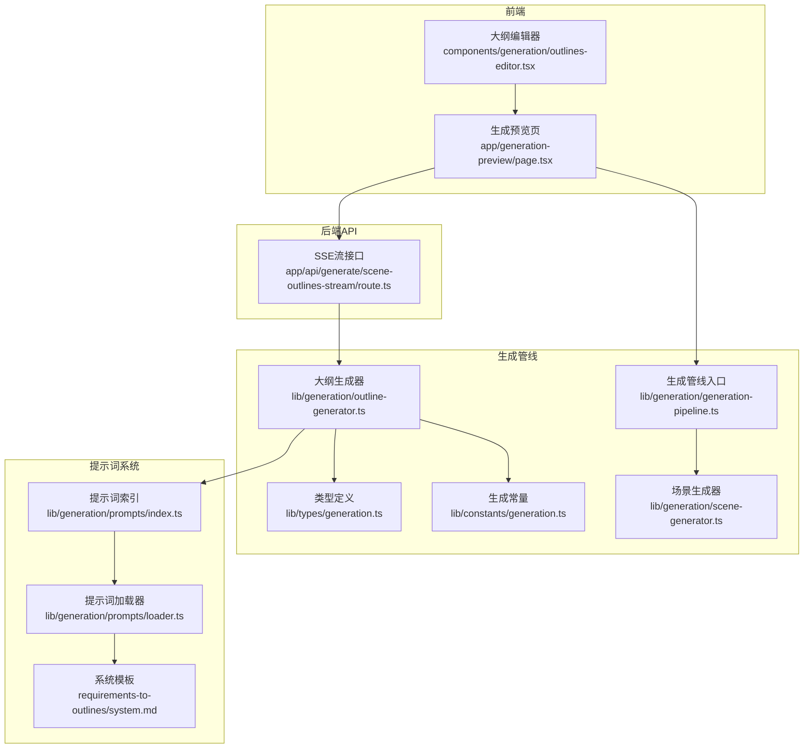
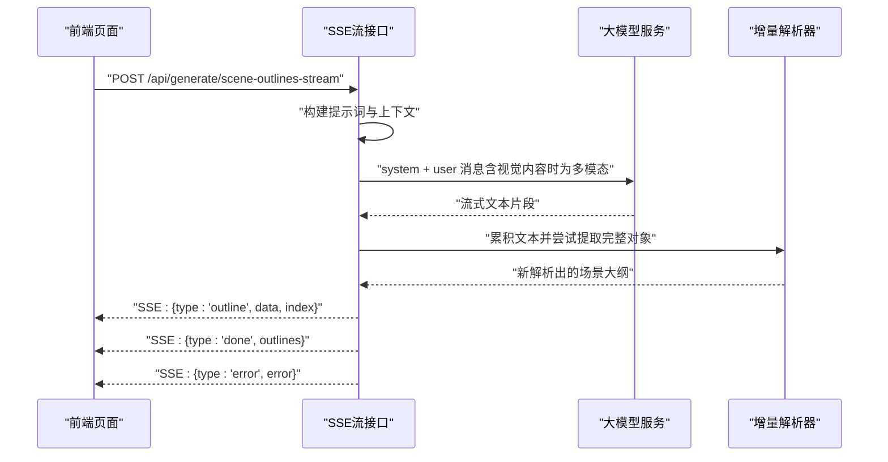
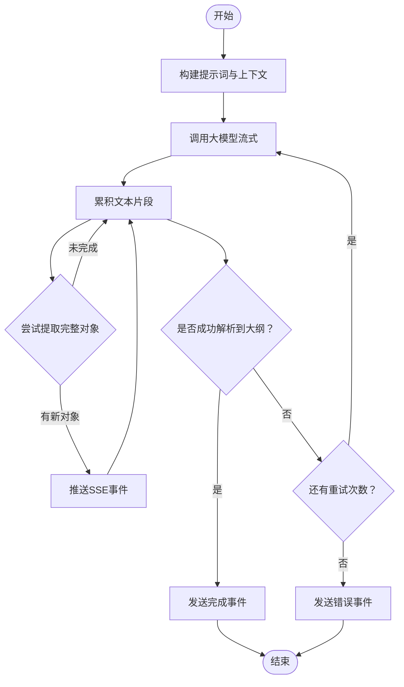
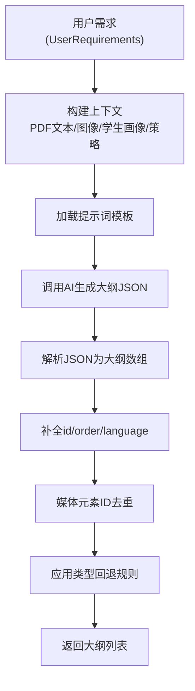
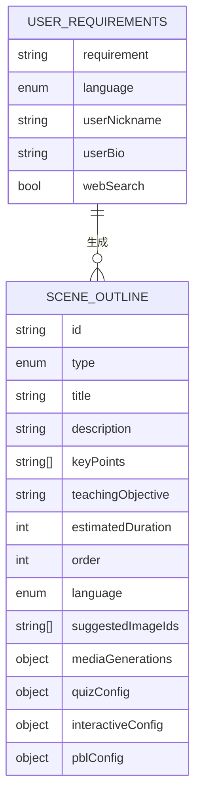
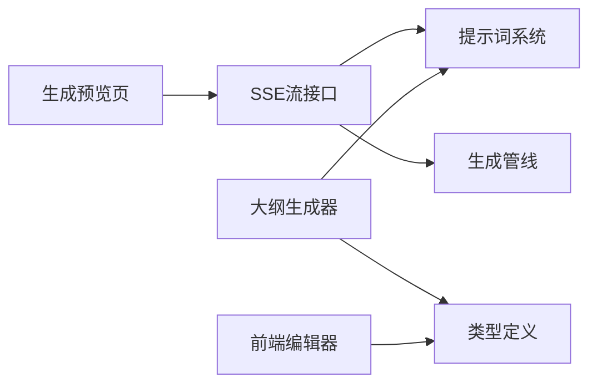

# 大纲生成模块

<cite>
**本文引用的文件**
- [app/api/generate/scene-outlines-stream/route.ts](file://app/api/generate/scene-outlines-stream/route.ts)
- [lib/generation/outline-generator.ts](file://lib/generation/outline-generator.ts)
- [lib/generation/prompts/index.ts](file://lib/generation/prompts/index.ts)
- [lib/generation/prompts/loader.ts](file://lib/generation/prompts/loader.ts)
- [lib/generation/prompts/templates/requirements-to-outlines/system.md](file://lib/generation/prompts/templates/requirements-to-outlines/system.md)
- [lib/generation/prompts/templates/requirements-to-outlines/user.md](file://lib/generation/prompts/templates/requirements-to-outlines/user.md)
- [lib/generation/generation-pipeline.ts](file://lib/generation/generation-pipeline.ts)
- [lib/generation/scene-generator.ts](file://lib/generation/scene-generator.ts)
- [lib/types/generation.ts](file://lib/types/generation.ts)
- [lib/constants/generation.ts](file://lib/constants/generation.ts)
- [components/generation/outlines-editor.tsx](file://components/generation/outlines-editor.tsx)
- [app/generation-preview/page.tsx](file://app/generation-preview/page.tsx)
- [lib/hooks/use-scene-generator.ts](file://lib/hooks/use-scene-generator.ts)
</cite>

## 目录
1. [简介](#简介)
2. [项目结构](#项目结构)
3. [核心组件](#核心组件)
4. [架构总览](#架构总览)
5. [详细组件分析](#详细组件分析)
6. [依赖分析](#依赖分析)
7. [性能考虑](#性能考虑)
8. [故障排除指南](#故障排除指南)
9. [结论](#结论)
10. [附录](#附录)

## 简介
本模块负责将用户的自由文本需求转化为结构化的教学场景大纲（SceneOutline）。系统采用两阶段生成流程：第一阶段由用户需求与文档/图像上下文生成场景大纲；第二阶段基于大纲生成完整课件内容与交互动作。本技术文档聚焦于“大纲生成”的核心算法、提示词工程、AI调用与输出解析、验证与优化机制、配置项与最佳实践，并提供使用示例、性能基准与故障排除建议。

## 项目结构
大纲生成模块横跨前端与后端，主要涉及以下层次：
- 前端页面与编辑器：用于展示与编辑大纲、触发生成流式接口
- 后端API：提供SSE流式接口，增量解析LLM响应，返回可逐步渲染的大纲对象
- 提示词系统：模板化加载、片段拼接与变量插值
- 生成管线：统一的类型、常量与工具函数，支撑大纲与场景生成



**图表来源**
- [app/generation-preview/page.tsx](file://app/generation-preview/page.tsx)
- [components/generation/outlines-editor.tsx](file://components/generation/outlines-editor.tsx)
- [app/api/generate/scene-outlines-stream/route.ts](file://app/api/generate/scene-outlines-stream/route.ts)
- [lib/generation/outline-generator.ts](file://lib/generation/outline-generator.ts)
- [lib/generation/prompts/index.ts](file://lib/generation/prompts/index.ts)
- [lib/generation/prompts/loader.ts](file://lib/generation/prompts/loader.ts)
- [lib/generation/prompts/templates/requirements-to-outlines/system.md](file://lib/generation/prompts/templates/requirements-to-outlines/system.md)
- [lib/generation/generation-pipeline.ts](file://lib/generation/generation-pipeline.ts)
- [lib/generation/scene-generator.ts](file://lib/generation/scene-generator.ts)
- [lib/types/generation.ts](file://lib/types/generation.ts)
- [lib/constants/generation.ts](file://lib/constants/generation.ts)

**章节来源**
- [app/generation-preview/page.tsx](file://app/generation-preview/page.tsx)
- [components/generation/outlines-editor.tsx](file://components/generation/outlines-editor.tsx)
- [app/api/generate/scene-outlines-stream/route.ts](file://app/api/generate/scene-outlines-stream/route.ts)
- [lib/generation/outline-generator.ts](file://lib/generation/outline-generator.ts)
- [lib/generation/prompts/index.ts](file://lib/generation/prompts/index.ts)
- [lib/generation/prompts/loader.ts](file://lib/generation/prompts/loader.ts)
- [lib/generation/prompts/templates/requirements-to-outlines/system.md](file://lib/generation/prompts/templates/requirements-to-outlines/system.md)
- [lib/generation/generation-pipeline.ts](file://lib/generation/generation-pipeline.ts)
- [lib/generation/scene-generator.ts](file://lib/generation/scene-generator.ts)
- [lib/types/generation.ts](file://lib/types/generation.ts)
- [lib/constants/generation.ts](file://lib/constants/generation.ts)

## 核心组件
- 用户需求与上下文：包含主题、语言、学习者画像、附加资料等
- 提示词系统：模板加载、片段拼接、变量插值
- 大纲生成器：从需求生成结构化大纲，含媒体生成策略与回退逻辑
- SSE流式接口：增量解析JSON数组，向前端推送可逐步渲染的大纲对象
- 类型与常量：统一的数据结构与生成限制
- 前端编辑器：可视化编辑大纲，支持增删改序与测验配置

**章节来源**
- [lib/types/generation.ts](file://lib/types/generation.ts)
- [lib/generation/prompts/loader.ts](file://lib/generation/prompts/loader.ts)
- [lib/generation/outline-generator.ts](file://lib/generation/outline-generator.ts)
- [app/api/generate/scene-outlines-stream/route.ts](file://app/api/generate/scene-outlines-stream/route.ts)
- [components/generation/outlines-editor.tsx](file://components/generation/outlines-editor.tsx)

## 架构总览
大纲生成采用“提示词驱动 + 流式增量解析”的架构。前端通过SSE接口接收后端逐条推送的场景大纲对象，后端在收到请求后构建提示词，调用大模型，边生成边解析，遇到完整的顶层对象即推送一次，最后发送完成事件。



**图表来源**
- [app/api/generate/scene-outlines-stream/route.ts](file://app/api/generate/scene-outlines-stream/route.ts)

**章节来源**
- [app/api/generate/scene-outlines-stream/route.ts](file://app/api/generate/scene-outlines-stream/route.ts)

## 详细组件分析

### 组件A：SSE流式接口（增量解析）
- 职责：接收请求，构建提示词与上下文，调用大模型，增量解析JSON数组，通过SSE推送事件
- 关键点：
  - 心跳保活：定期发送注释以维持连接
  - 增量解析：从累积文本中识别顶层对象边界，避免一次性等待完整数组
  - 重试机制：对空结果或错误进行有限次数重试
  - 完成与错误事件：最终发送完成或错误事件
  - 媒体元素ID去重：全局唯一化占位ID，便于后续媒体生成



**图表来源**
- [app/api/generate/scene-outlines-stream/route.ts](file://app/api/generate/scene-outlines-stream/route.ts)

**章节来源**
- [app/api/generate/scene-outlines-stream/route.ts](file://app/api/generate/scene-outlines-stream/route.ts)

### 组件B：提示词系统（模板加载与变量插值）
- 职责：按ID加载模板，支持片段拼接与变量插值，缓存提升性能
- 关键点：
  - 模板目录结构：templates/{promptId}/system.md 与可选 user.md
  - 片段语法：{{snippet:name}}，支持嵌套
  - 变量语法：{{variable}}，自动序列化对象
  - 缓存：Map缓存，开发时可清空

```mermaid
classDiagram
class PromptLoader {
+loadPrompt(id) LoadedPrompt|null
+loadSnippet(id) string
+interpolateVariables(template, vars) string
+buildPrompt(id, vars) {system,user}|null
+clearPromptCache() void
}
class Templates {
+system.md
+user.md
+snippets/*
}
PromptLoader --> Templates : "读取并拼接"
```

**图表来源**
- [lib/generation/prompts/loader.ts](file://lib/generation/prompts/loader.ts)
- [lib/generation/prompts/templates/requirements-to-outlines/system.md](file://lib/generation/prompts/templates/requirements-to-outlines/system.md)
- [lib/generation/prompts/templates/requirements-to-outlines/user.md](file://lib/generation/prompts/templates/requirements-to-outlines/user.md)

**章节来源**
- [lib/generation/prompts/loader.ts](file://lib/generation/prompts/loader.ts)
- [lib/generation/prompts/templates/requirements-to-outlines/system.md](file://lib/generation/prompts/templates/requirements-to-outlines/system.md)
- [lib/generation/prompts/templates/requirements-to-outlines/user.md](file://lib/generation/prompts/templates/requirements-to-outlines/user.md)

### 组件C：大纲生成器（需求到大纲）
- 职责：从简化的需求结构生成场景大纲，处理图像上下文、媒体生成策略、回退逻辑
- 关键点：
  - 图像上下文：支持视觉模式（前N张作为多模态输入）与文本模式
  - 媒体生成策略：根据开关决定是否允许大纲中包含AI生成媒体请求
  - 输出解析：调用JSON修复工具解析为大纲数组，补全ID、顺序与语言
  - 去重ID：全局唯一化媒体元素占位ID



**图表来源**
- [lib/generation/outline-generator.ts](file://lib/generation/outline-generator.ts)
- [lib/generation/prompts/loader.ts](file://lib/generation/prompts/loader.ts)
- [lib/generation/prompts/templates/requirements-to-outlines/system.md](file://lib/generation/prompts/templates/requirements-to-outlines/system.md)

**章节来源**
- [lib/generation/outline-generator.ts](file://lib/generation/outline-generator.ts)
- [lib/generation/prompts/loader.ts](file://lib/generation/prompts/loader.ts)
- [lib/generation/prompts/templates/requirements-to-outlines/system.md](file://lib/generation/prompts/templates/requirements-to-outlines/system.md)

### 组件D：类型与约束（大纲数据模型）
- 职责：定义大纲、场景、媒体生成请求等核心类型，确保前后端一致性
- 关键点：
  - 场景类型：slide、quiz、interactive、pbl
  - 字段约束：必填/可选字段、默认值、长度限制
  - 媒体生成：MediaGenerationRequest占位ID与真实映射分离
  - 学习者画像：年龄、风格偏好、语言等



**图表来源**
- [lib/types/generation.ts](file://lib/types/generation.ts)

**章节来源**
- [lib/types/generation.ts](file://lib/types/generation.ts)

### 组件E：前端编辑器（大纲可视化与配置）
- 职责：提供大纲卡片式编辑界面，支持增删改序、测验配置、确认提交
- 关键点：
  - 卡片内含标题、描述、关键要点、类型选择
  - 测验配置：题数、难度、题型
  - 排序与删除：实时更新order并保持连续

**章节来源**
- [components/generation/outlines-editor.tsx](file://components/generation/outlines-editor.tsx)

### 组件F：生成预览与流式消费
- 职责：发起SSE流请求，逐条消费outline事件，收集完成后进入下一阶段
- 关键点：
  - 读取SSE流并解析事件
  - 支持错误与重试事件
  - 将解析到的大纲集合传递给后续生成流程

**章节来源**
- [app/generation-preview/page.tsx](file://app/generation-preview/page.tsx)

## 依赖分析
- 模块耦合：
  - SSE流接口依赖提示词系统与图像格式化工具
  - 大纲生成器依赖提示词系统与JSON修复工具
  - 前端编辑器依赖类型定义与UI组件库
- 外部依赖：
  - 大模型服务（通过统一的AI调用接口）
  - 文件系统（提示词模板读取）



**图表来源**
- [app/api/generate/scene-outlines-stream/route.ts](file://app/api/generate/scene-outlines-stream/route.ts)
- [lib/generation/outline-generator.ts](file://lib/generation/outline-generator.ts)
- [lib/generation/prompts/loader.ts](file://lib/generation/prompts/loader.ts)
- [lib/types/generation.ts](file://lib/types/generation.ts)
- [components/generation/outlines-editor.tsx](file://components/generation/outlines-editor.tsx)
- [app/generation-preview/page.tsx](file://app/generation-preview/page.tsx)

**章节来源**
- [app/api/generate/scene-outlines-stream/route.ts](file://app/api/generate/scene-outlines-stream/route.ts)
- [lib/generation/outline-generator.ts](file://lib/generation/outline-generator.ts)
- [lib/generation/prompts/loader.ts](file://lib/generation/prompts/loader.ts)
- [lib/types/generation.ts](file://lib/types/generation.ts)
- [components/generation/outlines-editor.tsx](file://components/generation/outlines-editor.tsx)
- [app/generation-preview/page.tsx](file://app/generation-preview/page.tsx)

## 性能考虑
- 流式增量解析：避免等待完整数组，降低首屏延迟
- 心跳保活：防止代理/网络中间层断开连接
- 重试机制：对空响应或异常进行有限次重试，提高成功率
- 图像上下文裁剪：限制最大视觉图像数量与PDF文本长度，平衡质量与成本
- 缓存提示词：减少重复IO开销

**章节来源**
- [app/api/generate/scene-outlines-stream/route.ts](file://app/api/generate/scene-outlines-stream/route.ts)
- [lib/constants/generation.ts](file://lib/constants/generation.ts)
- [lib/generation/prompts/loader.ts](file://lib/generation/prompts/loader.ts)

## 故障排除指南
- SSE连接中断
  - 现象：客户端收不到事件或连接被关闭
  - 排查：检查心跳是否正常、网络代理设置、超时配置
- 增量解析失败
  - 现象：无法从流文本中提取完整对象
  - 排查：确认提示词输出严格为JSON数组、模型输出稳定性、字符转义问题
- 空响应或空大纲
  - 现象：重试后仍无有效大纲
  - 排查：调整提示词、增加上下文信息、检查模型能力与输出窗口
- 媒体生成策略冲突
  - 现象：大纲包含媒体生成但被禁用
  - 排查：检查请求头中的开关配置与模板策略注入
- 前端编辑器不可用
  - 现象：按钮禁用、无法编辑
  - 排查：确认生成状态、加载标志、事件监听是否正确

**章节来源**
- [app/api/generate/scene-outlines-stream/route.ts](file://app/api/generate/scene-outlines-stream/route.ts)
- [components/generation/outlines-editor.tsx](file://components/generation/outlines-editor.tsx)

## 结论
大纲生成模块通过“提示词模板 + 流式增量解析 + 类型约束 + 前后端协同”的方式，实现了从用户需求到结构化大纲的自动化与可控化。其设计兼顾了生成质量、用户体验与系统稳定性，为后续场景内容与动作生成奠定了坚实基础。

## 附录

### 使用示例
- 在生成预览页发起SSE流请求，传入用户需求、PDF文本/图像、研究背景与教师角色信息
- 前端逐条接收outline事件，实时渲染大纲卡片
- 用户确认后进入下一阶段生成完整课件

**章节来源**
- [app/generation-preview/page.tsx](file://app/generation-preview/page.tsx)
- [app/api/generate/scene-outlines-stream/route.ts](file://app/api/generate/scene-outlines-stream/route.ts)

### 配置选项说明
- 请求头开关
  - x-image-generation-enabled: 是否允许大纲包含图像生成请求
  - x-video-generation-enabled: 是否允许大纲包含视频生成请求
- 模型能力
  - 视觉能力：影响是否将图像作为多模态输入
- 生成参数
  - 最大输出令牌数：受模型能力限制
  - PDF文本截断长度：控制上下文大小
  - 视觉图像上限：控制多模态输入数量
- 类型回退
  - 当缺少必要配置时，interactive与pbl会回退为slide

**章节来源**
- [app/api/generate/scene-outlines-stream/route.ts](file://app/api/generate/scene-outlines-stream/route.ts)
- [lib/constants/generation.ts](file://lib/constants/generation.ts)
- [lib/generation/outline-generator.ts](file://lib/generation/outline-generator.ts)