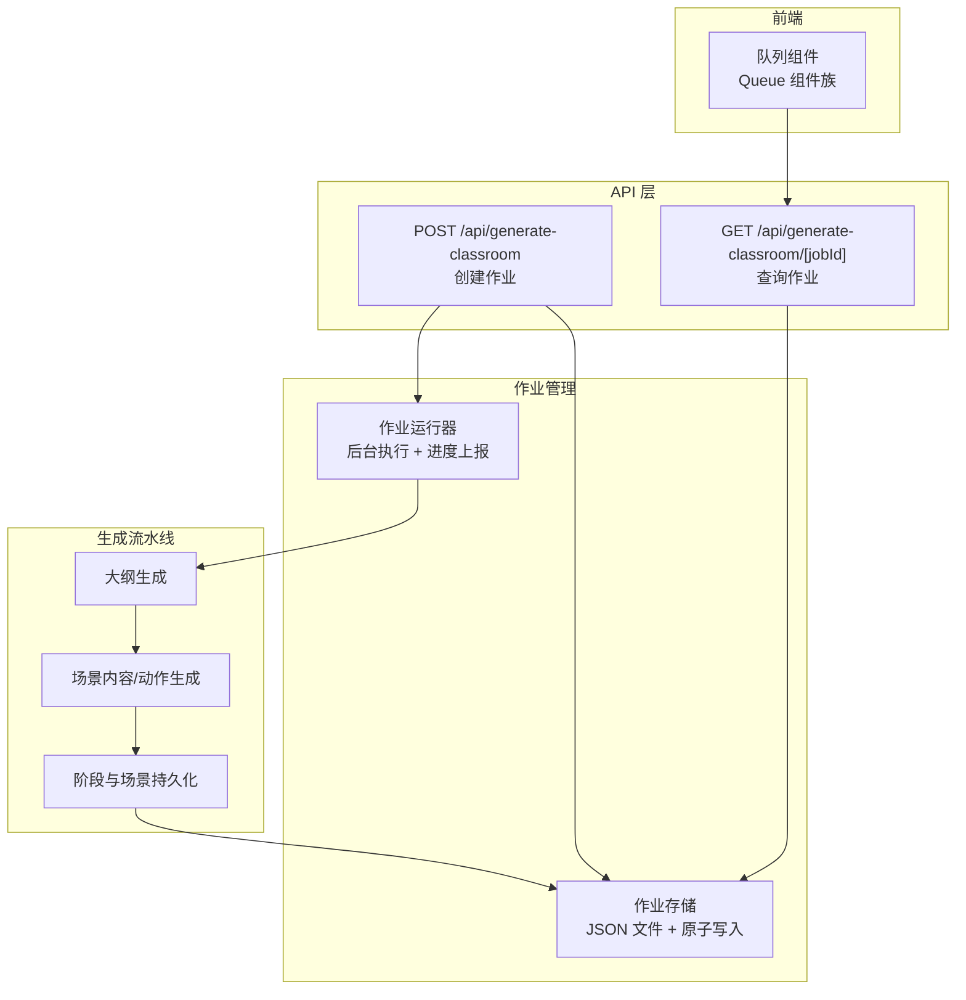
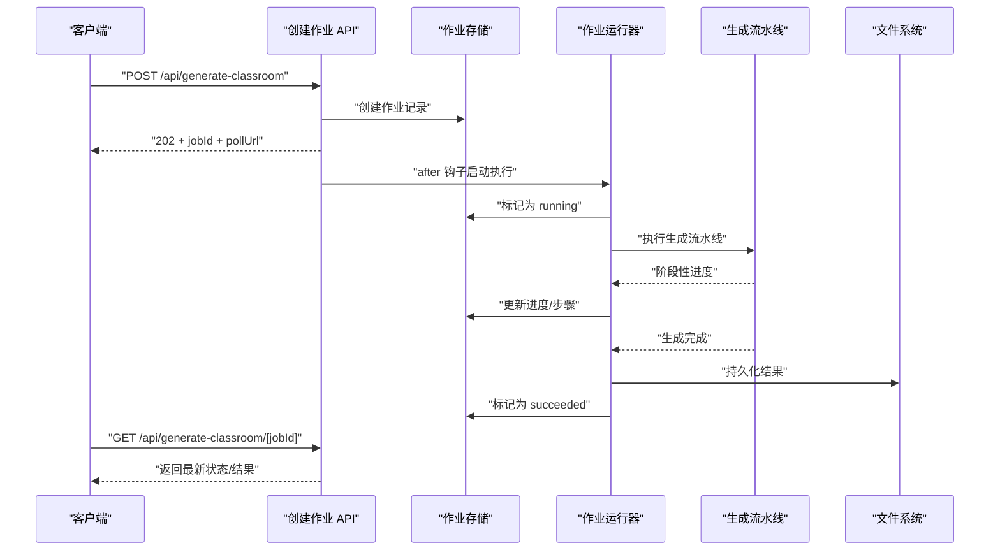
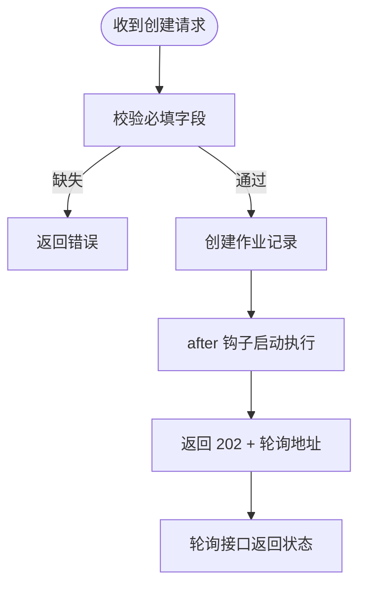
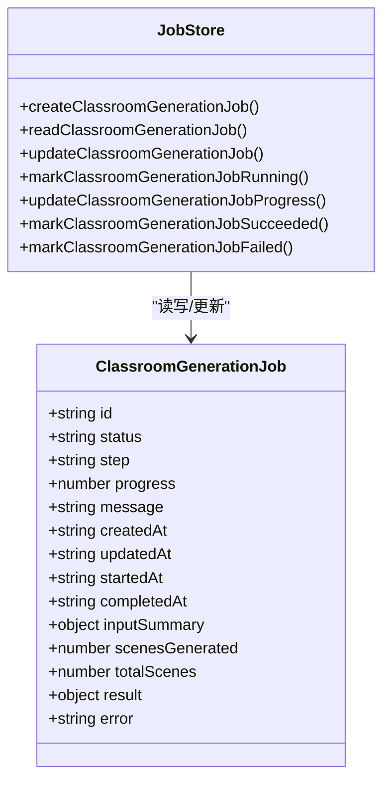
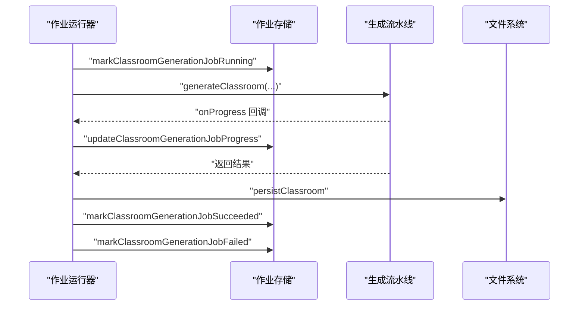
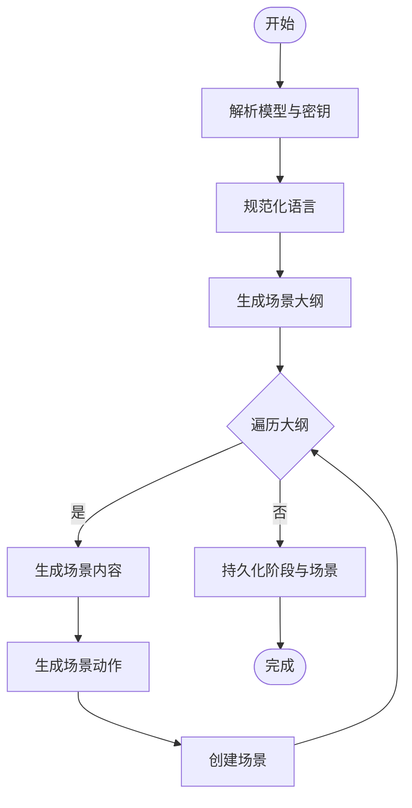
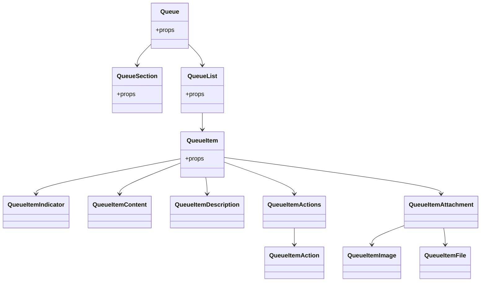
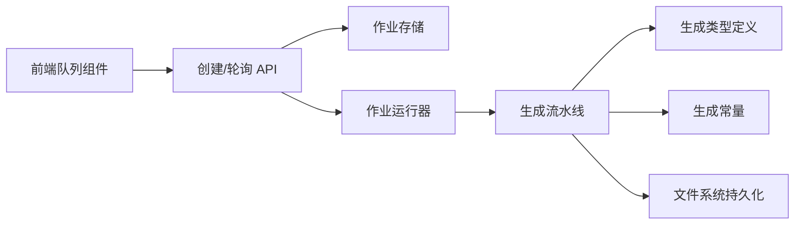

# 异步作业管理系统

<cite>
**本文档引用的文件**
- [app/api/generate-classroom/route.ts](file://app/api/generate-classroom/route.ts)
- [app/api/generate-classroom/[jobId]/route.ts](file://app/api/generate-classroom/[jobId]/route.ts)
- [lib/server/classroom-job-store.ts](file://lib/server/classroom-job-store.ts)
- [lib/server/classroom-job-runner.ts](file://lib/server/classroom-job-runner.ts)
- [lib/server/classroom-generation.ts](file://lib/server/classroom-generation.ts)
- [lib/server/classroom-storage.ts](file://lib/server/classroom-storage.ts)
- [lib/constants/generation.ts](file://lib/constants/generation.ts)
- [lib/generation/generation-pipeline.ts](file://lib/generation/generation-pipeline.ts)
- [lib/types/generation.ts](file://lib/types/generation.ts)
- [components/ai-elements/queue.tsx](file://components/ai-elements/queue.tsx)
</cite>

## 目录
1. [简介](#简介)
2. [项目结构](#项目结构)
3. [核心组件](#核心组件)
4. [架构总览](#架构总览)
5. [详细组件分析](#详细组件分析)
6. [依赖关系分析](#依赖关系分析)
7. [性能考虑](#性能考虑)
8. [故障排查指南](#故障排查指南)
9. [结论](#结论)
10. [附录：API 接口与客户端集成](#附录api-接口与客户端集成)

## 简介
本系统为一个基于 Next.js 的异步作业管理系统，聚焦“课堂内容生成”场景。用户提交生成请求后，系统立即返回作业 ID 和轮询地址；后台异步执行生成流水线（大纲生成、场景生成、持久化），并通过文件系统原子写入保存作业状态与结果。前端通过轮询接口获取进度与最终结果，支持失败重试与过期检测。

## 项目结构
围绕异步作业管理的关键目录与文件如下：
- API 层：负责接收请求、创建作业、返回初始响应、提供轮询接口
- 作业存储层：以 JSON 文件形式持久化作业状态，提供原子写入与并发锁
- 作业运行器：在后台异步执行生成任务，上报进度并更新状态
- 生成流水线：包含大纲生成、场景内容与动作生成、阶段数据构建与持久化
- 前端组件：提供作业队列展示组件，便于在界面中呈现作业状态

图表来源
- [app/api/generate-classroom/route.ts:11-51](file://app/api/generate-classroom/route.ts#L11-L51)
- [app/api/generate-classroom/[jobId]/route.ts](file://app/api/generate-classroom/[jobId]/route.ts#L11-L48)
- [lib/server/classroom-job-store.ts:102-226](file://lib/server/classroom-job-store.ts#L102-L226)
- [lib/server/classroom-job-runner.ts:13-50](file://lib/server/classroom-job-runner.ts#L13-L50)
- [lib/server/classroom-generation.ts:86-264](file://lib/server/classroom-generation.ts#L86-L264)
- [lib/server/classroom-storage.ts:61-84](file://lib/server/classroom-storage.ts#L61-L84)
- [components/ai-elements/queue.tsx:223-232](file://components/ai-elements/queue.tsx#L223-L232)

章节来源
- [app/api/generate-classroom/route.ts:1-52](file://app/api/generate-classroom/route.ts#L1-L52)
- [app/api/generate-classroom/[jobId]/route.ts](file://app/api/generate-classroom/[jobId]/route.ts#L1-L49)
- [lib/server/classroom-job-store.ts:1-227](file://lib/server/classroom-job-store.ts#L1-L227)
- [lib/server/classroom-job-runner.ts:1-51](file://lib/server/classroom-job-runner.ts#L1-L51)
- [lib/server/classroom-generation.ts:1-265](file://lib/server/classroom-generation.ts#L1-L265)
- [lib/server/classroom-storage.ts:1-85](file://lib/server/classroom-storage.ts#L1-L85)
- [components/ai-elements/queue.tsx:1-232](file://components/ai-elements/queue.tsx#L1-L232)

## 核心组件
- 作业创建与轮询 API
  - 创建作业：接收输入、校验必填字段、生成作业 ID、调用存储创建作业记录、使用 after 钩子异步启动执行、返回 202 与轮询信息
  - 轮询接口：根据作业 ID 返回当前状态、进度、消息、场景统计、结果或错误
- 作业存储与并发控制
  - 作业状态模型：包含状态、步骤、进度、消息、时间戳、输入摘要、已生成场景数、总数、结果、错误等
  - 并发控制：按作业 ID 的互斥锁，保证同一作业的读改写串行化
  - 原子写入：临时文件 + 原子重命名，避免部分写入
  - 过期检测：若运行中超过阈值未更新，标记为失败
- 作业运行器
  - 启动时标记为运行中，逐阶段推进，回调上报进度，成功则标记完成，失败则记录错误
- 生成流水线
  - 解析模型与密钥、规范化语言、生成场景大纲、逐场景生成内容与动作、构建阶段与场景、持久化到文件系统
- 前端队列组件
  - 提供可折叠列表、项指示器、附件与文件展示、操作按钮等 UI 组合，便于在界面中显示作业队列

章节来源
- [app/api/generate-classroom/route.ts:11-51](file://app/api/generate-classroom/route.ts#L11-L51)
- [app/api/generate-classroom/[jobId]/route.ts](file://app/api/generate-classroom/[jobId]/route.ts#L11-L48)
- [lib/server/classroom-job-store.ts:15-226](file://lib/server/classroom-job-store.ts#L15-L226)
- [lib/server/classroom-job-runner.ts:13-50](file://lib/server/classroom-job-runner.ts#L13-L50)
- [lib/server/classroom-generation.ts:86-264](file://lib/server/classroom-generation.ts#L86-L264)
- [lib/server/classroom-storage.ts:61-84](file://lib/server/classroom-storage.ts#L61-L84)
- [components/ai-elements/queue.tsx:1-232](file://components/ai-elements/queue.tsx#L1-L232)

## 架构总览
系统采用“请求即返回 + 后台异步执行”的模式，API 层与执行层解耦，状态通过本地文件系统持久化，前端通过轮询获取进度。

图表来源
- [app/api/generate-classroom/route.ts:11-51](file://app/api/generate-classroom/route.ts#L11-L51)
- [app/api/generate-classroom/[jobId]/route.ts](file://app/api/generate-classroom/[jobId]/route.ts#L11-L48)
- [lib/server/classroom-job-store.ts:102-226](file://lib/server/classroom-job-store.ts#L102-L226)
- [lib/server/classroom-job-runner.ts:13-50](file://lib/server/classroom-job-runner.ts#L13-L50)
- [lib/server/classroom-generation.ts:86-264](file://lib/server/classroom-generation.ts#L86-L264)
- [lib/server/classroom-storage.ts:61-84](file://lib/server/classroom-storage.ts#L61-L84)

## 详细组件分析

### 作业创建与轮询 API
- POST /api/generate-classroom
  - 校验必填字段 requirement
  - 生成 jobId，创建作业记录，返回 202，包含 jobId、初始状态、消息、轮询地址与轮询间隔
  - 使用 after 钩子在请求结束后异步启动作业执行
- GET /api/generate-classroom/[jobId]
  - 校验 jobId 格式
  - 读取作业记录，返回状态、步骤、进度、消息、场景统计、结果或错误，done 字段标识是否结束

图表来源
- [app/api/generate-classroom/route.ts:11-51](file://app/api/generate-classroom/route.ts#L11-L51)
- [app/api/generate-classroom/[jobId]/route.ts](file://app/api/generate-classroom/[jobId]/route.ts#L11-L48)

章节来源
- [app/api/generate-classroom/route.ts:11-51](file://app/api/generate-classroom/route.ts#L11-L51)
- [app/api/generate-classroom/[jobId]/route.ts](file://app/api/generate-classroom/[jobId]/route.ts#L11-L48)

### 作业存储与并发控制
- 数据模型
  - 状态：queued、running、succeeded、failed
  - 步骤：初始化、生成大纲、生成场景、持久化、完成
  - 输入摘要：需求预览、语言、是否包含 PDF、PDF 文本长度、图片数量
  - 结果：教室 ID、URL、场景数量
- 并发控制
  - 按作业 ID 的互斥锁，确保同一作业的读改写串行化
  - 过期检测：运行中超过阈值未更新则标记失败
- 原子写入
  - 临时文件 + 原子重命名，避免部分写入导致损坏

图表来源
- [lib/server/classroom-job-store.ts:15-226](file://lib/server/classroom-job-store.ts#L15-L226)

章节来源
- [lib/server/classroom-job-store.ts:15-226](file://lib/server/classroom-job-store.ts#L15-L226)

### 作业运行器
- 启动：去重（避免重复启动）、标记为 running
- 执行：调用生成流水线，回调上报进度
- 完成：成功则标记 succeeded 并持久化结果；失败则记录错误并标记 failed
- 清理：finally 中从运行中集合移除

图表来源
- [lib/server/classroom-job-runner.ts:13-50](file://lib/server/classroom-job-runner.ts#L13-L50)
- [lib/server/classroom-generation.ts:86-264](file://lib/server/classroom-generation.ts#L86-L264)
- [lib/server/classroom-storage.ts:61-84](file://lib/server/classroom-storage.ts#L61-L84)

章节来源
- [lib/server/classroom-job-runner.ts:13-50](file://lib/server/classroom-job-runner.ts#L13-L50)

### 生成流水线
- 模型解析与密钥校验：解析模型字符串、提取提供商 ID、校验对应密钥是否存在
- 规范化语言：统一为 zh-CN 或 en-US
- 大纲生成：从用户需求与 PDF 文本生成场景大纲
- 场景生成：逐场景生成内容与动作，构建阶段与场景集合
- 持久化：将阶段与场景写入文件系统，返回可访问 URL

图表来源
- [lib/server/classroom-generation.ts:86-264](file://lib/server/classroom-generation.ts#L86-L264)
- [lib/server/classroom-storage.ts:61-84](file://lib/server/classroom-storage.ts#L61-L84)

章节来源
- [lib/server/classroom-generation.ts:86-264](file://lib/server/classroom-generation.ts#L86-L264)
- [lib/server/classroom-storage.ts:61-84](file://lib/server/classroom-storage.ts#L61-L84)

### 前端队列组件
- 提供可折叠容器、触发器、列表、项指示器、描述、附件与文件展示、操作按钮等组合
- 支持在界面中直观展示多个作业的状态与进度

图表来源
- [components/ai-elements/queue.tsx:223-232](file://components/ai-elements/queue.tsx#L223-L232)

章节来源
- [components/ai-elements/queue.tsx:1-232](file://components/ai-elements/queue.tsx#L1-L232)

## 依赖关系分析
- API 依赖作业存储与运行器
- 作业运行器依赖生成流水线与存储
- 生成流水线依赖模型解析、提供商配置、AI 调用、阶段与场景类型定义
- 前端队列组件依赖 API 轮询接口

图表来源
- [app/api/generate-classroom/route.ts:11-51](file://app/api/generate-classroom/route.ts#L11-L51)
- [app/api/generate-classroom/[jobId]/route.ts](file://app/api/generate-classroom/[jobId]/route.ts#L11-L48)
- [lib/server/classroom-job-store.ts:102-226](file://lib/server/classroom-job-store.ts#L102-L226)
- [lib/server/classroom-job-runner.ts:13-50](file://lib/server/classroom-job-runner.ts#L13-L50)
- [lib/server/classroom-generation.ts:86-264](file://lib/server/classroom-generation.ts#L86-L264)
- [lib/types/generation.ts:1-229](file://lib/types/generation.ts#L1-L229)
- [lib/constants/generation.ts:1-11](file://lib/constants/generation.ts#L1-L11)
- [lib/server/classroom-storage.ts:61-84](file://lib/server/classroom-storage.ts#L61-L84)
- [components/ai-elements/queue.tsx:223-232](file://components/ai-elements/queue.tsx#L223-L232)

章节来源
- [lib/types/generation.ts:1-229](file://lib/types/generation.ts#L1-L229)
- [lib/constants/generation.ts:1-11](file://lib/constants/generation.ts#L1-L11)
- [lib/generation/generation-pipeline.ts:1-51](file://lib/generation/generation-pipeline.ts#L1-L51)

## 性能考虑
- 并发控制
  - 通过作业 ID 的互斥锁避免竞态，保障状态一致性
- 原子写入
  - 临时文件 + 原子重命名，降低部分写入风险
- 过期检测
  - 运行中超过阈值未更新自动标记失败，避免僵尸作业占用资源
- 轮询间隔
  - 默认 5 秒轮询一次，平衡实时性与服务器压力
- 资源限制
  - 生成常量限制 PDF 内容长度与视觉图像数量，防止单次请求过大
- 可扩展性
  - 当前为单机文件系统存储；如需水平扩展，建议迁移到分布式存储与数据库，并引入消息队列进行作业调度

[本节为通用指导，不直接分析具体文件]

## 故障排查指南
- 常见错误
  - 缺少必填字段：创建请求时未提供 requirement
  - 无效作业 ID：轮询接口校验 jobId 格式
  - 作业不存在：轮询时找不到对应作业
  - 无提供商密钥：生成前校验失败
  - 生成失败：运行器捕获异常并记录错误
- 日志与诊断
  - 作业运行器与生成模块均内置日志，可用于定位问题
  - 轮询接口返回 error 字段，便于前端展示
- 处理建议
  - 检查环境变量中的提供商密钥配置
  - 确认轮询地址与轮询间隔设置合理
  - 关注过期检测逻辑，避免长时间无进度导致误判

章节来源
- [app/api/generate-classroom/route.ts:21-23](file://app/api/generate-classroom/route.ts#L21-L23)
- [app/api/generate-classroom/[jobId]/route.ts](file://app/api/generate-classroom/[jobId]/route.ts#L15-L22)
- [lib/server/classroom-generation.ts:105-113](file://lib/server/classroom-generation.ts#L105-L113)
- [lib/server/classroom-job-runner.ts:35-42](file://lib/server/classroom-job-runner.ts#L35-L42)

## 结论
该异步作业管理系统以简洁可靠的方式实现了“请求即返回 + 后台异步执行”的模式。通过文件系统原子写入与互斥锁保障状态一致性，结合轮询接口与前端队列组件，提供了清晰的进度与结果反馈。当前实现适合中小规模部署，若需更高可用性与扩展性，建议引入数据库与消息队列进行状态与调度管理。

[本节为总结性内容，不直接分析具体文件]

## 附录：API 接口与客户端集成

### API 接口定义
- 创建课堂生成作业
  - 方法与路径：POST /api/generate-classroom
  - 请求体字段
    - requirement: string（必填）
    - pdfContent: object（可选）
      - text: string
      - images: string[]
    - language: string（可选，默认 zh-CN）
  - 成功响应
    - 状态码：202
    - 字段：jobId、status、step、message、pollUrl、pollIntervalMs
  - 错误响应
    - 状态码：400（缺少必填字段）/ 500（内部错误）

- 查询作业状态
  - 方法与路径：GET /api/generate-classroom/[jobId]
  - 路径参数：jobId（仅允许字母数字、下划线、连字符）
  - 成功响应字段：jobId、status、step、progress、message、pollUrl、pollIntervalMs、scenesGenerated、totalScenes、result、error、done
  - 错误响应
    - 状态码：400（无效 jobId）/ 404（作业不存在）/ 500（内部错误）

章节来源
- [app/api/generate-classroom/route.ts:11-51](file://app/api/generate-classroom/route.ts#L11-L51)
- [app/api/generate-classroom/[jobId]/route.ts](file://app/api/generate-classroom/[jobId]/route.ts#L11-L48)

### 客户端集成示例（流程）
- 发起请求
  - 向 POST /api/generate-classroom 提交需求文本与可选 PDF 内容
  - 记录返回的 jobId 与 pollUrl
- 轮询查询
  - 每隔 pollIntervalMs（默认 5000ms）向 GET /api/generate-classroom/[jobId] 查询
  - 监听 done 字段，当为 true 时停止轮询
- 结果处理
  - 若 status 为 succeeded，使用 result.url 打开生成内容
  - 若 status 为 failed，读取 error 字段进行提示或重试

[本节为概念性流程说明，不直接分析具体文件]