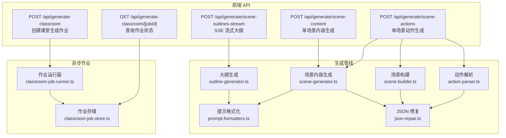
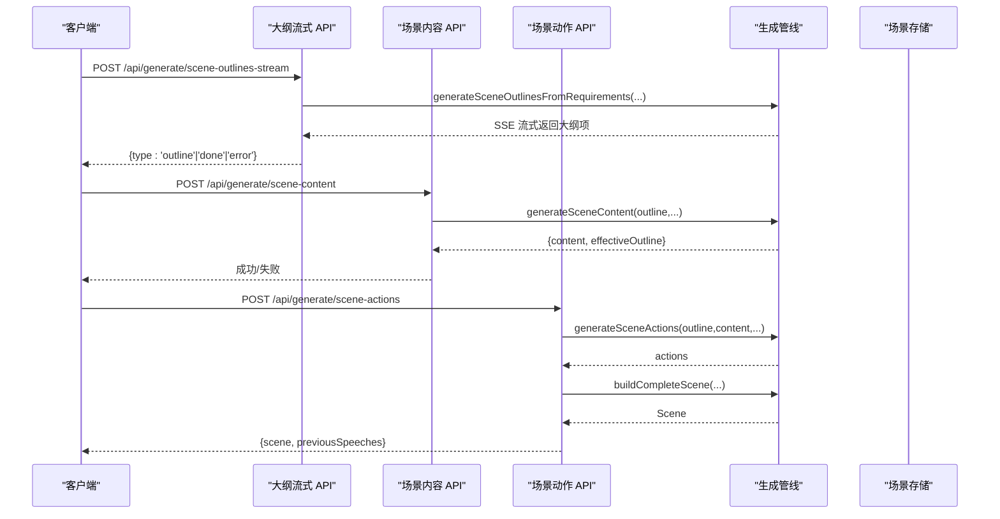
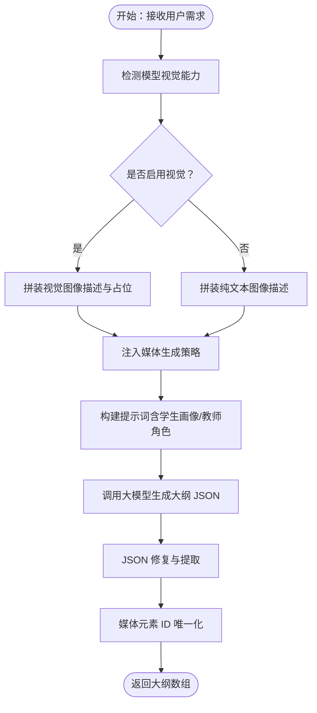
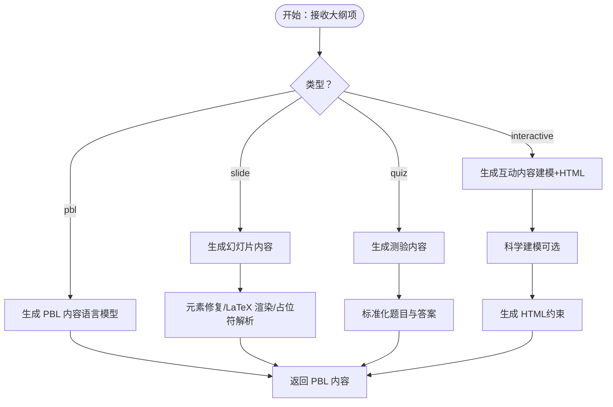
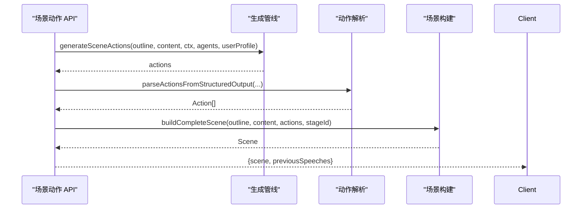
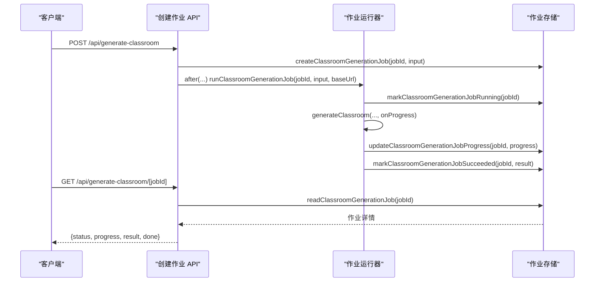
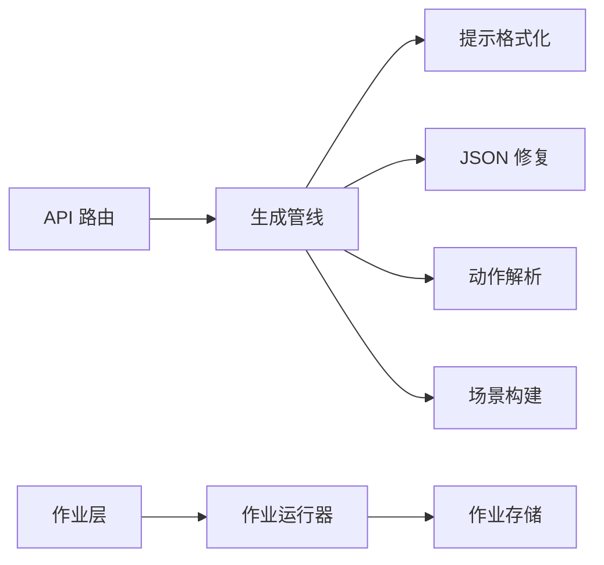

# 生成系统

<cite>
**本文引用的文件**
- [app/api/generate/scene-outlines-stream/route.ts](file://app/api/generate/scene-outlines-stream/route.ts)
- [app/api/generate/scene-content/route.ts](file://app/api/generate/scene-content/route.ts)
- [app/api/generate/scene-actions/route.ts](file://app/api/generate/scene-actions/route.ts)
- [app/api/generate-classroom/route.ts](file://app/api/generate-classroom/route.ts)
- [app/api/generate-classroom/[jobId]/route.ts](file://app/api/generate-classroom/[jobId]/route.ts)
- [lib/generation/generation-pipeline.ts](file://lib/generation/generation-pipeline.ts)
- [lib/generation/outline-generator.ts](file://lib/generation/outline-generator.ts)
- [lib/generation/scene-generator.ts](file://lib/generation/scene-generator.ts)
- [lib/generation/scene-builder.ts](file://lib/generation/scene-builder.ts)
- [lib/generation/pipeline-types.ts](file://lib/generation/pipeline-types.ts)
- [lib/generation/prompt-formatters.ts](file://lib/generation/prompt-formatters.ts)
- [lib/generation/json-repair.ts](file://lib/generation/json-repair.ts)
- [lib/generation/action-parser.ts](file://lib/generation/action-parser.ts)
- [lib/server/classroom-job-runner.ts](file://lib/server/classroom-job-runner.ts)
- [lib/server/classroom-job-store.ts](file://lib/server/classroom-job-store.ts)
</cite>

## 目录
1. [简介](#简介)
2. [项目结构](#项目结构)
3. [核心组件](#核心组件)
4. [架构总览](#架构总览)
5. [详细组件分析](#详细组件分析)
6. [依赖关系分析](#依赖关系分析)
7. [性能考虑](#性能考虑)
8. [故障排查指南](#故障排查指南)
9. [结论](#结论)
10. [附录](#附录)

## 简介
本文件面向开发者与产品人员，系统性阐述 OpenMAIC 的“两阶段生成”系统：从用户输入到结构化课程大纲，再到课堂场景内容与动作的完整流水线。文档覆盖以下主题：
- 两阶段生成流程的设计理念与实现细节
- 大纲生成模块如何解析用户输入并产出结构化大纲
- 场景内容生成过程：如何将大纲项转化为富媒体课堂场景
- 场景构建与动作生成机制：如何创建包含多种元素的完整场景
- 异步作业管理系统：作业队列、状态跟踪与结果回调
- 配置选项、性能优化策略与错误处理机制
- 实际使用模式与扩展建议

## 项目结构
生成系统由“前端 API 路由 + 后端生成管线 + 异步作业层”三层组成：
- 前端 API 层：提供大纲流式生成、场景内容生成、场景动作生成、以及课堂生成作业接口
- 生成管线层：封装大纲生成、场景内容生成、动作解析与场景构建
- 作业层：以本地文件存储为后端，维护作业生命周期与进度

**图表来源**
- [app/api/generate/scene-outlines-stream/route.ts:99-361](file://app/api/generate/scene-outlines-stream/route.ts#L99-L361)
- [app/api/generate/scene-content/route.ts:26-167](file://app/api/generate/scene-content/route.ts#L26-L167)
- [app/api/generate/scene-actions/route.ts:34-158](file://app/api/generate/scene-actions/route.ts#L34-L158)
- [app/api/generate-classroom/route.ts:11-51](file://app/api/generate-classroom/route.ts#L11-L51)
- [app/api/generate-classroom/[jobId]/route.ts](file://app/api/generate-classroom/[jobId]/route.ts#L11-L48)
- [lib/generation/outline-generator.ts:26-157](file://lib/generation/outline-generator.ts#L26-L157)
- [lib/generation/scene-generator.ts:149-202](file://lib/generation/scene-generator.ts#L149-L202)
- [lib/generation/scene-builder.ts:67-117](file://lib/generation/scene-builder.ts#L67-L117)
- [lib/generation/prompt-formatters.ts:8-141](file://lib/generation/prompt-formatters.ts#L8-L141)
- [lib/generation/json-repair.ts:9-95](file://lib/generation/json-repair.ts#L9-L95)
- [lib/generation/action-parser.ts:42-154](file://lib/generation/action-parser.ts#L42-L154)
- [lib/server/classroom-job-runner.ts:13-50](file://lib/server/classroom-job-runner.ts#L13-L50)
- [lib/server/classroom-job-store.ts:102-226](file://lib/server/classroom-job-store.ts#L102-L226)

**章节来源**
- [app/api/generate/scene-outlines-stream/route.ts:99-361](file://app/api/generate/scene-outlines-stream/route.ts#L99-L361)
- [app/api/generate/scene-content/route.ts:26-167](file://app/api/generate/scene-content/route.ts#L26-L167)
- [app/api/generate/scene-actions/route.ts:34-158](file://app/api/generate/scene-actions/route.ts#L34-L158)
- [app/api/generate-classroom/route.ts:11-51](file://app/api/generate-classroom/route.ts#L11-L51)
- [app/api/generate-classroom/[jobId]/route.ts](file://app/api/generate-classroom/[jobId]/route.ts#L11-L48)

## 核心组件
- 两阶段生成管线（大纲 + 内容/动作）
  - 大纲生成：从用户需求生成结构化场景大纲
  - 场景生成：按大纲生成内容（幻灯片/测验/互动/PBL），再生成动作序列
- 提示格式化与 JSON 修复
  - 统一构建多模态提示，适配视觉/文本模式
  - 针对大模型输出的非规范 JSON 进行修复与提取
- 动作解析与场景构建
  - 将结构化数组输出解析为 Typed Action 列表，并组装完整 Scene 对象
- 异步作业管理
  - 创建作业、后台执行、持久化状态、轮询查询

**章节来源**
- [lib/generation/generation-pipeline.ts:8-50](file://lib/generation/generation-pipeline.ts#L8-L50)
- [lib/generation/outline-generator.ts:26-157](file://lib/generation/outline-generator.ts#L26-L157)
- [lib/generation/scene-generator.ts:149-202](file://lib/generation/scene-generator.ts#L149-L202)
- [lib/generation/scene-builder.ts:67-117](file://lib/generation/scene-builder.ts#L67-L117)
- [lib/generation/prompt-formatters.ts:8-141](file://lib/generation/prompt-formatters.ts#L8-L141)
- [lib/generation/json-repair.ts:9-95](file://lib/generation/json-repair.ts#L9-L95)
- [lib/generation/action-parser.ts:42-154](file://lib/generation/action-parser.ts#L42-L154)
- [lib/server/classroom-job-runner.ts:13-50](file://lib/server/classroom-job-runner.ts#L13-L50)
- [lib/server/classroom-job-store.ts:102-226](file://lib/server/classroom-job-store.ts#L102-L226)

## 架构总览
两阶段生成的端到端流程如下：

**图表来源**
- [app/api/generate/scene-outlines-stream/route.ts:197-361](file://app/api/generate/scene-outlines-stream/route.ts#L197-L361)
- [lib/generation/outline-generator.ts:26-157](file://lib/generation/outline-generator.ts#L26-L157)
- [app/api/generate/scene-content/route.ts:139-148](file://app/api/generate/scene-content/route.ts#L139-L148)
- [lib/generation/scene-generator.ts:149-202](file://lib/generation/scene-generator.ts#L149-L202)
- [app/api/generate/scene-actions/route.ts:131-136](file://app/api/generate/scene-actions/route.ts#L131-L136)
- [lib/generation/scene-builder.ts:122-223](file://lib/generation/scene-builder.ts#L122-L223)

## 详细组件分析

### 大纲生成模块（Requirements → Outlines）
- 输入：用户需求文本、语言、PDF 文本/图片、教师代理信息、媒体生成策略
- 关键能力：
  - 视觉/文本双模式：当模型具备视觉能力时，优先传入图像；否则仅传文字描述
  - 媒体生成策略注入：根据开关决定是否允许大纲中出现图像/视频生成指令
  - JSON 修复：从 Markdown 代码块或裸 JSON 中提取并修复
  - 唯一化媒体元素 ID：将顺序占位符替换为全局唯一 ID，避免跨课程冲突
- 输出：结构化大纲数组（含 id、order、type、mediaGenerations 等）

**图表来源**
- [lib/generation/outline-generator.ts:26-157](file://lib/generation/outline-generator.ts#L26-L157)
- [lib/generation/json-repair.ts:9-95](file://lib/generation/json-repair.ts#L9-L95)
- [lib/generation/scene-builder.ts:34-61](file://lib/generation/scene-builder.ts#L34-L61)
- [lib/generation/prompt-formatters.ts:8-141](file://lib/generation/prompt-formatters.ts#L8-L141)

**章节来源**
- [lib/generation/outline-generator.ts:26-157](file://lib/generation/outline-generator.ts#L26-L157)
- [lib/generation/json-repair.ts:9-95](file://lib/generation/json-repair.ts#L9-L95)
- [lib/generation/scene-builder.ts:34-61](file://lib/generation/scene-builder.ts#L34-L61)
- [lib/generation/prompt-formatters.ts:8-141](file://lib/generation/prompt-formatters.ts#L8-L141)

### 场景内容生成（Outline → Content）
- 输入：单个大纲项、所有大纲、PDF 图像、图像映射、代理信息、语言模型（PBL 专用）
- 关键能力：
  - 类型回退：若交互/项目式缺少必要配置，自动降级为幻灯片
  - 视觉/文本双模式：在支持视觉时，将图像与提示交错传入
  - 元素修复与标准化：统一默认字段、修正比例、渲染 LaTeX、解析占位符
  - 媒体占位符保留：AI 生成的 gen_img_N/gen_vid_N 在此处保留，交由后续流程回填
- 输出：对应场景类型的生成内容（幻灯片元素/测验题目/互动 HTML/PBL 配置）

**图表来源**
- [lib/generation/scene-generator.ts:149-202](file://lib/generation/scene-generator.ts#L149-L202)
- [lib/generation/scene-generator.ts:461-627](file://lib/generation/scene-generator.ts#L461-L627)
- [lib/generation/scene-generator.ts:632-727](file://lib/generation/scene-generator.ts#L632-L727)
- [lib/generation/scene-generator.ts:735-800](file://lib/generation/scene-generator.ts#L735-L800)

**章节来源**
- [lib/generation/scene-generator.ts:149-202](file://lib/generation/scene-generator.ts#L149-L202)
- [lib/generation/scene-generator.ts:461-627](file://lib/generation/scene-generator.ts#L461-L627)
- [lib/generation/scene-generator.ts:632-727](file://lib/generation/scene-generator.ts#L632-L727)
- [lib/generation/scene-generator.ts:735-800](file://lib/generation/scene-generator.ts#L735-L800)

### 场景动作生成与构建（Content → Actions → Scene）
- 输入：大纲、内容、跨场景上下文（页码、总页数、标题列表、上一页口语）、代理信息、用户画像
- 关键能力：
  - 动作解析：将结构化数组输出解析为 Typed Action 列表，兼容新旧字段命名
  - 上下文注入：通过课程大纲位置、过渡语义、上一页口语保持连贯
  - 场景构建：组装完整 Scene 对象（幻灯片/测验/互动/PBL），填充默认主题与时间戳
- 输出：完整 Scene 与可用于下一场景的口语片段

**图表来源**
- [app/api/generate/scene-actions/route.ts:118-153](file://app/api/generate/scene-actions/route.ts#L118-L153)
- [lib/generation/action-parser.ts:42-154](file://lib/generation/action-parser.ts#L42-L154)
- [lib/generation/scene-builder.ts:122-223](file://lib/generation/scene-builder.ts#L122-L223)

**章节来源**
- [app/api/generate/scene-actions/route.ts:34-158](file://app/api/generate/scene-actions/route.ts#L34-L158)
- [lib/generation/action-parser.ts:42-154](file://lib/generation/action-parser.ts#L42-L154)
- [lib/generation/scene-builder.ts:122-223](file://lib/generation/scene-builder.ts#L122-L223)

### 异步作业管理系统
- 作业创建：接收请求后生成 jobId，写入队列并在 after 回调中启动后台执行
- 作业运行：标记运行中，调用生成器并上报进度；成功则记录结果，失败则持久化错误
- 作业查询：校验 jobId 格式，读取作业文件，返回状态、进度、结果或错误

**图表来源**
- [app/api/generate-classroom/route.ts:11-51](file://app/api/generate-classroom/route.ts#L11-L51)
- [app/api/generate-classroom/[jobId]/route.ts](file://app/api/generate-classroom/[jobId]/route.ts#L11-L48)
- [lib/server/classroom-job-runner.ts:13-50](file://lib/server/classroom-job-runner.ts#L13-L50)
- [lib/server/classroom-job-store.ts:102-226](file://lib/server/classroom-job-store.ts#L102-L226)

**章节来源**
- [app/api/generate-classroom/route.ts:11-51](file://app/api/generate-classroom/route.ts#L11-L51)
- [app/api/generate-classroom/[jobId]/route.ts](file://app/api/generate-classroom/[jobId]/route.ts#L11-L48)
- [lib/server/classroom-job-runner.ts:13-50](file://lib/server/classroom-job-runner.ts#L13-L50)
- [lib/server/classroom-job-store.ts:102-226](file://lib/server/classroom-job-store.ts#L102-L226)

## 依赖关系分析
- 模块内聚与耦合
  - 生成管线通过 barrel 文件集中导出，便于前端路由按需引入
  - 提示格式化与 JSON 修复作为通用工具被大纲与场景生成共享
  - 动作解析独立于场景类型，确保跨场景一致性
- 外部依赖
  - AI SDK 调用封装在统一的 AICallFn 接口之下，便于切换模型与能力
  - 作业存储基于本地文件原子写入，保证并发安全

**图表来源**
- [lib/generation/generation-pipeline.ts:8-50](file://lib/generation/generation-pipeline.ts#L8-L50)
- [lib/generation/prompt-formatters.ts:8-141](file://lib/generation/prompt-formatters.ts#L8-L141)
- [lib/generation/json-repair.ts:9-95](file://lib/generation/json-repair.ts#L9-L95)
- [lib/generation/action-parser.ts:42-154](file://lib/generation/action-parser.ts#L42-L154)
- [lib/generation/scene-builder.ts:67-117](file://lib/generation/scene-builder.ts#L67-L117)
- [lib/server/classroom-job-runner.ts:13-50](file://lib/server/classroom-job-runner.ts#L13-L50)
- [lib/server/classroom-job-store.ts:102-226](file://lib/server/classroom-job-store.ts#L102-L226)

**章节来源**
- [lib/generation/generation-pipeline.ts:8-50](file://lib/generation/generation-pipeline.ts#L8-L50)

## 性能考虑
- 并行化
  - 场景内容生成采用 Promise.all 并行处理多个大纲项，显著缩短总耗时
- 流式输出
  - 大纲生成支持 SSE 流式返回，前端可逐步渲染，提升感知速度
- 缓存与占位符
  - 媒体生成占位符在内容阶段保留，交由客户端并行异步回填，减少等待
- 超时与心跳
  - 流式连接设置心跳与重试，避免中间件断开导致中断
- 输出窗口控制
  - 通过 maxOutputTokens 控制单次输出长度，平衡质量与延迟

**章节来源**
- [lib/generation/scene-generator.ts:61-116](file://lib/generation/scene-generator.ts#L61-L116)
- [app/api/generate/scene-outlines-stream/route.ts:197-361](file://app/api/generate/scene-outlines-stream/route.ts#L197-L361)

## 故障排查指南
- 大纲为空或解析失败
  - 检查模型是否具备视觉能力与输出窗口配置
  - 查看 JSON 修复日志，确认是否被修复为有效结构
  - 参考：[lib/generation/outline-generator.ts:114-156](file://lib/generation/outline-generator.ts#L114-L156)、[lib/generation/json-repair.ts:9-95](file://lib/generation/json-repair.ts#L9-L95)
- 场景内容生成失败
  - 确认大纲类型与配置（如交互/项目式缺少配置会回退为幻灯片）
  - 检查图像映射与占位符解析逻辑
  - 参考：[lib/generation/scene-generator.ts:165-201](file://lib/generation/scene-generator.ts#L165-L201)、[lib/generation/scene-generator.ts:245-301](file://lib/generation/scene-generator.ts#L245-L301)
- 动作解析异常
  - 确认输出为结构化数组，兼容新旧字段命名
  - 检查讨论动作的顺序约束与场景类型白名单
  - 参考：[lib/generation/action-parser.ts:42-154](file://lib/generation/action-parser.ts#L42-L154)
- 作业长时间无进展
  - 检查作业锁与并发更新，确认未被判定为过期
  - 参考：[lib/server/classroom-job-store.ts:59-96](file://lib/server/classroom-job-store.ts#L59-L96)
- 流式连接中断
  - 检查心跳与重试逻辑，确认客户端正确处理 retry 事件
  - 参考：[app/api/generate/scene-outlines-stream/route.ts:221-315](file://app/api/generate/scene-outlines-stream/route.ts#L221-L315)

**章节来源**
- [lib/generation/outline-generator.ts:114-156](file://lib/generation/outline-generator.ts#L114-L156)
- [lib/generation/json-repair.ts:9-95](file://lib/generation/json-repair.ts#L9-L95)
- [lib/generation/scene-generator.ts:165-201](file://lib/generation/scene-generator.ts#L165-L201)
- [lib/generation/scene-generator.ts:245-301](file://lib/generation/scene-generator.ts#L245-L301)
- [lib/generation/action-parser.ts:42-154](file://lib/generation/action-parser.ts#L42-L154)
- [lib/server/classroom-job-store.ts:59-96](file://lib/server/classroom-job-store.ts#L59-L96)
- [app/api/generate/scene-outlines-stream/route.ts:221-315](file://app/api/generate/scene-outlines-stream/route.ts#L221-L315)

## 结论
该生成系统通过“大纲 + 内容/动作”的两阶段设计，实现了从用户需求到完整课堂场景的自动化生产。其关键优势在于：
- 明确的职责分离与可扩展的管线模块
- 面向生产的健壮性：多策略 JSON 修复、类型回退、占位符与唯一化 ID
- 友好的用户体验：流式输出、并行生成、异步作业与进度追踪
- 可靠的状态管理：基于文件的作业存储与过期保护

## 附录

### 使用模式与最佳实践
- 大纲生成
  - 优先启用视觉能力并传入图像映射，以获得更高质量的结构化大纲
  - 合理设置媒体生成策略，避免在不需要媒体的场景中产生冗余指令
- 场景内容生成
  - 为交互/项目式场景提供必要的配置，否则将自动回退为幻灯片
  - 使用图像映射与占位符，确保最终渲染的一致性
- 场景动作生成
  - 通过跨场景上下文维持口语连贯性，避免“上节课”等不一致表述
  - 严格限制动作集合，防止代理越权行为
- 异步作业
  - 使用轮询查询作业状态，结合心跳与重试策略提升稳定性
  - 对长耗时任务采用分步进度上报，便于前端反馈

### 配置选项速览
- 请求头
  - x-image-generation-enabled：是否允许大纲中出现图像生成指令
  - x-video-generation-enabled：是否允许大纲中出现视频生成指令
- 模型能力
  - 通过模型信息中的 capabilities.vision 判断是否启用视觉模式
- 输出窗口
  - maxOutputTokens：控制单次输出长度，平衡质量与延迟

**章节来源**
- [app/api/generate/scene-outlines-stream/route.ts:158-170](file://app/api/generate/scene-outlines-stream/route.ts#L158-L170)
- [lib/generation/outline-generator.ts:80-93](file://lib/generation/outline-generator.ts#L80-L93)
- [lib/generation/scene-generator.ts:149-202](file://lib/generation/scene-generator.ts#L149-L202)
- [app/api/generate/scene-outlines-stream/route.ts:236-243](file://app/api/generate/scene-outlines-stream/route.ts#L236-L243)