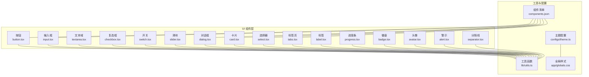
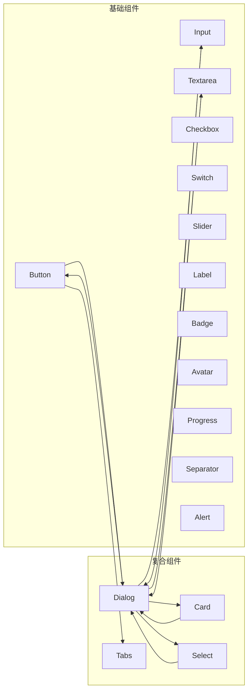
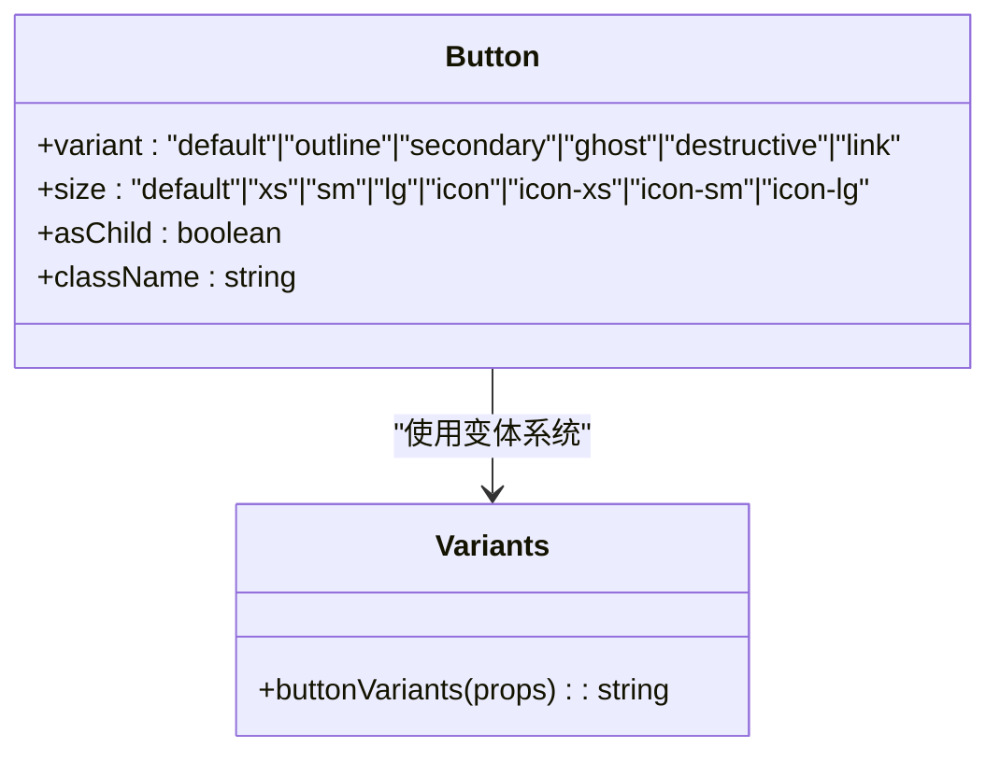
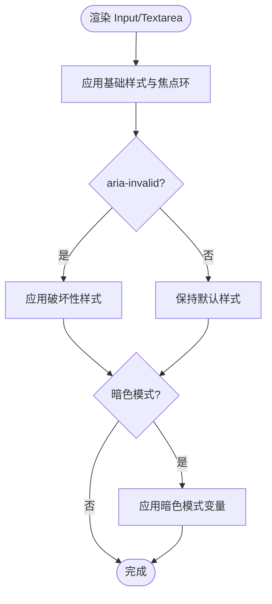
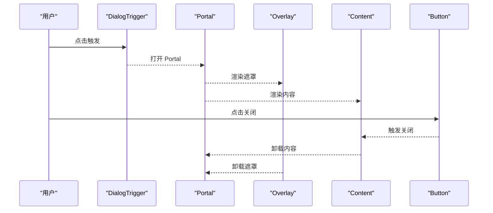
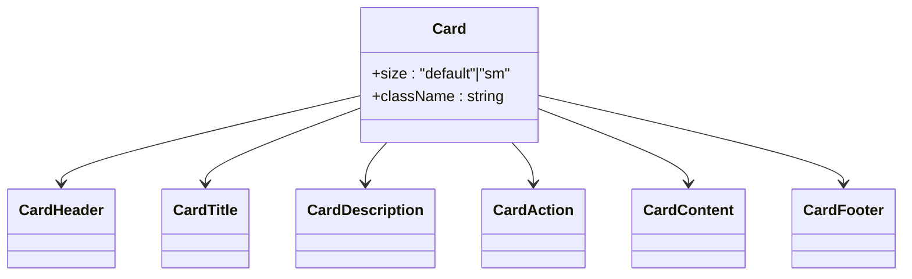
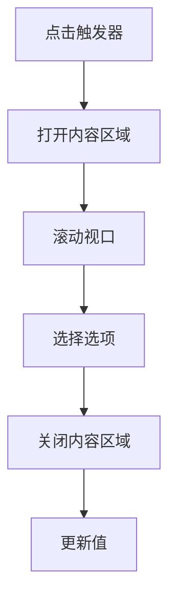
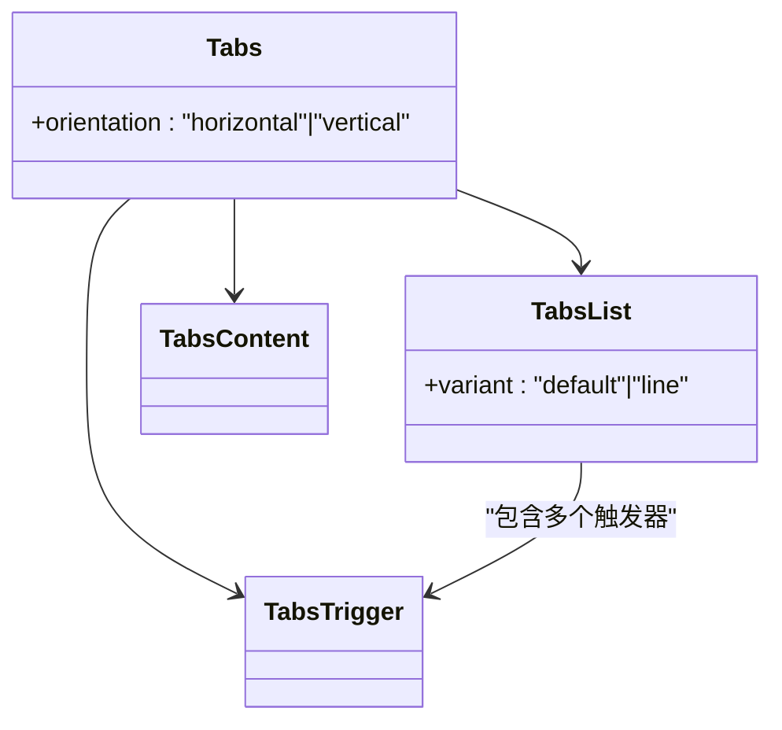
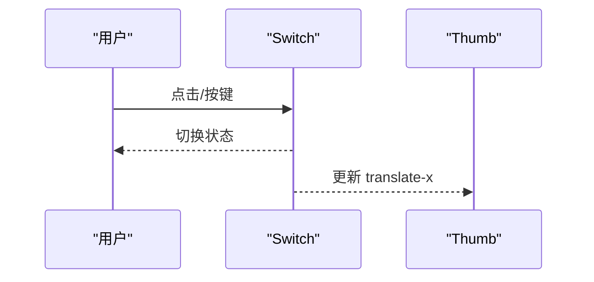
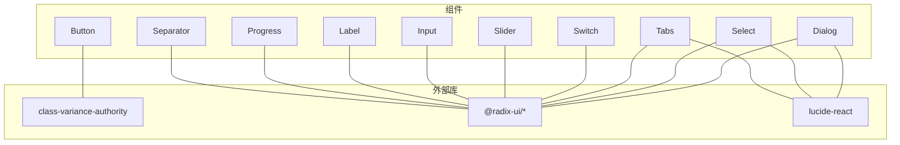

# UI 组件库

<cite>
**本文引用的文件**
- [components/ui/button.tsx](file://components/ui/button.tsx)
- [components/ui/input.tsx](file://components/ui/input.tsx)
- [components/ui/dialog.tsx](file://components/ui/dialog.tsx)
- [components/ui/card.tsx](file://components/ui/card.tsx)
- [components/ui/select.tsx](file://components/ui/select.tsx)
- [components/ui/tabs.tsx](file://components/ui/tabs.tsx)
- [components/ui/switch.tsx](file://components/ui/switch.tsx)
- [components/ui/slider.tsx](file://components/ui/slider.tsx)
- [components/ui/checkbox.tsx](file://components/ui/checkbox.tsx)
- [components/ui/textarea.tsx](file://components/ui/textarea.tsx)
- [components/ui/alert.tsx](file://components/ui/alert.tsx)
- [components/ui/badge.tsx](file://components/ui/badge.tsx)
- [components/ui/avatar.tsx](file://components/ui/avatar.tsx)
- [components/ui/progress.tsx](file://components/ui/progress.tsx)
- [components/ui/separator.tsx](file://components/ui/separator.tsx)
- [components/ui/label.tsx](file://components/ui/label.tsx)
- [lib/utils.ts](file://lib/utils.ts)
- [configs/theme.ts](file://configs/theme.ts)
- [app/globals.css](file://app/globals.css)
- [components.json](file://components.json)
</cite>

## 目录
1. [引言](#引言)
2. [项目结构](#项目结构)
3. [核心组件](#核心组件)
4. [架构总览](#架构总览)
5. [详细组件分析](#详细组件分析)
6. [依赖关系分析](#依赖关系分析)
7. [性能考量](#性能考量)
8. [故障排查指南](#故障排查指南)
9. [结论](#结论)
10. [附录](#附录)

## 引言
本文件为 OpenMAIC 项目 UI 组件库的系统化技术文档，覆盖组件分类、设计系统与主题体系、基础与复合组件实现、属性系统与类型安全、样式系统与主题定制、状态管理与事件处理、组件组合模式、无障碍访问支持以及测试策略。内容以仓库中实际组件为依据，结合工程化实践，帮助开发者快速理解与扩展组件库。

## 项目结构
UI 组件集中于 components/ui 目录，采用“原子化 + 复合组件”的分层组织方式：基础元素（如按钮、输入、开关）作为原子组件；复合组件（如对话框、标签页、选择器）由原子组件与语义容器组合而成。组件广泛使用 class-variance-authority 进行变体控制，配合 Radix UI 原子能力实现可访问性与可组合性。

图表来源
- [components/ui/button.tsx:1-68](file://components/ui/button.tsx#L1-L68)
- [components/ui/input.tsx:1-20](file://components/ui/input.tsx#L1-L20)
- [components/ui/dialog.tsx:1-143](file://components/ui/dialog.tsx#L1-L143)
- [components/ui/card.tsx:1-93](file://components/ui/card.tsx#L1-L93)
- [components/ui/select.tsx:1-185](file://components/ui/select.tsx#L1-L185)
- [components/ui/tabs.tsx:1-81](file://components/ui/tabs.tsx#L1-L81)
- [components/ui/switch.tsx:1-30](file://components/ui/switch.tsx#L1-L30)
- [components/ui/slider.tsx:1-26](file://components/ui/slider.tsx#L1-L26)
- [components/ui/checkbox.tsx:1-29](file://components/ui/checkbox.tsx#L1-L29)
- [components/ui/textarea.tsx:1-19](file://components/ui/textarea.tsx#L1-L19)
- [components/ui/alert.tsx:1-74](file://components/ui/alert.tsx#L1-L74)
- [components/ui/badge.tsx:1-46](file://components/ui/badge.tsx#L1-L46)
- [components/ui/avatar.tsx:1-97](file://components/ui/avatar.tsx#L1-L97)
- [components/ui/progress.tsx:1-32](file://components/ui/progress.tsx#L1-L32)
- [components/ui/separator.tsx:1-29](file://components/ui/separator.tsx#L1-L29)
- [components/ui/label.tsx:1-22](file://components/ui/label.tsx#L1-L22)
- [lib/utils.ts](file://lib/utils.ts)
- [configs/theme.ts](file://configs/theme.ts)
- [app/globals.css](file://app/globals.css)
- [components.json](file://components.json)

章节来源
- [components/ui/button.tsx:1-68](file://components/ui/button.tsx#L1-L68)
- [components/ui/dialog.tsx:1-143](file://components/ui/dialog.tsx#L1-L143)
- [components/ui/card.tsx:1-93](file://components/ui/card.tsx#L1-L93)
- [components/ui/select.tsx:1-185](file://components/ui/select.tsx#L1-L185)
- [components/ui/tabs.tsx:1-81](file://components/ui/tabs.tsx#L1-L81)
- [components/ui/switch.tsx:1-30](file://components/ui/switch.tsx#L1-L30)
- [components/ui/slider.tsx:1-26](file://components/ui/slider.tsx#L1-L26)
- [components/ui/checkbox.tsx:1-29](file://components/ui/checkbox.tsx#L1-L29)
- [components/ui/input.tsx:1-20](file://components/ui/input.tsx#L1-L20)
- [components/ui/textarea.tsx:1-19](file://components/ui/textarea.tsx#L1-L19)
- [components/ui/alert.tsx:1-74](file://components/ui/alert.tsx#L1-L74)
- [components/ui/badge.tsx:1-46](file://components/ui/badge.tsx#L1-L46)
- [components/ui/avatar.tsx:1-97](file://components/ui/avatar.tsx#L1-L97)
- [components/ui/progress.tsx:1-32](file://components/ui/progress.tsx#L1-L32)
- [components/ui/separator.tsx:1-29](file://components/ui/separator.tsx#L1-L29)
- [components/ui/label.tsx:1-22](file://components/ui/label.tsx#L1-L22)
- [lib/utils.ts](file://lib/utils.ts)
- [configs/theme.ts](file://configs/theme.ts)
- [app/globals.css](file://app/globals.css)
- [components.json](file://components.json)

## 核心组件
本节概述 UI 组件库的核心构成与职责边界：
- 基础组件：按钮、输入、文本域、复选框、开关、滑块、标签、进度条、徽章、头像、警示、分隔线等，提供最小可用语义与可访问性。
- 复合组件：对话框、卡片、选择器、标签页等，通过组合基础组件与语义容器实现复杂交互。
- 工具与配置：统一的类名合并工具、主题变量与全局样式、组件清单，保障一致性与可维护性。

章节来源
- [components/ui/button.tsx:1-68](file://components/ui/button.tsx#L1-L68)
- [components/ui/dialog.tsx:1-143](file://components/ui/dialog.tsx#L1-L143)
- [components/ui/card.tsx:1-93](file://components/ui/card.tsx#L1-L93)
- [components/ui/select.tsx:1-185](file://components/ui/select.tsx#L1-L185)
- [components/ui/tabs.tsx:1-81](file://components/ui/tabs.tsx#L1-L81)
- [components/ui/switch.tsx:1-30](file://components/ui/switch.tsx#L1-L30)
- [components/ui/slider.tsx:1-26](file://components/ui/slider.tsx#L1-L26)
- [components/ui/checkbox.tsx:1-29](file://components/ui/checkbox.tsx#L1-L29)
- [components/ui/input.tsx:1-20](file://components/ui/input.tsx#L1-L20)
- [components/ui/textarea.tsx:1-19](file://components/ui/textarea.tsx#L1-L19)
- [components/ui/alert.tsx:1-74](file://components/ui/alert.tsx#L1-L74)
- [components/ui/badge.tsx:1-46](file://components/ui/badge.tsx#L1-L46)
- [components/ui/avatar.tsx:1-97](file://components/ui/avatar.tsx#L1-L97)
- [components/ui/progress.tsx:1-32](file://components/ui/progress.tsx#L1-L32)
- [components/ui/separator.tsx:1-29](file://components/ui/separator.tsx#L1-L29)
- [components/ui/label.tsx:1-22](file://components/ui/label.tsx#L1-L22)
- [lib/utils.ts](file://lib/utils.ts)
- [configs/theme.ts](file://configs/theme.ts)
- [app/globals.css](file://app/globals.css)
- [components.json](file://components.json)

## 架构总览
组件库遵循“可访问性优先 + 变体驱动 + 组合优先”的设计原则：
- 可访问性：基于 Radix UI 的语义与键盘交互，确保焦点管理、ARIA 属性与屏幕阅读器友好。
- 变体驱动：使用 class-variance-authority 管理尺寸、风格与状态变体，保证一致的外观与行为。
- 组合优先：通过 Slot、Portal、Root/Trigger/Content 等模式，将基础组件拼装为复合组件，便于扩展与定制。

图表来源
- [components/ui/button.tsx:1-68](file://components/ui/button.tsx#L1-L68)
- [components/ui/dialog.tsx:1-143](file://components/ui/dialog.tsx#L1-L143)
- [components/ui/card.tsx:1-93](file://components/ui/card.tsx#L1-L93)
- [components/ui/select.tsx:1-185](file://components/ui/select.tsx#L1-L185)
- [components/ui/tabs.tsx:1-81](file://components/ui/tabs.tsx#L1-L81)
- [components/ui/input.tsx:1-20](file://components/ui/input.tsx#L1-L20)
- [components/ui/textarea.tsx:1-19](file://components/ui/textarea.tsx#L1-L19)
- [components/ui/checkbox.tsx:1-29](file://components/ui/checkbox.tsx#L1-L29)
- [components/ui/switch.tsx:1-30](file://components/ui/switch.tsx#L1-L30)
- [components/ui/slider.tsx:1-26](file://components/ui/slider.tsx#L1-L26)
- [components/ui/label.tsx:1-22](file://components/ui/label.tsx#L1-L22)
- [components/ui/badge.tsx:1-46](file://components/ui/badge.tsx#L1-L46)
- [components/ui/avatar.tsx:1-97](file://components/ui/avatar.tsx#L1-L97)
- [components/ui/progress.tsx:1-32](file://components/ui/progress.tsx#L1-L32)
- [components/ui/separator.tsx:1-29](file://components/ui/separator.tsx#L1-L29)
- [components/ui/alert.tsx:1-74](file://components/ui/alert.tsx#L1-L74)

## 详细组件分析

### 按钮 Button
- 设计要点
  - 使用变体系统控制风格（默认、描边、次级、幽静、破坏性、链接），尺寸系统控制高度与内边距。
  - 支持 asChild 模式，允许将按钮渲染为任意元素或 Slot，增强组合灵活性。
  - 通过数据属性 slot/variant/size 与类名系统联动，便于主题与样式覆盖。
- 关键实现路径
  - 变体定义与默认值：[components/ui/button.tsx:7-42](file://components/ui/button.tsx#L7-L42)
  - 渲染与属性透传：[components/ui/button.tsx:44-65](file://components/ui/button.tsx#L44-L65)
  - 类名合并工具：[lib/utils.ts](file://lib/utils.ts)

图表来源
- [components/ui/button.tsx:7-42](file://components/ui/button.tsx#L7-L42)
- [components/ui/button.tsx:44-65](file://components/ui/button.tsx#L44-L65)
- [lib/utils.ts](file://lib/utils.ts)

章节来源
- [components/ui/button.tsx:1-68](file://components/ui/button.tsx#L1-L68)
- [lib/utils.ts](file://lib/utils.ts)

### 输入 Input 与 Textarea
- 设计要点
  - 统一的边框、阴影、聚焦环与禁用态样式，支持 aria-invalid 与暗色模式适配。
  - 通过 data-slot 标记与类名系统，确保在表单场景中的可访问性与可测试性。
- 关键实现路径
  - 输入框样式与属性透传：[components/ui/input.tsx:5-17](file://components/ui/input.tsx#L5-L17)
  - 文本域样式与属性透传：[components/ui/textarea.tsx:5-16](file://components/ui/textarea.tsx#L5-L16)

图表来源
- [components/ui/input.tsx:5-17](file://components/ui/input.tsx#L5-L17)
- [components/ui/textarea.tsx:5-16](file://components/ui/textarea.tsx#L5-L16)

章节来源
- [components/ui/input.tsx:1-20](file://components/ui/input.tsx#L1-L20)
- [components/ui/textarea.tsx:1-19](file://components/ui/textarea.tsx#L1-L19)

### 对话框 Dialog
- 设计要点
  - 基于 Radix UI 的 Root/Trigger/Portal/Overlay/Content/Close 组合，提供模态遮罩、动画与关闭按钮。
  - 支持 showCloseButton 控制是否显示关闭按钮，并通过 Button 组合实现一致的交互体验。
  - 通过 data-slot 标记各子组件，便于主题与测试定位。
- 关键实现路径
  - 根与触发器封装：[components/ui/dialog.tsx:10-16](file://components/ui/dialog.tsx#L10-L16)
  - 遮罩与内容区域：[components/ui/dialog.tsx:26-73](file://components/ui/dialog.tsx#L26-L73)
  - 页眉与页脚容器：[components/ui/dialog.tsx:75-103](file://components/ui/dialog.tsx#L75-L103)
  - 标题与描述：[components/ui/dialog.tsx:105-129](file://components/ui/dialog.tsx#L105-L129)

图表来源
- [components/ui/dialog.tsx:10-16](file://components/ui/dialog.tsx#L10-L16)
- [components/ui/dialog.tsx:26-73](file://components/ui/dialog.tsx#L26-L73)
- [components/ui/dialog.tsx:75-103](file://components/ui/dialog.tsx#L75-L103)
- [components/ui/dialog.tsx:105-129](file://components/ui/dialog.tsx#L105-L129)
- [components/ui/button.tsx:1-68](file://components/ui/button.tsx#L1-L68)

章节来源
- [components/ui/dialog.tsx:1-143](file://components/ui/dialog.tsx#L1-L143)
- [components/ui/button.tsx:1-68](file://components/ui/button.tsx#L1-L68)

### 卡片 Card
- 设计要点
  - 通过 data-size 控制尺寸，内部网格布局自动适配标题、描述、操作与内容区域。
  - 支持带图区块首尾圆角与响应式间距，满足信息卡片与面板场景。
- 关键实现路径
  - 卡片根容器与尺寸控制：[components/ui/card.tsx:5-21](file://components/ui/card.tsx#L5-L21)
  - 页眉、标题、描述、操作、内容、页脚：[components/ui/card.tsx:23-90](file://components/ui/card.tsx#L23-L90)

图表来源
- [components/ui/card.tsx:5-21](file://components/ui/card.tsx#L5-L21)
- [components/ui/card.tsx:23-90](file://components/ui/card.tsx#L23-L90)

章节来源
- [components/ui/card.tsx:1-93](file://components/ui/card.tsx#L1-L93)

### 选择器 Select
- 设计要点
  - Trigger 提供尺寸与占位符样式，Content 支持 popper 与 item-aligned 两种定位模式，Viewport 自适应高度。
  - Item 包含指示器与文本，支持滚动按钮与分隔线，满足长列表场景。
- 关键实现路径
  - 触发器与图标：[components/ui/select.tsx:27-51](file://components/ui/select.tsx#L27-L51)
  - 内容区域与视口：[components/ui/select.tsx:53-88](file://components/ui/select.tsx#L53-L88)
  - 选项项与指示器：[components/ui/select.tsx:100-122](file://components/ui/select.tsx#L100-L122)
  - 滚动按钮与分隔线：[components/ui/select.tsx:137-171](file://components/ui/select.tsx#L137-L171)

图表来源
- [components/ui/select.tsx:27-51](file://components/ui/select.tsx#L27-L51)
- [components/ui/select.tsx:53-88](file://components/ui/select.tsx#L53-L88)
- [components/ui/select.tsx:100-122](file://components/ui/select.tsx#L100-L122)
- [components/ui/select.tsx:137-171](file://components/ui/select.tsx#L137-L171)

章节来源
- [components/ui/select.tsx:1-185](file://components/ui/select.tsx#L1-L185)

### 标签页 Tabs
- 设计要点
  - 支持水平与垂直方向，TabsList 提供默认与线状两种变体，TabsTrigger 带有活动态指示器。
  - 通过 data-orientation 与 data-variant 控制布局与视觉风格。
- 关键实现路径
  - 根容器与方向：[components/ui/tabs.tsx:9-22](file://components/ui/tabs.tsx#L9-L22)
  - 列表变体系统：[components/ui/tabs.tsx:24-37](file://components/ui/tabs.tsx#L24-L37)
  - 触发器与内容区：[components/ui/tabs.tsx:54-78](file://components/ui/tabs.tsx#L54-L78)

图表来源
- [components/ui/tabs.tsx:9-22](file://components/ui/tabs.tsx#L9-L22)
- [components/ui/tabs.tsx:24-37](file://components/ui/tabs.tsx#L24-L37)
- [components/ui/tabs.tsx:54-78](file://components/ui/tabs.tsx#L54-L78)

章节来源
- [components/ui/tabs.tsx:1-81](file://components/ui/tabs.tsx#L1-L81)

### 开关 Switch 与滑块 Slider
- 设计要点
  - Switch 使用 Thumb 动画切换状态，Slider 提供 Track 与 Range 表示范围，均具备禁用态与焦点环。
- 关键实现路径
  - 开关组件：[components/ui/switch.tsx:8-26](file://components/ui/switch.tsx#L8-L26)
  - 滑块组件：[components/ui/slider.tsx:8-22](file://components/ui/slider.tsx#L8-L22)

图表来源
- [components/ui/switch.tsx:8-26](file://components/ui/switch.tsx#L8-L26)
- [components/ui/slider.tsx:8-22](file://components/ui/slider.tsx#L8-L22)

章节来源
- [components/ui/switch.tsx:1-30](file://components/ui/switch.tsx#L1-L30)
- [components/ui/slider.tsx:1-26](file://components/ui/slider.tsx#L1-L26)

### 复选框 Checkbox
- 设计要点
  - Indicator 内部渲染勾选图标，支持禁用态与选中态颜色映射。
- 关键实现路径
  - 复选框组件：[components/ui/checkbox.tsx:9-25](file://components/ui/checkbox.tsx#L9-L25)

章节来源
- [components/ui/checkbox.tsx:1-29](file://components/ui/checkbox.tsx#L1-L29)

### 其他基础组件
- 标签 Label：提供可点击标签语义与禁用态样式。[components/ui/label.tsx:8-18](file://components/ui/label.tsx#L8-L18)
- 徽章 Badge：支持多种变体与 asChild 渲染。[components/ui/badge.tsx:27-43](file://components/ui/badge.tsx#L27-L43)
- 头像 Avatar：支持多尺寸、头像组与徽标。[components/ui/avatar.tsx:8-52](file://components/ui/avatar.tsx#L8-L52)
- 进度条 Progress：根据数值动态计算指示器偏移。[components/ui/progress.tsx:8-29](file://components/ui/progress.tsx#L8-L29)
- 分隔线 Separator：支持水平/垂直方向与装饰性属性。[components/ui/separator.tsx:8-25](file://components/ui/separator.tsx#L8-L25)
- 警示 Alert：支持默认与破坏性变体，标题/描述/操作区域。[components/ui/alert.tsx:22-71](file://components/ui/alert.tsx#L22-L71)

章节来源
- [components/ui/label.tsx:1-22](file://components/ui/label.tsx#L1-L22)
- [components/ui/badge.tsx:1-46](file://components/ui/badge.tsx#L1-L46)
- [components/ui/avatar.tsx:1-97](file://components/ui/avatar.tsx#L1-L97)
- [components/ui/progress.tsx:1-32](file://components/ui/progress.tsx#L1-L32)
- [components/ui/separator.tsx:1-29](file://components/ui/separator.tsx#L1-L29)
- [components/ui/alert.tsx:1-74](file://components/ui/alert.tsx#L1-L74)

## 依赖关系分析
- 组件间耦合
  - 复合组件（Dialog、Select、Tabs）依赖基础组件（Button、Input、Label 等）进行组合，耦合度低、内聚性强。
  - 通过 data-slot 与变体系统，组件对外暴露稳定的接口，便于主题与测试。
- 外部依赖
  - class-variance-authority：变体系统与默认值管理。
  - radix-ui/*：可访问性原语（Dialog、Select、Tabs、Switch、Slider、Checkbox、Label、Progress、Separator）。
  - lucide-react：图标库，用于关闭按钮、下拉箭头等。
- 工具与配置
  - lib/utils：类名合并工具，贯穿所有组件。
  - configs/theme.ts 与 app/globals.css：主题变量与全局样式注入。
  - components.json：组件清单，指导 IDE 与文档生成。

图表来源
- [components/ui/button.tsx:1-6](file://components/ui/button.tsx#L1-L6)
- [components/ui/dialog.tsx:1-8](file://components/ui/dialog.tsx#L1-L8)
- [components/ui/select.tsx:1-7](file://components/ui/select.tsx#L1-L7)
- [components/ui/tabs.tsx:1-7](file://components/ui/tabs.tsx#L1-L7)
- [components/ui/switch.tsx:1-6](file://components/ui/switch.tsx#L1-L6)
- [components/ui/slider.tsx:1-6](file://components/ui/slider.tsx#L1-L6)
- [components/ui/input.tsx:1-3](file://components/ui/input.tsx#L1-L3)
- [components/ui/label.tsx:1-6](file://components/ui/label.tsx#L1-L6)
- [components/ui/progress.tsx:1-6](file://components/ui/progress.tsx#L1-L6)
- [components/ui/separator.tsx:1-6](file://components/ui/separator.tsx#L1-L6)

章节来源
- [components/ui/button.tsx:1-6](file://components/ui/button.tsx#L1-L6)
- [components/ui/dialog.tsx:1-8](file://components/ui/dialog.tsx#L1-L8)
- [components/ui/select.tsx:1-7](file://components/ui/select.tsx#L1-L7)
- [components/ui/tabs.tsx:1-7](file://components/ui/tabs.tsx#L1-L7)
- [components/ui/switch.tsx:1-6](file://components/ui/switch.tsx#L1-L6)
- [components/ui/slider.tsx:1-6](file://components/ui/slider.tsx#L1-L6)
- [components/ui/input.tsx:1-3](file://components/ui/input.tsx#L1-L3)
- [components/ui/label.tsx:1-6](file://components/ui/label.tsx#L1-L6)
- [components/ui/progress.tsx:1-6](file://components/ui/progress.tsx#L1-L6)
- [components/ui/separator.tsx:1-6](file://components/ui/separator.tsx#L1-L6)

## 性能考量
- 渲染优化
  - 使用 asChild 模式减少多余 DOM 层级，降低重排与重绘成本。
  - 变体系统按需合并类名，避免运行时复杂计算。
- 可访问性与可测试性
  - 通过 data-slot 标记与语义化标签，提升自动化测试与可访问性检测效率。
- 主题与样式
  - CSS 变量与暗色模式变量集中管理，减少样式切换抖动与回流。

## 故障排查指南
- 样式不生效
  - 检查类名合并工具调用与 data-slot 标记是否正确。
  - 确认主题变量与全局样式已加载。
- 可访问性问题
  - 确保使用语义化标签与正确的 role/aria-* 属性。
  - 检查焦点顺序与键盘可达性。
- 复合组件异常
  - 核对 Portal、Overlay 与 Content 的层级关系与动画配置。
  - 检查 Trigger 与 Content 的数据槽标记是否匹配。

章节来源
- [lib/utils.ts](file://lib/utils.ts)
- [configs/theme.ts](file://configs/theme.ts)
- [app/globals.css](file://app/globals.css)
- [components/ui/dialog.tsx:10-16](file://components/ui/dialog.tsx#L10-L16)
- [components/ui/dialog.tsx:26-73](file://components/ui/dialog.tsx#L26-L73)

## 结论
OpenMAIC 的 UI 组件库以可访问性为核心、以变体系统为骨架、以组合模式为手段，构建了高内聚、低耦合且易于扩展的组件体系。通过统一的工具与主题配置，组件在不同场景下保持一致的外观与行为，同时为测试与维护提供了坚实基础。

## 附录
- 组件清单与注册
  - 组件清单文件用于 IDE 与文档生成，确保新增组件可被识别与索引。[components.json](file://components.json)
- 主题与样式
  - 主题配置与全局样式共同决定组件的视觉表现与暗色模式支持。[configs/theme.ts](file://configs/theme.ts)、[app/globals.css](file://app/globals.css)
- 类名合并工具
  - 统一的工具函数负责类名合并与条件样式拼接，贯穿所有组件。[lib/utils.ts](file://lib/utils.ts)