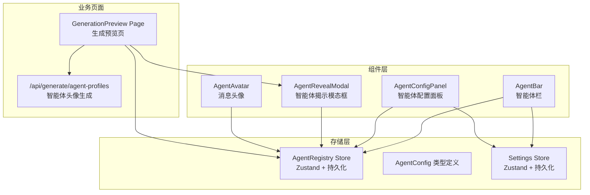
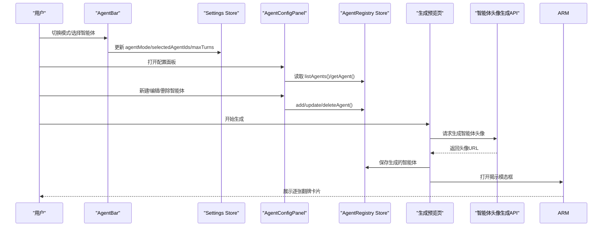
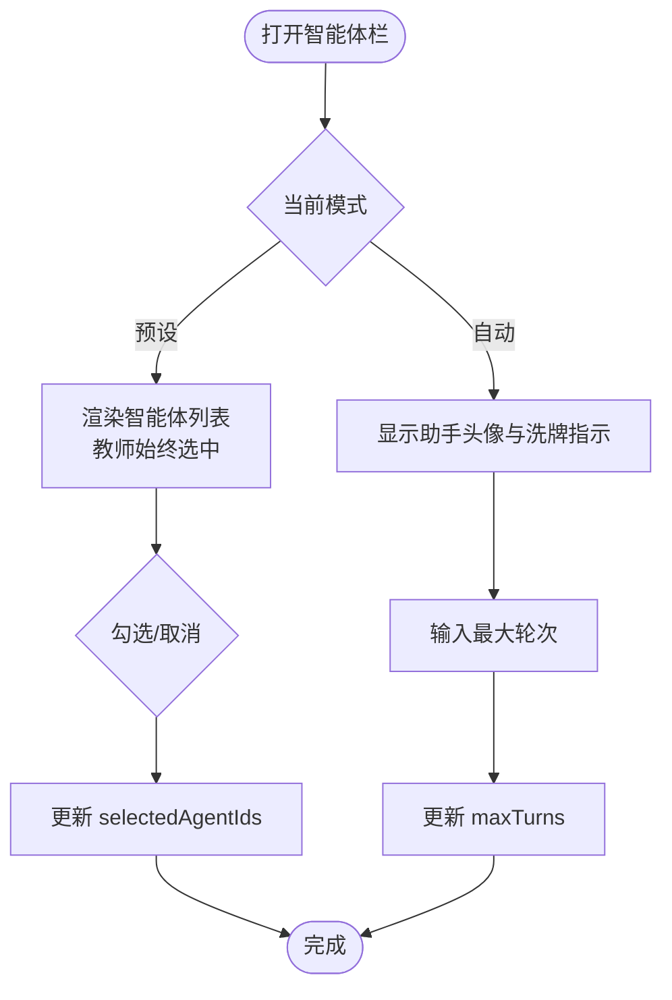
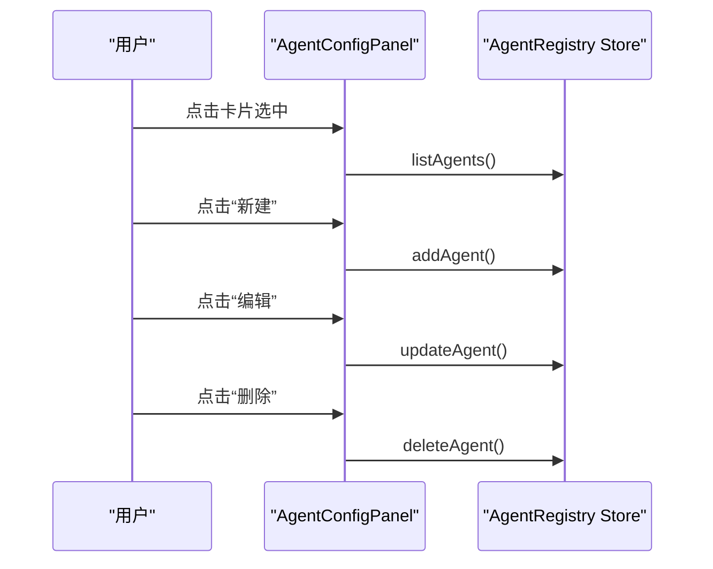
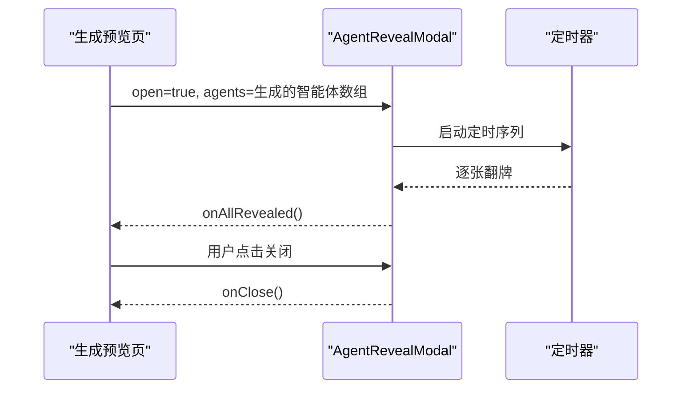
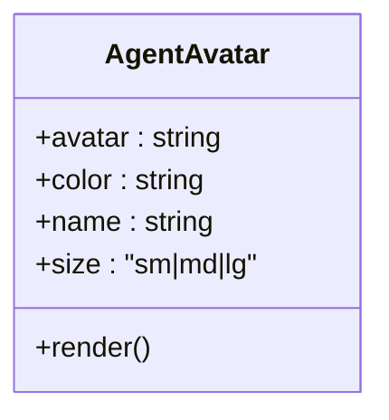
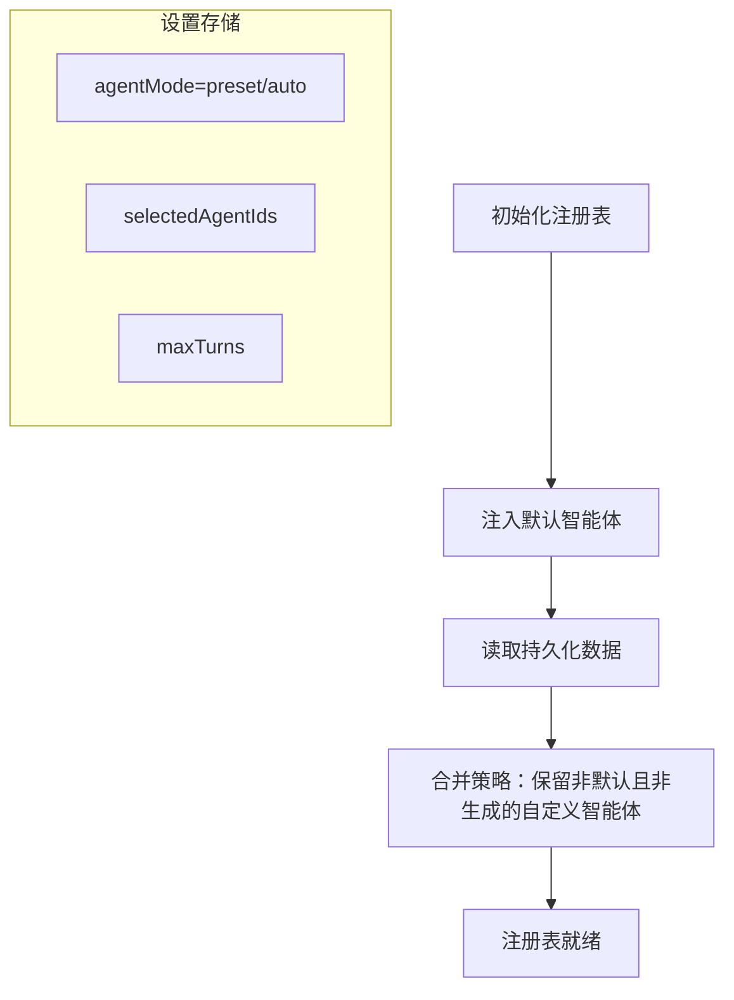
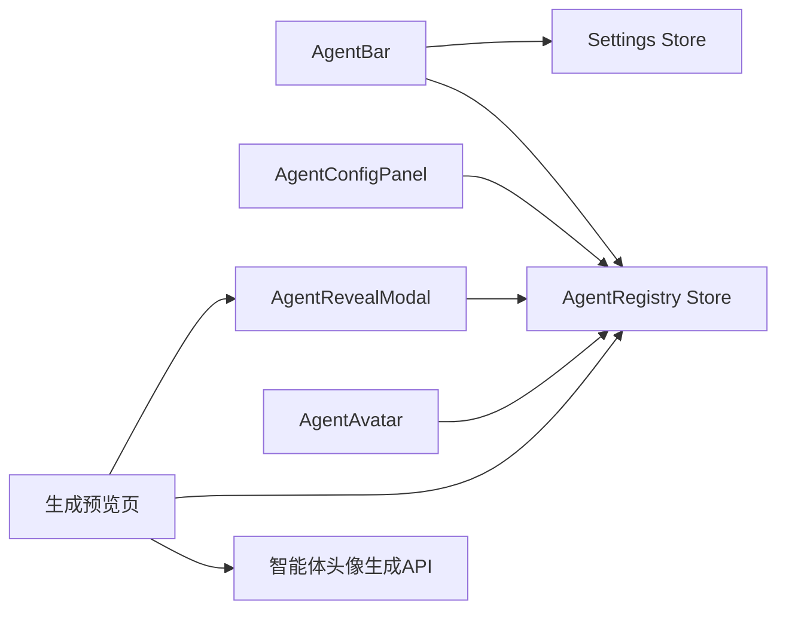

# 智能体管理

<cite>
**本文引用的文件**
- [components/agent/agent-bar.tsx](file://components/agent/agent-bar.tsx)
- [components/agent/agent-config-panel.tsx](file://components/agent/agent-config-panel.tsx)
- [components/agent/agent-reveal-modal.tsx](file://components/agent/agent-reveal-modal.tsx)
- [components/agent/agent-avatar.tsx](file://components/agent/agent-avatar.tsx)
- [lib/orchestration/registry/store.ts](file://lib/orchestration/registry/store.ts)
- [lib/orchestration/registry/types.ts](file://lib/orchestration/registry/types.ts)
- [lib/store/settings.ts](file://lib/store/settings.ts)
- [app/generation-preview/page.tsx](file://app/generation-preview/page.tsx)
- [app/api/generate/agent-profiles/route.ts](file://app/api/generate/agent-profiles/route.ts)
</cite>

## 目录
1. [简介](#简介)
2. [项目结构](#项目结构)
3. [核心组件](#核心组件)
4. [架构总览](#架构总览)
5. [详细组件分析](#详细组件分析)
6. [依赖关系分析](#依赖关系分析)
7. [性能考量](#性能考量)
8. [故障排查指南](#故障排查指南)
9. [结论](#结论)
10. [附录](#附录)

## 简介
本文件面向“智能体管理”主题，系统性梳理前端智能体管理界面的架构与实现，覆盖以下关键点：
- 智能体状态显示：在线/离线、活跃/非活跃、错误等状态的视觉呈现
- 配置管理：智能体列表、增删改查、参数调整、行为设置与外观定制
- 交互控制：点击、拖拽（在其他模块中体现）、右键菜单（在其他模块中体现）
- 头像系统：头像生成、自定义上传、样式选择
- 揭示模态框：智能体生成后的逐张翻牌展示、交互与关闭机制
- 状态持久化：设置保存、默认值管理、配置导入导出（概念性说明）

## 项目结构
智能体管理相关代码主要分布在以下位置：
- 组件层：智能体栏、配置面板、揭示模态框、消息中的头像组件
- 存储层：智能体注册表（Zustand + localStorage 持久化）与类型定义
- 设置层：全局设置（Zustand + localStorage 持久化），包含智能体模式、选中智能体、最大轮次等
- 业务页面：生成预览页集成智能体生成与揭示流程
- 后端接口：智能体头像生成 API

图表来源
- [components/agent/agent-bar.tsx:14-305](file://components/agent/agent-bar.tsx#L14-L305)
- [components/agent/agent-config-panel.tsx:17-153](file://components/agent/agent-config-panel.tsx#L17-L153)
- [components/agent/agent-reveal-modal.tsx:45-404](file://components/agent/agent-reveal-modal.tsx#L45-L404)
- [components/agent/agent-avatar.tsx:20-49](file://components/agent/agent-avatar.tsx#L20-L49)
- [lib/orchestration/registry/store.ts:189-398](file://lib/orchestration/registry/store.ts#L189-L398)
- [lib/orchestration/registry/types.ts:6-87](file://lib/orchestration/registry/types.ts#L6-L87)
- [lib/store/settings.ts:421-800](file://lib/store/settings.ts#L421-L800)
- [app/generation-preview/page.tsx:376-1015](file://app/generation-preview/page.tsx#L376-L1015)
- [app/api/generate/agent-profiles/route.ts:55-82](file://app/api/generate/agent-profiles/route.ts#L55-L82)

章节来源
- [components/agent/agent-bar.tsx:14-305](file://components/agent/agent-bar.tsx#L14-L305)
- [components/agent/agent-config-panel.tsx:17-153](file://components/agent/agent-config-panel.tsx#L17-L153)
- [components/agent/agent-reveal-modal.tsx:45-404](file://components/agent/agent-reveal-modal.tsx#L45-L404)
- [components/agent/agent-avatar.tsx:20-49](file://components/agent/agent-avatar.tsx#L20-L49)
- [lib/orchestration/registry/store.ts:189-398](file://lib/orchestration/registry/store.ts#L189-L398)
- [lib/orchestration/registry/types.ts:6-87](file://lib/orchestration/registry/types.ts#L6-L87)
- [lib/store/settings.ts:421-800](file://lib/store/settings.ts#L421-L800)
- [app/generation-preview/page.tsx:376-1015](file://app/generation-preview/page.tsx#L376-L1015)
- [app/api/generate/agent-profiles/route.ts:55-82](file://app/api/generate/agent-profiles/route.ts#L55-L82)

## 核心组件
- 智能体栏（AgentBar）：折叠展开的智能体选择器，支持预设模式与自动模式；显示教师头像与选中智能体缩略图；提供最大轮次输入。
- 智能体配置面板（AgentConfigPanel）：列出所有智能体，支持新建、编辑、删除；展示名称、角色、优先级、可用动作等元信息。
- 智能体揭示模态框（AgentRevealModal）：生成后逐张翻牌展示智能体卡片，支持关闭与继续。
- 消息头像（AgentAvatar）：在聊天消息中展示智能体头像与名称，支持尺寸与颜色。

章节来源
- [components/agent/agent-bar.tsx:14-305](file://components/agent/agent-bar.tsx#L14-L305)
- [components/agent/agent-config-panel.tsx:17-153](file://components/agent/agent-config-panel.tsx#L17-L153)
- [components/agent/agent-reveal-modal.tsx:45-404](file://components/agent/agent-reveal-modal.tsx#L45-L404)
- [components/agent/agent-avatar.tsx:20-49](file://components/agent/agent-avatar.tsx#L20-L49)

## 架构总览
智能体管理采用“组件 + 存储 + 设置 + 页面”的分层架构：
- 组件层负责用户交互与展示
- 存储层（注册表）统一管理智能体配置，并与本地持久化结合
- 设置层集中管理智能体模式、选中集合、最大轮次等全局偏好
- 页面层串联生成与揭示流程，调用后端接口生成智能体头像

图表来源
- [components/agent/agent-bar.tsx:46-80](file://components/agent/agent-bar.tsx#L46-L80)
- [lib/store/settings.ts:505-509](file://lib/store/settings.ts#L505-L509)
- [components/agent/agent-config-panel.tsx:18-29](file://components/agent/agent-config-panel.tsx#L18-L29)
- [lib/orchestration/registry/store.ts:195-217](file://lib/orchestration/registry/store.ts#L195-L217)
- [app/generation-preview/page.tsx:376-1015](file://app/generation-preview/page.tsx#L376-L1015)
- [app/api/generate/agent-profiles/route.ts:55-82](file://app/api/generate/agent-profiles/route.ts#L55-L82)

## 详细组件分析

### 智能体栏（AgentBar）
- 功能要点
  - 折叠/展开：点击头部按钮切换面板显隐，使用动画过渡
  - 模式切换：预设模式（固定默认智能体+可选自定义）与自动模式（随机生成）
  - 教师头像：始终显示，不可取消
  - 选中智能体：在预设模式下可勾选/取消；在自动模式下显示助手头像与“洗牌”指示
  - 最大轮次：数字输入框，限制对话轮次
  - 点击外部收起：点击文档空白处自动折叠
- 状态与数据流
  - 从设置存储读取 agentMode、selectedAgentIds、maxTurns
  - 通过设置存储更新上述状态
  - 从注册表读取智能体列表，过滤默认与生成智能体
- 交互细节
  - 预设模式强制保留教师角色
  - 自动模式下以“洗牌”图标提示动态生成
  - 头像堆叠显示，超过数量时以“+N”徽标提示

图表来源
- [components/agent/agent-bar.tsx:46-80](file://components/agent/agent-bar.tsx#L46-L80)
- [lib/store/settings.ts:505-509](file://lib/store/settings.ts#L505-L509)

章节来源
- [components/agent/agent-bar.tsx:14-305](file://components/agent/agent-bar.tsx#L14-L305)
- [lib/store/settings.ts:505-509](file://lib/store/settings.ts#L505-L509)

### 智能体配置面板（AgentConfigPanel）
- 功能要点
  - 列表展示：名称、角色、颜色边框、优先级徽章、默认标记
  - 能力描述与可用动作：展示 persona 摘要与允许动作集合
  - 操作：新建、编辑、删除（删除带确认）
  - 选中态：点击卡片高亮，便于后续操作
- 数据来源
  - 从注册表读取 listAgents()
  - 删除时同步更新选中项

图表来源
- [components/agent/agent-config-panel.tsx:18-29](file://components/agent/agent-config-panel.tsx#L18-L29)
- [lib/orchestration/registry/store.ts:195-217](file://lib/orchestration/registry/store.ts#L195-L217)

章节来源
- [components/agent/agent-config-panel.tsx:17-153](file://components/agent/agent-config-panel.tsx#L17-L153)
- [lib/orchestration/registry/store.ts:195-217](file://lib/orchestration/registry/store.ts#L195-L217)

### 智能体揭示模态框（AgentRevealModal）
- 功能要点
  - 逐张翻牌展示：按时间间隔依次翻转卡片，最后统一进入平面布局以支持滚动
  - 关闭机制：全部翻牌完成后显示关闭按钮，点击关闭
  - 视觉设计：卡片正面展示头像、姓名、角色、persona；背面为神秘图案
  - 回调：全部翻牌完成后触发 onAllRevealed，用于继续后续流程
- 状态与生命周期
  - 基于 open 状态驱动动画序列
  - 使用计时器与状态机控制翻牌进度与最终切换到平面布局

图表来源
- [components/agent/agent-reveal-modal.tsx:55-103](file://components/agent/agent-reveal-modal.tsx#L55-L103)
- [app/generation-preview/page.tsx:1004-1012](file://app/generation-preview/page.tsx#L1004-L1012)

章节来源
- [components/agent/agent-reveal-modal.tsx:45-404](file://components/agent/agent-reveal-modal.tsx#L45-L404)
- [app/generation-preview/page.tsx:1004-1012](file://app/generation-preview/page.tsx#L1004-L1012)

### 智能体头像系统（AgentAvatar）
- 功能要点
  - 支持 URL 与 Emoji 两种头像源
  - 根据颜色生成边框与占位色块
  - 尺寸可选：sm/md/lg
- 适用场景
  - 消息气泡中的智能体标识，配合名称显示

图表来源
- [components/agent/agent-avatar.tsx:20-49](file://components/agent/agent-avatar.tsx#L20-L49)

章节来源
- [components/agent/agent-avatar.tsx:20-49](file://components/agent/agent-avatar.tsx#L20-L49)

### 智能体状态管理（注册表与设置）
- 注册表（AgentRegistry Store）
  - 默认智能体：内置多类角色（教师、助教、学生等），始终可用
  - 自定义智能体：持久化存储，迁移策略合并默认与持久化数据
  - 生成智能体：按阶段加载/保存，标记 isGenerated 并绑定 stageId
  - 行为权限：根据角色映射允许动作集合
- 设置（Settings Store）
  - 智能体模式：preset/auto
  - 选中智能体：selectedAgentIds
  - 最大轮次：maxTurns
  - 迁移兼容：从旧版 localStorage 迁移到新版结构

图表来源
- [lib/orchestration/registry/store.ts:42-187](file://lib/orchestration/registry/store.ts#L42-L187)
- [lib/orchestration/registry/store.ts:225-243](file://lib/orchestration/registry/store.ts#L225-L243)
- [lib/store/settings.ts:438-441](file://lib/store/settings.ts#L438-L441)
- [lib/store/settings.ts:505-509](file://lib/store/settings.ts#L505-L509)

章节来源
- [lib/orchestration/registry/store.ts:189-398](file://lib/orchestration/registry/store.ts#L189-L398)
- [lib/orchestration/registry/types.ts:6-87](file://lib/orchestration/registry/types.ts#L6-L87)
- [lib/store/settings.ts:421-800](file://lib/store/settings.ts#L421-L800)

### 智能体交互功能
- 点击交互
  - 智能体栏：切换展开/折叠、切换模式、勾选智能体、修改最大轮次
  - 配置面板：选中卡片、新建/编辑/删除
  - 揭示模态框：全部翻牌后显示关闭按钮
- 拖拽与上下文菜单
  - 在本仓库中未发现直接的拖拽与上下文菜单实现；如需扩展，可在现有组件上增加相应事件处理与 UI 元素

章节来源
- [components/agent/agent-bar.tsx:146-176](file://components/agent/agent-bar.tsx#L146-L176)
- [components/agent/agent-config-panel.tsx:52-131](file://components/agent/agent-config-panel.tsx#L52-L131)
- [components/agent/agent-reveal-modal.tsx:117-126](file://components/agent/agent-reveal-modal.tsx#L117-L126)

### 智能体配置持久化
- 设置持久化
  - Settings Store 使用持久化中间件，保存 agentMode、selectedAgentIds、maxTurns 等
  - 迁移逻辑：从旧版 localStorage 结构迁移
- 智能体持久化
  - 注册表持久化：仅保留非默认且非生成的自定义智能体
  - 生成智能体：按阶段写入 IndexedDB，并在注册表中标记 isGenerated
- 导入导出（概念性说明）
  - 当前实现未提供导入导出 UI；可通过扩展注册表的批量导入/导出函数实现

章节来源
- [lib/store/settings.ts:421-800](file://lib/store/settings.ts#L421-L800)
- [lib/orchestration/registry/store.ts:218-245](file://lib/orchestration/registry/store.ts#L218-L245)
- [lib/orchestration/registry/store.ts:318-397](file://lib/orchestration/registry/store.ts#L318-L397)

## 依赖关系分析
- 组件对存储的依赖
  - AgentBar 依赖 Settings Store（模式/选中/轮次）与 AgentRegistry Store（智能体列表）
  - AgentConfigPanel 依赖 AgentRegistry Store（增删改查）
  - AgentRevealModal 依赖 AgentRegistry Store（生成智能体数据）
  - AgentAvatar 依赖 AgentRegistry Store（头像/颜色）
- 页面对组件与存储的依赖
  - 生成预览页串联揭示模态框与注册表，调用后端 API 生成头像

图表来源
- [components/agent/agent-bar.tsx:15-22](file://components/agent/agent-bar.tsx#L15-L22)
- [components/agent/agent-config-panel.tsx:18-19](file://components/agent/agent-config-panel.tsx#L18-L19)
- [components/agent/agent-reveal-modal.tsx:45-46](file://components/agent/agent-reveal-modal.tsx#L45-L46)
- [components/agent/agent-avatar.tsx:20-20](file://components/agent/agent-avatar.tsx#L20-L20)
- [app/generation-preview/page.tsx:1004-1012](file://app/generation-preview/page.tsx#L1004-L1012)
- [app/api/generate/agent-profiles/route.ts:55-82](file://app/api/generate/agent-profiles/route.ts#L55-L82)

章节来源
- [components/agent/agent-bar.tsx:15-22](file://components/agent/agent-bar.tsx#L15-L22)
- [components/agent/agent-config-panel.tsx:18-19](file://components/agent/agent-config-panel.tsx#L18-L19)
- [components/agent/agent-reveal-modal.tsx:45-46](file://components/agent/agent-reveal-modal.tsx#L45-L46)
- [components/agent/agent-avatar.tsx:20-20](file://components/agent/agent-avatar.tsx#L20-L20)
- [app/generation-preview/page.tsx:1004-1012](file://app/generation-preview/page.tsx#L1004-L1012)
- [app/api/generate/agent-profiles/route.ts:55-82](file://app/api/generate/agent-profiles/route.ts#L55-L82)

## 性能考量
- 动画与渲染
  - 智能体栏使用轻量动画与条件渲染，避免不必要的重绘
  - 揭示模态框在全部翻牌完成后切换为平面布局，提升滚动性能
- 存储与迁移
  - 注册表持久化仅保留必要智能体，减少缓存体积
  - 设置存储迁移逻辑避免重复解析与回退
- 数据访问
  - 列表渲染时按需计算（如角色翻译键值），建议在上层进行缓存或预计算

## 故障排查指南
- 智能体未显示或不生效
  - 检查是否处于预设模式且教师未被选中（教师默认必选）
  - 检查注册表是否正确加载默认智能体与自定义智能体
- 揭示模态框不出现
  - 确认生成预览页已正确传入 agents 并触发 open
  - 检查 onAllRevealed 是否被调用
- 头像显示异常
  - 确认头像 URL 或 Emoji 字符有效
  - 检查颜色值格式是否为合法十六进制
- 设置未持久化
  - 检查 Settings Store 的持久化中间件是否启用
  - 如从旧版本迁移，确认迁移逻辑执行成功

章节来源
- [components/agent/agent-bar.tsx:46-80](file://components/agent/agent-bar.tsx#L46-L80)
- [components/agent/agent-reveal-modal.tsx:55-103](file://components/agent/agent-reveal-modal.tsx#L55-L103)
- [lib/store/settings.ts:421-800](file://lib/store/settings.ts#L421-L800)
- [lib/orchestration/registry/store.ts:218-245](file://lib/orchestration/registry/store.ts#L218-L245)

## 结论
智能体管理模块通过清晰的分层设计实现了从界面交互到数据持久化的完整闭环：组件层提供直观的用户操作入口，存储层保障配置与状态的可靠持久化，页面层串联生成与揭示流程。未来可在现有基础上扩展拖拽、上下文菜单与导入导出能力，进一步完善智能体管理体验。

## 附录
- 智能体类型定义与行为映射
  - AgentConfig：包含 id、name、role、persona、avatar、color、allowedActions、priority、时间戳与生成标记
  - 行为映射：根据角色返回允许的动作集合（教师含白板与课件控制，学生/助教仅白板）

章节来源
- [lib/orchestration/registry/types.ts:6-87](file://lib/orchestration/registry/types.ts#L6-L87)