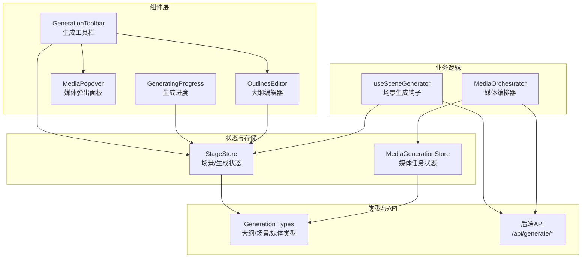
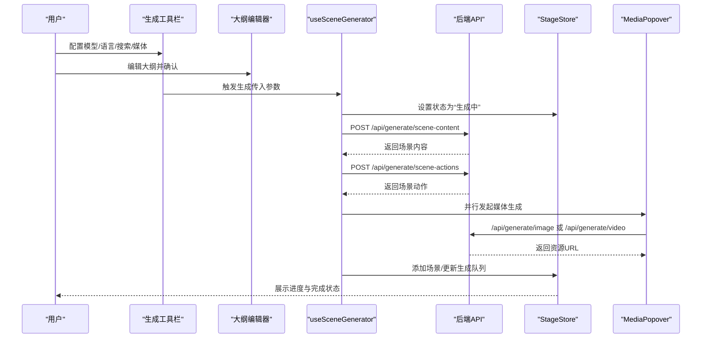
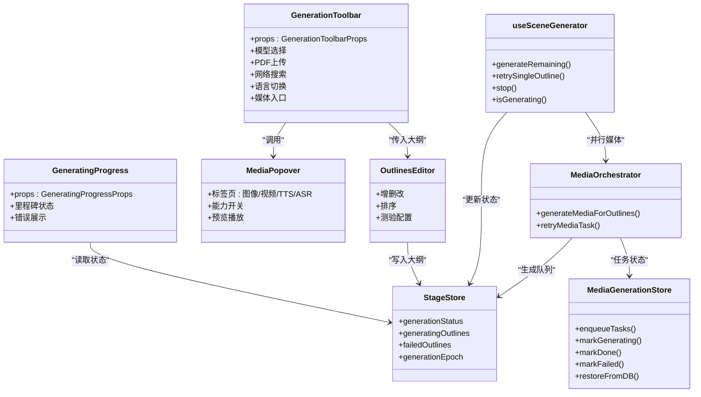

# 生成工具栏

<cite>
**本文引用的文件**
- [generation-toolbar.tsx](file://components/generation/generation-toolbar.tsx)
- [generating-progress.tsx](file://components/generation/generating-progress.tsx)
- [media-popover.tsx](file://components/generation/media-popover.tsx)
- [outlines-editor.tsx](file://components/generation/outlines-editor.tsx)
- [use-scene-generator.ts](file://lib/hooks/use-scene-generator.ts)
- [media-orchestrator.ts](file://lib/media/media-orchestrator.ts)
- [media-generation.ts](file://lib/store/media-generation.ts)
- [stage.ts](file://lib/store/stage.ts)
- [generation.ts](file://lib/types/generation.ts)
</cite>

## 目录
1. [简介](#简介)
2. [项目结构](#项目结构)
3. [核心组件](#核心组件)
4. [架构总览](#架构总览)
5. [详细组件分析](#详细组件分析)
6. [依赖关系分析](#依赖关系分析)
7. [性能考量](#性能考量)
8. [故障排查指南](#故障排查指南)
9. [结论](#结论)
10. [附录](#附录)

## 简介
本文件面向“生成工具栏”相关功能，系统性梳理其架构设计与实现细节，覆盖以下主题：
- 工具栏按钮布局、状态指示与交互逻辑
- 生成进度组件（进度条显示、状态更新、完成回调）
- 媒体弹出面板（媒体选择、预览、参数配置）
- 大纲编辑器（大纲结构编辑、内容管理、格式化选项）
- 工具栏按钮功能实现（生成启动、暂停控制、取消操作）
- 进度跟踪机制（任务队列管理、状态同步、错误处理）
- 用户反馈系统（进度通知、完成提示、失败重试）
- 工具栏自适应设计（响应式布局、触摸友好、键盘导航）

## 项目结构
生成工具栏位于组件层，围绕“大纲生成—场景生成—媒体生成”的三阶段流程组织，配合全局状态存储与API调用，形成完整的生成闭环。

图表来源
- [generation-toolbar.tsx:43-381](file://components/generation/generation-toolbar.tsx#L43-L381)
- [generating-progress.tsx:57-141](file://components/generation/generating-progress.tsx#L57-L141)
- [media-popover.tsx:74-448](file://components/generation/media-popover.tsx#L74-L448)
- [outlines-editor.tsx:27-291](file://components/generation/outlines-editor.tsx#L27-L291)
- [use-scene-generator.ts:316-619](file://lib/hooks/use-scene-generator.ts#L316-L619)
- [media-orchestrator.ts:31-184](file://lib/media/media-orchestrator.ts#L31-L184)
- [media-generation.ts:73-230](file://lib/store/media-generation.ts#L73-L230)
- [stage.ts:98-325](file://lib/store/stage.ts#L98-L325)
- [generation.ts:88-129](file://lib/types/generation.ts#L88-L129)

章节来源
- [generation-toolbar.tsx:43-381](file://components/generation/generation-toolbar.tsx#L43-L381)
- [generating-progress.tsx:57-141](file://components/generation/generating-progress.tsx#L57-L141)
- [media-popover.tsx:74-448](file://components/generation/media-popover.tsx#L74-L448)
- [outlines-editor.tsx:27-291](file://components/generation/outlines-editor.tsx#L27-L291)
- [use-scene-generator.ts:316-619](file://lib/hooks/use-scene-generator.ts#L316-L619)
- [media-orchestrator.ts:31-184](file://lib/media/media-orchestrator.ts#L31-L184)
- [media-generation.ts:73-230](file://lib/store/media-generation.ts#L73-L230)
- [stage.ts:98-325](file://lib/store/stage.ts#L98-L325)
- [generation.ts:88-129](file://lib/types/generation.ts#L88-L129)

## 核心组件
- 生成工具栏（GenerationToolbar）：提供模型选择、PDF上传、网络搜索开关、语言切换、媒体能力配置入口等。
- 生成进度（GeneratingProgress）：展示大纲就绪与首页生成两个里程碑的状态与消息。
- 媒体弹出面板（MediaPopover）：图像/视频/TTS/ASR能力的分页配置与预览。
- 大纲编辑器（OutlinesEditor）：场景大纲的增删改、排序、类型切换与测验配置。
- 场景生成钩子（useSceneGenerator）：两阶段生成（内容→动作）与TTS合成，支持串行生成、暂停/取消、失败重试。
- 媒体编排器（MediaOrchestrator）：并行调度图像/视频生成，持久化结果，驱动渲染骨架。
- 媒体任务存储（MediaGenerationStore）：任务生命周期管理与IndexedDB恢复。
- 场景/生成状态（StageStore）：生成状态机、失败场景追踪、生成轮次（epoch）与UI状态。

章节来源
- [generation-toolbar.tsx:43-381](file://components/generation/generation-toolbar.tsx#L43-L381)
- [generating-progress.tsx:57-141](file://components/generation/generating-progress.tsx#L57-L141)
- [media-popover.tsx:74-448](file://components/generation/media-popover.tsx#L74-L448)
- [outlines-editor.tsx:27-291](file://components/generation/outlines-editor.tsx#L27-L291)
- [use-scene-generator.ts:316-619](file://lib/hooks/use-scene-generator.ts#L316-L619)
- [media-orchestrator.ts:31-184](file://lib/media/media-orchestrator.ts#L31-L184)
- [media-generation.ts:73-230](file://lib/store/media-generation.ts#L73-L230)
- [stage.ts:98-325](file://lib/store/stage.ts#L98-L325)

## 架构总览
生成工具栏作为入口，协调用户输入与生成流程，通过状态存储与钩子函数驱动后端API，最终在渲染层呈现进度与结果。

图表来源
- [generation-toolbar.tsx:43-381](file://components/generation/generation-toolbar.tsx#L43-L381)
- [outlines-editor.tsx:27-291](file://components/generation/outlines-editor.tsx#L27-L291)
- [use-scene-generator.ts:396-484](file://lib/hooks/use-scene-generator.ts#L396-L484)
- [media-orchestrator.ts:104-184](file://lib/media/media-orchestrator.ts#L104-L184)
- [stage.ts:350-364](file://lib/store/stage.ts#L350-L364)

## 详细组件分析

### 生成工具栏（GenerationToolbar）
- 布局与状态
  - 模型选择：两层弹出（提供商→模型），根据可用凭据与服务端配置筛选。
  - PDF上传：拖拽/点击上传，限制大小，显示文件信息与移除按钮。
  - 网络搜索：按可用性启用/禁用，支持切换与提供商选择。
  - 语言切换：中英互切，提示当前语言。
  - 媒体能力入口：聚合图像/视频/TTS/ASR开关与预览。
- 交互逻辑
  - 提供者可用性检测：仅当凭据或服务端配置满足时显示可用。
  - 文件校验：类型检查与大小限制，错误回调。
  - 弹出面板：模型选择器支持钻取与回退，媒体面板自动选择首个已启用标签。
- 状态指示
  - 活跃态与非活跃态：使用“药丸”样式区分当前状态。
  - 提示气泡：对不可用项提供禁用提示。

章节来源
- [generation-toolbar.tsx:43-381](file://components/generation/generation-toolbar.tsx#L43-L381)

### 生成进度（GeneratingProgress）
- 组件构成
  - 里程碑状态项：大纲就绪、首页就绪，分别对应完成/进行中/错误三种图标与颜色。
  - 动画点：未完成且无错误时，显示“…”动画。
  - 错误块：出现错误时以背景色块展示错误文本。
- 状态映射
  - 错误优先：有错误时显示失败标题与错误块。
  - 完成条件：首页就绪时显示“打开课堂”标题与完成图标。
  - 进行中：否则显示“生成课程…”并追加动画点。
- 回调与联动
  - 由上层传入里程碑布尔值与状态消息，组件内部不直接发起请求。

章节来源
- [generating-progress.tsx:57-141](file://components/generation/generating-progress.tsx#L57-L141)

### 媒体弹出面板（MediaPopover）
- 标签页与能力
  - 图像/视频/TTS/ASR四个标签页，每个标签包含能力开关与配置控件。
  - 能力可用性：基于提供商配置是否需要密钥以及密钥或服务端配置是否存在。
- 配置与预览
  - 图像/视频：分组选择（提供商→模型），支持自定义模型列表。
  - TTS：语音选择与速度滑杆，支持预览播放（播放中显示加载动画）。
  - ASR：按提供商列出支持的语言。
- 预览与播放
  - TTS预览：调用后端TTS接口，返回base64音频数据，创建Audio对象播放并自动清理。
- 自动选择与跳转
  - 打开时自动选择首个已启用标签。
  - 底部跳转到设置页面对应标签。

章节来源
- [media-popover.tsx:74-448](file://components/generation/media-popover.tsx#L74-L448)

### 大纲编辑器（OutlinesEditor）
- 结构与功能
  - 场景增删改：添加新场景、删除场景、上下移动排序。
  - 场景属性：标题、类型（幻灯片/测验）、描述、关键要点。
  - 测验配置：题目数量、难度、题型。
- 行为约束
  - 排序更新：移动后同步更新顺序号。
  - 禁用状态：生成进行中时禁用编辑与确认按钮。
- 交互反馈
  - 无大纲时显示占位卡片与引导按钮。
  - 确认按钮在无大纲时禁用。

章节来源
- [outlines-editor.tsx:27-291](file://components/generation/outlines-editor.tsx#L27-L291)

### 工具栏按钮功能实现
- 启动生成
  - 由上层调用生成钩子，传入大纲、PDF图片映射、阶段信息等参数。
  - 钩子内部计算待生成大纲集合，设置生成状态为“生成中”，并串行执行两阶段生成。
- 暂停控制
  - 通过AbortController中断请求，捕获AbortError，将状态设为“暂停”。
- 取消操作
  - 触发停止时增加生成轮次（epoch），同时中止内容/动作与媒体生成请求。
- 失败重试
  - 支持单场景重试：从失败列表取出，重新执行内容→动作→TTS全流程。
  - 媒体任务重试：检查全局能力开关，移除持久化失败记录后重新发起请求。

章节来源
- [use-scene-generator.ts:326-506](file://lib/hooks/use-scene-generator.ts#L326-L506)
- [use-scene-generator.ts:520-616](file://lib/hooks/use-scene-generator.ts#L520-L616)
- [media-orchestrator.ts:69-100](file://lib/media/media-orchestrator.ts#L69-L100)

### 进度跟踪机制
- 任务队列管理
  - 待生成大纲：根据已完成场景的顺序集合过滤，按顺序排队。
  - 生成队列：在生成过程中动态维护，完成后清空。
- 状态同步
  - 生成状态：idle/generating/paused/completed/error。
  - 当前生成顺序：用于UI高亮当前场景。
  - 失败场景：收集失败大纲，支持重试。
- 错误处理
  - 内容/动作阶段失败：标记失败并暂停后续生成。
  - TTS阶段失败：整场景失败，加入失败列表。
  - 媒体阶段失败：记录错误码并持久化，支持重试。

章节来源
- [stage.ts:98-325](file://lib/store/stage.ts#L98-L325)
- [use-scene-generator.ts:352-484](file://lib/hooks/use-scene-generator.ts#L352-L484)
- [media-orchestrator.ts:155-183](file://lib/media/media-orchestrator.ts#L155-L183)

### 用户反馈系统
- 进度通知
  - GeneratingProgress组件根据里程碑布尔值与错误状态展示不同图标与文案。
  - 动画点用于提示“生成中”。
- 完成提示
  - 首页就绪时显示完成图标与“打开课堂”提示。
- 失败重试
  - 失败场景与媒体任务均可重试，重试成功后自动恢复生成队列。
- 生成轮次（epoch）
  - 切换阶段或停止生成会增加epoch，避免旧请求影响新流程。

章节来源
- [generating-progress.tsx:57-141](file://components/generation/generating-progress.tsx#L57-L141)
- [stage.ts:218-232](file://lib/store/stage.ts#L218-L232)
- [media-generation.ts:138-154](file://lib/store/media-generation.ts#L138-L154)

### 工具栏自适应设计
- 响应式布局
  - 使用flex-wrap实现按钮在窄屏下换行，分隔线与间距适配小屏。
- 触摸友好
  - 按钮尺寸统一，提供点击反馈；拖拽上传区域提供视觉高亮。
- 键盘导航
  - 组件内按钮均具备可访问性属性，便于键盘操作；未发现专门的键盘快捷键绑定。

章节来源
- [generation-toolbar.tsx:117-148](file://components/generation/generation-toolbar.tsx#L117-L148)
- [media-popover.tsx:254-270](file://components/generation/media-popover.tsx#L254-L270)

## 依赖关系分析

图表来源
- [generation-toolbar.tsx:43-381](file://components/generation/generation-toolbar.tsx#L43-L381)
- [generating-progress.tsx:57-141](file://components/generation/generating-progress.tsx#L57-L141)
- [media-popover.tsx:74-448](file://components/generation/media-popover.tsx#L74-L448)
- [outlines-editor.tsx:27-291](file://components/generation/outlines-editor.tsx#L27-L291)
- [use-scene-generator.ts:316-619](file://lib/hooks/use-scene-generator.ts#L316-L619)
- [media-orchestrator.ts:31-184](file://lib/media/media-orchestrator.ts#L31-L184)
- [stage.ts:98-325](file://lib/store/stage.ts#L98-L325)
- [media-generation.ts:73-230](file://lib/store/media-generation.ts#L73-L230)

章节来源
- [generation-toolbar.tsx:43-381](file://components/generation/generation-toolbar.tsx#L43-L381)
- [generating-progress.tsx:57-141](file://components/generation/generating-progress.tsx#L57-L141)
- [media-popover.tsx:74-448](file://components/generation/media-popover.tsx#L74-L448)
- [outlines-editor.tsx:27-291](file://components/generation/outlines-editor.tsx#L27-L291)
- [use-scene-generator.ts:316-619](file://lib/hooks/use-scene-generator.ts#L316-L619)
- [media-orchestrator.ts:31-184](file://lib/media/media-orchestrator.ts#L31-L184)
- [stage.ts:98-325](file://lib/store/stage.ts#L98-L325)
- [media-generation.ts:73-230](file://lib/store/media-generation.ts#L73-L230)

## 性能考量
- 串行与并行
  - 场景生成采用串行两阶段（内容→动作），确保顺序一致性与上下文连贯。
  - 媒体生成并行推进，避免阻塞主流程，提升整体吞吐。
- 中断与清理
  - 使用AbortController中断请求，及时释放内存与对象URL。
  - 媒体任务失败持久化，减少重复请求。
- UI渲染
  - 媒体任务状态驱动骨架加载，避免空白闪烁。
  - 生成进度组件按需渲染，减少重绘。

## 故障排查指南
- 生成被意外暂停
  - 检查是否触发了停止或阶段切换导致epoch变化。
  - 查看失败场景列表，确认是否有内容/动作/TTS阶段失败。
- 媒体生成失败
  - 确认对应能力开关是否开启。
  - 查看错误码并尝试重试；若为不可重试错误，需调整参数或更换提供商。
- TTS预览失败
  - 检查TTS提供商配置与网络连通性。
  - 注意文本长度限制，必要时拆分长文本。
- PDF上传异常
  - 确认文件类型为PDF且未超过大小限制。
  - 清理错误提示后重新选择文件。

章节来源
- [stage.ts:218-232](file://lib/store/stage.ts#L218-L232)
- [media-generation.ts:138-154](file://lib/store/media-generation.ts#L138-L154)
- [media-orchestrator.ts:155-183](file://lib/media/media-orchestrator.ts#L155-L183)
- [use-scene-generator.ts:91-115](file://lib/hooks/use-scene-generator.ts#L91-L115)
- [generation-toolbar.tsx:100-108](file://components/generation/generation-toolbar.tsx#L100-L108)

## 结论
生成工具栏通过清晰的布局与状态管理，将用户意图转化为可追踪的生成流程。结合两阶段场景生成、并行媒体编排与完善的错误处理，系统在易用性与稳定性之间取得平衡。建议在后续迭代中进一步增强键盘导航与无障碍支持，并优化长文本TTS拆分策略与媒体生成并发上限。

## 附录
- 类型定义参考：大纲结构、场景内容、PBL与互动生成类型等，详见生成类型定义文件。
- API路径：/api/generate/scene-content、/api/generate/scene-actions、/api/generate/image、/api/generate/video、/api/generate/tts、/api/proxy-media。

章节来源
- [generation.ts:88-129](file://lib/types/generation.ts#L88-L129)