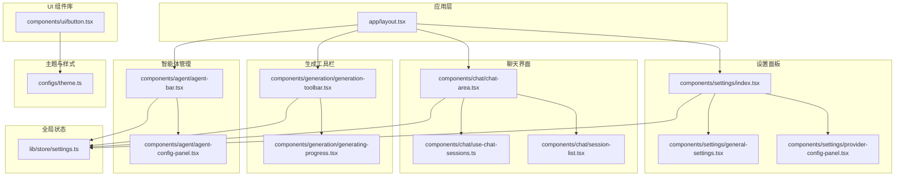
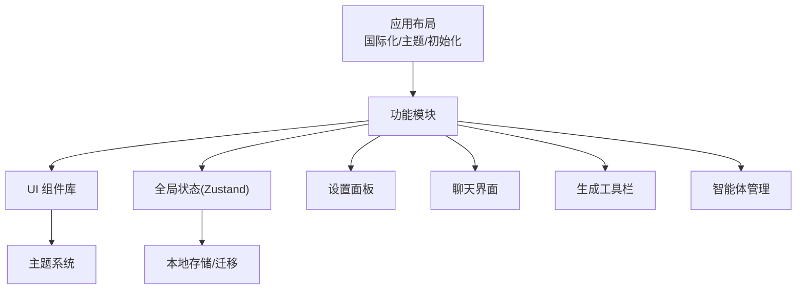
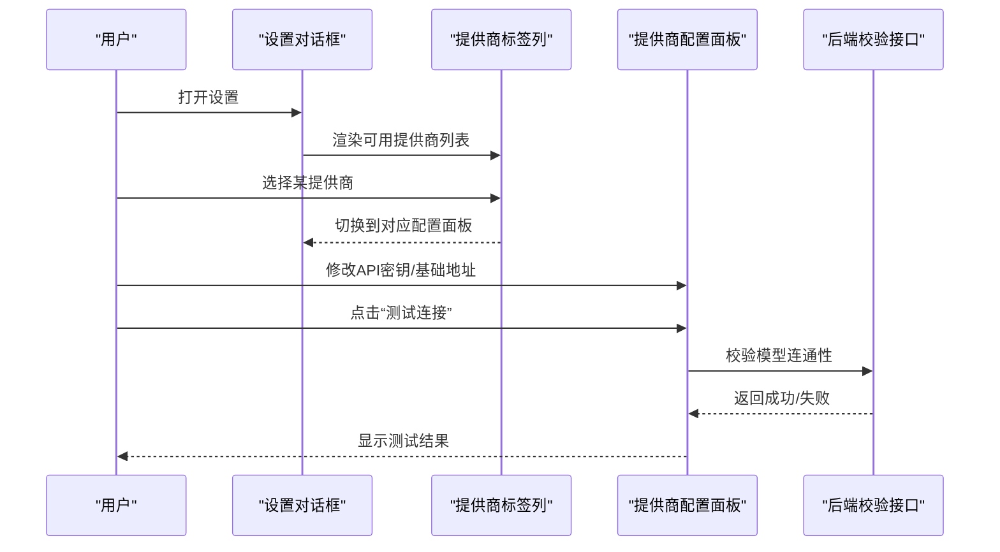
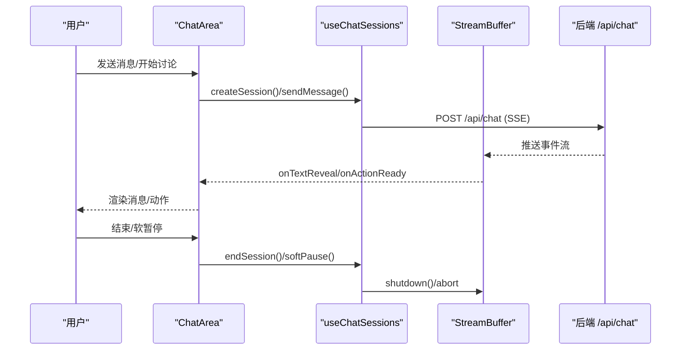
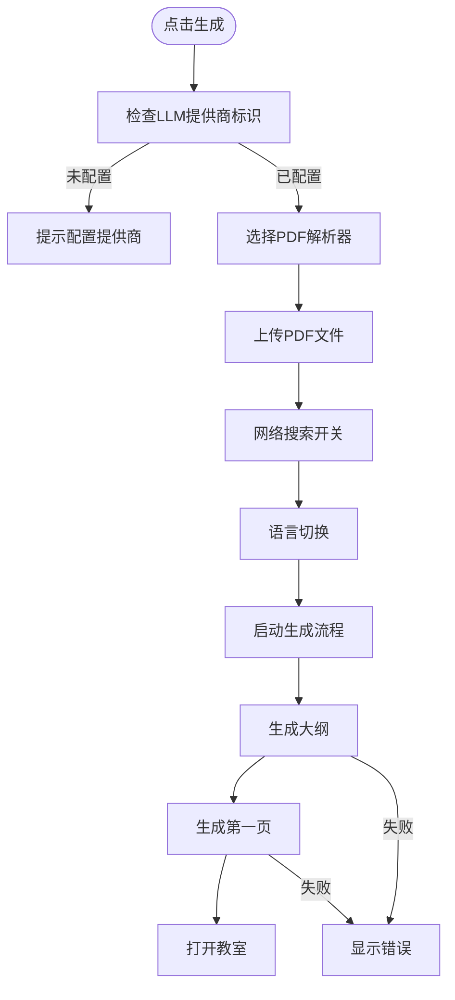
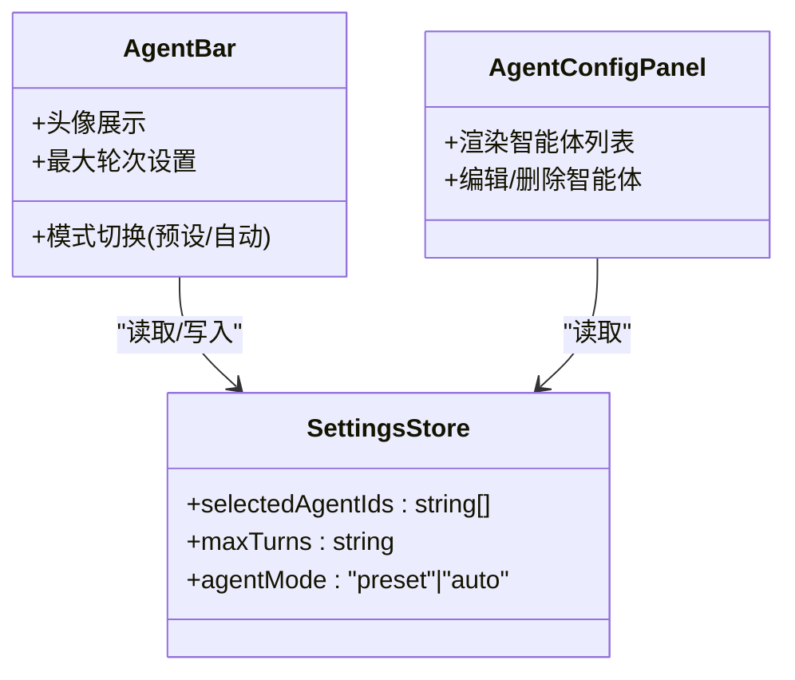
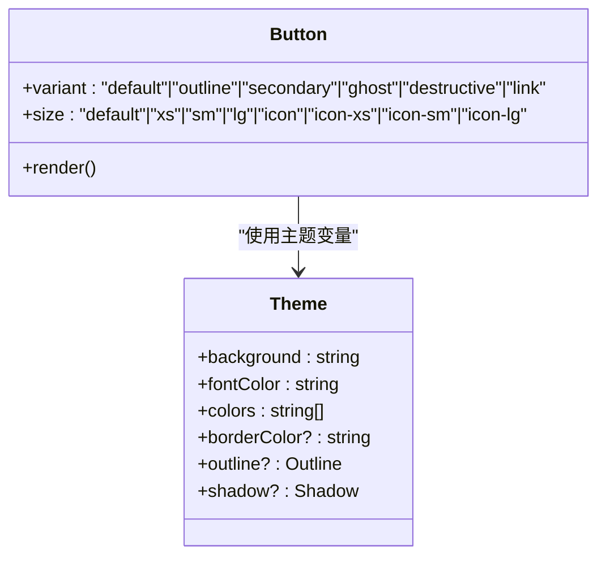
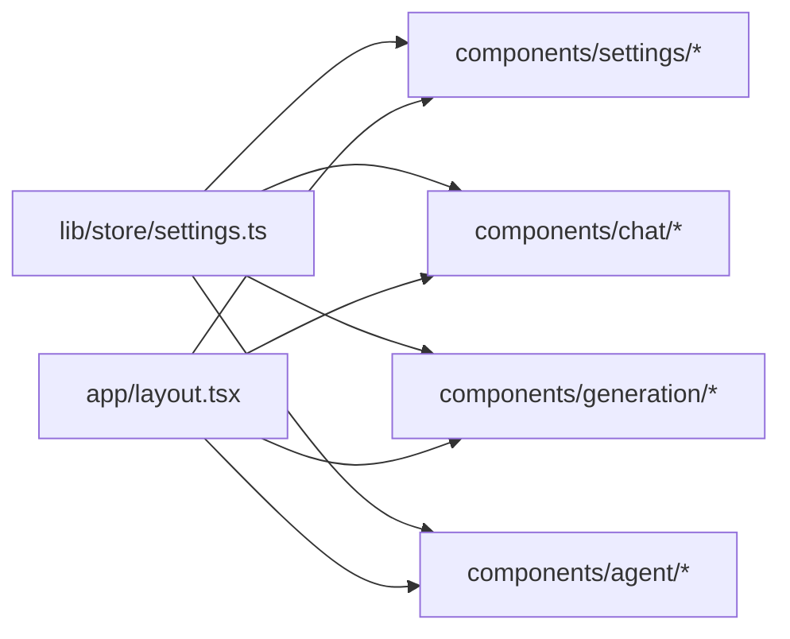

# 用户界面系统

<cite>
**本文档引用的文件**
- [settings/index.tsx](file://components/settings/index.tsx)
- [provider-config-panel.tsx](file://components/settings/provider-config-panel.tsx)
- [general-settings.tsx](file://components/settings/general-settings.tsx)
- [chat-area.tsx](file://components/chat/chat-area.tsx)
- [session-list.tsx](file://components/chat/session-list.tsx)
- [use-chat-sessions.ts](file://components/chat/use-chat-sessions.ts)
- [generation-toolbar.tsx](file://components/generation/generation-toolbar.tsx)
- [generating-progress.tsx](file://components/generation/generating-progress.tsx)
- [agent-config-panel.tsx](file://components/agent/agent-config-panel.tsx)
- [agent-bar.tsx](file://components/agent/agent-bar.tsx)
- [button.tsx](file://components/ui/button.tsx)
- [theme.ts](file://configs/theme.ts)
- [settings.ts](file://lib/store/settings.ts)
- [layout.tsx](file://app/layout.tsx)
</cite>

## 目录
1. [简介](#简介)
2. [项目结构](#项目结构)
3. [核心组件](#核心组件)
4. [架构总览](#架构总览)
5. [详细组件分析](#详细组件分析)
6. [依赖关系分析](#依赖关系分析)
7. [性能考量](#性能考量)
8. [故障排除指南](#故障排除指南)
9. [结论](#结论)
10. [附录](#附录)

## 简介
本文件系统化梳理 OpenMAIC 的用户界面系统，覆盖设置面板（AI 服务提供商配置、多媒体与全局选项）、聊天界面（消息显示、实时通信、会话管理）、生成工具栏（课程生成控制与进度展示）、智能体管理界面（配置、状态与交互），以及 UI 组件库与主题系统。同时提供界面定制指南、无障碍与跨浏览器兼容性建议，以及用户体验设计原则。

## 项目结构
UI 层采用按功能域分层组织：页面布局在应用根目录，通用 UI 组件位于 components/ui，业务功能组件位于 components 下的子模块（settings、chat、generation、agent 等），全局状态通过 Zustand store 管理，主题与样式在 configs 与 app/globals.css 中定义。

**图表来源**
- [layout.tsx:1-47](file://app/layout.tsx#L1-L47)
- [settings/index.tsx:1-1054](file://components/settings/index.tsx#L1-L1054)
- [provider-config-panel.tsx:1-403](file://components/settings/provider-config-panel.tsx#L1-L403)
- [general-settings.tsx:1-182](file://components/settings/general-settings.tsx#L1-L182)
- [chat-area.tsx:1-320](file://components/chat/chat-area.tsx#L1-L320)
- [session-list.tsx:1-141](file://components/chat/session-list.tsx#L1-L141)
- [use-chat-sessions.ts:1-800](file://components/chat/use-chat-sessions.ts#L1-L800)
- [generation-toolbar.tsx:1-555](file://components/generation/generation-toolbar.tsx#L1-L555)
- [generating-progress.tsx:1-141](file://components/generation/generating-progress.tsx#L1-L141)
- [agent-config-panel.tsx:1-153](file://components/agent/agent-config-panel.tsx#L1-L153)
- [agent-bar.tsx:1-305](file://components/agent/agent-bar.tsx#L1-L305)
- [button.tsx:1-68](file://components/ui/button.tsx#L1-L68)
- [theme.ts:1-127](file://configs/theme.ts#L1-L127)
- [settings.ts:1-800](file://lib/store/settings.ts#L1-L800)

**章节来源**
- [layout.tsx:1-47](file://app/layout.tsx#L1-L47)

## 核心组件
- 设置面板：集中管理 AI 提供商、多媒体与全局选项，支持可拖拽侧栏、模型选择、连接测试、服务器配置提示等。
- 聊天界面：包含讲座笔记视图与对话会话列表，支持会话展开/折叠、流式渲染、实时语音与思考状态反馈。
- 生成工具栏：课程生成控制入口，集成模型选择、PDF 上传解析、网络搜索开关与语言切换，以及媒体生成弹出菜单。
- 智能体管理：智能体配置面板与智能体条，支持预设与自动模式、最大轮次限制、头像展示与交互。
- UI 组件库：以原子化设计为基础，提供按钮、输入、标签、对话框等基础组件，统一风格与交互。
- 主题系统：预置多套主题，支持背景、字体色、边框色与元素轮廓阴影等属性。

**章节来源**
- [settings/index.tsx:1-1054](file://components/settings/index.tsx#L1-L1054)
- [chat-area.tsx:1-320](file://components/chat/chat-area.tsx#L1-L320)
- [generation-toolbar.tsx:1-555](file://components/generation/generation-toolbar.tsx#L1-L555)
- [agent-bar.tsx:1-305](file://components/agent/agent-bar.tsx#L1-L305)
- [button.tsx:1-68](file://components/ui/button.tsx#L1-L68)
- [theme.ts:1-127](file://configs/theme.ts#L1-L127)

## 架构总览
UI 架构围绕“布局-功能模块-组件库-状态-主题”五层展开。布局层负责国际化、主题与全局初始化；功能模块（设置、聊天、生成、智能体）封装业务逻辑；组件库提供一致的视觉与交互；状态层通过 Zustand 管理持久化设置；主题系统提供样式基线。

**图表来源**
- [layout.tsx:1-47](file://app/layout.tsx#L1-L47)
- [settings.ts:1-800](file://lib/store/settings.ts#L1-L800)
- [theme.ts:1-127](file://configs/theme.ts#L1-L127)

## 详细组件分析

### 设置面板：AI 服务提供商配置、多媒体与全局选项
- 多列布局与可拖拽调整：左侧导航、中间提供商标签列表、右侧配置面板，支持两列宽度自适应。
- 提供商配置面板：支持 API 密钥、基础地址、是否需要密钥、连接测试、模型管理（增删改查）与重置默认。
- 全局设置：危险区缓存清理，确认流程与错误处理。
- 服务器配置提示：当提供商标识为服务器已配置时，显示“服务器配置”徽章，避免重复输入密钥。

**图表来源**
- [settings/index.tsx:171-466](file://components/settings/index.tsx#L171-L466)
- [provider-config-panel.tsx:110-150](file://components/settings/provider-config-panel.tsx#L110-L150)

**章节来源**
- [settings/index.tsx:171-466](file://components/settings/index.tsx#L171-L466)
- [provider-config-panel.tsx:110-150](file://components/settings/provider-config-panel.tsx#L110-L150)
- [general-settings.tsx:35-57](file://components/settings/general-settings.tsx#L35-L57)

### 聊天界面：消息显示、实时通信与会话管理
- 分页签：讲座与聊天双标签，讲座标签含活跃会话指示点。
- 讲座笔记：基于场景动作流动态生成，保持顺序与交互元素（如聚光灯、激光）内联展示。
- 会话列表：支持展开/折叠、状态徽标、消息计数、活跃态高亮与动画展开。
- 实时通信：使用 SSE 流与缓冲区驱动字符级呈现与动作注入，支持软暂停/恢复、中断标记与轮次上限。
- 会话生命周期：创建、激活、流式输出、完成或中断、结束清理。

**图表来源**
- [chat-area.tsx:55-317](file://components/chat/chat-area.tsx#L55-L317)
- [use-chat-sessions.ts:340-502](file://components/chat/use-chat-sessions.ts#L340-L502)
- [session-list.tsx:41-141](file://components/chat/session-list.tsx#L41-L141)

**章节来源**
- [chat-area.tsx:55-317](file://components/chat/chat-area.tsx#L55-L317)
- [use-chat-sessions.ts:340-502](file://components/chat/use-chat-sessions.ts#L340-L502)
- [session-list.tsx:41-141](file://components/chat/session-list.tsx#L41-L141)

### 生成工具栏：课程生成控制与进度显示
- 模型选择：两级弹出（提供商→模型），根据服务器配置与可用模型过滤。
- PDF 解析：选择解析器与文件上传，支持拖拽与大小限制。
- 网络搜索：按可用性启用/禁用，支持切换提供商标识与服务器配置徽章。
- 语言切换：中英互切。
- 媒体生成：打开媒体弹出菜单（图像/视频生成相关）。
- 进度展示：两阶段里程碑（大纲就绪、第一页就绪），错误与状态信息。

**图表来源**
- [generation-toolbar.tsx:43-381](file://components/generation/generation-toolbar.tsx#L43-L381)
- [generating-progress.tsx:57-141](file://components/generation/generating-progress.tsx#L57-L141)

**章节来源**
- [generation-toolbar.tsx:43-381](file://components/generation/generation-toolbar.tsx#L43-L381)
- [generating-progress.tsx:57-141](file://components/generation/generating-progress.tsx#L57-L141)

### 智能体管理界面：配置、状态与交互
- 配置面板：列出智能体卡片，展示名称、角色、优先级、默认标识与可用动作集合，支持编辑与删除（非默认）。
- 智能体条：悬浮面板，支持预设与自动两种模式；预设模式固定教师并可勾选其他智能体；自动模式展示“洗牌”动画提示；支持最大轮次输入。

**图表来源**
- [agent-config-panel.tsx:17-153](file://components/agent/agent-config-panel.tsx#L17-L153)
- [agent-bar.tsx:14-305](file://components/agent/agent-bar.tsx#L14-L305)
- [settings.ts:140-144](file://lib/store/settings.ts#L140-L144)

**章节来源**
- [agent-config-panel.tsx:17-153](file://components/agent/agent-config-panel.tsx#L17-L153)
- [agent-bar.tsx:14-305](file://components/agent/agent-bar.tsx#L14-L305)
- [settings.ts:140-144](file://lib/store/settings.ts#L140-L144)

### UI 组件库与主题系统
- 组件库：以原子化设计为核心，按钮组件通过变体与尺寸类名组合实现多样化外观，支持图标、禁用、可展开等状态。
- 主题系统：预置多套主题，包含背景、字体色、边框色、颜色集与元素轮廓/阴影等属性，便于快速切换与定制。

**图表来源**
- [button.tsx:44-68](file://components/ui/button.tsx#L44-L68)
- [theme.ts:3-127](file://configs/theme.ts#L3-L127)

**章节来源**
- [button.tsx:44-68](file://components/ui/button.tsx#L44-L68)
- [theme.ts:3-127](file://configs/theme.ts#L3-L127)

## 依赖关系分析
- 组件间耦合：设置面板与聊天界面均依赖全局设置存储；生成工具栏与智能体条同样依赖设置存储；聊天界面内部通过 useChatSessions 抽象与后端交互。
- 状态一致性：设置存储提供统一的数据源，确保各模块在刷新/重启后仍能恢复状态。
- 外部依赖：国际化（i18n）、主题（ThemeProvider）、通知（Sonner）、字体（Geist）等在布局层统一注入。

**图表来源**
- [settings.ts:1-800](file://lib/store/settings.ts#L1-L800)
- [layout.tsx:25-47](file://app/layout.tsx#L25-L47)

**章节来源**
- [settings.ts:1-800](file://lib/store/settings.ts#L1-L800)
- [layout.tsx:25-47](file://app/layout.tsx#L25-L47)

## 性能考量
- 渲染优化：聊天消息使用动画展开与按需渲染，避免全量重绘；讲座笔记基于场景流实时生成，减少重复计算。
- 流式处理：SSE 流与缓冲区解耦 UI 更新与数据到达节奏，支持软暂停/恢复与中断标记。
- 存储与迁移：设置存储采用持久化与版本迁移策略，确保新增提供商与字段不破坏历史数据。
- 主题与样式：主题变量集中管理，减少重复样式计算；组件库通过类名组合降低样式冲突成本。

## 故障排除指南
- 设置面板连接测试失败：检查 API 密钥、基础地址与网络连通性；若服务器已配置，可忽略密钥要求；查看测试结果提示与错误信息。
- 聊天会话中断：软暂停会在最后一条助手消息追加“...”与中断标记；恢复时重新发起请求；若达到最大轮次，日志会记录提示。
- 生成失败：检查提供商配置、PDF 文件大小与格式、网络搜索提供商标识；查看生成进度中的错误块与状态信息。
- 缓存清理：在全局设置的危险区执行确认流程，清理 IndexedDB、localStorage 与 sessionStorage 后刷新页面生效。

**章节来源**
- [provider-config-panel.tsx:110-150](file://components/settings/provider-config-panel.tsx#L110-L150)
- [use-chat-sessions.ts:641-723](file://components/chat/use-chat-sessions.ts#L641-L723)
- [generating-progress.tsx:124-136](file://components/generation/generating-progress.tsx#L124-L136)
- [general-settings.tsx:35-57](file://components/settings/general-settings.tsx#L35-L57)

## 结论
OpenMAIC 的用户界面系统以清晰的功能域划分与统一的状态管理为基础，结合流式渲染与实时通信机制，提供了从设置配置到课程生成再到智能体交互的完整体验。组件库与主题系统保证了视觉一致性与可扩展性，适合进一步增强无障碍与跨浏览器兼容性。

## 附录

### 界面定制指南
- 样式修改：通过主题系统调整背景、字体色与颜色集；在组件库层面使用变体与尺寸类名组合实现差异化外观。
- 主题切换：在布局层统一注入主题提供者，支持明暗主题与多套预置主题切换。
- 响应式设计：利用容器查询与断点类名，确保在不同屏幕尺寸下保持良好可读性与交互效率。

**章节来源**
- [theme.ts:13-127](file://configs/theme.ts#L13-L127)
- [button.tsx:7-42](file://components/ui/button.tsx#L7-L42)
- [layout.tsx:31-47](file://app/layout.tsx#L31-L47)

### 无障碍与跨浏览器兼容性
- 无障碍：为交互元素提供语义化标签与键盘可达性；为不可见内容使用辅助类名；为动态更新区域提供 ARIA 状态提示。
- 跨浏览器：在字体加载与动画库上进行降级处理；对实验特性进行特性检测与回退；在国际化与主题切换上避免依赖未标准化 API。

[本节为通用指导，无需特定文件引用]