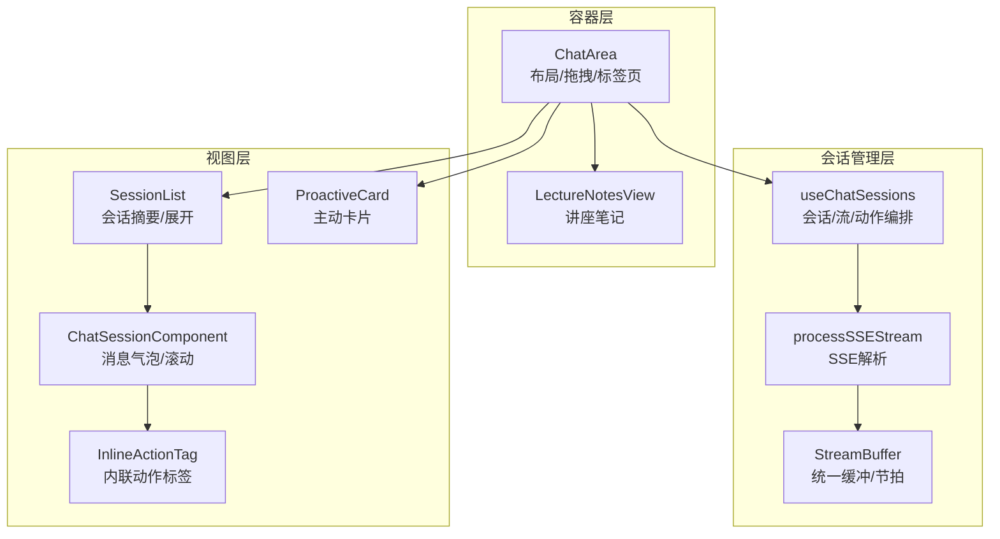
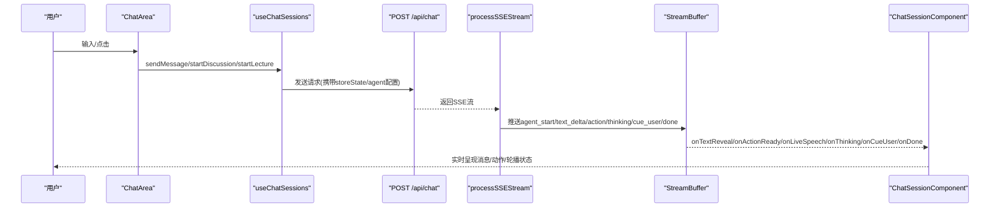
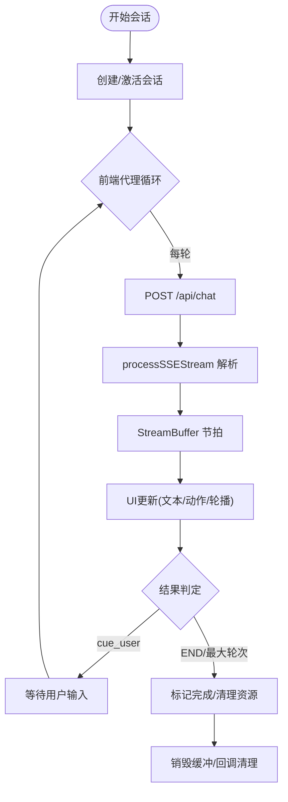
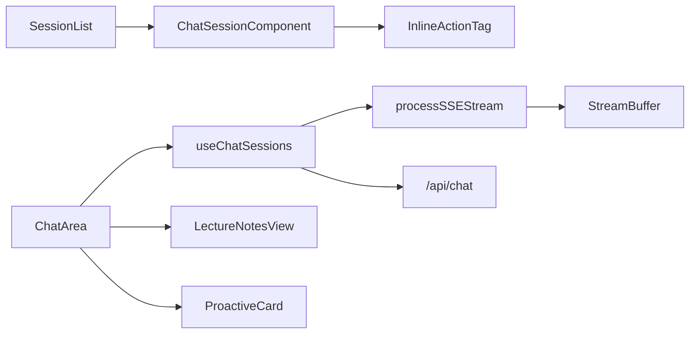

# 聊天界面

<cite>
**本文引用的文件**
- [chat-area.tsx](file://components/chat/chat-area.tsx)
- [chat-session.tsx](file://components/chat/chat-session.tsx)
- [session-list.tsx](file://components/chat/session-list.tsx)
- [proactive-card.tsx](file://components/chat/proactive-card.tsx)
- [inline-action-tag.tsx](file://components/chat/inline-action-tag.tsx)
- [lecture-notes-view.tsx](file://components/chat/lecture-notes-view.tsx)
- [process-sse-stream.ts](file://components/chat/process-sse-stream.ts)
- [use-chat-sessions.ts](file://components/chat/use-chat-sessions.ts)
- [chat.ts](file://lib/types/chat.ts)
- [route.ts](file://app/api/chat/route.ts)
- [stream-buffer.ts](file://lib/buffer/stream-buffer.ts)
</cite>

## 目录
1. [简介](#简介)
2. [项目结构](#项目结构)
3. [核心组件](#核心组件)
4. [架构总览](#架构总览)
5. [详细组件分析](#详细组件分析)
6. [依赖关系分析](#依赖关系分析)
7. [性能考量](#性能考量)
8. [故障排查指南](#故障排查指南)
9. [结论](#结论)
10. [附录](#附录)

## 简介
本文件系统性梳理 OpenMAIC 的聊天界面实现，覆盖消息流管理、实时通信与状态同步、聊天区域渲染、会话管理、会话列表、主动卡片、内联操作标签、讲座笔记视图、SSE 流处理以及聊天状态钩子的使用。目标是帮助开发者快速理解从请求发起、服务端流式响应、缓冲层解耦到 UI 呈现的完整链路，并掌握性能优化与扩展点。

## 项目结构
聊天界面由“容器 + 会话管理 + 视图组件”三层构成：
- 容器层：负责布局、拖拽、标签页切换、讲座笔记与聊天区的互斥展示
- 会话管理：统一调度多会话生命周期、SSE 解析、缓冲层驱动 UI 更新
- 视图层：会话列表、单个会话消息气泡、内联动作标签、讲座笔记、主动卡片

图表来源
- [chat-area.tsx:1-320](file://components/chat/chat-area.tsx#L1-L320)
- [use-chat-sessions.ts:1-800](file://components/chat/use-chat-sessions.ts#L1-L800)
- [process-sse-stream.ts:1-123](file://components/chat/process-sse-stream.ts#L1-L123)
- [stream-buffer.ts:1-605](file://lib/buffer/stream-buffer.ts#L1-L605)
- [session-list.tsx:1-141](file://components/chat/session-list.tsx#L1-L141)
- [chat-session.tsx:1-387](file://components/chat/chat-session.tsx#L1-L387)
- [inline-action-tag.tsx:1-124](file://components/chat/inline-action-tag.tsx#L1-L124)
- [proactive-card.tsx:1-245](file://components/chat/proactive-card.tsx#L1-L245)
- [lecture-notes-view.tsx:1-200](file://components/chat/lecture-notes-view.tsx#L1-L200)

章节来源
- [chat-area.tsx:1-320](file://components/chat/chat-area.tsx#L1-L320)
- [use-chat-sessions.ts:1-800](file://components/chat/use-chat-sessions.ts#L1-L800)

## 核心组件
- ChatArea：聊天面板容器，支持拖拽宽度、标签页（讲座/聊天）、会话列表、讲座笔记视图、外层回调透传
- useChatSessions：会话状态钩子，封装创建/结束/软暂停/恢复、发送消息、启动讨论、启动讲座、动作执行与 UI 同步
- SessionList：会话摘要列表，含状态徽标、消息数、展开收起动画
- ChatSessionComponent：单一会话渲染，含消息气泡、滚动控制、活跃气泡高亮、结束提示
- InlineActionTag：内联动作标签，按动作类型映射图标与样式
- LectureNotesView：讲座笔记视图，按场景分页、内联动作与讨论块渲染
- ProactiveCard：主动卡片，用于讨论邀请，带倒计时进度与定位
- processSSEStream：SSE 流解析器，将服务端事件推送到缓冲层
- StreamBuffer：统一缓冲与节拍引擎，负责文本逐字呈现、动作触发、轮播状态回调

章节来源
- [chat-area.tsx:1-320](file://components/chat/chat-area.tsx#L1-L320)
- [use-chat-sessions.ts:1-800](file://components/chat/use-chat-sessions.ts#L1-L800)
- [session-list.tsx:1-141](file://components/chat/session-list.tsx#L1-L141)
- [chat-session.tsx:1-387](file://components/chat/chat-session.tsx#L1-L387)
- [inline-action-tag.tsx:1-124](file://components/chat/inline-action-tag.tsx#L1-L124)
- [lecture-notes-view.tsx:1-200](file://components/chat/lecture-notes-view.tsx#L1-L200)
- [proactive-card.tsx:1-245](file://components/chat/proactive-card.tsx#L1-L245)
- [process-sse-stream.ts:1-123](file://components/chat/process-sse-stream.ts#L1-L123)
- [stream-buffer.ts:1-605](file://lib/buffer/stream-buffer.ts#L1-L605)

## 架构总览
整体采用“客户端状态机 + 服务端无状态流”的设计：客户端维护会话与应用状态，服务端仅负责按请求生成并以 SSE 持续推送事件；缓冲层统一节拍与 UI 回调，确保 UI 与轮播状态一致。

图表来源
- [use-chat-sessions.ts:340-502](file://components/chat/use-chat-sessions.ts#L340-L502)
- [route.ts:44-191](file://app/api/chat/route.ts#L44-L191)
- [process-sse-stream.ts:12-123](file://components/chat/process-sse-stream.ts#L12-L123)
- [stream-buffer.ts:413-536](file://lib/buffer/stream-buffer.ts#L413-L536)
- [chat-session.tsx:176-387](file://components/chat/chat-session.tsx#L176-L387)

## 详细组件分析

### ChatArea：聊天面板容器
- 功能要点
  - 支持拖拽调整宽度、折叠、标签页切换（讲座/聊天）
  - 讲座笔记基于场景动作流构建，保持顺序与内联动作位置
  - 过滤掉“lecture”会话用于聊天标签页
  - 提供外层回调（语音/思考/提示用户）透传
- 关键交互
  - 拖拽：计算新宽度并调用 onWidthChange
  - 标签页：根据 activeTab 切换内容
  - 会话列表：传递 expandedSessionIds/isStreaming/activeBubbleId 等状态

章节来源
- [chat-area.tsx:55-320](file://components/chat/chat-area.tsx#L55-L320)

### useChatSessions：会话状态钩子
- 会话生命周期
  - 创建：生成唯一 sessionId，设置为 active 并展开
  - 结束：中断流、销毁缓冲、标记完成；对 QA/Discussion 追加省略号与中断标记
  - 软暂停：中断流但保留会话状态，便于继续话题
  - 恢复：重新发起请求，继续对话
- 消息发送与讨论启动
  - 发送消息：校验模型配置，必要时自动创建/结束其他会话，构造用户消息并进入前端驱动的“代理循环”
  - 讨论启动：可指定触发代理，自动结束其他活动会话
- 讲座会话
  - 为每个场景创建单一“教师”消息，所有动作追加到该消息的 parts 中
  - 通过 addLectureMessage 将动作与文本合并到同一消息气泡
- 缓冲层与回调
  - 为每个会话维护 StreamBuffer，回调驱动 UI 更新与轮播状态
  - 对动作执行通过 ActionEngine 异步触发可视化效果

图表来源
- [use-chat-sessions.ts:340-502](file://components/chat/use-chat-sessions.ts#L340-L502)
- [process-sse-stream.ts:12-123](file://components/chat/process-sse-stream.ts#L12-L123)
- [stream-buffer.ts:413-536](file://lib/buffer/stream-buffer.ts#L413-L536)

章节来源
- [use-chat-sessions.ts:1-800](file://components/chat/use-chat-sessions.ts#L1-L800)
- [use-chat-sessions.ts:800-1426](file://components/chat/use-chat-sessions.ts#L800-L1426)

### SessionList：会话摘要与展开
- 展示字段：类型徽标、标题、状态图标、消息数、展开按钮
- 交互：点击头部切换展开；展开后渲染对应 ChatSessionComponent
- 状态指示：当前活动会话有边框与背景强调

章节来源
- [session-list.tsx:1-141](file://components/chat/session-list.tsx#L1-L141)

### ChatSessionComponent：消息显示与滚动控制
- 消息气泡
  - 文本逐字呈现，末尾“正在输入”指示与中断标记
  - 动作以 InlineActionTag 呈现，仅在文本到达后出现
- 滚动策略
  - 新消息到达平滑滚动到底部
  - 用户停留在顶部时抑制自动滚动，底部 rAF 节流滚动以适配文本增长
  - 活跃气泡变化时平滑滚动至可见
- 结束提示：会话完成后显示“已结束”横幅

章节来源
- [chat-session.tsx:1-387](file://components/chat/chat-session.tsx#L1-L387)

### InlineActionTag：内联动作标签
- 动作映射：根据动作名映射图标、样式与是否为白板类动作
- 运行中状态：带脉动感画
- 白板强调：左侧小徽章突出白板生命周期/绘制动作

章节来源
- [inline-action-tag.tsx:1-124](file://components/chat/inline-action-tag.tsx#L1-L124)

### LectureNotesView：讲座笔记视图
- 数据来源：从场景动作流派生，保持顺序与内联动作位置
- 渲染规则：演讲文本与内联动作（聚光/激光/播放视频）同行，讨论作为独立卡片
- 导航：根据 currentSceneId 自动滚动到当前场景

章节来源
- [lecture-notes-view.tsx:1-200](file://components/chat/lecture-notes-view.tsx#L1-L200)

### ProactiveCard：主动卡片
- 定位：基于锚点元素（头像等）固定定位，支持左右对齐与视口边界约束
- 行为：倒计时进度、跳过/加入/暂停/恢复
- 生命周期：通过 requestAnimationFrame 跟踪锚点位置，避免父级溢出影响

章节来源
- [proactive-card.tsx:1-245](file://components/chat/proactive-card.tsx#L1-L245)

### SSE 流处理：processSSEStream
- 解析逻辑：按双换行切分事件，提取 data: JSON，分发到缓冲层
- 事件类型：agent_start/agent_end/text_delta/action/thinking/cue_user/done/error
- 错误处理：捕获解析异常与服务端错误事件，抛出给上层

章节来源
- [process-sse-stream.ts:1-123](file://components/chat/process-sse-stream.ts#L1-L123)

### 类型与数据模型：lib/types/chat.ts
- 会话类型：qa、discussion、lecture
- 会话状态：idle、active、interrupted、completed
- 事件类型：StatelessEvent（SSE 事件）
- 请求体：StatelessChatRequest（包含 storeState、config、directorState 等）

章节来源
- [chat.ts:1-337](file://lib/types/chat.ts#L1-L337)

### API 路由：app/api/chat/route.ts
- 入口：POST /api/chat
- 特性：全状态由客户端传递，服务端无状态；心跳保活；中断即终止流
- 输出：SSE 文本流，事件类型与客户端一致

章节来源
- [route.ts:1-191](file://app/api/chat/route.ts#L1-L191)

### 缓冲层：lib/buffer/stream-buffer.ts
- 统一节拍：固定 tickMs，charsPerTick 控制逐字速度
- 事件队列：agent_start/text/action/thinking/cue_user/done/error
- 回调：onTextReveal/onActionReady/onLiveSpeech/onThinking/onCueUser/onDone/onError
- 控制：pause/resume/waitUntilDrained/flush/dispose/shutdown

章节来源
- [stream-buffer.ts:1-605](file://lib/buffer/stream-buffer.ts#L1-L605)

## 依赖关系分析
- ChatArea 依赖 useChatSessions 提供的状态与方法
- useChatSessions 依赖 SSE 解析器与缓冲层，同时与 ActionEngine 协作执行动作
- ChatSessionComponent 依赖 InlineActionTag 渲染动作标签
- LectureNotesView 依赖场景数据进行笔记渲染
- ProactiveCard 通过 Portal 渲染，不依赖父级布局约束
- API 路由与 SSE 解析器共同构成服务端到客户端的实时通道

图表来源
- [chat-area.tsx:1-320](file://components/chat/chat-area.tsx#L1-L320)
- [use-chat-sessions.ts:1-800](file://components/chat/use-chat-sessions.ts#L1-L800)
- [process-sse-stream.ts:1-123](file://components/chat/process-sse-stream.ts#L1-L123)
- [stream-buffer.ts:1-605](file://lib/buffer/stream-buffer.ts#L1-L605)
- [session-list.tsx:1-141](file://components/chat/session-list.tsx#L1-L141)
- [chat-session.tsx:1-387](file://components/chat/chat-session.tsx#L1-L387)
- [inline-action-tag.tsx:1-124](file://components/chat/inline-action-tag.tsx#L1-L124)
- [lecture-notes-view.tsx:1-200](file://components/chat/lecture-notes-view.tsx#L1-L200)
- [proactive-card.tsx:1-245](file://components/chat/proactive-card.tsx#L1-L245)
- [route.ts:1-191](file://app/api/chat/route.ts#L1-L191)

## 性能考量
- 滚动优化：使用 rAF 节流与“是否处于底部”标志，避免频繁重排
- 文本呈现：逐字节节拍统一，减少 UI 层动画叠加导致的抖动
- 缓冲层：暂停/恢复 O(1)，等待 drain 使用 Promise 避免轮询
- 会话持久化：会话列表项不含消息正文，降低传输与渲染成本
- 讲座模式：动作直接追加到单一消息，避免多气泡切换开销

## 故障排查指南
- 无法接收 SSE
  - 检查 /api/chat 是否返回 200 且 Content-Type 为 text/event-stream
  - 查看浏览器网络面板 SSE 连接是否被代理或浏览器关闭空闲连接
- 文本不显示或卡住
  - 确认 StreamBuffer 已 start 且未 dispose/shutdown
  - 检查 onTextReveal 回调是否被正确消费
- 动作标签不出现
  - 确认 text_delta 已完全到达后再触发 action
  - 检查 actionName 是否在配置表中存在映射
- 会话状态异常
  - 软暂停后恢复需重新创建缓冲层，确认缓冲层未被重复 dispose
  - 结束会话时检查 interrupted 标记与轮播回调清理

章节来源
- [route.ts:175-191](file://app/api/chat/route.ts#L175-L191)
- [process-sse-stream.ts:112-123](file://components/chat/process-sse-stream.ts#L112-L123)
- [stream-buffer.ts:364-396](file://lib/buffer/stream-buffer.ts#L364-L396)
- [use-chat-sessions.ts:541-622](file://components/chat/use-chat-sessions.ts#L541-L622)

## 结论
该聊天界面通过“会话状态钩子 + SSE 解析 + 统一缓冲层”的分层设计，实现了稳定、可扩展的实时消息呈现与动作联动。容器层负责布局与交互，会话层负责生命周期与流式编排，视图层专注渲染细节。配合滚动优化、节拍统一与错误处理，整体具备良好的用户体验与可维护性。

## 附录
- 术语
  - 代理循环：前端驱动的多代理连续对话流程
  - 轮播状态：用于 Roundtable 气泡的实时语音与进度反馈
  - 讲座模式：以场景为单位的动作驱动，所有动作追加到单一消息气泡