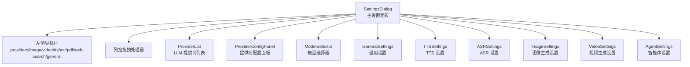
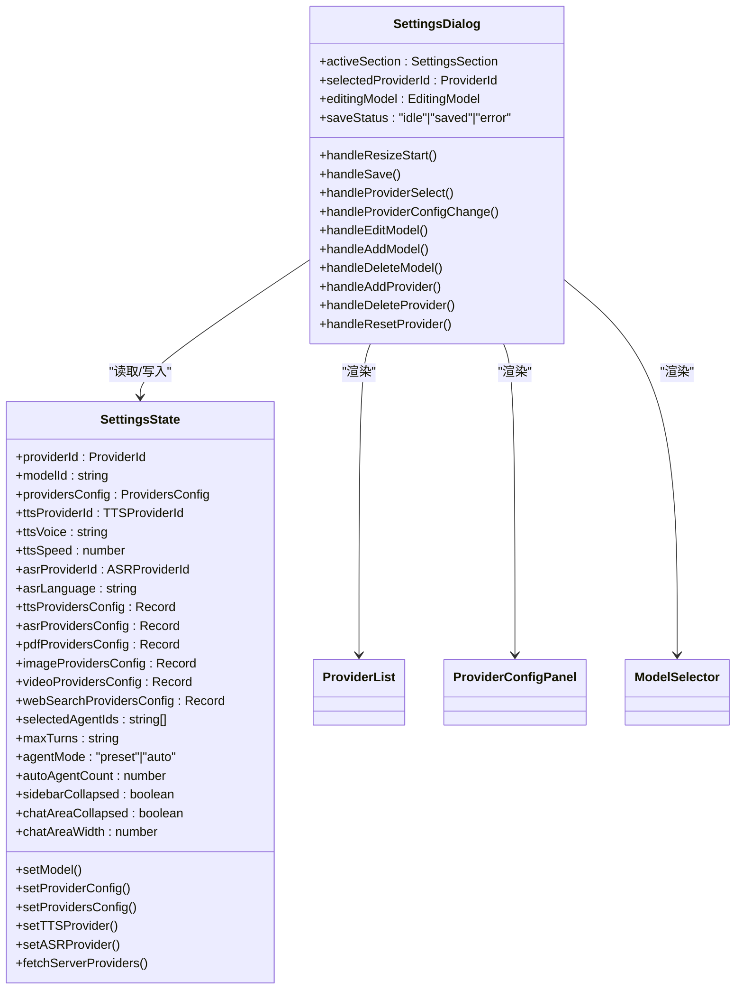
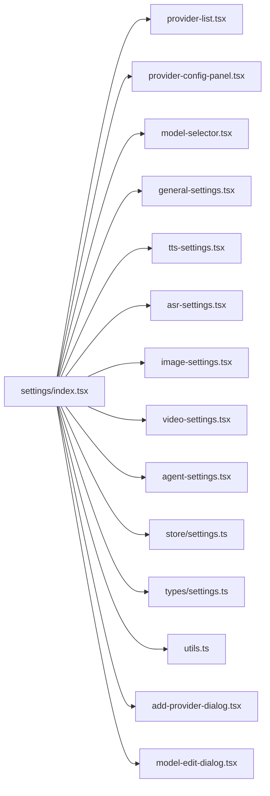

# 设置面板

<cite>
**本文档引用的文件**
- [settings/index.tsx](file://components/settings/index.tsx)
- [general-settings.tsx](file://components/settings/general-settings.tsx)
- [agent-settings.tsx](file://components/settings/agent-settings.tsx)
- [tts-settings.tsx](file://components/settings/tts-settings.tsx)
- [asr-settings.tsx](file://components/settings/asr-settings.tsx)
- [image-settings.tsx](file://components/settings/image-settings.tsx)
- [video-settings.tsx](file://components/settings/video-settings.tsx)
- [provider-list.tsx](file://components/settings/provider-list.tsx)
- [provider-config-panel.tsx](file://components/settings/provider-config-panel.tsx)
- [model-selector.tsx](file://components/settings/model-selector.tsx)
- [utils.ts](file://components/settings/utils.ts)
- [types/settings.ts](file://lib/types/settings.ts)
- [store/settings.ts](file://lib/store/settings.ts)
- [add-provider-dialog.tsx](file://components/settings/add-provider-dialog.tsx)
- [model-edit-dialog.tsx](file://components/settings/model-edit-dialog.tsx)
</cite>

## 目录
1. [简介](#简介)
2. [项目结构](#项目结构)
3. [核心组件](#核心组件)
4. [架构总览](#架构总览)
5. [详细组件分析](#详细组件分析)
6. [依赖关系分析](#依赖关系分析)
7. [性能考量](#性能考量)
8. [故障排除指南](#故障排除指南)
9. [结论](#结论)
10. [附录](#附录)

## 简介
本文件为 OpenMAIC 设置面板的详细技术文档，覆盖整体架构设计、设置分类、面板布局与状态管理；通用设置（语言、主题、时区、全局偏好）、智能体设置、多媒体设置（TTS/ASR/图像/视频）、AI 服务提供商管理、模型选择器实现、设置数据持久化机制以及验证规则与错误处理策略。文档旨在帮助开发者与维护者快速理解与扩展设置系统。

## 项目结构
设置面板采用“主对话框 + 多级侧边导航 + 动态内容区域”的布局模式，支持可拖拽列宽、分节显示与多模块配置。核心由一个 SettingsDialog 主容器协调各子模块，配合 Zustand 全局状态存储与本地持久化，实现跨页面一致的配置体验。

图表来源
- [settings/index.tsx:652-763](file://components/settings/index.tsx#L652-L763)
- [provider-list.tsx:21-85](file://components/settings/provider-list.tsx#L21-L85)
- [provider-config-panel.tsx:55-403](file://components/settings/provider-config-panel.tsx#L55-L403)
- [model-selector.tsx:32-414](file://components/settings/model-selector.tsx#L32-L414)
- [general-settings.tsx:24-182](file://components/settings/general-settings.tsx#L24-L182)
- [tts-settings.tsx:21-275](file://components/settings/tts-settings.tsx#L21-L275)
- [asr-settings.tsx:21-277](file://components/settings/asr-settings.tsx#L21-L277)
- [image-settings.tsx:29-339](file://components/settings/image-settings.tsx#L29-L339)
- [video-settings.tsx:29-342](file://components/settings/video-settings.tsx#L29-L342)
- [agent-settings.tsx:30-199](file://components/settings/agent-settings.tsx#L30-L199)

章节来源
- [settings/index.tsx:171-763](file://components/settings/index.tsx#L171-L763)

## 核心组件
- SettingsDialog：主入口，负责导航切换、列宽拖拽、提供商增删改、模型编辑、保存状态提示等。
- ProviderList：展示已配置的 LLM 提供商列表，支持添加自定义提供商。
- ProviderConfigPanel：针对单个提供商的配置面板，含 API Key/Host 测试、模型列表管理与重置默认。
- ModelSelector：跨提供商的模型选择器，支持搜索过滤、能力标签、上下文窗口显示与模型连通性测试。
- 各模块设置页：通用设置、TTS、ASR、图像生成、视频生成、智能体设置等。
- 工具与类型：格式化上下文窗口、类型定义、Zustand 状态存储与持久化。

章节来源
- [provider-list.tsx:21-85](file://components/settings/provider-list.tsx#L21-L85)
- [provider-config-panel.tsx:55-403](file://components/settings/provider-config-panel.tsx#L55-L403)
- [model-selector.tsx:32-414](file://components/settings/model-selector.tsx#L32-L414)
- [utils.ts:1-29](file://components/settings/utils.ts#L1-L29)
- [types/settings.ts:1-50](file://lib/types/settings.ts#L1-L50)
- [store/settings.ts:26-233](file://lib/store/settings.ts#L26-L233)

## 架构总览
设置面板采用“容器组件 + 展示组件”分层设计，状态集中在 Zustand store 中并通过 persist 中间件持久化到 localStorage。SettingsDialog 作为顶层容器协调各子模块的状态与交互，并通过统一的 ProvidersConfig 结构管理所有提供商配置。

图表来源
- [store/settings.ts:26-233](file://lib/store/settings.ts#L26-L233)
- [settings/index.tsx:171-466](file://components/settings/index.tsx#L171-L466)

## 详细组件分析

### 设置面板整体布局与交互
- 导航与内容区域：左侧导航栏按模块分类，中间为动态内容区；当处于“providers”时额外显示提供商列表列。
- 可拖拽列宽：支持左侧导航列与提供商列表列的宽度调节，拖拽时禁用文本选择与修改鼠标样式，释放后恢复。
- 活动节与头部：根据当前节动态渲染标题与图标，如提供商详情、图像/视频/TTS/ASR 等模块头部信息。
- 保存状态：保存配置后短暂显示“已保存”状态，避免频繁触发持久化。

章节来源
- [settings/index.tsx:171-281](file://components/settings/index.tsx#L171-L281)
- [settings/index.tsx:490-650](file://components/settings/index.tsx#L490-L650)

### 通用设置（系统设置）
- 清理缓存：提供危险操作区，包含确认输入、清理 IndexedDB、localStorage、sessionStorage 并自动刷新页面。
- 用户反馈：使用 toast 提示成功/失败状态；确认对话框中列出将被清理的具体项。

章节来源
- [general-settings.tsx:24-182](file://components/settings/general-settings.tsx#L24-L182)

### 智能体设置
- 模式切换：支持“预设”和“自动”两种模式，预设模式下可多选智能体，自动模式下以提示说明。
- 代理选择：在预设模式下展示智能体头像、角色与名称，支持勾选；对教师角色标记为必需。
- 轮次限制：多智能体协作时可配置最大轮次，单智能体模式有对应提示。
- 用户反馈：根据所选数量给出不同颜色与提示语，便于直观判断当前模式状态。

章节来源
- [agent-settings.tsx:30-199](file://components/settings/agent-settings.tsx#L30-L199)

### 多媒体设置模块

#### TTS 设置
- 语音与速度：支持语音选择与播放速度调节；当测试非当前提供商时使用该提供商默认语音。
- 连接测试：浏览器原生 TTS 或调用后端接口进行测试，返回成功/失败与消息；支持显示请求 URL 预览。
- 认证与主机：按提供商要求显示 API Key/Host 输入，支持明文/密文切换；服务器配置存在时显示“已由服务器配置”。

章节来源
- [tts-settings.tsx:21-275](file://components/settings/tts-settings.tsx#L21-L275)

#### ASR 设置
- 语言与录音：支持语言选择与录音测试；浏览器原生识别或通过后端接口上传音频进行识别。
- 连接测试：录音开始/停止，识别结果展示；错误时输出详细错误信息。
- 认证与主机：与 TTS 类似，按提供商要求显示 API Key/Host 输入与请求 URL 预览。

章节来源
- [asr-settings.tsx:21-277](file://components/settings/asr-settings.tsx#L21-L277)

#### 图像生成设置
- 连接测试：通过专用校验接口测试当前提供商与模型的连通性，返回成功/失败消息。
- 自定义模型：支持添加/编辑/删除自定义模型，表单包含 ID 与名称，自动同步名称与 ID。
- 认证与主机：支持 API Key 明文/密文切换与连接测试；服务器配置存在时显示“已由服务器配置”。

章节来源
- [image-settings.tsx:29-339](file://components/settings/image-settings.tsx#L29-L339)

#### 视频生成设置
- 连接测试：与图像类似，通过专用校验接口测试当前提供商与模型的连通性。
- 自定义模型：同图像设置，支持增删改查。
- 认证与主机：支持 API Key 明文/密文切换与连接测试；服务器配置存在时显示“已由服务器配置”。

章节来源
- [video-settings.tsx:29-342](file://components/settings/video-settings.tsx#L29-L342)

### AI 服务提供商管理
- 添加提供商：弹窗收集提供商名称、API 模式、默认 Base URL、图标 URL 与是否需要 API Key，提交后写入 providersConfig。
- 删除提供商：内置提供商不可删除；删除后若当前选中提供商被移除则回退至第一个剩余提供商；若全局模型指向被删除提供商则回退默认模型。
- 重置提供商：将指定提供商的模型列表重置为默认值。
- 配置面板：支持 API Key/Host 测试、模型列表管理、重置默认、显示服务器配置提示与请求 URL 预览。

章节来源
- [settings/index.tsx:401-466](file://components/settings/index.tsx#L401-L466)
- [provider-list.tsx:21-85](file://components/settings/provider-list.tsx#L21-L85)
- [provider-config-panel.tsx:55-403](file://components/settings/provider-config-panel.tsx#L55-L403)
- [add-provider-dialog.tsx:27-175](file://components/settings/add-provider-dialog.tsx#L27-L175)

### 模型选择器实现
- 跨提供商筛选：仅展示已配置且满足“无需 API Key 或已配置 API Key 或服务器已配置”、“至少有一个模型”、“baseUrl 或 defaultBaseUrl/serverBaseUrl 存在”的提供商。
- 搜索过滤：支持按模型名或 ID 过滤；在服务器配置且无自有 Key 时，进一步限制为服务器允许的模型集合。
- 实时测试：点击“测试”按钮对当前模型发起连通性测试，显示成功/失败与消息；测试状态与消息按模型隔离。
- 能力与窗口：展示视觉、工具、流式等能力图标与上下文/输出窗口大小（自动格式化）。

章节来源
- [model-selector.tsx:32-414](file://components/settings/model-selector.tsx#L32-L414)
- [utils.ts:1-29](file://components/settings/utils.ts#L1-L29)

### 设置数据持久化机制
- 全局状态：Zustand store 统一管理所有设置，包含模型选择、提供商配置、音频/视频/PDF/WebSearch 等模块配置。
- 持久化：persist 中间件将状态持久化到 localStorage，默认键名为 settings-storage；迁移逻辑兼容旧版本存储键。
- 服务器配置合并：fetchServerProviders 接口拉取服务器配置，合并到本地 providersConfig 与各模块配置，支持服务器限定模型列表与 Base URL 覆盖。
- 默认值初始化：首次安装或缺失配置时，按 PROVIDERS 与各模块默认配置初始化。

章节来源
- [store/settings.ts:421-800](file://lib/store/settings.ts#L421-L800)

## 依赖关系分析

图表来源
- [settings/index.tsx:1-1054](file://components/settings/index.tsx#L1-L1054)
- [provider-list.tsx:1-86](file://components/settings/provider-list.tsx#L1-L86)
- [provider-config-panel.tsx:1-403](file://components/settings/provider-config-panel.tsx#L1-L403)
- [model-selector.tsx:1-414](file://components/settings/model-selector.tsx#L1-L414)
- [general-settings.tsx:1-182](file://components/settings/general-settings.tsx#L1-L182)
- [tts-settings.tsx:1-275](file://components/settings/tts-settings.tsx#L1-L275)
- [asr-settings.tsx:1-277](file://components/settings/asr-settings.tsx#L1-L277)
- [image-settings.tsx:1-339](file://components/settings/image-settings.tsx#L1-L339)
- [video-settings.tsx:1-342](file://components/settings/video-settings.tsx#L1-L342)
- [agent-settings.tsx:1-199](file://components/settings/agent-settings.tsx#L1-L199)
- [store/settings.ts:1-1053](file://lib/store/settings.ts#L1-L1053)
- [types/settings.ts:1-50](file://lib/types/settings.ts#L1-L50)
- [utils.ts:1-29](file://components/settings/utils.ts#L1-L29)
- [add-provider-dialog.tsx:1-175](file://components/settings/add-provider-dialog.tsx#L1-L175)
- [model-edit-dialog.tsx:1-351](file://components/settings/model-edit-dialog.tsx#L1-L351)

## 性能考量
- 列宽拖拽：仅在拖拽期间监听全局 mousemove/mouseup，结束后移除事件监听并恢复样式，避免持续重绘。
- 模型测试：测试状态按模型隔离，避免并发冲突；测试前检查 API Key/服务器配置，减少无效请求。
- 服务器配置合并：仅对已存在的提供商进行字段更新，避免全量重写；服务器限定模型时先过滤再渲染。
- 本地持久化：使用 zustand/persist，避免每次变更都触发写入，减少 I/O 压力。

## 故障排除指南
- TTS/ASR 测试失败
  - 检查提供商 API Key 是否填写或服务器是否已配置；浏览器原生 TTS/ASR 需要相应权限与支持。
  - 查看“请求 URL 预览”确认 Base URL 与端点路径正确。
- 连接测试失败（图像/视频）
  - 确认 API Key、Base URL 正确；部分提供商可能需要特定格式的 Key（如 kling 的 accessKey:secretKey）。
- 模型无法选择或为空
  - 确保提供商已配置 API Key（若需要）且 Base URL 可用；服务器配置下仅显示允许的模型。
- 清理缓存无效
  - 确认确认输入与提示一致；清理后页面会自动刷新，确保新配置生效。

章节来源
- [tts-settings.tsx:59-139](file://components/settings/tts-settings.tsx#L59-L139)
- [asr-settings.tsx:48-145](file://components/settings/asr-settings.tsx#L48-L145)
- [image-settings.tsx:72-100](file://components/settings/image-settings.tsx#L72-L100)
- [video-settings.tsx:71-99](file://components/settings/video-settings.tsx#L71-L99)
- [general-settings.tsx:35-57](file://components/settings/general-settings.tsx#L35-L57)

## 结论
设置面板通过清晰的模块划分、统一的状态管理与本地持久化，提供了完整的 AI 服务配置体验。其可扩展的设计允许新增提供商与模块，同时保持良好的用户体验与性能表现。建议后续在以下方面持续优化：国际化文案完善、错误码标准化、批量配置导入导出、更细粒度的权限控制与审计日志。

## 附录

### 设置分类与模块映射
- providers：LLM 提供商配置与模型管理
- image：图像生成提供商配置与模型管理
- video：视频生成提供商配置与模型管理
- tts：文本转语音提供商配置与测试
- asr：语音转文本提供商配置与测试
- pdf：PDF 处理提供商配置
- web-search：网络搜索提供商配置
- general：系统设置与缓存清理

章节来源
- [settings/index.tsx:660-762](file://components/settings/index.tsx#L660-L762)