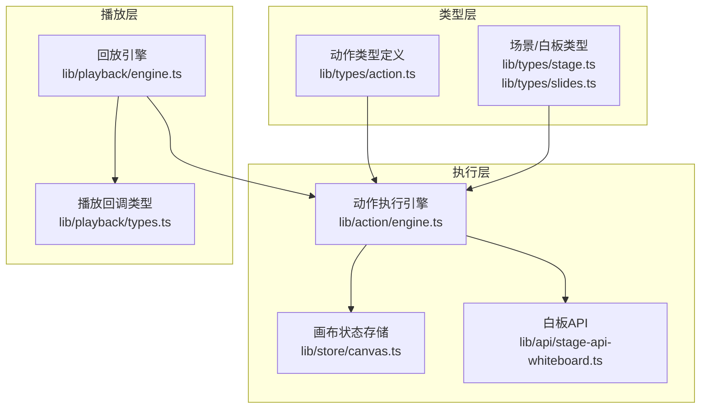
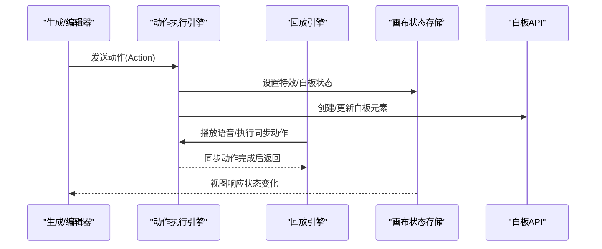
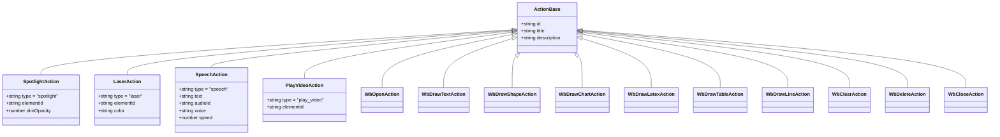
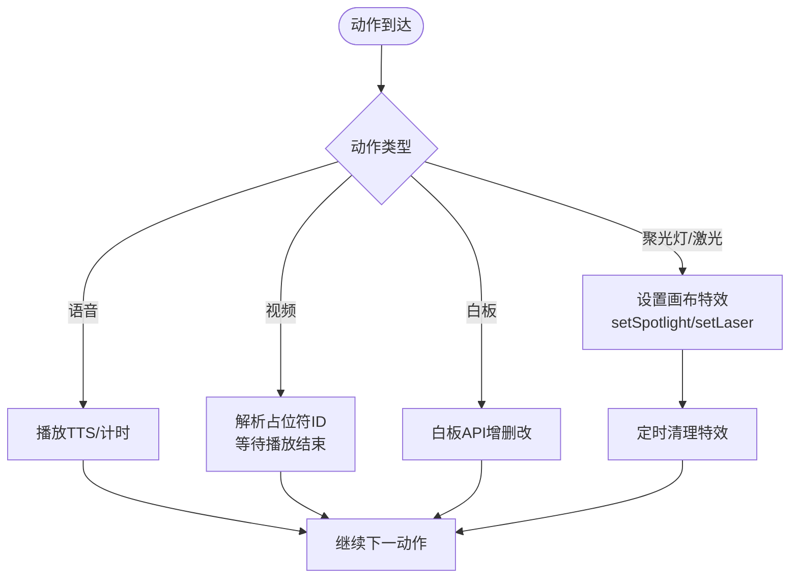
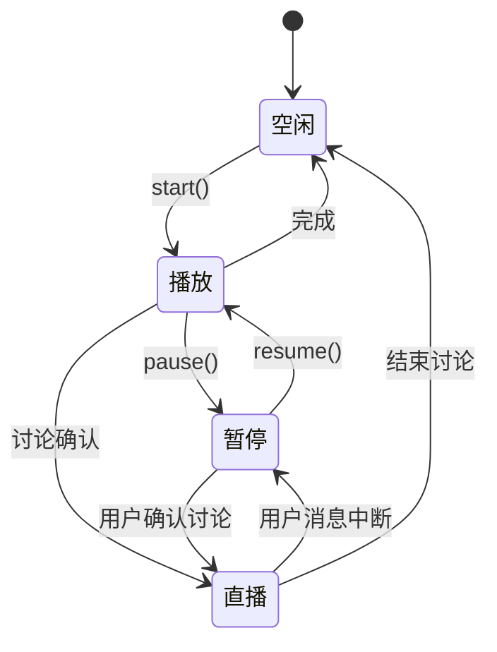
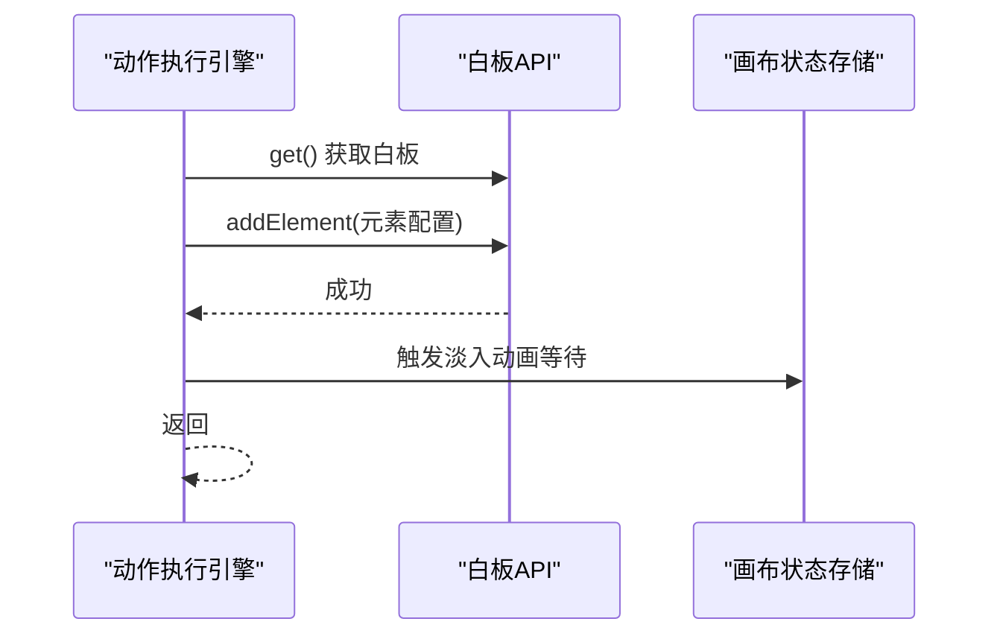
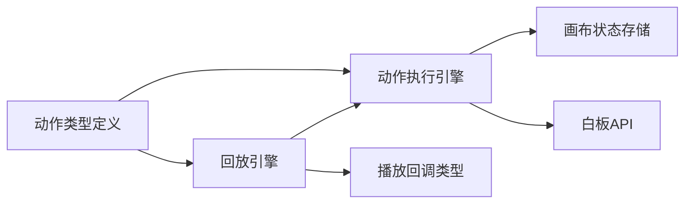

# 动作类型定义

<cite>
**本文档引用的文件**
- [lib/types/action.ts](file://lib/types/action.ts)
- [lib/action/engine.ts](file://lib/action/engine.ts)
- [lib/playback/engine.ts](file://lib/playback/engine.ts)
- [lib/playback/types.ts](file://lib/playback/types.ts)
- [lib/store/canvas.ts](file://lib/store/canvas.ts)
- [lib/types/stage.ts](file://lib/types/stage.ts)
- [lib/types/slides.ts](file://lib/types/slides.ts)
- [lib/api/stage-api-whiteboard.ts](file://lib/api/stage-api-whiteboard.ts)
- [components/chat/inline-action-tag.tsx](file://components/chat/inline-action-tag.tsx)
- [lib/orchestration/tool-schemas.ts](file://lib/orchestration/tool-schemas.ts)
- [components/slide-renderer/Editor/Canvas/Operate/ShapeElementOperate.tsx](file://components/slide-renderer/Editor/Canvas/Operate/ShapeElementOperate.tsx)
</cite>

## 目录
1. [简介](#简介)
2. [项目结构](#项目结构)
3. [核心组件](#核心组件)
4. [架构总览](#架构总览)
5. [详细组件分析](#详细组件分析)
6. [依赖关系分析](#依赖关系分析)
7. [性能考量](#性能考量)
8. [故障排查指南](#故障排查指南)
9. [结论](#结论)
10. [附录：动作类型扩展指南](#附录动作类型扩展指南)

## 简介
本文件系统化梳理动作类型定义与执行机制，覆盖以下方面：
- 动作类型的分类与定义：语音、白板绘制、特效（聚光灯/激光）、视频播放、讨论等
- 动作参数结构：时间戳、持续时间、位置信息、样式属性等
- 执行约束与验证规则：同步/异步模式、作用域限制、生命周期管理
- 与场景渲染的关系：动作如何驱动画布状态与元素更新
- 生命周期：从生成到播放、暂停/恢复、讨论交互、结束
- 扩展指南：新增动作类型的定义规范与集成方法
- 安全与性能：输入校验、资源清理、动画节流与幂等控制

## 项目结构
动作系统由“类型定义 + 执行引擎 + 回放引擎 + 渲染状态”四层构成，类型定义位于统一接口，执行引擎负责具体行为，回放引擎编排播放流程，渲染状态通过画布存储驱动UI。

**图表来源**
- [lib/types/action.ts:1-221](file://lib/types/action.ts#L1-L221)
- [lib/action/engine.ts:1-519](file://lib/action/engine.ts#L1-L519)
- [lib/playback/engine.ts:1-525](file://lib/playback/engine.ts#L1-L525)
- [lib/store/canvas.ts:1-473](file://lib/store/canvas.ts#L1-L473)
- [lib/types/stage.ts:1-124](file://lib/types/stage.ts#L1-L124)
- [lib/types/slides.ts:1-200](file://lib/types/slides.ts#L1-L200)
- [lib/api/stage-api-whiteboard.ts:1-255](file://lib/api/stage-api-whiteboard.ts#L1-L255)

**章节来源**
- [lib/types/action.ts:1-221](file://lib/types/action.ts#L1-L221)
- [lib/action/engine.ts:1-519](file://lib/action/engine.ts#L1-L519)
- [lib/playback/engine.ts:1-525](file://lib/playback/engine.ts#L1-L525)
- [lib/store/canvas.ts:1-473](file://lib/store/canvas.ts#L1-L473)
- [lib/types/stage.ts:1-124](file://lib/types/stage.ts#L1-L124)
- [lib/types/slides.ts:1-200](file://lib/types/slides.ts#L1-L200)
- [lib/api/stage-api-whiteboard.ts:1-255](file://lib/api/stage-api-whiteboard.ts#L1-L255)

## 核心组件
- 动作类型定义：集中于统一接口，区分“异步立即生效”和“同步等待完成”
- 动作执行引擎：根据动作类型路由到具体实现，负责白板元素创建、特效设置、媒体播放等
- 回放引擎：按场景顺序推进，处理语音计时、特效触发、讨论触发与直播态切换
- 画布状态存储：维护聚光灯/激光/高亮/缩放/视频播放等UI状态，并提供清理能力

**章节来源**
- [lib/types/action.ts:163-205](file://lib/types/action.ts#L163-L205)
- [lib/action/engine.ts:80-125](file://lib/action/engine.ts#L80-L125)
- [lib/playback/engine.ts:369-523](file://lib/playback/engine.ts#L369-L523)
- [lib/store/canvas.ts:442-457](file://lib/store/canvas.ts#L442-L457)

## 架构总览
动作系统采用“类型驱动 + 状态驱动”的双轨设计：
- 类型驱动：所有动作以统一接口描述，保证在线/离线路径一致
- 状态驱动：执行引擎与回放引擎通过共享状态（画布存储）实现UI联动

**图表来源**
- [lib/action/engine.ts:80-125](file://lib/action/engine.ts#L80-L125)
- [lib/playback/engine.ts:398-523](file://lib/playback/engine.ts#L398-L523)
- [lib/store/canvas.ts:356-457](file://lib/store/canvas.ts#L356-L457)
- [lib/api/stage-api-whiteboard.ts:155-178](file://lib/api/stage-api-whiteboard.ts#L155-L178)

## 详细组件分析

### 动作类型分类与参数结构
- 异步立即生效（fire-and-forget）：聚光灯、激光
  - 参数：目标元素ID、可选样式（如聚光不透明度、激光颜色）
  - 特性：执行后自动清理，避免阻塞后续动作
- 同步动作：语音、视频播放、白板操作、讨论
  - 语音：文本、可选音频ID、声音、语速
  - 视频播放：目标元素ID（当前页元素）
  - 白板：打开/关闭、清空、删除指定元素；绘制文本/形状/图表/LaTeX/表格/线条
  - 讨论：话题、提示词、可选代理ID

**图表来源**
- [lib/types/action.ts:14-182](file://lib/types/action.ts#L14-L182)

**章节来源**
- [lib/types/action.ts:22-161](file://lib/types/action.ts#L22-L161)

### 执行约束与验证规则
- 同步/异步约束
  - 异步动作：聚光灯、激光，立即返回，定时清理
  - 同步动作：语音、视频、白板、讨论，需等待完成再继续
- 作用域限制
  - 聚光灯/激光仅作用于滑动场景（需要画布元素）
  - 白板动作需先打开白板，必要时自动打开
- 参数默认值与边界
  - 聚光灯不透明度、激光颜色有默认值
  - 白板绘制类动作提供默认宽高、颜色等
- 幂等与清理
  - 异步特效定时清理，避免残留
  - 白板清空带级联动画与延迟，确保视觉一致性

**章节来源**
- [lib/types/action.ts:184-205](file://lib/types/action.ts#L184-L205)
- [lib/action/engine.ts:82-84](file://lib/action/engine.ts#L82-L84)
- [lib/action/engine.ts:127-145](file://lib/action/engine.ts#L127-L145)
- [lib/action/engine.ts:494-511](file://lib/action/engine.ts#L494-L511)

### 与场景渲染的关系
- 画布状态驱动UI
  - 聚光灯/激光通过画布存储设置，渲染叠加层
  - 白板元素通过白板API写入，渲染器读取并绘制
- 场景切换与进度
  - 回放引擎在场景切换时清理特效并通知渲染器
  - 进度快照包含场景索引与动作索引，支持断点续播

**图表来源**
- [lib/action/engine.ts:86-125](file://lib/action/engine.ts#L86-L125)
- [lib/action/engine.ts:165-176](file://lib/action/engine.ts#L165-L176)
- [lib/action/engine.ts:180-228](file://lib/action/engine.ts#L180-L228)
- [lib/action/engine.ts:280-310](file://lib/action/engine.ts#L280-L310)
- [lib/store/canvas.ts:356-457](file://lib/store/canvas.ts#L356-L457)

**章节来源**
- [lib/store/canvas.ts:356-457](file://lib/store/canvas.ts#L356-L457)
- [lib/api/stage-api-whiteboard.ts:155-178](file://lib/api/stage-api-whiteboard.ts#L155-L178)

### 回放引擎与生命周期
- 状态机：空闲(idle) → 播放(playing) → 暂停(paused) → 直播(live)
- 关键流程
  - 语音：播放或估算阅读时长，结束后推进
  - 特效：立即触发并记录效果事件
  - 讨论：延时触发“主动卡片”，用户确认进入直播态
  - 同步动作：等待完成后再继续
- 断点续播：保存场景索引与动作索引，支持恢复

**图表来源**
- [lib/playback/engine.ts:43-84](file://lib/playback/engine.ts#L43-L84)
- [lib/playback/engine.ts:111-222](file://lib/playback/engine.ts#L111-L222)
- [lib/playback/engine.ts:224-286](file://lib/playback/engine.ts#L224-L286)
- [lib/playback/types.ts:14-18](file://lib/playback/types.ts#L14-L18)

**章节来源**
- [lib/playback/engine.ts:369-523](file://lib/playback/engine.ts#L369-L523)
- [lib/playback/types.ts:28-62](file://lib/playback/types.ts#L28-L62)

### 白板动作详解
- 绘制文本：支持HTML内容与默认字体/颜色
- 绘制形状：内置矩形/圆形/三角形路径
- 绘制图表：支持多种图表类型与主题色
- 绘制LaTeX：使用KaTeX渲染，异常时记录告警
- 绘制表格：行列数据、列宽分布、主题与边框
- 绘制线条：起点/终点坐标、线型与端点标记
- 元素管理：打开/关闭、清空（带级联动画）、删除指定元素

**图表来源**
- [lib/action/engine.ts:280-310](file://lib/action/engine.ts#L280-L310)
- [lib/action/engine.ts:337-359](file://lib/action/engine/engine.ts#L337-L359)
- [lib/action/engine.ts:361-395](file://lib/action/engine.ts#L361-L395)
- [lib/action/engine.ts:397-451](file://lib/action/engine.ts#L397-L451)
- [lib/action/engine.ts:453-484](file://lib/action/engine.ts#L453-L484)
- [lib/api/stage-api-whiteboard.ts:155-178](file://lib/api/stage-api-whiteboard.ts#L155-L178)

**章节来源**
- [lib/action/engine.ts:280-511](file://lib/action/engine.ts#L280-L511)
- [lib/api/stage-api-whiteboard.ts:155-255](file://lib/api/stage-api-whiteboard.ts#L155-L255)

### 语音动作与TTS
- 支持预生成音频ID或实时TTS
- 无预生成音频时，按CJK字符/英文单词估算阅读时长
- 播放结束回调推进下一动作，暂停时保留剩余时长

**章节来源**
- [lib/playback/engine.ts:399-445](file://lib/playback/engine.ts#L399-L445)
- [lib/action/engine.ts:165-176](file://lib/action/engine.ts#L165-L176)

### 讨论动作与交互
- 讨论动作可被跳过（按代理选择策略）
- 延时触发“主动卡片”，用户确认后进入直播态
- 结束讨论后恢复到之前的播放位置

**章节来源**
- [lib/playback/engine.ts:464-498](file://lib/playback/engine.ts#L464-L498)
- [lib/playback/engine.ts:267-286](file://lib/playback/engine.ts#L267-L286)

## 依赖关系分析
- 类型依赖：动作类型统一定义，执行/回放均依赖此接口
- 执行依赖：执行引擎依赖画布存储与白板API
- 回放依赖：回放引擎依赖执行引擎与播放回调类型

**图表来源**
- [lib/types/action.ts:163-182](file://lib/types/action.ts#L163-L182)
- [lib/action/engine.ts:56-65](file://lib/action/engine.ts#L56-L65)
- [lib/playback/engine.ts:58-61](file://lib/playback/engine.ts#L58-L61)
- [lib/playback/types.ts:28-62](file://lib/playback/types.ts#L28-L62)

**章节来源**
- [lib/types/action.ts:163-182](file://lib/types/action.ts#L163-L182)
- [lib/action/engine.ts:56-65](file://lib/action/engine.ts#L56-L65)
- [lib/playback/engine.ts:58-61](file://lib/playback/engine.ts#L58-L61)
- [lib/playback/types.ts:28-62](file://lib/playback/types.ts#L28-L62)

## 性能考量
- 异步特效自动清理：避免长时间累积导致的重绘压力
- 白板清空级联动画：按元素数量动态计算时长，上限控制
- 语音计时：按语言特征估算时长，减少不必要的TTS调用
- 渲染缩放：画布按容器自适应缩放，避免大尺寸重绘
- 动画节流：视频播放与特效清理分离，避免相互干扰

**章节来源**
- [lib/action/engine.ts:127-145](file://lib/action/engine.ts#L127-L145)
- [lib/action/engine.ts:494-511](file://lib/action/engine.ts#L494-L511)
- [lib/playback/engine.ts:415-434](file://lib/playback/engine.ts#L415-L434)
- [lib/store/canvas.ts:99-101](file://lib/store/canvas.ts#L99-L101)

## 故障排查指南
- 语音未播放
  - 检查是否存在预生成音频ID或TTS可用
  - 若无音频，确认是否正确估算阅读时长
- 特效不消失
  - 确认是否处于异步模式且定时清理已触发
  - 检查是否有其他状态覆盖（如视频播放）
- 白板无法绘制
  - 确认白板已打开，必要时自动打开逻辑是否生效
  - 检查元素ID与白板ID匹配
- 讨论未触发
  - 检查讨论动作是否被跳过（代理选择策略）
  - 确认延时触发是否被暂停/停止打断

**章节来源**
- [lib/action/engine.ts:127-145](file://lib/action/engine.ts#L127-L145)
- [lib/action/engine.ts:266-270](file://lib/action/engine.ts#L266-L270)
- [lib/playback/engine.ts:482-498](file://lib/playback/engine.ts#L482-L498)

## 结论
动作系统通过统一类型定义与执行/回放双引擎协作，实现了课堂播放的高一致性与可扩展性。异步特效与同步动作的清晰划分，配合严格的清理与断点续播机制，既保障了教学体验，也为未来扩展新动作类型提供了稳定基础。

## 附录：动作类型扩展指南
- 新增动作类型步骤
  1) 在类型定义中添加新动作接口，继承基础字段
  2) 在动作联合类型中加入新类型
  3) 在执行引擎switch分支中添加对应处理函数
  4) 如需白板/画布联动，补充状态设置或API调用
  5) 在回放引擎中决定是异步立即返回还是同步等待
  6) 更新工具Schema与前端动作标签映射
- 参数设计建议
  - 明确必填/可选字段，提供合理默认值
  - 对位置/尺寸参数给出范围约束
  - 对颜色/样式参数提供默认值与兼容格式
- 安全与健壮性
  - 对外部输入进行边界检查（如坐标、索引）
  - 对第三方渲染（如LaTeX）增加异常捕获
  - 对媒体占位符ID进行解析与存在性校验
- 性能优化
  - 尽量采用异步立即生效以避免阻塞
  - 复杂绘制动作提供节流/批处理策略
  - 使用状态存储的批量清理能力

**章节来源**
- [lib/types/action.ts:163-182](file://lib/types/action.ts#L163-L182)
- [lib/action/engine.ts:86-125](file://lib/action/engine.ts#L86-L125)
- [lib/orchestration/tool-schemas.ts:49-68](file://lib/orchestration/tool-schemas.ts#L49-L68)
- [components/chat/inline-action-tag.tsx:55-77](file://components/chat/inline-action-tag.tsx#L55-L77)