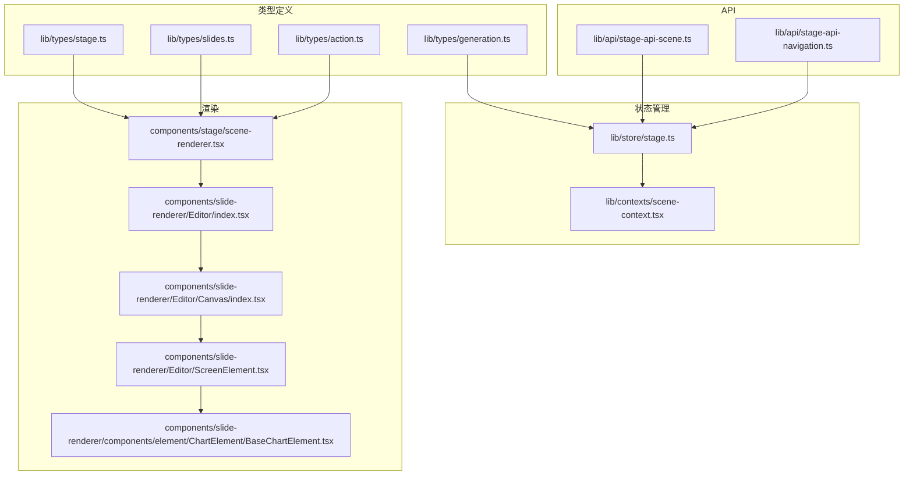
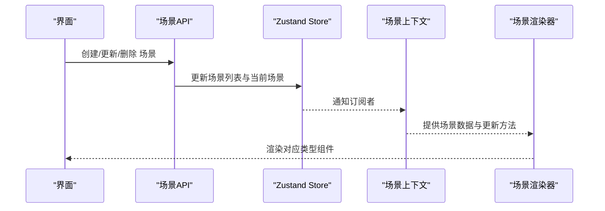
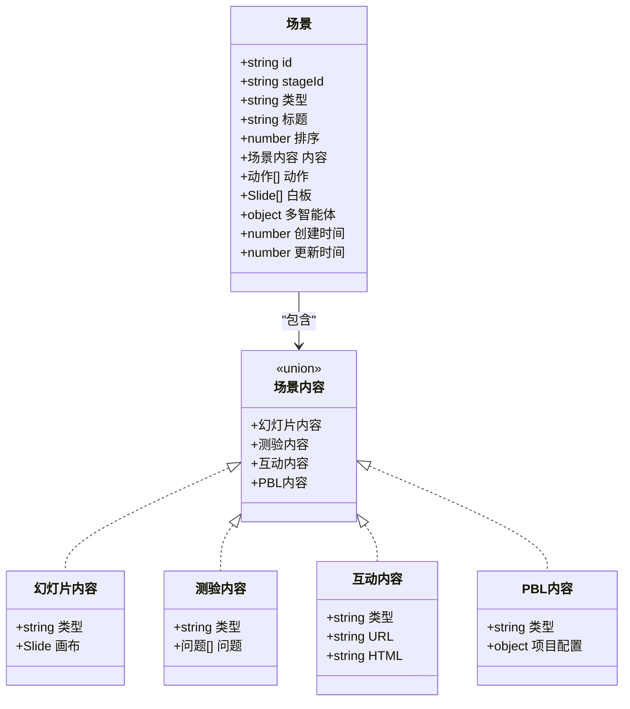
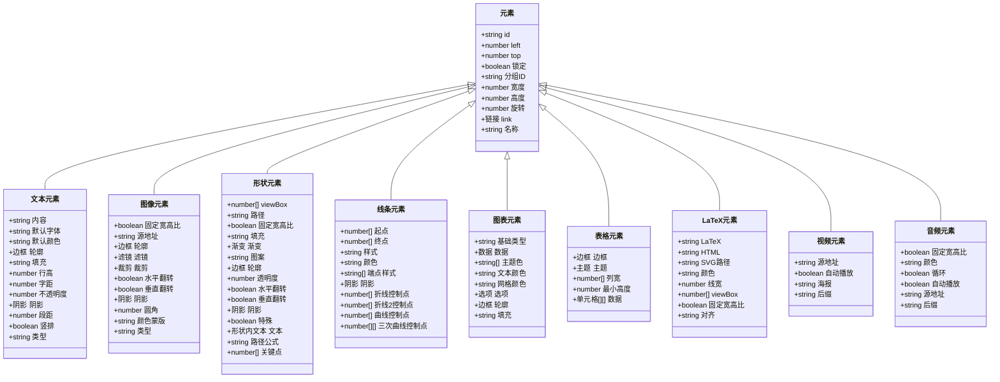
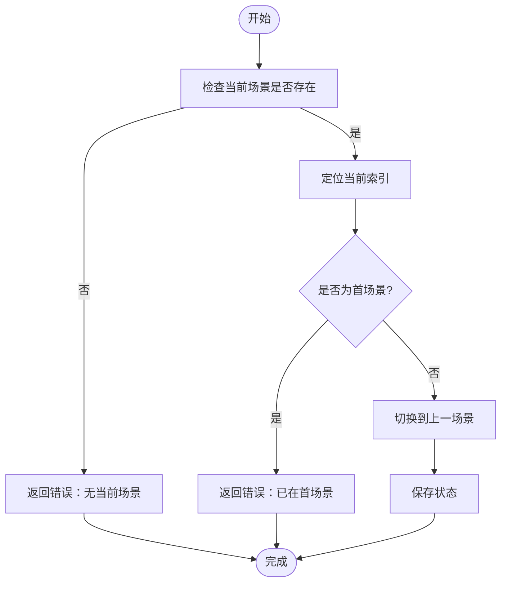
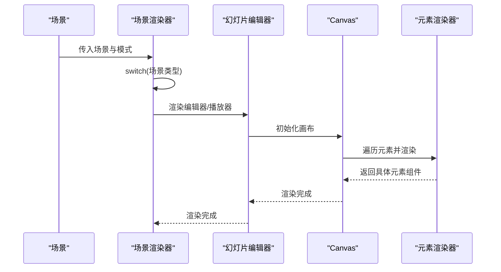
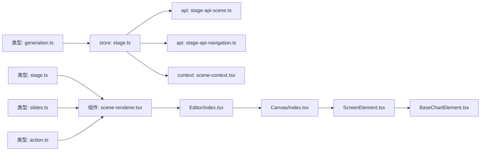

# 场景类型定义

<cite>
**本文档引用的文件**
- [lib/types/stage.ts](file://lib/types/stage.ts)
- [lib/types/slides.ts](file://lib/types/slides.ts)
- [lib/types/action.ts](file://lib/types/action.ts)
- [lib/types/generation.ts](file://lib/types/generation.ts)
- [lib/contexts/scene-context.tsx](file://lib/contexts/scene-context.tsx)
- [lib/store/stage.ts](file://lib/store/stage.ts)
- [lib/api/stage-api-scene.ts](file://lib/api/stage-api-scene.ts)
- [lib/api/stage-api-navigation.ts](file://lib/api/stage-api-navigation.ts)
- [components/stage/scene-renderer.tsx](file://components/stage/scene-renderer.tsx)
- [components/stage/scene-sidebar.tsx](file://components/stage/scene-sidebar.tsx)
- [components/slide-renderer/Editor/index.tsx](file://components/slide-renderer/Editor/index.tsx)
- [components/slide-renderer/Editor/Canvas/index.tsx](file://components/slide-renderer/Editor/Canvas/index.tsx)
- [components/slide-renderer/Editor/ScreenElement.tsx](file://components/slide-renderer/Editor/ScreenElement.tsx)
- [components/slide-renderer/components/element/ChartElement/BaseChartElement.tsx](file://components/slide-renderer/components/element/ChartElement/BaseChartElement.tsx)
</cite>

## 目录
1. [引言](#引言)
2. [项目结构](#项目结构)
3. [核心组件](#核心组件)
4. [架构总览](#架构总览)
5. [详细组件分析](#详细组件分析)
6. [依赖关系分析](#依赖关系分析)
7. [性能考虑](#性能考虑)
8. [故障排查指南](#故障排查指南)
9. [结论](#结论)
10. [附录](#附录)

## 引言
本文件系统化梳理 OpenMAIC 中“场景类型”的完整定义与实现，覆盖以下方面：
- 场景元数据结构：标识、类型、标题、描述、排序与附加信息
- 场景内容类型：幻灯片、测验、互动、PBL 的内容模型
- 幻灯片元素集合：文本、图像、形状、线条、图表、表格、LaTeX、视频、音频等元素的类型定义与属性
- 交互规则与状态管理：动作系统、场景导航、状态持久化与恢复
- 渲染器接口与组件集成：场景渲染器如何根据类型选择具体渲染组件
- 扩展方法：新增场景类型的开发流程与集成规范
- 数据验证与错误处理：API 层校验、运行时错误捕获与提示

## 项目结构
围绕场景类型的核心代码分布在以下模块：
- 类型定义层：场景、内容、元素、动作、生成大纲等类型
- 状态管理层：Zustand store、场景上下文、生成状态
- API 层：场景增删改查、场景导航
- 渲染层：场景渲染器、幻灯片编辑器/播放器、元素渲染器

**图表来源**
- [lib/types/stage.ts:1-124](file://lib/types/stage.ts#L1-L124)
- [lib/types/slides.ts:1-830](file://lib/types/slides.ts#L1-L830)
- [lib/types/action.ts:1-221](file://lib/types/action.ts#L1-L221)
- [lib/types/generation.ts:1-229](file://lib/types/generation.ts#L1-L229)
- [lib/store/stage.ts:1-336](file://lib/store/stage.ts#L1-L336)
- [lib/contexts/scene-context.tsx:1-164](file://lib/contexts/scene-context.tsx#L1-L164)
- [lib/api/stage-api-scene.ts:1-177](file://lib/api/stage-api-scene.ts#L1-L177)
- [lib/api/stage-api-navigation.ts:51-94](file://lib/api/stage-api-navigation.ts#L51-L94)
- [components/stage/scene-renderer.tsx:1-37](file://components/stage/scene-renderer.tsx#L1-L37)
- [components/slide-renderer/Editor/index.tsx:1-19](file://components/slide-renderer/Editor/index.tsx#L1-L19)
- [components/slide-renderer/Editor/Canvas/index.tsx:1-416](file://components/slide-renderer/Editor/Canvas/index.tsx#L1-L416)
- [components/slide-renderer/Editor/ScreenElement.tsx:1-70](file://components/slide-renderer/Editor/ScreenElement.tsx#L1-L70)
- [components/slide-renderer/components/element/ChartElement/BaseChartElement.tsx:1-55](file://components/slide-renderer/components/element/ChartElement/BaseChartElement.tsx#L1-L55)

**章节来源**
- [lib/types/stage.ts:1-124](file://lib/types/stage.ts#L1-L124)
- [lib/types/slides.ts:1-830](file://lib/types/slides.ts#L1-L830)
- [lib/types/action.ts:1-221](file://lib/types/action.ts#L1-L221)
- [lib/types/generation.ts:1-229](file://lib/types/generation.ts#L1-L229)
- [lib/store/stage.ts:1-336](file://lib/store/stage.ts#L1-L336)
- [lib/contexts/scene-context.tsx:1-164](file://lib/contexts/scene-context.tsx#L1-L164)
- [lib/api/stage-api-scene.ts:1-177](file://lib/api/stage-api-scene.ts#L1-L177)
- [lib/api/stage-api-navigation.ts:51-94](file://lib/api/stage-api-navigation.ts#L51-L94)
- [components/stage/scene-renderer.tsx:1-37](file://components/stage/scene-renderer.tsx#L1-L37)
- [components/slide-renderer/Editor/index.tsx:1-19](file://components/slide-renderer/Editor/index.tsx#L1-L19)
- [components/slide-renderer/Editor/Canvas/index.tsx:1-416](file://components/slide-renderer/Editor/Canvas/index.tsx#L1-L416)
- [components/slide-renderer/Editor/ScreenElement.tsx:1-70](file://components/slide-renderer/Editor/ScreenElement.tsx#L1-L70)
- [components/slide-renderer/components/element/ChartElement/BaseChartElement.tsx:1-55](file://components/slide-renderer/components/element/ChartElement/BaseChartElement.tsx#L1-L55)

## 核心组件
- 场景类型与内容
  - 场景类型枚举：幻灯片、测验、互动、PBL
  - 场景内容联合类型：按类型绑定具体内容结构
- 幻灯片元素类型
  - 元素类型枚举：文本、图像、形状、线条、图表、表格、LaTeX、视频、音频
  - 元素通用属性与特有属性：位置、尺寸、旋转、链接、填充、阴影、边框、滤镜、裁剪、动画等
- 动作系统
  - 可视化动作（即时）与同步动作（阻塞）
  - 白板绘制、语音、激光聚焦、视频播放、讨论等
- 场景渲染器
  - 根据场景类型动态选择渲染组件（编辑器/播放器/PBL/互动）

**章节来源**
- [lib/types/stage.ts:6-124](file://lib/types/stage.ts#L6-L124)
- [lib/types/slides.ts:25-676](file://lib/types/slides.ts#L25-L676)
- [lib/types/action.ts:14-221](file://lib/types/action.ts#L14-L221)
- [components/stage/scene-renderer.tsx:15-36](file://components/stage/scene-renderer.tsx#L15-L36)

## 架构总览
场景类型贯穿“类型定义—状态管理—API—渲染”链路，形成统一的数据模型与渲染策略。

**图表来源**
- [lib/api/stage-api-scene.ts:32-176](file://lib/api/stage-api-scene.ts#L32-L176)
- [lib/store/stage.ts:98-323](file://lib/store/stage.ts#L98-L323)
- [lib/contexts/scene-context.tsx:38-103](file://lib/contexts/scene-context.tsx#L38-L103)
- [components/stage/scene-renderer.tsx:15-36](file://components/stage/scene-renderer.tsx#L15-L36)

## 详细组件分析

### 场景元数据与内容模型
- 场景元数据
  - 标识：全局唯一 ID
  - 类型：'slide' | 'quiz' | 'interactive' | 'pbl'
  - 标题与描述：教学目的与要点
  - 排序：order 数值，决定显示顺序
  - 时间戳：创建与更新时间
  - 白板与多智能体配置：可选
- 场景内容
  - 幻灯片：包含 Slide 结构（元素、背景、动画、主题等）
  - 测验：问题集合（单选、多选、简答）
  - 互动：外链 URL 或嵌入 HTML
  - PBL：项目配置对象

**图表来源**
- [lib/types/stage.ts:31-114](file://lib/types/stage.ts#L31-L114)

**章节来源**
- [lib/types/stage.ts:31-114](file://lib/types/stage.ts#L31-L114)

### 幻灯片元素集合类型定义
- 元素类型枚举：文本、图像、形状、线条、图表、表格、LaTeX、视频、音频
- 通用属性：位置(left/top)、尺寸(width/height)、旋转(rotate)、锁定(lock)、分组(groupId)、链接(link)、名称(name)
- 特有属性
  - 文本：默认字体/颜色、行高/字距/段距、竖排、类型
  - 图像：固定宽高比、源地址、滤镜、裁剪、翻转、阴影、圆角、颜色蒙版、类型
  - 形状：viewBox/path、固定宽高比、填充/渐变/图案、轮廓、透明度、翻转、阴影、特殊形状、内嵌文本、路径公式、关键点
  - 线条：起点/终点、样式、颜色、端点样式、阴影、折线/曲线控制点
  - 图表：基础类型(bar/column/line/pie/ring/area/radar/scatter)、数据、主题色、文本/网格颜色、选项
  - 表格：边框、主题、列宽数组、单元格最小高度、二维单元格数组
  - LaTeX：LaTeX 代码、HTML 渲染结果、SVG 兼容字段
  - 视频/音频：源地址、自动播放、海报、循环、后缀

**图表来源**
- [lib/types/slides.ts:129-676](file://lib/types/slides.ts#L129-L676)

**章节来源**
- [lib/types/slides.ts:25-676](file://lib/types/slides.ts#L25-L676)

### 场景交互规则与状态管理
- 动作系统
  - 即时动作：聚光灯、激光
  - 同步动作：语音、白板打开/绘制/清除/关闭、视频播放、讨论
  - 作用域：部分动作仅适用于幻灯片场景
- 场景导航
  - 上一页/下一页：基于当前索引与场景列表
  - 边界保护：首尾场景不可越界
- 状态持久化
  - Store 提供保存/加载：IndexedDB 存储场景、聊天、大纲
  - 生成状态：生成阶段、进度、失败项、重试
  - 防抖写入：避免频繁存储

**图表来源**
- [lib/api/stage-api-navigation.ts:74-94](file://lib/api/stage-api-navigation.ts#L74-L94)

**章节来源**
- [lib/types/action.ts:22-221](file://lib/types/action.ts#L22-L221)
- [lib/api/stage-api-navigation.ts:51-94](file://lib/api/stage-api-navigation.ts#L51-L94)
- [lib/store/stage.ts:98-336](file://lib/store/stage.ts#L98-L336)

### 场景渲染器接口与组件集成
- 场景渲染器
  - 根据场景类型选择渲染组件：幻灯片编辑器/播放器、测验视图、互动渲染器、PBL 渲染器
  - 类型校验：确保内容类型与场景类型一致
- 幻灯片渲染
  - 编辑模式：Canvas（拖拽、缩放、旋转、对齐、网格、标尺）
  - 播放模式：ScreenCanvas（只读/回放）
  - 元素渲染：ScreenElement 根据元素类型映射到具体组件（文本、图像、形状、线条、图表、LaTeX、表格、视频）
- 场景上下文
  - 提供当前场景数据与更新方法
  - 支持选择性订阅，仅在指定字段变化时触发重渲染

**图表来源**
- [components/stage/scene-renderer.tsx:15-36](file://components/stage/scene-renderer.tsx#L15-L36)
- [components/slide-renderer/Editor/index.tsx:10-18](file://components/slide-renderer/Editor/index.tsx#L10-L18)
- [components/slide-renderer/Editor/Canvas/index.tsx:62-101](file://components/slide-renderer/Editor/Canvas/index.tsx#L62-L101)
- [components/slide-renderer/Editor/ScreenElement.tsx:23-70](file://components/slide-renderer/Editor/ScreenElement.tsx#L23-L70)

**章节来源**
- [components/stage/scene-renderer.tsx:15-36](file://components/stage/scene-renderer.tsx#L15-L36)
- [components/slide-renderer/Editor/index.tsx:10-18](file://components/slide-renderer/Editor/index.tsx#L10-L18)
- [components/slide-renderer/Editor/Canvas/index.tsx:62-101](file://components/slide-renderer/Editor/Canvas/index.tsx#L62-L101)
- [components/slide-renderer/Editor/ScreenElement.tsx:23-70](file://components/slide-renderer/Editor/ScreenElement.tsx#L23-L70)
- [lib/contexts/scene-context.tsx:119-164](file://lib/contexts/scene-context.tsx#L119-L164)

### 场景类型扩展方法
- 新增场景类型步骤
  - 在类型定义中添加新类型枚举与内容接口
  - 在场景渲染器中增加类型分支与对应渲染组件
  - 若涉及编辑能力，补充编辑器/操作钩子与工具栏
  - 在 API 层完善创建/更新逻辑（默认内容、校验、排序）
  - 在状态层考虑持久化与生成流程的适配
- 集成规范
  - 保持与现有类型一致的元数据结构（id/type/title/description/order）
  - 明确内容模型与渲染边界
  - 提供默认内容工厂函数与校验逻辑
  - 保证动作系统的兼容性（如适用）

**章节来源**
- [lib/types/stage.ts:6-114](file://lib/types/stage.ts#L6-L114)
- [components/stage/scene-renderer.tsx:17-32](file://components/stage/scene-renderer.tsx#L17-L32)
- [lib/api/stage-api-scene.ts:32-79](file://lib/api/stage-api-scene.ts#L32-L79)

### 数据验证与错误处理
- 场景 API
  - 创建：校验所属 Stage，确定 order，合并默认内容，排序插入，返回 ID
  - 删除/更新：校验场景存在性，更新当前场景（若删除的是当前场景），返回成功/错误
  - 获取/列表：安全返回数据或错误信息
- 导航 API
  - 校验当前场景与列表非空，防止越界
- 运行时错误
  - 使用 try/catch 包裹，返回 { success, error } 结构
  - Store 加载/保存异常记录日志并抛出

**章节来源**
- [lib/api/stage-api-scene.ts:32-176](file://lib/api/stage-api-scene.ts#L32-L176)
- [lib/api/stage-api-navigation.ts:51-94](file://lib/api/stage-api-navigation.ts#L51-L94)
- [lib/store/stage.ts:250-306](file://lib/store/stage.ts#L250-L306)

## 依赖关系分析
- 类型依赖
  - Scene 依赖 SceneContent，后者由各场景类型内容组成
  - Slide 内含 PPTElement 联合类型，支持多种元素
  - Action 定义了统一的动作协议，被播放/生成流程消费
- 渲染依赖
  - 场景渲染器依赖类型判断与具体渲染组件
  - 幻灯片渲染依赖元素映射与主题配置
- 状态依赖
  - Store 管理场景列表与当前场景，API 直接修改 Store
  - 上下文提供订阅与更新，编辑器通过上下文访问/更新场景数据

**图表来源**
- [lib/types/stage.ts:1-124](file://lib/types/stage.ts#L1-L124)
- [lib/types/slides.ts:1-830](file://lib/types/slides.ts#L1-L830)
- [lib/types/action.ts:1-221](file://lib/types/action.ts#L1-L221)
- [lib/types/generation.ts:1-229](file://lib/types/generation.ts#L1-L229)
- [lib/store/stage.ts:1-336](file://lib/store/stage.ts#L1-L336)
- [lib/api/stage-api-scene.ts:1-177](file://lib/api/stage-api-scene.ts#L1-L177)
- [lib/api/stage-api-navigation.ts:51-94](file://lib/api/stage-api-navigation.ts#L51-L94)
- [lib/contexts/scene-context.tsx:1-164](file://lib/contexts/scene-context.tsx#L1-L164)
- [components/stage/scene-renderer.tsx:1-37](file://components/stage/scene-renderer.tsx#L1-L37)
- [components/slide-renderer/Editor/index.tsx:1-19](file://components/slide-renderer/Editor/index.tsx#L1-L19)
- [components/slide-renderer/Editor/Canvas/index.tsx:1-416](file://components/slide-renderer/Editor/Canvas/index.tsx#L1-L416)
- [components/slide-renderer/Editor/ScreenElement.tsx:1-70](file://components/slide-renderer/Editor/ScreenElement.tsx#L1-L70)
- [components/slide-renderer/components/element/ChartElement/BaseChartElement.tsx:1-55](file://components/slide-renderer/components/element/ChartElement/BaseChartElement.tsx#L1-L55)

**章节来源**
- [lib/types/stage.ts:1-124](file://lib/types/stage.ts#L1-L124)
- [lib/types/slides.ts:1-830](file://lib/types/slides.ts#L1-L830)
- [lib/types/action.ts:1-221](file://lib/types/action.ts#L1-L221)
- [lib/types/generation.ts:1-229](file://lib/types/generation.ts#L1-L229)
- [lib/store/stage.ts:1-336](file://lib/store/stage.ts#L1-L336)
- [lib/api/stage-api-scene.ts:1-177](file://lib/api/stage-api-scene.ts#L1-L177)
- [lib/api/stage-api-navigation.ts:51-94](file://lib/api/stage-api-navigation.ts#L51-L94)
- [lib/contexts/scene-context.tsx:1-164](file://lib/contexts/scene-context.tsx#L1-L164)
- [components/stage/scene-renderer.tsx:1-37](file://components/stage/scene-renderer.tsx#L1-L37)
- [components/slide-renderer/Editor/index.tsx:1-19](file://components/slide-renderer/Editor/index.tsx#L1-L19)
- [components/slide-renderer/Editor/Canvas/index.tsx:1-416](file://components/slide-renderer/Editor/Canvas/index.tsx#L1-L416)
- [components/slide-renderer/Editor/ScreenElement.tsx:1-70](file://components/slide-renderer/Editor/ScreenElement.tsx#L1-L70)
- [components/slide-renderer/components/element/ChartElement/BaseChartElement.tsx:1-55](file://components/slide-renderer/components/element/ChartElement/BaseChartElement.tsx#L1-L55)

## 性能考虑
- 精准订阅：useSceneSelector 通过选择器与浅比较减少不必要重渲染
- 防抖写入：Store 采用防抖保存，降低频繁 I/O
- 本地状态缓存：Canvas 在本地维护元素副本以优化拖拽/缩放/旋转等操作
- 元素映射：ScreenElement 使用映射表按类型快速选择组件，避免多重 if/switch

**章节来源**
- [lib/contexts/scene-context.tsx:142-164](file://lib/contexts/scene-context.tsx#L142-L164)
- [lib/store/stage.ts:333-336](file://lib/store/stage.ts#L333-L336)
- [components/slide-renderer/Editor/Canvas/index.tsx:92-101](file://components/slide-renderer/Editor/Canvas/index.tsx#L92-L101)
- [components/slide-renderer/Editor/ScreenElement.tsx:24-39](file://components/slide-renderer/Editor/ScreenElement.tsx#L24-L39)

## 故障排查指南
- 场景导航错误
  - “无当前场景”：检查是否已设置当前场景 ID
  - “已在首/末场景”：确认场景列表长度与当前索引
- 场景 CRUD 错误
  - “场景未找到”：确认场景 ID 是否存在于当前场景列表
  - “无 Stage 设置”：创建场景前需先设置 Stage
- 渲染异常
  - 类型不匹配：场景类型与内容类型不一致会导致渲染为空或报错
  - 元素缺失：检查元素 ID 与元素列表一致性
- 生成与存储
  - 加载失败：查看日志输出，确认 IndexedDB 是否存在对应记录
  - 保存失败：检查权限与磁盘空间

**章节来源**
- [lib/api/stage-api-navigation.ts:51-94](file://lib/api/stage-api-navigation.ts#L51-L94)
- [lib/api/stage-api-scene.ts:87-176](file://lib/api/stage-api-scene.ts#L87-L176)
- [components/stage/scene-renderer.tsx:17-32](file://components/stage/scene-renderer.tsx#L17-L32)
- [lib/store/stage.ts:250-306](file://lib/store/stage.ts#L250-L306)

## 结论
本文件系统化阐述了 OpenMAIC 的场景类型定义与实现，覆盖从类型模型、元素集合、动作系统到渲染与状态管理的全链路。通过清晰的类型约束、严格的校验与错误处理、以及高效的渲染与状态机制，系统实现了可扩展、可维护的场景体系。新增场景类型时，遵循本文档的扩展流程与集成规范，可快速融入现有架构。

## 附录
- 场景侧边栏展示
  - 侧边栏根据场景 order 与标题进行展示，支持点击切换当前场景
  - 生成中的场景使用虚拟 ID 标识，避免与正式场景冲突

**章节来源**
- [components/stage/scene-sidebar.tsx:173-188](file://components/stage/scene-sidebar.tsx#L173-L188)
- [components/stage/scene-sidebar.tsx:330-358](file://components/stage/scene-sidebar.tsx#L330-L358)