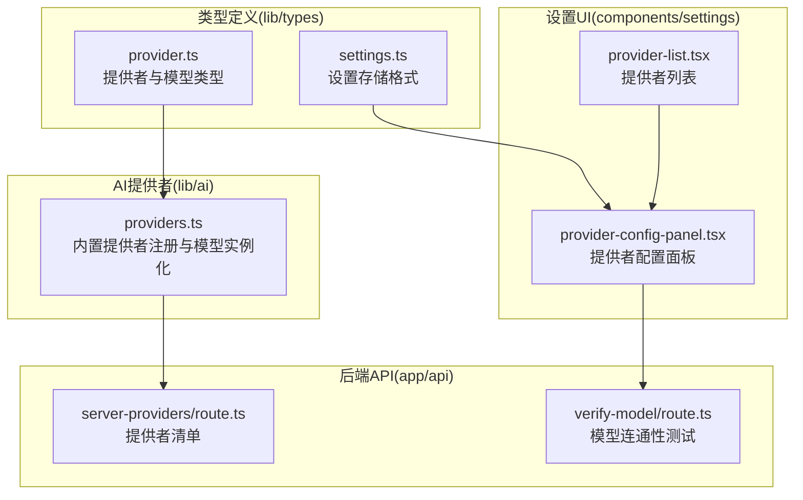
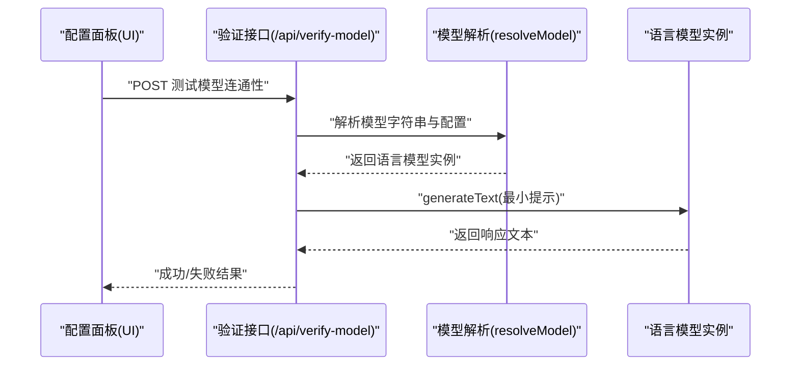
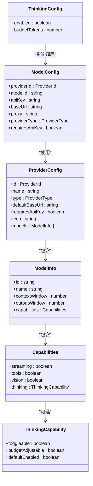
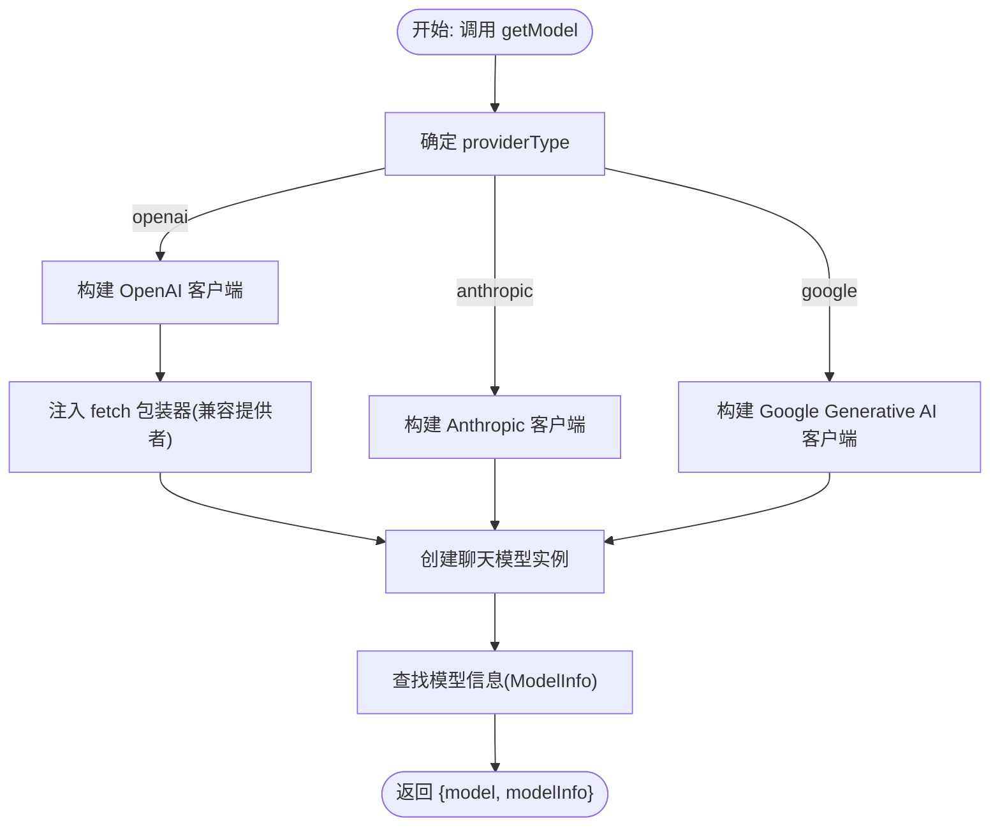
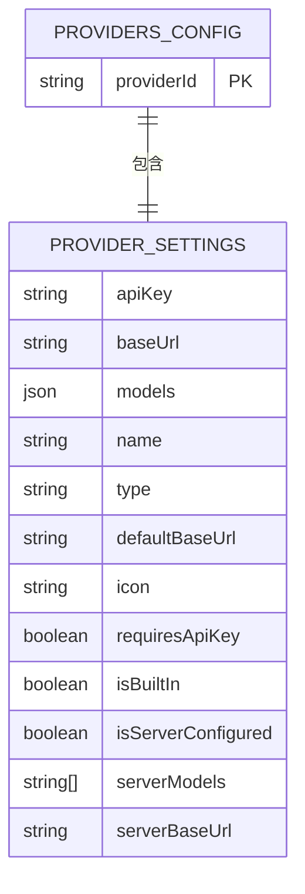
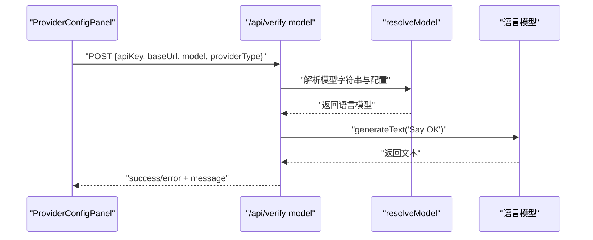
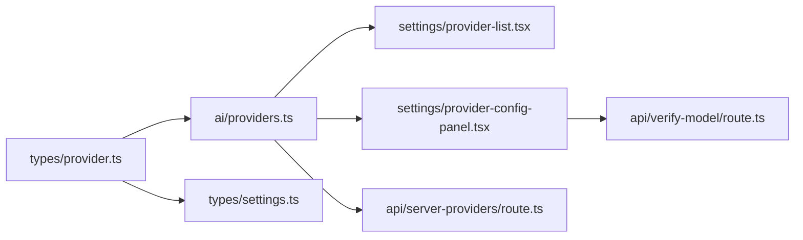

# 服务提供者类型定义

<cite>
**本文档引用的文件**
- [lib/ai/providers.ts](file://lib/ai/providers.ts)
- [lib/types/provider.ts](file://lib/types/provider.ts)
- [lib/types/settings.ts](file://lib/types/settings.ts)
- [components/settings/provider-config-panel.tsx](file://components/settings/provider-config-panel.tsx)
- [components/settings/provider-list.tsx](file://components/settings/provider-list.tsx)
- [app/api/server-providers/route.ts](file://app/api/server-providers/route.ts)
- [app/api/verify-model/route.ts](file://app/api/verify-model/route.ts)
</cite>

## 目录
1. [简介](#简介)
2. [项目结构](#项目结构)
3. [核心组件](#核心组件)
4. [架构总览](#架构总览)
5. [详细组件分析](#详细组件分析)
6. [依赖关系分析](#依赖关系分析)
7. [性能考虑](#性能考虑)
8. [故障排除指南](#故障排除指南)
9. [结论](#结论)
10. [附录](#附录)

## 简介
本文件系统性地文档化了 OpenMAIC 中服务提供者（AI 与多媒体）的类型定义与实现机制，覆盖以下主题：
- AI 服务提供者的统一接口与模型配置
- 多媒体服务提供者（TTS、ASR、图像生成、视频处理等）的类型结构
- 提供者注册与管理（内置与自定义）、动态配置、健康检查与故障转移
- 扩展接口与自定义服务提供商集成
- 安全配置与访问控制
- 监控指标与性能评估标准

## 项目结构
OpenMAIC 将服务提供者相关的类型与实现集中在 lib/types 与 lib/ai 下，UI 配置面板位于 components/settings，后端提供者清单与验证接口位于 app/api。

图表来源
- [lib/types/provider.ts:1-104](file://lib/types/provider.ts#L1-L104)
- [lib/types/settings.ts:1-50](file://lib/types/settings.ts#L1-L50)
- [lib/ai/providers.ts:1-1089](file://lib/ai/providers.ts#L1-L1089)
- [components/settings/provider-list.tsx:1-86](file://components/settings/provider-list.tsx#L1-L86)
- [components/settings/provider-config-panel.tsx:1-403](file://components/settings/provider-config-panel.tsx#L1-L403)
- [app/api/server-providers/route.ts:1-35](file://app/api/server-providers/route.ts#L1-L35)
- [app/api/verify-model/route.ts:1-69](file://app/api/verify-model/route.ts#L1-L69)

章节来源
- [lib/types/provider.ts:1-104](file://lib/types/provider.ts#L1-L104)
- [lib/types/settings.ts:1-50](file://lib/types/settings.ts#L1-L50)
- [lib/ai/providers.ts:1-1089](file://lib/ai/providers.ts#L1-L1089)
- [components/settings/provider-list.tsx:1-86](file://components/settings/provider-list.tsx#L1-L86)
- [components/settings/provider-config-panel.tsx:1-403](file://components/settings/provider-config-panel.tsx#L1-L403)
- [app/api/server-providers/route.ts:1-35](file://app/api/server-providers/route.ts#L1-L35)
- [app/api/verify-model/route.ts:1-69](file://app/api/verify-model/route.ts#L1-L69)

## 核心组件
- 类型定义层：定义 ProviderId、ProviderType、ProviderConfig、ModelInfo、ModelConfig、ThinkingConfig 等核心类型，确保前后端一致的数据契约。
- 提供者注册层：内置提供者集中注册在 PROVIDERS 中，包含名称、图标、默认 Base URL、是否需要 API Key、模型列表及能力标识。
- 实例化层：getModel 根据 ProviderConfig 或 ModelConfig 动态创建语言模型实例，支持 OpenAI、Anthropic、Google Generative AI 三类供应商类型。
- 设置存储层：ProvidersConfig 统一存储用户配置（含自定义提供者），支持服务器下发的覆盖与限制。
- UI 配置层：提供者列表与配置面板，支持测试连接、模型增删改、重置为默认等操作。
- 后端接口层：提供者清单接口返回各类型服务（LLM、TTS、ASR、图像、视频、PDF、网络搜索）的服务器侧配置；模型连通性测试接口用于健康检查。

章节来源
- [lib/types/provider.ts:8-104](file://lib/types/provider.ts#L8-L104)
- [lib/ai/providers.ts:51-840](file://lib/ai/providers.ts#L51-L840)
- [lib/ai/providers.ts:929-1036](file://lib/ai/providers.ts#L929-L1036)
- [lib/types/settings.ts:19-43](file://lib/types/settings.ts#L19-L43)
- [components/settings/provider-list.tsx:9-36](file://components/settings/provider-list.tsx#L9-L36)
- [components/settings/provider-config-panel.tsx:40-150](file://components/settings/provider-config-panel.tsx#L40-L150)
- [app/api/server-providers/route.ts:15-34](file://app/api/server-providers/route.ts#L15-L34)
- [app/api/verify-model/route.ts:8-68](file://app/api/verify-model/route.ts#L8-L68)

## 架构总览
下图展示了从 UI 到后端的调用链路与数据流，体现“类型定义—注册—实例化—配置—验证”的完整闭环。

图表来源
- [components/settings/provider-config-panel.tsx:110-150](file://components/settings/provider-config-panel.tsx#L110-L150)
- [app/api/verify-model/route.ts:8-68](file://app/api/verify-model/route.ts#L8-L68)

## 详细组件分析

### 类型定义与结构
- ProviderId 支持内置 ID 与自定义 ID（以 custom- 前缀）。ProviderType 限定为 openai、anthropic、google 三类。
- ProviderConfig 描述提供者元数据与模型集合；ModelInfo 描述模型的能力与窗口大小；ModelConfig 用于调用时的最小必要参数。
- ThinkingConfig 抽象跨供应商的“思考/推理”开关与预算令牌，适配不同供应商的特定字段映射。

图表来源
- [lib/types/provider.ts:82-104](file://lib/types/provider.ts#L82-L104)

章节来源
- [lib/types/provider.ts:8-104](file://lib/types/provider.ts#L8-L104)

### 内置提供者注册与模型实例化
- PROVIDERS 集中注册了 OpenAI、Anthropic、Google、GLM、Qwen、DeepSeek、Kimi、MiniMax、SiliconFlow、Doubao 等提供者，每个提供者包含默认 Base URL、是否需要 API Key、图标与模型列表。
- getModel 根据 providerType 创建对应 SDK 的语言模型实例；对于非原生 OpenAI 的兼容提供者，通过 fetch 包装器注入“思考”相关参数。
- 解析模型字符串（如 providerId:modelId）与查询所有可用模型的工具函数便于前端选择与展示。

图表来源
- [lib/ai/providers.ts:929-1036](file://lib/ai/providers.ts#L929-L1036)

章节来源
- [lib/ai/providers.ts:51-840](file://lib/ai/providers.ts#L51-L840)
- [lib/ai/providers.ts:929-1036](file://lib/ai/providers.ts#L929-L1036)
- [lib/ai/providers.ts:1041-1089](file://lib/ai/providers.ts#L1041-L1089)

### 设置存储与动态配置
- ProvidersConfig 使用 Record<ProviderId, ProviderSettings> 存储每个提供者的配置与元数据，支持用户编辑模型列表、覆盖 API Key/Base URL、标记是否为内置提供者以及服务器端覆盖信息。
- 自定义提供者通过 ProviderId 的 custom- 前缀与统一结构接入，无需修改核心逻辑。
- 服务器可通过 /api/server-providers 返回 isServerConfigured、serverModels、serverBaseUrl 等，前端在 UI 上进行差异化展示与禁用编辑。

图表来源
- [lib/types/settings.ts:19-43](file://lib/types/settings.ts#L19-L43)

章节来源
- [lib/types/settings.ts:19-43](file://lib/types/settings.ts#L19-L43)
- [components/settings/provider-list.tsx:9-36](file://components/settings/provider-list.tsx#L9-L36)
- [app/api/server-providers/route.ts:15-34](file://app/api/server-providers/route.ts#L15-L34)

### UI 配置面板与健康检查
- ProviderConfigPanel 提供 API Key 显示/隐藏、测试连接、是否需要 API Key、Base URL 输入、模型列表管理等功能。
- 测试连接调用 /api/verify-model，内部解析模型并发送最小提示，根据响应判断连通性与错误原因。
- 服务器配置覆盖：当 isServerConfigured 为真时，API Key 字段可选且禁用编辑，同时显示服务器已配置提示。

图表来源
- [components/settings/provider-config-panel.tsx:110-150](file://components/settings/provider-config-panel.tsx#L110-L150)
- [app/api/verify-model/route.ts:8-68](file://app/api/verify-model/route.ts#L8-L68)

章节来源
- [components/settings/provider-config-panel.tsx:40-150](file://components/settings/provider-config-panel.tsx#L40-L150)
- [app/api/verify-model/route.ts:8-68](file://app/api/verify-model/route.ts#L8-L68)

### 扩展接口与自定义提供者集成
- 自定义提供者通过 ProviderId 使用 custom- 前缀并在 ProvidersConfig 中以统一结构存储，支持覆盖 name、type、defaultBaseUrl、icon、requiresApiKey、models 等。
- 服务器端可下发 isServerConfigured 与 serverModels 限制，前端据此调整 UI 行为与可选模型列表。
- 兼容提供者通过 fetch 包装器注入“思考”参数，保证跨供应商的一致行为。

章节来源
- [lib/types/provider.ts:24](file://lib/types/provider.ts#L24)
- [lib/types/settings.ts:19-43](file://lib/types/settings.ts#L19-L43)
- [lib/ai/providers.ts:890-923](file://lib/ai/providers.ts#L890-L923)

### 安全配置与访问控制
- API Key 管理：requiresApiKey 控制是否必须提供；当 isServerConfigured 为真时，前端可隐藏或禁用输入框，由服务器提供密钥。
- Base URL 优先级：显式传入 > 提供者默认 > SDK 默认，避免硬编码风险。
- 代理支持：Google 提供者支持通过 proxy 参数使用 HTTP 代理，便于内网或合规场景。
- 错误分类：连通性测试接口对常见错误（401、404、429、DNS/连接错误、超时）进行归类，便于用户快速定位问题。

章节来源
- [lib/ai/providers.ts:1012-1026](file://lib/ai/providers.ts#L1012-L1026)
- [components/settings/provider-config-panel.tsx:174-194](file://components/settings/provider-config-panel.tsx#L174-L194)
- [app/api/verify-model/route.ts:48-66](file://app/api/verify-model/route.ts#L48-L66)

### 监控指标与性能评估
- 连接成功率与失败率：基于 /api/verify-model 的测试结果统计。
- 延迟分布：记录 generateText 的请求耗时，区分不同提供者与模型。
- 错误类型分布：401、404、429、网络错误、超时等占比。
- 模型性能：按模型维度统计输出长度、Token 使用量、成本估算（结合各供应商定价）。
- 可用性：提供者可用性与模型可用性矩阵，支持故障转移策略（如备用提供者/模型切换）。

[本节为通用指导，不直接分析具体文件]

## 依赖关系分析
- 类型定义依赖：lib/types/provider.ts 与 lib/types/settings.ts 为全局契约，被 lib/ai/providers.ts 与 UI 组件广泛引用。
- 组件耦合：UI 配置面板依赖类型定义与后端接口；后端接口依赖模型解析与语言模型 SDK。
- 外部依赖：@ai-sdk/openai、@ai-sdk/anthropic、@ai-sdk/google、undici（代理）。

图表来源
- [lib/types/provider.ts:1-104](file://lib/types/provider.ts#L1-L104)
- [lib/types/settings.ts:1-50](file://lib/types/settings.ts#L1-L50)
- [lib/ai/providers.ts:1-1089](file://lib/ai/providers.ts#L1-L1089)
- [components/settings/provider-list.tsx:1-86](file://components/settings/provider-list.tsx#L1-L86)
- [components/settings/provider-config-panel.tsx:1-403](file://components/settings/provider-config-panel.tsx#L1-L403)
- [app/api/server-providers/route.ts:1-35](file://app/api/server-providers/route.ts#L1-L35)
- [app/api/verify-model/route.ts:1-69](file://app/api/verify-model/route.ts#L1-L69)

章节来源
- [lib/types/provider.ts:1-104](file://lib/types/provider.ts#L1-L104)
- [lib/types/settings.ts:1-50](file://lib/types/settings.ts#L1-L50)
- [lib/ai/providers.ts:1-1089](file://lib/ai/providers.ts#L1-L1089)
- [components/settings/provider-list.tsx:1-86](file://components/settings/provider-list.tsx#L1-L86)
- [components/settings/provider-config-panel.tsx:1-403](file://components/settings/provider-config-panel.tsx#L1-L403)
- [app/api/server-providers/route.ts:1-35](file://app/api/server-providers/route.ts#L1-L35)
- [app/api/verify-model/route.ts:1-69](file://app/api/verify-model/route.ts#L1-L69)

## 性能考虑
- 连接池与代理：Google 提供者支持 HTTP 代理，减少网络延迟与合规风险。
- 模型选择：优先选择具备 streaming 与 tools 能力的模型，提升交互体验。
- 缓存策略：对模型列表与提供者元数据进行本地缓存，减少重复请求。
- 超时与重试：在 UI 层与后端接口层设置合理的超时与指数退避重试策略。

[本节为通用指导，不直接分析具体文件]

## 故障排除指南
- API Key 无效：检查 requiresApiKey 与 isServerConfigured 状态；确认服务器是否下发密钥。
- Base URL 不可达：核对自定义 Base URL 与默认值；检查网络与代理设置。
- 模型不可用：确认 serverModels 限制与模型 ID 是否正确；尝试其他模型。
- 速率限制：关注 429 错误，降低并发或等待冷却时间。
- 超时与 DNS：检查本地网络与 DNS 解析；必要时启用代理。

章节来源
- [app/api/verify-model/route.ts:48-66](file://app/api/verify-model/route.ts#L48-L66)
- [components/settings/provider-config-panel.tsx:174-194](file://components/settings/provider-config-panel.tsx#L174-L194)

## 结论
OpenMAIC 的服务提供者体系以强类型契约为基础，结合内置提供者注册、动态模型实例化、统一设置存储与 UI 验证流程，实现了对多供应商、多类型服务（LLM、TTS、ASR、图像、视频、PDF、网络搜索）的标准化管理。通过服务器端配置覆盖与客户端健康检查，系统具备良好的可扩展性、安全性与可观测性，能够满足复杂场景下的部署与运维需求。

## 附录
- 关键路径参考
  - 类型定义：[lib/types/provider.ts:1-104](file://lib/types/provider.ts#L1-L104)
  - 提供者注册与实例化：[lib/ai/providers.ts:1-1089](file://lib/ai/providers.ts#L1-L1089)
  - 设置存储格式：[lib/types/settings.ts:1-50](file://lib/types/settings.ts#L1-L50)
  - 提供者列表 UI：[components/settings/provider-list.tsx:1-86](file://components/settings/provider-list.tsx#L1-L86)
  - 配置面板 UI：[components/settings/provider-config-panel.tsx:1-403](file://components/settings/provider-config-panel.tsx#L1-L403)
  - 服务器提供者清单：[app/api/server-providers/route.ts:1-35](file://app/api/server-providers/route.ts#L1-L35)
  - 模型连通性测试：[app/api/verify-model/route.ts:1-69](file://app/api/verify-model/route.ts#L1-L69)