# 生成类型定义

<cite>
**本文引用的文件**
- [lib/types/generation.ts](file://lib/types/generation.ts)
- [lib/generation/pipeline-types.ts](file://lib/generation/pipeline-types.ts)
- [lib/types/pdf.ts](file://lib/types/pdf.ts)
- [lib/types/slides.ts](file://lib/types/slides.ts)
- [lib/types/stage.ts](file://lib/types/stage.ts)
- [lib/media/types.ts](file://lib/media/types.ts)
- [app/generation-preview/types.ts](file://app/generation-preview/types.ts)
</cite>

## 目录
1. [简介](#简介)
2. [项目结构](#项目结构)
3. [核心组件](#核心组件)
4. [架构总览](#架构总览)
5. [详细组件分析](#详细组件分析)
6. [依赖关系分析](#依赖关系分析)
7. [性能考量](#性能考量)
8. [故障排查指南](#故障排查指南)
9. [结论](#结论)
10. [附录](#附录)

## 简介
本文件系统化梳理 OpenMAIC 中“生成类型定义”的设计与实现，聚焦以下关键类型族：
- 用户需求类型：UserRequirements（简化输入）、AudienceProfile、StylePreferences、UploadedDocument、LegacyUserRequirements（向后兼容）
- 场景大纲类型：SceneOutline（含测验、交互式、PBL 等场景特定配置）
- 生成内容类型：GeneratedSlideContent、GeneratedQuizContent、GeneratedPBLContent、GeneratedInteractiveContent
- 文档处理类型：PdfImage、ImageMapping、ParsedPdfContent、ParsePdfRequest/Response
- 会话与进度类型：GenerationSession、GenerationProgress
- 生成流水线与回调：AgentInfo、SceneGenerationContext、GeneratedSlideData、GenerationResult、GenerationCallbacks、AICallFn
- 幻灯片元素与背景：PPTElement、Slide、SlideBackground、各元素子类型（文本、图片、形状、线条、图表、表格、LaTeX、视频、音频）

文档以循序渐进的方式呈现，先给出高层概览，再逐层深入到具体类型定义、关系与流程，并提供最佳实践与排障建议。

## 项目结构
生成类型主要分布在如下模块：
- lib/types/generation.ts：用户需求、场景大纲、生成内容、会话与进度、遗留类型
- lib/generation/pipeline-types.ts：流水线上下文、生成结果封装、回调与AI调用函数签名
- lib/types/pdf.ts：PDF解析结果、请求/响应、图像映射
- lib/types/slides.ts：幻灯片元素与背景、页面结构
- lib/types/stage.ts：场景与课堂结构、场景内容联合类型
- lib/media/types.ts：媒体生成请求（图像/视频）与任务适配器
- app/generation-preview/types.ts：生成预览会话状态（前端侧）

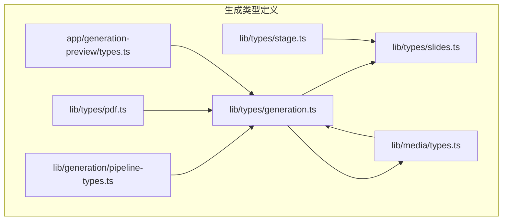

**图表来源**
- [lib/types/generation.ts](file://lib/types/generation.ts)
- [lib/generation/pipeline-types.ts](file://lib/generation/pipeline-types.ts)
- [lib/types/pdf.ts](file://lib/types/pdf.ts)
- [lib/types/slides.ts](file://lib/types/slides.ts)
- [lib/types/stage.ts](file://lib/types/stage.ts)
- [lib/media/types.ts](file://lib/media/types.ts)
- [app/generation-preview/types.ts](file://app/generation-preview/types.ts)

**章节来源**
- [lib/types/generation.ts](file://lib/types/generation.ts)
- [lib/generation/pipeline-types.ts](file://lib/generation/pipeline-types.ts)
- [lib/types/pdf.ts](file://lib/types/pdf.ts)
- [lib/types/slides.ts](file://lib/types/slides.ts)
- [lib/types/stage.ts](file://lib/types/stage.ts)
- [lib/media/types.ts](file://lib/media/types.ts)
- [app/generation-preview/types.ts](file://app/generation-preview/types.ts)

## 核心组件
本节概述关键类型及其职责：
- 用户需求类型：统一简化输入（UserRequirements），保留历史结构化需求（LegacyUserRequirements）以兼容
- 场景大纲类型：SceneOutline，承载场景类型、标题、描述、关键要点、教学目标、时长、顺序、语言、建议图像ID、媒体生成请求以及各类场景特定配置（测验、交互式、PBL）
- 生成内容类型：GeneratedSlideContent、GeneratedQuizContent、GeneratedPBLContent、GeneratedInteractiveContent，分别对应不同场景类型的最终产物
- 文档处理类型：PdfImage、ImageMapping、ParsedPdfContent、ParsePdfRequest/Response，支撑PDF解析与图像映射
- 会话与进度类型：GenerationSession、GenerationProgress，管理生成阶段、整体/阶段进度、状态消息、已生成场景数、总场景数与错误
- 流水线与回调：AgentInfo、SceneGenerationContext、GeneratedSlideData、GenerationResult、GenerationCallbacks、AICallFn，支撑跨页面上下文与回调驱动
- 幻灯片元素与背景：PPTElement、Slide、SlideBackground及各元素子类型，构成幻灯片内容的数据模型

**章节来源**
- [lib/types/generation.ts](file://lib/types/generation.ts)
- [lib/generation/pipeline-types.ts](file://lib/generation/pipeline-types.ts)
- [lib/types/pdf.ts](file://lib/types/pdf.ts)
- [lib/types/slides.ts](file://lib/types/slides.ts)
- [lib/types/stage.ts](file://lib/types/stage.ts)
- [lib/media/types.ts](file://lib/media/types.ts)
- [app/generation-preview/types.ts](file://app/generation-preview/types.ts)

## 架构总览
两阶段生成体系：
- 阶段1：用户需求 + 文档 → 场景大纲（按页）
- 阶段2：场景大纲 → 完整场景（幻灯片/测验/交互式/PBL，含动作）

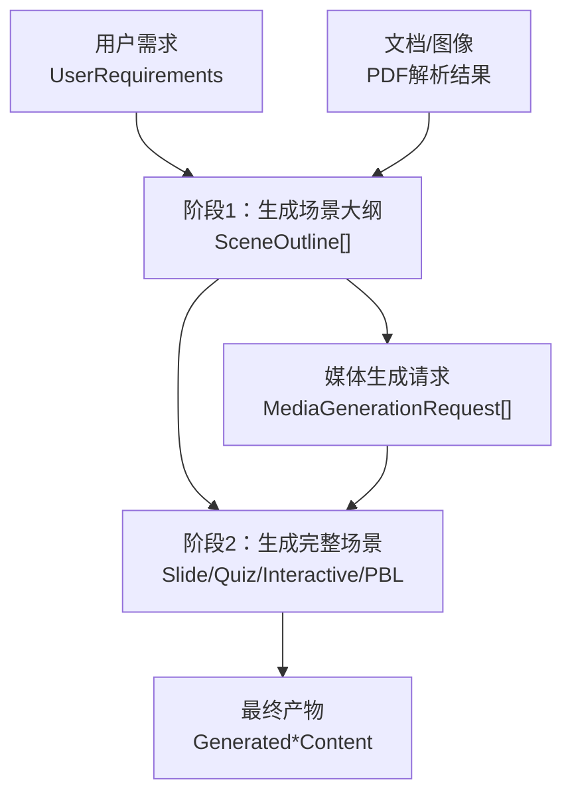

**图表来源**
- [lib/types/generation.ts](file://lib/types/generation.ts)
- [lib/media/types.ts](file://lib/media/types.ts)

**章节来源**
- [lib/types/generation.ts](file://lib/types/generation.ts)
- [lib/media/types.ts](file://lib/media/types.ts)

## 详细组件分析

### 用户需求类型（UserRequirements 与 LegacyUserRequirements）
- UserRequirements
  - 简化输入：单一 requirement 文本，包含主题、时长、风格等全部细节
  - 语言 language 必填，影响生成语言
  - 个性化 userNickname、userBio
  - 可选 webSearch 开启网络检索增强
- LegacyUserRequirements（@deprecated）
  - 保留 topic、description、learningObjectives、audience、durationMinutes、style、documents、additionalNotes 等历史字段，用于向后兼容

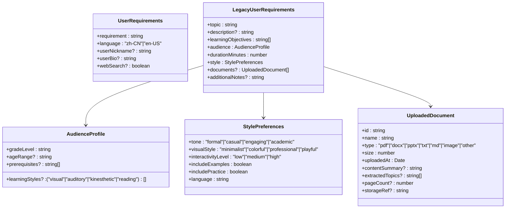

**图表来源**
- [lib/types/generation.ts](file://lib/types/generation.ts)

**章节来源**
- [lib/types/generation.ts](file://lib/types/generation.ts)

### 场景大纲类型（SceneOutline）
- 基本字段：id、type（slide/quiz/interactive/pbl）、title、description、keyPoints（3-5个核心要点）、teachingObjective、estimatedDuration、order、language
- 建议与媒体：suggestedImageIds（来自PDF提取的图像ID列表）、mediaGenerations（AI生成媒体请求）
- 场景特定配置：
  - quizConfig：questionCount、difficulty、questionTypes
  - interactiveConfig：conceptName、conceptOverview、designIdea、subject
  - pblConfig：projectTopic、projectDescription、targetSkills、issueCount、language

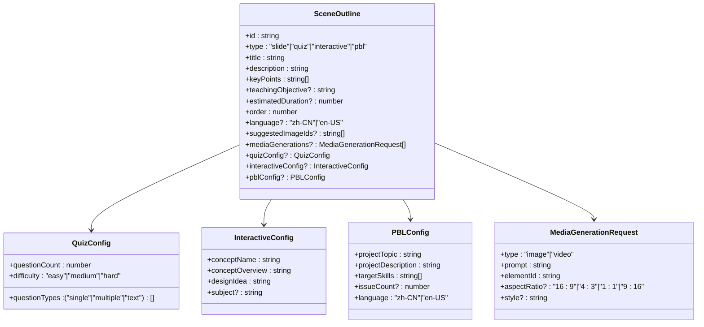

**图表来源**
- [lib/types/generation.ts](file://lib/types/generation.ts)
- [lib/media/types.ts](file://lib/media/types.ts)

**章节来源**
- [lib/types/generation.ts](file://lib/types/generation.ts)
- [lib/media/types.ts](file://lib/media/types.ts)

### 生成内容类型（GeneratedSlideContent、GeneratedQuizContent、GeneratedPBLContent、GeneratedInteractiveContent）
- GeneratedSlideContent：elements（PPTElement[]）、background（SlideBackground）、remark（备注）
- GeneratedQuizContent：questions（QuizQuestion[]）
- GeneratedPBLContent：projectConfig（PBLProjectConfig）
- GeneratedInteractiveContent：html（字符串）、scientificModel（可选）

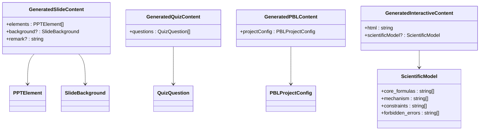

**图表来源**
- [lib/types/generation.ts](file://lib/types/generation.ts)
- [lib/types/slides.ts](file://lib/types/slides.ts)
- [lib/types/stage.ts](file://lib/types/stage.ts)
- [lib/pbl/types.ts](file://lib/pbl/types.ts)

**章节来源**
- [lib/types/generation.ts](file://lib/types/generation.ts)
- [lib/types/slides.ts](file://lib/types/slides.ts)
- [lib/types/stage.ts](file://lib/types/stage.ts)
- [lib/pbl/types.ts](file://lib/pbl/types.ts)

### PDF 图像与图像映射（PdfImage、ImageMapping、ParsedPdfContent）
- PdfImage：从 PDF 提取的图像，包含 id、src（base64 或 IndexedDB 引用）、pageNumber、可选描述、存储ID、宽高
- ImageMapping：图像ID到 base64 URL 的映射
- ParsedPdfContent：解析后的文本、图像数组、可选表格、公式、布局、元数据（含 imageMapping、pdfImages 数组）

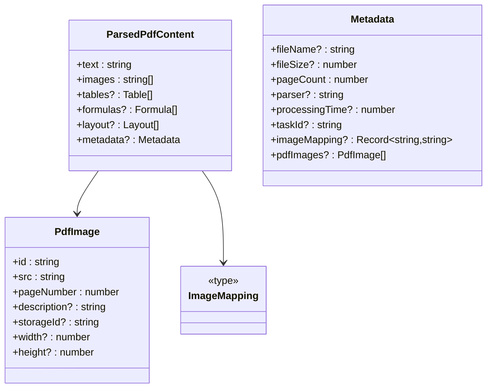

**图表来源**
- [lib/types/generation.ts](file://lib/types/generation.ts)
- [lib/types/pdf.ts](file://lib/types/pdf.ts)

**章节来源**
- [lib/types/generation.ts](file://lib/types/generation.ts)
- [lib/types/pdf.ts](file://lib/types/pdf.ts)

### 生成会话与进度（GenerationSession、GenerationProgress）
- GenerationProgress：currentStage（1|2|3）、overallProgress（0-100）、stageProgress（0-100）、statusMessage、scenesGenerated、totalScenes、errors
- GenerationSession：id、requirements（UserRequirements）、sceneOutlines、progress（GenerationProgress）、startedAt、completedAt、generatedStageId

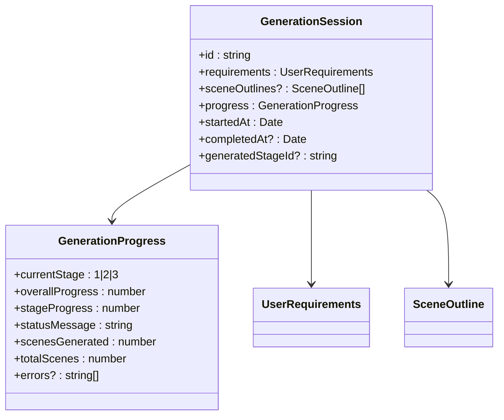

**图表来源**
- [lib/types/generation.ts](file://lib/types/generation.ts)

**章节来源**
- [lib/types/generation.ts](file://lib/types/generation.ts)

### 生成流水线与回调（AgentInfo、SceneGenerationContext、GeneratedSlideData、GenerationResult、GenerationCallbacks、AICallFn）
- AgentInfo：轻量代理信息（id、name、role、persona?）
- SceneGenerationContext：跨页面上下文（pageIndex、totalPages、allTitles、previousSpeeches）
- GeneratedSlideData：AI响应解析用的数据结构（元素数组、背景、备注）
- GenerationResult：泛型结果封装（success、data?、error?）
- GenerationCallbacks：onProgress、onStageComplete、onError
- AICallFn：系统提示+用户提示+图像（可选）→ Promise<string>

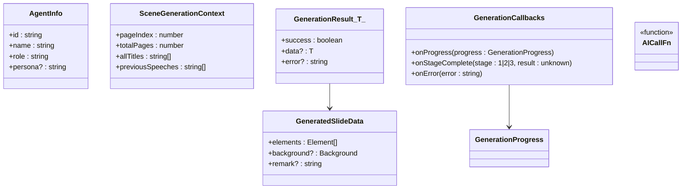

**图表来源**
- [lib/generation/pipeline-types.ts](file://lib/generation/pipeline-types.ts)
- [lib/types/generation.ts](file://lib/types/generation.ts)

**章节来源**
- [lib/generation/pipeline-types.ts](file://lib/generation/pipeline-types.ts)
- [lib/types/generation.ts](file://lib/types/generation.ts)

### 幻灯片元素与背景（PPTElement、Slide、SlideBackground）
- PPTElement：文本、图片、形状、线条、图表、表格、LaTeX、视频、音频的联合类型
- Slide：页面容器（viewportSize、viewportRatio、theme、elements、background、animations、turningMode、sectionTag、type）
- SlideBackground：纯色、图片、渐变背景

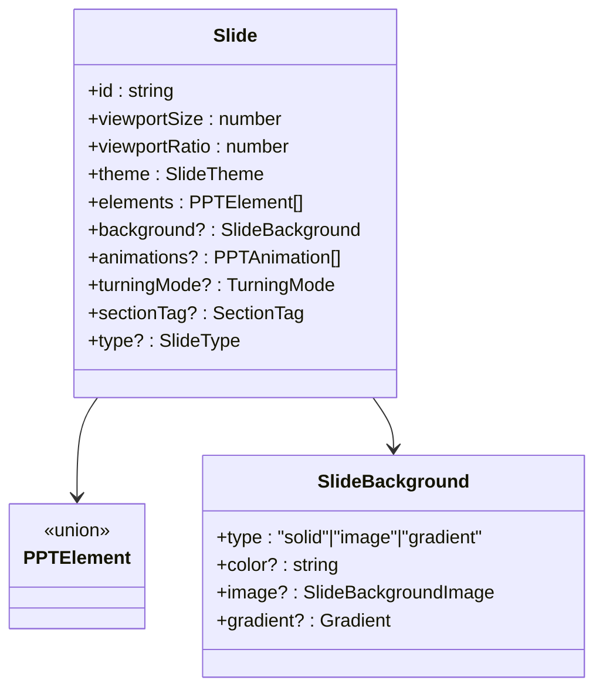

**图表来源**
- [lib/types/slides.ts](file://lib/types/slides.ts)

**章节来源**
- [lib/types/slides.ts](file://lib/types/slides.ts)

### 场景与课堂（Scene、SceneContent、SceneType）
- SceneType：slide、quiz、interactive、pbl
- Scene：场景实体（id、stageId、type、title、order、content、actions、whiteboards、multiAgent、createdAt/updatedAt）
- SceneContent：SlideContent、QuizContent、InteractiveContent、PBLContent 的联合类型

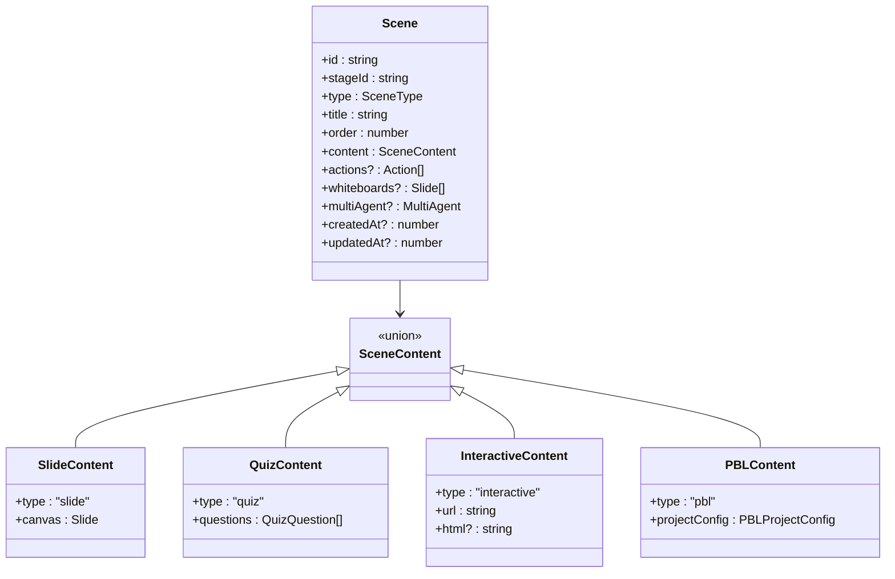

**图表来源**
- [lib/types/stage.ts](file://lib/types/stage.ts)

**章节来源**
- [lib/types/stage.ts](file://lib/types/stage.ts)

### 媒体生成请求（MediaGenerationRequest、Image/Video 生成类型）
- MediaGenerationRequest：统一的媒体生成请求（type、prompt、elementId、aspectRatio、style）
- Image/Video Provider 类型：提供者ID、配置、生成配置、生成选项、结果、任务适配器接口

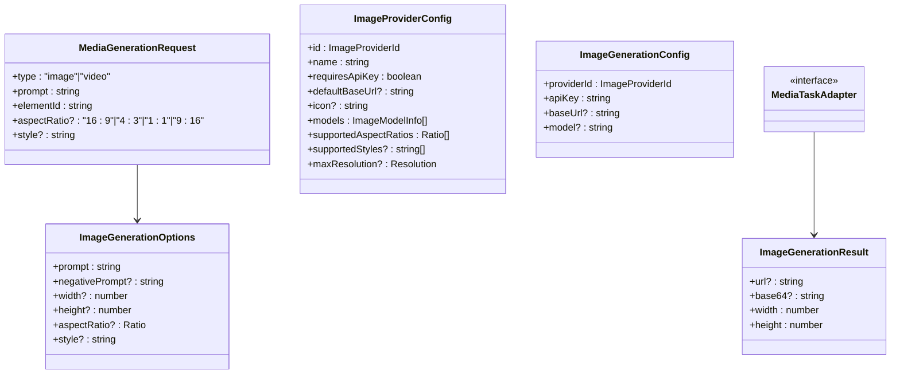

**图表来源**
- [lib/media/types.ts](file://lib/media/types.ts)
- [lib/types/generation.ts](file://lib/types/generation.ts)

**章节来源**
- [lib/media/types.ts](file://lib/media/types.ts)
- [lib/types/generation.ts](file://lib/types/generation.ts)

### 生成预览会话状态（GenerationSessionState）
- 存储在 sessionStorage 的前端会话状态，包含 sessionId、requirements、pdfText、pdfImages、imageStorageIds、imageMapping、sceneOutlines、currentStep、PDF 延迟解析字段、网络检索上下文与来源

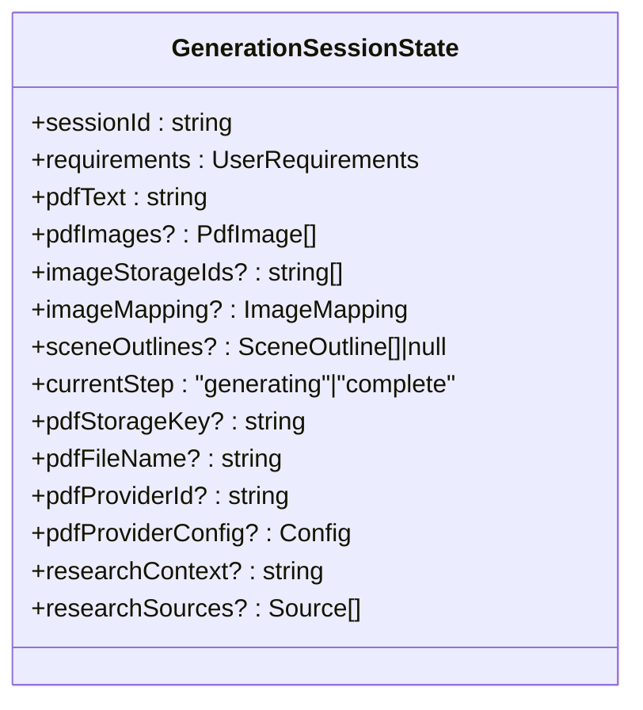

**图表来源**
- [app/generation-preview/types.ts](file://app/generation-preview/types.ts)

**章节来源**
- [app/generation-preview/types.ts](file://app/generation-preview/types.ts)

## 依赖关系分析
- 类型耦合
  - SceneOutline 依赖 MediaGenerationRequest，用于补充缺失的图像
  - GeneratedSlideContent 依赖 PPTElement 与 SlideBackground
  - GeneratedQuizContent 依赖 QuizQuestion
  - GeneratedInteractiveContent 依赖 ScientificModel
  - GenerationSession 依赖 GenerationProgress、UserRequirements、SceneOutline
  - ParsedPdfContent 与 PdfImage、ImageMapping 在生成流程中协同工作
- 外部依赖
  - lib/media/types.ts 为生成流水线提供统一的媒体生成请求与任务适配器
  - lib/types/stage.ts 与 lib/types/slides.ts 为场景与幻灯片内容提供数据模型

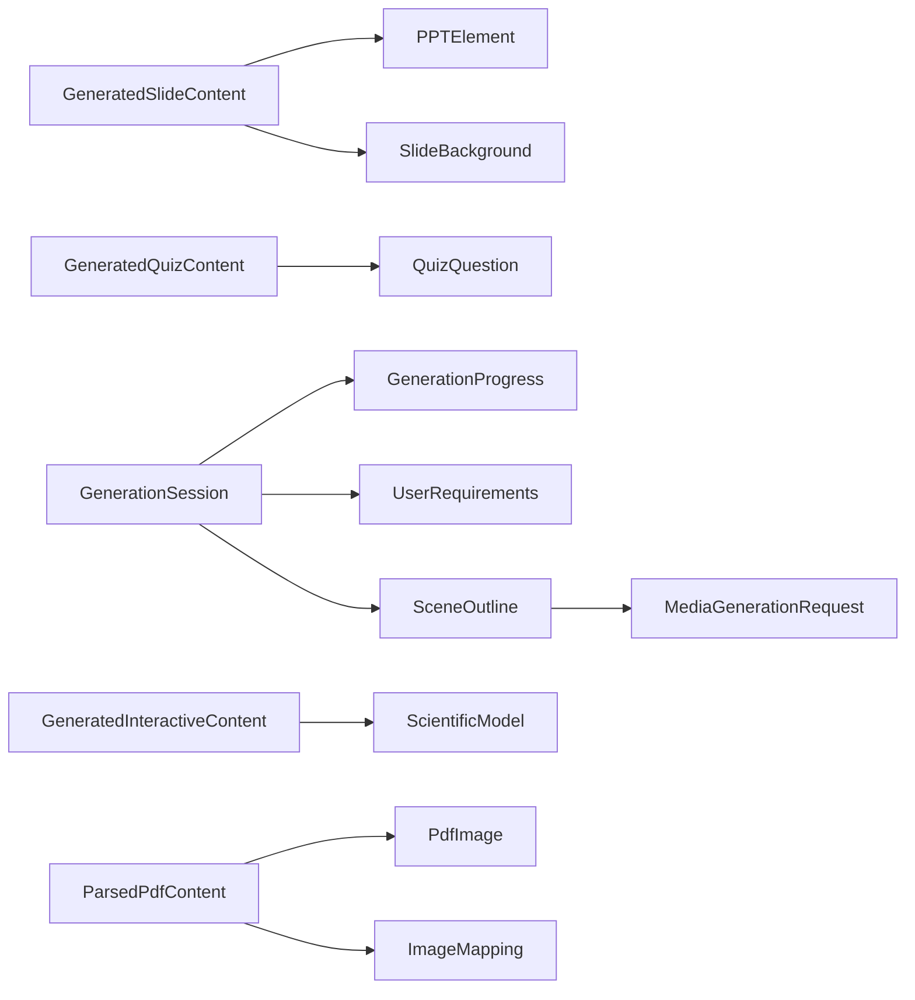

**图表来源**
- [lib/types/generation.ts](file://lib/types/generation.ts)
- [lib/types/slides.ts](file://lib/types/slides.ts)
- [lib/types/stage.ts](file://lib/types/stage.ts)
- [lib/media/types.ts](file://lib/media/types.ts)
- [lib/types/pdf.ts](file://lib/types/pdf.ts)

**章节来源**
- [lib/types/generation.ts](file://lib/types/generation.ts)
- [lib/types/slides.ts](file://lib/types/slides.ts)
- [lib/types/stage.ts](file://lib/types/stage.ts)
- [lib/media/types.ts](file://lib/media/types.ts)
- [lib/types/pdf.ts](file://lib/types/pdf.ts)

## 性能考量
- 图像与媒体生成
  - 使用 ImageMapping 将图像ID映射到base64，减少重复传输
  - MediaGenerationRequest 支持指定宽高与比例，避免不必要的高分辨率资源
- 进度与阶段
  - GenerationProgress 提供阶段级与总体进度，便于前端及时反馈
  - GenerationCallbacks.onStageComplete 可在阶段完成后进行增量处理
- 跨页面上下文
  - SceneGenerationContext 维护前一页口语，有助于保持语音连贯，减少重复生成

[本节为通用指导，无需列出具体文件来源]

## 故障排查指南
- 常见问题定位
  - 生成失败：检查 GenerationProgress.errors 是否存在
  - 图像缺失：核对 SceneOutline.suggestedImageIds 与 PdfImage 列表是否匹配
  - 媒体生成异常：确认 MediaGenerationRequest 参数（prompt、elementId、aspectRatio、style）是否正确
- 排查步骤
  - 从前端会话状态 GenerationSessionState 检查 pdfImages、imageMapping、sceneOutlines
  - 在流水线回调中捕获 onError 并记录错误堆栈
  - 使用 GeneratedSlideData 结构验证 AI 输出格式

**章节来源**
- [lib/types/generation.ts](file://lib/types/generation.ts)
- [lib/generation/pipeline-types.ts](file://lib/generation/pipeline-types.ts)
- [app/generation-preview/types.ts](file://app/generation-preview/types.ts)

## 结论
本文档系统化梳理了 OpenMAIC 的生成类型定义，覆盖从用户需求、场景大纲、生成内容到文档处理、会话与进度、流水线回调与幻灯片元素的全链路类型模型。通过明确的类型边界与依赖关系，确保两阶段生成体系在语义一致的前提下高效协作。建议在扩展新场景类型或媒体能力时，遵循现有类型命名与结构约定，并通过 GenerationCallbacks 与 GenerationProgress 保持可观测性与可控性。

[本节为总结性内容，无需列出具体文件来源]

## 附录

### 类型使用示例与最佳实践
- 使用 UserRequirements 作为唯一输入入口，避免历史结构化需求（LegacyUserRequirements）直接参与业务逻辑
- 在 SceneOutline 中为每个场景提供清晰的 keyPoints 与 teachingObjective，便于后续生成与评估
- 对于 PDF 图像不足的情况，利用 SceneOutline.mediaGenerations 发起 MediaGenerationRequest，确保视觉一致性
- 生成内容落地时，优先使用 GeneratedSlideContent.elements 与 Slide.background，避免直接操作底层 PPTElement
- 通过 GenerationSession.progress 实时展示阶段进度，结合 GenerationCallbacks.onStageComplete 进行阶段化处理
- 在多页面场景中，利用 SceneGenerationContext 维护跨页语音连贯性，减少重复生成成本

[本节为通用指导，无需列出具体文件来源]