# 类型定义系统

<cite>
**本文档引用的文件**
- [lib/types/action.ts](file://lib/types/action.ts)
- [lib/types/generation.ts](file://lib/types/generation.ts)
- [lib/types/chat.ts](file://lib/types/chat.ts)
- [lib/types/stage.ts](file://lib/types/stage.ts)
- [lib/types/slides.ts](file://lib/types/slides.ts)
- [lib/types/provider.ts](file://lib/types/provider.ts)
- [lib/types/settings.ts](file://lib/types/settings.ts)
- [lib/types/pdf.ts](file://lib/types/pdf.ts)
- [lib/types/roundtable.ts](file://lib/types/roundtable.ts)
- [app/generation-preview/types.ts](file://app/generation-preview/types.ts)
</cite>

## 目录
1. [引言](#引言)
2. [项目结构](#项目结构)
3. [核心组件](#核心组件)
4. [架构概览](#架构概览)
5. [详细组件分析](#详细组件分析)
6. [依赖分析](#依赖分析)
7. [性能考虑](#性能考虑)
8. [故障排除指南](#故障排除指南)
9. [结论](#结论)
10. [附录](#附录)

## 引言
本文件系统化梳理 OpenMAIC 的类型定义体系，围绕以下目标展开：
- 生成类型：用户需求、场景大纲、生成内容与作业状态的数据结构
- 动作类型：课堂动作的分类、参数与执行约束
- 场景类型：场景元数据、元素集合与交互规则
- 用户类型：用户信息、权限与偏好设置
- API 类型：请求/响应模式、错误类型与状态码
- 扩展指南：新增类型、修改既有类型与向后兼容策略
- 类型安全最佳实践与常见错误的解决方案

## 项目结构
类型定义主要集中在 lib/types 目录下，按功能域划分：
- 生成与内容：generation.ts、slides.ts
- 课堂动作与场景：action.ts、stage.ts
- 多智能体对话：chat.ts
- 提供商与设置：provider.ts、settings.ts
- PDF 解析：pdf.ts
- 讨论室：roundtable.ts
- 生成预览会话：app/generation-preview/types.ts

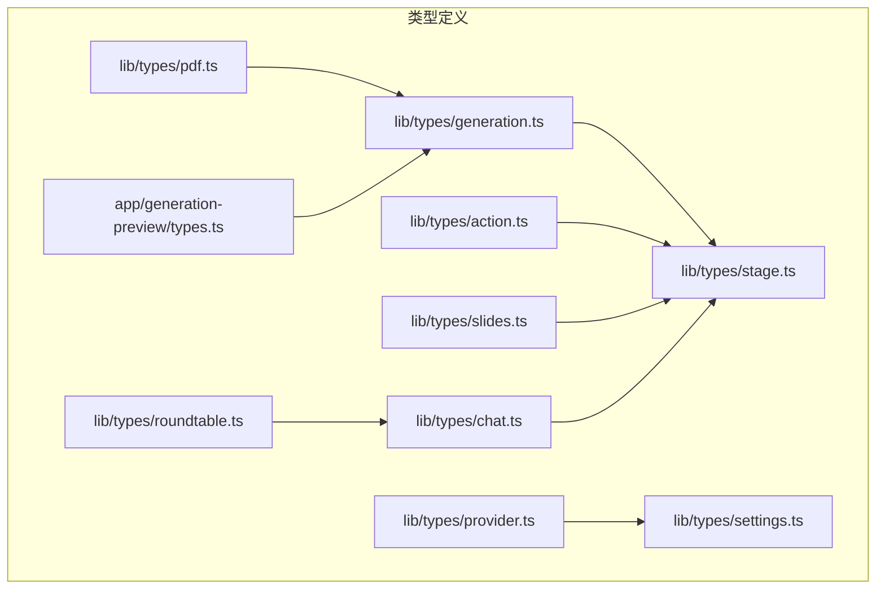

**图表来源**
- [lib/types/generation.ts:1-229](file://lib/types/generation.ts#L1-L229)
- [lib/types/action.ts:1-221](file://lib/types/action.ts#L1-L221)
- [lib/types/stage.ts:1-124](file://lib/types/stage.ts#L1-L124)
- [lib/types/slides.ts:1-830](file://lib/types/slides.ts#L1-L830)
- [lib/types/chat.ts:1-337](file://lib/types/chat.ts#L1-L337)
- [lib/types/provider.ts:1-104](file://lib/types/provider.ts#L1-L104)
- [lib/types/settings.ts:1-50](file://lib/types/settings.ts#L1-L50)
- [lib/types/pdf.ts:1-77](file://lib/types/pdf.ts#L1-L77)
- [lib/types/roundtable.ts:1-29](file://lib/types/roundtable.ts#L1-L29)
- [app/generation-preview/types.ts:1-91](file://app/generation-preview/types.ts#L1-L91)

**章节来源**
- [lib/types/generation.ts:1-229](file://lib/types/generation.ts#L1-L229)
- [lib/types/action.ts:1-221](file://lib/types/action.ts#L1-L221)
- [lib/types/stage.ts:1-124](file://lib/types/stage.ts#L1-L124)
- [lib/types/slides.ts:1-830](file://lib/types/slides.ts#L1-L830)
- [lib/types/chat.ts:1-337](file://lib/types/chat.ts#L1-L337)
- [lib/types/provider.ts:1-104](file://lib/types/provider.ts#L1-L104)
- [lib/types/settings.ts:1-50](file://lib/types/settings.ts#L1-L50)
- [lib/types/pdf.ts:1-77](file://lib/types/pdf.ts#L1-L77)
- [lib/types/roundtable.ts:1-29](file://lib/types/roundtable.ts#L1-L29)
- [app/generation-preview/types.ts:1-91](file://app/generation-preview/types.ts#L1-L91)

## 核心组件
- 生成类型：用户需求(UserRequirements)、PDF 图像(PdfImage)、场景大纲(SceneOutline)、生成进度(GenerationProgress)、会话(GenerationSession)，以及各阶段产出内容(GeneratedSlideContent、GeneratedQuizContent、GeneratedPBLContent、GeneratedInteractiveContent)
- 动作类型：火速动作(Fire-and-forget，spotlight、laser)与同步动作(Sync，speech、wb_*、play_video、discussion)，统一 Action 联合类型与 ActionBase 基础结构
- 场景类型：Stage、Scene、SceneContent 联合类型，以及 SlideContent、QuizContent、InteractiveContent、PBLContent
- 元素类型：PPTElement 及其子类型(Text/Image/Shape/Line/Chart/Table/Latex/Video/Audio)，Slide、SlideBackground、动画与主题
- 多智能体对话：ChatSession、消息与元数据、工具调用、事件流、无状态聊天请求
- 提供商与设置：ProviderConfig、ModelConfig、ProviderSettings
- PDF 解析：ParsedPdfContent、ParsePdfRequest/Response
- 讨论室：参与者、消息与操作按钮
- 生成预览会话：GenerationSessionState、步骤与激活逻辑

**章节来源**
- [lib/types/generation.ts:1-229](file://lib/types/generation.ts#L1-L229)
- [lib/types/action.ts:1-221](file://lib/types/action.ts#L1-L221)
- [lib/types/stage.ts:1-124](file://lib/types/stage.ts#L1-L124)
- [lib/types/slides.ts:666-784](file://lib/types/slides.ts#L666-L784)
- [lib/types/chat.ts:1-337](file://lib/types/chat.ts#L1-L337)
- [lib/types/provider.ts:1-104](file://lib/types/provider.ts#L1-L104)
- [lib/types/pdf.ts:1-77](file://lib/types/pdf.ts#L1-L77)
- [lib/types/roundtable.ts:1-29](file://lib/types/roundtable.ts#L1-L29)
- [app/generation-preview/types.ts:1-91](file://app/generation-preview/types.ts#L1-L91)

## 架构概览
类型系统贯穿三层：
- 输入层：用户需求(UserRequirements)、PDF 内容(ParsedPdfContent)
- 中间层：场景大纲(SceneOutline)、动作(Action)、场景(Scene)、舞台(Stage)
- 输出层：生成内容(Generated*)、会话状态(GenerationSessionState)

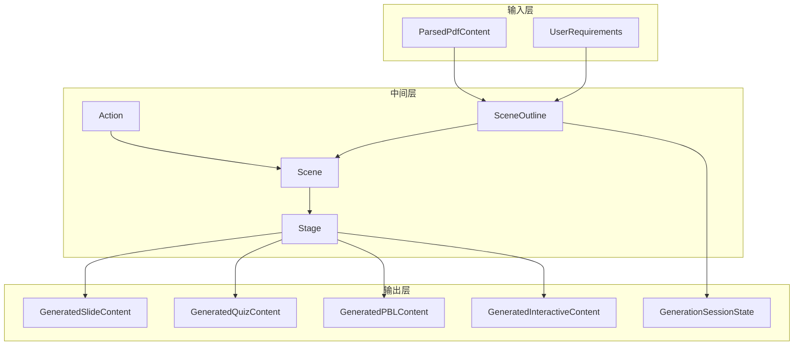

**图表来源**
- [lib/types/generation.ts:65-129](file://lib/types/generation.ts#L65-L129)
- [lib/types/action.ts:165-180](file://lib/types/action.ts#L165-L180)
- [lib/types/stage.ts:31-57](file://lib/types/stage.ts#L31-L57)
- [lib/types/slides.ts:773-784](file://lib/types/slides.ts#L773-L784)
- [app/generation-preview/types.ts:11-28](file://app/generation-preview/types.ts#L11-L28)

## 详细组件分析

### 生成类型系统
- 用户需求(UserRequirements)：集中表达课程语言、个性化信息与网络检索开关
- 场景大纲(SceneOutline)：包含类型、标题、描述、关键要点、时长估计、建议图像与媒体生成请求，以及各类场景特有配置(测验/互动/PBL)
- 生成内容：按场景类型产出对应的内容结构
- 会话与进度：GenerationSession、GenerationProgress，记录阶段、整体与单场景进度、错误与时间戳

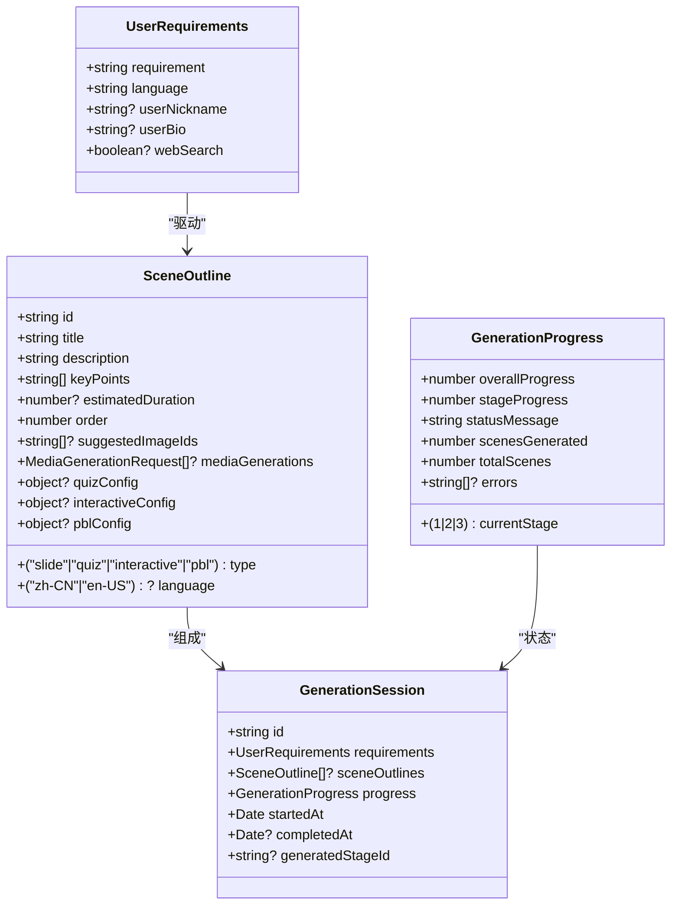

**图表来源**
- [lib/types/generation.ts:65-129](file://lib/types/generation.ts#L65-L129)
- [lib/types/generation.ts:210-228](file://lib/types/generation.ts#L210-L228)

**章节来源**
- [lib/types/generation.ts:65-129](file://lib/types/generation.ts#L65-L129)
- [lib/types/generation.ts:210-228](file://lib/types/generation.ts#L210-L228)

### 动作类型系统
- 分类：火速动作(不阻塞)与同步动作(需等待完成)
- 参数与约束：每种动作定义明确的必需字段、可选字段与默认值；同步动作构成串行执行序列
- 执行约束：FIRE_AND_FORGET_ACTIONS、SYNC_ACTIONS 常量标识动作类别；SLIDE_ONLY_ACTIONS 限定仅作用于幻灯片场景

```mermaid
classDiagram
class ActionBase {
+string id
+string? title
+string? description
}
class SpotlightAction {
+"spotlight" type
+string elementId
+number? dimOpacity
}
class LaserAction {
+"laser" type
+string elementId
+string? color
}
class SpeechAction {
+"speech" type
+string text
+string? audioId
+string? voice
+number? speed
}
class WbOpenAction { +"wb_open" type }
class WbDrawTextAction { +"wb_draw_text" type }
class WbDrawShapeAction { +"wb_draw_shape" type }
class WbDrawChartAction { +"wb_draw_chart" type }
class WbDrawLatexAction { +"wb_draw_latex" type }
class WbDrawTableAction { +"wb_draw_table" type }
class WbDrawLineAction { +"wb_draw_line" type }
class WbClearAction { +"wb_clear" type }
class WbDeleteAction { +"wb_delete" type }
class WbCloseAction { +"wb_close" type }
class PlayVideoAction {
+"play_video" type
+string elementId
}
class DiscussionAction {
+"discussion" type
+string topic
+string? prompt
+string? agentId
}
ActionBase <|-- SpotlightAction
ActionBase <|-- LaserAction
ActionBase <|-- SpeechAction
ActionBase <|-- WbOpenAction
ActionBase <|-- WbDrawTextAction
ActionBase <|-- WbDrawShapeAction
ActionBase <|-- WbDrawChartAction
ActionBase <|-- WbDrawLatexAction
ActionBase <|-- WbDrawTableAction
ActionBase <|-- WbDrawLineAction
ActionBase <|-- WbClearAction
ActionBase <|-- WbDeleteAction
ActionBase <|-- WbCloseAction
ActionBase <|-- PlayVideoAction
ActionBase <|-- DiscussionAction
```

**图表来源**
- [lib/types/action.ts:14-221](file://lib/types/action.ts#L14-L221)

**章节来源**
- [lib/types/action.ts:1-221](file://lib/types/action.ts#L1-L221)

### 场景类型系统
- Stage：课程/课堂元数据与白板集合
- Scene：场景元数据、内容(联合类型)、动作数组、白板集合与多智能体讨论配置
- SceneContent：根据场景类型选择 SlideContent/QuizContent/InteractiveContent/PBLContent
- 元素与幻灯片：PPTElement 及其子类型、Slide、SlideBackground、动画与主题

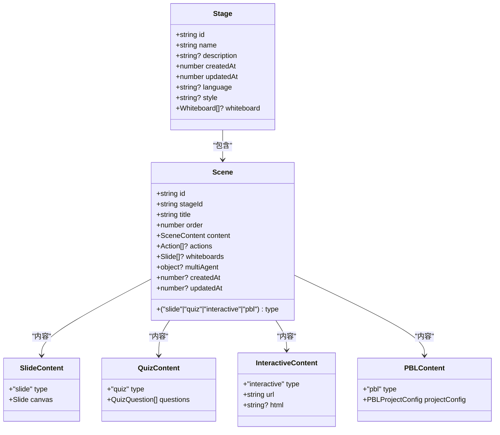

**图表来源**
- [lib/types/stage.ts:15-57](file://lib/types/stage.ts#L15-L57)
- [lib/types/stage.ts:67-114](file://lib/types/stage.ts#L67-L114)

**章节来源**
- [lib/types/stage.ts:1-124](file://lib/types/stage.ts#L1-L124)
- [lib/types/slides.ts:773-784](file://lib/types/slides.ts#L773-L784)

### 元素与幻灯片类型
- 元素类型：文本、图片、形状、线条、图表、表格、LaTeX、视频、音频
- 幻灯片：包含元素集合、背景、动画、翻页方式与主题
- 动画：入场/退场/强调、触发方式与持续时间

```mermaid
classDiagram
class PPTTextElement {
+("text") type
+string content
+string defaultFontName
+string defaultColor
+number? lineHeight
+number? wordSpace
+number? opacity
+number? paragraphSpace
+boolean? vertical
+("title"|"subtitle"|...) ? textType
}
class PPTImageElement {
+("image") type
+boolean fixedRatio
+string src
+ImageElementFilters? filters
+ImageElementClip? clip
+boolean? flipH
+boolean? flipV
+number? radius
+string? colorMask
+("pageFigure"|"itemFigure"|"background")? imageType
}
class PPTShapeElement {
+("shape") type
+[number,number] viewBox
+string path
+boolean fixedRatio
+string fill
+Gradient? gradient
+string? pattern
+boolean? flipH
+boolean? flipV
+boolean? special
+ShapeText? text
+ShapePathFormulasKeys? pathFormula
+number[]? keypoints
}
class PPTLineElement {
+("line") type
+[number,number] start
+[number,number] end
+("solid"|"dashed"|"dotted") style
+string color
+["","arrow"|"dot"][] points
+number? broken
+number? broken2
+number? curve
+[[number,number],[number,number]]? cubic
}
class PPTChartElement {
+("chart") type
+("bar"|"column"|"line"|"pie"|...) chartType
+ChartData data
+ChartOptions? options
+string[] themeColors
}
class PPTTableElement {
+("table") type
+PPTElementOutline outline
+TableTheme? theme
+number[] colWidths
+number cellMinHeight
+TableCell[][] data
}
class PPTLatexElement {
+("latex") type
+string latex
+string? html
+string? path
+string? color
+number? strokeWidth
+[number,number]? viewBox
+boolean? fixedRatio
+("left"|"center"|"right")? align
}
class PPTVideoElement {
+("video") type
+string src
+boolean autoplay
+string? poster
+string? ext
}
class PPTAudioElement {
+("audio") type
+boolean fixedRatio
+string color
+boolean loop
+boolean autoplay
+string src
+string? ext
}
class Slide {
+string id
+number viewportSize
+number viewportRatio
+SlideTheme theme
+PPTElement[] elements
+SlideBackground? background
+PPTAnimation[]? animations
+TurningMode? turningMode
+SectionTag? sectionTag
+("cover"|"contents"|...) ? type
}
PPTTextElement <.. PPTElement
PPTImageElement <.. PPTElement
PPTShapeElement <.. PPTElement
PPTLineElement <.. PPTElement
PPTChartElement <.. PPTElement
PPTTableElement <.. PPTElement
PPTLatexElement <.. PPTElement
PPTVideoElement <.. PPTElement
PPTAudioElement <.. PPTElement
Slide --> PPTElement : "包含"
```

**图表来源**
- [lib/types/slides.ts:183-197](file://lib/types/slides.ts#L183-L197)
- [lib/types/slides.ts:295-308](file://lib/types/slides.ts#L295-L308)
- [lib/types/slides.ts:379-396](file://lib/types/slides.ts#L379-L396)
- [lib/types/slides.ts:425-437](file://lib/types/slides.ts#L425-L437)
- [lib/types/slides.ts:473-483](file://lib/types/slides.ts#L473-L483)
- [lib/types/slides.ts:576-583](file://lib/types/slides.ts#L576-L583)
- [lib/types/slides.ts:606-616](file://lib/types/slides.ts#L606-L616)
- [lib/types/slides.ts:631-637](file://lib/types/slides.ts#L631-L637)
- [lib/types/slides.ts:656-664](file://lib/types/slides.ts#L656-L664)
- [lib/types/slides.ts:773-784](file://lib/types/slides.ts#L773-L784)

**章节来源**
- [lib/types/slides.ts:666-800](file://lib/types/slides.ts#L666-L800)

### 多智能体对话类型
- 会话：ChatSession 包含类型、状态、消息、配置、工具调用与时间戳
- 工具调用：待处理与已完成记录，支持状态机
- 事件流：服务器推送事件(SessionEvent)与无状态聊天事件(StatelessEvent)
- 讲义项：LectureNoteItem 与 LectureNoteEntry

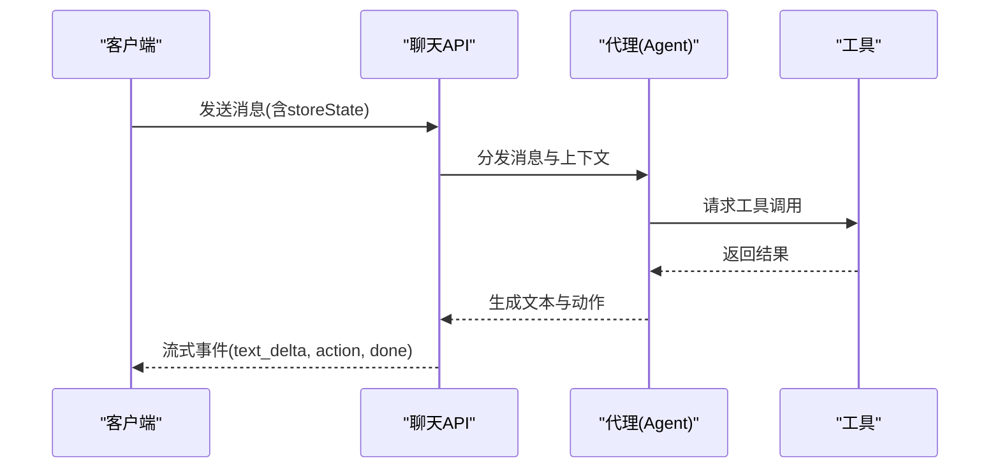

**图表来源**
- [lib/types/chat.ts:146-158](file://lib/types/chat.ts#L146-L158)
- [lib/types/chat.ts:299-337](file://lib/types/chat.ts#L299-L337)

**章节来源**
- [lib/types/chat.ts:1-337](file://lib/types/chat.ts#L1-L337)

### 提供商与设置类型
- 提供商：内置提供商枚举、统一配置结构、模型能力声明
- 设置：ProviderSettings、ProvidersConfig、编辑模型

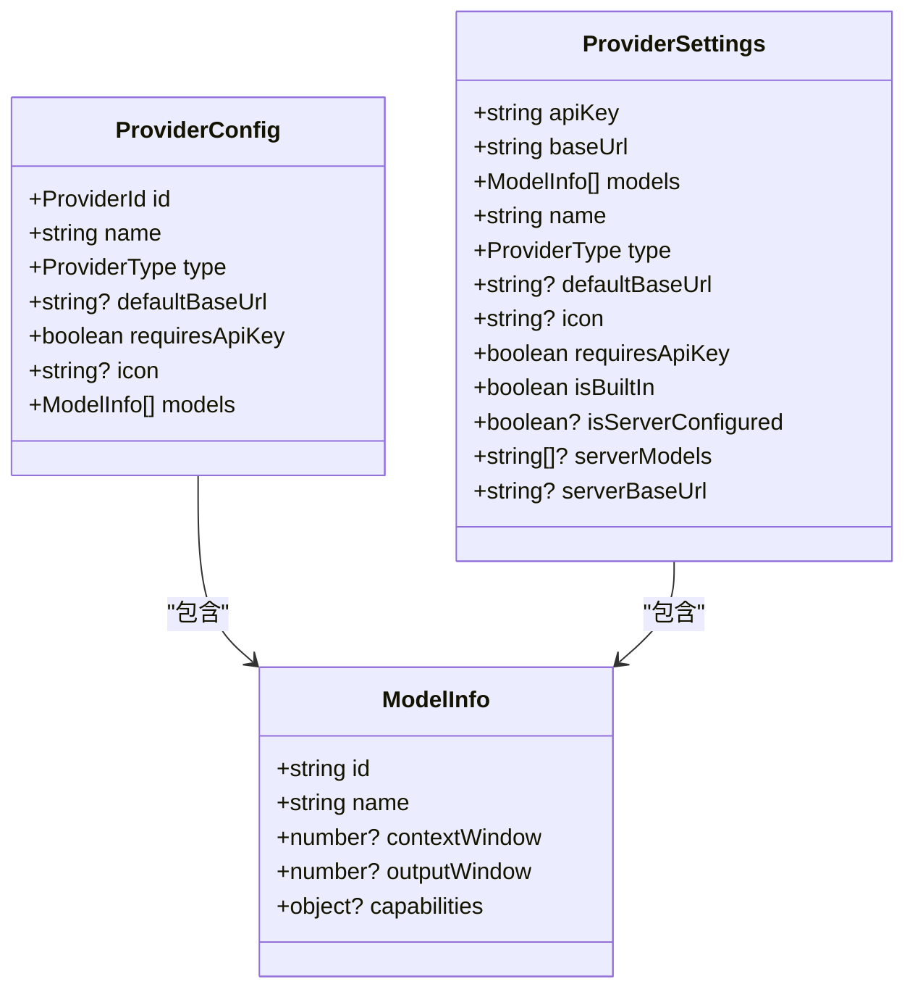

**图表来源**
- [lib/types/provider.ts:82-103](file://lib/types/provider.ts#L82-L103)
- [lib/types/provider.ts:66-77](file://lib/types/provider.ts#L66-L77)
- [lib/types/settings.ts:19-37](file://lib/types/settings.ts#L19-L37)

**章节来源**
- [lib/types/provider.ts:1-104](file://lib/types/provider.ts#L1-L104)
- [lib/types/settings.ts:1-50](file://lib/types/settings.ts#L1-L50)

### PDF 解析类型
- 解析结果：文本、图片、表格、公式、布局、元数据与映射
- 请求/响应：ParsePdfRequest、ParsePdfResponse

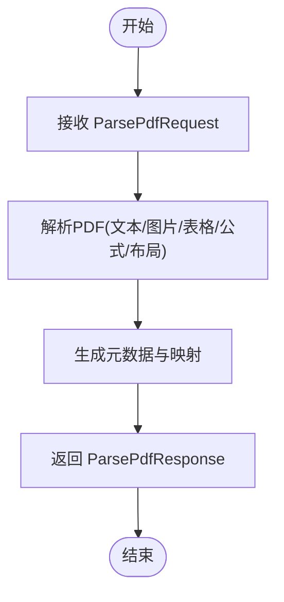

**图表来源**
- [lib/types/pdf.ts:64-77](file://lib/types/pdf.ts#L64-L77)
- [lib/types/pdf.ts:9-59](file://lib/types/pdf.ts#L9-L59)

**章节来源**
- [lib/types/pdf.ts:1-77](file://lib/types/pdf.ts#L1-L77)

### 讨论室类型
- 参与者：角色、在线状态、头像
- 消息：发送者、内容、时间戳与操作按钮

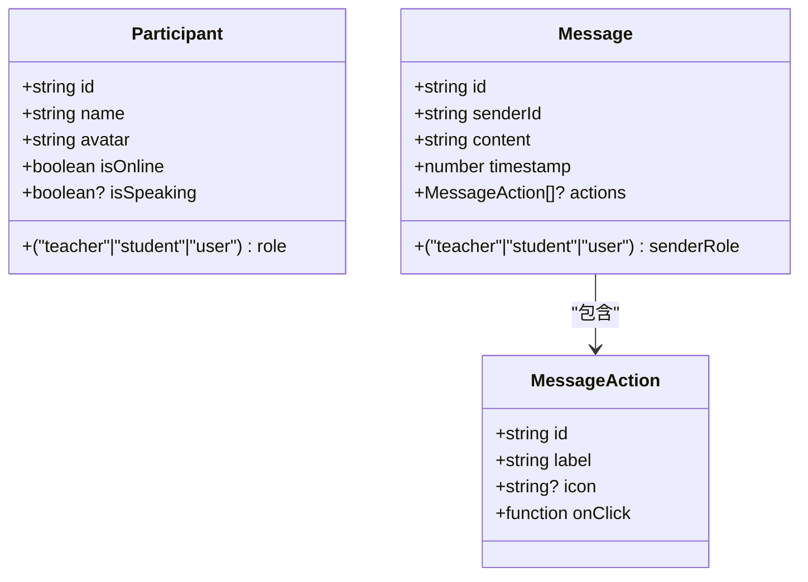

**图表来源**
- [lib/types/roundtable.ts:5-29](file://lib/types/roundtable.ts#L5-L29)

**章节来源**
- [lib/types/roundtable.ts:1-29](file://lib/types/roundtable.ts#L1-L29)

### 生成预览会话类型
- 会话状态：包含需求、PDF 文本/图片、场景大纲、当前步骤与 PDF/搜索上下文
- 步骤：分析、写作、可视化三类，动态激活

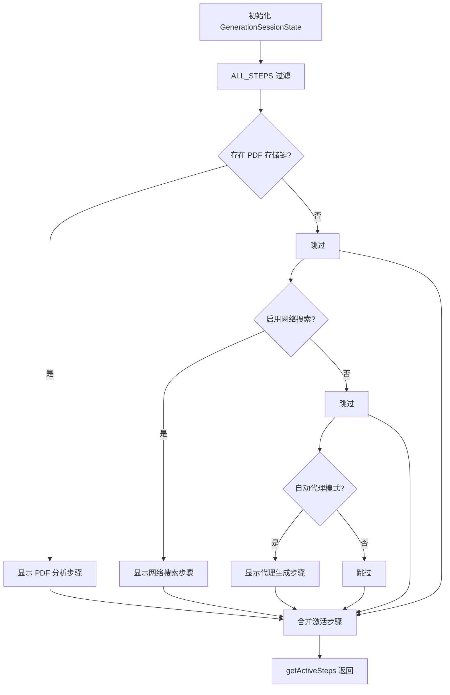

**图表来源**
- [app/generation-preview/types.ts:38-90](file://app/generation-preview/types.ts#L38-L90)

**章节来源**
- [app/generation-preview/types.ts:1-91](file://app/generation-preview/types.ts#L1-L91)

## 依赖分析
- 生成类型依赖动作(Action)与场景(Scene)：Scene.actions 使用 Action；Stage 作为容器承载 Scene
- 元素类型依赖幻灯片：Slide.elements 为 PPTElement[]
- 多智能体对话依赖场景与动作：storeState 中包含 Stage/Scene/currentSceneId/mode/whiteboardOpen，消息中可携带动作元数据
- 提供商类型被设置类型复用：ProviderSettings 与 ProviderConfig 结构一致
- PDF 类型服务于生成流程：ParsedPdfContent 与 PdfImage 用于场景大纲与媒体生成

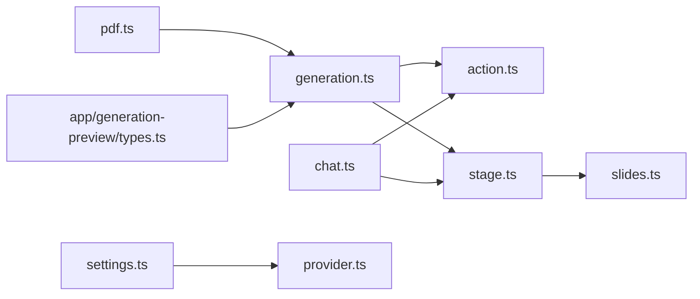

**图表来源**
- [lib/types/generation.ts:8-9](file://lib/types/generation.ts#L8-L9)
- [lib/types/action.ts:1-10](file://lib/types/action.ts#L1-L10)
- [lib/types/stage.ts:1-5](file://lib/types/stage.ts#L1-L5)
- [lib/types/slides.ts:1-5](file://lib/types/slides.ts#L1-L5)
- [lib/types/chat.ts:219-220](file://lib/types/chat.ts#L219-L220)
- [lib/types/settings.ts:1-2](file://lib/types/settings.ts#L1-L2)
- [lib/types/provider.ts:1-4](file://lib/types/provider.ts#L1-L4)
- [lib/types/pdf.ts:1-5](file://lib/types/pdf.ts#L1-L5)
- [app/generation-preview/types.ts:1-8](file://app/generation-preview/types.ts#L1-L8)

**章节来源**
- [lib/types/generation.ts:1-229](file://lib/types/generation.ts#L1-L229)
- [lib/types/action.ts:1-221](file://lib/types/action.ts#L1-L221)
- [lib/types/stage.ts:1-124](file://lib/types/stage.ts#L1-L124)
- [lib/types/slides.ts:1-830](file://lib/types/slides.ts#L1-L830)
- [lib/types/chat.ts:1-337](file://lib/types/chat.ts#L1-L337)
- [lib/types/provider.ts:1-104](file://lib/types/provider.ts#L1-L104)
- [lib/types/settings.ts:1-50](file://lib/types/settings.ts#L1-L50)
- [lib/types/pdf.ts:1-77](file://lib/types/pdf.ts#L1-L77)
- [app/generation-preview/types.ts:1-91](file://app/generation-preview/types.ts#L1-L91)

## 性能考虑
- 类型收敛：通过联合类型(Action、PPTElement、SceneContent)减少分支判断复杂度
- 数据结构扁平化：SceneOutline 将生成阶段信息集中，降低跨模块查询成本
- 事件流：聊天 API 使用 SSE，避免轮询带来的额外开销
- 缓存与映射：ImageMapping、pdfImages 减少重复解析与传输

## 故障排除指南
- 类型不匹配：检查 ActionBase 是否正确扩展；确保 type 字段与联合类型一致
- 同步动作阻塞：确认 SYNC_ACTIONS 列表是否包含目标动作；避免在未完成前提交下一个动作
- 元素坐标异常：核对百分比几何(PercentageGeometry)与元素定位(left/top/width/height)
- 会话状态不一致：校验 storeState 中的 stage/scenes/currentSceneId/mode/whiteboardOpen
- 提供商配置缺失：确认 ProviderSettings 的 apiKey/baseUrl 与 ProviderConfig 的一致性

**章节来源**
- [lib/types/action.ts:165-205](file://lib/types/action.ts#L165-L205)
- [lib/types/slides.ts:213-220](file://lib/types/slides.ts#L213-L220)
- [lib/types/chat.ts:240-246](file://lib/types/chat.ts#L240-L246)
- [lib/types/provider.ts:82-103](file://lib/types/provider.ts#L82-L103)
- [lib/types/settings.ts:19-37](file://lib/types/settings.ts#L19-L37)

## 结论
本类型定义系统以“输入—中间—输出”为主线，通过严格的联合类型与接口设计，实现了生成、动作、场景与对话的强约束与可扩展性。遵循本文档的扩展指南与最佳实践，可在保持向后兼容的前提下安全地引入新类型与修改既有类型。

## 附录

### API 类型实现要点
- 请求/响应模式：聊天 API 的 SendMessageRequest、StatelessChatRequest 明确携带 storeState 与配置
- 错误类型：ParsePdfResponse.error、SessionEvent.error
- 状态码：前端通常使用 HTTP 状态码，后端在错误事件中传递具体信息

**章节来源**
- [lib/types/chat.ts:146-158](file://lib/types/chat.ts#L146-L158)
- [lib/types/chat.ts:236-282](file://lib/types/chat.ts#L236-L282)
- [lib/types/pdf.ts:72-76](file://lib/types/pdf.ts#L72-L76)

### 扩展指南
- 新增类型
  - 在对应域文件中定义接口/联合类型
  - 在依赖方导入并使用
  - 如涉及 UI，补充相应组件类型
- 修改既有类型
  - 保持字段向后兼容(新增可选字段)
  - 更新所有使用处的类型引用
  - 如涉及破坏性变更，提供迁移脚本与过渡期配置
- 向后兼容性
  - 保留旧字段并在注释中标注弃用
  - 提供转换函数或适配器

**章节来源**
- [lib/types/generation.ts:77-86](file://lib/types/generation.ts#L77-L86)
- [lib/types/chat.ts:293-294](file://lib/types/chat.ts#L293-L294)

### 类型安全最佳实践
- 使用联合类型替代宽泛的 any
- 为可选字段提供默认值或防御性检查
- 通过 Partial/Required/Omit 等工具类型精确建模
- 为常量与枚举使用字面量类型，避免字符串字面量漂移
- 在复杂对象中拆分为小接口，提升可维护性