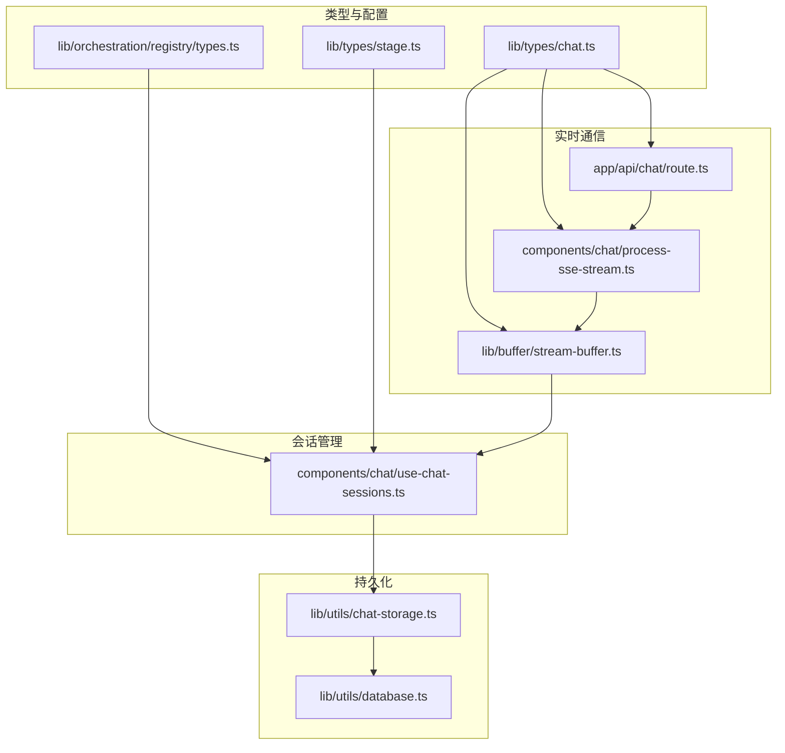
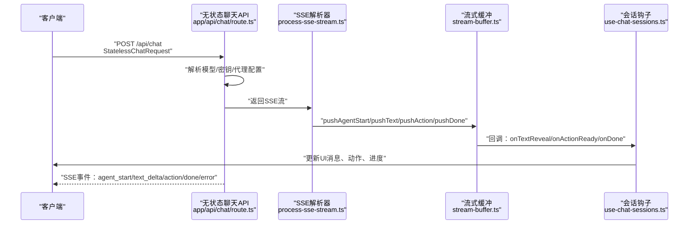
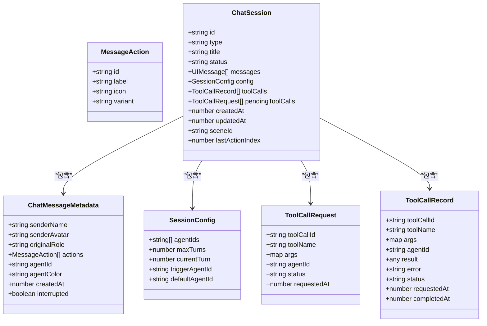
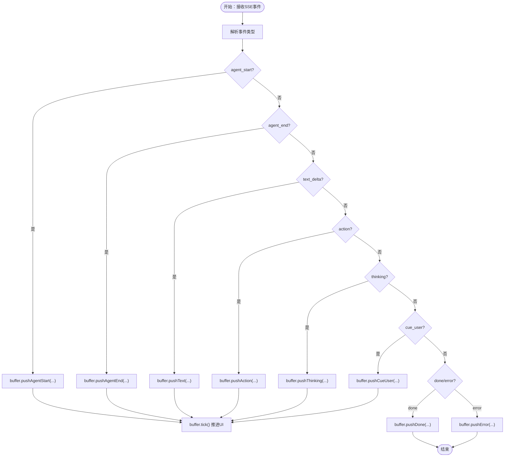
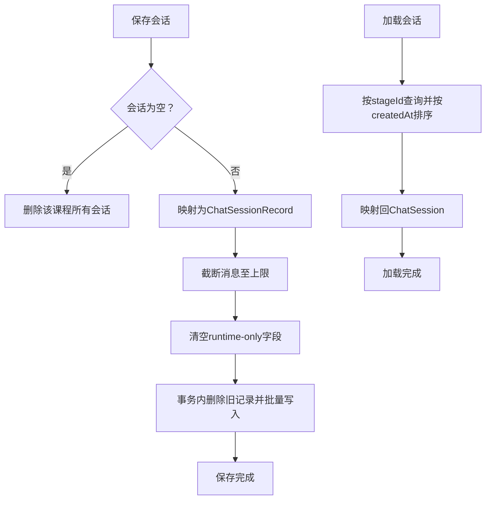
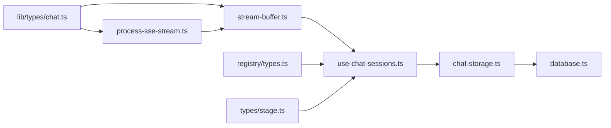

# 聊天类型定义

<cite>
**本文档引用的文件**
- [lib/types/chat.ts](file://lib/types/chat.ts)
- [lib/buffer/stream-buffer.ts](file://lib/buffer/stream-buffer.ts)
- [lib/utils/chat-storage.ts](file://lib/utils/chat-storage.ts)
- [lib/utils/database.ts](file://lib/utils/database.ts)
- [app/api/chat/route.ts](file://app/api/chat/route.ts)
- [components/chat/process-sse-stream.ts](file://components/chat/process-sse-stream.ts)
- [components/chat/use-chat-sessions.ts](file://components/chat/use-chat-sessions.ts)
- [lib/orchestration/registry/types.ts](file://lib/orchestration/registry/types.ts)
- [lib/types/stage.ts](file://lib/types/stage.ts)
</cite>

## 目录
1. [简介](#简介)
2. [项目结构](#项目结构)
3. [核心组件](#核心组件)
4. [架构总览](#架构总览)
5. [详细组件分析](#详细组件分析)
6. [依赖关系分析](#依赖关系分析)
7. [性能考量](#性能考量)
8. [故障排查指南](#故障排查指南)
9. [结论](#结论)
10. [附录](#附录)

## 简介
本文件系统性梳理 OpenMAIC 项目中的聊天类型定义与实现，重点覆盖以下方面：
- 聊天消息类型（ChatMessage）的结构：消息内容、发送者信息、时间戳与消息元数据。
- 聊天会话类型（ChatSession）的定义：会话标识、参与者列表、消息历史、工具调用记录与会话状态。
- 多智能体聊天的特殊类型：智能体身份、角色分配与对话流程控制。
- 聊天事件类型与实时通信协议：Server-Sent Events（SSE）在无状态与有状态场景下的使用。
- 安全性与隐私保护机制：API 密钥解析、错误处理与客户端敏感信息隔离。
- 聊戏数据的存储格式与同步策略：IndexedDB 存储、序列化与批量写入。

## 项目结构
围绕聊天类型的代码主要分布在如下模块：
- 类型定义：lib/types/chat.ts（会话、消息、事件、请求等）
- 实时缓冲与播放：lib/buffer/stream-buffer.ts（统一的流式事件缓冲与播放节拍）
- SSE 解析与桥接：components/chat/process-sse-stream.ts（将服务端事件注入缓冲）
- 会话生命周期与循环：components/chat/use-chat-sessions.ts（前端驱动的智能体轮询循环）
- 无状态聊天 API：app/api/chat/route.ts（SSE 流式响应）
- 数据持久化：lib/utils/chat-storage.ts、lib/utils/database.ts（IndexedDB 持久化）
- 智能体配置与角色映射：lib/orchestration/registry/types.ts
- 场景与阶段类型：lib/types/stage.ts（用于 storeState 的上下文）



**图表来源**
- [lib/types/chat.ts:1-337](file://lib/types/chat.ts#L1-L337)
- [lib/buffer/stream-buffer.ts:1-605](file://lib/buffer/stream-buffer.ts#L1-L605)
- [components/chat/process-sse-stream.ts:1-123](file://components/chat/process-sse-stream.ts#L1-L123)
- [components/chat/use-chat-sessions.ts:1-800](file://components/chat/use-chat-sessions.ts#L1-L800)
- [app/api/chat/route.ts:1-191](file://app/api/chat/route.ts#L1-L191)
- [lib/utils/database.ts:1-446](file://lib/utils/database.ts#L1-L446)
- [lib/utils/chat-storage.ts:1-82](file://lib/utils/chat-storage.ts#L1-L82)
- [lib/orchestration/registry/types.ts:1-87](file://lib/orchestration/registry/types.ts#L1-L87)
- [lib/types/stage.ts:1-124](file://lib/types/stage.ts#L1-L124)

**章节来源**
- [lib/types/chat.ts:1-337](file://lib/types/chat.ts#L1-L337)
- [lib/buffer/stream-buffer.ts:1-605](file://lib/buffer/stream-buffer.ts#L1-L605)
- [components/chat/process-sse-stream.ts:1-123](file://components/chat/process-sse-stream.ts#L1-L123)
- [components/chat/use-chat-sessions.ts:1-800](file://components/chat/use-chat-sessions.ts#L1-L800)
- [app/api/chat/route.ts:1-191](file://app/api/chat/route.ts#L1-L191)
- [lib/utils/database.ts:1-446](file://lib/utils/database.ts#L1-L446)
- [lib/utils/chat-storage.ts:1-82](file://lib/utils/chat-storage.ts#L1-L82)
- [lib/orchestration/registry/types.ts:1-87](file://lib/orchestration/registry/types.ts#L1-L87)
- [lib/types/stage.ts:1-124](file://lib/types/stage.ts#L1-L124)

## 核心组件
本节聚焦聊天类型的核心接口与数据模型。

- 会话类型与状态
  - 会话类型：qa、discussion、lecture
  - 会话状态：idle、active、interrupted、completed
- 消息元数据（ChatMessageMetadata）
  - 发送者名称与头像
  - 原始角色（teacher、agent、user）
  - 可选动作按钮列表
  - 智能体标识与颜色
  - 创建时间戳与中断标记
- 会话对象（ChatSession）
  - 标识、类型、标题、状态
  - 消息数组（UIMessage<ChatMessageMetadata>[]）、配置、工具调用记录与待执行工具调用
  - 创建/更新时间、场景标识、最后动作索引
- 工具调用相关
  - 待执行工具调用请求（ToolCallRequest）
  - 已完成工具调用记录（ToolCallRecord）
- 事件类型
  - 会话事件（SessionEvent）：消息、工具请求/完成、代理切换、状态变更、错误、完成、文本开始/增量/结束
  - 无状态事件（StatelessEvent）：代理开始/结束、文本增量、动作、思考、提示用户、完成、错误
- 请求体
  - 创建会话请求（CreateSessionRequest）
  - 发送消息请求（SendMessageRequest）
  - 提交工具结果请求（ToolResultsRequest）
  - 无状态聊天请求（StatelessChatRequest）：包含完整历史、storeState、代理配置、导演状态、用户画像、API 凭据

**章节来源**
- [lib/types/chat.ts:10-180](file://lib/types/chat.ts#L10-L180)
- [lib/types/chat.ts:181-337](file://lib/types/chat.ts#L181-L337)

## 架构总览
下图展示从 API 到 UI 的端到端聊天数据流，包括无状态聊天 API、SSE 解析、缓冲与 UI 更新。



**图表来源**
- [app/api/chat/route.ts:44-191](file://app/api/chat/route.ts#L44-L191)
- [components/chat/process-sse-stream.ts:12-123](file://components/chat/process-sse-stream.ts#L12-L123)
- [lib/buffer/stream-buffer.ts:149-605](file://lib/buffer/stream-buffer.ts#L149-L605)
- [components/chat/use-chat-sessions.ts:144-329](file://components/chat/use-chat-sessions.ts#L144-L329)

## 详细组件分析

### 组件一：消息与会话类型（ChatMessage 与 ChatSession）
- 结构要点
  - ChatMessageMetadata：承载发送者、角色、动作、智能体标识与时间戳等元信息
  - ChatSession：聚合消息、工具调用、配置与状态，支持按场景与阶段进行持久化
- 关键字段语义
  - messages：UIMessage 数组，支持多段文本与动作混合
  - toolCalls/pendingToolCalls：工具调用的执行与待执行队列
  - config：包含 agentIds、maxTurns、currentTurn、触发代理等
  - createdAt/updatedAt：会话级时间戳，用于排序与恢复
- 复杂度与性能
  - 消息数组采用切片截断（最多 200 条），避免 IndexedDB 膨胀
  - 非必要字段在保存时清空（如 pendingToolCalls），降低序列化开销



**图表来源**
- [lib/types/chat.ts:17-92](file://lib/types/chat.ts#L17-L92)
- [lib/types/chat.ts:41-54](file://lib/types/chat.ts#L41-L54)

**章节来源**
- [lib/types/chat.ts:17-92](file://lib/types/chat.ts#L17-L92)
- [lib/types/chat.ts:41-54](file://lib/types/chat.ts#L41-L54)

### 组件二：实时事件与无状态聊天协议（SSE）
- 事件类型
  - 会话事件（SessionEvent）：用于有状态会话的增量更新
  - 无状态事件（StatelessEvent）：用于无状态 API 的增量生成
- 协议要点
  - SSE 流以“data: ”前缀传输 JSON 事件
  - 心跳机制：每 15 秒发送注释以保持连接活跃
  - 客户端通过 AbortSignal 中断请求，服务端捕获并优雅关闭
- 解析与注入
  - process-sse-stream 将事件解析后推送到 StreamBuffer
  - StreamBuffer 统一节拍推进文本显示、动作执行与回调



**图表来源**
- [components/chat/process-sse-stream.ts:12-123](file://components/chat/process-sse-stream.ts#L12-L123)
- [lib/buffer/stream-buffer.ts:149-605](file://lib/buffer/stream-buffer.ts#L149-L605)

**章节来源**
- [app/api/chat/route.ts:44-191](file://app/api/chat/route.ts#L44-L191)
- [components/chat/process-sse-stream.ts:12-123](file://components/chat/process-sse-stream.ts#L12-L123)
- [lib/buffer/stream-buffer.ts:149-605](file://lib/buffer/stream-buffer.ts#L149-L605)

### 组件三：多智能体聊天与对话流程控制
- 角色与动作
  - 角色动作映射：teacher 具备幻灯片与白板控制；assistant/student 仅白板操作
  - 默认动作集合：白板动作与演示动作
- 会话类型与流程
  - qa：默认代理回复，受 maxTurns 控制
  - discussion：由触发代理发起讨论，支持话题与提示词
  - lecture：课堂讲解，节奏由 PlaybackEngine 控制
- 前端驱动的智能体循环
  - use-chat-sessions 在每次迭代中刷新 storeState，构造 StatelessChatRequest 并调用 /api/chat
  - 通过 StreamBuffer 的 waitUntilDrained 等待当前轮次完成，再根据 done/cue_user 决策是否继续
  - 连续空响应阈值（≥2）作为退出条件，防止无限循环

```mermaid
sequenceDiagram
participant Loop as "前端循环<br/>runAgentLoop"
participant API as "无状态聊天API"
participant Parser as "SSE解析器"
participant Buffer as "流式缓冲"
participant Hooks as "会话钩子"
Loop->>API : "POST /api/chat<br/>messages + storeState + config"
API-->>Parser : "SSE事件流"
Parser->>Buffer : "注入事件"
Buffer->>Hooks : "回调：onTextReveal/onActionReady/onDone"
Hooks-->>Loop : "等待buffer drain"
Loop->>Loop : "读取done数据：cue_user/agent数量"
alt "收到cue_user或END"
Loop-->>Loop : "停止循环"
else "继续"
Loop->>API : "下一轮请求"
end
```

**图表来源**
- [components/chat/use-chat-sessions.ts:340-502](file://components/chat/use-chat-sessions.ts#L340-L502)
- [lib/orchestration/registry/types.ts:54-87](file://lib/orchestration/registry/types.ts#L54-L87)

**章节来源**
- [components/chat/use-chat-sessions.ts:340-502](file://components/chat/use-chat-sessions.ts#L340-L502)
- [lib/orchestration/registry/types.ts:54-87](file://lib/orchestration/registry/types.ts#L54-L87)

### 组件四：数据持久化与同步策略
- 存储表结构（IndexedDB）
  - chatSessions：会话主表，包含 id、stageId、type、title、status、messages、config、toolCalls、pendingToolCalls、时间戳与场景/动作索引
- 同步策略
  - 保存：将 active 会话标记为 interrupted，清理 runtime-only 字段，截断消息至上限，批量写入
  - 加载：按 createdAt 升序返回会话列表，映射回 ChatSession
  - 删除：按 stageId 清理该课程所有会话
- 数据隔离
  - 以 stageId 为维度进行数据隔离，确保多课程间互不干扰



**图表来源**
- [lib/utils/chat-storage.ts:21-74](file://lib/utils/chat-storage.ts#L21-L74)
- [lib/utils/database.ts:94-111](file://lib/utils/database.ts#L94-L111)

**章节来源**
- [lib/utils/chat-storage.ts:21-74](file://lib/utils/chat-storage.ts#L21-L74)
- [lib/utils/database.ts:94-111](file://lib/utils/database.ts#L94-L111)

## 依赖关系分析
- 类型依赖
  - ChatSession 依赖 UIMessage 与 ChatMessageMetadata
  - StatelessChatRequest 依赖 Stage/Scene/StageMode 等场景类型
- 运行时依赖
  - use-chat-sessions 依赖 SSE 解析器与 StreamBuffer
  - API 层依赖统一模型提供者与错误响应封装
- 存储依赖
  - chat-storage 依赖 database 定义的表结构与事务



**图表来源**
- [lib/types/chat.ts:1-337](file://lib/types/chat.ts#L1-L337)
- [components/chat/process-sse-stream.ts:1-123](file://components/chat/process-sse-stream.ts#L1-L123)
- [lib/buffer/stream-buffer.ts:1-605](file://lib/buffer/stream-buffer.ts#L1-L605)
- [components/chat/use-chat-sessions.ts:1-800](file://components/chat/use-chat-sessions.ts#L1-L800)
- [lib/utils/chat-storage.ts:1-82](file://lib/utils/chat-storage.ts#L1-L82)
- [lib/utils/database.ts:1-446](file://lib/utils/database.ts#L1-L446)
- [lib/orchestration/registry/types.ts:1-87](file://lib/orchestration/registry/types.ts#L1-L87)
- [lib/types/stage.ts:1-124](file://lib/types/stage.ts#L1-L124)

**章节来源**
- [lib/types/chat.ts:1-337](file://lib/types/chat.ts#L1-L337)
- [components/chat/process-sse-stream.ts:1-123](file://components/chat/process-sse-stream.ts#L1-L123)
- [lib/buffer/stream-buffer.ts:1-605](file://lib/buffer/stream-buffer.ts#L1-L605)
- [components/chat/use-chat-sessions.ts:1-800](file://components/chat/use-chat-sessions.ts#L1-L800)
- [lib/utils/chat-storage.ts:1-82](file://lib/utils/chat-storage.ts#L1-L82)
- [lib/utils/database.ts:1-446](file://lib/utils/database.ts#L1-L446)
- [lib/orchestration/registry/types.ts:1-87](file://lib/orchestration/registry/types.ts#L1-L87)
- [lib/types/stage.ts:1-124](file://lib/types/stage.ts#L1-L124)

## 性能考量
- 文本显示节拍
  - StreamBuffer 通过固定 tickMs 与 charsPerTick 控制字符级打字机效果，避免 UI 抖动
  - 对于 discussion/qa，设置 postTextDelayMs 与 actionDelayMs，提升阅读体验
- SSE 连接保活
  - API 层定时发送心跳注释，防止代理/浏览器超时关闭连接
- 存储上限与批量写入
  - 单会话消息上限 200 条，事务批量写入减少 I/O 开销
- 连续空响应保护
  - 连续两次空响应即终止循环，避免无效请求

[本节为通用性能建议，无需特定文件引用]

## 故障排查指南
- API 错误
  - 缺少必填字段（messages/storeState/config.agentIds）将返回 400
  - 未提供有效 API Key 返回 401
  - 其他内部错误返回 500
- SSE 异常
  - 解析错误：检查 data: 行格式与 JSON 有效性
  - 连接中断：确认客户端 AbortSignal 正确传递，服务端捕获并优雅关闭
- UI 不更新
  - 确认 StreamBuffer 已启动且回调正确绑定
  - 检查 onTextReveal/onActionReady/onDone 是否被调用
- 数据丢失
  - active 会话在刷新后会被标记为 interrupted，需重新发起请求或恢复
  - 确认 saveChatSessions 截断逻辑与 runtime-only 字段清理

**章节来源**
- [app/api/chat/route.ts:50-191](file://app/api/chat/route.ts#L50-L191)
- [components/chat/process-sse-stream.ts:45-123](file://components/chat/process-sse-stream.ts#L45-L123)
- [lib/utils/chat-storage.ts:21-74](file://lib/utils/chat-storage.ts#L21-L74)

## 结论
本项目通过强类型定义、SSE 实时协议与统一的流式缓冲层，构建了可扩展的多智能体聊天系统。关键特性包括：
- 明确的消息与会话模型，支持丰富的元数据与工具调用
- 无状态 API 与前端驱动的智能体循环，兼顾灵活性与可控性
- IndexedDB 分课程隔离存储，保障数据一致性与可恢复性
- SSE 心跳与节拍控制，提供稳定的实时体验

[本节为总结性内容，无需特定文件引用]

## 附录
- 安全与隐私
  - API Key 解析优先级：客户端 > 服务器配置 > 空；未提供则拒绝请求
  - 用户画像与 storeState 仅在本地使用，不上传至服务器
- 最佳实践
  - 使用 waitUntilDrained 等待当前轮次完成后再发起下一轮
  - 合理设置 maxTurns 与 postTextDelayMs，平衡交互体验与性能
  - 定期清理过期会话，避免 IndexedDB 膨胀

[本节为通用建议，无需特定文件引用]