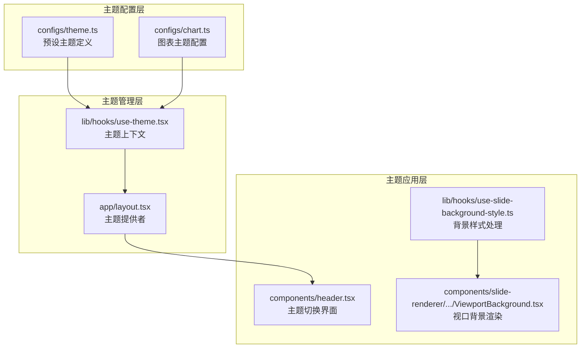
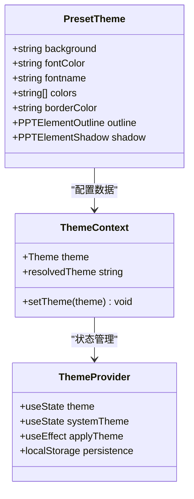
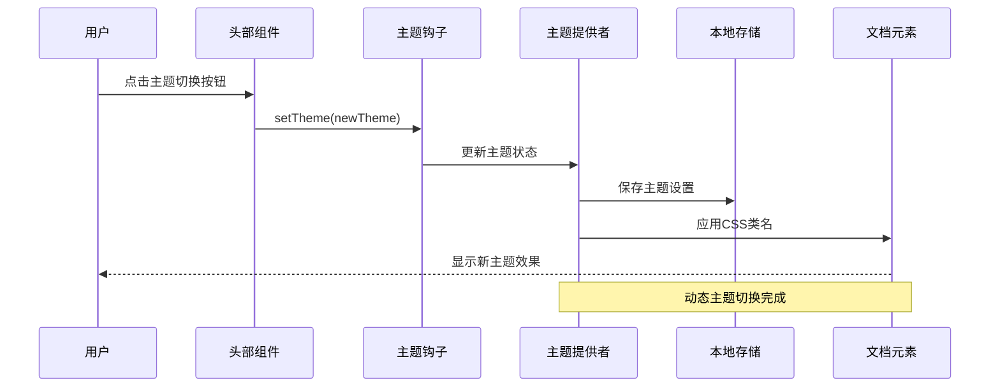
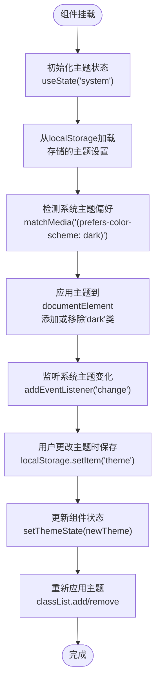
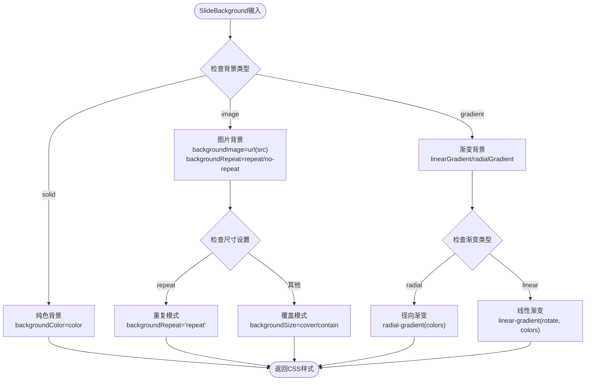
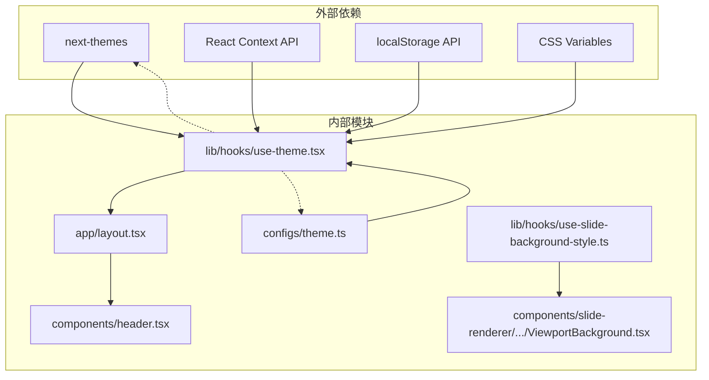

# 主题配置系统

<cite>
**本文档引用的文件**
- [configs/theme.ts](file://configs/theme.ts)
- [lib/hooks/use-theme.tsx](file://lib/hooks/use-theme.tsx)
- [app/layout.tsx](file://app/layout.tsx)
- [components/header.tsx](file://components/header.tsx)
- [configs/chart.ts](file://configs/chart.ts)
- [lib/hooks/use-slide-background-style.ts](file://lib/hooks/use-slide-background-style.ts)
- [components/slide-renderer/Editor/Canvas/ViewportBackground.tsx](file://components/slide-renderer/Editor/Canvas/ViewportBackground.tsx)
</cite>

## 目录
1. [简介](#简介)
2. [项目结构](#项目结构)
3. [核心组件](#核心组件)
4. [架构概览](#架构概览)
5. [详细组件分析](#详细组件分析)
6. [依赖关系分析](#依赖关系分析)
7. [性能考虑](#性能考虑)
8. [故障排除指南](#故障排除指南)
9. [结论](#结论)
10. [附录](#附录)

## 简介

OpenMAIC 主题配置系统是一个多层次的主题管理解决方案，支持明暗主题切换和预设主题选择。该系统通过 React Context 提供主题状态管理，支持用户自定义主题和动态主题应用。

系统主要包含两个层面的主题配置：
- **全局主题系统**：基于 CSS 变量的明暗主题切换
- **预设主题系统**：包含 16 种预定义的色彩方案

## 项目结构

主题配置系统在项目中的组织结构如下：



**图表来源**
- [configs/theme.ts:1-127](file://configs/theme.ts#L1-L127)
- [lib/hooks/use-theme.tsx:1-71](file://lib/hooks/use-theme.tsx#L1-L71)
- [app/layout.tsx:1-47](file://app/layout.tsx#L1-L47)

**章节来源**
- [configs/theme.ts:1-127](file://configs/theme.ts#L1-L127)
- [lib/hooks/use-theme.tsx:1-71](file://lib/hooks/use-theme.tsx#L1-L71)
- [app/layout.tsx:1-47](file://app/layout.tsx#L1-L47)

## 核心组件

### 预设主题接口设计

预设主题接口 `PresetTheme` 定义了完整的主题配置结构：



**图表来源**
- [configs/theme.ts:3-11](file://configs/theme.ts#L3-L11)
- [lib/hooks/use-theme.tsx:7-11](file://lib/hooks/use-theme.tsx#L7-L11)

### 预设主题数组结构

系统包含 16 个精心设计的预设主题，每个主题都经过色彩理论优化：

| 主题编号 | 背景色 | 字体色 | 边框色 | 主要色彩集合 |
|---------|--------|--------|--------|-------------|
| 1 | 白色 | 深灰 | 蓝灰 | 蓝橙绿黄蓝绿 |
| 2 | 白色 | 深灰 | 黑绿 | 莜菜绿、薄荷绿、深蓝 |
| 3 | 白色 | 深灰 | 橙棕 | 橙红、棕褐、米色 |
| 4 | 白色 | 深灰 | 浅蓝 | 浅蓝、深蓝、亮黄 |
| 5 | 白色 | 深灰 | 橄榄绿 | 酸橙绿、森林绿、橙红 |
| 6 | 白色 | 深灰 | 青绿 | 青蓝、钴蓝、青绿 |
| 7 | 米色 | 深灰 | 棕红 | 棕橙、土黄、橄榄绿 |
| 8 | 深蓝 | 白色 | 深红 | 红橙、柠檬黄、薄荷绿 |
| 9 | 深紫 | 白色 | 粉红 | 深粉、亮粉、橙色 |
| 10 | 蓝色 | 白色 | 深蓝 | 深蓝、洋红、青绿 |
| 11 | 深青 | 白色 | 浅青 | 青蓝、水绿、柠檬黄 |
| 12 | 深紫 | 白色 | 深紫 | 紫罗兰、浅紫、草绿 |
| 13 | 橙黄 | 深灰 | 柠檬黄 | 棕褐、金黄、焦糖色 |
| 14 | 深灰 | 白色 | 浅蓝 | 浅蓝、深蓝、亮黄 |
| 15 | 深灰 | 白色 | 深橙 | 橙红、土黄、咖啡色 |
| 16 | 深黑 | 白色 | 深灰 | 灰白、土黄、橙红 |

**章节来源**
- [configs/theme.ts:13-126](file://configs/theme.ts#L13-L126)

## 架构概览

主题配置系统采用分层架构设计，确保主题管理的灵活性和可扩展性：



**图表来源**
- [components/header.tsx:175-211](file://components/header.tsx#L175-L211)
- [lib/hooks/use-theme.tsx:53-56](file://lib/hooks/use-theme.tsx#L53-L56)
- [app/layout.tsx:36-42](file://app/layout.tsx#L36-L42)

## 详细组件分析

### 主题提供者组件

主题提供者是整个主题系统的核心，负责管理主题状态和应用主题到文档元素：



**图表来源**
- [lib/hooks/use-theme.tsx:15-62](file://lib/hooks/use-theme.tsx#L15-L62)

### 预设主题管理系统

预设主题系统提供了丰富的色彩组合，每种主题都有其独特的视觉特征和适用场景：

#### 主题分类与特点

| 分类 | 主题数量 | 特点描述 | 适用场景 |
|------|----------|----------|----------|
| 清新明亮 | 4个 | 白色背景，深色文字，柔和色彩 | 教育内容、学习材料 |
| 自然田园 | 3个 | 土色调背景，自然色彩 | 设计作品、创意展示 |
| 深色主题 | 5个 | 深色背景，高对比度文字 | 夜间使用、护眼模式 |
| 单色调 | 4个 | 统一色调，不同饱和度 | 品牌一致性、专业演示 |

#### 主题色彩搭配原理

每个预设主题都遵循以下色彩搭配原则：
- **对比度平衡**：确保文字可读性
- **色彩和谐**：主色、辅色、强调色的合理配比
- **视觉层次**：通过色彩深浅创造信息层级
- **情感表达**：不同色彩传达不同情感和氛围

**章节来源**
- [configs/theme.ts:13-126](file://configs/theme.ts#L13-L126)

### 背景样式处理系统

针对幻灯片背景的样式处理系统提供了灵活的背景配置选项：



**图表来源**
- [lib/hooks/use-slide-background-style.ts:7-54](file://lib/hooks/use-slide-background-style.ts#L7-L54)

**章节来源**
- [lib/hooks/use-slide-background-style.ts:1-54](file://lib/hooks/use-slide-background-style.ts#L1-L54)

### 主题切换界面组件

头部组件提供了直观的主题切换界面，支持用户快速切换主题：

```mermaid
classDiagram
class ThemeSwitcher {
+props : { theme, setTheme }
+render() JSX.Element
+handleLightClick() void
+handleDarkClick() void
+handleSystemClick() void
}
class SunIcon {
+className : "w-4 h-4"
}
class MoonIcon {
+className : "w-4 h-4"
}
class MonitorIcon {
+className : "w-4 h-4"
}
ThemeSwitcher --> SunIcon : "使用"
ThemeSwitcher --> MoonIcon : "使用"
ThemeSwitcher --> MonitorIcon : "使用"
```

**图表来源**
- [components/header.tsx:175-211](file://components/header.tsx#L175-L211)

**章节来源**
- [components/header.tsx:14-211](file://components/header.tsx#L14-L211)

## 依赖关系分析

主题配置系统的依赖关系展现了清晰的分层架构：



**图表来源**
- [lib/hooks/use-theme.tsx:1-71](file://lib/hooks/use-theme.tsx#L1-L71)
- [configs/theme.ts:1-127](file://configs/theme.ts#L1-L127)

**章节来源**
- [lib/hooks/use-theme.tsx:1-71](file://lib/hooks/use-theme.tsx#L1-L71)
- [configs/theme.ts:1-127](file://configs/theme.ts#L1-L127)

## 性能考虑

主题配置系统在设计时充分考虑了性能优化：

### 内存管理
- 使用 `useMemo` 优化背景样式的计算
- React Context 避免不必要的重渲染
- localStorage 缓存主题设置，减少重复读取

### 渲染优化
- CSS 类名切换比内联样式更高效
- 条件渲染减少 DOM 元素数量
- 事件监听器在组件卸载时正确清理

### 存储优化
- localStorage 仅存储必要的主题状态
- 避免频繁的主题状态更新
- 批量处理主题变更操作

## 故障排除指南

### 常见问题及解决方案

#### 主题切换不生效
**症状**：点击主题按钮后界面无变化
**原因分析**：
- localStorage 访问被浏览器阻止
- CSS 类名未正确应用到 documentElement
- React Context 未正确提供

**解决步骤**：
1. 检查浏览器控制台是否有错误信息
2. 验证 localStorage 是否可用
3. 确认 documentElement 上是否正确添加 'dark' 类
4. 确保 ThemeProvider 包裹了应用根组件

#### 主题状态不同步
**症状**：页面刷新后主题恢复默认
**原因分析**：
- localStorage 数据损坏
- hydration 过程中的状态不一致
- 多个 ThemeProvider 实例冲突

**解决步骤**：
1. 清除浏览器中的主题相关数据
2. 检查是否有多个 ThemeProvider 实例
3. 验证 hydration 过程中的状态同步
4. 确保只在应用根组件使用 ThemeProvider

#### 预设主题显示异常
**症状**：预设主题颜色显示不正确
**原因分析**：
- 颜色值格式不正确
- CSS 变量未正确解析
- 浏览器兼容性问题

**解决步骤**：
1. 验证颜色值格式（十六进制）
2. 检查 CSS 变量是否正确解析
3. 测试不同浏览器的兼容性
4. 确认颜色值在有效范围内

**章节来源**
- [lib/hooks/use-theme.tsx:65-71](file://lib/hooks/use-theme.tsx#L65-L71)

## 结论

OpenMAIC 主题配置系统通过精心设计的架构实现了灵活而强大的主题管理功能。系统不仅支持基本的明暗主题切换，还提供了丰富的预设主题选择，满足不同场景下的视觉需求。

系统的主要优势包括：
- **模块化设计**：清晰的分层架构便于维护和扩展
- **性能优化**：合理的状态管理和渲染优化
- **用户体验**：直观的主题切换界面和即时反馈
- **可扩展性**：易于添加新的预设主题和自定义配置

未来可以考虑的功能增强：
- 添加更多预设主题选项
- 支持用户自定义主题上传
- 实现主题导入导出功能
- 增强主题预览和实时预览功能

## 附录

### 主题配置最佳实践

#### 添加新预设主题
1. 在 `PRESET_THEMES` 数组中添加新的主题对象
2. 确保颜色值符合十六进制格式规范
3. 测试主题在明暗模式下的显示效果
4. 验证主题与现有组件的兼容性

#### 修改现有主题
1. 分析现有主题的色彩搭配原理
2. 保持整体视觉风格的一致性
3. 测试修改后的主题在不同场景下的表现
4. 更新相关的文档和注释

#### 主题验证机制
系统内置了基础的颜色值验证：
- 检查十六进制颜色值格式
- 验证颜色值的有效范围
- 确保数组元素的完整性

**章节来源**
- [configs/theme.ts:13-126](file://configs/theme.ts#L13-L126)