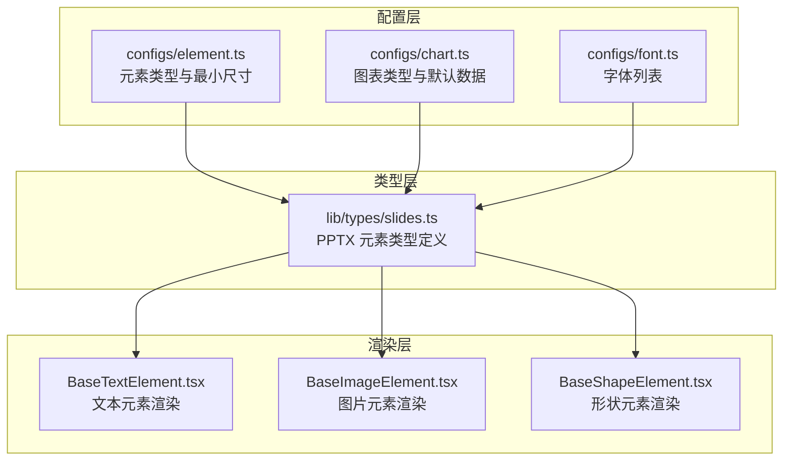
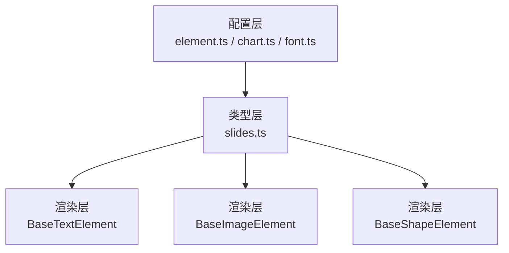
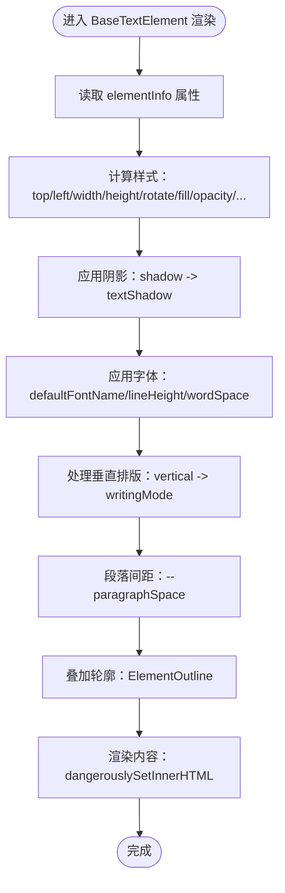
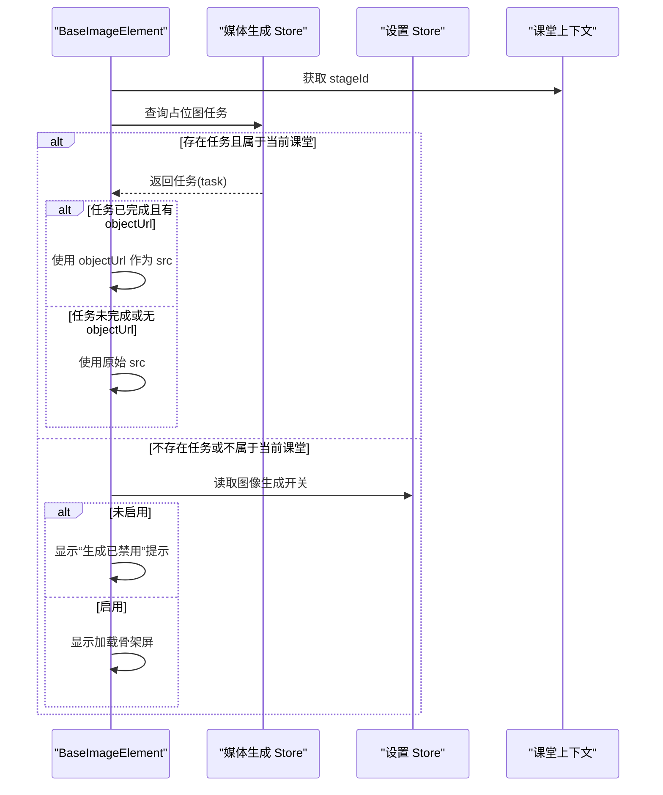
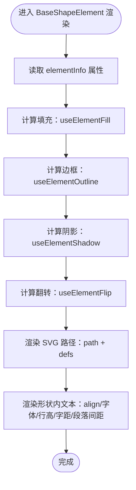
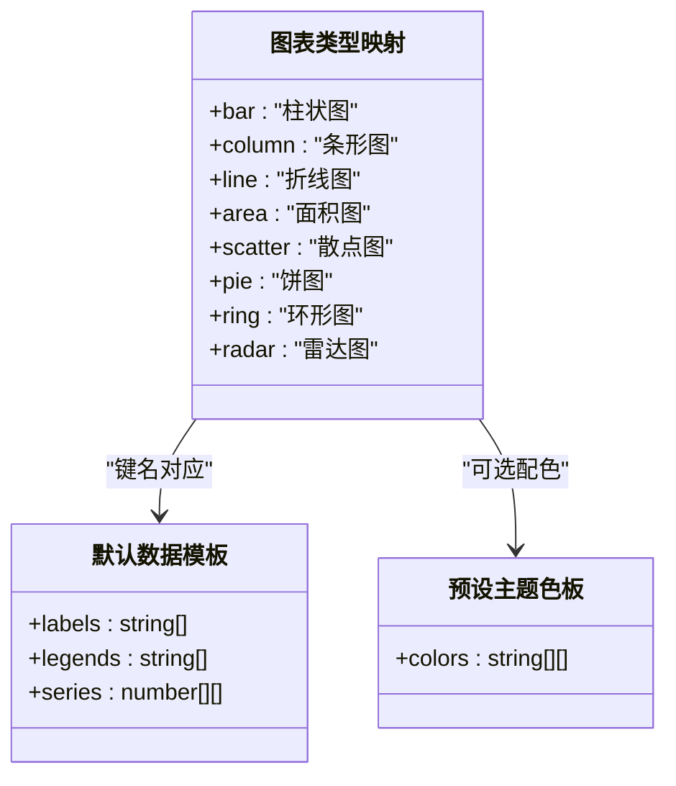
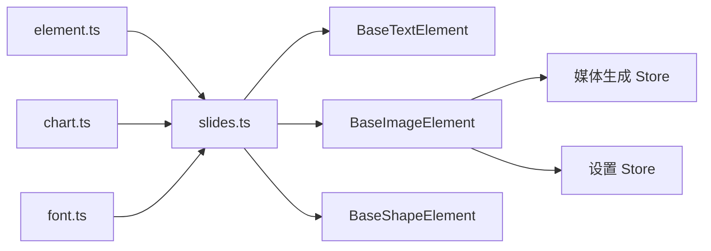

# 元素配置系统

<cite>
**本文引用的文件**
- [configs/element.ts](file://configs/element.ts)
- [configs/chart.ts](file://configs/chart.ts)
- [configs/font.ts](file://configs/font.ts)
- [components/slide-renderer/components/element/TextElement/BaseTextElement.tsx](file://components/slide-renderer/components/element/TextElement/BaseTextElement.tsx)
- [components/slide-renderer/components/element/ImageElement/BaseImageElement.tsx](file://components/slide-renderer/components/element/ImageElement/BaseImageElement.tsx)
- [components/slide-renderer/components/element/ShapeElement/BaseShapeElement.tsx](file://components/slide-renderer/components/element/ShapeElement/BaseShapeElement.tsx)
- [lib/types/slides.ts](file://lib/types/slides.ts)
</cite>

## 目录
1. [引言](#引言)
2. [项目结构](#项目结构)
3. [核心组件](#核心组件)
4. [架构总览](#架构总览)
5. [详细组件分析](#详细组件分析)
6. [依赖分析](#依赖分析)
7. [性能考虑](#性能考虑)
8. [故障排查指南](#故障排查指南)
9. [结论](#结论)
10. [附录](#附录)

## 引言
本文件系统化梳理 OpenMAIC 中“元素配置系统”的设计与实现，聚焦于元素类型的默认属性、样式规则与行为设置的配置方式；阐明元素配置的数据结构（元素类型、属性映射与继承关系）；总结验证机制（属性合法性检查与默认值处理）；给出扩展方法（自定义元素类型与属性定义）；并提出版本管理与向后兼容策略、最佳实践与性能优化建议。本文面向不同技术背景的读者，力求以循序渐进的方式呈现。

## 项目结构
元素配置系统主要由三部分构成：
- 配置层：集中定义元素类型、最小尺寸、图表类型与默认数据、字体列表等静态配置。
- 类型层：通过 TypeScript 定义元素属性的数据结构，为渲染层提供强类型约束。
- 渲染层：各基础元素组件根据配置与类型进行渲染，体现默认属性与样式规则。

**图表来源**
- [configs/element.ts:1-23](file://configs/element.ts#L1-L23)
- [configs/chart.ts:1-89](file://configs/chart.ts#L1-L89)
- [configs/font.ts:1-32](file://configs/font.ts#L1-L32)
- [lib/types/slides.ts](file://lib/types/slides.ts)
- [components/slide-renderer/components/element/TextElement/BaseTextElement.tsx:1-64](file://components/slide-renderer/components/element/TextElement/BaseTextElement.tsx#L1-L64)
- [components/slide-renderer/components/element/ImageElement/BaseImageElement.tsx:1-157](file://components/slide-renderer/components/element/ImageElement/BaseImageElement.tsx#L1-L157)
- [components/slide-renderer/components/element/ShapeElement/BaseShapeElement.tsx:1-119](file://components/slide-renderer/components/element/ShapeElement/BaseShapeElement.tsx#L1-L119)

**章节来源**
- [configs/element.ts:1-23](file://configs/element.ts#L1-L23)
- [configs/chart.ts:1-89](file://configs/chart.ts#L1-L89)
- [configs/font.ts:1-32](file://configs/font.ts#L1-L32)
- [lib/types/slides.ts](file://lib/types/slides.ts)
- [components/slide-renderer/components/element/TextElement/BaseTextElement.tsx:1-64](file://components/slide-renderer/components/element/TextElement/BaseTextElement.tsx#L1-L64)
- [components/slide-renderer/components/element/ImageElement/BaseImageElement.tsx:1-157](file://components/slide-renderer/components/element/ImageElement/BaseImageElement.tsx#L1-L157)
- [components/slide-renderer/components/element/ShapeElement/BaseShapeElement.tsx:1-119](file://components/slide-renderer/components/element/ShapeElement/BaseShapeElement.tsx#L1-L119)

## 核心组件
- 元素类型与最小尺寸配置：提供元素类型到中文名的映射以及各类元素的最小尺寸阈值，用于布局与交互约束。
- 图表配置：提供图表类型到中文名的映射、默认数据模板与预设主题色板，支撑图表元素的快速初始化与渲染。
- 字体配置：提供可选字体列表，作为元素默认字体与用户选择的基础。
- 元素类型定义：在类型层中统一描述文本、图片、形状、表格、视频、音频、公式等元素的属性集合，包含位置、尺寸、旋转、填充、阴影、翻转、滤镜、边框、文本等字段。
- 基础元素渲染器：文本、图片、形状元素分别基于类型定义与配置进行渲染，体现默认属性与样式规则。

**章节来源**
- [configs/element.ts:1-23](file://configs/element.ts#L1-L23)
- [configs/chart.ts:1-89](file://configs/chart.ts#L1-L89)
- [configs/font.ts:1-32](file://configs/font.ts#L1-L32)
- [lib/types/slides.ts](file://lib/types/slides.ts)
- [components/slide-renderer/components/element/TextElement/BaseTextElement.tsx:1-64](file://components/slide-renderer/components/element/TextElement/BaseTextElement.tsx#L1-L64)
- [components/slide-renderer/components/element/ImageElement/BaseImageElement.tsx:1-157](file://components/slide-renderer/components/element/ImageElement/BaseImageElement.tsx#L1-L157)
- [components/slide-renderer/components/element/ShapeElement/BaseShapeElement.tsx:1-119](file://components/slide-renderer/components/element/ShapeElement/BaseShapeElement.tsx#L1-L119)

## 架构总览
元素配置系统采用“配置层 + 类型层 + 渲染层”的分层架构：
- 配置层负责静态常量与默认数据，确保跨模块一致性；
- 类型层提供强类型约束，避免运行时错误；
- 渲染层依据类型与配置进行渲染，同时保留必要的默认值处理逻辑。

**图表来源**
- [configs/element.ts:1-23](file://configs/element.ts#L1-L23)
- [configs/chart.ts:1-89](file://configs/chart.ts#L1-L89)
- [configs/font.ts:1-32](file://configs/font.ts#L1-L32)
- [lib/types/slides.ts](file://lib/types/slides.ts)
- [components/slide-renderer/components/element/TextElement/BaseTextElement.tsx:1-64](file://components/slide-renderer/components/element/TextElement/BaseTextElement.tsx#L1-L64)
- [components/slide-renderer/components/element/ImageElement/BaseImageElement.tsx:1-157](file://components/slide-renderer/components/element/ImageElement/BaseImageElement.tsx#L1-L157)
- [components/slide-renderer/components/element/ShapeElement/BaseShapeElement.tsx:1-119](file://components/slide-renderer/components/element/ShapeElement/BaseShapeElement.tsx#L1-L119)

## 详细组件分析

### 文本元素配置与渲染
- 默认属性与样式规则
  - 位置与尺寸：通过 top、left、width、height 控制绝对定位与大小。
  - 旋转：通过 rotate 控制角度。
  - 填充与透明度：fill、opacity 控制背景与透明度。
  - 文本样式：defaultColor、defaultFontName、lineHeight、wordSpace 等控制颜色、字体、行高与字间距。
  - 垂直排版：vertical 控制文字方向（如 vertical-rl）。
  - 段落间距：通过 CSS 自定义属性 --paragraphSpace 控制段落间距。
  - 阴影：shadow 映射为 textShadow。
- 继承关系
  - 文本元素的默认属性来源于类型定义与渲染组件的默认值处理（如未显式提供时的默认字体、颜色等）。
- 验证与默认值
  - 渲染组件对缺失字段进行兜底（如 paragraphSpace 缺省时使用默认值），保证渲染稳定性。
- 扩展方法
  - 可在类型定义中新增字段，在渲染组件中处理新字段的样式映射；或在配置层增加默认值映射。

**图表来源**
- [components/slide-renderer/components/element/TextElement/BaseTextElement.tsx:16-62](file://components/slide-renderer/components/element/TextElement/BaseTextElement.tsx#L16-L62)

**章节来源**
- [components/slide-renderer/components/element/TextElement/BaseTextElement.tsx:1-64](file://components/slide-renderer/components/element/TextElement/BaseTextElement.tsx#L1-L64)
- [lib/types/slides.ts](file://lib/types/slides.ts)

### 图片元素配置与渲染
- 默认属性与样式规则
  - 位置与尺寸：top、left、width、height 控制定位与缩放。
  - 旋转与翻转：rotate、flipH、flipV 控制旋转与水平/垂直翻转。
  - 阴影：shadow 映射为 drop-shadow。
  - 裁剪与滤镜：clipShape、filter 控制裁剪路径与滤镜效果。
  - 颜色蒙版：colorMask 支持覆盖色。
- 行为设置
  - 占位图与生成任务：当 src 为占位符且当前课堂上下文中存在对应任务时，优先使用 store 中已生成的 objectUrl；否则回退到原始 src。
  - 状态反馈：禁用生成、生成中、失败等状态分别渲染不同的 UI 提示与重试按钮。
- 验证与默认值
  - 对占位图与任务状态进行判断，避免跨课堂污染；对缺失字段进行默认值兜底（如滤镜、阴影等）。
- 扩展方法
  - 新增图片属性（如新的滤镜参数）需在 useFilter 与渲染逻辑中同步处理；在类型定义中补充字段并在渲染组件中映射。

**图表来源**
- [components/slide-renderer/components/element/ImageElement/BaseImageElement.tsx:23-50](file://components/slide-renderer/components/element/ImageElement/BaseImageElement.tsx#L23-L50)

**章节来源**
- [components/slide-renderer/components/element/ImageElement/BaseImageElement.tsx:1-157](file://components/slide-renderer/components/element/ImageElement/BaseImageElement.tsx#L1-L157)
- [lib/types/slides.ts](file://lib/types/slides.ts)

### 形状元素配置与渲染
- 默认属性与样式规则
  - 位置与尺寸：top、left、width、height 控制定位与缩放。
  - 旋转与翻转：rotate、flipH、flipV 控制变换。
  - 填充：支持纯色、渐变、图案三种填充方式，通过 useElementFill 统一处理。
  - 边框：outlineWidth、outlineColor、strokeDasharray 控制描边宽度、颜色与虚线样式。
  - 阴影：shadow 映射为 drop-shadow。
  - 文本：形状内嵌文本的 content、align、defaultFontName、defaultColor、lineHeight、wordSpace、paragraphSpace 等。
- 继承关系
  - 形状文本的默认属性来源于类型定义与渲染组件的默认值处理（如未显式提供时的默认字体、颜色等）。
- 验证与默认值
  - 当 text 为空时，渲染组件提供默认空文本与默认字体、颜色等，保证渲染稳定性。
- 扩展方法
  - 在类型定义中扩展形状文本字段；在渲染组件中映射到样式与布局；在 useElementFill/useElementOutline/useElementShadow/useElementFlip 等钩子中处理新属性。

**图表来源**
- [components/slide-renderer/components/element/ShapeElement/BaseShapeElement.tsx:18-116](file://components/slide-renderer/components/element/ShapeElement/BaseShapeElement.tsx#L18-L116)

**章节来源**
- [components/slide-renderer/components/element/ShapeElement/BaseShapeElement.tsx:1-119](file://components/slide-renderer/components/element/ShapeElement/BaseShapeElement.tsx#L1-L119)
- [lib/types/slides.ts](file://lib/types/slides.ts)

### 图表配置与默认数据
- 图表类型映射：提供 bar、column、line、area、scatter、pie、ring、radar 等类型到中文名的映射。
- 默认数据模板：为每种图表类型提供默认的 labels、legends、series 数据结构，便于快速初始化。
- 预设主题色板：提供多组预设颜色数组，可直接用于图表配色方案。

**图表来源**
- [configs/chart.ts:3-12](file://configs/chart.ts#L3-L12)
- [configs/chart.ts:14-73](file://configs/chart.ts#L14-L73)
- [configs/chart.ts:75-88](file://configs/chart.ts#L75-L88)

**章节来源**
- [configs/chart.ts:1-89](file://configs/chart.ts#L1-L89)

### 字体配置
- 字体列表：提供多种中英文字体的标签与值，作为元素默认字体与用户选择的基础。
- 用途：文本元素默认字体 defaultFontName 可从该列表中选取。

**章节来源**
- [configs/font.ts:1-32](file://configs/font.ts#L1-L32)

### 元素类型与最小尺寸
- 元素类型映射：提供 text、image、shape、line、chart、table、video、audio、latex 到中文名的映射。
- 最小尺寸：为每种元素类型提供最小宽高阈值，用于布局与交互约束（如拖拽、缩放）。

**章节来源**
- [configs/element.ts:1-11](file://configs/element.ts#L1-L11)
- [configs/element.ts:13-22](file://configs/element.ts#L13-L22)

## 依赖分析
- 配置层依赖关系
  - element.ts 与 chart.ts、font.ts 分别独立维护，互不耦合，降低变更风险。
- 类型层依赖关系
  - slides.ts 定义了所有元素的属性集合，被各基础元素渲染器引用。
- 渲染层依赖关系
  - BaseTextElement、BaseImageElement、BaseShapeElement 分别依赖 slides.ts 的类型定义，并在组件内部进行默认值处理与样式映射。
  - 图片元素还依赖媒体生成 Store 与设置 Store，以实现占位图与生成任务的状态管理。

**图表来源**
- [configs/element.ts:1-23](file://configs/element.ts#L1-L23)
- [configs/chart.ts:1-89](file://configs/chart.ts#L1-L89)
- [configs/font.ts:1-32](file://configs/font.ts#L1-L32)
- [lib/types/slides.ts](file://lib/types/slides.ts)
- [components/slide-renderer/components/element/TextElement/BaseTextElement.tsx:1-64](file://components/slide-renderer/components/element/TextElement/BaseTextElement.tsx#L1-L64)
- [components/slide-renderer/components/element/ImageElement/BaseImageElement.tsx:1-157](file://components/slide-renderer/components/element/ImageElement/BaseImageElement.tsx#L1-L157)
- [components/slide-renderer/components/element/ShapeElement/BaseShapeElement.tsx:1-119](file://components/slide-renderer/components/element/ShapeElement/BaseShapeElement.tsx#L1-L119)

**章节来源**
- [configs/element.ts:1-23](file://configs/element.ts#L1-L23)
- [configs/chart.ts:1-89](file://configs/chart.ts#L1-L89)
- [configs/font.ts:1-32](file://configs/font.ts#L1-L32)
- [lib/types/slides.ts](file://lib/types/slides.ts)
- [components/slide-renderer/components/element/TextElement/BaseTextElement.tsx:1-64](file://components/slide-renderer/components/element/TextElement/BaseTextElement.tsx#L1-L64)
- [components/slide-renderer/components/element/ImageElement/BaseImageElement.tsx:1-157](file://components/slide-renderer/components/element/ImageElement/BaseImageElement.tsx#L1-L157)
- [components/slide-renderer/components/element/ShapeElement/BaseShapeElement.tsx:1-119](file://components/slide-renderer/components/element/ShapeElement/BaseShapeElement.tsx#L1-L119)

## 性能考虑
- 渲染性能
  - 文本与形状元素通过 CSS transform、drop-shadow、clip-path 等高效合成，减少重排与重绘。
  - 图片元素在占位图状态下优先使用骨架屏，避免阻塞主线程。
- 计算开销
  - 阴影、翻转、滤镜等样式计算集中在 hooks 中复用，避免重复计算。
- 资源管理
  - 图片元素仅在课堂上下文中订阅媒体生成 Store，避免跨课程资源污染与额外订阅成本。
- 建议
  - 将默认值与样式映射尽量前置到类型定义与配置层，减少运行时分支判断。
  - 对高频更新的样式（如旋转、透明度）使用 CSS 变量或缓存策略，降低样式计算成本。

[本节为通用性能建议，无需特定文件引用]

## 故障排查指南
- 图片元素显示异常
  - 症状：占位图未替换为真实图片。
  - 排查：确认媒体生成 Store 中是否存在对应任务且属于当前课堂；检查 objectUrl 是否可用。
  - 参考路径：[BaseImageElement 占位图与任务处理:34-44](file://components/slide-renderer/components/element/ImageElement/BaseImageElement.tsx#L34-L44)
- 图片元素状态错误
  - 症状：显示“生成已禁用”或“生成失败”提示。
  - 排查：检查设置 Store 中图像生成开关；查看任务 errorCode 并按提示重试。
  - 参考路径：[BaseImageElement 状态渲染与重试:46-126](file://components/slide-renderer/components/element/ImageElement/BaseImageElement.tsx#L46-L126)
- 文本元素样式错乱
  - 症状：行高、字间距、段落间距异常。
  - 排查：确认是否正确传入 lineHeight、wordSpace、paragraphSpace；检查 CSS 自定义属性 --paragraphSpace 的计算。
  - 参考路径：[BaseTextElement 样式计算:34-48](file://components/slide-renderer/components/element/TextElement/BaseTextElement.tsx#L34-L48)
- 形状元素文本不显示
  - 症状：形状内文本为空或样式异常。
  - 排查：确认 text 字段是否为空；若为空，渲染组件会提供默认值，需检查调用方是否遗漏传入。
  - 参考路径：[BaseShapeElement 文本默认值:24-29](file://components/slide-renderer/components/element/ShapeElement/BaseShapeElement.tsx#L24-L29)

**章节来源**
- [components/slide-renderer/components/element/ImageElement/BaseImageElement.tsx:1-157](file://components/slide-renderer/components/element/ImageElement/BaseImageElement.tsx#L1-L157)
- [components/slide-renderer/components/element/TextElement/BaseTextElement.tsx:1-64](file://components/slide-renderer/components/element/TextElement/BaseTextElement.tsx#L1-L64)
- [components/slide-renderer/components/element/ShapeElement/BaseShapeElement.tsx:1-119](file://components/slide-renderer/components/element/ShapeElement/BaseShapeElement.tsx#L1-L119)

## 结论
元素配置系统通过“配置层 + 类型层 + 渲染层”的清晰分工，实现了元素类型、默认属性、样式规则与行为设置的标准化与可扩展性。配置层提供稳定的默认值与映射，类型层确保强类型约束，渲染层在保证性能的前提下提供灵活的样式与行为能力。结合本文提供的扩展方法、验证机制与最佳实践，可在不破坏现有功能的基础上持续演进元素配置体系。

[本节为总结性内容，无需特定文件引用]

## 附录

### 元素配置的数据结构与继承关系
- 元素类型
  - 文本：包含位置、尺寸、旋转、填充、透明度、阴影、字体、行高、字间距、段落间距、轮廓等。
  - 图片：包含位置、尺寸、旋转、翻转、阴影、裁剪、滤镜、颜色蒙版、占位图与生成任务状态等。
  - 形状：包含位置、尺寸、旋转、翻转、填充（纯色/渐变/图案）、边框、阴影、内嵌文本等。
- 属性映射
  - 渲染组件将类型定义中的属性映射到 CSS 样式或 SVG 属性，如 fill/opactiy/rotate/transform/filter 等。
- 继承关系
  - 形状内嵌文本的默认属性来源于渲染组件的默认值处理；文本元素的默认属性来源于类型定义与渲染组件的默认值处理。

**章节来源**
- [lib/types/slides.ts](file://lib/types/slides.ts)
- [components/slide-renderer/components/element/TextElement/BaseTextElement.tsx:1-64](file://components/slide-renderer/components/element/TextElement/BaseTextElement.tsx#L1-L64)
- [components/slide-renderer/components/element/ImageElement/BaseImageElement.tsx:1-157](file://components/slide-renderer/components/element/ImageElement/BaseImageElement.tsx#L1-L157)
- [components/slide-renderer/components/element/ShapeElement/BaseShapeElement.tsx:1-119](file://components/slide-renderer/components/element/ShapeElement/BaseShapeElement.tsx#L1-L119)

### 版本管理与向后兼容策略
- 配置层变更
  - 新增元素类型：在 element.ts、chart.ts、font.ts 中追加映射与默认值，保持既有键不变，避免破坏既有逻辑。
- 类型层变更
  - 新增字段：在 slides.ts 中添加可选字段，并在渲染组件中提供默认值处理，保证旧数据仍可渲染。
- 渲染层变更
  - 新增样式：在渲染组件中新增样式映射，确保旧数据不会报错；必要时提供降级方案。
- 迁移建议
  - 通过配置层与类型层的默认值处理，逐步迁移旧数据；对不兼容的字段提供转换脚本或运行时兼容函数。

**章节来源**
- [configs/element.ts:1-23](file://configs/element.ts#L1-L23)
- [configs/chart.ts:1-89](file://configs/chart.ts#L1-L89)
- [configs/font.ts:1-32](file://configs/font.ts#L1-L32)
- [lib/types/slides.ts](file://lib/types/slides.ts)
- [components/slide-renderer/components/element/TextElement/BaseTextElement.tsx:1-64](file://components/slide-renderer/components/element/TextElement/BaseTextElement.tsx#L1-L64)
- [components/slide-renderer/components/element/ImageElement/BaseImageElement.tsx:1-157](file://components/slide-renderer/components/element/ImageElement/BaseImageElement.tsx#L1-L157)
- [components/slide-renderer/components/element/ShapeElement/BaseShapeElement.tsx:1-119](file://components/slide-renderer/components/element/ShapeElement/BaseShapeElement.tsx#L1-L119)

### 扩展方法
- 自定义元素类型
  - 在 element.ts 中新增类型映射；在 chart.ts 中为图表类型提供默认数据模板；在 font.ts 中扩展字体列表。
  - 在 slides.ts 中定义新元素的属性集合；在渲染层新增对应的组件并实现样式映射。
- 自定义属性定义
  - 在 slides.ts 中新增字段；在渲染组件中处理默认值与样式映射；在配置层提供默认值或映射。

**章节来源**
- [configs/element.ts:1-23](file://configs/element.ts#L1-L23)
- [configs/chart.ts:1-89](file://configs/chart.ts#L1-L89)
- [configs/font.ts:1-32](file://configs/font.ts#L1-L32)
- [lib/types/slides.ts](file://lib/types/slides.ts)
- [components/slide-renderer/components/element/TextElement/BaseTextElement.tsx:1-64](file://components/slide-renderer/components/element/TextElement/BaseTextElement.tsx#L1-L64)
- [components/slide-renderer/components/element/ImageElement/BaseImageElement.tsx:1-157](file://components/slide-renderer/components/element/ImageElement/BaseImageElement.tsx#L1-L157)
- [components/slide-renderer/components/element/ShapeElement/BaseShapeElement.tsx:1-119](file://components/slide-renderer/components/element/ShapeElement/BaseShapeElement.tsx#L1-L119)