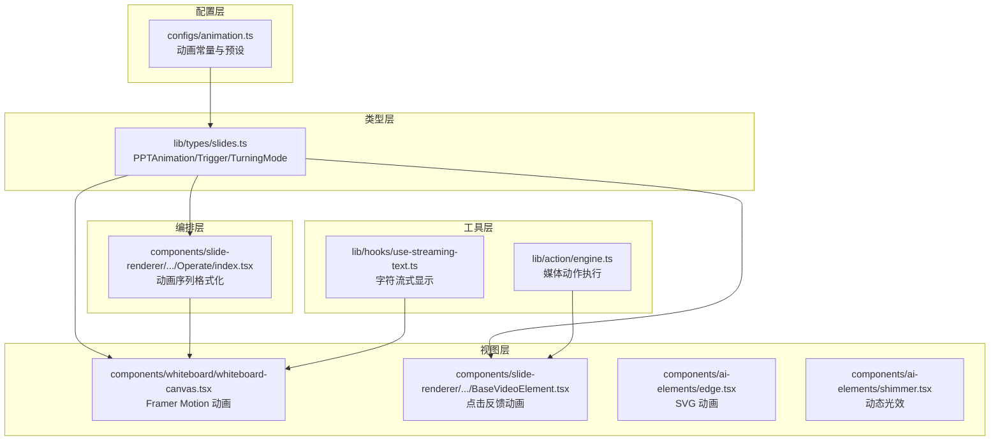
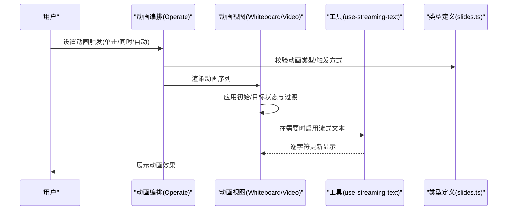
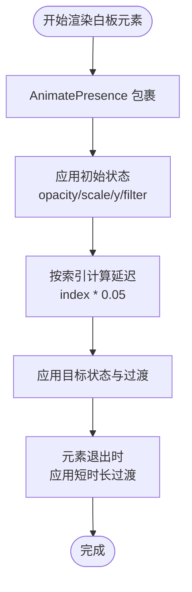
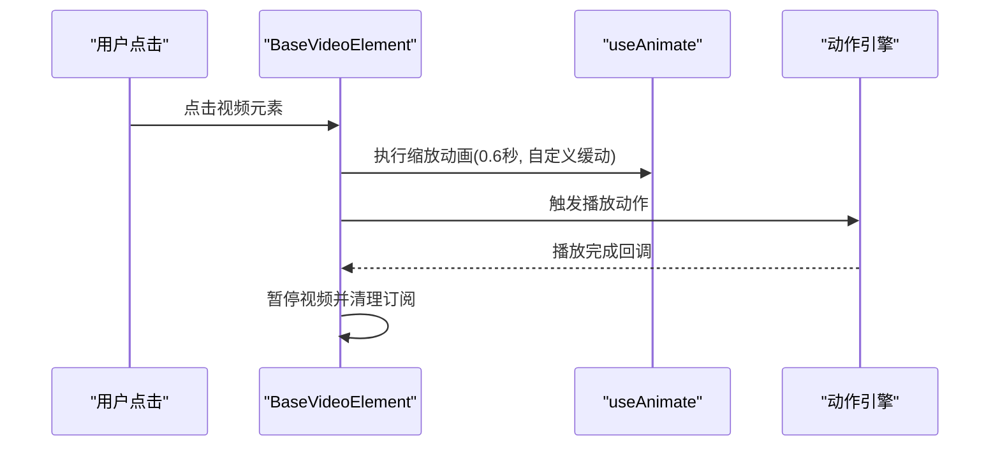
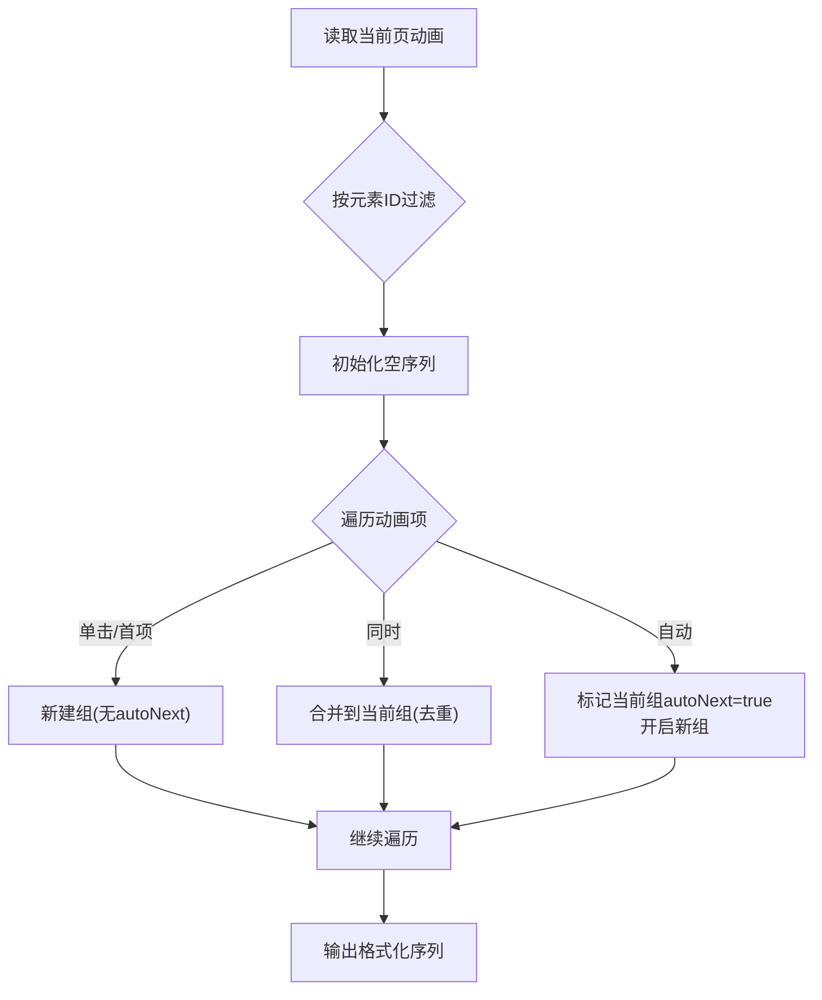
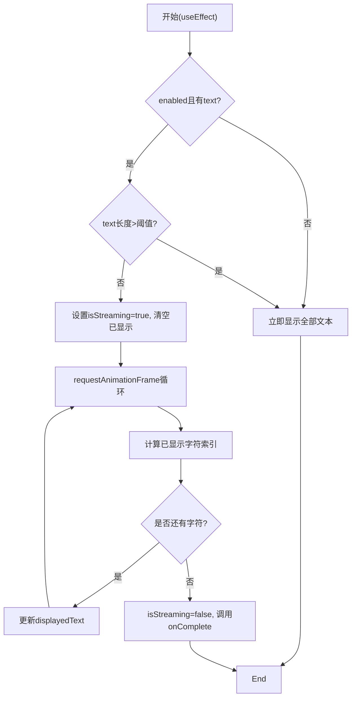
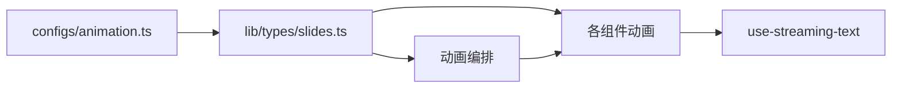

# 动画配置系统

<cite>
**本文档引用的文件**
- [configs/animation.ts](file://configs/animation.ts)
- [lib/types/slides.ts](file://lib/types/slides.ts)
- [components/whiteboard/whiteboard-canvas.tsx](file://components/whiteboard/whiteboard-canvas.tsx)
- [components/slide-renderer/components/element/VideoElement/BaseVideoElement.tsx](file://components/slide-renderer/components/element/VideoElement/BaseVideoElement.tsx)
- [lib/hooks/use-streaming-text.ts](file://lib/hooks/use-streaming-text.ts)
- [components/slide-renderer/Editor/Canvas/Operate/index.tsx](file://components/slide-renderer/Editor/Canvas/Operate/index.tsx)
- [components/ai-elements/edge.tsx](file://components/ai-elements/edge.tsx)
- [components/ai-elements/shimmer.tsx](file://components/ai-elements/shimmer.tsx)
- [lib/action/engine.ts](file://lib/action/engine.ts)
</cite>

## 目录
1. [简介](#简介)
2. [项目结构](#项目结构)
3. [核心组件](#核心组件)
4. [架构总览](#架构总览)
5. [详细组件分析](#详细组件分析)
6. [依赖关系分析](#依赖关系分析)
7. [性能考虑](#性能考虑)
8. [故障排除指南](#故障排除指南)
9. [结论](#结论)
10. [附录](#附录)

## 简介
本文件系统性梳理 OpenMAIC 的动画配置体系，涵盖动画配置的架构设计、数据结构、执行流程、性能优化与扩展机制。重点包括：
- 过渡效果、缓动函数与动画时序的配置
- 动画参数（持续时间、触发条件等）的设置方法
- 基于 Framer Motion 的流畅动画实现与响应式适配
- 性能优化策略（硬件加速、帧率控制、内存管理）
- 扩展机制（自定义动画效果与第三方动画库集成）
- 测试与性能监控建议

## 项目结构
动画相关能力主要分布在以下模块：
- 配置层：统一管理动画常量与预设效果
- 类型层：定义动画数据结构与枚举
- 视图层：使用 Framer Motion 实现具体动画
- 编排层：根据触发条件组织动画序列
- 工具层：提供流式文本等动画驱动



**图表来源**
- [configs/animation.ts:1-235](file://configs/animation.ts#L1-L235)
- [lib/types/slides.ts:677-702](file://lib/types/slides.ts#L677-L702)
- [components/whiteboard/whiteboard-canvas.tsx:1-167](file://components/whiteboard/whiteboard-canvas.tsx#L1-L167)
- [components/slide-renderer/components/element/VideoElement/BaseVideoElement.tsx:1-193](file://components/slide-renderer/components/element/VideoElement/BaseVideoElement.tsx#L1-L193)
- [components/ai-elements/edge.tsx:89-131](file://components/ai-elements/edge.tsx#L89-L131)
- [components/ai-elements/shimmer.tsx:1-37](file://components/ai-elements/shimmer.tsx#L1-L37)
- [components/slide-renderer/Editor/Canvas/Operate/index.tsx:72-101](file://components/slide-renderer/Editor/Canvas/Operate/index.tsx#L72-L101)
- [lib/hooks/use-streaming-text.ts:1-125](file://lib/hooks/use-streaming-text.ts#L1-L125)
- [lib/action/engine.ts:213-245](file://lib/action/engine.ts#L213-L245)

**章节来源**
- [configs/animation.ts:1-235](file://configs/animation.ts#L1-L235)
- [lib/types/slides.ts:677-702](file://lib/types/slides.ts#L677-L702)

## 核心组件
- 动画配置常量与预设：提供默认时长、默认触发方式、CSS 类前缀以及入场/出场/强调动画分类与子项。
- 动画数据结构：定义动画类型（入场/出场/强调）、触发方式（单击/同时/自动）与持续时间等字段。
- 视图层动画：基于 Framer Motion 的组件级动画，支持初始态、目标态与过渡配置。
- 动画序列编排：根据触发条件将多个动画分组，形成“同时/自动”顺序。
- 工具动画：如流式文本显示，使用 requestAnimationFrame 驱动逐字符渲染。

**章节来源**
- [configs/animation.ts:3-5](file://configs/animation.ts#L3-L5)
- [configs/animation.ts:7-96](file://configs/animation.ts#L7-L96)
- [configs/animation.ts:98-187](file://configs/animation.ts#L98-L187)
- [configs/animation.ts:189-214](file://configs/animation.ts#L189-L214)
- [lib/types/slides.ts:695-702](file://lib/types/slides.ts#L695-L702)

## 架构总览
动画系统采用“配置-类型-视图-编排-工具”的分层架构：
- 配置层：集中管理动画效果清单与默认参数
- 类型层：约束动画数据结构与取值范围
- 视图层：在组件中声明动画状态与过渡
- 编排层：解析触发条件，生成动画序列
- 工具层：提供动画驱动与媒体动作



**图表来源**
- [components/slide-renderer/Editor/Canvas/Operate/index.tsx:72-101](file://components/slide-renderer/Editor/Canvas/Operate/index.tsx#L72-L101)
- [components/whiteboard/whiteboard-canvas.tsx:30-74](file://components/whiteboard/whiteboard-canvas.tsx#L30-L74)
- [components/slide-renderer/components/element/VideoElement/BaseVideoElement.tsx:68-85](file://components/slide-renderer/components/element/VideoElement/BaseVideoElement.tsx#L68-L85)
- [lib/hooks/use-streaming-text.ts:87-116](file://lib/hooks/use-streaming-text.ts#L87-L116)
- [lib/types/slides.ts:695-702](file://lib/types/slides.ts#L695-L702)

## 详细组件分析

### 动画配置与数据结构
- 配置常量
  - 默认时长与触发方式：用于未显式配置时的回退
  - CSS 类前缀：与外部动画库（如 animate.css）兼容
- 动画预设
  - 入场/出场/强调三类，按类型分组，每组包含多个具体效果
  - 幻灯片切换动画：包含多种转场模式（如淡入淡出、推移、旋转、缩放等）
- 数据结构
  - PPTAnimation：包含元素ID、效果名称、类型、持续时间、触发方式
  - 触发方式枚举：单击、同时、自动
  - 转场模式枚举：用于场景切换的动画模式

```mermaid
classDiagram
class PPTAnimation {
+string id
+string elId
+string effect
+AnimationType type
+number duration
+AnimationTrigger trigger
}
class AnimationTrigger {
<<enum>>
"click"
"meantime"
"auto"
}
class AnimationType {
<<enum>>
"in"
"out"
"attention"
}
class SlidesTypes {
+TurningMode
}
PPTAnimation --> AnimationType : "使用"
PPTAnimation --> AnimationTrigger : "使用"
SlidesTypes <.. AnimationTrigger : "配合"
```

**图表来源**
- [lib/types/slides.ts:695-702](file://lib/types/slides.ts#L695-L702)
- [configs/animation.ts:216-234](file://configs/animation.ts#L216-L234)

**章节来源**
- [configs/animation.ts:3-5](file://configs/animation.ts#L3-L5)
- [configs/animation.ts:7-96](file://configs/animation.ts#L7-L96)
- [configs/animation.ts:98-187](file://configs/animation.ts#L98-L187)
- [configs/animation.ts:189-214](file://configs/animation.ts#L189-L214)
- [configs/animation.ts:216-234](file://configs/animation.ts#L216-L234)
- [lib/types/slides.ts:695-702](file://lib/types/slides.ts#L695-L702)

### 白板画布动画（Framer Motion）
- 功能要点
  - 使用 AnimatePresence 管理元素进入/离开
  - 初始态与目标态分别定义不透明度、缩放、位移与模糊
  - 通过 staggered delay 实现“波浪式”入场
  - 退出时采用较短时长与更柔和的过渡
- 响应式适配
  - 通过 ResizeObserver 计算缩放比例，保持 16:9 画布比例
  - 使用 transform 缩放容器，确保布局中心对齐



**图表来源**
- [components/whiteboard/whiteboard-canvas.tsx:30-74](file://components/whiteboard/whiteboard-canvas.tsx#L30-L74)
- [components/whiteboard/whiteboard-canvas.tsx:104-111](file://components/whiteboard/whiteboard-canvas.tsx#L104-L111)

**章节来源**
- [components/whiteboard/whiteboard-canvas.tsx:1-167](file://components/whiteboard/whiteboard-canvas.tsx#L1-L167)

### 视频元素点击反馈动画
- 功能要点
  - 当视频元素被标记为当前播放对象时，触发轻微缩放反馈
  - 使用自定义缓动曲线与分段时间点，营造“按下”触感
  - 播放结束后同步暂停状态
- 与媒体引擎协作
  - 通过动作引擎触发播放，等待播放结束事件再解除订阅



**图表来源**
- [components/slide-renderer/components/element/VideoElement/BaseVideoElement.tsx:68-85](file://components/slide-renderer/components/element/VideoElement/BaseVideoElement.tsx#L68-L85)
- [lib/action/engine.ts:213-228](file://lib/action/engine.ts#L213-L228)

**章节来源**
- [components/slide-renderer/components/element/VideoElement/BaseVideoElement.tsx:1-193](file://components/slide-renderer/components/element/VideoElement/BaseVideoElement.tsx#L1-L193)
- [lib/action/engine.ts:213-245](file://lib/action/engine.ts#L213-L245)

### 动画序列编排（触发条件）
- 功能要点
  - 将当前页元素与动画进行关联过滤
  - 根据触发方式（单击/同时/自动）分组，形成序列
  - 同时触发的动画会合并到同一组，自动触发则开启下一组
- 关键逻辑
  - 单击：作为新组起始
  - 同时：追加到当前组，但剔除同元素重复项
  - 自动：标记当前组自动下一组，并开启新组



**图表来源**
- [components/slide-renderer/Editor/Canvas/Operate/index.tsx:72-101](file://components/slide-renderer/Editor/Canvas/Operate/index.tsx#L72-L101)

**章节来源**
- [components/slide-renderer/Editor/Canvas/Operate/index.tsx:72-101](file://components/slide-renderer/Editor/Canvas/Operate/index.tsx#L72-L101)

### 流式文本动画（字符级）
- 功能要点
  - 基于 requestAnimationFrame 的逐字符渲染
  - 可配置速度（字符/秒）、是否启用、完成后回调
  - 支持跳过与重置，避免长文本导致的性能问题
- 性能控制
  - 对超过阈值的文本直接显示，禁用流式
  - 在卸载时取消帧请求，防止内存泄漏



**图表来源**
- [lib/hooks/use-streaming-text.ts:25-125](file://lib/hooks/use-streaming-text.ts#L25-L125)

**章节来源**
- [lib/hooks/use-streaming-text.ts:1-125](file://lib/hooks/use-streaming-text.ts#L1-L125)

### SVG 动画与动态光效
- SVG 动画：利用 animateMotion 实现路径跟随动画
- 动态光效：通过 motion.create 动态创建组件，结合缓动与扩散参数实现闪烁/流动效果

**章节来源**
- [components/ai-elements/edge.tsx:118-125](file://components/ai-elements/edge.tsx#L118-L125)
- [components/ai-elements/shimmer.tsx:20-37](file://components/ai-elements/shimmer.tsx#L20-L37)

## 依赖关系分析
- 配置层依赖类型层：动画预设与类型枚举强绑定
- 视图层依赖配置层与类型层：以预设效果与数据结构驱动渲染
- 编排层依赖类型层：校验与分组动画序列
- 工具层独立运行，但可被视图层调用



**图表来源**
- [configs/animation.ts:1-235](file://configs/animation.ts#L1-L235)
- [lib/types/slides.ts:677-702](file://lib/types/slides.ts#L677-L702)
- [components/slide-renderer/Editor/Canvas/Operate/index.tsx:72-101](file://components/slide-renderer/Editor/Canvas/Operate/index.tsx#L72-L101)
- [components/whiteboard/whiteboard-canvas.tsx:30-74](file://components/whiteboard/whiteboard-canvas.tsx#L30-L74)
- [lib/hooks/use-streaming-text.ts:87-116](file://lib/hooks/use-streaming-text.ts#L87-L116)

**章节来源**
- [configs/animation.ts:1-235](file://configs/animation.ts#L1-L235)
- [lib/types/slides.ts:677-702](file://lib/types/slides.ts#L677-L702)

## 性能考虑
- 硬件加速
  - 使用 transform/opacity 等可触发 GPU 加速的属性
  - 控制滤镜（如 blur）的使用频率与强度，避免过度消耗
- 帧率控制
  - 使用 requestAnimationFrame 驱动细粒度动画，减少主线程阻塞
  - 对长文本禁用流式动画，直接渲染以降低计算开销
- 内存管理
  - 在组件卸载时取消 requestAnimationFrame 与订阅
  - 合理使用 AnimatePresence 的退出过渡，避免残留 DOM
- 响应式适配
  - 通过 ResizeObserver 计算缩放，避免强制重排
  - 使用 transform 缩放而非改变实际尺寸，降低布局成本

[本节为通用性能指导，无需特定文件引用]

## 故障排除指南
- 动画不生效
  - 检查动画类型与触发方式是否符合预期
  - 确认元素ID与动画绑定一致
- 视频点击无反馈
  - 确认当前播放元素ID匹配
  - 检查动作引擎是否正确触发播放并等待结束
- 流式文本卡顿
  - 调整速度参数或启用阈值保护
  - 确保卸载时取消帧请求
- 白板元素退出异常
  - 检查 AnimatePresence 的 mode 与退出过渡时长
  - 确认清空阶段指针事件被禁用

**章节来源**
- [components/slide-renderer/Editor/Canvas/Operate/index.tsx:72-101](file://components/slide-renderer/Editor/Canvas/Operate/index.tsx#L72-L101)
- [components/slide-renderer/components/element/VideoElement/BaseVideoElement.tsx:68-85](file://components/slide-renderer/components/element/VideoElement/BaseVideoElement.tsx#L68-L85)
- [lib/hooks/use-streaming-text.ts:53-62](file://lib/hooks/use-streaming-text.ts#L53-L62)
- [components/whiteboard/whiteboard-canvas.tsx:61-65](file://components/whiteboard/whiteboard-canvas.tsx#L61-L65)

## 结论
OpenMAIC 的动画配置系统以清晰的分层架构实现了从配置到执行的完整链路。通过统一的类型约束与预设效果，结合 Framer Motion 的高性能渲染与响应式适配，系统在保证易用性的同时兼顾了性能与可扩展性。未来可在第三方动画库集成与更丰富的缓动曲线方面进一步增强。

## 附录
- 动画参数设置建议
  - 默认时长：根据交互节奏调整（如 300–800ms 适合微交互）
  - 触发方式：优先使用“单击”明确用户意图；批量操作使用“同时”
  - 缓动函数：常用 ease-out/ease-in-out；复杂反馈可用自定义贝塞尔曲线
- 测试与监控
  - 单元测试：针对动画序列编排与流式文本钩子
  - 性能监控：使用浏览器性能面板观察 FPS 与布局抖动
  - 用户体验：在移动端验证动画流畅度与交互延迟

[本节为通用指导，无需特定文件引用]