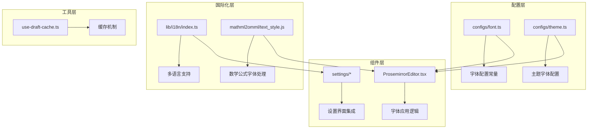
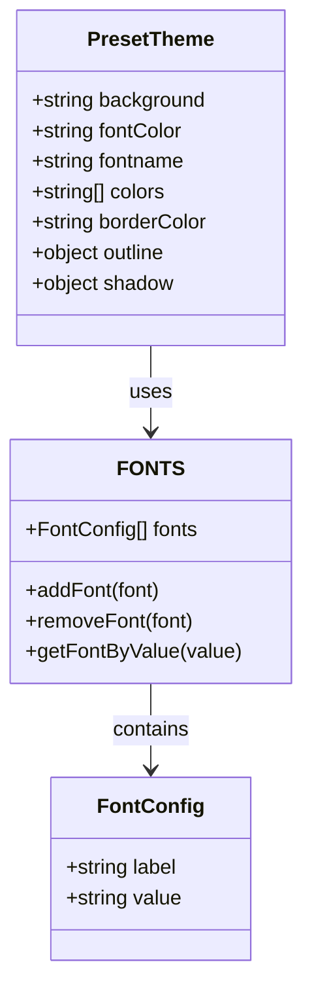
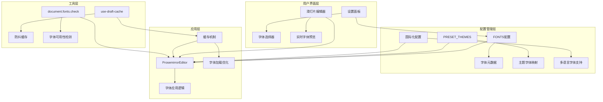
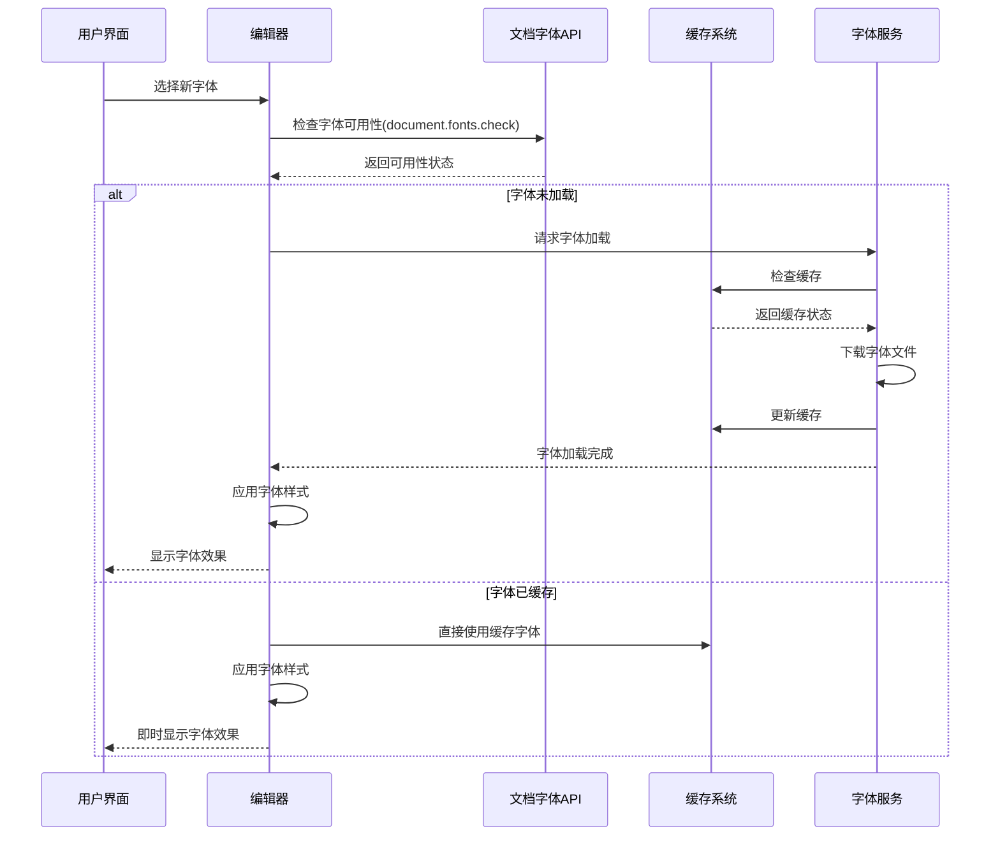
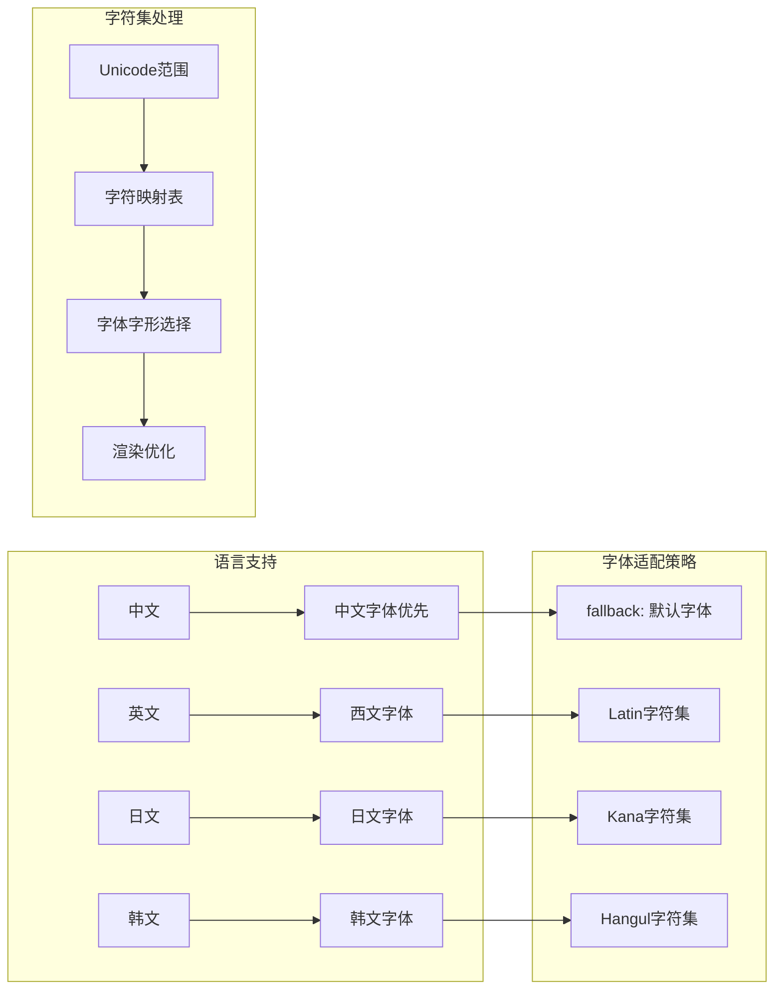
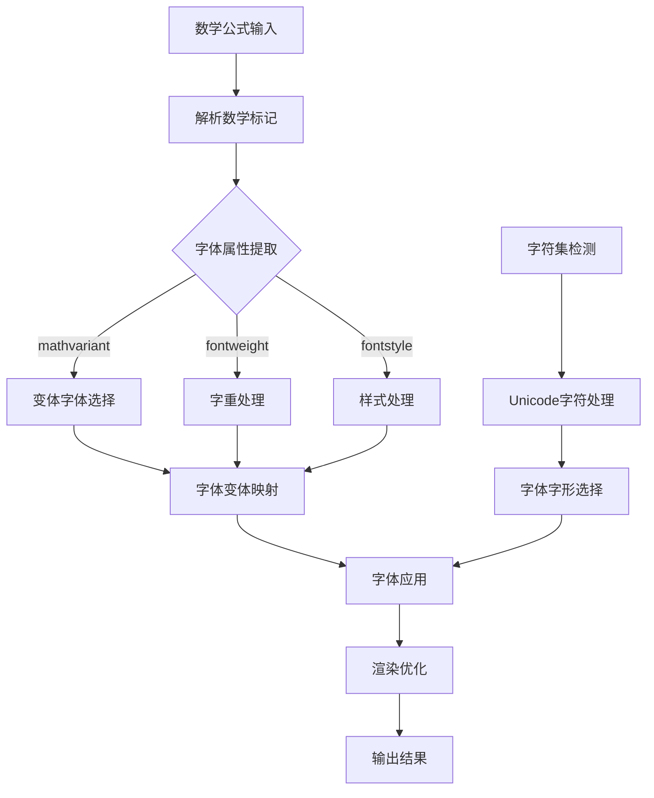
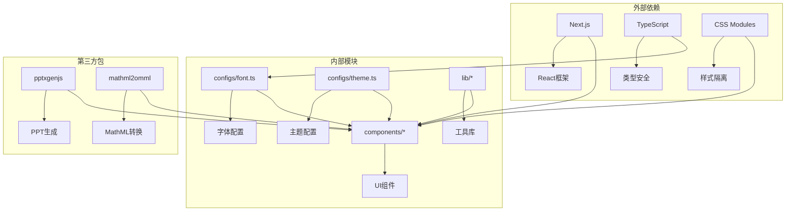

# 字体配置系统

<cite>
**本文档引用的文件**
- [configs/font.ts](file://configs/font.ts)
- [configs/theme.ts](file://configs/theme.ts)
- [components/slide-renderer/components/element/ProsemirrorEditor.tsx](file://components/slide-renderer/components/element/ProsemirrorEditor.tsx)
- [lib/i18n/index.ts](file://lib/i18n/index.ts)
- [packages/mathml2omml/src/mathml/text_style.js](file://packages/mathml2omml/src/mathml/text_style.js)
- [lib/hooks/use-draft-cache.ts](file://lib/hooks/use-draft-cache.ts)
</cite>

## 目录
1. [简介](#简介)
2. [项目结构](#项目结构)
3. [核心组件](#核心组件)
4. [架构概览](#架构概览)
5. [详细组件分析](#详细组件分析)
6. [依赖关系分析](#依赖关系分析)
7. [性能考虑](#性能考虑)
8. [故障排除指南](#故障排除指南)
9. [结论](#结论)

## 简介

OpenMAIC项目的字体配置系统是一个综合性的文本渲染和字体管理解决方案。该系统不仅支持多种中英文字体的选择和配置，还提供了完整的国际化支持、字体加载优化策略以及动态字体切换功能。

字体配置系统的核心目标是为用户提供灵活的字体选择能力，支持从默认字体到各种专业字体的完整覆盖，同时确保在不同语言环境下的字体适配和字符集处理。系统通过配置化的字体列表、主题化的字体应用以及智能的字体加载机制，为用户提供了流畅的字体体验。

## 项目结构

字体配置系统主要分布在以下关键目录中：



**图表来源**
- [configs/font.ts:1-32](file://configs/font.ts#L1-L32)
- [configs/theme.ts:1-127](file://configs/theme.ts#L1-L127)
- [components/slide-renderer/components/element/ProsemirrorEditor.tsx:169-198](file://components/slide-renderer/components/element/ProsemirrorEditor.tsx#L169-L198)

**章节来源**
- [configs/font.ts:1-32](file://configs/font.ts#L1-L32)
- [configs/theme.ts:1-127](file://configs/theme.ts#L1-L127)

## 核心组件

### 字体配置数据结构

系统采用统一的字体配置数据结构，支持多种字体类型和属性：



**图表来源**
- [configs/font.ts:1-32](file://configs/font.ts#L1-L32)
- [configs/theme.ts:3-11](file://configs/theme.ts#L3-L11)

字体配置系统包含31种不同的字体选项，涵盖中文字体、英文字体和等宽字体三大类别：

- **中文字体**: 思源黑体、思源宋体、文鼎PL楷体等18种中文字体
- **英文字体**: Inter、Roboto、Open Sans等7种西文无衬线字体  
- **等宽字体**: JetBrains Mono、Source Code Pro等6种编程专用字体

**章节来源**
- [configs/font.ts:1-32](file://configs/font.ts#L1-L32)

### 主题字体集成

主题系统通过预设的主题配置来管理字体应用：

```mermaid
flowchart TD
A[主题选择] --> B{主题类型}
B --> |浅色主题| C[fontname: ""]
B --> |深色主题| D[fontname: "默认字体"]
B --> |自定义主题| E[fontname: 用户选择字体]
C --> F[继承全局字体设置]
D --> G[应用系统默认字体]
E --> H[使用指定字体族]
F --> I[字体渲染]
G --> I
H --> I
```

**图表来源**
- [configs/theme.ts:13-126](file://configs/theme.ts#L13-L126)

**章节来源**
- [configs/theme.ts:13-126](file://configs/theme.ts#L13-L126)

## 架构概览

字体配置系统的整体架构采用分层设计，确保了良好的可维护性和扩展性：



**图表来源**
- [components/slide-renderer/components/element/ProsemirrorEditor.tsx:169-198](file://components/slide-renderer/components/element/ProsemirrorEditor.tsx#L169-L198)
- [lib/hooks/use-draft-cache.ts:55-95](file://lib/hooks/use-draft-cache.ts#L55-L95)

## 详细组件分析

### 字体加载和缓存策略

字体系统实现了智能的加载和缓存机制，确保最佳的用户体验：



**图表来源**
- [components/slide-renderer/components/element/ProsemirrorEditor.tsx:169-171](file://components/slide-renderer/components/element/ProsemirrorEditor.tsx#L169-L171)
- [lib/hooks/use-draft-cache.ts:55-95](file://lib/hooks/use-draft-cache.ts#L55-L95)

字体加载策略包含以下关键特性：

1. **智能检测机制**: 使用 `document.fonts.check()` API 检测字体是否已加载
2. **防抖缓存**: 通过 `use-draft-cache` 实现配置变更的防抖处理
3. **渐进式加载**: 支持字体文件的异步加载和缓存
4. **错误处理**: 提供字体加载失败的降级方案

**章节来源**
- [components/slide-renderer/components/element/ProsemirrorEditor.tsx:169-198](file://components/slide-renderer/components/element/ProsemirrorEditor.tsx#L169-L198)
- [lib/hooks/use-draft-cache.ts:55-95](file://lib/hooks/use-draft-cache.ts#L55-L95)

### 国际化字体支持

系统提供了完整的国际化字体适配能力：



**图表来源**
- [lib/i18n/index.ts:9-24](file://lib/i18n/index.ts#L9-L24)

国际化字体支持的关键实现包括：

1. **多语言字体映射**: 为不同语言环境提供专门的字体配置
2. **字符集适配**: 根据语言特点选择合适的字符集支持
3. **回退机制**: 当首选字体不支持特定字符时的自动回退
4. **性能优化**: 针对不同语言的字体加载策略优化

**章节来源**
- [lib/i18n/index.ts:9-24](file://lib/i18n/index.ts#L9-L24)

### 动态字体切换机制

系统支持运行时的字体动态切换和主题适配：


**图表来源**
- [components/slide-renderer/components/element/ProsemirrorEditor.tsx:169-198](file://components/slide-renderer/components/element/ProsemirrorEditor.tsx#L169-L198)

动态切换机制的核心特性：

1. **实时预览**: 切换过程中提供即时的字体预览效果
2. **状态保持**: 保持其他编辑状态不变，仅更新字体配置
3. **兼容性检查**: 自动检测新字体与当前内容的兼容性
4. **性能监控**: 监控字体切换过程中的性能指标

**章节来源**
- [components/slide-renderer/components/element/ProsemirrorEditor.tsx:169-198](file://components/slide-renderer/components/element/ProsemirrorEditor.tsx#L169-L198)

### 数学公式字体处理

系统特别针对数学公式提供了专业的字体处理能力：



**图表来源**
- [packages/mathml2omml/src/mathml/text_style.js:29-107](file://packages/mathml2omml/src/mathml/text_style.js#L29-L107)

数学公式字体处理的特殊考虑：

1. **字体变体支持**: 支持粗体、斜体等字体变体的正确应用
2. **字符集完整性**: 确保数学符号和特殊字符的完整支持
3. **渲染一致性**: 保证数学公式的字体渲染与文本字体的一致性
4. **性能优化**: 针对数学公式的专门优化处理

**章节来源**
- [packages/mathml2omml/src/mathml/text_style.js:29-107](file://packages/mathml2omml/src/mathml/text_style.js#L29-L107)

## 依赖关系分析

字体配置系统的依赖关系体现了清晰的分层架构：



**图表来源**
- [configs/font.ts:1-32](file://configs/font.ts#L1-L32)
- [configs/theme.ts:1-127](file://configs/theme.ts#L1-L127)

**章节来源**
- [configs/font.ts:1-32](file://configs/font.ts#L1-L32)
- [configs/theme.ts:1-127](file://configs/theme.ts#L1-L127)

## 性能考虑

字体配置系统在性能方面采用了多项优化策略：

### 字体加载优化

1. **懒加载策略**: 仅在需要时加载字体文件，减少初始加载时间
2. **缓存机制**: 利用浏览器缓存和应用内缓存减少重复加载
3. **预加载优化**: 对常用字体进行预加载，提升切换速度
4. **增量加载**: 支持字体文件的增量加载和部分渲染

### 渲染性能优化

1. **防抖处理**: 使用防抖机制避免频繁的字体切换操作
2. **虚拟滚动**: 对字体选择器使用虚拟滚动提升大列表性能
3. **批量更新**: 将多个字体变更合并为单次更新操作
4. **内存管理**: 及时释放不再使用的字体资源

### 用户体验优化

1. **加载指示**: 提供字体加载进度的视觉反馈
2. **错误恢复**: 字体加载失败时的优雅降级处理
3. **性能监控**: 实时监控字体相关的性能指标
4. **用户控制**: 允许用户控制字体加载行为

## 故障排除指南

### 常见问题及解决方案

**字体加载失败**
- 检查网络连接和字体文件可用性
- 验证字体文件的完整性和格式正确性
- 确认服务器的CORS配置允许字体文件访问

**字体显示异常**
- 检查字体文件的字符集支持情况
- 验证字体回退机制的配置
- 确认CSS字体声明的正确性

**性能问题**
- 分析字体加载时间并优化加载策略
- 检查缓存机制的有效性
- 监控内存使用情况并及时清理

**章节来源**
- [components/slide-renderer/components/element/ProsemirrorEditor.tsx:169-171](file://components/slide-renderer/components/element/ProsemirrorEditor.tsx#L169-L171)

## 结论

OpenMAIC项目的字体配置系统展现了现代Web应用在字体管理方面的最佳实践。通过精心设计的配置架构、智能的加载策略和完善的国际化支持，系统为用户提供了丰富而稳定的字体体验。

系统的主要优势包括：

1. **全面的字体覆盖**: 支持31种不同类型的字体，满足各种使用场景需求
2. **智能的加载机制**: 通过缓存和预加载优化字体加载性能
3. **完善的国际化支持**: 针对不同语言环境提供专门的字体适配
4. **灵活的动态切换**: 支持运行时的字体动态切换和主题适配
5. **专业的数学公式处理**: 提供专门的数学公式字体处理能力

未来可以进一步优化的方向包括字体文件的压缩、CDN加速、以及更精细的性能监控机制。这个字体配置系统为类似的应用开发提供了优秀的参考模板。