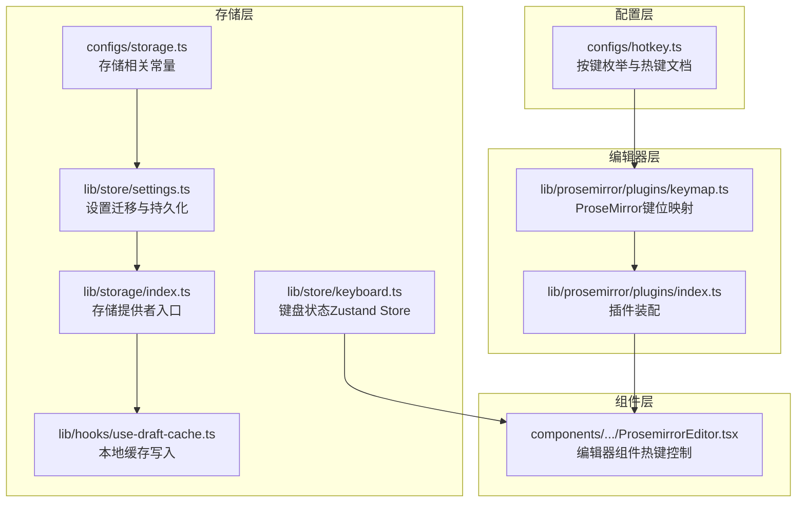
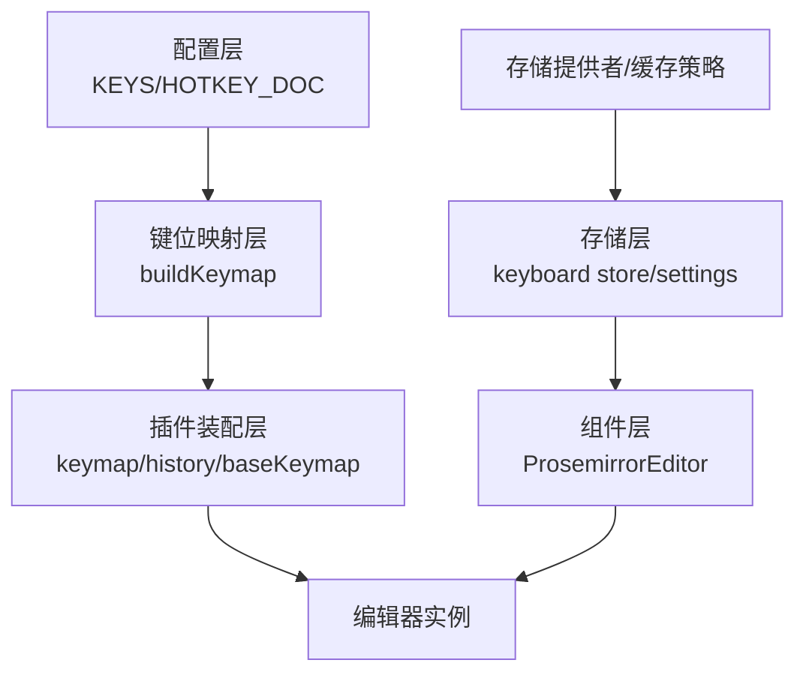
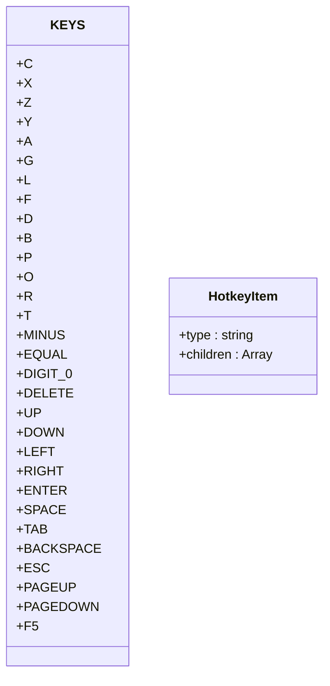
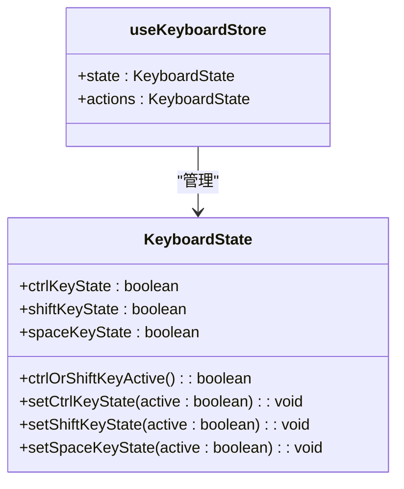
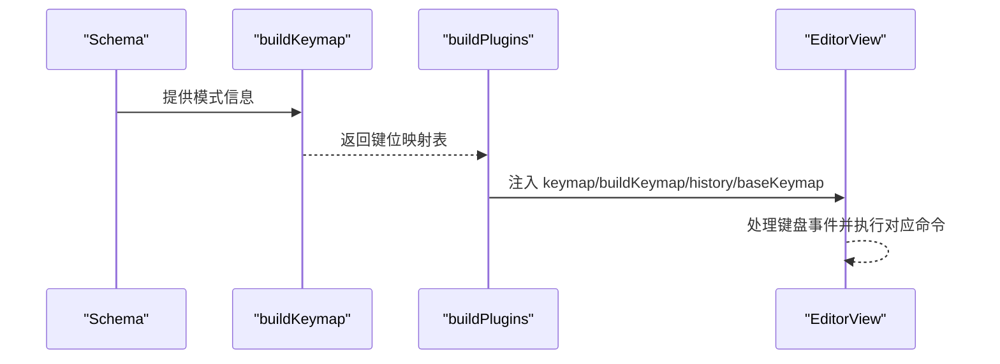
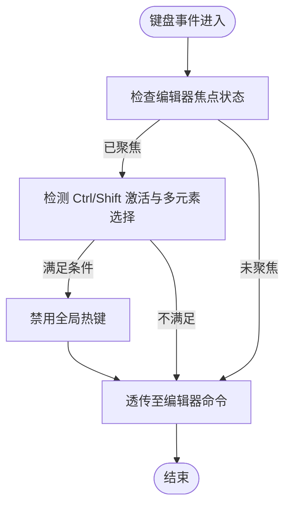
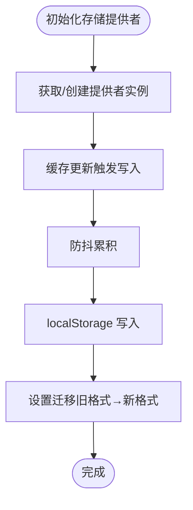
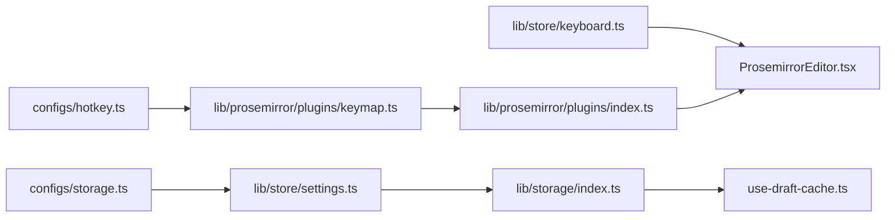

# 热键配置系统

<cite>
**本文档引用的文件**
- [configs/hotkey.ts](file://configs/hotkey.ts)
- [lib/store/keyboard.ts](file://lib/store/keyboard.ts)
- [lib/prosemirror/plugins/keymap.ts](file://lib/prosemirror/plugins/keymap.ts)
- [lib/prosemirror/plugins/index.ts](file://lib/prosemirror/plugins/index.ts)
- [components/slide-renderer/components/element/ProsemirrorEditor.tsx](file://components/slide-renderer/components/element/ProsemirrorEditor.tsx)
- [lib/storage/index.ts](file://lib/storage/index.ts)
- [configs/storage.ts](file://configs/storage.ts)
- [lib/hooks/use-draft-cache.ts](file://lib/hooks/use-draft-cache.ts)
- [lib/store/settings.ts](file://lib/store/settings.ts)
</cite>

## 目录
1. [简介](#简介)
2. [项目结构](#项目结构)
3. [核心组件](#核心组件)
4. [架构总览](#架构总览)
5. [详细组件分析](#详细组件分析)
6. [依赖关系分析](#依赖关系分析)
7. [性能考虑](#性能考虑)
8. [故障排除指南](#故障排除指南)
9. [结论](#结论)
10. [附录](#附录)

## 简介
本文件面向热键配置系统的技术文档，围绕快捷键绑定、组合键处理与冲突检测机制进行深入解析。系统通过统一的按键枚举、ProseMirror 键位映射、键盘状态存储以及可扩展的插件体系，实现跨组件的热键一致性与可维护性。同时，文档覆盖热键注册与注销流程、监听器生命周期管理、扩展与第三方插件集成方式、本地存储与同步机制，以及调试与故障排除建议。

## 项目结构
热键配置系统主要分布在以下模块：
- 配置层：集中定义按键常量与热键文档分类
- 存储层：键盘状态持久化与设置迁移
- 编辑器层：基于 ProseMirror 的键位映射与插件装配
- 组件层：编辑器组件对热键行为的控制与禁用策略
- 存储与同步：本地存储提供者与缓存写入策略

**图示来源**
- [configs/hotkey.ts:1-148](file://configs/hotkey.ts#L1-L148)
- [lib/store/keyboard.ts:1-34](file://lib/store/keyboard.ts#L1-L34)
- [lib/prosemirror/plugins/keymap.ts:1-51](file://lib/prosemirror/plugins/keymap.ts#L1-L51)
- [lib/prosemirror/plugins/index.ts:1-31](file://lib/prosemirror/plugins/index.ts#L1-L31)
- [components/slide-renderer/components/element/ProsemirrorEditor.tsx:104-144](file://components/slide-renderer/components/element/ProsemirrorEditor.tsx#L104-L144)
- [lib/storage/index.ts:1-13](file://lib/storage/index.ts#L1-L13)
- [configs/storage.ts:1-1](file://configs/storage.ts#L1-L1)
- [lib/hooks/use-draft-cache.ts:55-95](file://lib/hooks/use-draft-cache.ts#L55-L95)
- [lib/store/settings.ts:339-379](file://lib/store/settings.ts#L339-L379)

**章节来源**
- [configs/hotkey.ts:1-148](file://configs/hotkey.ts#L1-L148)
- [lib/store/keyboard.ts:1-34](file://lib/store/keyboard.ts#L1-L34)
- [lib/prosemirror/plugins/keymap.ts:1-51](file://lib/prosemirror/plugins/keymap.ts#L1-L51)
- [lib/prosemirror/plugins/index.ts:1-31](file://lib/prosemirror/plugins/index.ts#L1-L31)
- [components/slide-renderer/components/element/ProsemirrorEditor.tsx:104-144](file://components/slide-renderer/components/element/ProsemirrorEditor.tsx#L104-L144)
- [lib/storage/index.ts:1-13](file://lib/storage/index.ts#L1-L13)
- [configs/storage.ts:1-1](file://configs/storage.ts#L1-L1)
- [lib/hooks/use-draft-cache.ts:55-95](file://lib/hooks/use-draft-cache.ts#L55-L95)
- [lib/store/settings.ts:339-379](file://lib/store/settings.ts#L339-L379)

## 核心组件
- 按键枚举与热键文档：集中定义可用按键常量与各功能模块的热键说明，便于统一管理和展示。
- 键盘状态存储：使用 Zustand 管理 Ctrl/Shift/Space 状态，提供 getter 判断组合键激活状态。
- ProseMirror 键位映射：构建键位到命令的映射表，支持 Mod 组合键与常用编辑操作。
- 插件装配：将键位映射、基础键位、历史记录等插件注入编辑器。
- 编辑器组件热键控制：在特定场景（如富文本编辑）动态启用/禁用全局热键，避免与输入法或选择状态冲突。
- 存储与同步：提供存储提供者接口、本地缓存写入与设置迁移逻辑。

**章节来源**
- [configs/hotkey.ts:1-148](file://configs/hotkey.ts#L1-L148)
- [lib/store/keyboard.ts:1-34](file://lib/store/keyboard.ts#L1-L34)
- [lib/prosemirror/plugins/keymap.ts:1-51](file://lib/prosemirror/plugins/keymap.ts#L1-L51)
- [lib/prosemirror/plugins/index.ts:1-31](file://lib/prosemirror/plugins/index.ts#L1-L31)
- [components/slide-renderer/components/element/ProsemirrorEditor.tsx:104-144](file://components/slide-renderer/components/element/ProsemirrorEditor.tsx#L104-L144)
- [lib/storage/index.ts:1-13](file://lib/storage/index.ts#L1-L13)
- [configs/storage.ts:1-1](file://configs/storage.ts#L1-L1)
- [lib/hooks/use-draft-cache.ts:55-95](file://lib/hooks/use-draft-cache.ts#L55-L95)
- [lib/store/settings.ts:339-379](file://lib/store/settings.ts#L339-L379)

## 架构总览
系统采用“配置-存储-编辑器-组件-存储提供者”的分层架构：
- 配置层提供统一的按键与热键文档；
- 存储层负责键盘状态与设置持久化；
- 编辑器层通过插件装配实现键位映射；
- 组件层根据上下文动态控制热键行为；
- 存储提供者与缓存策略保障本地与云端同步能力。

**图示来源**
- [configs/hotkey.ts:1-148](file://configs/hotkey.ts#L1-L148)
- [lib/prosemirror/plugins/keymap.ts:1-51](file://lib/prosemirror/plugins/keymap.ts#L1-L51)
- [lib/prosemirror/plugins/index.ts:1-31](file://lib/prosemirror/plugins/index.ts#L1-L31)
- [lib/store/keyboard.ts:1-34](file://lib/store/keyboard.ts#L1-L34)
- [lib/store/settings.ts:339-379](file://lib/store/settings.ts#L339-L379)
- [lib/storage/index.ts:1-13](file://lib/storage/index.ts#L1-L13)
- [lib/hooks/use-draft-cache.ts:55-95](file://lib/hooks/use-draft-cache.ts#L55-L95)
- [components/slide-renderer/components/element/ProsemirrorEditor.tsx:104-144](file://components/slide-renderer/components/element/ProsemirrorEditor.tsx#L104-L144)

## 详细组件分析

### 按键枚举与热键文档
- KEYS 枚举：定义常用字母、数字、符号、方向键、功能键等，作为统一的按键标识。
- HOTKEY_DOC：按功能模块组织热键说明，包含标签与值（如“Ctrl + X”），用于帮助界面展示与用户参考。

**图示来源**
- [configs/hotkey.ts:1-32](file://configs/hotkey.ts#L1-L32)
- [configs/hotkey.ts:34-40](file://configs/hotkey.ts#L34-L40)

**章节来源**
- [configs/hotkey.ts:1-148](file://configs/hotkey.ts#L1-L148)

### 键盘状态存储（Zustand）
- 数据结构：保存 Ctrl/Shift/Space 的布尔状态与组合键判断 getter。
- 行为：提供 setter 更新状态；getter 返回 Ctrl 或 Shift 是否任一激活。
- 用途：供编辑器组件在焦点/失焦时决定是否禁用全局热键。

**图示来源**
- [lib/store/keyboard.ts:3-15](file://lib/store/keyboard.ts#L3-L15)
- [lib/store/keyboard.ts:17-33](file://lib/store/keyboard.ts#L17-L33)

**章节来源**
- [lib/store/keyboard.ts:1-34](file://lib/store/keyboard.ts#L1-L34)

### ProseMirror 键位映射与插件装配
- 键位映射：将键字符串映射到具体命令，支持 Mod 组合键、撤销/重做、列表项升降级、换行与块拆分等。
- 插件装配：将自定义键位映射、基础键位、历史记录、光标与占位符等插件注入编辑器。

**图示来源**
- [lib/prosemirror/plugins/keymap.ts:18-50](file://lib/prosemirror/plugins/keymap.ts#L18-L50)
- [lib/prosemirror/plugins/index.ts:16-31](file://lib/prosemirror/plugins/index.ts#L16-L31)

**章节来源**
- [lib/prosemirror/plugins/keymap.ts:1-51](file://lib/prosemirror/plugins/keymap.ts#L1-L51)
- [lib/prosemirror/plugins/index.ts:1-31](file://lib/prosemirror/plugins/index.ts#L1-L31)

### 编辑器组件热键控制
- 焦点与失焦：在聚焦时根据 Ctrl/Shift 激活状态与多元素选择情况决定是否禁用全局热键；失焦时恢复。
- 键盘事件处理：在富文本编辑场景中，优先处理编辑器内部命令，避免与全局热键冲突。

**图示来源**
- [components/slide-renderer/components/element/ProsemirrorEditor.tsx:104-144](file://components/slide-renderer/components/element/ProsemirrorEditor.tsx#L104-L144)
- [lib/store/keyboard.ts:24-27](file://lib/store/keyboard.ts#L24-L27)

**章节来源**
- [components/slide-renderer/components/element/ProsemirrorEditor.tsx:104-144](file://components/slide-renderer/components/element/ProsemirrorEditor.tsx#L104-L144)
- [lib/store/keyboard.ts:1-34](file://lib/store/keyboard.ts#L1-L34)

### 存储提供者与缓存策略
- 存储提供者：统一的存储接口，初始默认提供空实现，便于扩展云端同步。
- 本地缓存写入：使用防抖策略批量写入 localStorage，减少写入频率与异常处理。
- 设置迁移：从旧格式迁移至新存储结构，兼容历史数据。

**图示来源**
- [lib/storage/index.ts:6-11](file://lib/storage/index.ts#L6-L11)
- [lib/hooks/use-draft-cache.ts:55-95](file://lib/hooks/use-draft-cache.ts#L55-L95)
- [lib/store/settings.ts:354-379](file://lib/store/settings.ts#L354-L379)
- [configs/storage.ts:1-1](file://configs/storage.ts#L1-L1)

**章节来源**
- [lib/storage/index.ts:1-13](file://lib/storage/index.ts#L1-L13)
- [lib/hooks/use-draft-cache.ts:55-95](file://lib/hooks/use-draft-cache.ts#L55-L95)
- [lib/store/settings.ts:339-379](file://lib/store/settings.ts#L339-L379)
- [configs/storage.ts:1-1](file://configs/storage.ts#L1-L1)

## 依赖关系分析
- 配置层依赖于编辑器层的键位映射，确保按键常量与命令映射一致。
- 存储层为组件层提供键盘状态，组件层再影响热键行为。
- 插件装配层将键位映射与历史记录等插件注入编辑器，形成完整的键盘交互链路。
- 存储提供者与缓存策略为系统提供持久化能力，支持设置迁移与云端同步扩展。

**图示来源**
- [configs/hotkey.ts:1-148](file://configs/hotkey.ts#L1-L148)
- [lib/prosemirror/plugins/keymap.ts:1-51](file://lib/prosemirror/plugins/keymap.ts#L1-L51)
- [lib/prosemirror/plugins/index.ts:1-31](file://lib/prosemirror/plugins/index.ts#L1-L31)
- [lib/store/keyboard.ts:1-34](file://lib/store/keyboard.ts#L1-L34)
- [components/slide-renderer/components/element/ProsemirrorEditor.tsx:104-144](file://components/slide-renderer/components/element/ProsemirrorEditor.tsx#L104-L144)
- [lib/storage/index.ts:1-13](file://lib/storage/index.ts#L1-L13)
- [lib/hooks/use-draft-cache.ts:55-95](file://lib/hooks/use-draft-cache.ts#L55-L95)
- [lib/store/settings.ts:339-379](file://lib/store/settings.ts#L339-L379)
- [configs/storage.ts:1-1](file://configs/storage.ts#L1-L1)

**章节来源**
- [configs/hotkey.ts:1-148](file://configs/hotkey.ts#L1-L148)
- [lib/prosemirror/plugins/keymap.ts:1-51](file://lib/prosemirror/plugins/keymap.ts#L1-L51)
- [lib/prosemirror/plugins/index.ts:1-31](file://lib/prosemirror/plugins/index.ts#L1-L31)
- [lib/store/keyboard.ts:1-34](file://lib/store/keyboard.ts#L1-L34)
- [components/slide-renderer/components/element/ProsemirrorEditor.tsx:104-144](file://components/slide-renderer/components/element/ProsemirrorEditor.tsx#L104-L144)
- [lib/storage/index.ts:1-13](file://lib/storage/index.ts#L1-L13)
- [lib/hooks/use-draft-cache.ts:55-95](file://lib/hooks/use-draft-cache.ts#L55-L95)
- [lib/store/settings.ts:339-379](file://lib/store/settings.ts#L339-L379)
- [configs/storage.ts:1-1](file://configs/storage.ts#L1-L1)

## 性能考虑
- 防抖写入：通过缓存钩子对本地存储写入进行防抖，降低频繁写入带来的性能开销与异常风险。
- 插件装配：仅注入必要插件，避免重复绑定与冲突，提升编辑器响应速度。
- 状态最小化：键盘状态仅包含关键布尔值与简单 getter，减少不必要的状态更新。
- 命令链复用：在键位映射中复用命令链，减少重复逻辑与内存占用。

[本节为通用性能建议，无需列出具体文件来源]

## 故障排除指南
- 热键无效或冲突
  - 检查编辑器焦点状态与 Ctrl/Shift 激活条件，确认是否被禁用。
  - 排查键位映射是否正确绑定到目标命令。
- 键盘状态异常
  - 确认键盘状态 store 的 setter 调用时机与参数。
- 本地存储写入失败
  - 检查缓存写入的防抖逻辑与异常捕获。
  - 确认存储提供者初始化与迁移流程是否正常。
- 设置迁移问题
  - 核对旧格式键名与新格式结构的映射关系，确保迁移函数正确执行。

**章节来源**
- [components/slide-renderer/components/element/ProsemirrorEditor.tsx:104-144](file://components/slide-renderer/components/element/ProsemirrorEditor.tsx#L104-L144)
- [lib/store/keyboard.ts:1-34](file://lib/store/keyboard.ts#L1-L34)
- [lib/prosemirror/plugins/keymap.ts:1-51](file://lib/prosemirror/plugins/keymap.ts#L1-L51)
- [lib/hooks/use-draft-cache.ts:55-95](file://lib/hooks/use-draft-cache.ts#L55-L95)
- [lib/store/settings.ts:354-379](file://lib/store/settings.ts#L354-L379)

## 结论
热键配置系统通过统一的按键枚举、健壮的键盘状态存储、可扩展的 ProseMirror 键位映射与插件体系，实现了跨组件的一致热键体验。配合本地存储与缓存策略，系统具备良好的可维护性与扩展性，能够支持未来第三方插件集成与云端同步需求。

[本节为总结性内容，无需列出具体文件来源]

## 附录

### 热键配置注册与注销流程
- 注册：在插件装配阶段将键位映射注入编辑器；在组件层面根据上下文动态启用/禁用全局热键。
- 注销：移除插件绑定与事件监听；在组件失焦时恢复默认热键行为。

**章节来源**
- [lib/prosemirror/plugins/index.ts:16-31](file://lib/prosemirror/plugins/index.ts#L16-L31)
- [components/slide-renderer/components/element/ProsemirrorEditor.tsx:104-144](file://components/slide-renderer/components/element/ProsemirrorEditor.tsx#L104-L144)

### 扩展与第三方插件集成
- 自定义热键绑定：在键位映射中新增键位到命令的绑定，确保与现有命令链兼容。
- 第三方插件：通过插件装配接口注入自定义插件，遵循现有键位命名规范以避免冲突。

**章节来源**
- [lib/prosemirror/plugins/keymap.ts:18-50](file://lib/prosemirror/plugins/keymap.ts#L18-L50)
- [lib/prosemirror/plugins/index.ts:16-31](file://lib/prosemirror/plugins/index.ts#L16-L31)

### 存储与同步机制
- 本地存储：使用缓存钩子与 localStorage 实现持久化，支持防抖写入与异常处理。
- 云端同步：通过存储提供者接口预留扩展点，可在初始化时替换为云端实现。

**章节来源**
- [lib/storage/index.ts:6-11](file://lib/storage/index.ts#L6-L11)
- [lib/hooks/use-draft-cache.ts:55-95](file://lib/hooks/use-draft-cache.ts#L55-L95)
- [lib/store/settings.ts:354-379](file://lib/store/settings.ts#L354-L379)