# 配置管理系统

<cite>
**本文档引用的文件**
- [configs/theme.ts](file://configs/theme.ts)
- [configs/font.ts](file://configs/font.ts)
- [configs/hotkey.ts](file://configs/hotkey.ts)
- [configs/animation.ts](file://configs/animation.ts)
- [configs/element.ts](file://configs/element.ts)
- [configs/storage.ts](file://configs/storage.ts)
- [configs/chart.ts](file://configs/chart.ts)
- [configs/latex.ts](file://configs/latex.ts)
- [lib/store/index.ts](file://lib/store/index.ts)
- [components/settings/index.tsx](file://components/settings/index.tsx)
- [components/settings/utils.ts](file://components/settings/utils.ts)
- [lib/server/provider-config.ts](file://lib/server/provider-config.ts)
- [lib/utils/model-config.ts](file://lib/utils/model-config.ts)
- [next.config.ts](file://next.config.ts)
</cite>

## 目录
1. [简介](#简介)
2. [项目结构](#项目结构)
3. [核心组件](#核心组件)
4. [架构总览](#架构总览)
5. [详细组件分析](#详细组件分析)
6. [依赖关系分析](#依赖关系分析)
7. [性能考量](#性能考量)
8. [故障排查指南](#故障排查指南)
9. [结论](#结论)
10. [附录](#附录)

## 简介
本文件系统性梳理 OpenMAIC 的配置管理体系，覆盖以下方面：
- 服务器配置与运行时配置的来源与优先级
- 主题配置（颜色、布局、样式）
- 字体配置（字体族、字号、国际化）
- 热键配置（绑定、冲突处理、自定义）
- 动画配置（过渡、缓动、性能优化）
- 元素配置（默认属性、样式规则、行为）
- 配置验证、默认值与迁移策略
- 配置扩展与最佳实践

## 项目结构
配置相关的核心位置集中在 configs 目录与设置面板组件中，同时通过全局状态 store 进行集中管理与联动。

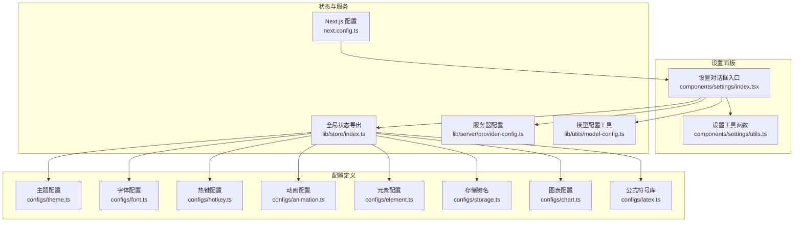

**图表来源**
- [configs/theme.ts:1-127](file://configs/theme.ts#L1-L127)
- [configs/font.ts:1-32](file://configs/font.ts#L1-L32)
- [configs/hotkey.ts:1-148](file://configs/hotkey.ts#L1-L148)
- [configs/animation.ts:1-235](file://configs/animation.ts#L1-L235)
- [configs/element.ts:1-23](file://configs/element.ts#L1-L23)
- [configs/storage.ts:1-2](file://configs/storage.ts#L1-L2)
- [configs/chart.ts:1-89](file://configs/chart.ts#L1-L89)
- [configs/latex.ts:1-275](file://configs/latex.ts#L1-L275)
- [lib/store/index.ts:1-19](file://lib/store/index.ts#L1-L19)
- [components/settings/index.tsx:1-1054](file://components/settings/index.tsx#L1-L1054)
- [components/settings/utils.ts:1-29](file://components/settings/utils.ts#L1-L29)
- [lib/server/provider-config.ts](file://lib/server/provider-config.ts)
- [lib/utils/model-config.ts](file://lib/utils/model-config.ts)
- [next.config.ts](file://next.config.ts)

**章节来源**
- [configs/theme.ts:1-127](file://configs/theme.ts#L1-L127)
- [configs/font.ts:1-32](file://configs/font.ts#L1-L32)
- [configs/hotkey.ts:1-148](file://configs/hotkey.ts#L1-L148)
- [configs/animation.ts:1-235](file://configs/animation.ts#L1-L235)
- [configs/element.ts:1-23](file://configs/element.ts#L1-L23)
- [configs/storage.ts:1-2](file://configs/storage.ts#L1-L2)
- [configs/chart.ts:1-89](file://configs/chart.ts#L1-L89)
- [configs/latex.ts:1-275](file://configs/latex.ts#L1-L275)
- [lib/store/index.ts:1-19](file://lib/store/index.ts#L1-L19)
- [components/settings/index.tsx:1-1054](file://components/settings/index.tsx#L1-L1054)
- [components/settings/utils.ts:1-29](file://components/settings/utils.ts#L1-L29)
- [lib/server/provider-config.ts](file://lib/server/provider-config.ts)
- [lib/utils/model-config.ts](file://lib/utils/model-config.ts)
- [next.config.ts](file://next.config.ts)

## 核心组件
- 主题配置：预设主题集合，包含背景、字体色、边框色、颜色集与元素轮廓/阴影等。
- 字体配置：中英文混排与多语言支持的字体族清单。
- 热键配置：按键枚举与功能分类的快捷键文档。
- 动画配置：入场/出场/注意力动画、幻灯片切换模式及默认时长与触发方式。
- 元素配置：元素类型中文映射与最小尺寸约束。
- 图表配置：图表类型映射、默认数据模板与预设主题色板。
- 公式符号库：常用公式与符号分类，便于插入与编辑。
- 存储键名：本地持久化丢弃数据库标识键。
- 设置面板：统一的配置入口，负责提供者、媒体、语音、PDF、网络搜索等模块的配置界面与交互。
- 全局状态：集中导出画布、舞台、键盘、快照与设置等 store，供设置面板使用。
- 服务器配置与模型配置：提供者配置与模型能力管理，用于运行时生效。

**章节来源**
- [configs/theme.ts:3-127](file://configs/theme.ts#L3-L127)
- [configs/font.ts:1-32](file://configs/font.ts#L1-L32)
- [configs/hotkey.ts:1-148](file://configs/hotkey.ts#L1-L148)
- [configs/animation.ts:1-235](file://configs/animation.ts#L1-L235)
- [configs/element.ts:1-23](file://configs/element.ts#L1-L23)
- [configs/chart.ts:1-89](file://configs/chart.ts#L1-L89)
- [configs/latex.ts:1-275](file://configs/latex.ts#L1-L275)
- [configs/storage.ts:1-2](file://configs/storage.ts#L1-L2)
- [components/settings/index.tsx:1-1054](file://components/settings/index.tsx#L1-L1054)
- [lib/store/index.ts:1-19](file://lib/store/index.ts#L1-L19)
- [lib/server/provider-config.ts](file://lib/server/provider-config.ts)
- [lib/utils/model-config.ts](file://lib/utils/model-config.ts)

## 架构总览
配置系统采用“配置定义 + 设置面板 + 全局状态 + 服务器配置”的分层设计：
- 配置定义：以常量与枚举形式固化在 configs 目录，确保类型安全与可维护性。
- 设置面板：提供可视化界面，读取/写入全局状态，调用服务器配置接口进行持久化。
- 全局状态：集中管理用户偏好与运行时配置，驱动 UI 与业务逻辑。
- 服务器配置：在后端侧保存敏感或跨会话的配置，如 API Key、基础地址等。

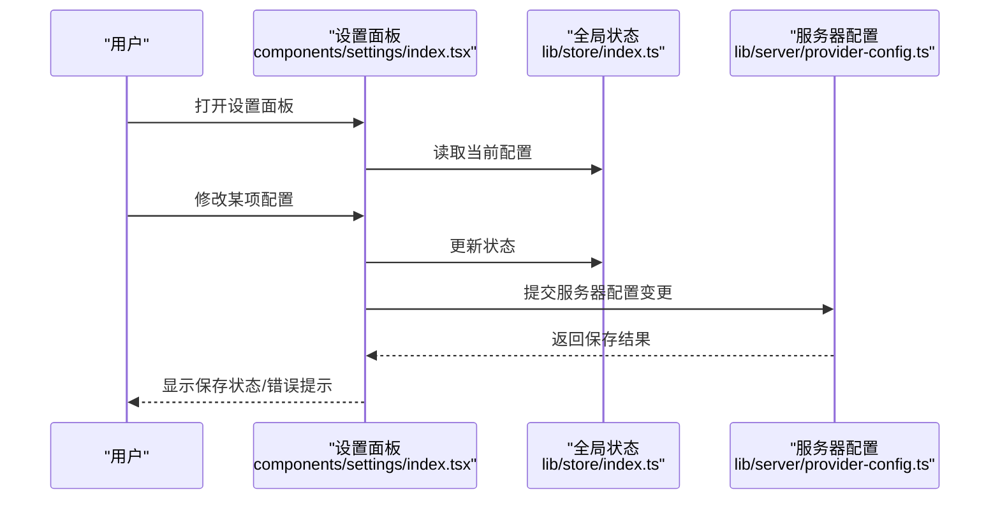

**图表来源**
- [components/settings/index.tsx:171-466](file://components/settings/index.tsx#L171-L466)
- [lib/store/index.ts:1-19](file://lib/store/index.ts#L1-L19)
- [lib/server/provider-config.ts](file://lib/server/provider-config.ts)

## 详细组件分析

### 主题配置系统
- 结构与职责
  - 预设主题数组包含背景、字体色、边框色、颜色集以及元素轮廓/阴影等字段。
  - 通过类型约束保证主题对象的一致性。
- 使用场景
  - 幻灯片编辑器的主题切换、元素默认配色与视觉风格。
- 设计要点
  - 多套主题适配不同场景（浅色/深色、品牌色系、对比度）。
  - 与元素轮廓/阴影配置配合，形成统一的视觉语言。

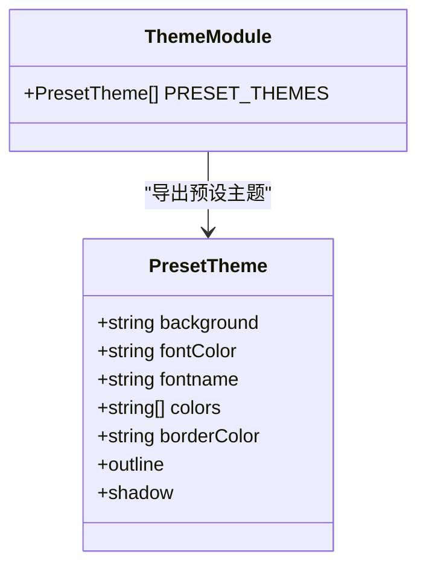

**图表来源**
- [configs/theme.ts:3-127](file://configs/theme.ts#L3-L127)

**章节来源**
- [configs/theme.ts:13-127](file://configs/theme.ts#L13-L127)

### 字体配置系统
- 结构与职责
  - 字体清单包含中英文字体族名称与对应值，支持中英混排与多语言显示。
- 国际化支持
  - 字体标签采用本地化文案，便于多语言部署。
- 使用场景
  - 文本元素渲染、公式与代码块的字体选择。

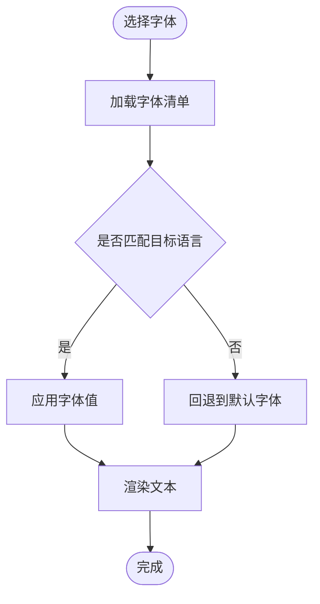

**图表来源**
- [configs/font.ts:1-32](file://configs/font.ts#L1-L32)

**章节来源**
- [configs/font.ts:1-32](file://configs/font.ts#L1-L32)

### 热键配置系统
- 结构与职责
  - 按键枚举定义基础键位；热键文档按功能分类列出快捷键组合。
- 冲突处理
  - 通过分类与组合键避免常见冲突；建议在自定义时遵循平台默认快捷键规范。
- 自定义配置
  - 可基于枚举扩展新的键位组合，但需注意浏览器/操作系统层面的限制与兼容性。

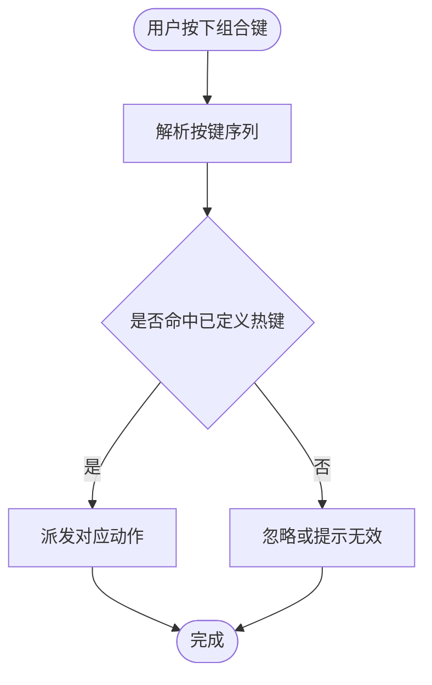

**图表来源**
- [configs/hotkey.ts:1-148](file://configs/hotkey.ts#L1-L148)

**章节来源**
- [configs/hotkey.ts:1-148](file://configs/hotkey.ts#L1-L148)

### 动画配置系统
- 结构与职责
  - 默认时长、默认触发方式、动画类前缀。
  - 分类组织入场/出场/注意力动画，以及幻灯片切换模式。
- 性能优化
  - 合理设置默认时长，避免过长导致卡顿。
  - 优先使用硬件加速的 transform/opacity 属性。
- 缓动函数
  - 可结合 CSS 动画曲线或第三方库（如 animate.css）实现多样化缓动。

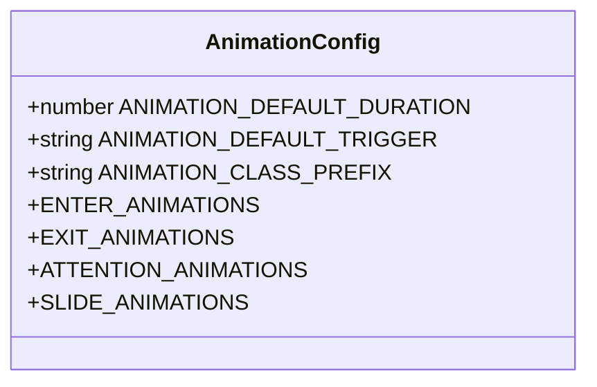

**图表来源**
- [configs/animation.ts:1-235](file://configs/animation.ts#L1-L235)

**章节来源**
- [configs/animation.ts:1-235](file://configs/animation.ts#L1-L235)

### 元素配置系统
- 结构与职责
  - 元素类型中文映射，便于 UI 展示。
  - 不同元素类型的最小尺寸约束，保障可用性与可编辑性。
- 行为设置
  - 与主题/动画配置协同，统一元素的默认外观与交互体验。

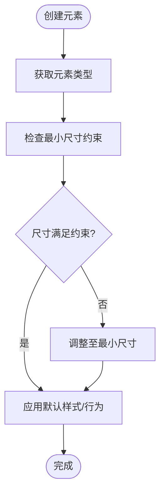

**图表来源**
- [configs/element.ts:1-23](file://configs/element.ts#L1-L23)

**章节来源**
- [configs/element.ts:1-23](file://configs/element.ts#L1-L23)

### 图表配置系统
- 结构与职责
  - 图表类型映射与默认数据模板，便于快速生成示例。
  - 多组预设主题色板，提升图表可读性与一致性。
- 使用场景
  - 数据可视化、教学演示、报告生成。

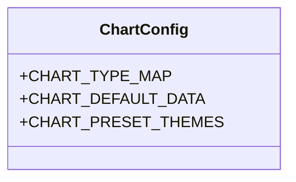

**图表来源**
- [configs/chart.ts:1-89](file://configs/chart.ts#L1-L89)

**章节来源**
- [configs/chart.ts:1-89](file://configs/chart.ts#L1-L89)

### 公式符号库
- 结构与职责
  - 常用公式列表与符号分类（运算符、组合、函数、希腊字母），便于插入与编辑。
- 使用场景
  - 数学/科学内容创作，LaTeX 渲染与公式编辑。

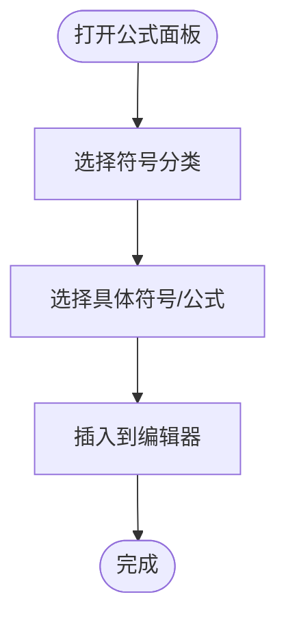

**图表来源**
- [configs/latex.ts:1-275](file://configs/latex.ts#L1-L275)

**章节来源**
- [configs/latex.ts:1-275](file://configs/latex.ts#L1-L275)

### 存储键名
- 用途
  - 标识本地持久化的丢弃数据库键，便于清理与迁移。
- 注意事项
  - 在版本升级或重置时，需谨慎处理该键，避免误删重要数据。

**章节来源**
- [configs/storage.ts:1-2](file://configs/storage.ts#L1-L2)

### 设置面板与全局状态
- 设置面板
  - 统一入口，支持提供者、图像、视频、TTS、ASR、PDF、网络搜索与通用设置。
  - 提供可调整的侧栏宽度、模型编辑、提供者增删改查等交互。
- 全局状态
  - 导出画布、舞台、键盘、快照与设置等 store，供设置面板读取与更新。

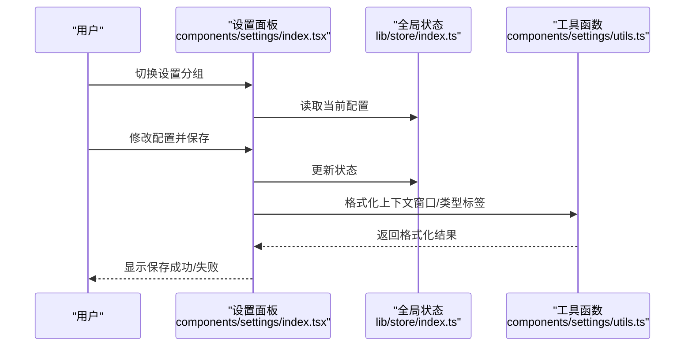

**图表来源**
- [components/settings/index.tsx:1-1054](file://components/settings/index.tsx#L1-L1054)
- [lib/store/index.ts:1-19](file://lib/store/index.ts#L1-L19)
- [components/settings/utils.ts:1-29](file://components/settings/utils.ts#L1-L29)

**章节来源**
- [components/settings/index.tsx:1-1054](file://components/settings/index.tsx#L1-L1054)
- [lib/store/index.ts:1-19](file://lib/store/index.ts#L1-L19)
- [components/settings/utils.ts:1-29](file://components/settings/utils.ts#L1-L29)

### 服务器配置与模型配置
- 服务器配置
  - 负责保存敏感或需要跨会话持久化的配置（如 API Key、基础地址）。
- 模型配置
  - 管理模型能力（流式、工具、视觉等）与默认模型选择。
- 与设置面板协作
  - 设置面板通过状态更新与服务器配置接口进行双向同步。

**章节来源**
- [lib/server/provider-config.ts](file://lib/server/provider-config.ts)
- [lib/utils/model-config.ts](file://lib/utils/model-config.ts)

## 依赖关系分析
- 配置定义与设置面板
  - 设置面板直接依赖配置定义文件中的枚举与常量，确保 UI 与逻辑一致。
- 全局状态与设置面板
  - 设置面板通过全局状态读取/写入配置，保持组件间解耦。
- 服务器配置与设置面板
  - 设置面板在保存时调用服务器配置接口，实现持久化。
- Next.js 配置
  - 影响构建与运行时环境，间接影响配置加载与打包策略。

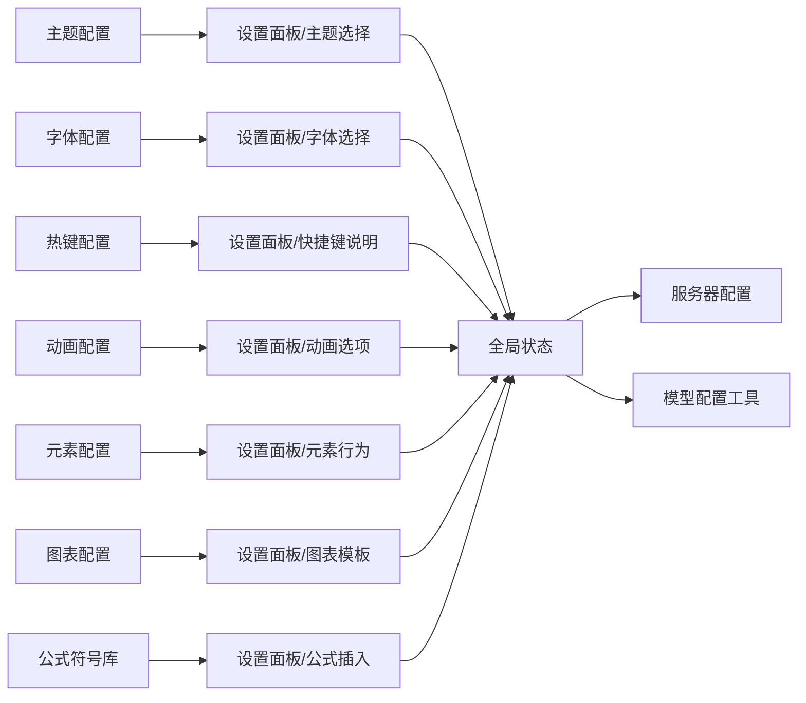

**图表来源**
- [configs/theme.ts:1-127](file://configs/theme.ts#L1-L127)
- [configs/font.ts:1-32](file://configs/font.ts#L1-L32)
- [configs/hotkey.ts:1-148](file://configs/hotkey.ts#L1-L148)
- [configs/animation.ts:1-235](file://configs/animation.ts#L1-L235)
- [configs/element.ts:1-23](file://configs/element.ts#L1-L23)
- [configs/chart.ts:1-89](file://configs/chart.ts#L1-L89)
- [configs/latex.ts:1-275](file://configs/latex.ts#L1-L275)
- [lib/store/index.ts:1-19](file://lib/store/index.ts#L1-L19)
- [components/settings/index.tsx:1-1054](file://components/settings/index.tsx#L1-L1054)
- [lib/server/provider-config.ts](file://lib/server/provider-config.ts)
- [lib/utils/model-config.ts](file://lib/utils/model-config.ts)

**章节来源**
- [lib/store/index.ts:1-19](file://lib/store/index.ts#L1-L19)
- [components/settings/index.tsx:1-1054](file://components/settings/index.tsx#L1-L1054)

## 性能考量
- 动画性能
  - 控制默认时长与触发频率，避免过多并发动画造成掉帧。
  - 优先使用 transform/opacity，减少重排与重绘。
- 字体加载
  - 合理选择字体族，避免超大字体包导致首屏加载缓慢。
- 设置面板交互
  - 对频繁变更的配置采用防抖/节流，减少不必要的状态更新与重渲染。

## 故障排查指南
- 设置保存失败
  - 检查服务器配置接口返回状态，确认 API Key、基础地址等必填项完整。
  - 查看设置面板保存状态提示，必要时重试或清空无效配置。
- 快捷键无效
  - 确认按键组合未被浏览器/操作系统占用；检查热键文档中是否存在冲突。
- 动画异常
  - 检查默认时长与触发方式是否合理；尝试禁用部分动画观察性能变化。
- 字体显示异常
  - 确认字体清单中存在对应值；检查本地字体资源加载情况。

**章节来源**
- [components/settings/index.tsx:282-306](file://components/settings/index.tsx#L282-L306)
- [configs/hotkey.ts:42-148](file://configs/hotkey.ts#L42-L148)
- [configs/animation.ts:3-6](file://configs/animation.ts#L3-L6)

## 结论
OpenMAIC 的配置管理系统以清晰的分层与模块化设计实现了对主题、字体、热键、动画、元素、图表与公式的统一管理。通过设置面板与全局状态的协同，配合服务器配置与模型配置工具，系统在易用性与可维护性之间取得了良好平衡。建议在扩展新配置项时遵循现有命名与结构规范，确保类型安全与一致性。

## 附录

### 配置验证与默认值处理
- 验证策略
  - 在设置面板保存前进行必填校验与格式校验；对提供者配置进行连通性测试。
- 默认值策略
  - 为可选配置提供明确默认值；对缺失配置自动回退到默认值并提示用户。

**章节来源**
- [components/settings/index.tsx:381-400](file://components/settings/index.tsx#L381-L400)
- [components/settings/utils.ts:1-29](file://components/settings/utils.ts#L1-L29)

### 配置迁移策略
- 版本升级
  - 在升级时对旧配置进行兼容性检查与转换；对废弃字段进行清理。
- 本地存储
  - 对本地持久化键进行版本标记，必要时执行迁移脚本。

**章节来源**
- [configs/storage.ts:1-2](file://configs/storage.ts#L1-L2)

### 配置扩展指南与最佳实践
- 扩展指南
  - 新增配置项时，先在 configs 中定义类型与默认值，再在设置面板中添加 UI。
  - 通过全局状态集中管理，避免分散更新导致的状态不一致。
- 最佳实践
  - 保持配置项粒度适中，避免过度碎片化。
  - 对敏感配置（如 API Key）仅在服务器侧持久化，前端仅做展示与校验。
  - 为高频变更的配置提供即时反馈与撤销机制。

**章节来源**
- [lib/store/index.ts:1-19](file://lib/store/index.ts#L1-L19)
- [components/settings/index.tsx:1-1054](file://components/settings/index.tsx#L1-L1054)