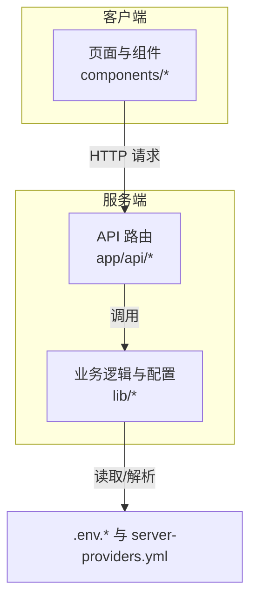
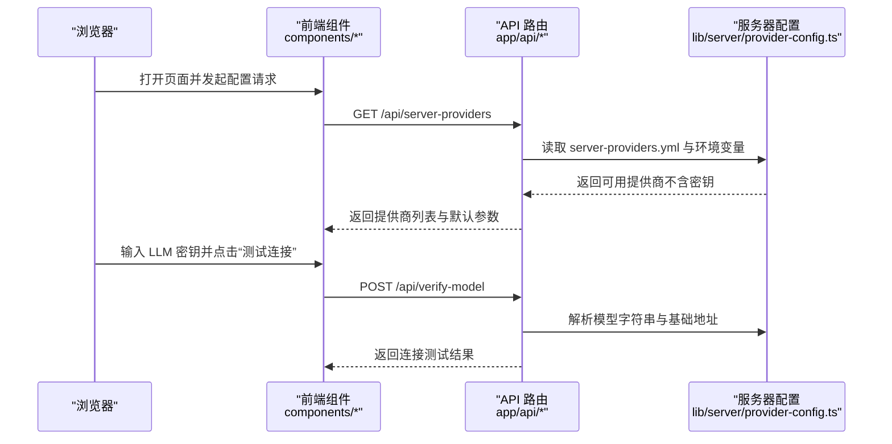
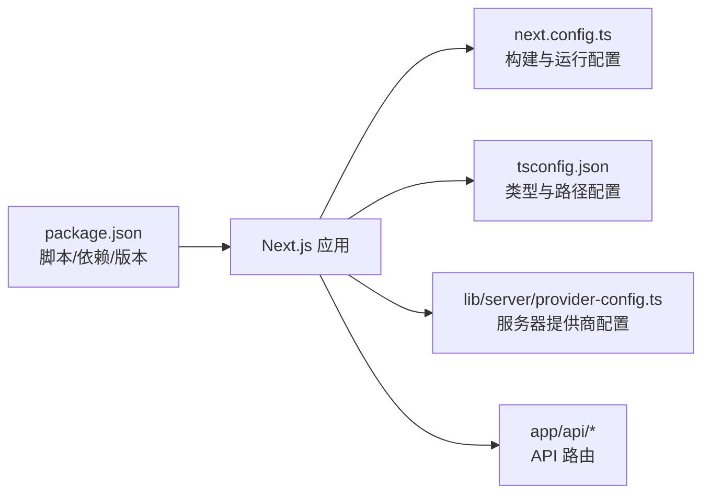

# 快速开始

<cite>
**本文引用的文件**
- [README.md](file://README.md)
- [package.json](file://package.json)
- [Dockerfile](file://Dockerfile)
- [docker-compose.yml](file://docker-compose.yml)
- [vercel.json](file://vercel.json)
- [next.config.ts](file://next.config.ts)
- [tsconfig.json](file://tsconfig.json)
- [app/api/health/route.ts](file://app/api/health/route.ts)
- [app/api/server-providers/route.ts](file://app/api/server-providers/route.ts)
- [app/api/verify-model/route.ts](file://app/api/verify-model/route.ts)
- [lib/server/provider-config.ts](file://lib/server/provider-config.ts)
- [components/settings/provider-config-panel.tsx](file://components/settings/provider-config-panel.tsx)
</cite>

## 目录
1. [简介](#简介)
2. [项目结构](#项目结构)
3. [核心组件](#核心组件)
4. [架构总览](#架构总览)
5. [详细组件解析](#详细组件解析)
6. [依赖关系分析](#依赖关系分析)
7. [性能与资源建议](#性能与资源建议)
8. [故障排查指南](#故障排查指南)
9. [结论](#结论)
10. [附录](#附录)

## 简介
本指南面向首次使用 OpenMAIC 的用户，帮助你在约 15 分钟内完成从环境准备到本地运行的全流程。你将学到：
- 环境要求（Node.js >= 18、pnpm >= 10）
- 克隆与安装步骤
- 配置文件与环境变量设置（至少配置一个 LLM 提供商密钥）
- 多种运行方式：本地开发、生产构建、Vercel 部署、Docker 部署
- 可选服务（如 MinerU）的配置提示
- 常见问题排查与首次使用示例

## 项目结构
OpenMAIC 是基于 Next.js App Router 的前端应用，后端 API 路由集中在 app/api 下，业务逻辑与配置在 lib/ 与 components/ 中实现。核心运行流程围绕“生成教室”展开：输入主题或材料 → 两阶段生成（大纲 → 场景内容）→ 多代理互动与播放。

图表来源
- [next.config.ts:1-13](file://next.config.ts#L1-L13)
- [app/api/health/route.ts:1-8](file://app/api/health/route.ts#L1-L8)
- [lib/server/provider-config.ts:1-398](file://lib/server/provider-config.ts#L1-L398)

章节来源
- [README.md:372-426](file://README.md#L372-L426)
- [next.config.ts:1-13](file://next.config.ts#L1-L13)

## 核心组件
- 环境与包管理：Node.js 与 pnpm 版本要求明确；脚本与依赖在 package.json 中定义。
- 运行与打包：本地开发、构建与启动命令在 package.json 中提供；Next.js 配置在 next.config.ts 中。
- 服务器提供商配置：支持通过 server-providers.yml 与环境变量进行配置，且密钥不暴露给客户端。
- 健康检查与模型校验：健康检查路由用于确认服务可用；模型校验路由用于测试提供商连通性。

章节来源
- [package.json:6-14](file://package.json#L6-L14)
- [package.json:15-94](file://package.json#L15-L94)
- [next.config.ts:1-13](file://next.config.ts#L1-L13)
- [lib/server/provider-config.ts:1-398](file://lib/server/provider-config.ts#L1-L398)
- [app/api/health/route.ts:1-8](file://app/api/health/route.ts#L1-L8)
- [app/api/verify-model/route.ts:1-69](file://app/api/verify-model/route.ts#L1-L69)

## 架构总览
下图展示了从浏览器到服务端 API 的关键交互路径，以及服务器提供商配置如何影响请求解析。

图表来源
- [app/api/server-providers/route.ts:1-35](file://app/api/server-providers/route.ts#L1-L35)
- [lib/server/provider-config.ts:1-398](file://lib/server/provider-config.ts#L1-L398)
- [app/api/verify-model/route.ts:1-69](file://app/api/verify-model/route.ts#L1-L69)

## 详细组件解析

### 环境要求与安装
- 环境要求
  - Node.js >= 18
  - pnpm >= 10
- 安装步骤
  - 克隆仓库并安装依赖
  - 复制示例环境文件为本地配置文件
  - 至少配置一个 LLM 提供商密钥（例如 OpenAI、Anthropic、Google 等）

章节来源
- [README.md:75-86](file://README.md#L75-L86)
- [README.md:88-100](file://README.md#L88-L100)

### 配置文件与环境变量
- 环境变量优先级
  - server-providers.yml 为主配置源，环境变量为回退与覆盖层
  - 密钥不会暴露给客户端，仅返回提供商 ID 与元数据
- 支持的提供商类别
  - LLM（OpenAI、Anthropic、Google Gemini、DeepSeek、Qwen、Kimi、Minimax、GLM、SiliconFlow、Doubao 等）
  - TTS/ASR/PDF/Image/Video/WebSearch 等
- 配置入口
  - 服务器提供商列表接口：GET /api/server-providers
  - 模型连通性测试接口：POST /api/verify-model

章节来源
- [lib/server/provider-config.ts:1-398](file://lib/server/provider-config.ts#L1-L398)
- [app/api/server-providers/route.ts:1-35](file://app/api/server-providers/route.ts#L1-L35)
- [app/api/verify-model/route.ts:1-69](file://app/api/verify-model/route.ts#L1-L69)
- [components/settings/provider-config-panel.tsx:1-403](file://components/settings/provider-config-panel.tsx#L1-L403)

### 运行方式
- 本地开发
  - 使用 pnpm dev 启动 Next.js 开发服务器，默认访问 http://localhost:3000
- 生产构建
  - pnpm build 生成静态产物，随后 pnpm start 启动生产服务
- Vercel 部署
  - 支持一键部署按钮；或手动导入仓库并在平台设置环境变量（至少一个 LLM 密钥）
- Docker 部署
  - 使用 docker-compose 构建镜像并运行容器，映射 3000 端口，挂载 .env.local 与可选 server-providers.yml

章节来源
- [README.md:118-131](file://README.md#L118-L131)
- [README.md:132-142](file://README.md#L132-L142)
- [README.md:143-149](file://README.md#L143-L149)
- [Dockerfile:1-52](file://Dockerfile#L1-L52)
- [docker-compose.yml:1-16](file://docker-compose.yml#L1-L16)
- [vercel.json:1-15](file://vercel.json#L1-L15)

### 可选服务配置
- MinerU（高级文档解析）
  - 可使用官方 API 或自托管实例
  - 在 .env.local 中设置 PDF_MINERU_BASE_URL（必要时设置 PDF_MINERU_API_KEY）

章节来源
- [README.md:151-156](file://README.md#L151-L156)

### 首次使用示例
- 步骤
  - 在设置面板中添加至少一个 LLM 提供商，并填写密钥
  - 点击“测试连接”，验证连通性
  - 在首页输入学习主题或上传材料，触发两阶段生成流程
  - 查看生成的课堂内容（幻灯片、测验、互动模拟、PBL 等）
- 预期效果
  - 页面显示健康状态与版本信息（健康检查）
  - 成功生成的课堂可播放，支持多代理互动与白板演示

章节来源
- [components/settings/provider-config-panel.tsx:110-150](file://components/settings/provider-config-panel.tsx#L110-L150)
- [app/api/health/route.ts:1-8](file://app/api/health/route.ts#L1-L8)
- [README.md:163-171](file://README.md#L163-L171)

## 依赖关系分析
- 包管理器与版本
  - package.json 明确声明 pnpm 版本要求与脚本命令
- 依赖与功能模块
  - Next.js 16、React 19、TypeScript、Tailwind CSS、LangGraph 等
  - AI SDK、CopilotKit、ProseMirror、Zustand 等
- 构建与运行
  - next.config.ts 控制输出模式、打包策略与客户端最大请求体大小
  - tsconfig.json 统一编译选项与路径别名

图表来源
- [package.json:15-94](file://package.json#L15-L94)
- [package.json:116-123](file://package.json#L116-L123)
- [next.config.ts:1-13](file://next.config.ts#L1-L13)
- [tsconfig.json:1-35](file://tsconfig.json#L1-L35)
- [lib/server/provider-config.ts:1-398](file://lib/server/provider-config.ts#L1-L398)

章节来源
- [package.json:15-94](file://package.json#L15-L94)
- [package.json:116-123](file://package.json#L116-L123)
- [next.config.ts:1-13](file://next.config.ts#L1-L13)
- [tsconfig.json:1-35](file://tsconfig.json#L1-L35)

## 性能与资源建议
- 本地开发
  - 使用 pnpm dev 以获得更快的安装与热重载体验
- 生产部署
  - pnpm build 生成静态产物，减少运行时编译开销
- Docker
  - 使用多阶段构建，精简运行时镜像体积，预装 Cairo/Pango/JPEG/GIF/SVG 依赖以支持图像处理
- Vercel
  - vercel.json 已配置安装与构建命令，函数最大执行时间与请求体大小已优化

章节来源
- [Dockerfile:10-28](file://Dockerfile#L10-L28)
- [Dockerfile:30-52](file://Dockerfile#L30-L52)
- [vercel.json:1-15](file://vercel.json#L1-L15)
- [next.config.ts:7-10](file://next.config.ts#L7-L10)

## 故障排查指南
- 环境版本不满足
  - 症状：安装失败或运行时报错
  - 处理：升级 Node.js 至 >= 18，pnpm 至 >= 10
- 未配置 LLM 密钥
  - 症状：模型校验失败或生成异常
  - 处理：在 .env.local 中至少配置一个提供商密钥；或通过 server-providers.yml 与环境变量进行配置
- 网络连接问题
  - 症状：连接超时、无法解析主机名、连接被拒绝
  - 处理：检查 Base URL 与网络连通性；必要时配置代理
- Vercel 部署失败
  - 症状：安装或构建阶段报错
  - 处理：确保已在平台设置至少一个 LLM 密钥；检查 vercel.json 的安装与构建命令
- Docker 启动失败
  - 症状：容器启动后立即退出或端口占用
  - 处理：确认 .env.local 已正确挂载；检查端口映射与卷挂载；必要时启用 server-providers.yml 挂载

章节来源
- [README.md:75-86](file://README.md#L75-L86)
- [README.md:88-100](file://README.md#L88-L100)
- [app/api/verify-model/route.ts:45-67](file://app/api/verify-model/route.ts#L45-L67)
- [vercel.json:1-15](file://vercel.json#L1-L15)
- [docker-compose.yml:1-16](file://docker-compose.yml#L1-L16)

## 结论
按照本指南，你可以在 15 分钟内完成 OpenMAIC 的环境准备、安装与首次运行。建议先在本地开发模式验证模型连通性，再根据需要选择 Vercel 或 Docker 进行部署。若遇到问题，请参考故障排查章节中的常见场景与解决方法。

## 附录

### 快速命令清单
- 克隆与安装
  - git clone 仓库地址
  - cd OpenMAIC && pnpm install
- 配置
  - cp .env.example .env.local
  - 在 .env.local 中填写至少一个 LLM 提供商密钥
- 本地运行
  - pnpm dev
  - 访问 http://localhost:3000
- 生产构建
  - pnpm build && pnpm start
- Vercel 部署
  - 使用一键部署按钮或手动导入仓库并在平台设置环境变量
- Docker 部署
  - cp .env.example .env.local
  - docker compose up --build

章节来源
- [README.md:80-149](file://README.md#L80-L149)