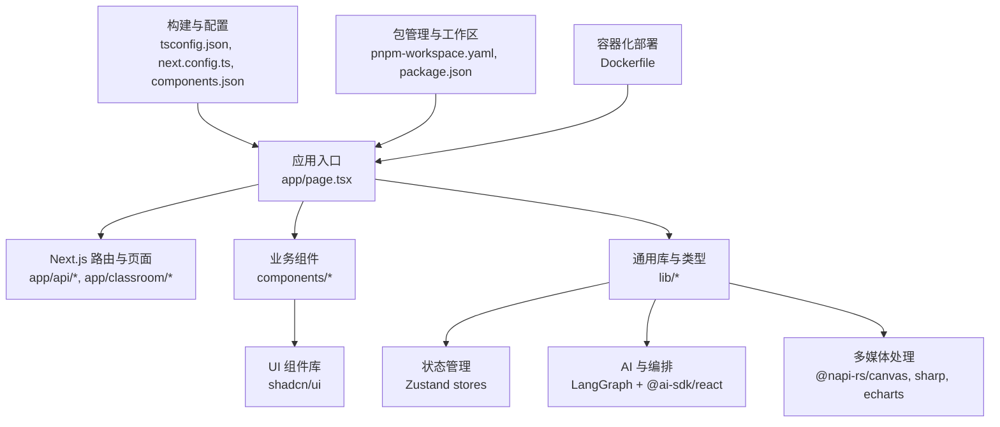
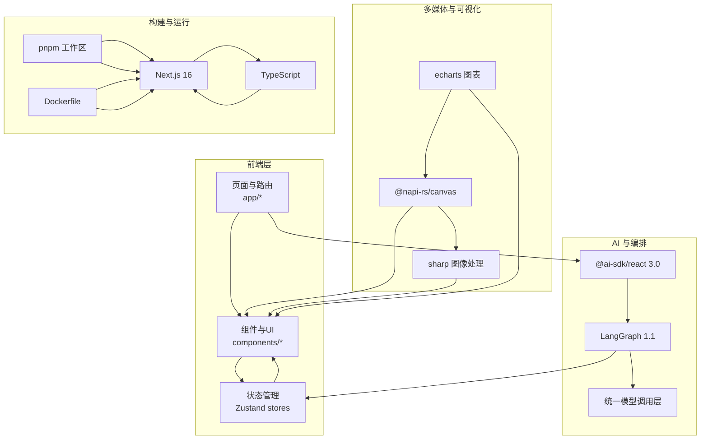
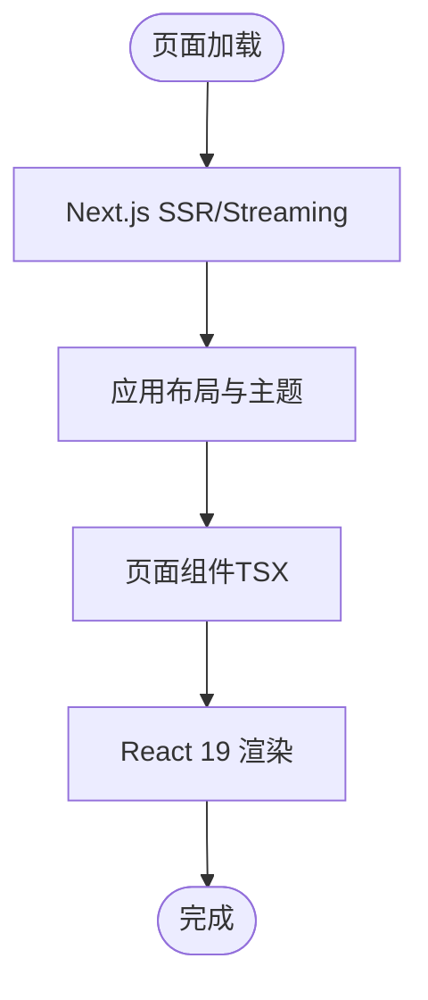
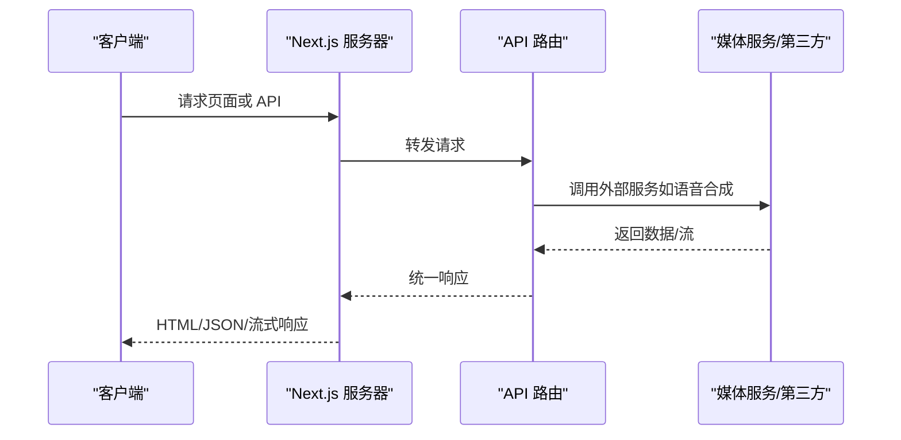
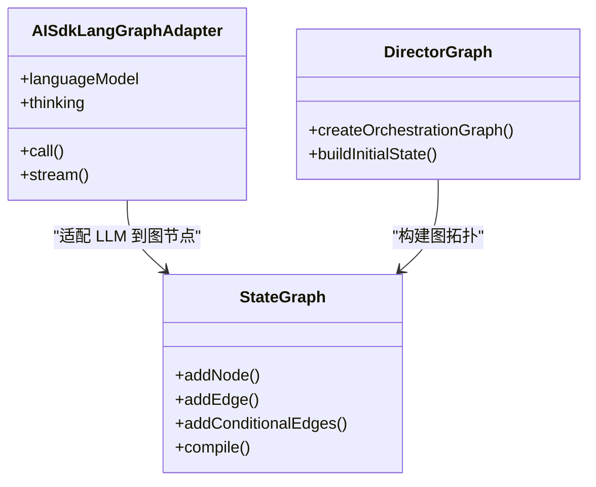
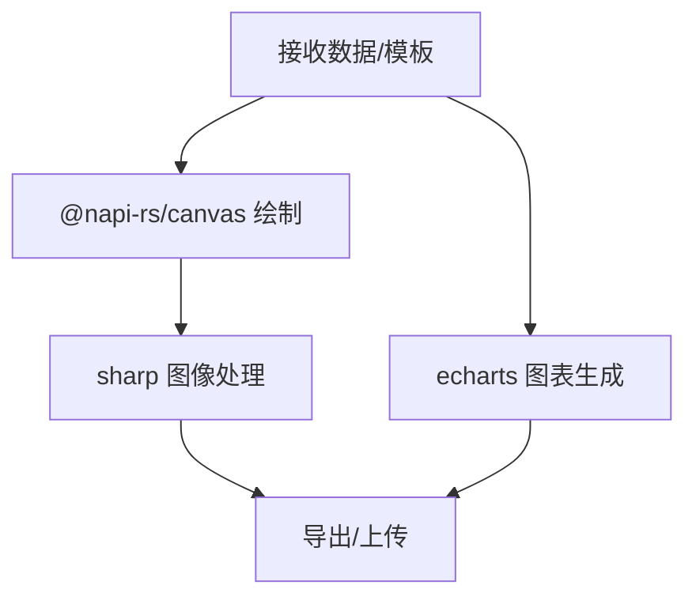
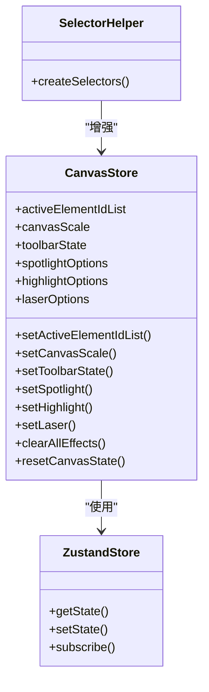
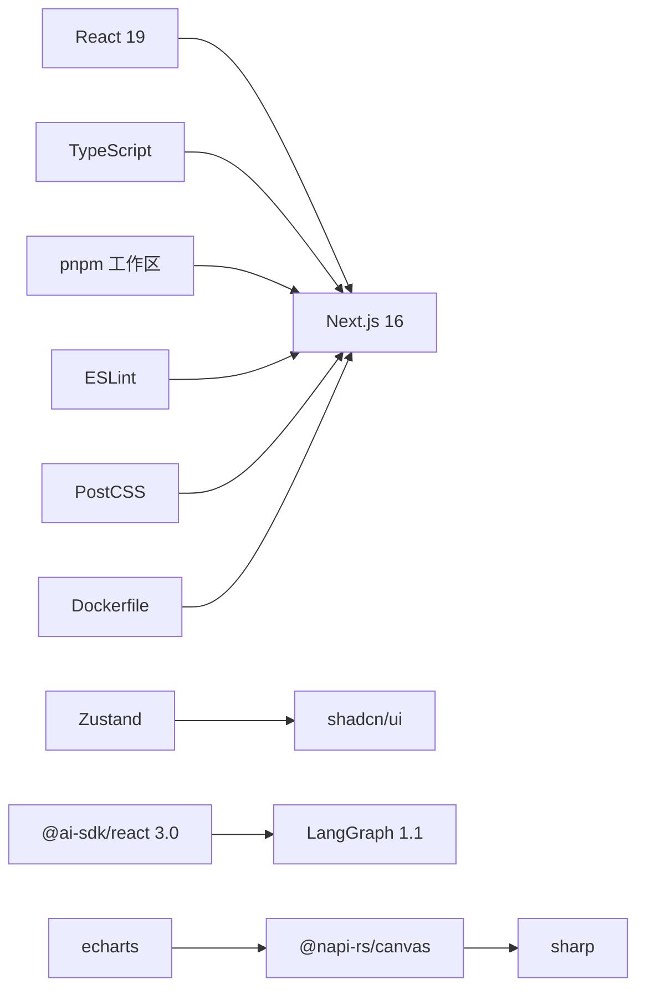

# 技术栈

<cite>
**本文引用的文件**
- [package.json](file://package.json)
- [next.config.ts](file://next.config.ts)
- [tsconfig.json](file://tsconfig.json)
- [components.json](file://components.json)
- [pnpm-workspace.yaml](file://pnpm-workspace.yaml)
- [eslint.config.mjs](file://eslint.config.mjs)
- [postcss.config.mjs](file://postcss.config.mjs)
- [Dockerfile](file://Dockerfile)
- [lib/store/canvas.ts](file://lib/store/canvas.ts)
- [lib/store/index.ts](file://lib/store/index.ts)
- [lib/orchestration/ai-sdk-adapter.ts](file://lib/orchestration/ai-sdk-adapter.ts)
- [lib/orchestration/director-graph.ts](file://lib/orchestration/director-graph.ts)
- [lib/utils/create-selectors.ts](file://lib/utils/create-selectors.ts)
- [components/slide-renderer/components/element/ChartElement/Chart.tsx](file://components/slide-renderer/components/element/ChartElement/Chart.tsx)
- [components/slide-renderer/components/element/ChartElement/chartOption.ts](file://components/slide-renderer/components/element/ChartElement/chartOption.ts)
- [configs/chart.ts](file://configs/chart.ts)
- [lib/api/stage-api-types.ts](file://lib/api/stage-api-types.ts)
</cite>

## 目录
1. [引言](#引言)
2. [项目结构](#项目结构)
3. [核心组件](#核心组件)
4. [架构总览](#架构总览)
5. [详细组件分析](#详细组件分析)
6. [依赖关系分析](#依赖关系分析)
7. [性能考量](#性能考量)
8. [故障排查指南](#故障排查指南)
9. [结论](#结论)
10. [附录](#附录)

## 引言
本文件系统性梳理 OpenMAIC 的技术栈与架构选择，覆盖前端技术栈（Next.js 16、React 19、TypeScript）、后端与运行时（Node.js、Next.js API Routes、服务器端渲染）、AI 框架集成（LangGraph 1.1、@ai-sdk/react 3.0）、多媒体处理（@napi-rs/canvas、sharp、echarts）、状态管理（Zustand）、UI 组件库（shadcn/ui）、构建与开发工具链（pnpm、rollup、ESLint、PostCSS），并解释技术选型的动机与替代方案。

## 项目结构
OpenMAIC 采用基于功能域的组织方式：页面路由位于 app/，业务组件在 components/，通用逻辑在 lib/，全局样式在 app/globals.css，配置集中在根目录的 tsconfig.json、next.config.ts、components.json 等。工作区通过 pnpm-workspace.yaml 管理 packages/ 子包（如数学公式与 PPT 导出相关包）。Dockerfile 定义了多阶段构建流程，包含 native 依赖安装以支持 sharp 与 @napi-rs/canvas。

图表来源
- [next.config.ts:1-13](file://next.config.ts#L1-L13)
- [tsconfig.json:1-35](file://tsconfig.json#L1-L35)
- [components.json:1-27](file://components.json#L1-L27)
- [pnpm-workspace.yaml:1-3](file://pnpm-workspace.yaml#L1-L3)
- [Dockerfile:1-51](file://Dockerfile#L1-L51)

章节来源
- [next.config.ts:1-13](file://next.config.ts#L1-L13)
- [tsconfig.json:1-35](file://tsconfig.json#L1-L35)
- [components.json:1-27](file://components.json#L1-L27)
- [pnpm-workspace.yaml:1-3](file://pnpm-workspace.yaml#L1-L3)
- [Dockerfile:1-51](file://Dockerfile#L1-L51)

## 核心组件
- 前端框架与类型
  - Next.js 16：提供 App Router、SSR、流式响应与 API Routes。
  - React 19：最新版本，配合 Suspense、并发特性提升交互体验。
  - TypeScript：严格模式、增量编译、路径别名，保障类型安全。
- 构建与开发工具
  - pnpm：工作区与锁定文件，忽略 sharp 等原生依赖的预构建。
  - ESLint（Next 规则集）：统一风格与最佳实践。
  - PostCSS（Tailwind 插件）：样式管线。
  - Rollup（开发期插件）：打包与类型生成。
- UI 组件库
  - shadcn/ui：Radix UI 风格，Tailwind 驱动，TSX 支持。
- 状态管理
  - Zustand：轻量、可组合的状态容器，提供 selector 封装。
- 多媒体与可视化
  - @napi-rs/canvas：高性能 Canvas 渲染，用于图片/图表绘制。
  - sharp：图像处理与格式转换。
  - echarts：演示文稿元素中的图表渲染。
- AI 与编排
  - @ai-sdk/react 3.0：统一的模型调用层，适配多家大模型提供商。
  - LangGraph 1.1：状态图编排，结合适配器实现 LLM 调用。

章节来源
- [package.json:15-94](file://package.json#L15-L94)
- [tsconfig.json:2-24](file://tsconfig.json#L2-L24)
- [components.json:1-27](file://components.json#L1-L27)
- [lib/store/canvas.ts:1-473](file://lib/store/canvas.ts#L1-L473)
- [lib/utils/create-selectors.ts:1-15](file://lib/utils/create-selectors.ts#L1-L15)
- [lib/orchestration/ai-sdk-adapter.ts:1-45](file://lib/orchestration/ai-sdk-adapter.ts#L1-L45)
- [lib/orchestration/director-graph.ts:474-519](file://lib/orchestration/director-graph.ts#L474-L519)

## 架构总览
OpenMAIC 的整体架构围绕“页面层（Next.js App Router）—组件层（React 19 + shadcn/ui）—状态层（Zustand）—AI 编排层（@ai-sdk/react + LangGraph）—多媒体层（@napi-rs/canvas + sharp + echarts）—构建与运行（pnpm + Next.js + Docker）”展开。数据流从页面触发，经组件与状态管理，进入 AI 编排与多媒体处理，最终返回到页面渲染。

图表来源
- [package.json:15-94](file://package.json#L15-L94)
- [next.config.ts:1-13](file://next.config.ts#L1-L13)
- [Dockerfile:1-51](file://Dockerfile#L1-L51)

## 详细组件分析

### 前端技术栈：Next.js 16、React 19、TypeScript
- Next.js 16
  - App Router：模块化页面与布局，支持嵌套路由与共享布局。
  - SSR/Streaming：服务端渲染与流式响应，优化首屏性能。
  - API Routes：在 app/api 下定义后端接口，统一处理请求与响应。
- React 19
  - 并发特性与 Suspense：提升复杂渲染场景的用户体验。
  - Hooks 与上下文：与 Zustand、自定义 hooks 协同。
- TypeScript
  - 严格模式、增量编译、路径别名（@/*），提升开发效率与可维护性。

图表来源
- [next.config.ts:1-13](file://next.config.ts#L1-L13)
- [tsconfig.json:2-24](file://tsconfig.json#L2-L24)

章节来源
- [next.config.ts:1-13](file://next.config.ts#L1-L13)
- [tsconfig.json:1-35](file://tsconfig.json#L1-L35)

### 后端架构：Node.js、Next.js API Routes、服务器端渲染
- 运行时
  - Node.js：容器镜像基于 node:22-alpine，生产环境以 standalone 形式运行。
- API Routes
  - 在 app/api 下集中管理，覆盖聊天、生成、转写、媒体代理、健康检查等。
  - 支持流式响应与大体积请求（proxyClientMaxBodySize）。
- 服务器端渲染
  - 通过 Next.js SSR 提升首屏性能与 SEO 友好度。

图表来源
- [next.config.ts:7-9](file://next.config.ts#L7-L9)
- [Dockerfile:30-51](file://Dockerfile#L30-L51)

章节来源
- [next.config.ts:1-13](file://next.config.ts#L1-L13)
- [Dockerfile:1-51](file://Dockerfile#L1-L51)

### AI 框架集成：LangGraph 1.1、@ai-sdk/react 3.0
- @ai-sdk/react 3.0
  - 提供统一的 callLLM/streamLLM 层，屏蔽不同提供商差异。
  - 与 Next.js 流式响应良好配合，支持 SSE。
- LangGraph 1.1
  - 使用 StateGraph 构建编排图，节点间条件边控制执行流程。
  - 通过适配器将 AI SDK 的 LanguageModel 注入 LangGraph，实现统一的 LLM 调用接口。

图表来源
- [lib/orchestration/ai-sdk-adapter.ts:1-45](file://lib/orchestration/ai-sdk-adapter.ts#L1-L45)
- [lib/orchestration/director-graph.ts:474-519](file://lib/orchestration/director-graph.ts#L474-L519)

章节来源
- [lib/orchestration/ai-sdk-adapter.ts:1-45](file://lib/orchestration/ai-sdk-adapter.ts#L1-L45)
- [lib/orchestration/director-graph.ts:474-519](file://lib/orchestration/director-graph.ts#L474-L519)

### 多媒体处理技术栈：@napi-rs/canvas、sharp、echarts
- @napi-rs/canvas
  - 原生绑定的高性能 Canvas 实现，用于绘制与导出。
  - Dockerfile 中显式安装 Cairo、Pango、JPEG、GIF、SVG 等依赖。
- sharp
  - 图像处理与格式转换，常用于缩略图、水印、裁剪等。
- echarts
  - 演示文稿元素中的图表渲染，支持 SVG 渲染器与主题色配置。

图表来源
- [Dockerfile:12-18](file://Dockerfile#L12-L18)
- [components/slide-renderer/components/element/ChartElement/Chart.tsx:87-99](file://components/slide-renderer/components/element/ChartElement/Chart.tsx#L87-L99)
- [configs/chart.ts:1-88](file://configs/chart.ts#L1-L88)

章节来源
- [Dockerfile:1-51](file://Dockerfile#L1-L51)
- [components/slide-renderer/components/element/ChartElement/Chart.tsx:47-99](file://components/slide-renderer/components/element/ChartElement/Chart.tsx#L47-L99)
- [components/slide-renderer/components/element/ChartElement/chartOption.ts:241-343](file://components/slide-renderer/components/element/ChartElement/chartOption.ts#L241-L343)
- [configs/chart.ts:1-88](file://configs/chart.ts#L1-L88)

### 状态管理：Zustand
- Zustand
  - 轻量、可组合的状态容器，适合复杂 UI 场景（画布、舞台、设置等）。
  - 提供 selector 封装，减少无关订阅导致的重渲染。
- Store 设计
  - 分层 store（canvas、stage、settings 等），通过统一导出聚合。
  - 提供批量重置与教学辅助效果（聚光灯、高亮、激光指针、缩放）。

图表来源
- [lib/store/canvas.ts:1-473](file://lib/store/canvas.ts#L1-L473)
- [lib/utils/create-selectors.ts:1-15](file://lib/utils/create-selectors.ts#L1-L15)
- [lib/store/index.ts:1-19](file://lib/store/index.ts#L1-L19)

章节来源
- [lib/store/canvas.ts:1-473](file://lib/store/canvas.ts#L1-L473)
- [lib/utils/create-selectors.ts:1-15](file://lib/utils/create-selectors.ts#L1-L15)
- [lib/store/index.ts:1-19](file://lib/store/index.ts#L1-L19)

### UI 组件库：shadcn/ui
- 配置
  - 组件别名与 Tailwind 集成，支持 Radix UI 风格与图标库。
  - RSC 与 TSX 开启，便于在 App Router 中使用。
- 与 Zustand 的协作
  - UI 组件通过 store 的 actions 与 selectors 更新状态，保持视图与状态解耦。

章节来源
- [components.json:1-27](file://components.json#L1-L27)

### 构建工具链：pnpm、rollup、ESLint、PostCSS
- pnpm
  - 工作区管理 packages/*，忽略 sharp 等原生依赖的预构建。
- rollup（开发期）
  - 类型生成与打包插件，配合 TypeScript 生态。
- ESLint
  - Next 官方规则集，自定义忽略与规则（如允许未使用下划线前缀变量）。
- PostCSS
  - Tailwind 插件驱动，简化样式管线。

章节来源
- [pnpm-workspace.yaml:1-3](file://pnpm-workspace.yaml#L1-L3)
- [package.json:95-115](file://package.json#L95-L115)
- [eslint.config.mjs:1-39](file://eslint.config.mjs#L1-L39)
- [postcss.config.mjs:1-8](file://postcss.config.mjs#L1-L8)

## 依赖关系分析
- 语言与运行时
  - React 19 与 Next.js 16 共同构成前端运行时基础。
  - TypeScript 提供类型安全保障。
- 状态与 UI
  - Zustand 作为状态中心，shadcn/ui 提供一致的 UI 基础设施。
- AI 与编排
  - @ai-sdk/react 3.0 作为统一调用层，LangGraph 1.1 负责状态图编排。
- 多媒体
  - @napi-rs/canvas 与 sharp 提供高性能图像处理能力；echarts 用于图表渲染。
- 构建与运行
  - pnpm 工作区、ESLint、PostCSS、Dockerfile 共同保证开发与部署一致性。

图表来源
- [package.json:15-94](file://package.json#L15-L94)
- [next.config.ts:1-13](file://next.config.ts#L1-L13)
- [Dockerfile:1-51](file://Dockerfile#L1-L51)

章节来源
- [package.json:15-94](file://package.json#L15-L94)
- [next.config.ts:1-13](file://next.config.ts#L1-L13)
- [Dockerfile:1-51](file://Dockerfile#L1-L51)

## 性能考量
- SSR 与流式响应：利用 Next.js 的 SSR 与流式响应降低首屏等待时间。
- 原生依赖与容器化：Dockerfile 显式安装 Cairo、Pango、JPEG、GIF、SVG 等依赖，确保 sharp 与 @napi-rs/canvas 正常运行。
- 状态粒度与选择器：Zustand 的 selector 封装减少不必要的重渲染，提高交互性能。
- 图表渲染：echarts 使用 SVG 渲染器，利于矢量缩放与导出质量。

## 故障排查指南
- 构建失败（sharp/@napi-rs/canvas）
  - 症状：安装阶段缺少 Cairo、Pango、JPEG、GIF、SVG 等系统依赖。
  - 处理：参考 Dockerfile 的依赖安装步骤，确保构建环境具备相应库。
- API 路由超时或内存占用过高
  - 症状：长文本/大文件处理导致超时。
  - 处理：合理拆分任务、启用流式响应、限制请求体大小。
- AI 调用异常
  - 症状：不同提供商返回格式不一致。
  - 处理：通过 @ai-sdk/react 的统一层进行适配与错误处理。
- 图表渲染问题
  - 症状：图表初始化或尺寸变化时渲染异常。
  - 处理：确认 echarts 初始化参数与 ResizeObserver 使用正确。

章节来源
- [Dockerfile:12-18](file://Dockerfile#L12-L18)
- [lib/orchestration/ai-sdk-adapter.ts:1-45](file://lib/orchestration/ai-sdk-adapter.ts#L1-L45)
- [components/slide-renderer/components/element/ChartElement/Chart.tsx:87-99](file://components/slide-renderer/components/element/ChartElement/Chart.tsx#L87-L99)

## 结论
OpenMAIC 的技术栈围绕“现代前端 + 统一 AI 调用 + 高性能多媒体 + 轻量状态管理 + 工程化工具链”展开。Next.js 16 与 React 19 提供优秀的开发与运行体验；@ai-sdk/react 3.0 与 LangGraph 1.1 实现灵活的 AI 编排；@napi-rs/canvas、sharp、echarts 覆盖多样的多媒体需求；Zustand 与 shadcn/ui 保证状态与 UI 的简洁与可维护性。该组合兼顾易用性、扩展性与性能，适合构建复杂的 AI 驱动教学与演示平台。

## 附录
- 关键配置要点
  - next.config.ts：输出模式、包转译、代理体大小。
  - tsconfig.json：严格模式、增量编译、路径别名。
  - components.json：shadcn/ui 集成与别名映射。
  - pnpm-workspace.yaml：工作区与子包管理。
  - eslint.config.mjs：规则集与自定义规则。
  - postcss.config.mjs：Tailwind 插件。
  - Dockerfile：多阶段构建与原生依赖安装。

章节来源
- [next.config.ts:1-13](file://next.config.ts#L1-L13)
- [tsconfig.json:1-35](file://tsconfig.json#L1-L35)
- [components.json:1-27](file://components.json#L1-L27)
- [pnpm-workspace.yaml:1-3](file://pnpm-workspace.yaml#L1-L3)
- [eslint.config.mjs:1-39](file://eslint.config.mjs#L1-L39)
- [postcss.config.mjs:1-8](file://postcss.config.mjs#L1-L8)
- [Dockerfile:1-51](file://Dockerfile#L1-L51)