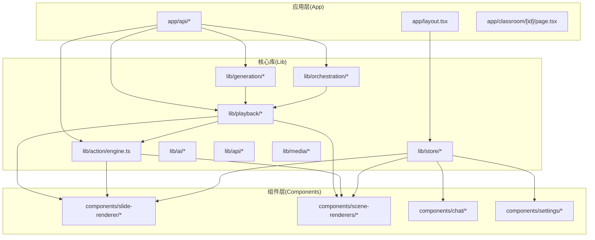
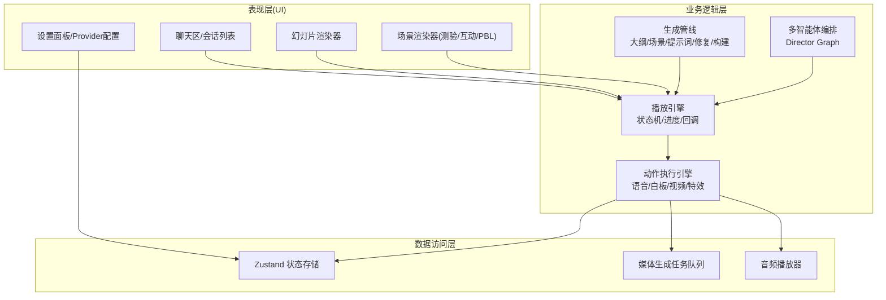
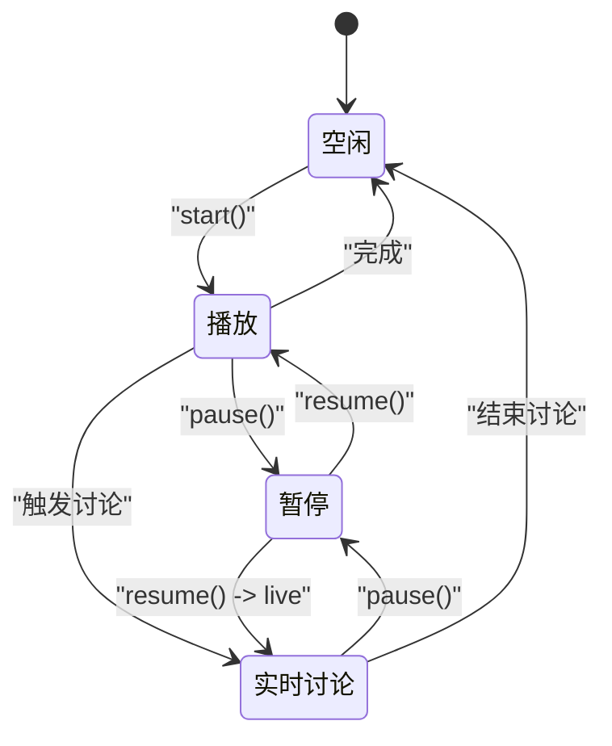
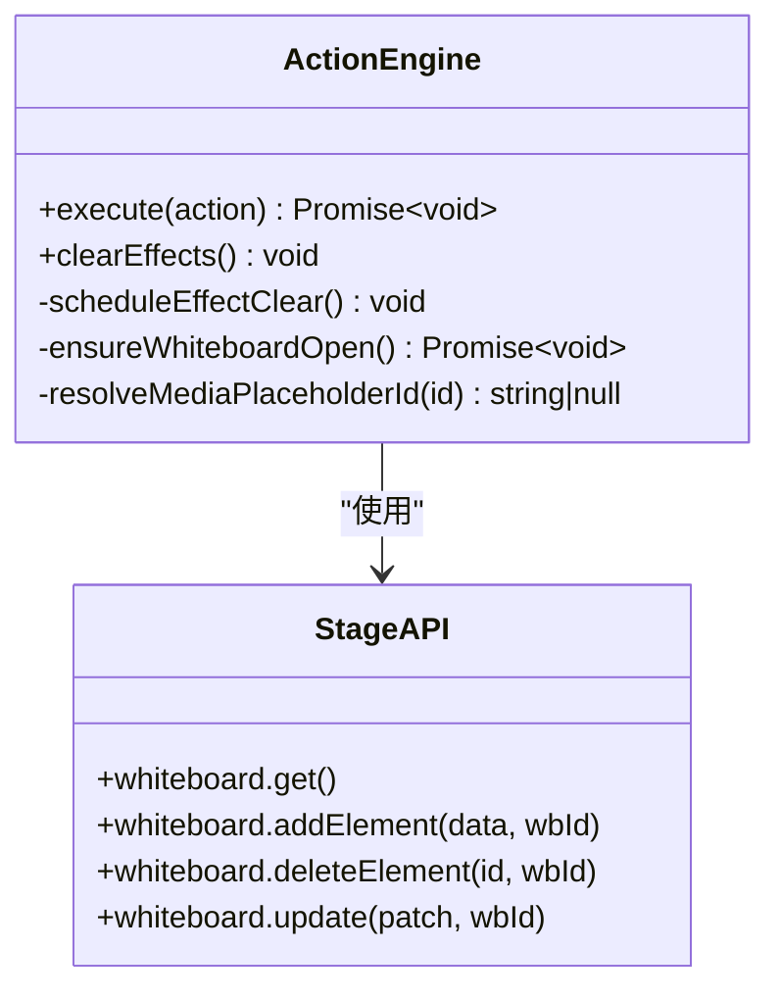
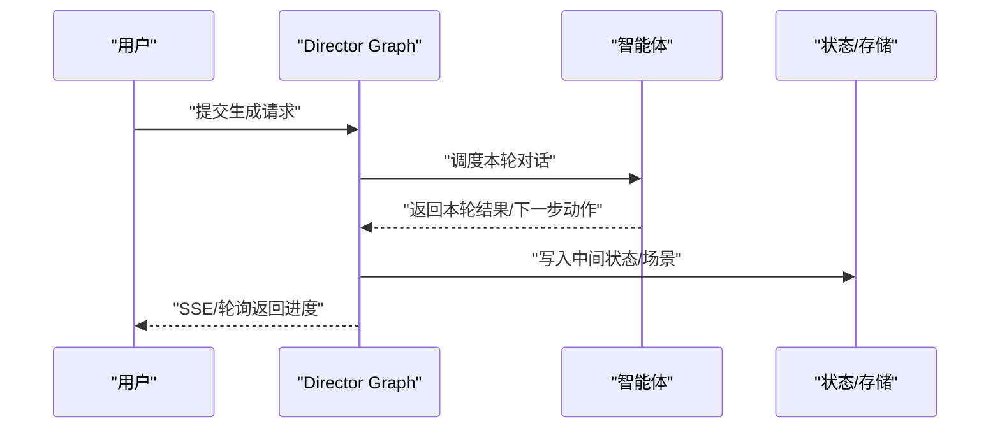
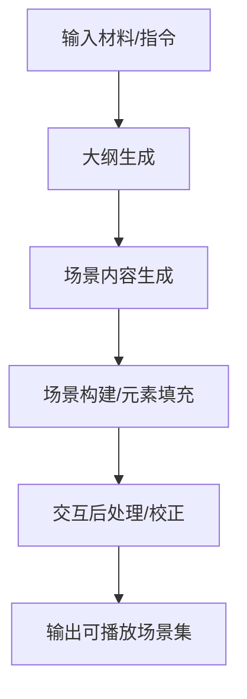
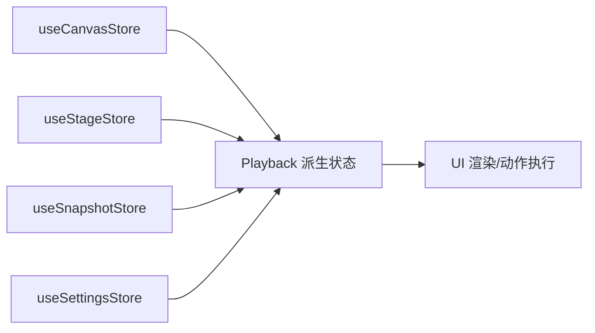
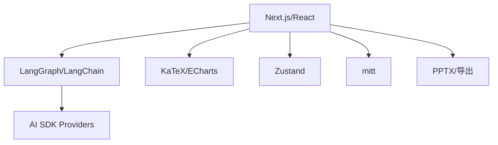

# 架构概览

<cite>
**本文引用的文件**
- [package.json](file://package.json)
- [README.md](file://README.md)
- [app/layout.tsx](file://app/layout.tsx)
- [lib/playback/engine.ts](file://lib/playback/engine.ts)
- [lib/playback/types.ts](file://lib/playback/types.ts)
- [lib/action/engine.ts](file://lib/action/engine.ts)
- [lib/store/index.ts](file://lib/store/index.ts)
- [lib/orchestration/director-graph.ts](file://lib/orchestration/director-graph.ts)
- [lib/orchestration/ai-sdk-adapter.ts](file://lib/orchestration/ai-sdk-adapter.ts)
- [lib/generation/generation-pipeline.ts](file://lib/generation/generation-pipeline.ts)
- [lib/generation/scene-generator.ts](file://lib/generation/scene-generator.ts)
- [lib/generation/outline-generator.ts](file://lib/generation/outline-generator.ts)
- [lib/generation/scene-builder.ts](file://lib/generation/scene-builder.ts)
- [lib/generation/pipeline-runner.ts](file://lib/generation/pipeline-runner.ts)
- [lib/generation/action-parser.ts](file://lib/generation/action-parser.ts)
- [lib/generation/interactive-post-processor.ts](file://lib/generation/interactive-post-processor.ts)
- [lib/generation/json-repair.ts](file://lib/generation/json-repair.ts)
- [lib/generation/prompt-formatters.ts](file://lib/generation/prompt-formatters.ts)
- [lib/generation/pipeline-types.ts](file://lib/generation/pipeline-types.ts)
- [lib/generation/prompts/index.ts](file://lib/generation/prompts/index.ts)
- [lib/playback/index.ts](file://lib/playback/index.ts)
- [lib/playback/derived-state.ts](file://lib/playback/derived-state.ts)
- [lib/playback/derived-state.ts](file://lib/playback/derived-state.ts)
</cite>

## 目录
1. [引言](#引言)
2. [项目结构](#项目结构)
3. [核心组件](#核心组件)
4. [架构总览](#架构总览)
5. [详细组件分析](#详细组件分析)
6. [依赖分析](#依赖分析)
7. [性能考虑](#性能考虑)
8. [故障排查指南](#故障排查指南)
9. [结论](#结论)
10. [附录](#附录)

## 引言
OpenMAIC 是一个基于多智能体编排与事件驱动架构的开源互动课堂平台。其整体设计理念围绕“两阶段生成管线 + 多智能体对话 + 播放引擎 + 动作执行引擎”的分层体系展开：前端通过生成管线产出富场景课件，后端以 LangGraph 实现多智能体编排，播放引擎负责按时间轴驱动课堂播放与实时讨论，动作执行引擎统一调度视觉特效、语音播报与白板绘制等动作。

本架构强调模块化与可扩展性，支持异步生成作业、SSE 实时流式对话、可插拔的 LLM 提供商适配以及丰富的导出能力（PPTX、HTML）。通过状态机与事件回调机制，系统在“空闲 → 播放 → 暂停 → 实时讨论”之间平滑切换，兼顾教学演示与交互体验。

## 项目结构
OpenMAIC 采用 Next.js App Router 的前后端一体化组织方式，核心代码位于 lib/ 与 app/ 两大区域：
- app/：Next.js 路由与页面入口，包含 API 路由、教室回放页与主页。
- lib/：核心业务逻辑，按功能域划分为 generation（生成）、orchestration（编排）、playback（播放）、action（动作）、store（状态）、ai/api/media 等子模块。
- components/：UI 组件库，覆盖画布渲染器、场景渲染器、聊天区、设置面板等。
- configs/：共享常量配置（字体、形状、热键、主题）。
- packages/：工作区包（如 PowerPoint 生成与 MathML 转换）。

**图表来源**
- [app/layout.tsx:1-47](file://app/layout.tsx#L1-L47)
- [lib/store/index.ts:1-19](file://lib/store/index.ts#L1-L19)
- [lib/playback/engine.ts:1-525](file://lib/playback/engine.ts#L1-L525)
- [lib/action/engine.ts:1-519](file://lib/action/engine.ts#L1-L519)

**章节来源**
- [README.md:372-426](file://README.md#L372-L426)
- [app/layout.tsx:1-47](file://app/layout.tsx#L1-L47)
- [lib/store/index.ts:1-19](file://lib/store/index.ts#L1-L19)

## 核心组件
- 生成管线（lib/generation/*）
  - 两阶段：大纲生成 → 场景内容生成；支持 JSON 修复、提示词格式化、场景构建与交互后处理。
- 多智能体编排（lib/orchestration/*）
  - 基于 LangGraph 的导演图（Director Graph），实现智能体轮次控制与讨论流程管理。
- 播放引擎（lib/playback/*）
  - 基于状态机的课堂播放与实时讨论驱动，统一消费 Scene.actions[] 并交由动作引擎执行。
- 动作执行引擎（lib/action/engine.ts）
  - 统一调度 28+ 类型的动作（语音、白板绘制、视频播放、视觉特效等），区分“即时生效”与“同步等待完成”。

上述组件通过 lib/store/* 与 lib/api/* 进行状态与接口桥接，形成清晰的分层与职责边界。

**章节来源**
- [README.md:428-434](file://README.md#L428-L434)
- [lib/playback/engine.ts:1-525](file://lib/playback/engine.ts#L1-L525)
- [lib/action/engine.ts:1-519](file://lib/action/engine.ts#L1-L519)
- [lib/store/index.ts:1-19](file://lib/store/index.ts#L1-L19)

## 架构总览
OpenMAIC 采用“事件驱动 + 状态机”的混合架构：
- 事件驱动：播放引擎根据 Scene.actions[] 逐条触发事件，动作引擎执行对应动作；SSE 流式对话与用户交互作为外部事件注入。
- 状态机：播放引擎内部以“空闲/播放/暂停/实时讨论”四态流转，严格约束行为与恢复点。
- 分层架构：表现层（UI 组件）、业务逻辑层（生成/编排/播放/动作）、数据访问层（Zustand 状态、媒体任务队列）。

**图表来源**
- [lib/playback/engine.ts:1-525](file://lib/playback/engine.ts#L1-L525)
- [lib/action/engine.ts:1-519](file://lib/action/engine.ts#L1-L519)
- [lib/store/index.ts:1-19](file://lib/store/index.ts#L1-L19)

## 详细组件分析

### 播放引擎（Playback Engine）
播放引擎是课堂播放与实时讨论的核心，采用状态机驱动：
- 状态：idle → playing → paused → live
- 关键能力：进度快照与恢复、TTS 阅读计时、讨论触发延迟、用户中断与恢复、场景/演讲者切换回调。
- 数据流：从当前场景与动作索引开始，逐个执行动作；对语音动作注册 onEnded 回调推进下一事件；对白板/视频等同步动作等待完成再继续。

**图表来源**
- [lib/playback/engine.ts:7-24](file://lib/playback/engine.ts#L7-L24)

**章节来源**
- [lib/playback/engine.ts:1-525](file://lib/playback/engine.ts#L1-L525)
- [lib/playback/types.ts:14-62](file://lib/playback/types.ts#L14-L62)

### 动作执行引擎（Action Engine）
动作执行引擎统一调度所有动作类型，分为两类：
- 即时生效：spotlight、laser 等视觉特效，执行后自动清理。
- 同步等待：speech、play_video、wb_* 白板系列等，需等待完成或资源就绪后再继续。

**图表来源**
- [lib/action/engine.ts:50-125](file://lib/action/engine.ts#L50-L125)
- [lib/action/engine.ts:263-518](file://lib/action/engine.ts#L263-L518)

**章节来源**
- [lib/action/engine.ts:1-519](file://lib/action/engine.ts#L1-L519)

### 多智能体编排（Orchestration）
- Director Graph：以 LangGraph 为核心，定义智能体轮次与对话流程，结合工具模式与提示词构建，实现“教师讲解 → 学生提问 → 协作讨论 → 总结输出”的闭环。
- AI SDK 适配：抽象不同提供商的调用差异，统一返回结构，便于替换与扩展。

**图表来源**
- [lib/orchestration/director-graph.ts](file://lib/orchestration/director-graph.ts)
- [lib/orchestration/ai-sdk-adapter.ts](file://lib/orchestration/ai-sdk-adapter.ts)

**章节来源**
- [lib/orchestration/director-graph.ts](file://lib/orchestration/director-graph.ts)
- [lib/orchestration/ai-sdk-adapter.ts](file://lib/orchestration/ai-sdk-adapter.ts)

### 生成管线（Generation Pipeline）
- 两阶段流水线：outline-generator → scene-generator → scene-builder → 交互后处理。
- 工具链：JSON 修复、提示词格式化、动作解析、运行器封装，确保输出稳定与可播放。

**图表来源**
- [lib/generation/generation-pipeline.ts](file://lib/generation/generation-pipeline.ts)
- [lib/generation/outline-generator.ts](file://lib/generation/outline-generator.ts)
- [lib/generation/scene-generator.ts](file://lib/generation/scene-generator.ts)
- [lib/generation/scene-builder.ts](file://lib/generation/scene-builder.ts)
- [lib/generation/interactive-post-processor.ts](file://lib/generation/interactive-post-processor.ts)
- [lib/generation/json-repair.ts](file://lib/generation/json-repair.ts)
- [lib/generation/prompt-formatters.ts](file://lib/generation/prompt-formatters.ts)
- [lib/generation/action-parser.ts](file://lib/generation/action-parser.ts)
- [lib/generation/pipeline-runner.ts](file://lib/generation/pipeline-runner.ts)
- [lib/generation/pipeline-types.ts](file://lib/generation/pipeline-types.ts)
- [lib/generation/prompts/index.ts](file://lib/generation/prompts/index.ts)

**章节来源**
- [lib/generation/generation-pipeline.ts](file://lib/generation/generation-pipeline.ts)
- [lib/generation/pipeline-runner.ts](file://lib/generation/pipeline-runner.ts)
- [lib/generation/pipeline-types.ts](file://lib/generation/pipeline-types.ts)

### 状态与上下文（Store 与派生状态）
- Store：Zustand 状态集合，包括画布、舞台、快照、键盘、设置等。
- 派生状态：Playback 模块导出派生状态工具，用于从播放快照中计算当前展示状态，提升回放一致性与可恢复性。

**图表来源**
- [lib/store/index.ts:1-19](file://lib/store/index.ts#L1-L19)
- [lib/playback/derived-state.ts](file://lib/playback/derived-state.ts)

**章节来源**
- [lib/store/index.ts:1-19](file://lib/store/index.ts#L1-L19)
- [lib/playback/index.ts](file://lib/playback/index.ts)

## 依赖分析
- 前端框架与生态：Next.js 16、React 19、TypeScript、Tailwind CSS。
- 多智能体与 LLM：LangChain LangGraph 1.1、AI SDK（OpenAI/Anthropic/Google）、CopilotKit。
- 媒体与渲染：KaTeX、ECharts、Sharp、@napi-rs/canvas、ProseMirror。
- 状态与事件：Zustand、mitt（事件总线）。
- 导出与转换：自研 pptxgenjs、mathml2omml。

**图表来源**
- [package.json:15-94](file://package.json#L15-L94)

**章节来源**
- [package.json:15-94](file://package.json#L15-L94)

## 性能考虑
- 播放性能
  - 语音阅读计时：根据文本语言估算时长，避免阻塞主线程；TTS 失败时回退到计时，保证播放连续性。
  - 视觉特效：即时生效类效果自动清理，避免累积开销。
  - 白板动画：统一延时策略与缓动曲线，减少重绘压力。
- 编排性能
  - Director Graph 使用流式工具与增量状态，降低内存占用。
  - 生成管线采用分阶段与并行化（如媒体生成任务）。
- 状态与渲染
  - Zustand 精细化订阅，避免全局抖动。
  - UI 组件按需渲染与懒加载，结合 Tailwind CSS 减少样式体积。
- 可扩展性
  - 插件化动作类型与 Provider 抽象，便于新增模型与媒体服务。
  - SSE 与异步作业模式，支持大规模并发生成与播放。

[本节为通用性能建议，不直接分析具体文件]

## 故障排查指南
- 播放异常
  - 现象：播放卡住或无法继续。检查播放引擎是否处于 paused/playing，确认 TTS 是否完成或计时器是否被正确恢复。
  - 排查：查看 onSpeechEnd/onComplete 回调是否触发，确认音频播放器状态与播放速度设置。
- 讨论触发问题
  - 现象：ProactiveCard 不出现或重复触发。检查讨论动作是否已消耗、代理选择过滤条件与触发延迟。
  - 排查：核对 consumedDiscussions 集合与 isAgentSelected 回调。
- 白板绘制失败
  - 现象：白板打开/绘制无响应。检查白板实例是否存在、元素添加是否成功、动画延时是否完成。
  - 排查：确认 StageAPI 返回值与订阅回调，关注 ensureWhiteboardOpen 的调用路径。
- 媒体播放卡顿
  - 现象：视频播放未开始或提前结束。检查媒体占位符映射与任务状态，确认播放完成回调。
  - 排查：resolveMediaPlaceholderId 解析链路与媒体生成任务队列状态。

**章节来源**
- [lib/playback/engine.ts:133-336](file://lib/playback/engine.ts#L133-L336)
- [lib/action/engine.ts:178-228](file://lib/action/engine.ts#L178-L228)
- [lib/action/engine.ts:230-261](file://lib/action/engine.ts#L230-L261)

## 结论
OpenMAIC 通过“生成管线 + 多智能体编排 + 播放引擎 + 动作执行引擎”的分层架构，实现了从素材到互动课堂的完整闭环。事件驱动与状态机相结合，既保证了课堂播放的确定性，又支持实时讨论与用户干预。模块化设计与 Provider 抽象为后续扩展提供了良好基础，适合在教育、培训与内容创作场景中持续演进。

[本节为总结性内容，不直接分析具体文件]

## 附录
- 快速定位
  - 播放引擎：lib/playback/engine.ts、lib/playback/types.ts
  - 动作引擎：lib/action/engine.ts
  - 生成管线：lib/generation/*
  - 编排：lib/orchestration/*
  - 状态：lib/store/index.ts
  - 入口布局：app/layout.tsx
  - 依赖清单：package.json

[本节为导航性内容，不直接分析具体文件]