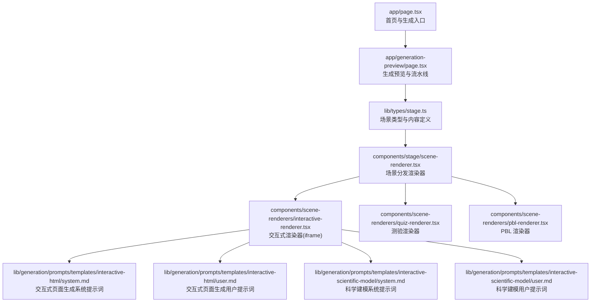
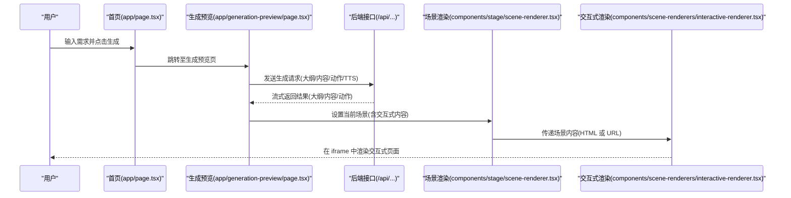
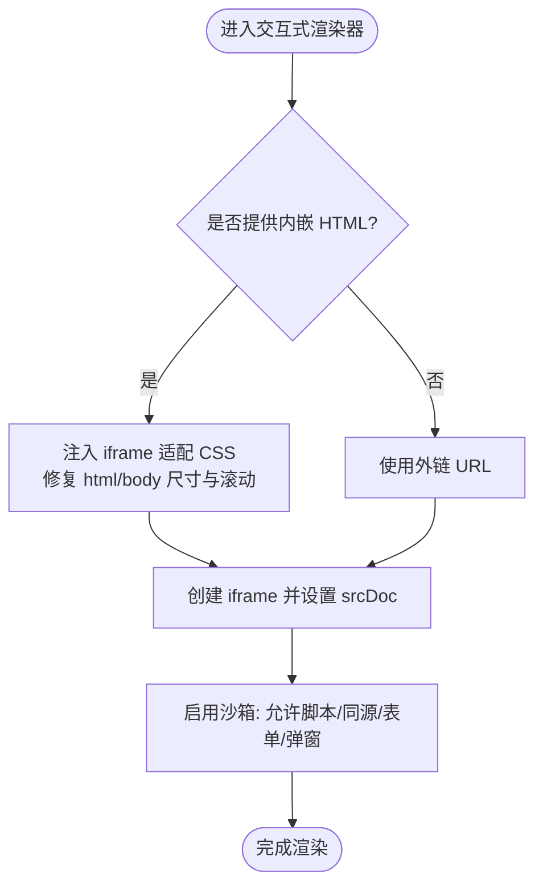
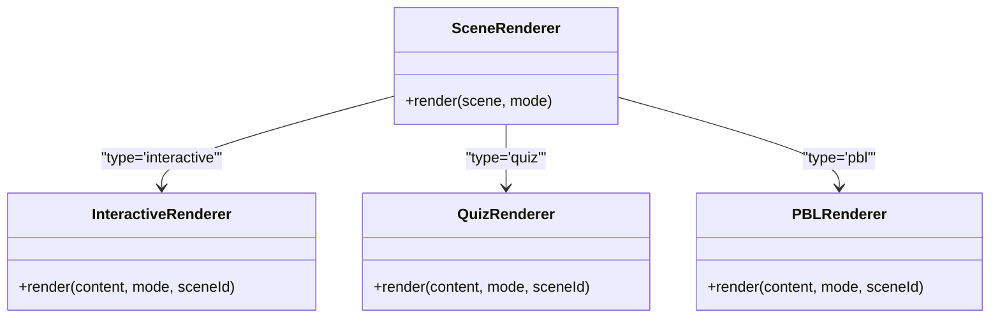
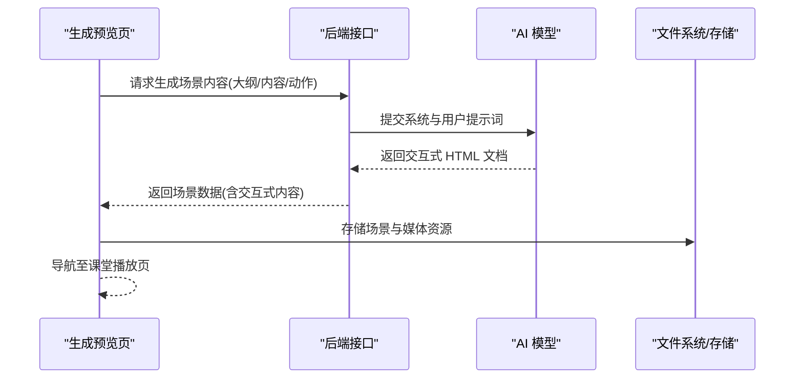
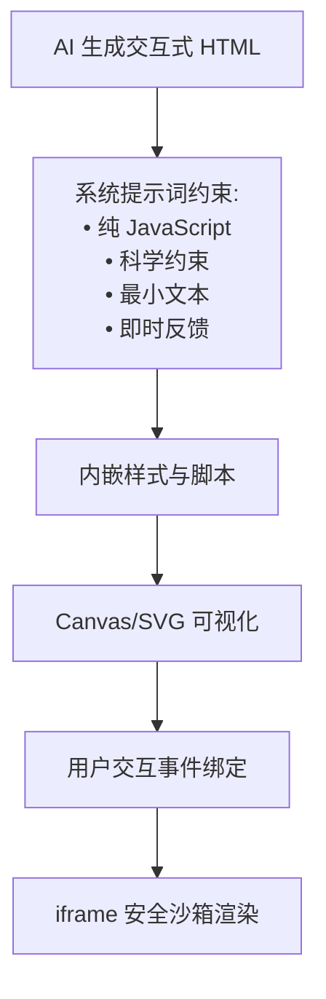
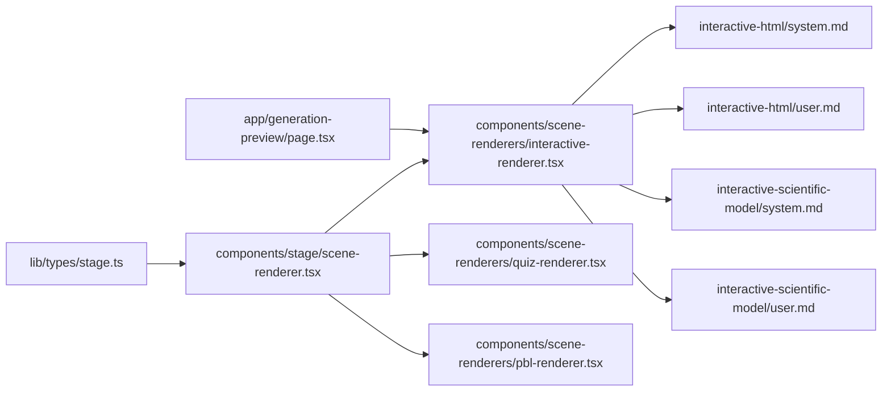

# 交互式模拟场景

<cite>
**本文引用的文件**
- [app/page.tsx](file://app/page.tsx)
- [app/generation-preview/page.tsx](file://app/generation-preview/page.tsx)
- [components/scene-renderers/interactive-renderer.tsx](file://components/scene-renderers/interactive-renderer.tsx)
- [components/stage/scene-renderer.tsx](file://components/stage/scene-renderer.tsx)
- [lib/types/stage.ts](file://lib/types/stage.ts)
- [components/scene-renderers/pbl-renderer.tsx](file://components/scene-renderers/pbl-renderer.tsx)
- [components/scene-renderers/quiz-renderer.tsx](file://components/scene-renderers/quiz-renderer.tsx)
- [lib/generation/prompts/templates/interactive-html/system.md](file://lib/generation/prompts/templates/interactive-html/system.md)
- [lib/generation/prompts/templates/interactive-html/user.md](file://lib/generation/prompts/templates/interactive-html/user.md)
- [lib/generation/prompts/templates/interactive-scientific-model/system.md](file://lib/generation/prompts/templates/interactive-scientific-model/system.md)
- [lib/generation/prompts/templates/interactive-scientific-model/user.md](file://lib/generation/prompts/templates/interactive-scientific-model/user.md)
- [README.md](file://README.md)
</cite>

## 目录
1. [简介](#简介)
2. [项目结构](#项目结构)
3. [核心组件](#核心组件)
4. [架构总览](#架构总览)
5. [详细组件分析](#详细组件分析)
6. [依赖关系分析](#依赖关系分析)
7. [性能考量](#性能考量)
8. [故障排查指南](#故障排查指南)
9. [结论](#结论)
10. [附录](#附录)

## 简介
本文件面向 OpenMAIC 的“交互式模拟场景”，系统性阐述基于 HTML 的交互式实验与模拟功能，涵盖虚拟实验室环境的构建与管理、交互式场景的渲染机制（HTML 内容嵌入、JavaScript 交互逻辑执行、用户输入响应）、可交互元素（按钮、滑块、下拉菜单等）的实现方式，并提供课堂中实时实验演示与学习的使用示例。

OpenMAIC 支持将教学主题或材料一键转化为包含多类课堂场景的沉浸式课堂体验，其中“交互式模拟”是重要一环：由 AI 生成自包含的 HTML 页面，内含可视化与交互逻辑，通过 iframe 安全沙箱加载并在课堂中实时演示与学习。

## 项目结构
围绕交互式模拟场景的关键模块如下：
- 场景类型定义：统一描述“幻灯片、测验、交互式、PBL”等场景类型与内容结构
- 场景渲染器：根据场景类型分发到具体渲染器（交互式、测验、PBL）
- 交互式渲染器：负责将嵌入的 HTML 或外部 URL 安全地在 iframe 中渲染
- 生成流程：从用户需求出发，经大纲与内容生成，产出交互式场景内容
- 教学场景：测验与 PBL 渲染器作为对比，体现不同交互模式

图表来源
- [app/page.tsx:1-800](file://app/page.tsx#L1-L800)
- [app/generation-preview/page.tsx:1-800](file://app/generation-preview/page.tsx#L1-L800)
- [lib/types/stage.ts:1-124](file://lib/types/stage.ts#L1-L124)
- [components/stage/scene-renderer.tsx:1-37](file://components/stage/scene-renderer.tsx#L1-L37)
- [components/scene-renderers/interactive-renderer.tsx:1-73](file://components/scene-renderers/interactive-renderer.tsx#L1-L73)
- [components/scene-renderers/quiz-renderer.tsx:1-84](file://components/scene-renderers/quiz-renderer.tsx#L1-L84)
- [components/scene-renderers/pbl-renderer.tsx:1-129](file://components/scene-renderers/pbl-renderer.tsx#L1-L129)
- [lib/generation/prompts/templates/interactive-html/system.md:1-56](file://lib/generation/prompts/templates/interactive-html/system.md#L1-L56)
- [lib/generation/prompts/templates/interactive-html/user.md:1-47](file://lib/generation/prompts/templates/interactive-html/user.md#L1-L47)
- [lib/generation/prompts/templates/interactive-scientific-model/system.md:1-38](file://lib/generation/prompts/templates/interactive-scientific-model/system.md#L1-L38)
- [lib/generation/prompts/templates/interactive-scientific-model/user.md:1-32](file://lib/generation/prompts/templates/interactive-scientific-model/user.md#L1-L32)

章节来源
- [README.md:199-204](file://README.md#L199-L204)

## 核心组件
- 场景类型与内容
  - 场景类型包含 slide、quiz、interactive、pbl；每种类型对应不同的内容结构
  - 交互式场景内容支持两种形式：外链 URL 或内嵌 HTML 字符串
- 场景渲染器
  - 根据场景类型选择渲染器：交互式走 iframe 渲染，测验与 PBL 分别渲染其专用界面
- 交互式渲染器
  - 将内嵌 HTML 注入 iframe，并对样式进行适配以确保在 iframe 中正确显示
  - 使用沙箱属性允许脚本、同源、表单与弹窗，保障交互能力与安全边界
- 生成与导出
  - 生成预览页负责调用后端接口，流式获取大纲与内容，最终产出交互式场景
  - 提供导出为交互式 HTML 的能力，便于离线或独立部署

章节来源
- [lib/types/stage.ts:62-106](file://lib/types/stage.ts#L62-L106)
- [components/stage/scene-renderer.tsx:15-36](file://components/stage/scene-renderer.tsx#L15-L36)
- [components/scene-renderers/interactive-renderer.tsx:12-29](file://components/scene-renderers/interactive-renderer.tsx#L12-L29)
- [app/generation-preview/page.tsx:590-650](file://app/generation-preview/page.tsx#L590-L650)

## 架构总览
交互式模拟场景的端到端流程如下：
- 用户在首页输入需求并发起生成
- 生成预览页按步骤执行：PDF 解析、网络搜索、大纲生成、内容生成、动作生成、TTS 合成
- 生成完成后将首个场景加入课堂存储，并跳转到课堂播放页
- 课堂播放页根据场景类型选择渲染器，交互式场景通过 iframe 加载内嵌 HTML 或外链 URL

图表来源
- [app/page.tsx:233-302](file://app/page.tsx#L233-L302)
- [app/generation-preview/page.tsx:130-735](file://app/generation-preview/page.tsx#L130-L735)
- [components/stage/scene-renderer.tsx:15-36](file://components/stage/scene-renderer.tsx#L15-L36)
- [components/scene-renderers/interactive-renderer.tsx:12-29](file://components/scene-renderers/interactive-renderer.tsx#L12-L29)

## 详细组件分析

### 交互式渲染器（iframe 安全沙箱与 HTML 适配）
交互式渲染器负责将 AI 生成的 HTML 或外链 URL 安全地在 iframe 中渲染，同时对内嵌 HTML 进行样式补丁，确保在 iframe 视口内正确显示。

图表来源
- [components/scene-renderers/interactive-renderer.tsx:12-29](file://components/scene-renderers/interactive-renderer.tsx#L12-L29)
- [components/scene-renderers/interactive-renderer.tsx:39-72](file://components/scene-renderers/interactive-renderer.tsx#L39-L72)

章节来源
- [components/scene-renderers/interactive-renderer.tsx:12-72](file://components/scene-renderers/interactive-renderer.tsx#L12-L72)

### 场景渲染器（类型分发）
场景渲染器根据场景类型选择对应的渲染器，交互式场景交由交互式渲染器处理。

图表来源
- [components/stage/scene-renderer.tsx:15-36](file://components/stage/scene-renderer.tsx#L15-L36)
- [components/scene-renderers/interactive-renderer.tsx:12-29](file://components/scene-renderers/interactive-renderer.tsx#L12-L29)
- [components/scene-renderers/quiz-renderer.tsx:15-83](file://components/scene-renderers/quiz-renderer.tsx#L15-L83)
- [components/scene-renderers/pbl-renderer.tsx:17-128](file://components/scene-renderers/pbl-renderer.tsx#L17-L128)

章节来源
- [components/stage/scene-renderer.tsx:15-36](file://components/stage/scene-renderer.tsx#L15-L36)

### 生成与导出（交互式 HTML）
生成预览页负责调用后端接口，流式获取大纲与内容，最终产出交互式场景。交互式页面由 AI 生成，遵循系统提示词要求，确保科学性与交互性。

图表来源
- [app/generation-preview/page.tsx:460-560](file://app/generation-preview/page.tsx#L460-L560)
- [lib/generation/prompts/templates/interactive-html/system.md:1-56](file://lib/generation/prompts/templates/interactive-html/system.md#L1-L56)
- [lib/generation/prompts/templates/interactive-html/user.md:1-47](file://lib/generation/prompts/templates/interactive-html/user.md#L1-L47)
- [lib/generation/prompts/templates/interactive-scientific-model/system.md:1-38](file://lib/generation/prompts/templates/interactive-scientific-model/system.md#L1-L38)
- [lib/generation/prompts/templates/interactive-scientific-model/user.md:1-32](file://lib/generation/prompts/templates/interactive-scientific-model/user.md#L1-L32)

章节来源
- [app/generation-preview/page.tsx:590-650](file://app/generation-preview/page.tsx#L590-L650)
- [lib/types/stage.ts:98-106](file://lib/types/stage.ts#L98-L106)

### 可交互元素实现（按钮、滑块、下拉菜单等）
交互式页面由 AI 生成，遵循系统提示词要求，强调“可视化优先、最小文本、即时反馈、科学准确”。可交互元素（如按钮、滑块、下拉菜单）通过纯 JavaScript 实现，Canvas 或 SVG 用于可视化，确保在 iframe 中正确缩放与响应。

图表来源
- [lib/generation/prompts/templates/interactive-html/system.md:9-38](file://lib/generation/prompts/templates/interactive-html/system.md#L9-L38)
- [lib/generation/prompts/templates/interactive-html/user.md:36-46](file://lib/generation/prompts/templates/interactive-html/user.md#L36-L46)
- [components/scene-renderers/interactive-renderer.tsx:24-26](file://components/scene-renderers/interactive-renderer.tsx#L24-L26)

章节来源
- [lib/generation/prompts/templates/interactive-html/system.md:1-56](file://lib/generation/prompts/templates/interactive-html/system.md#L1-L56)
- [lib/generation/prompts/templates/interactive-html/user.md:1-47](file://lib/generation/prompts/templates/interactive-html/user.md#L1-L47)

### 与测验、PBL 的对比
- 测验渲染器：提供单选/多选/简答题的交互界面，适合课堂即时评估
- PBL 渲染器：提供角色选择与工作空间，适合协作式项目学习

章节来源
- [components/scene-renderers/quiz-renderer.tsx:15-83](file://components/scene-renderers/quiz-renderer.tsx#L15-L83)
- [components/scene-renderers/pbl-renderer.tsx:17-128](file://components/scene-renderers/pbl-renderer.tsx#L17-L128)

## 依赖关系分析
- 类型依赖：场景类型与内容结构定义于统一类型文件，渲染器依赖该定义进行类型校验与分发
- 渲染依赖：场景渲染器依赖各子渲染器；交互式渲染器依赖 iframe 适配逻辑
- 生成依赖：生成预览页依赖后端接口与提示词模板，输出交互式场景内容
- 安全依赖：交互式渲染器通过 iframe 沙箱限制，仅开放必要的权限

图表来源
- [lib/types/stage.ts:62-106](file://lib/types/stage.ts#L62-L106)
- [components/stage/scene-renderer.tsx:15-36](file://components/stage/scene-renderer.tsx#L15-L36)
- [components/scene-renderers/interactive-renderer.tsx:12-29](file://components/scene-renderers/interactive-renderer.tsx#L12-L29)
- [components/scene-renderers/quiz-renderer.tsx:15-83](file://components/scene-renderers/quiz-renderer.tsx#L15-L83)
- [components/scene-renderers/pbl-renderer.tsx:17-128](file://components/scene-renderers/pbl-renderer.tsx#L17-L128)
- [app/generation-preview/page.tsx:460-560](file://app/generation-preview/page.tsx#L460-L560)
- [lib/generation/prompts/templates/interactive-html/system.md:1-56](file://lib/generation/prompts/templates/interactive-html/system.md#L1-L56)
- [lib/generation/prompts/templates/interactive-html/user.md:1-47](file://lib/generation/prompts/templates/interactive-html/user.md#L1-L47)
- [lib/generation/prompts/templates/interactive-scientific-model/system.md:1-38](file://lib/generation/prompts/templates/interactive-scientific-model/system.md#L1-L38)
- [lib/generation/prompts/templates/interactive-scientific-model/user.md:1-32](file://lib/generation/prompts/templates/interactive-scientific-model/user.md#L1-L32)

## 性能考量
- iframe 渲染：内嵌 HTML 通过 srcDoc 注入，避免跨域问题；沙箱限制减少不必要的权限开销
- 适配 CSS：修复 html/body 尺寸与滚动，避免 iframe 内溢出导致的重排与闪烁
- 生成阶段：流式获取大纲与内容，降低首屏等待时间；TTS 合成与媒体资源异步处理
- 课堂播放：仅在当前场景渲染，避免一次性加载过多场景造成内存压力

## 故障排查指南
- 交互式页面不显示或布局异常
  - 检查内嵌 HTML 是否包含完整的 head 与 body 结构
  - 确认 iframe 适配 CSS 是否成功注入
- 交互逻辑无效或报错
  - 确认沙箱权限已允许脚本执行
  - 检查内嵌脚本是否遵循系统提示词约束（纯 JavaScript、科学约束）
- 生成失败或超时
  - 查看生成预览页错误提示，确认后端接口状态与模型配置
  - 检查网络搜索与 PDF 解析步骤是否正常完成

章节来源
- [components/scene-renderers/interactive-renderer.tsx:39-72](file://components/scene-renderers/interactive-renderer.tsx#L39-L72)
- [app/generation-preview/page.tsx:727-735](file://app/generation-preview/page.tsx#L727-L735)

## 结论
OpenMAIC 的交互式模拟场景通过“类型定义—渲染分发—iframe 安全沙箱—AI 生成”的完整链路，实现了从需求到课堂演示的一键生成与实时交互。交互式页面强调可视化与即时反馈，结合科学建模与系统提示词，确保教学内容的准确性与可操作性。配合测验与 PBL 渲染器，可覆盖课堂中的多种互动学习场景。

## 附录

### 使用示例：创建基于 Web 的实验模拟
- 步骤 1：在首页输入学习主题或上传资料，点击生成
- 步骤 2：在生成预览页等待大纲与内容生成，查看交互式场景
- 步骤 3：进入课堂播放页，交互式场景在 iframe 中自动渲染
- 步骤 4：教师可在课堂中实时演示，学生可参与交互式实验

章节来源
- [app/page.tsx:233-302](file://app/page.tsx#L233-L302)
- [app/generation-preview/page.tsx:130-200](file://app/generation-preview/page.tsx#L130-L200)

### 集成第三方交互式内容
- 方案 A：提供外链 URL
  - 在场景内容中设置 URL，渲染器直接加载
- 方案 B：提供内嵌 HTML
  - 由 AI 生成符合系统提示词的 HTML，渲染器注入 iframe 并应用适配 CSS

章节来源
- [lib/types/stage.ts:98-106](file://lib/types/stage.ts#L98-L106)
- [components/scene-renderers/interactive-renderer.tsx:12-29](file://components/scene-renderers/interactive-renderer.tsx#L12-L29)

### 课堂中的实时演示与学习
- 演示流程：教师在课堂播放页切换场景，交互式页面随场景加载
- 学习模式：学生可在自主模式下与交互式页面互动，获得即时反馈
- 评估与协作：结合测验与 PBL 渲染器，实现课堂评估与协作式学习

章节来源
- [components/scene-renderers/quiz-renderer.tsx:15-83](file://components/scene-renderers/quiz-renderer.tsx#L15-L83)
- [components/scene-renderers/pbl-renderer.tsx:17-128](file://components/scene-renderers/pbl-renderer.tsx#L17-L128)
- [README.md:199-204](file://README.md#L199-L204)