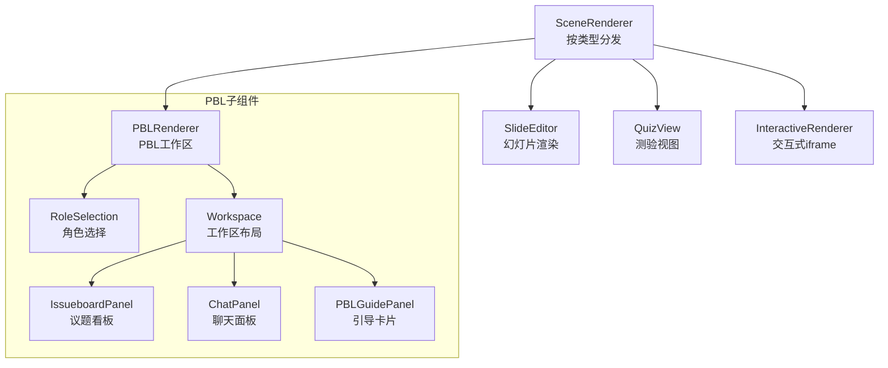
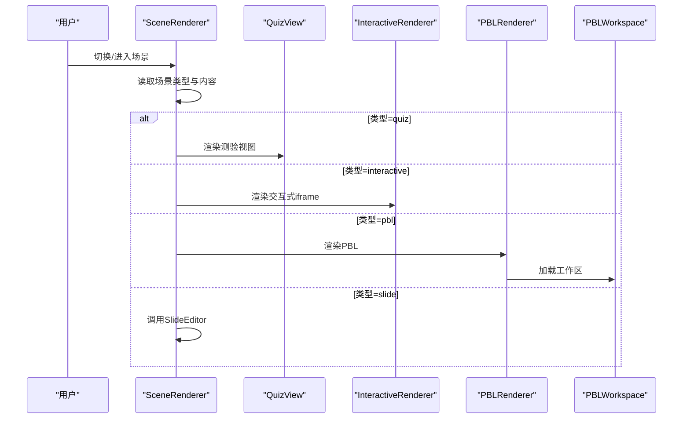
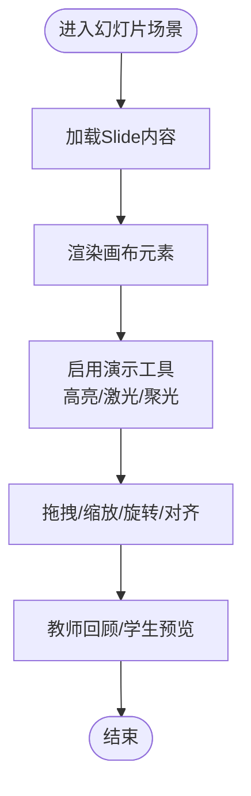
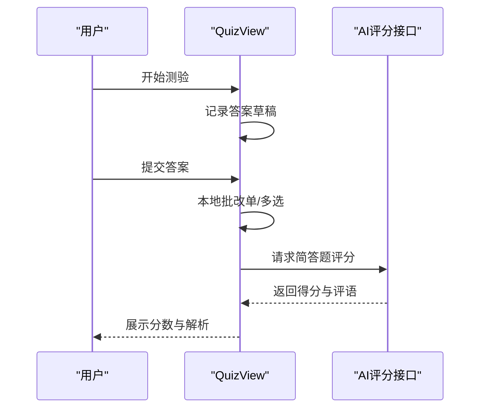
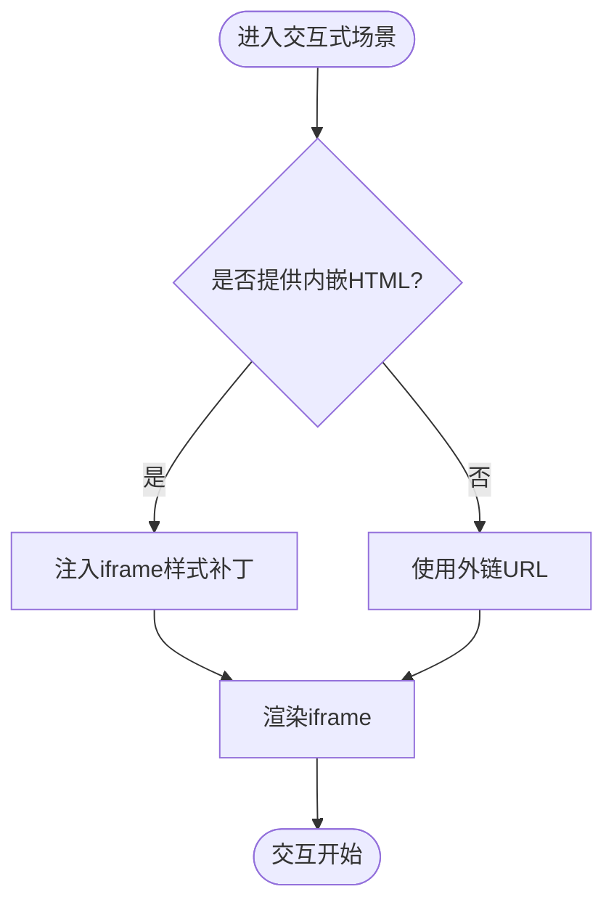
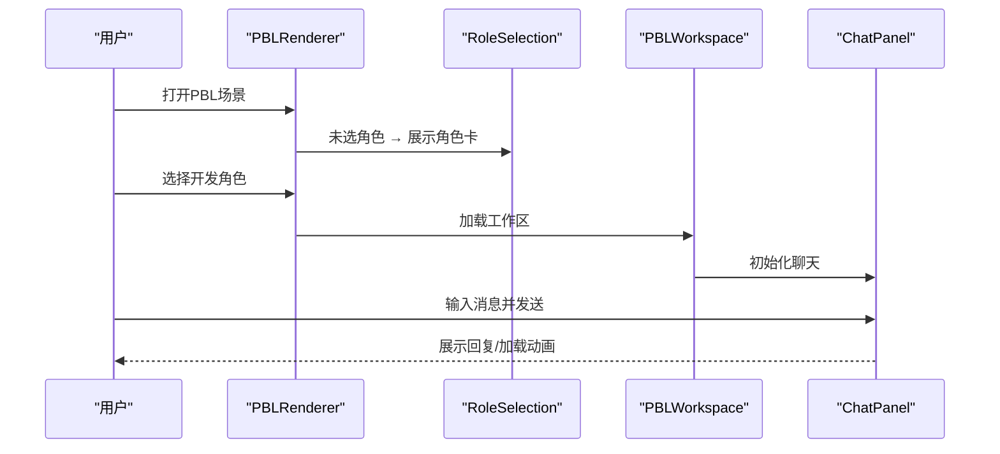
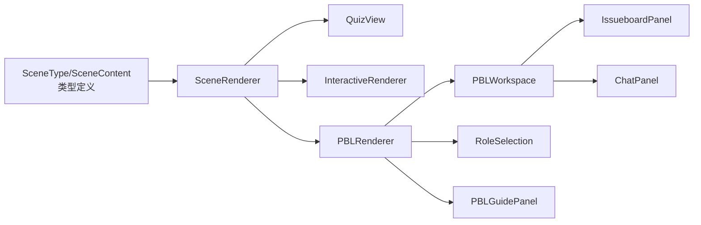

# 场景类型系统

<cite>
**本文引用的文件**
- [components/stage/scene-renderer.tsx](file://components/stage/scene-renderer.tsx)
- [lib/types/stage.ts](file://lib/types/stage.ts)
- [components/scene-renderers/quiz-view.tsx](file://components/scene-renderers/quiz-view.tsx)
- [components/scene-renderers/quiz-renderer.tsx](file://components/scene-renderers/quiz-renderer.tsx)
- [components/scene-renderers/interactive-renderer.tsx](file://components/scene-renderers/interactive-renderer.tsx)
- [components/scene-renderers/pbl-renderer.tsx](file://components/scene-renderers/pbl-renderer.tsx)
- [components/scene-renderers/pbl/workspace.tsx](file://components/scene-renderers/pbl/workspace.tsx)
- [components/scene-renderers/pbl/chat-panel.tsx](file://components/scene-renderers/pbl/chat-panel.tsx)
- [components/scene-renderers/pbl/role-selection.tsx](file://components/scene-renderers/pbl/role-selection.tsx)
- [components/scene-renderers/pbl/issueboard-panel.tsx](file://components/scene-renderers/pbl/issueboard-panel.tsx)
- [components/scene-renderers/pbl/guide.tsx](file://components/scene-renderers/pbl/guide.tsx)
- [lib/pbl/types.ts](file://lib/pbl/types.ts)
- [components/stage/scene-sidebar.tsx](file://components/stage/scene-sidebar.tsx)
</cite>

## 目录
1. [引言](#引言)
2. [项目结构](#项目结构)
3. [核心组件](#核心组件)
4. [架构总览](#架构总览)
5. [详细组件分析](#详细组件分析)
6. [依赖关系分析](#依赖关系分析)
7. [性能考量](#性能考量)
8. [故障排查指南](#故障排查指南)
9. [结论](#结论)
10. [附录](#附录)

## 引言
本文件系统性梳理 OpenMAIC 的“场景类型系统”，围绕四种课堂场景类型展开：幻灯片场景、测验场景、交互式模拟场景、项目式学习（PBL）场景。文档从架构与数据模型入手，逐类解析渲染器实现、用户交互模式与教学目标，并提供使用案例与最佳实践，帮助教师与开发者依据教学内容与目标选择合适的场景类型。

## 项目结构
场景类型系统由“场景类型定义 + 场景渲染器 + 子组件 + 数据模型”构成。核心入口是场景渲染器，它根据场景类型分发到对应的渲染器；渲染器内部再组合子组件以实现具体功能。

图表来源
- [components/stage/scene-renderer.tsx:15-36](file://components/stage/scene-renderer.tsx#L15-L36)
- [components/scene-renderers/pbl-renderer.tsx:17-128](file://components/scene-renderers/pbl-renderer.tsx#L17-L128)

章节来源
- [components/stage/scene-renderer.tsx:15-36](file://components/stage/scene-renderer.tsx#L15-L36)
- [components/stage/scene-sidebar.tsx:91-99](file://components/stage/scene-sidebar.tsx#L91-L99)

## 核心组件
- 场景类型枚举与内容模型：定义了四种场景类型及各自的内容结构，确保渲染器与数据层一致。
- 场景渲染器：根据场景类型动态选择渲染器，统一承载生命周期与模式（自主/回放）。
- 渲染器子组件：各场景的子组件负责具体 UI 与交互逻辑。

章节来源
- [lib/types/stage.ts:6-124](file://lib/types/stage.ts#L6-L124)
- [components/stage/scene-renderer.tsx:15-36](file://components/stage/scene-renderer.tsx#L15-L36)

## 架构总览
下图展示了从场景到渲染器再到子组件的调用链路与职责划分：

图表来源
- [components/stage/scene-renderer.tsx:15-36](file://components/stage/scene-renderer.tsx#L15-L36)
- [components/scene-renderers/pbl-renderer.tsx:17-128](file://components/scene-renderers/pbl-renderer.tsx#L17-L128)

## 详细组件分析

### 幻灯片场景（Slide）
- 教学目标
  - 系统化知识呈现与视觉强调
  - 支持富文本、图像、公式、表格等元素的组合与高亮
- 渲染器实现
  - 入口通过场景渲染器按类型分发至幻灯片编辑器
  - 编辑器内含画布、网格、标尺、高亮/激光/聚光等覆盖层，以及多种元素组件（文本、形状、图片、视频、表格、图表等）
- 用户交互模式
  - 拖拽、缩放、旋转、多选、对齐、阴影/填充等操作
  - 高亮、激光笔、聚光灯等演示辅助工具
- 使用建议
  - 将复杂概念拆分为多页，配合聚光/高亮突出重点
  - 图表与公式结合，提升可视化表达效率

图表来源
- [components/stage/scene-renderer.tsx:17-20](file://components/stage/scene-renderer.tsx#L17-L20)
- [components/stage/scene-sidebar.tsx:190-200](file://components/stage/scene-sidebar.tsx#L190-L200)

章节来源
- [lib/types/stage.ts:67-71](file://lib/types/stage.ts#L67-L71)
- [components/stage/scene-renderer.tsx:17-20](file://components/stage/scene-renderer.tsx#L17-L20)

### 测验场景（Quiz）
- 教学目标
  - 即时评估与反馈，强化知识点掌握
  - 支持单选、多选、简答三种题型，提供评分与解析
- 渲染器实现
  - 提供两种实现：轻量渲染器用于展示，完整视图用于答题与评分
  - 完整视图包含封面、答题、评分、复盘四个阶段，支持草稿缓存与语音输入
- 用户交互模式
  - 自主模式下提交后进入评分阶段；回放模式仅展示
  - 简答题通过 AI 服务评分，本地即时批改单/多选题
- 使用建议
  - 单选/多选题尽量提供明确答案，便于自动评分
  - 简答题配置评分提示词，提升 AI 打分一致性

图表来源
- [components/scene-renderers/quiz-view.tsx:738-777](file://components/scene-renderers/quiz-view.tsx#L738-L777)
- [components/scene-renderers/quiz-view.tsx:82-136](file://components/scene-renderers/quiz-view.tsx#L82-L136)

章节来源
- [lib/types/stage.ts:76-96](file://lib/types/stage.ts#L76-L96)
- [components/scene-renderers/quiz-view.tsx:688-795](file://components/scene-renderers/quiz-view.tsx#L688-L795)
- [components/scene-renderers/quiz-renderer.tsx:15-84](file://components/scene-renderers/quiz-renderer.tsx#L15-L84)

### 交互式模拟场景（Interactive）
- 教学目标
  - 通过 HTML/JS 实验或可视化工具进行动手实践
  - 在受控环境下运行第三方交互内容
- 渲染器实现
  - 通过 iframe 嵌入外部 URL 或内嵌 HTML
  - 对 HTML 进行 iframe 适配补丁，确保在容器中正确渲染
- 用户交互模式
  - 与 iframe 内部页面交互，支持表单、按钮、动画等
- 使用建议
  - 优先使用 HTTPS 资源，避免混合内容问题
  - 对第三方内容启用沙箱策略，限制脚本与弹窗权限

图表来源
- [components/scene-renderers/interactive-renderer.tsx:12-28](file://components/scene-renderers/interactive-renderer.tsx#L12-L28)
- [components/scene-renderers/interactive-renderer.tsx:39-72](file://components/scene-renderers/interactive-renderer.tsx#L39-L72)

章节来源
- [lib/types/stage.ts:101-106](file://lib/types/stage.ts#L101-L106)
- [components/scene-renderers/interactive-renderer.tsx:12-72](file://components/scene-renderers/interactive-renderer.tsx#L12-L72)

### 项目式学习场景（PBL）
- 教学目标
  - 角色扮演与协作完成任务，培养问题解决与团队沟通能力
  - 通过议题看板推进项目进度，借助智能体进行问答与评价
- 渲染器实现
  - 分三步：角色选择 → 工作区（议题看板 + 聊天） → 引导说明
  - 支持重置项目、欢迎消息注入、进度条与状态徽章
- 用户交互模式
  - 选择开发角色后进入工作区，与智能体对话推进议题
  - 支持草稿缓存、语音转写、快捷键提交
- 使用建议
  - 明确议题负责人与参与人，规范议题状态流转
  - 使用 @question/@judge 等标记驱动智能体行为

图表来源
- [components/scene-renderers/pbl-renderer.tsx:17-128](file://components/scene-renderers/pbl-renderer.tsx#L17-L128)
- [components/scene-renderers/pbl/role-selection.tsx:13-62](file://components/scene-renderers/pbl/role-selection.tsx#L13-L62)
- [components/scene-renderers/pbl/workspace.tsx:19-92](file://components/scene-renderers/pbl/workspace.tsx#L19-L92)
- [components/scene-renderers/pbl/chat-panel.tsx:19-151](file://components/scene-renderers/pbl/chat-panel.tsx#L19-L151)

章节来源
- [lib/types/stage.ts:111-114](file://lib/types/stage.ts#L111-L114)
- [lib/pbl/types.ts:63-69](file://lib/pbl/types.ts#L63-L69)
- [components/scene-renderers/pbl-renderer.tsx:17-128](file://components/scene-renderers/pbl-renderer.tsx#L17-L128)
- [components/scene-renderers/pbl/workspace.tsx:19-92](file://components/scene-renderers/pbl/workspace.tsx#L19-L92)
- [components/scene-renderers/pbl/chat-panel.tsx:19-151](file://components/scene-renderers/pbl/chat-panel.tsx#L19-L151)
- [components/scene-renderers/pbl/role-selection.tsx:13-62](file://components/scene-renderers/pbl/role-selection.tsx#L13-L62)
- [components/scene-renderers/pbl/issueboard-panel.tsx:10-86](file://components/scene-renderers/pbl/issueboard-panel.tsx#L10-L86)
- [components/scene-renderers/pbl/guide.tsx:11-142](file://components/scene-renderers/pbl/guide.tsx#L11-L142)

## 依赖关系分析
- 类型耦合
  - 场景类型与内容模型强绑定，确保渲染器分支安全
  - PBL 类型依赖独立的 PBL 类型模块，避免与通用类型冲突
- 组件耦合
  - PBL 工作区由多个子组件组成，职责清晰、可替换性强
  - 测验视图内部封装评分流程，对外暴露简洁接口
- 外部集成
  - 交互式场景通过 iframe 与外部资源解耦
  - 测验简答题依赖 AI 评分接口，具备降级策略

图表来源
- [lib/types/stage.ts:6-124](file://lib/types/stage.ts#L6-L124)
- [components/stage/scene-renderer.tsx:15-36](file://components/stage/scene-renderer.tsx#L15-L36)
- [components/scene-renderers/pbl-renderer.tsx:17-128](file://components/scene-renderers/pbl-renderer.tsx#L17-L128)

章节来源
- [lib/types/stage.ts:6-124](file://lib/types/stage.ts#L6-L124)
- [lib/pbl/types.ts:63-69](file://lib/pbl/types.ts#L63-L69)

## 性能考量
- 渲染器分发
  - 使用 useMemo 缓存渲染器实例，减少不必要的重渲染
- PBL 工作区
  - 采用左右布局与固定宽度，避免频繁重排
  - 聊天面板自动滚动到底部，仅在消息数量变化时触发
- 交互式场景
  - iframe 沙箱策略降低跨域与脚本风险，提高稳定性
- 测验评分
  - 本地即时批改单/多选题，异步并发请求简答题评分，缩短总耗时

章节来源
- [components/stage/scene-renderer.tsx:16-33](file://components/stage/scene-renderer.tsx#L16-L33)
- [components/scene-renderers/pbl/workspace.tsx:48-51](file://components/scene-renderers/pbl/workspace.tsx#L48-L51)
- [components/scene-renderers/interactive-renderer.tsx:12-28](file://components/scene-renderers/interactive-renderer.tsx#L12-L28)
- [components/scene-renderers/quiz-view.tsx:744-777](file://components/scene-renderers/quiz-view.tsx#L744-L777)

## 故障排查指南
- 场景类型不匹配
  - 现象：显示“无效内容”或“未知类型”
  - 排查：确认场景内容与类型一致，检查类型字段与内容结构
- PBL 无项目信息
  - 现象：提示“项目为空”
  - 排查：确认项目配置已生成，agents 与 projectInfo 填充完整
- 交互式内容无法加载
  - 现象：iframe 白屏或报错
  - 排查：检查 URL 是否 HTTPS，HTML 是否包含 head 标签；必要时使用内嵌 HTML 并应用补丁
- 测验简答题评分失败
  - 现象：简答题未获得评分
  - 排查：检查网络连通性与 AI 服务可用性；查看日志降级提示

章节来源
- [components/stage/scene-renderer.tsx:19-32](file://components/stage/scene-renderer.tsx#L19-L32)
- [components/scene-renderers/pbl-renderer.tsx:100-106](file://components/scene-renderers/pbl-renderer.tsx#L100-L106)
- [components/scene-renderers/interactive-renderer.tsx:39-72](file://components/scene-renderers/interactive-renderer.tsx#L39-L72)
- [components/scene-renderers/quiz-view.tsx:122-136](file://components/scene-renderers/quiz-view.tsx#L122-L136)

## 结论
OpenMAIC 的场景类型系统以类型安全的数据模型为基础，通过场景渲染器实现统一调度，并以子组件形式提供丰富的交互与教学能力。四类场景分别覆盖知识呈现、即时评估、动手实践与协作探究，满足多样化的教学需求。建议在设计课程时，依据教学目标与学习活动选择合适场景，并遵循最佳实践以获得稳定体验。

## 附录
- 使用案例与最佳实践
  - 幻灯片场景：将复杂公式与图表组合，使用聚光/高亮强调关键点；分页呈现不同层次内容
  - 测验场景：单/多选题明确唯一答案，简答题配置清晰评分提示词；开启语音输入提升无障碍体验
  - 交互式场景：优先使用 HTTPS 资源，启用 iframe 沙箱；对第三方内容进行最小权限授权
  - PBL 场景：明确角色分工与议题负责人，规范议题状态；利用 @question/@judge 标记驱动智能体行为