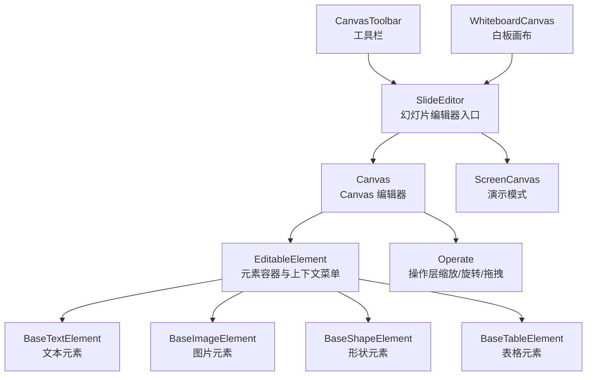
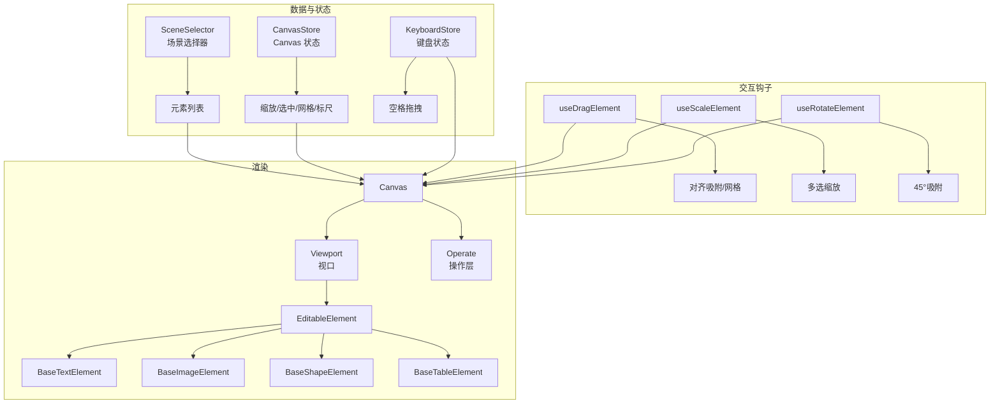
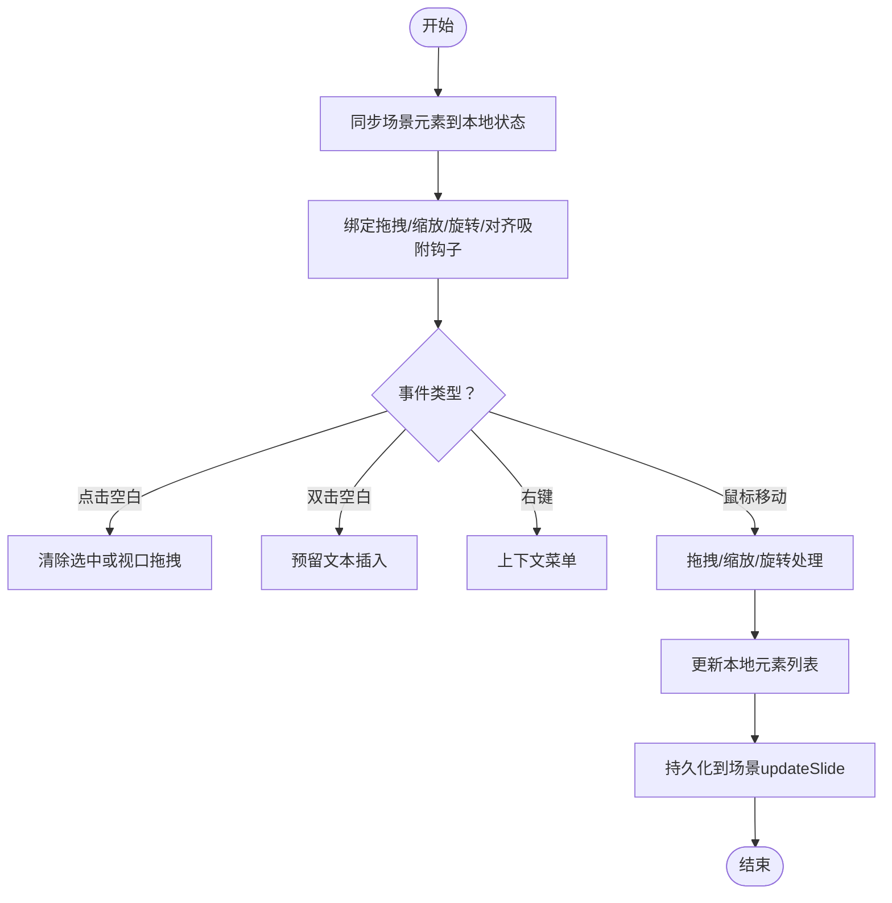
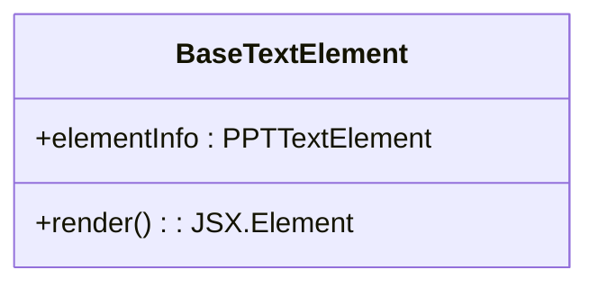
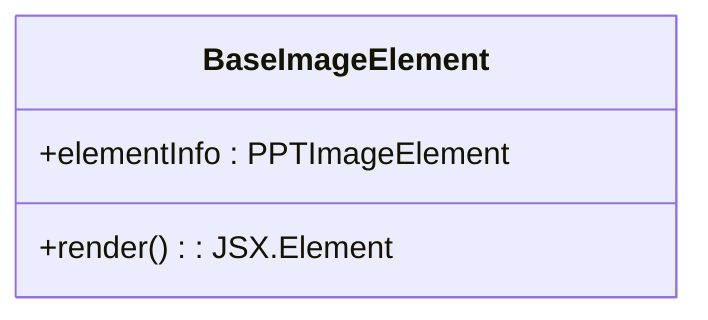
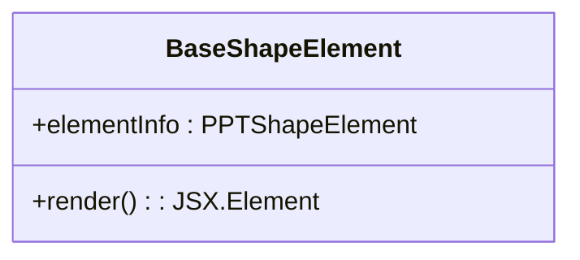
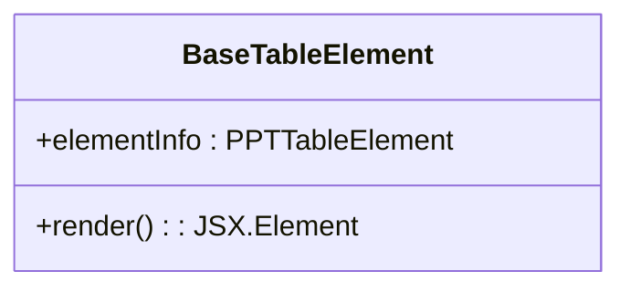
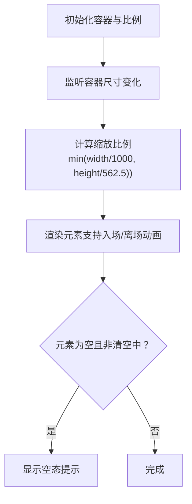
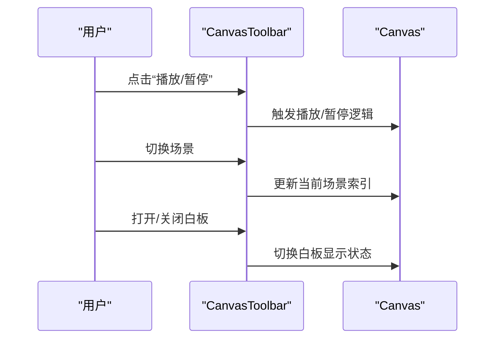
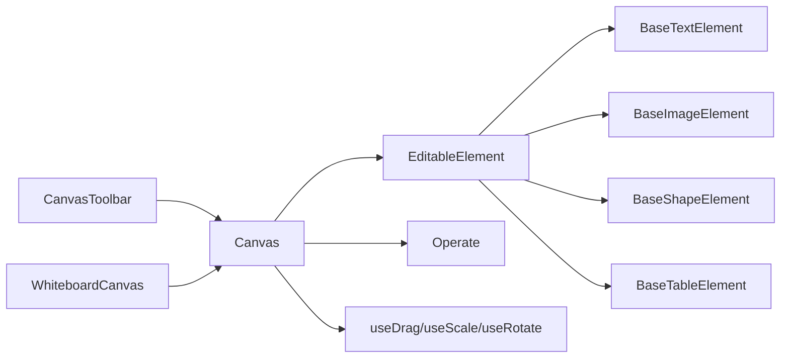

# 幻灯片场景

<cite>
**本文引用的文件**
- [组件/slide-renderer/Editor/index.tsx](file://components/slide-renderer/Editor/index.tsx)
- [组件/canvas/canvas-toolbar.tsx](file://components/canvas/canvas-toolbar.tsx)
- [组件/slide-renderer/Editor/Canvas/index.tsx](file://components/slide-renderer/Editor/Canvas/index.tsx)
- [组件/slide-renderer/Editor/Canvas/Operate/index.tsx](file://components/slide-renderer/Editor/Canvas/Operate/index.tsx)
- [组件/slide-renderer/Editor/Canvas/EditableElement.tsx](file://components/slide-renderer/Editor/Canvas/EditableElement.tsx)
- [组件/slide-renderer/Editor/Canvas/hooks/useDragElement.ts](file://components/slide-renderer/Editor/Canvas/hooks/useDragElement.ts)
- [组件/slide-renderer/Editor/Canvas/hooks/useScaleElement.ts](file://components/slide-renderer/Editor/Canvas/hooks/useScaleElement.ts)
- [组件/slide-renderer/Editor/Canvas/hooks/useRotateElement.ts](file://components/slide-renderer/Editor/Canvas/hooks/useRotateElement.ts)
- [组件/slide-renderer/components/element/TextElement/BaseTextElement.tsx](file://components/slide-renderer/components/element/TextElement/BaseTextElement.tsx)
- [组件/slide-renderer/components/element/ImageElement/BaseImageElement.tsx](file://components/slide-renderer/components/element/ImageElement/BaseImageElement.tsx)
- [组件/slide-renderer/components/element/ShapeElement/BaseShapeElement.tsx](file://components/slide-renderer/components/element/ShapeElement/BaseShapeElement.tsx)
- [组件/slide-renderer/components/element/TableElement/BaseTableElement.tsx](file://components/slide-renderer/components/element/TableElement/BaseTableElement.tsx)
- [组件/whiteboard/whiteboard-canvas.tsx](file://components/whiteboard/whiteboard-canvas.tsx)
</cite>

## 目录
1. [引言](#引言)
2. [项目结构](#项目结构)
3. [核心组件](#核心组件)
4. [架构总览](#架构总览)
5. [详细组件分析](#详细组件分析)
6. [依赖关系分析](#依赖关系分析)
7. [性能考量](#性能考量)
8. [故障排查指南](#故障排查指南)
9. [结论](#结论)
10. [附录：使用示例与最佳实践](#附录使用示例与最佳实践)

## 引言
本文件面向 OpenMAIC 的“幻灯片场景”，系统性阐述基于 Canvas 的富文本渲染体系与白板交互能力。内容覆盖：
- 富文本渲染：文本、图片、形状、表格、公式等元素的渲染实现与样式控制
- 白板系统：元素拖拽、缩放、旋转、选择与编辑的交互流程
- 工具栏：播放/暂停、自动播放、音量、场景切换、白板开关等控制
- 实战示例：如何在课堂中创建与编辑富文本内容，并用白板进行实时演示

## 项目结构
围绕“幻灯片场景”的关键目录与文件如下：
- 幻灯片编辑器入口与模式切换：SlideEditor
- Canvas 编辑器：Canvas（含元素渲染、操作层、标尺、网格线、对齐辅助）
- 元素渲染：TextElement、ImageElement、ShapeElement、TableElement 等
- 操作层：Operate（按元素类型分发拖拽、缩放、旋转、关键点移动等）
- 白板：WhiteboardCanvas（响应式缩放、动画化元素进出）
- 工具栏：CanvasToolbar（播放/暂停、自动播放、音量、场景导航、白板开关）

图表来源
- [组件/slide-renderer/Editor/index.tsx:10-18](file://components/slide-renderer/Editor/index.tsx#L10-L18)
- [组件/slide-renderer/Editor/Canvas/index.tsx:62-413](file://components/slide-renderer/Editor/Canvas/index.tsx#L62-L413)
- [组件/slide-renderer/Editor/Canvas/EditableElement.tsx:47-308](file://components/slide-renderer/Editor/Canvas/EditableElement.tsx#L47-L308)
- [组件/slide-renderer/Editor/Canvas/Operate/index.tsx:54-173](file://components/slide-renderer/Editor/Canvas/Operate/index.tsx#L54-L173)
- [组件/canvas/canvas-toolbar.tsx:79-403](file://components/canvas/canvas-toolbar.tsx#L79-L403)
- [组件/whiteboard/whiteboard-canvas.tsx:79-166](file://components/whiteboard/whiteboard-canvas.tsx#L79-L166)

章节来源
- [组件/slide-renderer/Editor/index.tsx:10-18](file://components/slide-renderer/Editor/index.tsx#L10-L18)
- [组件/canvas/canvas-toolbar.tsx:79-403](file://components/canvas/canvas-toolbar.tsx#L79-L403)

## 核心组件
- 幻灯片编辑器入口（SlideEditor）
  - 根据阶段模式（自主/演示）选择 Canvas 或 ScreenCanvas
- Canvas 编辑器
  - 负责元素渲染、选择、拖拽、缩放、旋转、多选操作、标尺、网格线、对齐吸附
- 元素渲染组件
  - 文本、图片、形状、表格等基础渲染组件，支持阴影、翻转、滤镜、描边、渐变/图案填充等
- 操作层（Operate）
  - 针对不同元素类型提供缩放手柄、旋转手柄、关键点移动等交互
- 白板画布（WhiteboardCanvas）
  - 固定比例（16:9）响应式缩放，元素入场/离场动画，空态提示
- 工具栏（CanvasToolbar）
  - 场景导航、播放/暂停、自动播放、音量、白板开关、侧边栏/聊天面板开关

章节来源
- [组件/slide-renderer/Editor/index.tsx:10-18](file://components/slide-renderer/Editor/index.tsx#L10-L18)
- [组件/slide-renderer/Editor/Canvas/index.tsx:62-413](file://components/slide-renderer/Editor/Canvas/index.tsx#L62-L413)
- [组件/slide-renderer/Editor/Canvas/Operate/index.tsx:54-173](file://components/slide-renderer/Editor/Canvas/Operate/index.tsx#L54-L173)
- [组件/slide-renderer/Editor/Canvas/EditableElement.tsx:47-308](file://components/slide-renderer/Editor/Canvas/EditableElement.tsx#L47-L308)
- [组件/slide-renderer/components/element/TextElement/BaseTextElement.tsx:16-63](file://components/slide-renderer/components/element/TextElement/BaseTextElement.tsx#L16-L63)
- [components/slide-renderer/components/element/ImageElement/BaseImageElement.tsx:23-156](file://components/slide-renderer/components/element/ImageElement/BaseImageElement.tsx#L23-L156)
- [components/slide-renderer/components/element/ShapeElement/BaseShapeElement.tsx:18-118](file://components/slide-renderer/components/element/ShapeElement/BaseShapeElement.tsx#L18-L118)
- [components/slide-renderer/components/element/TableElement/BaseTableElement.tsx:14-35](file://components/slide-renderer/components/element/TableElement/BaseTableElement.tsx#L14-L35)
- [components/whiteboard/whiteboard-canvas.tsx:79-166](file://components/whiteboard/whiteboard-canvas.tsx#L79-L166)
- [components/canvas/canvas-toolbar.tsx:79-403](file://components/canvas/canvas-toolbar.tsx#L79-L403)

## 架构总览
Canvas 编辑器采用“场景数据驱动 + 本地状态同步 + 交互钩子”的分层设计：
- 数据层：场景上下文（Scene Context）提供元素列表与背景
- 本地状态：Canvas Store 管理缩放、选中、操作状态；键盘状态用于空间拖拽
- 交互层：拖拽、缩放、旋转、对齐吸附、网格/标尺、鼠标框选等钩子
- 渲染层：EditableElement 动态分发到具体元素组件；Operate 层叠加操作控件

图表来源
- [组件/slide-renderer/Editor/Canvas/index.tsx:67-101](file://components/slide-renderer/Editor/Canvas/index.tsx#L67-L101)
- [组件/slide-renderer/Editor/Canvas/hooks/useDragElement.ts:32-385](file://components/slide-renderer/Editor/Canvas/hooks/useDragElement.ts#L32-L385)
- [组件/slide-renderer/Editor/Canvas/hooks/useScaleElement.ts:144-556](file://components/slide-renderer/Editor/Canvas/hooks/useScaleElement.ts#L144-L556)
- [组件/slide-renderer/Editor/Canvas/hooks/useRotateElement.ts:42-128](file://components/slide-renderer/Editor/Canvas/hooks/useRotateElement.ts#L42-L128)
- [组件/slide-renderer/Editor/Canvas/EditableElement.tsx:47-308](file://components/slide-renderer/Editor/Canvas/EditableElement.tsx#L47-L308)
- [组件/slide-renderer/Editor/Canvas/Operate/index.tsx:54-173](file://components/slide-renderer/Editor/Canvas/Operate/index.tsx#L54-L173)

## 详细组件分析

### Canvas 编辑器（Canvas）
- 职责
  - 同步场景元素到本地状态，支持拖拽、缩放、旋转、多选、对齐吸附、网格/标尺、鼠标框选
  - 提供元素创建选择、自定义形状创建画布、视口背景、光标拖拽遮罩等
- 关键交互
  - 点击空白区域：清除选中或触发视口拖拽
  - 双击空白区域：预留文本插入入口
  - 右键上下文菜单：粘贴、全选、标尺、网格、重置当前页等
- 性能优化
  - 使用 useRef + useState 同步 store 元素，避免不必要的重渲染
  - 对齐吸附与网格线仅在需要时渲染

图表来源
- [组件/slide-renderer/Editor/Canvas/index.tsx:95-101](file://components/slide-renderer/Editor/Canvas/index.tsx#L95-L101)
- [组件/slide-renderer/Editor/Canvas/index.tsx:138-168](file://components/slide-renderer/Editor/Canvas/index.tsx#L138-L168)
- [组件/slide-renderer/Editor/Canvas/index.tsx:174-224](file://components/slide-renderer/Editor/Canvas/index.tsx#L174-L224)

章节来源
- [组件/slide-renderer/Editor/Canvas/index.tsx:62-413](file://components/slide-renderer/Editor/Canvas/index.tsx#L62-L413)

### 富文本渲染（TextElement）
- 特性
  - 支持旋转、阴影、填充、透明度、行高、字间距、竖排文字、轮廓等
  - 内容以安全 HTML 形式注入，配合 ProseMirror 静态渲染
- 适用场景
  - 讲义要点、标题、正文、批注等

图表来源
- [组件/slide-renderer/components/element/TextElement/BaseTextElement.tsx:16-63](file://components/slide-renderer/components/element/TextElement/BaseTextElement.tsx#L16-L63)

章节来源
- [组件/slide-renderer/components/element/TextElement/BaseTextElement.tsx:16-63](file://components/slide-renderer/components/element/TextElement/BaseTextElement.tsx#L16-L63)

### 图片渲染（ImageElement）
- 特性
  - 支持阴影、翻转、裁剪形状、滤镜、颜色蒙版
  - 媒体占位符与生成任务状态管理（生成中/失败/完成），支持重试与禁用提示
- 适用场景
  - 插图、图表、截图、AI 生成图片等

图表来源
- [组件/slide-renderer/components/element/ImageElement/BaseImageElement.tsx:23-156](file://components/slide-renderer/components/element/ImageElement/BaseImageElement.tsx#L23-L156)

章节来源
- [组件/slide-renderer/components/element/ImageElement/BaseImageElement.tsx:23-156](file://components/slide-renderer/components/element/ImageElement/BaseImageElement.tsx#L23-L156)

### 形状渲染（ShapeElement）
- 特性
  - 支持路径、渐变、图案填充、描边、阴影、翻转、旋转
  - 文本内嵌，支持对齐与段落间距
- 适用场景
  - 几何图形、图标、流程图节点、强调框等

图表来源
- [组件/slide-renderer/components/element/ShapeElement/BaseShapeElement.tsx:18-118](file://components/slide-renderer/components/element/ShapeElement/BaseShapeElement.tsx#L18-L118)

章节来源
- [组件/slide-renderer/components/element/ShapeElement/BaseShapeElement.tsx:18-118](file://components/slide-renderer/components/element/ShapeElement/BaseShapeElement.tsx#L18-L118)

### 表格渲染（TableElement）
- 特性
  - 静态表格渲染，支持单元格最小高度随尺寸变化调整
- 适用场景
  - 数据表、对比表、清单等

图表来源
- [组件/slide-renderer/components/element/TableElement/BaseTableElement.tsx:14-35](file://components/slide-renderer/components/element/TableElement/BaseTableElement.tsx#L14-L35)

章节来源
- [组件/slide-renderer/components/element/TableElement/BaseTableElement.tsx:14-35](file://components/slide-renderer/components/element/TableElement/BaseTableElement.tsx#L14-L35)

### 白板系统（WhiteboardCanvas）
- 特性
  - 固定 16:9 尺寸，容器自适应缩放
  - 元素入场/离场动画，空态提示
  - 响应式布局，ResizeObserver 监听容器尺寸变化
- 适用场景
  - 课堂实时标注、临时草稿、演示辅助

图表来源
- [组件/whiteboard/whiteboard-canvas.tsx:95-111](file://components/whiteboard/whiteboard-canvas.tsx#L95-L111)
- [组件/whiteboard/whiteboard-canvas.tsx:119-161](file://components/whiteboard/whiteboard-canvas.tsx#L119-L161)

章节来源
- [组件/whiteboard/whiteboard-canvas.tsx:79-166](file://components/whiteboard/whiteboard-canvas.tsx#L79-L166)

### 工具栏（CanvasToolbar）
- 功能
  - 场景导航（上一页/下一页）、播放/暂停、自动播放、音量滑条、速度循环、白板开关、侧边栏/聊天面板开关
  - 白板元素计数徽章提示
- 适用场景
  - 演示模式下的统一控制入口

图表来源
- [组件/canvas/canvas-toolbar.tsx:297-315](file://components/canvas/canvas-toolbar.tsx#L297-L315)
- [组件/canvas/canvas-toolbar.tsx:318-330](file://components/canvas/canvas-toolbar.tsx#L318-L330)
- [组件/canvas/canvas-toolbar.tsx:360-379](file://components/canvas/canvas-toolbar.tsx#L360-L379)

章节来源
- [组件/canvas/canvas-toolbar.tsx:79-403](file://components/canvas/canvas-toolbar.tsx#L79-L403)

## 依赖关系分析
- 组件耦合
  - Canvas 通过 SceneSelector 获取元素列表，通过 CanvasStore 管理 UI 状态
  - EditableElement 根据元素类型动态分发至具体元素组件
  - Operate 根据元素类型分发对应操作控件（缩放、旋转、拖拽、关键点移动）
- 外部依赖
  - 键盘状态（空格拖拽）、历史快照（撤销/重做）、媒体生成任务（图片占位符）
- 循环依赖
  - 未见直接循环依赖；交互钩子通过回调与状态更新解耦

图表来源
- [组件/slide-renderer/Editor/Canvas/index.tsx:67-101](file://components/slide-renderer/Editor/Canvas/index.tsx#L67-L101)
- [组件/slide-renderer/Editor/Canvas/EditableElement.tsx:47-69](file://components/slide-renderer/Editor/Canvas/EditableElement.tsx#L47-L69)
- [组件/slide-renderer/Editor/Canvas/Operate/index.tsx:103-117](file://components/slide-renderer/Editor/Canvas/Operate/index.tsx#L103-L117)
- [组件/canvas/canvas-toolbar.tsx:79-403](file://components/canvas/canvas-toolbar.tsx#L79-L403)
- [组件/whiteboard/whiteboard-canvas.tsx:79-166](file://components/whiteboard/whiteboard-canvas.tsx#L79-L166)

章节来源
- [组件/slide-renderer/Editor/Canvas/index.tsx:62-413](file://components/slide-renderer/Editor/Canvas/index.tsx#L62-L413)
- [组件/slide-renderer/Editor/Canvas/Operate/index.tsx:54-173](file://components/slide-renderer/Editor/Canvas/Operate/index.tsx#L54-L173)
- [组件/slide-renderer/Editor/Canvas/EditableElement.tsx:47-308](file://components/slide-renderer/Editor/Canvas/EditableElement.tsx#L47-L308)

## 性能考量
- 渲染优化
  - 本地元素列表仅在场景数据变更时同步，减少不必要的重渲染
  - 对齐吸附与网格线按需渲染，避免过度 DOM
- 交互优化
  - 拖拽/缩放/旋转使用 requestAnimationFrame 风格的事件节流（浏览器原生事件）
  - 多选缩放基于整体范围比例计算，避免逐元素重复计算
- 资源优化
  - 图片元素支持占位符与生成任务状态，避免无效请求
  - 白板元素离场使用动画队列，提升视觉连贯性

## 故障排查指南
- 元素无法拖拽/缩放
  - 检查是否处于空格拖拽模式（键盘空格状态）
  - 确认元素未被锁定（lock）
  - 查看对齐吸附是否导致位置异常
- 旋转不生效
  - 确认元素类型支持旋转（排除线、图表、音视频等）
  - 检查 45° 吸附是否影响角度
- 缩放比例异常
  - 多选缩放时检查整体范围计算
  - 固定比例时确认 Ctrl/Shift 是否按下
- 白板元素不显示
  - 检查容器尺寸变化监听是否生效
  - 确认清空状态（isClearing）与元素数量

章节来源
- [组件/slide-renderer/Editor/Canvas/hooks/useDragElement.ts:32-385](file://components/slide-renderer/Editor/Canvas/hooks/useDragElement.ts#L32-L385)
- [组件/slide-renderer/Editor/Canvas/hooks/useScaleElement.ts:144-556](file://components/slide-renderer/Editor/Canvas/hooks/useScaleElement.ts#L144-L556)
- [components/whiteboard/whiteboard-canvas.tsx:95-111](file://components/whiteboard/whiteboard-canvas.tsx#L95-L111)

## 结论
OpenMAIC 的幻灯片场景以 Canvas 为核心，结合富文本与多元素渲染、完善的交互钩子与操作层，提供了可编辑、可演示、可协作的课堂内容创作与展示能力。白板系统进一步增强了实时标注与演示灵活性。通过模块化的组件与清晰的状态管理，系统具备良好的扩展性与维护性。

## 附录：使用示例与最佳实践
- 在课堂中创建富文本内容
  - 在 Canvas 中通过“元素创建选择”或“双击空白区域”插入文本，使用上下文菜单进行复制/粘贴/全选/锁定等操作
  - 使用 Operate 的缩放/旋转手柄微调元素位置与角度，启用网格与标尺提升对齐精度
- 利用白板进行实时演示
  - 打开白板后，使用固定 16:9 画布进行标注；元素入场/离场动画增强演示节奏
  - 通过工具栏切换场景与播放状态，配合自动播放与音量控制提升演示体验
- 最佳实践
  - 优先使用网格与标尺进行对齐，减少手动定位误差
  - 多选元素时使用整体缩放，保持相对比例一致
  - 图片元素建议使用占位符与生成任务，避免加载失败影响演示
  - 合理使用阴影、渐变与滤镜，确保在投影环境下的可读性