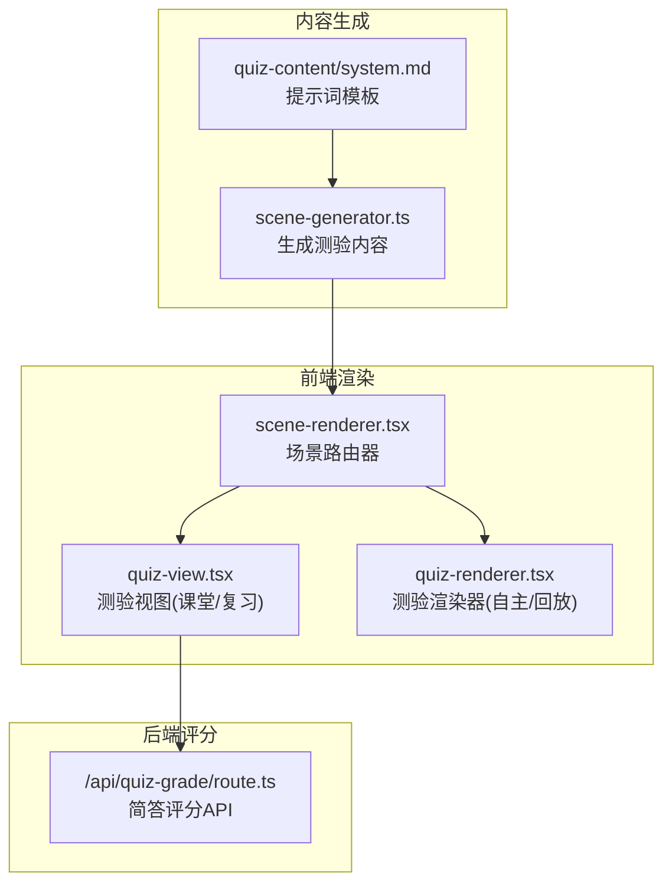
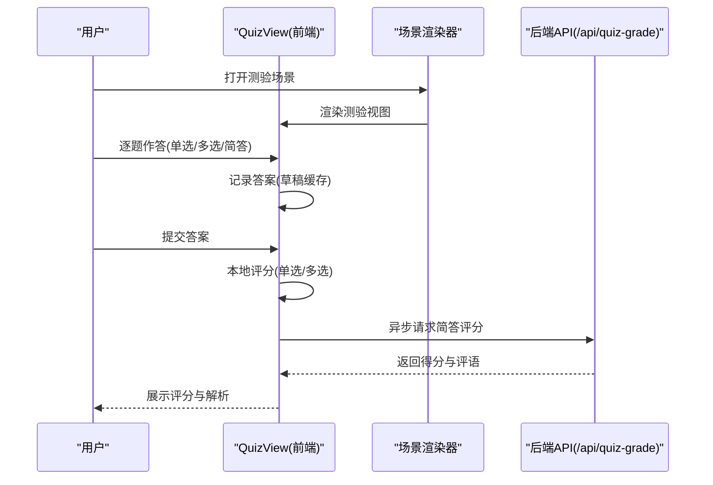
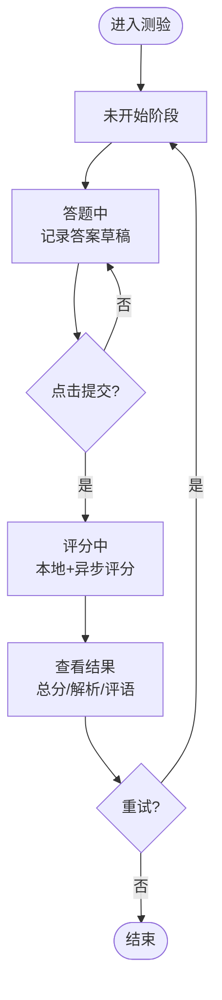
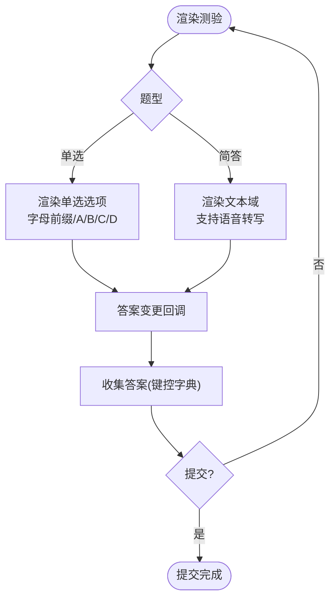
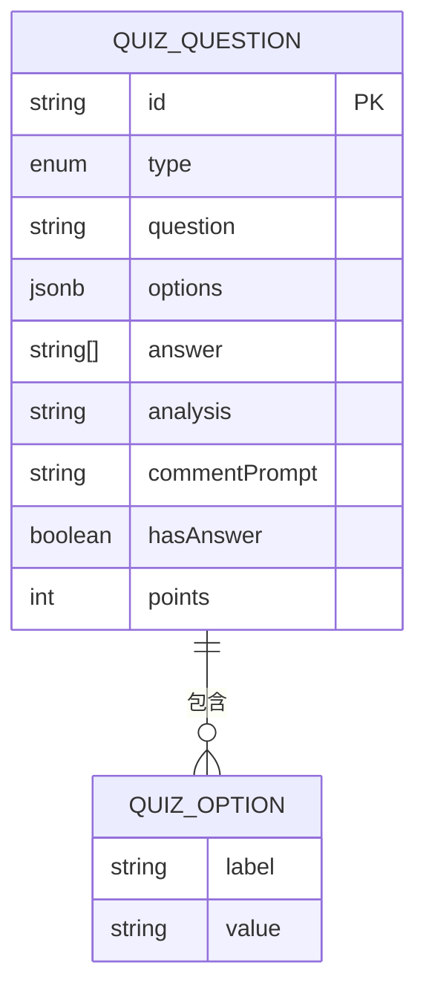
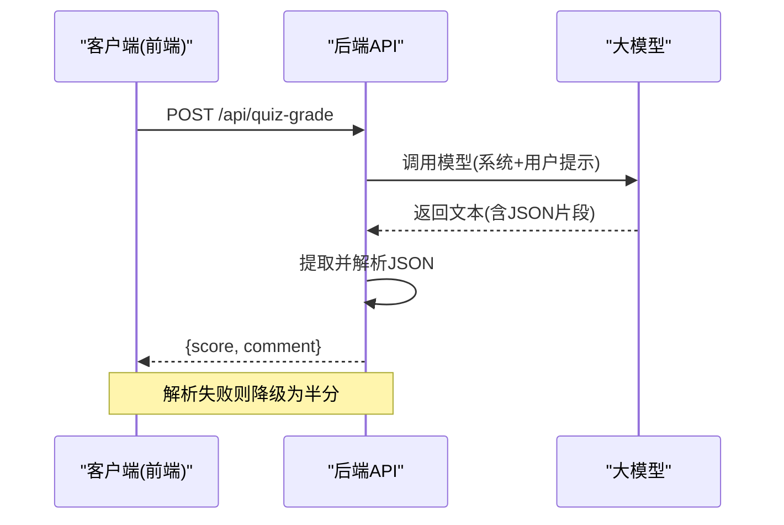
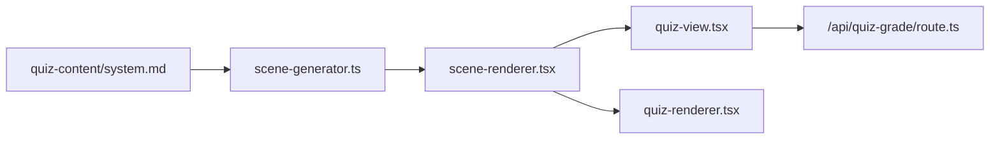

# 测验场景

<cite>
**本文引用的文件**
- [components/scene-renderers/quiz-view.tsx](file://components/scene-renderers/quiz-view.tsx)
- [components/scene-renderers/quiz-renderer.tsx](file://components/scene-renderers/quiz-renderer.tsx)
- [lib/types/stage.ts](file://lib/types/stage.ts)
- [app/api/quiz-grade/route.ts](file://app/api/quiz-grade/route.ts)
- [lib/generation/scene-generator.ts](file://lib/generation/scene-generator.ts)
- [lib/generation/prompts/templates/quiz-content/system.md](file://lib/generation/prompts/templates/quiz-content/system.md)
- [components/stage/scene-renderer.tsx](file://components/stage/scene-renderer.tsx)
- [app/classroom/[id]/page.tsx](file://app/classroom/[id]/page.tsx)
- [components/generation/outlines-editor.tsx](file://components/generation/outlines-editor.tsx)
</cite>

## 目录
1. [简介](#简介)
2. [项目结构](#项目结构)
3. [核心组件](#核心组件)
4. [架构总览](#架构总览)
5. [详细组件分析](#详细组件分析)
6. [依赖关系分析](#依赖关系分析)
7. [性能考量](#性能考量)
8. [故障排查指南](#故障排查指南)
9. [结论](#结论)
10. [附录](#附录)

## 简介
本章节面向 OpenMAIC 的“测验场景”，系统性阐述其交互式答题能力与数据模型设计，覆盖单选题、多选题与简答题三种题型；解释测验渲染器的状态机与答案收集、实时预览、提交与评分流程；梳理测验内容的数据结构与评分规则；并提供课堂中开展实时测验与反馈的实践案例。

## 项目结构
测验场景由“内容生成”“前端渲染”“后端评分”三部分协同构成：
- 内容生成：通过提示词模板与生成器产出标准化的测验数据结构，并对 AI 输出进行规范化处理。
- 前端渲染：提供两种体验模式的渲染器，分别用于课堂播放与自主练习；内置状态机与草稿缓存，支持实时预览与提交。
- 后端评分：针对简答题调用大模型进行自动评分与评语生成，提供本地单选/多选即时评分与异步简答评分的混合策略。

**图表来源**
- [lib/generation/scene-generator.ts:642-721](file://lib/generation/scene-generator.ts#L642-L721)
- [lib/generation/prompts/templates/quiz-content/system.md:1-143](file://lib/generation/prompts/templates/quiz-content/system.md#L1-L143)
- [components/stage/scene-renderer.tsx:15-32](file://components/stage/scene-renderer.tsx#L15-L32)
- [components/scene-renderers/quiz-view.tsx:688-725](file://components/scene-renderers/quiz-view.tsx#L688-L725)
- [components/scene-renderers/quiz-renderer.tsx:15-84](file://components/scene-renderers/quiz-renderer.tsx#L15-L84)
- [app/api/quiz-grade/route.ts:28-96](file://app/api/quiz-grade/route.ts#L28-L96)

**章节来源**
- [components/stage/scene-renderer.tsx:15-32](file://components/stage/scene-renderer.tsx#L15-L32)
- [lib/generation/scene-generator.ts:642-721](file://lib/generation/scene-generator.ts#L642-L721)

## 核心组件
- 测验视图（课堂/复习模式）
  - 负责测验生命周期管理（未开始/答题中/评分中/查看结果），维护答案与结果状态，提供草稿缓存与恢复。
  - 单选/多选即时本地评分，简答题异步调用后端 API 获取评分与评语。
- 测验渲染器（自主/回放模式）
  - 面向独立页面或回放场景，提供单选题的单选框与简答题的文本域，支持答案变更与提交按钮。
- 测验内容数据结构
  - 统一的题型、选项、正确答案、分析、评分点数等字段，支持 AI 输出的灵活格式归一化。
- 简答评分 API
  - 接收题目、答案、评分要点与总分，返回得分与评语；具备鲁棒的解析与降级策略。

**章节来源**
- [components/scene-renderers/quiz-view.tsx:688-725](file://components/scene-renderers/quiz-view.tsx#L688-L725)
- [components/scene-renderers/quiz-renderer.tsx:15-84](file://components/scene-renderers/quiz-renderer.tsx#L15-L84)
- [lib/types/stage.ts:76-96](file://lib/types/stage.ts#L76-L96)
- [app/api/quiz-grade/route.ts:28-96](file://app/api/quiz-grade/route.ts#L28-L96)

## 架构总览
测验场景采用“前端状态机 + 后端评分”的混合架构：
- 前端状态机驱动答题与评审流程，本地即时处理单选/多选，异步处理简答。
- 后端 API 作为简答评分的权威来源，提供统一的评分与评语输出。
- 内容生成阶段确保题型、选项、答案、分析、评分点数等字段完整且可被前端消费。

**图表来源**
- [components/stage/scene-renderer.tsx:15-32](file://components/stage/scene-renderer.tsx#L15-L32)
- [components/scene-renderers/quiz-view.tsx:738-777](file://components/scene-renderers/quiz-view.tsx#L738-L777)
- [app/api/quiz-grade/route.ts:28-96](file://app/api/quiz-grade/route.ts#L28-L96)

## 详细组件分析

### 测验视图（课堂/复习模式）
- 状态机与生命周期
  - 阶段：未开始 → 答题中 → 评分中 → 查看结果
  - 草稿缓存：按场景隔离的答案草稿，进入答题态时自动恢复
  - 全部作答校验：确保每道题均有有效答案才允许提交
- 评分策略
  - 单选/多选：本地即时评分，基于集合相等判断
  - 简答题：并发调用后端 API，按阈值判定是否及格，返回得分与评语
  - 降级策略：API 失败时返回半分并提示服务不可用
- 结果呈现
  - 总分/百分比环形图、正确/错误计数、题目级分析与 AI 评语

**图表来源**
- [components/scene-renderers/quiz-view.tsx:688-725](file://components/scene-renderers/quiz-view.tsx#L688-L725)
- [components/scene-renderers/quiz-view.tsx:738-777](file://components/scene-renderers/quiz-view.tsx#L738-L777)
- [components/scene-renderers/quiz-view.tsx:82-136](file://components/scene-renderers/quiz-view.tsx#L82-L136)

**章节来源**
- [components/scene-renderers/quiz-view.tsx:688-725](file://components/scene-renderers/quiz-view.tsx#L688-L725)
- [components/scene-renderers/quiz-view.tsx:718-725](file://components/scene-renderers/quiz-view.tsx#L718-L725)
- [components/scene-renderers/quiz-view.tsx:738-777](file://components/scene-renderers/quiz-view.tsx#L738-L777)
- [components/scene-renderers/quiz-view.tsx:82-136](file://components/scene-renderers/quiz-view.tsx#L82-L136)

### 测验渲染器（自主/回放模式）
- 功能定位
  - 自主练习与回放场景的简化渲染器，支持单选题与简答题输入
- 交互细节
  - 单选题：单选框，字母前缀选项，选中态高亮
  - 简答题：文本域，支持语音转写追加
  - 提交按钮：仅在自主模式显示

**图表来源**
- [components/scene-renderers/quiz-renderer.tsx:15-84](file://components/scene-renderers/quiz-renderer.tsx#L15-L84)

**章节来源**
- [components/scene-renderers/quiz-renderer.tsx:15-84](file://components/scene-renderers/quiz-renderer.tsx#L15-L84)

### 测验内容数据结构与生成
- 数据结构
  - 题目对象包含：题型、问题文本、选项、正确答案、分析、评分要点、是否可自动评分、题号等
  - 选项对象包含：显示标签与选择值（如 A/B/C/D）
- 生成与归一化
  - 通过提示词模板生成 JSON 数组，随后对选项与答案进行归一化处理，保证前端渲染一致性
  - 支持 AI 输出多种字段名与格式，统一封装为内部结构

**图表来源**
- [lib/types/stage.ts:76-96](file://lib/types/stage.ts#L76-L96)
- [lib/generation/scene-generator.ts:686-721](file://lib/generation/scene-generator.ts#L686-L721)

**章节来源**
- [lib/types/stage.ts:76-96](file://lib/types/stage.ts#L76-L96)
- [lib/generation/scene-generator.ts:666-721](file://lib/generation/scene-generator.ts#L666-L721)
- [lib/generation/prompts/templates/quiz-content/system.md:1-143](file://lib/generation/prompts/templates/quiz-content/system.md#L1-L143)

### 简答评分 API
- 请求参数
  - 题目、学生答案、总分、评分要点、语言
- 评分逻辑
  - 按语言构造系统提示词与用户提示词
  - 调用大模型生成 JSON 格式的分数与评语
  - 解析失败时降级为半分并返回通用提示
- 错误处理
  - 返回统一的错误响应与日志记录

**图表来源**
- [app/api/quiz-grade/route.ts:28-96](file://app/api/quiz-grade/route.ts#L28-L96)

**章节来源**
- [app/api/quiz-grade/route.ts:28-96](file://app/api/quiz-grade/route.ts#L28-L96)

## 依赖关系分析
- 场景渲染器根据场景类型动态选择渲染器，测验场景绑定测验视图组件
- 测验视图依赖草稿缓存钩子、国际化与模型配置工具
- 简答题评分依赖后端 API，单选/多选评分在前端本地完成
- 内容生成依赖提示词模板与生成器，输出标准化测验数据

**图表来源**
- [components/stage/scene-renderer.tsx:15-32](file://components/stage/scene-renderer.tsx#L15-L32)
- [components/scene-renderers/quiz-view.tsx:688-725](file://components/scene-renderers/quiz-view.tsx#L688-L725)
- [components/scene-renderers/quiz-renderer.tsx:15-84](file://components/scene-renderers/quiz-renderer.tsx#L15-L84)
- [app/api/quiz-grade/route.ts:28-96](file://app/api/quiz-grade/route.ts#L28-L96)
- [lib/generation/scene-generator.ts:642-721](file://lib/generation/scene-generator.ts#L642-L721)
- [lib/generation/prompts/templates/quiz-content/system.md:1-143](file://lib/generation/prompts/templates/quiz-content/system.md#L1-L143)

**章节来源**
- [components/stage/scene-renderer.tsx:15-32](file://components/stage/scene-renderer.tsx#L15-L32)
- [components/scene-renderers/quiz-view.tsx:688-725](file://components/scene-renderers/quiz-view.tsx#L688-L725)
- [components/scene-renderers/quiz-renderer.tsx:15-84](file://components/scene-renderers/quiz-renderer.tsx#L15-L84)
- [app/api/quiz-grade/route.ts:28-96](file://app/api/quiz-grade/route.ts#L28-L96)
- [lib/generation/scene-generator.ts:642-721](file://lib/generation/scene-generator.ts#L642-L721)

## 性能考量
- 本地评分优先：单选/多选即时完成，减少网络往返
- 并发简答评分：多道简答题并行请求后端 API，缩短整体等待时间
- 草稿缓存：按场景隔离的答案草稿，避免重复输入与丢失
- 动画与过渡：使用轻量动画提升交互体验，避免过度消耗资源

## 故障排查指南
- 简答评分失败
  - 现象：简答题无评分或提示服务不可用
  - 排查：检查后端 API 是否可达、模型配置头是否正确、响应 JSON 是否可解析
  - 参考路径：[app/api/quiz-grade/route.ts:28-96](file://app/api/quiz-grade/route.ts#L28-L96)
- 答案无法恢复
  - 现象：进入测验后未恢复之前作答
  - 排查：确认草稿缓存键是否按场景 ID 隔离、组件是否在未开始阶段触发恢复逻辑
  - 参考路径：[components/scene-renderers/quiz-view.tsx:694-711](file://components/scene-renderers/quiz-view.tsx#L694-L711)
- 选项或答案不一致
  - 现象：选项值与答案不匹配
  - 排查：确认生成器对选项与答案的归一化逻辑是否生效
  - 参考路径：[lib/generation/scene-generator.ts:686-721](file://lib/generation/scene-generator.ts#L686-L721)

**章节来源**
- [app/api/quiz-grade/route.ts:28-96](file://app/api/quiz-grade/route.ts#L28-L96)
- [components/scene-renderers/quiz-view.tsx:694-711](file://components/scene-renderers/quiz-view.tsx#L694-L711)
- [lib/generation/scene-generator.ts:686-721](file://lib/generation/scene-generator.ts#L686-L721)

## 结论
测验场景通过清晰的前端状态机、完善的草稿缓存与混合评分策略，实现了课堂中的高效互动测验。内容生成阶段确保数据结构稳定与可扩展，后端 API 为简答题提供可靠的自动评分能力。该方案既满足教学即时反馈需求，又具备良好的可维护性与扩展空间。

## 附录

### 使用案例与最佳实践
- 创建不同题型的测验
  - 在大纲编辑器中设置题目数量、难度与题型（单选/多选/简答），由生成器产出标准化内容
  - 参考路径：[components/generation/outlines-editor.tsx:185-267](file://components/generation/outlines-editor.tsx#L185-L267)
- 配置自动评分系统
  - 单选/多选：由前端本地评分；简答题：在提示词中提供评分要点（commentPrompt），后端按阈值判定及格
  - 参考路径：[lib/generation/prompts/templates/quiz-content/system.md:1-143](file://lib/generation/prompts/templates/quiz-content/system.md#L1-L143)，[app/api/quiz-grade/route.ts:28-96](file://app/api/quiz-grade/route.ts#L28-L96)
- 课堂实时测验与反馈
  - 使用测验视图组件承载答题与评审流程，利用草稿缓存与本地评分提升流畅度
  - 参考路径：[components/scene-renderers/quiz-view.tsx:688-777](file://components/scene-renderers/quiz-view.tsx#L688-L777)
- 回放与自主练习
  - 使用测验渲染器在回放或独立页面中进行练习，支持语音转写辅助简答
  - 参考路径：[components/scene-renderers/quiz-renderer.tsx:15-84](file://components/scene-renderers/quiz-renderer.tsx#L15-L84)