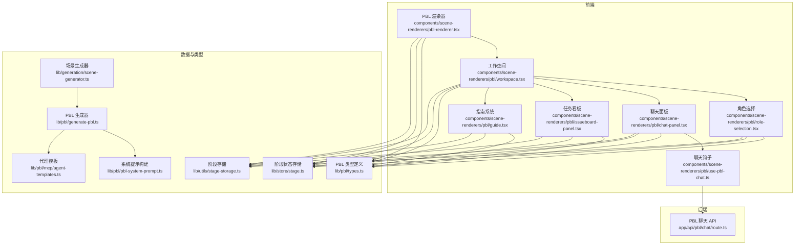
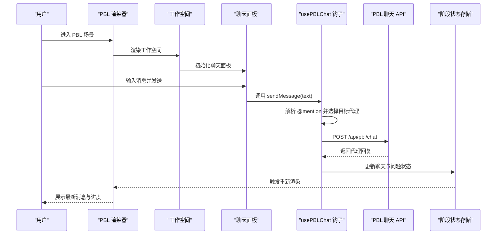
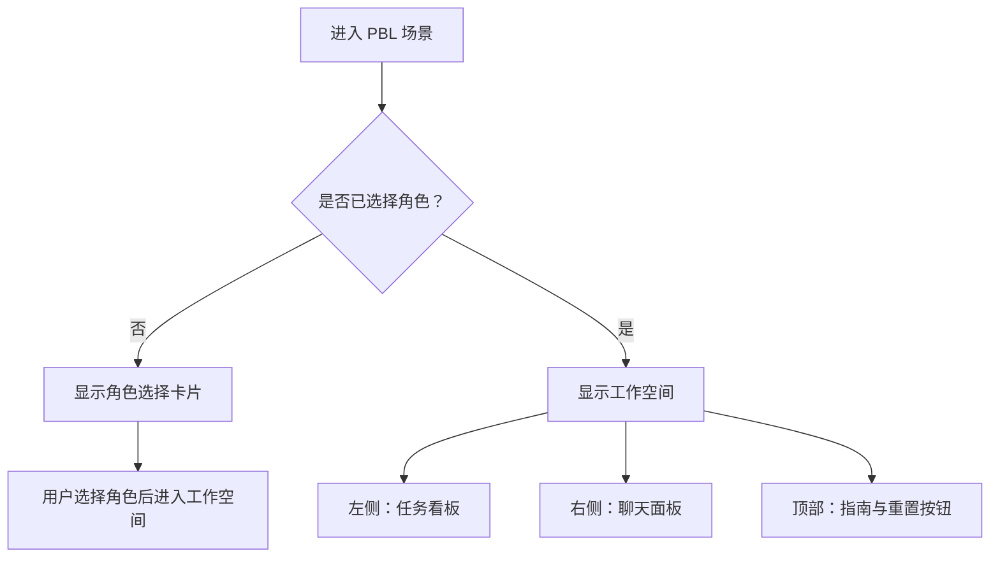
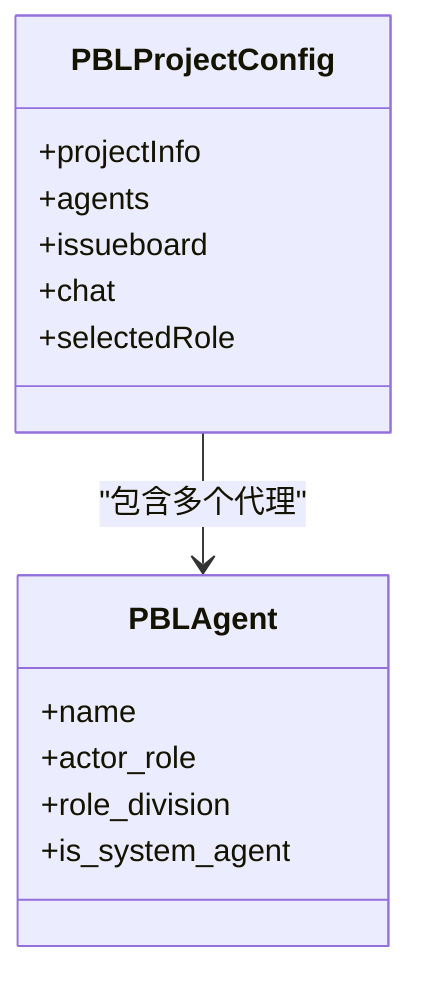
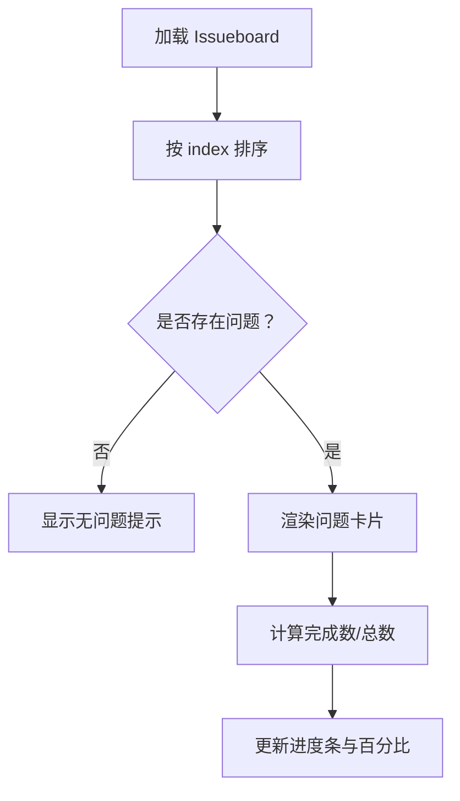
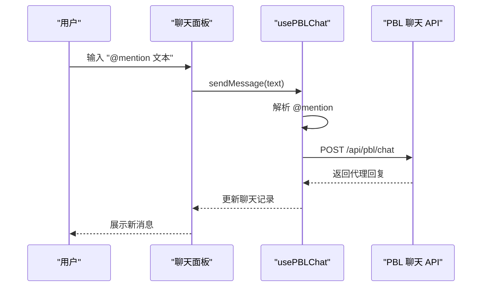
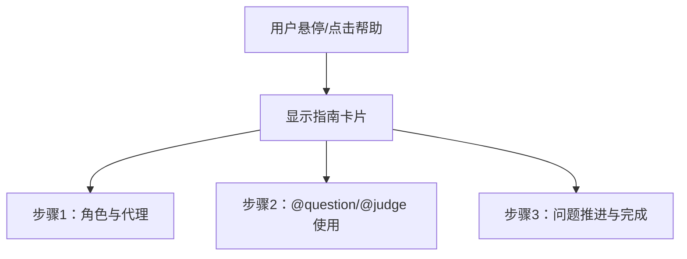
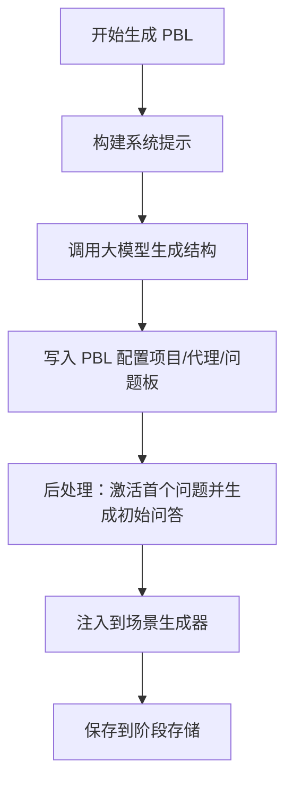
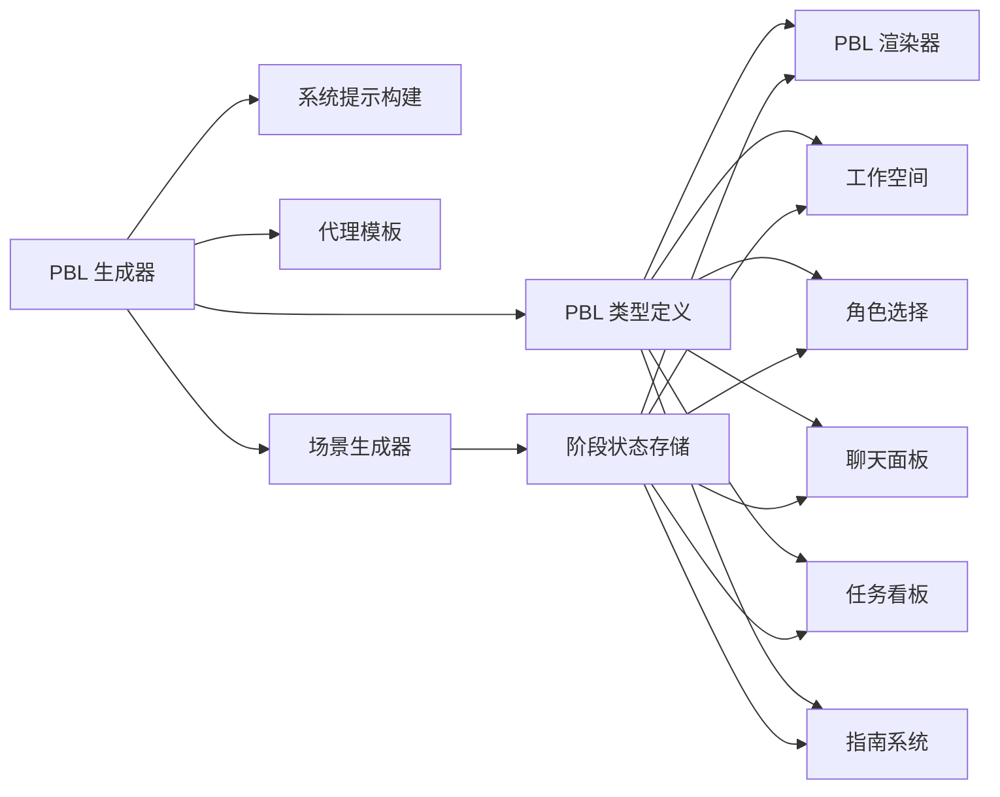

# 项目式学习场景

<cite>
**本文引用的文件**
- [app/page.tsx](file://app/page.tsx)
- [app/classroom/[id]/page.tsx](file://app/classroom/[id]/page.tsx)
- [components/scene-renderers/pbl-renderer.tsx](file://components/scene-renderers/pbl-renderer.tsx)
- [components/scene-renderers/pbl/workspace.tsx](file://components/scene-renderers/pbl/workspace.tsx)
- [components/scene-renderers/pbl/role-selection.tsx](file://components/scene-renderers/pbl/role-selection.tsx)
- [components/scene-renderers/pbl/chat-panel.tsx](file://components/scene-renderers/pbl/chat-panel.tsx)
- [components/scene-renderers/pbl/issueboard-panel.tsx](file://components/scene-renderers/pbl/issueboard-panel.tsx)
- [components/scene-renderers/pbl/guide.tsx](file://components/scene-renderers/pbl/guide.tsx)
- [components/scene-renderers/pbl/use-pbl-chat.ts](file://components/scene-renderers/pbl/use-pbl-chat.ts)
- [app/api/pbl/chat/route.ts](file://app/api/pbl/chat/route.ts)
- [lib/pbl/types.ts](file://lib/pbl/types.ts)
- [lib/pbl/generate-pbl.ts](file://lib/pbl/generate-pbl.ts)
- [lib/pbl/pbl-system-prompt.ts](file://lib/pbl/pbl-system-prompt.ts)
- [lib/pbl/mcp/agent-templates.ts](file://lib/pbl/mcp/agent-templates.ts)
- [lib/generation/scene-generator.ts](file://lib/generation/scene-generator.ts)
- [lib/store/stage.ts](file://lib/store/stage.ts)
- [lib/utils/stage-storage.ts](file://lib/utils/stage-storage.ts)
</cite>

## 目录
1. [简介](#简介)
2. [项目结构](#项目结构)
3. [核心组件](#核心组件)
4. [架构总览](#架构总览)
5. [详细组件分析](#详细组件分析)
6. [依赖关系分析](#依赖关系分析)
7. [性能考量](#性能考量)
8. [故障排查指南](#故障排查指南)
9. [结论](#结论)
10. [附录](#附录)

## 简介
本文件面向 OpenMAIC 的项目式学习（PBL）场景，系统性阐述协作学习功能与工作空间设计，包括角色扮演、任务分配、进度跟踪与团队协作机制；解释工作空间的任务看板、聊天面板、指南系统等模块的集成方式；说明角色选择系统（角色权限、职责与交互）；并提供课堂组织与实施的使用案例与最佳实践。

## 项目结构
OpenMAIC 将 PBL 场景渲染器与运行时聊天 API 分离：前端通过 PBL 渲染器挂载工作空间，后端提供 PBL 聊天 API 处理 @mention 路由与智能体响应生成。项目还包含 PBL 结构生成工具链，用于自动生成项目配置（含问题清单、代理角色、初始问答等），并通过场景生成器嵌入到课程阶段（Stage）中。

图表来源
- [components/scene-renderers/pbl-renderer.tsx:17-128](file://components/scene-renderers/pbl-renderer.tsx#L17-L128)
- [components/scene-renderers/pbl/workspace.tsx:19-92](file://components/scene-renderers/pbl/workspace.tsx#L19-L92)
- [components/scene-renderers/pbl/role-selection.tsx:13-63](file://components/scene-renderers/pbl/role-selection.tsx#L13-L63)
- [components/scene-renderers/pbl/chat-panel.tsx:19-151](file://components/scene-renderers/pbl/chat-panel.tsx#L19-L151)
- [components/scene-renderers/pbl/issueboard-panel.tsx:10-48](file://components/scene-renderers/pbl/issueboard-panel.tsx#L10-L48)
- [components/scene-renderers/pbl/guide.tsx:11-66](file://components/scene-renderers/pbl/guide.tsx#L11-L66)
- [components/scene-renderers/pbl/use-pbl-chat.ts:21-129](file://components/scene-renderers/pbl/use-pbl-chat.ts#L21-L129)
- [app/api/pbl/chat/route.ts:25-74](file://app/api/pbl/chat/route.ts#L25-L74)
- [lib/pbl/types.ts:63-69](file://lib/pbl/types.ts#L63-L69)
- [lib/pbl/generate-pbl.ts:49-325](file://lib/pbl/generate-pbl.ts#L49-L325)
- [lib/pbl/pbl-system-prompt.ts:16-40](file://lib/pbl/pbl-system-prompt.ts#L16-L40)
- [lib/pbl/mcp/agent-templates.ts:7-19](file://lib/pbl/mcp/agent-templates.ts#L7-L19)
- [lib/generation/scene-generator.ts:835-866](file://lib/generation/scene-generator.ts#L835-L866)
- [lib/store/stage.ts:98-323](file://lib/store/stage.ts#L98-L323)
- [lib/utils/stage-storage.ts:36-53](file://lib/utils/stage-storage.ts#L36-L53)

章节来源
- [components/scene-renderers/pbl-renderer.tsx:17-128](file://components/scene-renderers/pbl-renderer.tsx#L17-L128)
- [components/scene-renderers/pbl/workspace.tsx:19-92](file://components/scene-renderers/pbl/workspace.tsx#L19-L92)
- [components/scene-renderers/pbl/role-selection.tsx:13-63](file://components/scene-renderers/pbl/role-selection.tsx#L13-L63)
- [components/scene-renderers/pbl/chat-panel.tsx:19-151](file://components/scene-renderers/pbl/chat-panel.tsx#L19-L151)
- [components/scene-renderers/pbl/issueboard-panel.tsx:10-48](file://components/scene-renderers/pbl/issueboard-panel.tsx#L10-L48)
- [components/scene-renderers/pbl/guide.tsx:11-66](file://components/scene-renderers/pbl/guide.tsx#L11-L66)
- [components/scene-renderers/pbl/use-pbl-chat.ts:21-129](file://components/scene-renderers/pbl/use-pbl-chat.ts#L21-L129)
- [app/api/pbl/chat/route.ts:25-74](file://app/api/pbl/chat/route.ts#L25-L74)
- [lib/pbl/types.ts:63-69](file://lib/pbl/types.ts#L63-L69)
- [lib/pbl/generate-pbl.ts:49-325](file://lib/pbl/generate-pbl.ts#L49-L325)
- [lib/pbl/pbl-system-prompt.ts:16-40](file://lib/pbl/pbl-system-prompt.ts#L16-L40)
- [lib/pbl/mcp/agent-templates.ts:7-19](file://lib/pbl/mcp/agent-templates.ts#L7-L19)
- [lib/generation/scene-generator.ts:835-866](file://lib/generation/scene-generator.ts#L835-L866)
- [lib/store/stage.ts:98-323](file://lib/store/stage.ts#L98-L323)
- [lib/utils/stage-storage.ts:36-53](file://lib/utils/stage-storage.ts#L36-L53)

## 核心组件
- PBL 渲染器：根据项目配置决定显示“角色选择”或“工作空间”，并负责更新阶段内的 PBL 配置。
- 工作空间：左右布局，左侧任务看板（Issueboard），右侧聊天面板，顶部包含指南入口与返回重置按钮。
- 角色选择：仅展示非系统开发类角色卡片，点击进入对应角色。
- 聊天面板：支持草稿缓存、语音输入、@mention 提及问题/评判代理、加载态指示。
- 任务看板：按索引排序展示问题卡片，标注完成/激活/待处理状态与进度条。
- 指南系统：内联帮助与工作区工具栏帮助，分步骤说明 PBL 流程。
- 聊天钩子：解析 @mention、调用后端 API、处理问题完成后的自动推进与欢迎消息。
- 后端聊天 API：基于模型配置与当前议题上下文生成响应，区分问题代理与评判代理。
- 类型与生成：统一的 PBL 数据结构、系统提示构建、代理模板、场景生成器与阶段存储。

章节来源
- [components/scene-renderers/pbl-renderer.tsx:17-128](file://components/scene-renderers/pbl-renderer.tsx#L17-L128)
- [components/scene-renderers/pbl/workspace.tsx:19-92](file://components/scene-renderers/pbl/workspace.tsx#L19-L92)
- [components/scene-renderers/pbl/role-selection.tsx:13-63](file://components/scene-renderers/pbl/role-selection.tsx#L13-L63)
- [components/scene-renderers/pbl/chat-panel.tsx:19-151](file://components/scene-renderers/pbl/chat-panel.tsx#L19-L151)
- [components/scene-renderers/pbl/issueboard-panel.tsx:10-48](file://components/scene-renderers/pbl/issueboard-panel.tsx#L10-L48)
- [components/scene-renderers/pbl/guide.tsx:11-66](file://components/scene-renderers/pbl/guide.tsx#L11-L66)
- [components/scene-renderers/pbl/use-pbl-chat.ts:21-129](file://components/scene-renderers/pbl/use-pbl-chat.ts#L21-L129)
- [app/api/pbl/chat/route.ts:25-74](file://app/api/pbl/chat/route.ts#L25-L74)
- [lib/pbl/types.ts:63-69](file://lib/pbl/types.ts#L63-L69)

## 架构总览
下图展示了从用户进入 PBL 场景到消息流转与状态更新的关键路径，涵盖前端渲染、聊天钩子、后端 API 与阶段状态存储。

图表来源
- [components/scene-renderers/pbl-renderer.tsx:17-128](file://components/scene-renderers/pbl-renderer.tsx#L17-L128)
- [components/scene-renderers/pbl/workspace.tsx:28-32](file://components/scene-renderers/pbl/workspace.tsx#L28-L32)
- [components/scene-renderers/pbl/chat-panel.tsx:58-63](file://components/scene-renderers/pbl/chat-panel.tsx#L58-L63)
- [components/scene-renderers/pbl/use-pbl-chat.ts:29-129](file://components/scene-renderers/pbl/use-pbl-chat.ts#L29-L129)
- [app/api/pbl/chat/route.ts:25-74](file://app/api/pbl/chat/route.ts#L25-L74)
- [lib/store/stage.ts:98-323](file://lib/store/stage.ts#L98-L323)

## 详细组件分析

### 组件一：PBL 渲染器与工作空间
- 渲染器根据项目配置决定显示角色选择或工作空间，并提供重置功能以重启项目。
- 工作空间采用左右布局：左侧任务看板占约 35%，右侧聊天面板占约 65%；顶部提供返回重置与指南入口。

图表来源
- [components/scene-renderers/pbl-renderer.tsx:108-127](file://components/scene-renderers/pbl-renderer.tsx#L108-L127)
- [components/scene-renderers/pbl/workspace.tsx:34-91](file://components/scene-renderers/pbl/workspace.tsx#L34-L91)

章节来源
- [components/scene-renderers/pbl-renderer.tsx:17-128](file://components/scene-renderers/pbl-renderer.tsx#L17-L128)
- [components/scene-renderers/pbl/workspace.tsx:19-92](file://components/scene-renderers/pbl/workspace.tsx#L19-L92)

### 组件二：角色选择系统
- 仅展示非系统开发类角色卡片，卡片包含角色名与演员角色描述，点击后进入该角色。
- 角色卡片来源于项目配置中的代理列表，过滤掉系统代理与非开发分工的角色。

图表来源
- [lib/pbl/types.ts:63-69](file://lib/pbl/types.ts#L63-L69)
- [lib/pbl/types.ts:16-27](file://lib/pbl/types.ts#L16-L27)
- [components/scene-renderers/pbl/role-selection.tsx:17-19](file://components/scene-renderers/pbl/role-selection.tsx#L17-L19)

章节来源
- [components/scene-renderers/pbl/role-selection.tsx:13-63](file://components/scene-renderers/pbl/role-selection.tsx#L13-L63)
- [lib/pbl/types.ts:16-27](file://lib/pbl/types.ts#L16-L27)
- [lib/pbl/types.ts:63-69](file://lib/pbl/types.ts#L63-L69)

### 组件三：任务看板（Issueboard）
- 按索引升序排列问题卡片，展示标题、描述与负责人；状态分为“完成/激活/待处理”，并显示整体进度百分比。
- 支持空状态提示与无问题时的占位文本。

图表来源
- [components/scene-renderers/pbl/issueboard-panel.tsx:10-48](file://components/scene-renderers/pbl/issueboard-panel.tsx#L10-L48)
- [components/scene-renderers/pbl/issueboard-panel.tsx:51-84](file://components/scene-renderers/pbl/issueboard-panel.tsx#L51-L84)

章节来源
- [components/scene-renderers/pbl/issueboard-panel.tsx:10-48](file://components/scene-renderers/pbl/issueboard-panel.tsx#L10-L48)
- [components/scene-renderers/pbl/issueboard-panel.tsx:51-84](file://components/scene-renderers/pbl/issueboard-panel.tsx#L51-L84)

### 组件四：聊天面板与 @mention 路由
- 支持草稿缓存、语音输入、多行输入与回车发送；@mention 语法支持直接提及代理名、@question 或 @judge。
- 默认路由至问题代理；当消息以 @judge 提及评判代理时，依据议题上下文生成相应回复。

图表来源
- [components/scene-renderers/pbl/chat-panel.tsx:58-63](file://components/scene-renderers/pbl/chat-panel.tsx#L58-L63)
- [components/scene-renderers/pbl/use-pbl-chat.ts:29-129](file://components/scene-renderers/pbl/use-pbl-chat.ts#L29-L129)
- [app/api/pbl/chat/route.ts:25-74](file://app/api/pbl/chat/route.ts#L25-L74)

章节来源
- [components/scene-renderers/pbl/chat-panel.tsx:19-151](file://components/scene-renderers/pbl/chat-panel.tsx#L19-L151)
- [components/scene-renderers/pbl/use-pbl-chat.ts:21-129](file://components/scene-renderers/pbl/use-pbl-chat.ts#L21-L129)
- [app/api/pbl/chat/route.ts:25-74](file://app/api/pbl/chat/route.ts#L25-L74)

### 组件五：指南系统
- 内联帮助：角色选择页下方提供“如何运作”的悬浮卡片，展示三步流程。
- 工具栏帮助：工作区顶部工具栏提供帮助按钮，展开更详细的流程说明与示例。

图表来源
- [components/scene-renderers/pbl/guide.tsx:11-66](file://components/scene-renderers/pbl/guide.tsx#L11-L66)

章节来源
- [components/scene-renderers/pbl/guide.tsx:11-66](file://components/scene-renderers/pbl/guide.tsx#L11-L66)

### 组件六：PBL 生成与系统提示
- 生成器通过多轮对话与工具调用构建 PBL 结构：项目信息、代理、问题板与初始问答。
- 系统提示根据语言与目标技能动态生成，确保跨语言一致性。
- 场景生成器将 PBL 配置注入到课程阶段（Stage）中，便于持久化与复用。

图表来源
- [lib/pbl/generate-pbl.ts:49-325](file://lib/pbl/generate-pbl.ts#L49-L325)
- [lib/pbl/pbl-system-prompt.ts:16-40](file://lib/pbl/pbl-system-prompt.ts#L16-L40)
- [lib/generation/scene-generator.ts:835-866](file://lib/generation/scene-generator.ts#L835-L866)
- [lib/utils/stage-storage.ts:36-53](file://lib/utils/stage-storage.ts#L36-L53)

章节来源
- [lib/pbl/generate-pbl.ts:49-325](file://lib/pbl/generate-pbl.ts#L49-L325)
- [lib/pbl/pbl-system-prompt.ts:16-40](file://lib/pbl/pbl-system-prompt.ts#L16-L40)
- [lib/generation/scene-generator.ts:835-866](file://lib/generation/scene-generator.ts#L835-L866)
- [lib/utils/stage-storage.ts:36-53](file://lib/utils/stage-storage.ts#L36-L53)

## 依赖关系分析
- 渲染层依赖类型定义与阶段状态存储，确保配置变更可持久化。
- 聊天钩子依赖模型配置与后端 API，实现消息路由与智能体交互。
- 生成器依赖系统提示与代理模板，形成一致的 PBL 结构与行为。

图表来源
- [lib/pbl/types.ts:63-69](file://lib/pbl/types.ts#L63-L69)
- [components/scene-renderers/pbl-renderer.tsx:17-128](file://components/scene-renderers/pbl-renderer.tsx#L17-L128)
- [components/scene-renderers/pbl/workspace.tsx:19-92](file://components/scene-renderers/pbl/workspace.tsx#L19-L92)
- [components/scene-renderers/pbl/role-selection.tsx:13-63](file://components/scene-renderers/pbl/role-selection.tsx#L13-L63)
- [components/scene-renderers/pbl/chat-panel.tsx:19-151](file://components/scene-renderers/pbl/chat-panel.tsx#L19-L151)
- [components/scene-renderers/pbl/issueboard-panel.tsx:10-48](file://components/scene-renderers/pbl/issueboard-panel.tsx#L10-L48)
- [components/scene-renderers/pbl/guide.tsx:11-66](file://components/scene-renderers/pbl/guide.tsx#L11-L66)
- [lib/store/stage.ts:98-323](file://lib/store/stage.ts#L98-L323)
- [lib/pbl/generate-pbl.ts:49-325](file://lib/pbl/generate-pbl.ts#L49-L325)
- [lib/pbl/pbl-system-prompt.ts:16-40](file://lib/pbl/pbl-system-prompt.ts#L16-L40)
- [lib/pbl/mcp/agent-templates.ts:7-19](file://lib/pbl/mcp/agent-templates.ts#L7-L19)
- [lib/generation/scene-generator.ts:835-866](file://lib/generation/scene-generator.ts#L835-L866)

章节来源
- [lib/pbl/types.ts:63-69](file://lib/pbl/types.ts#L63-L69)
- [lib/store/stage.ts:98-323](file://lib/store/stage.ts#L98-L323)
- [lib/pbl/generate-pbl.ts:49-325](file://lib/pbl/generate-pbl.ts#L49-L325)
- [lib/generation/scene-generator.ts:835-866](file://lib/generation/scene-generator.ts#L835-L866)

## 性能考量
- 聊天钩子对模型请求头进行统一组装，避免重复序列化与多余网络往返。
- 任务看板按索引排序与进度计算为 O(n)；消息滚动采用平滑动画，避免频繁重排。
- 阶段存储采用防抖保存策略，减少频繁写入数据库造成的性能损耗。
- 生成器在多轮对话中限制最大步数，防止长对话导致的延迟与资源占用。

## 故障排查指南
- 聊天 API 返回错误：检查模型配置头（模型字符串、API Key、基础地址、提供商类型）是否正确传递。
- 问题无法推进：确认当前议题的评判代理名称与消息中 @judge 是否匹配；检查代理回复中是否包含“COMPLETE”且不含“NEEDS_REVISION”。
- 本地存储异常：若 IndexedDB 读取失败，页面会尝试从服务端拉取教室数据；若仍失败，请检查网络与服务端接口可用性。
- 生成不完整：若生成未达到 idle 模式，需检查系统提示与工具调用是否被正确触发。

章节来源
- [app/api/pbl/chat/route.ts:25-74](file://app/api/pbl/chat/route.ts#L25-L74)
- [components/scene-renderers/pbl/use-pbl-chat.ts:164-272](file://components/scene-renderers/pbl/use-pbl-chat.ts#L164-L272)
- [app/classroom/[id]/page.tsx](file://app/classroom/[id]/page.tsx#L34-L58)
- [lib/pbl/generate-pbl.ts:311-315](file://lib/pbl/generate-pbl.ts#L311-L315)
- [lib/store/stage.ts:333-335](file://lib/store/stage.ts#L333-L335)

## 结论
OpenMAIC 的 PBL 场景通过清晰的前端渲染与后端 API 协作，实现了角色扮演、任务看板、聊天互动与进度推进的闭环。借助统一的数据类型与生成器，系统能够自动化产出项目结构并嵌入课程阶段，满足课堂组织与教学指导的需求。建议在实际教学中结合指南系统与阶段性评估，持续优化议题与代理配置，提升协作学习效果。

## 附录
- 使用案例与最佳实践
  - 组织项目式学习活动：教师在课程阶段中嵌入 PBL 场景，学生进入后先进行角色选择，再在工作空间中围绕议题开展协作。
  - 管理团队协作流程：利用任务看板跟踪进度，通过聊天面板进行问题讨论与知识共享；使用 @question 与 @judge 明确交互对象与评判标准。
  - 设置学习目标与评估标准：在议题中明确负责人、参与者与备注，结合代理生成的问题清单与评判反馈，形成过程性与结果性评价。
  - 课堂指导与监督：教师可通过查看聊天记录与任务完成情况，适时介入引导；利用指南系统帮助学生理解 PBL 流程与规范。