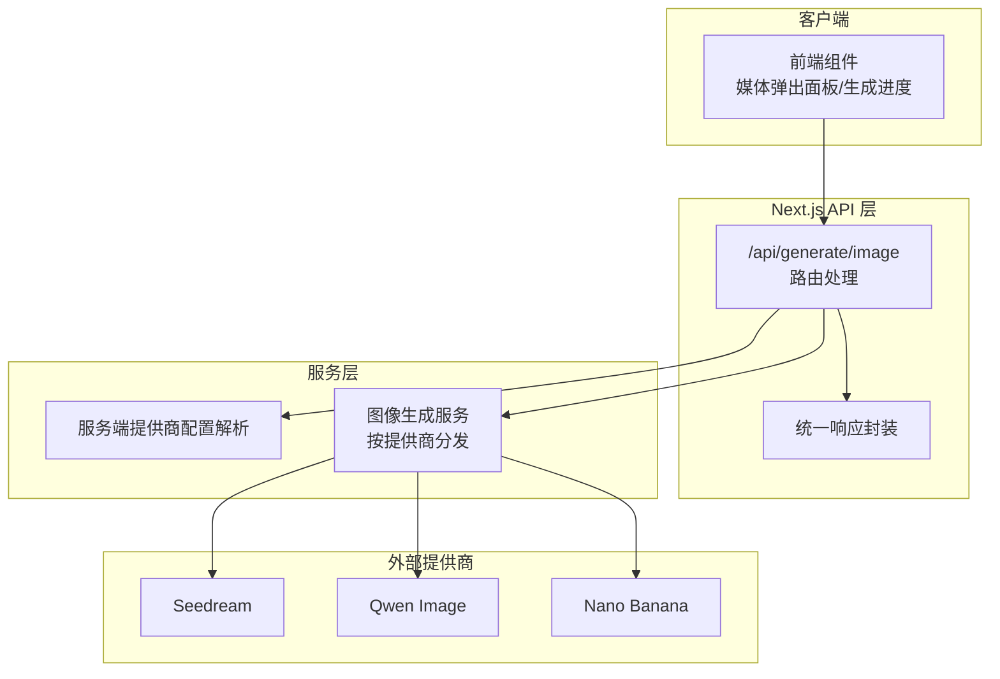
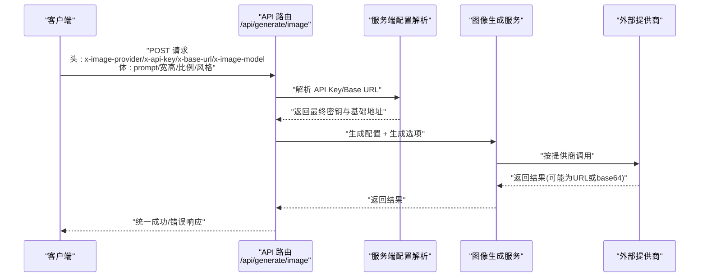
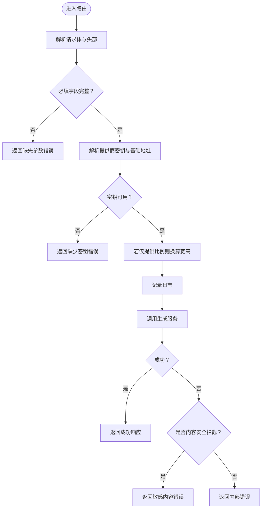
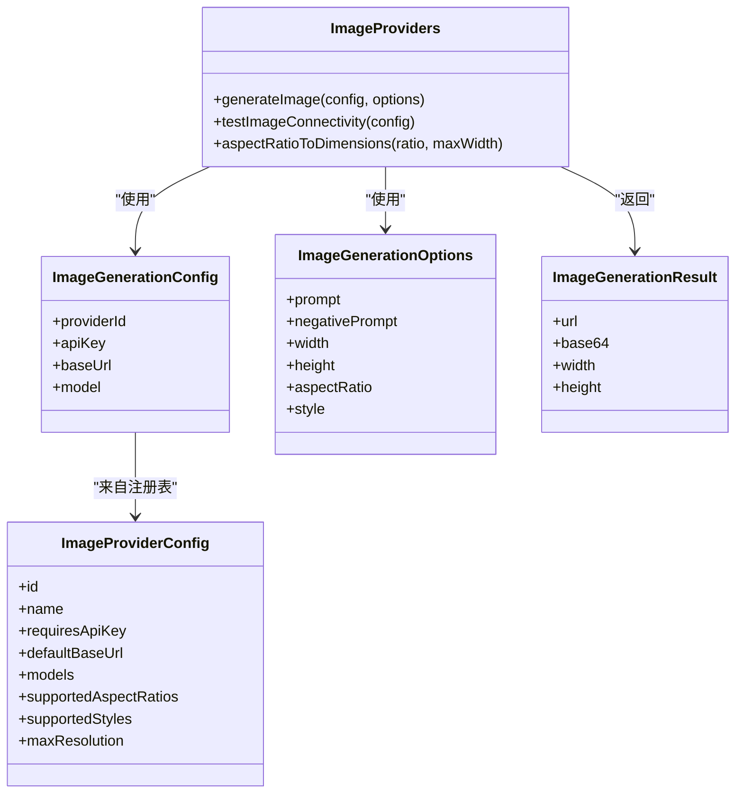
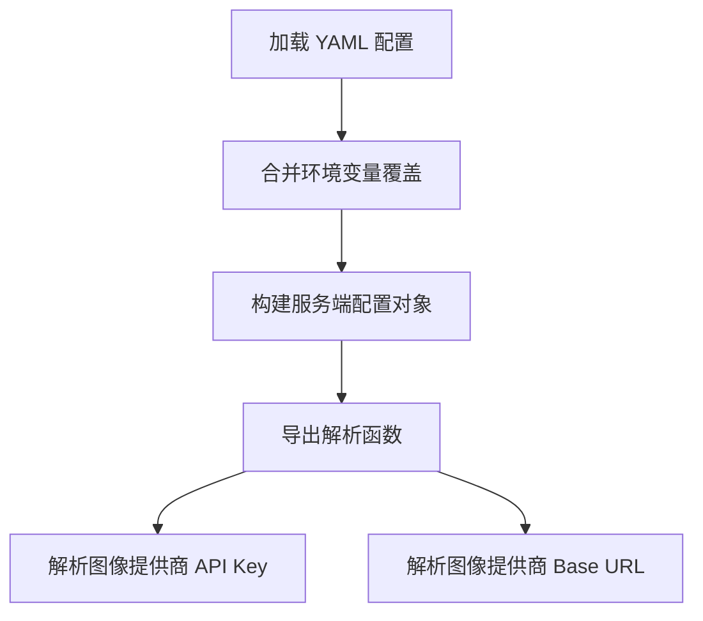
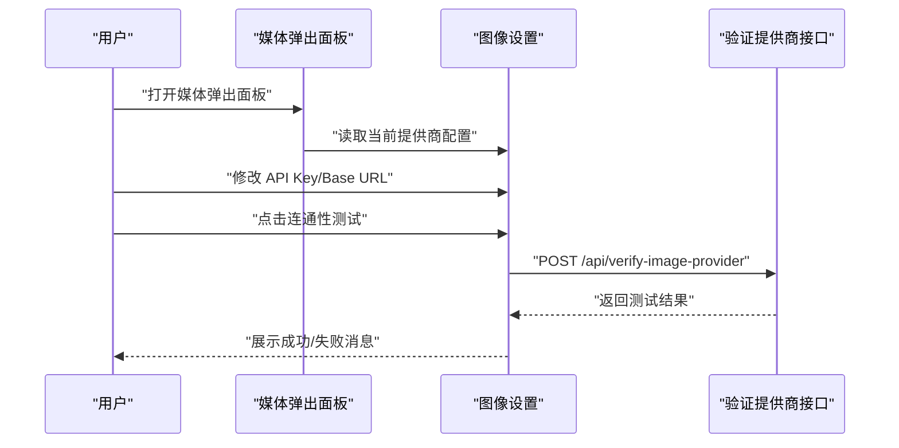
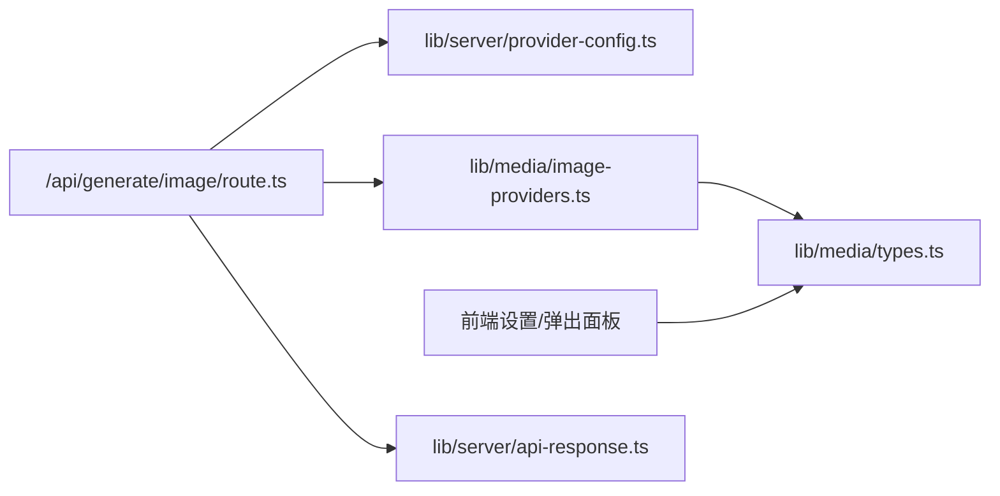

# 图像生成

<cite>
**本文引用的文件**
- [app/api/generate/image/route.ts](file://app/api/generate/image/route.ts)
- [lib/media/image-providers.ts](file://lib/media/image-providers.ts)
- [lib/media/types.ts](file://lib/media/types.ts)
- [lib/server/provider-config.ts](file://lib/server/provider-config.ts)
- [lib/server/api-response.ts](file://lib/server/api-response.ts)
- [components/settings/image-settings.tsx](file://components/settings/image-settings.tsx)
- [components/generation/media-popover.tsx](file://components/generation/media-popover.tsx)
- [components/generation/generating-progress.tsx](file://components/generation/generating-progress.tsx)
- [lib/storage/index.ts](file://lib/storage/index.ts)
</cite>

## 目录
1. [简介](#简介)
2. [项目结构](#项目结构)
3. [核心组件](#核心组件)
4. [架构总览](#架构总览)
5. [详细组件分析](#详细组件分析)
6. [依赖关系分析](#依赖关系分析)
7. [性能考量](#性能考量)
8. [故障排查指南](#故障排查指南)
9. [结论](#结论)
10. [附录](#附录)

## 简介
本章节概述 OpenMAIC 的图像生成功能：从接口设计到服务端集成、配置与校验、前端交互与状态反馈，以及在教学场景中的应用建议。重点覆盖以下方面：
- 图像生成 API 的请求/响应规范、参数与错误码
- 与多提供商（Seedream、Qwen Image、Nano Banana）的适配机制
- 分辨率、风格、质量等配置项的来源与约束
- 前端“媒体弹出面板”与“生成进度”组件的协作
- 教学应用场景（概念图解、实验演示、创意展示）的实践建议
- 质量优化与存储管理策略

## 项目结构
图像生成功能涉及三层：
- 接口层：Next.js API 路由负责接收请求、解析头部与请求体、调用生成器并返回统一响应
- 服务层：媒体生成服务根据提供商 ID 路由到具体适配器，完成鉴权与调用
- 配置层：服务端配置加载与解析，支持 YAML + 环境变量优先级

图表来源
- [app/api/generate/image/route.ts:29-78](file://app/api/generate/image/route.ts#L29-L78)
- [lib/server/provider-config.ts:337-348](file://lib/server/provider-config.ts#L337-L348)
- [lib/media/image-providers.ts:89-103](file://lib/media/image-providers.ts#L89-L103)

章节来源
- [app/api/generate/image/route.ts:1-79](file://app/api/generate/image/route.ts#L1-L79)
- [lib/media/image-providers.ts:1-113](file://lib/media/image-providers.ts#L1-L113)
- [lib/server/provider-config.ts:1-398](file://lib/server/provider-config.ts#L1-L398)

## 核心组件
- 图像生成 API 路由：负责参数校验、头部解析、提供商密钥与基础地址解析、尺寸推导、调用生成器与错误处理
- 图像生成服务：根据提供商 ID 调用对应适配器；提供尺寸换算工具
- 类型系统：统一定义提供商 ID、配置、生成选项与结果结构，扩展性强
- 服务端配置：支持 YAML + 环境变量，优先级与回退策略明确
- 前端设置与弹出面板：提供 API Key、Base URL、模型列表与连通性测试
- 生成进度组件：用于课堂生成流程的状态可视化

章节来源
- [app/api/generate/image/route.ts:29-78](file://app/api/generate/image/route.ts#L29-L78)
- [lib/media/image-providers.ts:89-113](file://lib/media/image-providers.ts#L89-L113)
- [lib/media/types.ts:66-169](file://lib/media/types.ts#L66-L169)
- [lib/server/provider-config.ts:337-348](file://lib/server/provider-config.ts#L337-L348)
- [components/settings/image-settings.tsx:64-100](file://components/settings/image-settings.tsx#L64-L100)
- [components/generation/generating-progress.tsx:57-141](file://components/generation/generating-progress.tsx#L57-L141)

## 架构总览
下图展示了从客户端到外部提供商的整体调用链路与关键决策点。

图表来源
- [app/api/generate/image/route.ts:29-78](file://app/api/generate/image/route.ts#L29-L78)
- [lib/server/provider-config.ts:337-348](file://lib/server/provider-config.ts#L337-L348)
- [lib/media/image-providers.ts:89-103](file://lib/media/image-providers.ts#L89-L103)

## 详细组件分析

### API 路由：/api/generate/image
职责与流程要点：
- 必填字段校验：要求提供 prompt
- 头部参数解析：提供商 ID、API Key、Base URL、模型 ID
- 服务端密钥与地址解析：若客户端未提供，则回退至服务端配置
- 尺寸推导：当仅提供比例时，使用工具函数换算为像素宽高
- 错误处理：敏感内容拦截、通用异常捕获与统一错误码返回

图表来源
- [app/api/generate/image/route.ts:29-78](file://app/api/generate/image/route.ts#L29-L78)
- [lib/server/api-response.ts:26-45](file://lib/server/api-response.ts#L26-L45)

章节来源
- [app/api/generate/image/route.ts:29-78](file://app/api/generate/image/route.ts#L29-L78)
- [lib/server/api-response.ts:1-46](file://lib/server/api-response.ts#L1-L46)

### 图像生成服务与提供商适配
- 提供商注册：统一在注册表中声明提供商元数据（名称、图标、默认地址、模型、支持的比例）
- 生成分发：根据提供商 ID 调用对应适配器
- 连通性测试：为每个提供商提供独立的连通性测试函数
- 比例转尺寸：提供比例到像素的换算工具

图表来源
- [lib/media/image-providers.ts:16-113](file://lib/media/image-providers.ts#L16-L113)
- [lib/media/types.ts:84-169](file://lib/media/types.ts#L84-L169)

章节来源
- [lib/media/image-providers.ts:16-113](file://lib/media/image-providers.ts#L16-L113)
- [lib/media/types.ts:66-169](file://lib/media/types.ts#L66-L169)

### 服务端提供商配置
- 支持来源：YAML 文件（主）、环境变量（备）
- 解析规则：YAML 默认值 + 环境变量覆盖
- 图像提供商解析：提供 API Key 与 Base URL 的解析函数
- 日志统计：加载后输出各模块提供商数量

图表来源
- [lib/server/provider-config.ts:101-168](file://lib/server/provider-config.ts#L101-L168)
- [lib/server/provider-config.ts:337-348](file://lib/server/provider-config.ts#L337-L348)

章节来源
- [lib/server/provider-config.ts:1-398](file://lib/server/provider-config.ts#L1-L398)

### 前端设置与弹出面板
- 设置页：显示/编辑 API Key、Base URL；提供“连通性测试”按钮与状态反馈
- 媒体弹出面板：集中开关“图像/视频/TTS/ASR”，选择提供商与模型，支持预览与速度调节
- 生成进度：展示大纲生成、首页生成等里程碑状态与错误信息

图表来源
- [components/generation/media-popover.tsx:74-448](file://components/generation/media-popover.tsx#L74-L448)
- [components/settings/image-settings.tsx:72-100](file://components/settings/image-settings.tsx#L72-L100)

章节来源
- [components/settings/image-settings.tsx:1-339](file://components/settings/image-settings.tsx#L1-L339)
- [components/generation/media-popover.tsx:1-568](file://components/generation/media-popover.tsx#L1-L568)
- [components/generation/generating-progress.tsx:1-141](file://components/generation/generating-progress.tsx#L1-L141)

## 依赖关系分析
- 路由依赖服务端配置解析与生成服务
- 生成服务依赖提供商注册表与适配器
- 前端设置依赖全局设置存储与类型系统
- 统一响应封装被路由复用

图表来源
- [app/api/generate/image/route.ts:18-23](file://app/api/generate/image/route.ts#L18-L23)
- [lib/media/image-providers.ts:5-11](file://lib/media/image-providers.ts#L5-L11)
- [lib/media/types.ts:1-60](file://lib/media/types.ts#L1-L60)
- [lib/server/provider-config.ts:1-20](file://lib/server/provider-config.ts#L1-L20)
- [lib/server/api-response.ts:1-20](file://lib/server/api-response.ts#L1-L20)

章节来源
- [app/api/generate/image/route.ts:18-23](file://app/api/generate/image/route.ts#L18-L23)
- [lib/media/image-providers.ts:5-11](file://lib/media/image-providers.ts#L5-L11)
- [lib/media/types.ts:1-60](file://lib/media/types.ts#L1-L60)
- [lib/server/provider-config.ts:1-20](file://lib/server/provider-config.ts#L1-L20)
- [lib/server/api-response.ts:1-20](file://lib/server/api-response.ts#L1-L20)

## 性能考量
- 超时限制：API 路由设置最大执行时长，避免长时间占用资源
- 异步任务模式：类型系统预留异步任务适配器接口，便于对接需要轮询的任务式提供商
- 尺寸换算：在仅提供比例时自动计算像素尺寸，减少前端重复逻辑
- 缓存与回退：服务端配置支持环境变量覆盖，便于快速切换与降级

章节来源
- [app/api/generate/image/route.ts:27-27](file://app/api/generate/image/route.ts#L27-L27)
- [lib/media/types.ts:294-321](file://lib/media/types.ts#L294-L321)
- [lib/media/image-providers.ts:105-113](file://lib/media/image-providers.ts#L105-L113)
- [lib/server/provider-config.ts:139-168](file://lib/server/provider-config.ts#L139-L168)

## 故障排查指南
常见错误与定位建议：
- 缺少必要字段：检查请求体是否包含提示词
- 缺少 API Key：确认客户端传入或服务端配置是否存在
- 内容安全拦截：当返回敏感内容相关错误时，调整提示词或负向提示
- 内部错误：查看服务端日志，确认提供商调用是否异常

章节来源
- [app/api/generate/image/route.ts:33-77](file://app/api/generate/image/route.ts#L33-L77)
- [lib/server/api-response.ts:3-15](file://lib/server/api-response.ts#L3-L15)

## 结论
OpenMAIC 的图像生成功能通过清晰的分层设计实现了“接口层—服务层—配置层”的解耦：接口层负责契约与错误处理，服务层聚焦提供商适配与参数转换，配置层提供灵活的密钥与地址解析。配合前端设置与弹出面板，用户可便捷地进行提供商选择、模型配置与连通性测试。该架构易于扩展新提供商，适合在教学场景中快速落地多样化图像生成需求。

## 附录

### 接口设计与参数说明
- 端点：POST /api/generate/image
- 请求头：
  - x-image-provider：提供商 ID（默认 seedream）
  - x-api-key：可选，客户端密钥（优先于服务端）
  - x-base-url：可选，客户端基础地址（优先于服务端）
  - x-image-model：可选，模型 ID
- 请求体：
  - prompt：必填，文本提示词
  - negativePrompt：可选，负向提示
  - width/height：可选，像素宽高
  - aspectRatio：可选，比例（16:9/4:3/1:1/9:16）
  - style：可选，艺术风格（需提供商支持）
- 响应：
  - 成功：包含生成结果（URL 或 base64），以及宽高
  - 失败：统一错误码与错误信息

章节来源
- [app/api/generate/image/route.ts:1-16](file://app/api/generate/image/route.ts#L1-L16)
- [lib/media/types.ts:139-169](file://lib/media/types.ts#L139-L169)
- [lib/server/api-response.ts:19-45](file://lib/server/api-response.ts#L19-L45)

### 配置选项与质量控制
- 分辨率设置：显式指定宽高或通过比例换算
- 风格选择：由提供商支持决定，类型系统预留风格字段
- 质量控制：通过选择更高分辨率上限与更合适的提供商模型提升质量
- 存储与托管：当前存储提供者为占位实现，建议结合业务需求接入云存储或本地持久化

章节来源
- [lib/media/types.ts:105-114](file://lib/media/types.ts#L105-L114)
- [lib/media/image-providers.ts:105-113](file://lib/media/image-providers.ts#L105-L113)
- [lib/storage/index.ts:1-14](file://lib/storage/index.ts#L1-L14)

### 在课堂内容中的应用示例
- 概念图解：使用比例与风格参数生成符合课程主题的插图
- 实验演示：基于实验步骤生成示意图片，辅助讲解
- 创意展示：通过负向提示排除不相关内容，确保内容安全

章节来源
- [components/generation/media-popover.tsx:304-340](file://components/generation/media-popover.tsx#L304-L340)
- [components/generation/generating-progress.tsx:57-141](file://components/generation/generating-progress.tsx#L57-L141)